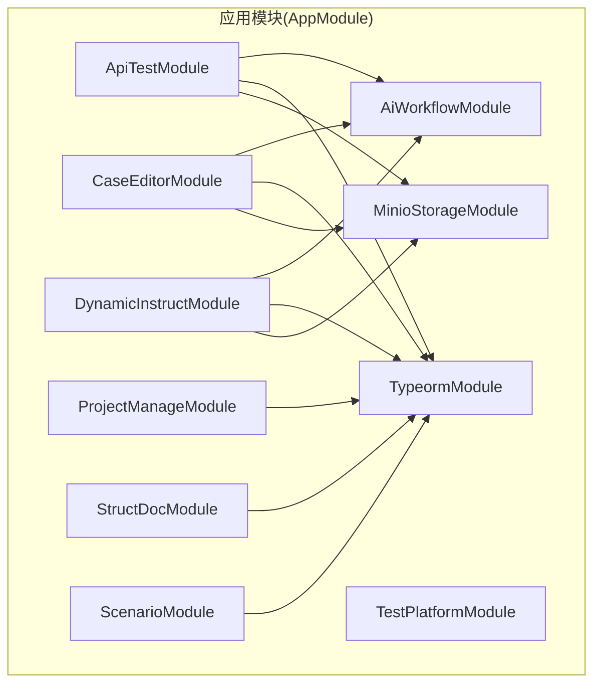
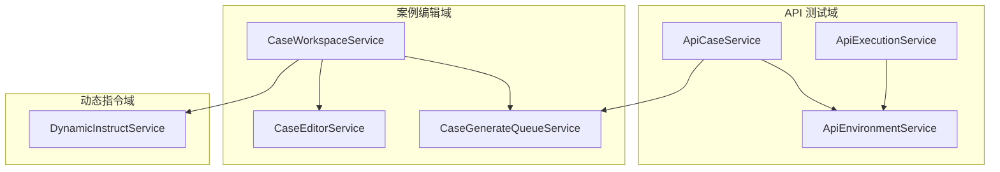
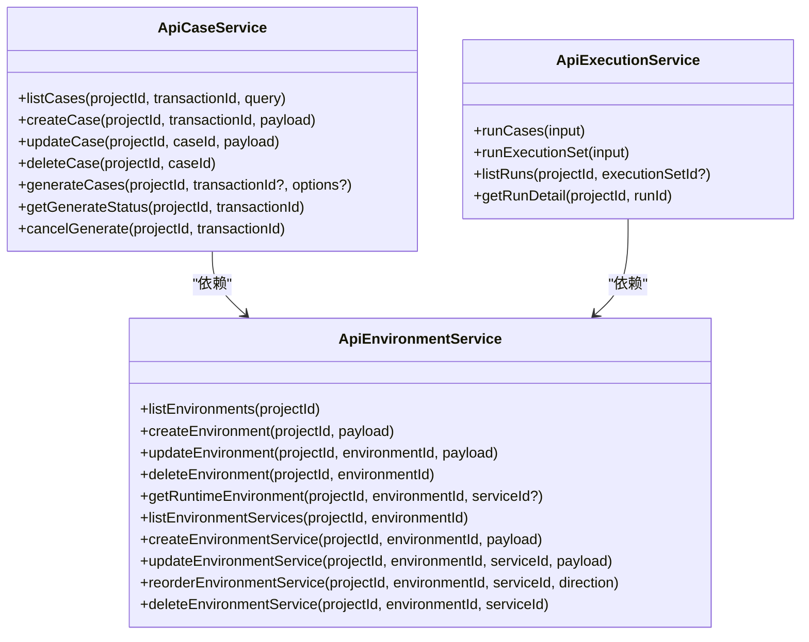
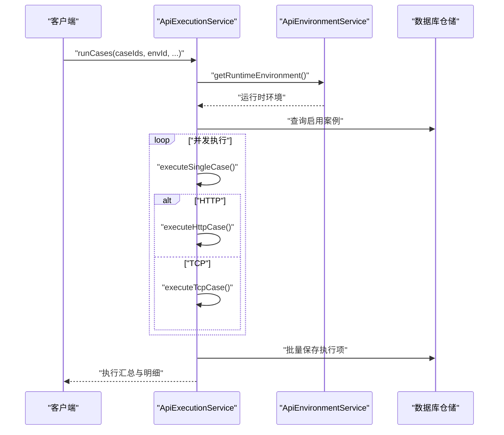
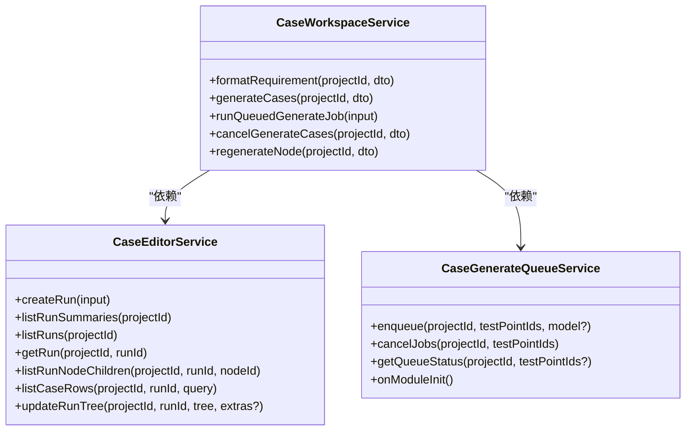
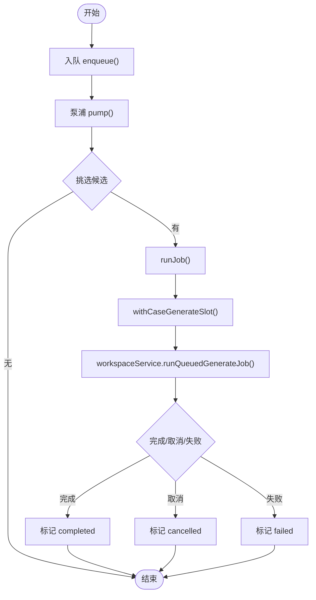
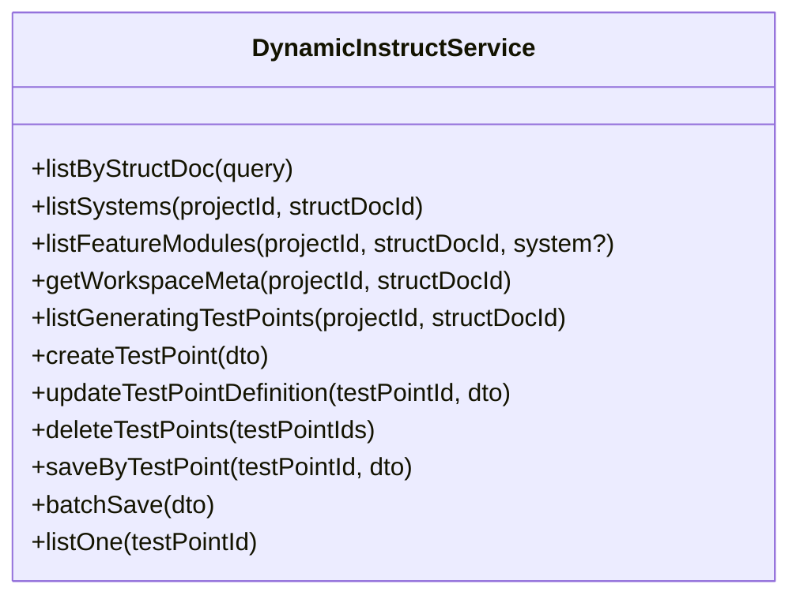
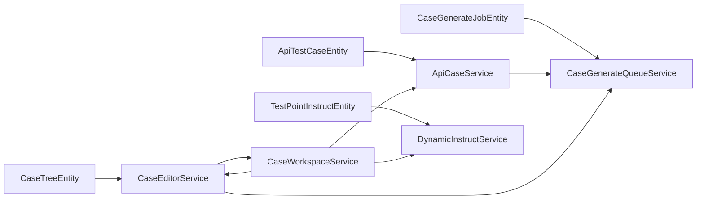

# 业务服务层

<cite>
**本文引用的文件**
- [apps/api/src/modules/api-test/service/api-case.service.ts](file://apps/api/src/modules/api-test/service/api-case.service.ts)
- [apps/api/src/modules/api-test/service/api-execution.service.ts](file://apps/api/src/modules/api-test/service/api-execution.service.ts)
- [apps/api/src/modules/api-test/service/api-environment.service.ts](file://apps/api/src/modules/api-test/service/api-environment.service.ts)
- [apps/api/src/modules/case-editor/service/case-editor.service.ts](file://apps/api/src/modules/case-editor/service/case-editor.service.ts)
- [apps/api/src/modules/case-editor/service/case-generate-queue.service.ts](file://apps/api/src/modules/case-editor/service/case-generate-queue.service.ts)
- [apps/api/src/modules/case-editor/service/case-workspace.service.ts](file://apps/api/src/modules/case-editor/service/case-workspace.service.ts)
- [apps/api/src/modules/dynamic-instruct/service/dynamic-instruct.service.ts](file://apps/api/src/modules/dynamic-instruct/service/dynamic-instruct.service.ts)
- [apps/api/src/modules/api-test/entity/api-test-case.entity.ts](file://apps/api/src/modules/api-test/entity/api-test-case.entity.ts)
- [apps/api/src/modules/case-editor/entity/case-generate-job.entity.ts](file://apps/api/src/modules/case-editor/entity/case-generate-job.entity.ts)
- [apps/api/src/app.module.ts](file://apps/api/src/app.module.ts)
</cite>

## 目录
1. [引言](#引言)
2. [项目结构](#项目结构)
3. [核心组件](#核心组件)
4. [架构总览](#架构总览)
5. [详细组件分析](#详细组件分析)
6. [依赖关系分析](#依赖关系分析)
7. [性能考量](#性能考量)
8. [故障排查指南](#故障排查指南)
9. [结论](#结论)
10. [附录](#附录)

## 引言
本技术指南聚焦于业务服务层，围绕三大核心业务域展开：API 测试服务、案例编辑器服务、动态指令服务。文档系统性阐述服务职责、依赖注入与事务管理、服务间协作机制、数据一致性保障与错误处理策略，并给出高内聚低耦合的架构设计建议与单元/集成测试最佳实践。

## 项目结构
- 应用采用 NestJS 模块化组织，根模块集中注册各业务模块与通用基础设施。
- 业务模块划分清晰：api-test、case-editor、dynamic-instruct、project-manage、struct-doc、scenario 等。
- 服务层以“领域服务”为核心，控制器仅做参数校验与路由转发，业务逻辑集中在服务中。

**图表来源**
- [apps/api/src/app.module.ts:21-39](file://apps/api/src/app.module.ts#L21-L39)

**章节来源**
- [apps/api/src/app.module.ts:1-48](file://apps/api/src/app.module.ts#L1-L48)

## 核心组件
- API 测试服务族：案例管理、环境管理、执行调度、报告统计。
- 案例编辑器服务族：案例树持久化、生成队列、工作区编排、合并与增量更新。
- 动态指令服务族：测试要点与场景提示词/自然语言约束的查询与保存。

这些组件通过依赖注入解耦，通过统一的审计上下文与作用域过滤保障数据安全与一致性。

**章节来源**
- [apps/api/src/modules/api-test/service/api-case.service.ts:38-58](file://apps/api/src/modules/api-test/service/api-case.service.ts#L38-L58)
- [apps/api/src/modules/case-editor/service/case-editor.service.ts:54-66](file://apps/api/src/modules/case-editor/service/case-editor.service.ts#L54-L66)
- [apps/api/src/modules/dynamic-instruct/service/dynamic-instruct.service.ts:52-65](file://apps/api/src/modules/dynamic-instruct/service/dynamic-instruct.service.ts#L52-L65)

## 架构总览
业务服务层遵循“服务即领域”的设计原则，控制器只负责输入输出与简单校验，复杂业务由服务编排，跨表事务通过 TypeORM 的事务管理器保证一致性，外部依赖通过模块化注入与延迟引用降低耦合。

**图表来源**
- [apps/api/src/modules/api-test/service/api-case.service.ts:55-57](file://apps/api/src/modules/api-test/service/api-case.service.ts#L55-L57)
- [apps/api/src/modules/case-editor/service/case-workspace.service.ts:95-99](file://apps/api/src/modules/case-editor/service/case-workspace.service.ts#L95-L99)
- [apps/api/src/modules/case-editor/service/case-generate-queue.service.ts:84-85](file://apps/api/src/modules/case-editor/service/case-generate-queue.service.ts#L84-L85)
- [apps/api/src/modules/dynamic-instruct/service/dynamic-instruct.service.ts:55-64](file://apps/api/src/modules/dynamic-instruct/service/dynamic-instruct.service.ts#L55-L64)

## 详细组件分析

### API 测试服务
- ApiCaseService：负责案例的创建、更新、删除、分页查询、AI 生成与队列状态查询；内置案例有效性校验与端点/交易码归属校验。
- ApiEnvironmentService：环境与服务的生命周期管理，运行时环境拼装（含加密密钥解密、服务连接字段解析）。
- ApiExecutionService：并发执行案例集合，支持 HTTP/TCP，断言与结果落库，执行集联动。

**图表来源**
- [apps/api/src/modules/api-test/service/api-case.service.ts:38-58](file://apps/api/src/modules/api-test/service/api-case.service.ts#L38-L58)
- [apps/api/src/modules/api-test/service/api-environment.service.ts:24-30](file://apps/api/src/modules/api-test/service/api-environment.service.ts#L24-L30)
- [apps/api/src/modules/api-test/service/api-execution.service.ts:54-64](file://apps/api/src/modules/api-test/service/api-execution.service.ts#L54-L64)

**章节来源**
- [apps/api/src/modules/api-test/service/api-case.service.ts:60-215](file://apps/api/src/modules/api-test/service/api-case.service.ts#L60-L215)
- [apps/api/src/modules/api-test/service/api-environment.service.ts:98-142](file://apps/api/src/modules/api-test/service/api-environment.service.ts#L98-L142)
- [apps/api/src/modules/api-test/service/api-execution.service.ts:66-182](file://apps/api/src/modules/api-test/service/api-execution.service.ts#L66-L182)

#### API 执行序列（HTTP/TCP）

**图表来源**
- [apps/api/src/modules/api-test/service/api-execution.service.ts:66-143](file://apps/api/src/modules/api-test/service/api-execution.service.ts#L66-L143)
- [apps/api/src/modules/api-test/service/api-environment.service.ts:98-142](file://apps/api/src/modules/api-test/service/api-environment.service.ts#L98-L142)

### 案例编辑器服务
- CaseEditorService：案例树的创建/更新/懒加载、运行记录的分页查询与摘要、树差异计算与批量持久化。
- CaseGenerateQueueService：案例生成队列的入队、出队、并发与公平调度、中断恢复与 ETA 计算。
- CaseWorkspaceService：工作区编排，聚合需求格式化、动态指令、生成流水线、树合并与状态回退。

**图表来源**
- [apps/api/src/modules/case-editor/service/case-editor.service.ts:54-66](file://apps/api/src/modules/case-editor/service/case-editor.service.ts#L54-L66)
- [apps/api/src/modules/case-editor/service/case-generate-queue.service.ts:73-86](file://apps/api/src/modules/case-editor/service/case-generate-queue.service.ts#L73-L86)
- [apps/api/src/modules/case-editor/service/case-workspace.service.ts:80-100](file://apps/api/src/modules/case-editor/service/case-workspace.service.ts#L80-L100)

**章节来源**
- [apps/api/src/modules/case-editor/service/case-editor.service.ts:68-252](file://apps/api/src/modules/case-editor/service/case-editor.service.ts#L68-L252)
- [apps/api/src/modules/case-editor/service/case-generate-queue.service.ts:162-230](file://apps/api/src/modules/case-editor/service/case-generate-queue.service.ts#L162-L230)
- [apps/api/src/modules/case-editor/service/case-workspace.service.ts:197-277](file://apps/api/src/modules/case-editor/service/case-workspace.service.ts#L197-L277)

#### 案例生成队列流程

**图表来源**
- [apps/api/src/modules/case-editor/service/case-generate-queue.service.ts:340-522](file://apps/api/src/modules/case-editor/service/case-generate-queue.service.ts#L340-L522)

### 动态指令服务
- DynamicInstructService：测试要点的分页列表、系统/模块维度筛选、工作区元数据、生成中要点恢复、新增/更新/删除测试要点、保存动态指令（状态、自然语言、提示词选择）与批量保存。

**图表来源**
- [apps/api/src/modules/dynamic-instruct/service/dynamic-instruct.service.ts:52-65](file://apps/api/src/modules/dynamic-instruct/service/dynamic-instruct.service.ts#L52-L65)

**章节来源**
- [apps/api/src/modules/dynamic-instruct/service/dynamic-instruct.service.ts:70-140](file://apps/api/src/modules/dynamic-instruct/service/dynamic-instruct.service.ts#L70-L140)
- [apps/api/src/modules/dynamic-instruct/service/dynamic-instruct.service.ts:323-395](file://apps/api/src/modules/dynamic-instruct/service/dynamic-instruct.service.ts#L323-L395)

## 依赖关系分析
- 依赖注入：服务通过 @InjectRepository 注入仓储，通过 forwardRef 处理循环依赖（如 ApiCaseService 对 CaseGenerateQueueService 的注入），根模块集中导入各业务模块。
- 事务管理：CaseEditorService 在创建/更新运行时使用 DataSource.transaction 包裹，确保树与元数据的一致写入；ApiExecutionService 通过批量保存与最终汇总更新保证执行结果一致性。
- 数据一致性：统一的审计字段注入与用户作用域过滤贯穿各服务，确保 CRUD 操作仅限于授权范围。

**图表来源**
- [apps/api/src/modules/api-test/entity/api-test-case.entity.ts:21-99](file://apps/api/src/modules/api-test/entity/api-test-case.entity.ts#L21-L99)
- [apps/api/src/modules/case-editor/entity/case-generate-job.entity.ts:23-74](file://apps/api/src/modules/case-editor/entity/case-generate-job.entity.ts#L23-L74)
- [apps/api/src/modules/api-test/service/api-case.service.ts:42-57](file://apps/api/src/modules/api-test/service/api-case.service.ts#L42-L57)
- [apps/api/src/modules/case-editor/service/case-editor.service.ts:56-65](file://apps/api/src/modules/case-editor/service/case-editor.service.ts#L56-L65)
- [apps/api/src/modules/dynamic-instruct/service/dynamic-instruct.service.ts:55-64](file://apps/api/src/modules/dynamic-instruct/service/dynamic-instruct.service.ts#L55-L64)

**章节来源**
- [apps/api/src/modules/case-editor/service/case-editor.service.ts:86-108](file://apps/api/src/modules/case-editor/service/case-editor.service.ts#L86-L108)
- [apps/api/src/modules/api-test/service/api-execution.service.ts:100-142](file://apps/api/src/modules/api-test/service/api-execution.service.ts#L100-L142)

## 性能考量
- 并发控制：ApiExecutionService 的并发度限制与默认值配置，避免对目标服务造成瞬时压力；CaseGenerateQueueService 的全局并发与用户级并发上限，结合公平调度算法，提升吞吐与公平性。
- 批量写入：CaseEditorService 的树差异计算与分批插入/更新，减少往返与锁竞争；分页查询与懒加载降低大对象传输成本。
- 运行时环境拼装：ApiEnvironmentService 在运行时一次性组装，避免重复 IO；编码与头部处理在执行前完成，减少异常分支开销。
- 队列指标：CaseGenerateQueueService 提供 ETA 估算与等待人数统计，便于前端优化用户体验与资源预估。

[本节为通用指导，无需特定文件引用]

## 故障排查指南
- 常见异常类型与定位
  - 参数校验类：如缺少必要字段、非法状态转换，优先检查 DTO 与服务前置校验逻辑。
  - 资源不存在：如环境/服务/测试要点/运行记录缺失，检查作用域过滤与存在性校验。
  - 并发冲突：如生成任务重复入队或状态不一致，核查队列状态机与取消注册。
- 日志与审计
  - 服务内部使用 Logger 输出关键路径日志，便于问题复现。
  - 审计字段统一注入，便于追踪操作人与时间线。
- 关键排查步骤
  - API 测试执行：确认运行时环境拼装正确、服务可达、编码设置合理；查看执行项快照与断言结果。
  - 案例生成：核对队列状态、AI 配置、取消信号与回退状态；检查树合并模式与源测试要点集合。
  - 动态指令：验证测试要点定义完整性、提示词选择有效性与状态流转。

**章节来源**
- [apps/api/src/modules/api-test/service/api-execution.service.ts:286-331](file://apps/api/src/modules/api-test/service/api-execution.service.ts#L286-L331)
- [apps/api/src/modules/case-editor/service/case-generate-queue.service.ts:477-522](file://apps/api/src/modules/case-editor/service/case-generate-queue.service.ts#L477-L522)
- [apps/api/src/modules/dynamic-instruct/service/dynamic-instruct.service.ts:323-395](file://apps/api/src/modules/dynamic-instruct/service/dynamic-instruct.service.ts#L323-L395)

## 结论
业务服务层通过清晰的职责划分、严格的依赖注入与事务管理、完善的队列与并发控制，实现了高内聚、低耦合的架构。配合统一的审计与作用域过滤，保障了数据一致性与安全性。建议在后续迭代中持续完善监控与告警、引入更细粒度的幂等与重试策略，并加强单元/集成测试覆盖。

[本节为总结性内容，无需特定文件引用]

## 附录

### 业务服务实现示例（路径指引）
- 案例创建与校验
  - [ApiCaseService.createCase:91-141](file://apps/api/src/modules/api-test/service/api-case.service.ts#L91-L141)
- 运行时环境拼装
  - [ApiEnvironmentService.getRuntimeEnvironment:98-142](file://apps/api/src/modules/api-test/service/api-environment.service.ts#L98-L142)
- 并发执行与断言
  - [ApiExecutionService.runCases:66-143](file://apps/api/src/modules/api-test/service/api-execution.service.ts#L66-L143)
- 案例树持久化与差异计算
  - [CaseEditorService.createRun:68-108](file://apps/api/src/modules/case-editor/service/case-editor.service.ts#L68-L108)
  - [CaseEditorService.applyTreeDiff:254-288](file://apps/api/src/modules/case-editor/service/case-editor.service.ts#L254-L288)
- 生成队列入队与调度
  - [CaseGenerateQueueService.enqueue:162-206](file://apps/api/src/modules/case-editor/service/case-generate-queue.service.ts#L162-L206)
  - [CaseGenerateQueueService.claimNextJob:434-475](file://apps/api/src/modules/case-editor/service/case-generate-queue.service.ts#L434-L475)
- 动态指令保存
  - [DynamicInstructService.saveByTestPoint:323-383](file://apps/api/src/modules/dynamic-instruct/service/dynamic-instruct.service.ts#L323-L383)

### 单元测试与集成测试最佳实践
- 单元测试
  - 使用 @nestjs/testing 的 Test.createTestingModule 构造最小依赖集，Mock 外部服务与仓储。
  - 针对边界条件与异常路径编写用例，如空输入、越权访问、并发冲突。
- 集成测试
  - 基于 TestModule 与真实数据库（或内存数据库）验证事务与一致性。
  - 覆盖关键业务流程：案例生成队列、执行集联动、树合并与懒加载。
- 断言与可观测性
  - 对关键状态变更与错误信息进行断言；结合日志与审计字段定位问题。

[本节为通用指导，无需特定文件引用]