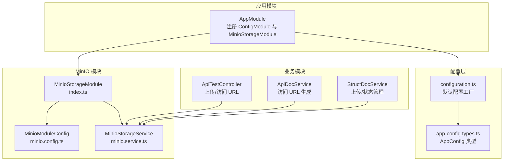
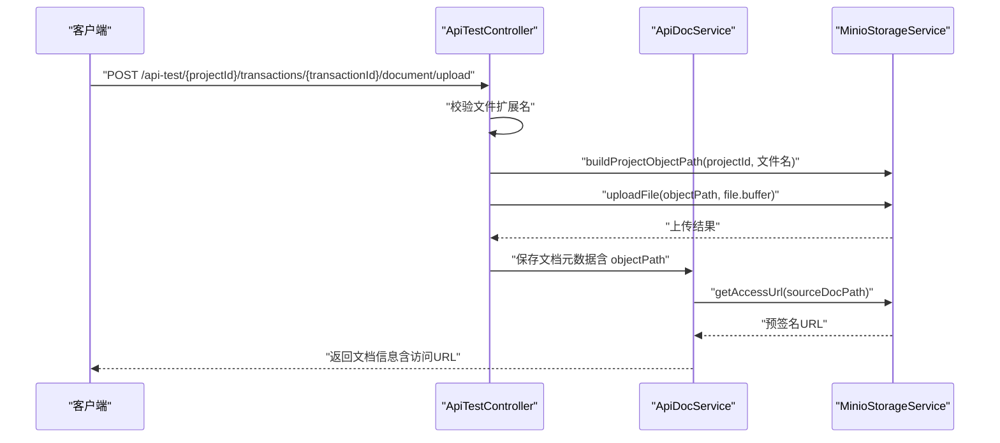
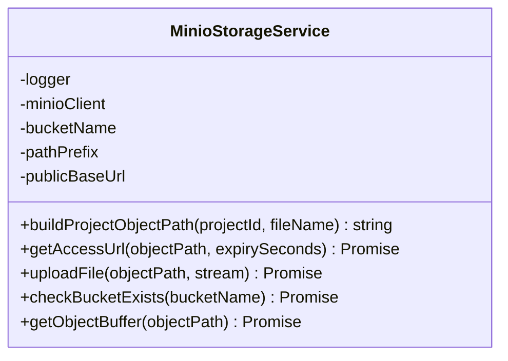
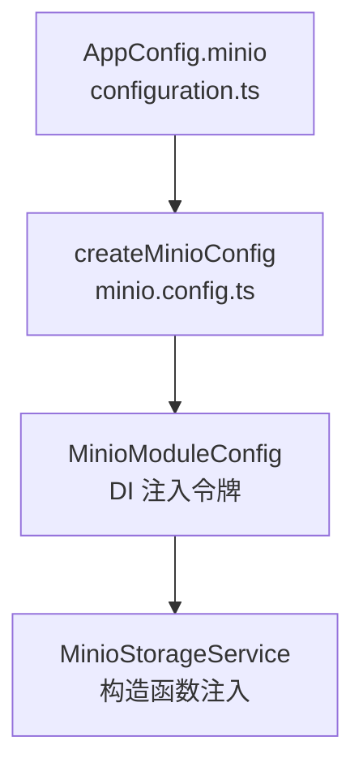
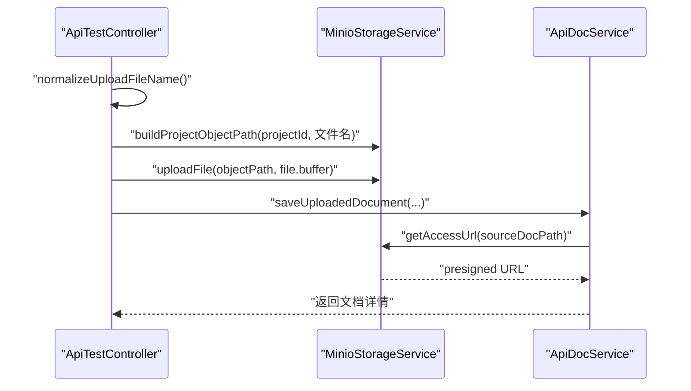
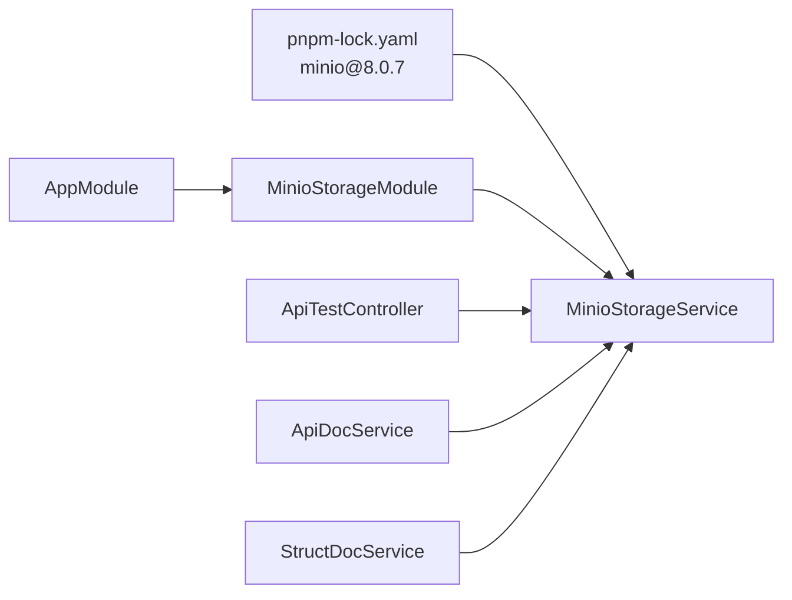

# 存储服务

<cite>
**本文引用的文件**
- [apps/api/src/common/minio/service/minio.service.ts](file://apps/api/src/common/minio/service/minio.service.ts)
- [apps/api/src/common/minio/minio.config.ts](file://apps/api/src/common/minio/minio.config.ts)
- [apps/api/src/common/minio/index.ts](file://apps/api/src/common/minio/index.ts)
- [apps/api/src/config/configuration.ts](file://apps/api/src/config/configuration.ts)
- [apps/api/src/config/app-config.types.ts](file://apps/api/src/config/app-config.types.ts)
- [apps/api/src/app.module.ts](file://apps/api/src/app.module.ts)
- [apps/api/src/modules/api-test/controller/api-test.controller.ts](file://apps/api/src/modules/api-test/controller/api-test.controller.ts)
- [apps/api/src/modules/api-test/service/api-doc.service.ts](file://apps/api/src/modules/api-test/service/api-doc.service.ts)
- [apps/api/src/modules/struct-doc/service/struct-doc.service.ts](file://apps/api/src/modules/struct-doc/service/struct-doc.service.ts)
- [pnpm-lock.yaml](file://pnpm-lock.yaml)
</cite>

## 目录
1. [简介](#简介)
2. [项目结构](#项目结构)
3. [核心组件](#核心组件)
4. [架构总览](#架构总览)
5. [详细组件分析](#详细组件分析)
6. [依赖关系分析](#依赖关系分析)
7. [性能考量](#性能考量)
8. [故障排查指南](#故障排查指南)
9. [结论](#结论)
10. [附录](#附录)

## 简介
本技术文档围绕存储服务展开，重点介绍基于 MinIO 的对象存储集成架构、配置管理与连接方式、文件上传/下载/删除与元数据管理流程，并阐述存储策略、安全配置与访问控制的实现现状与改进建议。文档同时提供可落地的实现示例与性能优化建议，帮助构建稳定可靠的文件存储系统。

## 项目结构
MinIO 存储能力以 NestJS 模块形式提供，核心位于 common/minio 目录，配合全局 ConfigModule 从环境变量加载配置，并在根模块中统一注册。业务模块通过依赖注入使用 MinioStorageService 提供的能力。

**图表来源**
- [apps/api/src/app.module.ts:21-38](file://apps/api/src/app.module.ts#L21-L38)
- [apps/api/src/config/configuration.ts:7-48](file://apps/api/src/config/configuration.ts#L7-L48)
- [apps/api/src/config/app-config.types.ts:6-44](file://apps/api/src/config/app-config.types.ts#L6-L44)
- [apps/api/src/common/minio/index.ts:9-17](file://apps/api/src/common/minio/index.ts#L9-L17)
- [apps/api/src/common/minio/minio.config.ts:25-37](file://apps/api/src/common/minio/minio.config.ts#L25-L37)
- [apps/api/src/common/minio/service/minio.service.ts:20-33](file://apps/api/src/common/minio/service/minio.service.ts#L20-L33)
- [apps/api/src/modules/api-test/controller/api-test.controller.ts:61-72](file://apps/api/src/modules/api-test/controller/api-test.controller.ts#L61-L72)
- [apps/api/src/modules/api-test/service/api-doc.service.ts:8-16](file://apps/api/src/modules/api-test/service/api-doc.service.ts#L8-L16)
- [apps/api/src/modules/struct-doc/service/struct-doc.service.ts:58-71](file://apps/api/src/modules/struct-doc/service/struct-doc.service.ts#L58-L71)

**章节来源**
- [apps/api/src/app.module.ts:21-38](file://apps/api/src/app.module.ts#L21-L38)
- [apps/api/src/common/minio/index.ts:9-17](file://apps/api/src/common/minio/index.ts#L9-L17)

## 核心组件
- MinioStorageModule：提供 MinIO 配置注入令牌与 MinioStorageService 实例，作为可复用的基础设施模块。
- MinioStorageService：封装桶检查、对象路径生成、上传、预签名 URL 生成与对象读取为 Buffer 等能力。
- 配置体系：AppConfig 与 configuration.ts 提供默认配置，minio.config.ts 将其映射为 MinioModuleConfig 并通过依赖注入提供给服务。

关键职责与边界
- 路径策略：按“日期/项目ID/随机后缀文件名”组织对象路径，避免同名冲突并便于归档。
- 访问控制：通过预签名 URL 控制访问时效；当前未实现桶级/对象级 ACL 策略。
- 连接方式：直接使用 Minio 客户端实例，未启用连接池；适合单实例或低并发场景。

**章节来源**
- [apps/api/src/common/minio/service/minio.service.ts:40-50](file://apps/api/src/common/minio/service/minio.service.ts#L40-L50)
- [apps/api/src/common/minio/service/minio.service.ts:64-80](file://apps/api/src/common/minio/service/minio.service.ts#L64-L80)
- [apps/api/src/common/minio/service/minio.service.ts:87-107](file://apps/api/src/common/minio/service/minio.service.ts#L87-L107)
- [apps/api/src/common/minio/service/minio.service.ts:113-127](file://apps/api/src/common/minio/service/minio.service.ts#L113-L127)
- [apps/api/src/common/minio/minio.config.ts:25-37](file://apps/api/src/common/minio/minio.config.ts#L25-L37)
- [apps/api/src/config/configuration.ts:26-34](file://apps/api/src/config/configuration.ts#L26-L34)

## 架构总览
MinIO 集成采用“配置工厂 + 模块 + 服务”的分层设计。应用启动时加载环境变量，生成 AppConfig，再映射为 MinioModuleConfig 注入到 MinioStorageService。业务控制器与服务通过依赖注入使用该服务完成文件上传与访问链接生成。

**图表来源**
- [apps/api/src/modules/api-test/controller/api-test.controller.ts:140-166](file://apps/api/src/modules/api-test/controller/api-test.controller.ts#L140-L166)
- [apps/api/src/modules/api-test/service/api-doc.service.ts:214-222](file://apps/api/src/modules/api-test/service/api-doc.service.ts#L214-L222)
- [apps/api/src/common/minio/service/minio.service.ts:40-50](file://apps/api/src/common/minio/service/minio.service.ts#L40-L50)
- [apps/api/src/common/minio/service/minio.service.ts:87-107](file://apps/api/src/common/minio/service/minio.service.ts#L87-L107)
- [apps/api/src/common/minio/service/minio.service.ts:64-80](file://apps/api/src/common/minio/service/minio.service.ts#L64-L80)

## 详细组件分析

### 组件一：MinioStorageService
- 职责
  - 生成对象路径：按日期/项目ID/带随机后缀的文件名组织对象键，避免重名并利于归档。
  - 上传文件：在确认桶存在的前提下执行 putObject。
  - 预签名 URL：为对象生成带过期时间的 GET 链接，便于安全分享。
  - 读取对象：将对象流式读取为 Buffer，便于后续处理。
- 关键点
  - 路径安全：对文件名进行字符清洗，保留中文、英文、数字与常见符号。
  - 错误处理：上传失败会记录日志并抛出错误；预签名 URL 生成失败会返回 undefined 并记录警告。
  - 连接方式：直接构造 Minio.Client，未实现连接池与重试策略。

**图表来源**
- [apps/api/src/common/minio/service/minio.service.ts:13-33](file://apps/api/src/common/minio/service/minio.service.ts#L13-L33)
- [apps/api/src/common/minio/service/minio.service.ts:40-50](file://apps/api/src/common/minio/service/minio.service.ts#L40-L50)
- [apps/api/src/common/minio/service/minio.service.ts:64-80](file://apps/api/src/common/minio/service/minio.service.ts#L64-L80)
- [apps/api/src/common/minio/service/minio.service.ts:87-107](file://apps/api/src/common/minio/service/minio.service.ts#L87-L107)
- [apps/api/src/common/minio/service/minio.service.ts:113-127](file://apps/api/src/common/minio/service/minio.service.ts#L113-L127)

**章节来源**
- [apps/api/src/common/minio/service/minio.service.ts:40-50](file://apps/api/src/common/minio/service/minio.service.ts#L40-L50)
- [apps/api/src/common/minio/service/minio.service.ts:64-80](file://apps/api/src/common/minio/service/minio.service.ts#L64-L80)
- [apps/api/src/common/minio/service/minio.service.ts:87-107](file://apps/api/src/common/minio/service/minio.service.ts#L87-L107)
- [apps/api/src/common/minio/service/minio.service.ts:113-127](file://apps/api/src/common/minio/service/minio.service.ts#L113-L127)

### 组件二：MinioStorageModule 与配置映射
- MinioStorageModule：向容器注册 MinioModuleConfig 注入令牌与 MinioStorageService 实例，并导出两者以便其他模块使用。
- 配置映射：createMinioConfig 将 AppConfig 中的 minio 字段映射为 MinioModuleConfig，包括端点、端口、证书开关、凭证、桶名、路径前缀与公共基础 URL。

**图表来源**
- [apps/api/src/config/configuration.ts:26-34](file://apps/api/src/config/configuration.ts#L26-L34)
- [apps/api/src/common/minio/minio.config.ts:25-37](file://apps/api/src/common/minio/minio.config.ts#L25-L37)
- [apps/api/src/common/minio/index.ts:9-17](file://apps/api/src/common/minio/index.ts#L9-L17)

**章节来源**
- [apps/api/src/common/minio/index.ts:9-17](file://apps/api/src/common/minio/index.ts#L9-L17)
- [apps/api/src/common/minio/minio.config.ts:25-37](file://apps/api/src/common/minio/minio.config.ts#L25-L37)
- [apps/api/src/config/configuration.ts:26-34](file://apps/api/src/config/configuration.ts#L26-L34)

### 组件三：业务使用示例
- 接口测试文档上传：控制器接收 Excel 文件，规范化文件名，调用 MinioStorageService 生成对象路径并上传，随后保存文档元数据。
- 文档访问 URL：服务侧根据源文档对象路径生成预签名 URL，返回给前端用于下载。

**图表来源**
- [apps/api/src/modules/api-test/controller/api-test.controller.ts:140-166](file://apps/api/src/modules/api-test/controller/api-test.controller.ts#L140-L166)
- [apps/api/src/modules/api-test/service/api-doc.service.ts:214-222](file://apps/api/src/modules/api-test/service/api-doc.service.ts#L214-L222)
- [apps/api/src/common/minio/service/minio.service.ts:40-50](file://apps/api/src/common/minio/service/minio.service.ts#L40-L50)
- [apps/api/src/common/minio/service/minio.service.ts:64-80](file://apps/api/src/common/minio/service/minio.service.ts#L64-L80)

**章节来源**
- [apps/api/src/modules/api-test/controller/api-test.controller.ts:140-166](file://apps/api/src/modules/api-test/controller/api-test.controller.ts#L140-L166)
- [apps/api/src/modules/api-test/service/api-doc.service.ts:214-222](file://apps/api/src/modules/api-test/service/api-doc.service.ts#L214-L222)

## 依赖关系分析
- 外部依赖：MinIO 客户端版本 8.0.7，来自 pnpm-lock.yaml。
- 内部依赖：业务模块通过控制器与服务依赖 MinioStorageService；根模块注册 MinioStorageModule 以提供该服务。

**图表来源**
- [pnpm-lock.yaml:5568-5582](file://pnpm-lock.yaml#L5568-L5582)
- [apps/api/src/common/minio/index.ts:9-17](file://apps/api/src/common/minio/index.ts#L9-L17)
- [apps/api/src/app.module.ts:30](file://apps/api/src/app.module.ts#L30)
- [apps/api/src/modules/api-test/controller/api-test.controller.ts:61-72](file://apps/api/src/modules/api-test/controller/api-test.controller.ts#L61-L72)
- [apps/api/src/modules/api-test/service/api-doc.service.ts:8-16](file://apps/api/src/modules/api-test/service/api-doc.service.ts#L8-L16)
- [apps/api/src/modules/struct-doc/service/struct-doc.service.ts:58-71](file://apps/api/src/modules/struct-doc/service/struct-doc.service.ts#L58-L71)

**章节来源**
- [pnpm-lock.yaml:5568-5582](file://pnpm-lock.yaml#L5568-L5582)
- [apps/api/src/common/minio/index.ts:9-17](file://apps/api/src/common/minio/index.ts#L9-L17)
- [apps/api/src/app.module.ts:30](file://apps/api/src/app.module.ts#L30)

## 性能考量
- 连接与并发
  - 当前实现未启用连接池，单实例 Minio 客户端直接复用同一实例。建议在高并发场景引入连接池或负载均衡（如反向代理/多节点 MinIO）。
- 上传与下载
  - 上传采用 putObject，建议结合断点续传与分片上传（若业务允许）以提升大文件稳定性。
  - 下载采用预签名 URL，避免服务端直传带来的内存压力；注意合理设置过期时间。
- 缓存与索引
  - 可在应用层缓存常用对象的预签名 URL，减少重复生成开销。
- 日志与可观测性
  - 建议增加上传/下载耗时、错误率等指标埋点，便于定位性能瓶颈。

[本节为通用性能建议，不直接分析具体文件，故无“章节来源”]

## 故障排查指南
- 桶不存在
  - 现象：上传时报错提示桶不存在。
  - 处理：确保在 MinIO 中创建对应桶，或在服务初始化阶段自动创建。
- 预签名 URL 生成失败
  - 现象：getAccessUrl 返回 undefined 并记录警告。
  - 处理：检查对象路径是否正确、对象是否存在、网络连通性与时间同步。
- 上传失败
  - 现象：uploadFile 抛出错误并记录日志。
  - 处理：检查 MinIO 凭证、网络连通性、磁盘空间与配额限制。
- 文件名乱码
  - 现象：上传文件名为 Latin1 编码导致显示异常。
  - 处理：控制器中已做规范化处理，确保前端上传时保持正确的编码。

**章节来源**
- [apps/api/src/common/minio/service/minio.service.ts:92-106](file://apps/api/src/common/minio/service/minio.service.ts#L92-L106)
- [apps/api/src/common/minio/service/minio.service.ts:74-79](file://apps/api/src/common/minio/service/minio.service.ts#L74-L79)
- [apps/api/src/modules/api-test/controller/api-test.controller.ts:171-177](file://apps/api/src/modules/api-test/controller/api-test.controller.ts#L171-L177)

## 结论
本存储服务以简洁清晰的方式实现了 MinIO 的核心能力：对象路径生成、上传、预签名 URL 与对象读取。配置体系通过环境变量与类型安全的 AppConfig 完成，业务模块通过依赖注入无缝使用。当前实现未包含连接池与细粒度访问控制，建议在生产环境中补充连接池、ACL 策略与监控告警，以满足高可用与高安全性的要求。

## 附录

### 存储策略与安全配置建议
- 存储策略
  - 对象命名：按“日期/项目ID/随机后缀文件名”组织，便于归档与检索。
  - 版本控制：如需回溯，可在 MinIO 启用版本控制并在应用层维护版本元数据。
- 安全配置
  - 凭证管理：使用只读/受限权限的子账号，定期轮换密钥。
  - 访问控制：启用桶策略与用户策略，限制 IP 与对象前缀访问。
  - 传输安全：启用 TLS（useSSL=true），并确保时间同步。
- 访问控制实现现状
  - 当前通过预签名 URL 控制访问时效，未实现桶级/对象级 ACL 策略。建议结合 MinIO IAM 与桶策略完善。

[本节为通用建议，不直接分析具体文件，故无“章节来源”]