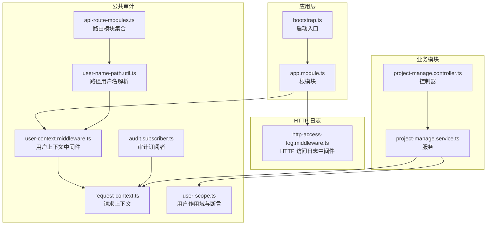
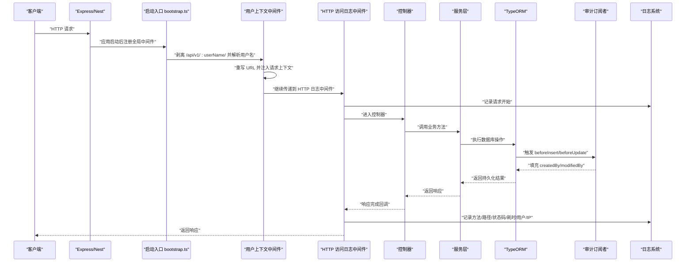
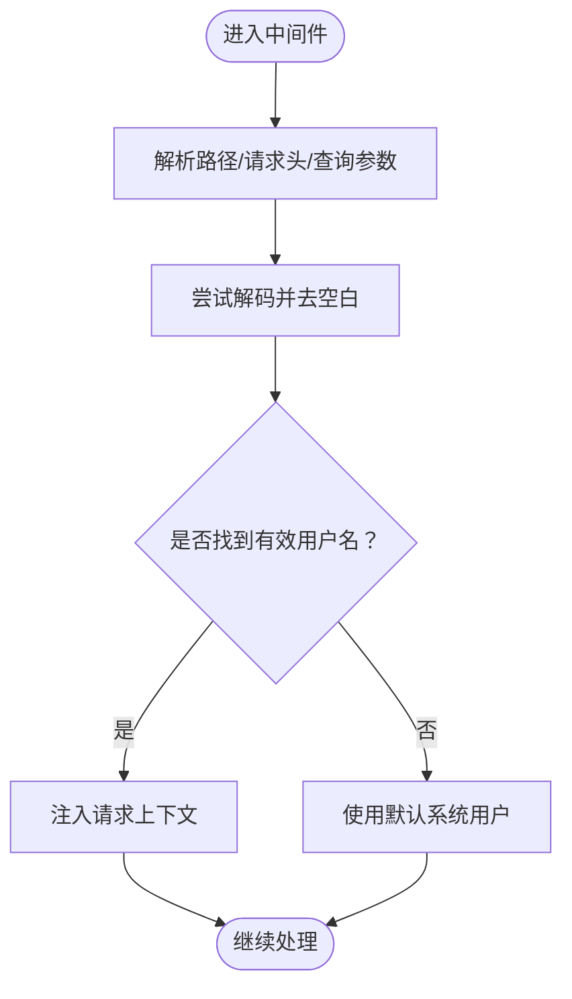
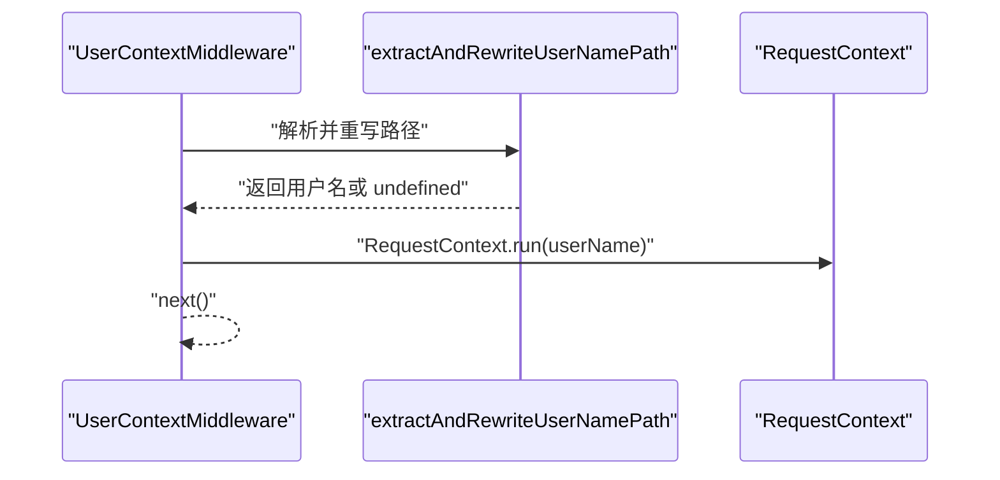
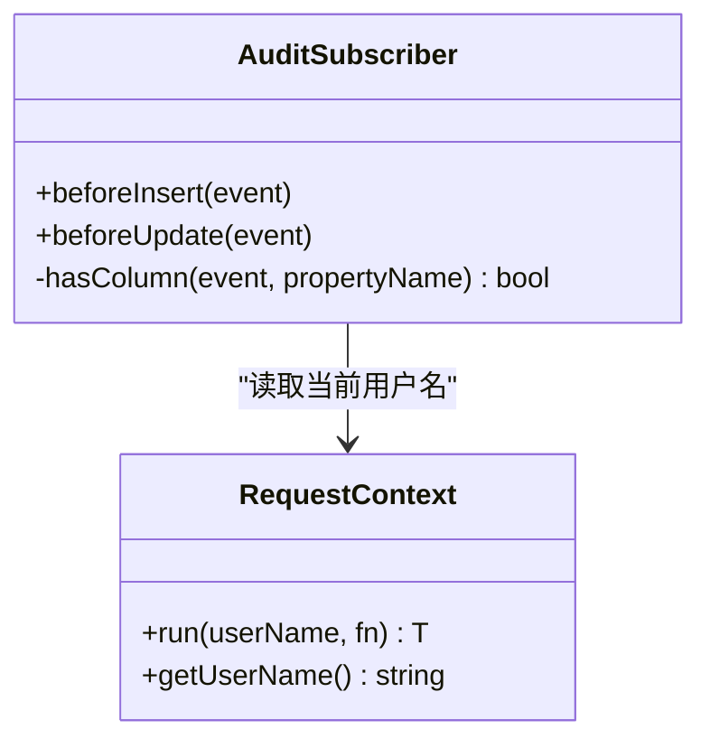
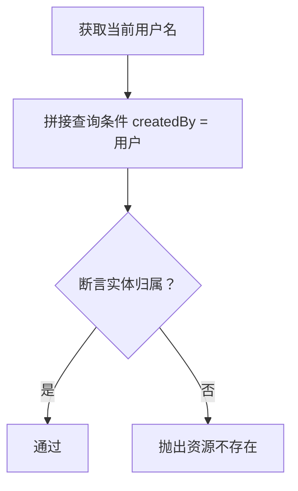
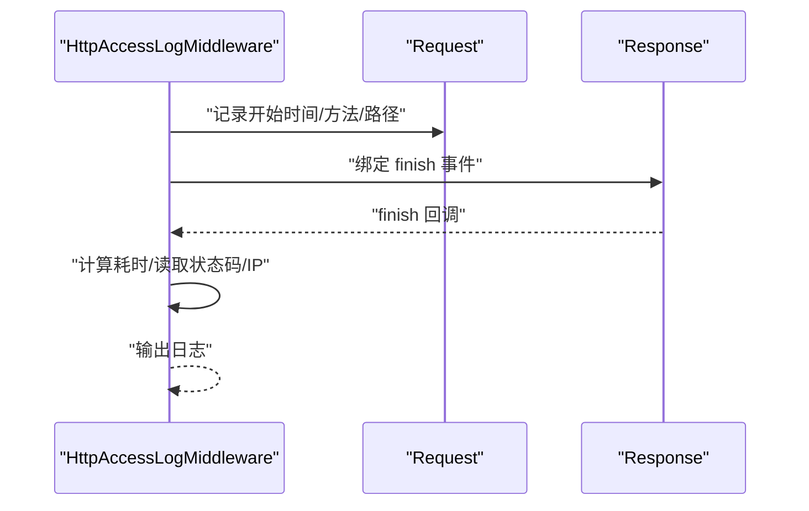
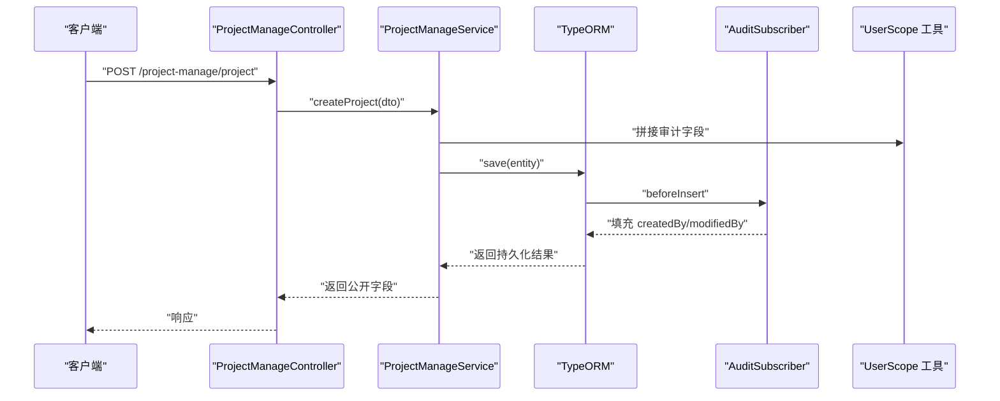
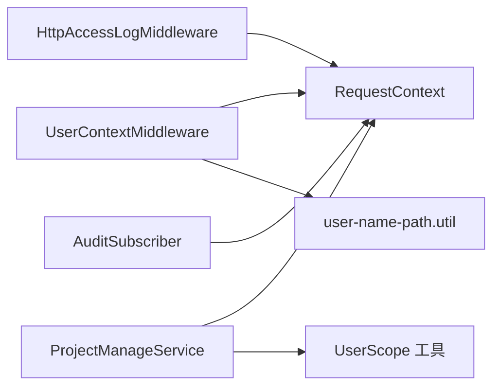

# 审计与日志服务

<cite>
**本文引用的文件**
- [apps/api/src/common/audit/audit.subscriber.ts](file://apps/api/src/common/audit/audit.subscriber.ts)
- [apps/api/src/common/audit/request-context.ts](file://apps/api/src/common/audit/request-context.ts)
- [apps/api/src/common/audit/user-context.middleware.ts](file://apps/api/src/common/audit/user-context.middleware.ts)
- [apps/api/src/common/audit/user-scope.ts](file://apps/api/src/common/audit/user-scope.ts)
- [apps/api/src/common/audit/api-route-modules.ts](file://apps/api/src/common/audit/api-route-modules.ts)
- [apps/api/src/common/audit/user-name-path.util.ts](file://apps/api/src/common/audit/user-name-path.util.ts)
- [apps/api/src/common/http/http-access-log.middleware.ts](file://apps/api/src/common/http/http-access-log.middleware.ts)
- [apps/api/src/app.module.ts](file://apps/api/src/app.module.ts)
- [apps/api/src/bootstrap.ts](file://apps/api/src/bootstrap.ts)
- [apps/api/src/modules/project-manage/service/project-manage.service.ts](file://apps/api/src/modules/project-manage/service/project-manage.service.ts)
- [apps/api/src/modules/project-manage/controller/project-manage.controller.ts](file://apps/api/src/modules/project-manage/controller/project-manage.controller.ts)
</cite>

## 目录
1. [引言](#引言)
2. [项目结构](#项目结构)
3. [核心组件](#核心组件)
4. [架构总览](#架构总览)
5. [详细组件分析](#详细组件分析)
6. [依赖关系分析](#依赖关系分析)
7. [性能考虑](#性能考虑)
8. [故障排查指南](#故障排查指南)
9. [结论](#结论)
10. [附录](#附录)

## 引言
本技术指南围绕审计与日志服务展开，系统性介绍审计系统的架构设计、事件监听机制、数据收集策略，以及用户上下文管理、请求跟踪与权限控制的实现方式。文档还阐述了审计订阅者模式、中间件配置与 API 路由模块管理，并通过项目管理模块的实际使用示例，展示如何构建完整的审计追踪系统。最后提供安全最佳实践与性能优化建议，帮助读者在生产环境中稳定落地。

## 项目结构
审计与日志能力主要分布在以下位置：
- 公共审计模块：用户上下文、请求上下文、审计订阅者、用户作用域与路由模块识别
- HTTP 日志中间件：统一记录请求访问日志
- 应用入口与根模块：全局中间件装配与启动流程
- 业务模块：以项目管理为例，演示审计字段注入与用户作用域校验

图表来源
- [apps/api/src/common/audit/request-context.ts:1-57](file://apps/api/src/common/audit/request-context.ts#L1-L57)
- [apps/api/src/common/audit/user-context.middleware.ts:1-21](file://apps/api/src/common/audit/user-context.middleware.ts#L1-L21)
- [apps/api/src/common/audit/audit.subscriber.ts:1-41](file://apps/api/src/common/audit/audit.subscriber.ts#L1-L41)
- [apps/api/src/common/audit/user-scope.ts:1-90](file://apps/api/src/common/audit/user-scope.ts#L1-L90)
- [apps/api/src/common/audit/api-route-modules.ts:1-10](file://apps/api/src/common/audit/api-route-modules.ts#L1-L10)
- [apps/api/src/common/audit/user-name-path.util.ts:1-46](file://apps/api/src/common/audit/user-name-path.util.ts#L1-L46)
- [apps/api/src/common/http/http-access-log.middleware.ts:1-47](file://apps/api/src/common/http/http-access-log.middleware.ts#L1-L47)
- [apps/api/src/bootstrap.ts:1-64](file://apps/api/src/bootstrap.ts#L1-L64)
- [apps/api/src/app.module.ts:1-48](file://apps/api/src/app.module.ts#L1-L48)
- [apps/api/src/modules/project-manage/controller/project-manage.controller.ts:1-138](file://apps/api/src/modules/project-manage/controller/project-manage.controller.ts#L1-L138)
- [apps/api/src/modules/project-manage/service/project-manage.service.ts:1-200](file://apps/api/src/modules/project-manage/service/project-manage.service.ts#L1-L200)

章节来源
- [apps/api/src/bootstrap.ts:18-31](file://apps/api/src/bootstrap.ts#L18-L31)
- [apps/api/src/app.module.ts:42-46](file://apps/api/src/app.module.ts#L42-L46)

## 核心组件
- 请求上下文与用户解析
  - 使用异步存储保存当前操作用户，提供解析用户名的工具函数，支持从路径、请求头与查询参数提取，并进行解码与兜底处理。
- 用户上下文中间件
  - 在请求进入时解析用户名，重写 URL 路径，注入到请求上下文中，确保后续审计与权限判断一致。
- 审计订阅者
  - 基于 TypeORM 事件订阅，在插入与更新前自动填充创建人与修改人字段，保证审计字段一致性。
- 用户作用域与断言
  - 提供查询条件拼接、查询构造器追加用户隔离、实体归属断言与可访问性断言，实现“本人+系统预置”两种可见范围。
- HTTP 访问日志中间件
  - 统一记录方法、路径、状态码、耗时、用户与客户端 IP，便于审计与排障。
- 路由模块识别与路径剥离
  - 识别业务模块前缀，剥离形如 /api/v1/:userName/ 的用户名前缀，供后续路由匹配与审计使用。

章节来源
- [apps/api/src/common/audit/request-context.ts:1-57](file://apps/api/src/common/audit/request-context.ts#L1-L57)
- [apps/api/src/common/audit/user-context.middleware.ts:1-21](file://apps/api/src/common/audit/user-context.middleware.ts#L1-L21)
- [apps/api/src/common/audit/audit.subscriber.ts:1-41](file://apps/api/src/common/audit/audit.subscriber.ts#L1-L41)
- [apps/api/src/common/audit/user-scope.ts:1-90](file://apps/api/src/common/audit/user-scope.ts#L1-L90)
- [apps/api/src/common/http/http-access-log.middleware.ts:1-47](file://apps/api/src/common/http/http-access-log.middleware.ts#L1-L47)
- [apps/api/src/common/audit/api-route-modules.ts:1-10](file://apps/api/src/common/audit/api-route-modules.ts#L1-L10)
- [apps/api/src/common/audit/user-name-path.util.ts:1-46](file://apps/api/src/common/audit/user-name-path.util.ts#L1-L46)

## 架构总览
下图展示了从请求进入、上下文注入、业务处理、审计字段填充到日志输出的完整链路。

图表来源
- [apps/api/src/bootstrap.ts:24-31](file://apps/api/src/bootstrap.ts#L24-L31)
- [apps/api/src/common/audit/user-context.middleware.ts:9-19](file://apps/api/src/common/audit/user-context.middleware.ts#L9-L19)
- [apps/api/src/common/http/http-access-log.middleware.ts:10-45](file://apps/api/src/common/http/http-access-log.middleware.ts#L10-L45)
- [apps/api/src/common/audit/audit.subscriber.ts:12-32](file://apps/api/src/common/audit/audit.subscriber.ts#L12-L32)
- [apps/api/src/modules/project-manage/controller/project-manage.controller.ts:32-36](file://apps/api/src/modules/project-manage/controller/project-manage.controller.ts#L32-L36)
- [apps/api/src/modules/project-manage/service/project-manage.service.ts:59-93](file://apps/api/src/modules/project-manage/service/project-manage.service.ts#L59-L93)

## 详细组件分析

### 请求上下文与用户解析
- 设计要点
  - 使用异步存储在调用链内传递当前用户名，默认值为系统标识，避免空上下文导致的审计缺失。
  - 支持从路径、请求头与查询参数解析用户名，优先级为路径 > 请求头 > 查询参数，解码失败则回退原文。
- 复杂度与性能
  - 上下文读取为 O(1)，解析逻辑仅在中间件阶段执行一次，开销极低。
- 错误处理
  - 解码异常与空值均回退到默认系统用户，保证系统稳定性。

图表来源
- [apps/api/src/common/audit/request-context.ts:18-37](file://apps/api/src/common/audit/request-context.ts#L18-L37)

章节来源
- [apps/api/src/common/audit/request-context.ts:1-57](file://apps/api/src/common/audit/request-context.ts#L1-L57)

### 用户上下文中间件
- 功能
  - 在请求进入时解析用户名，剥离 /api/v1/:userName/ 前缀并重写 URL，随后将用户名注入请求上下文，确保后续审计与权限判断一致。
- 与路径解析工具协作
  - 通过路由模块集合识别业务模块，避免错误剥离非用户前缀路径。
- 性能
  - 仅在请求首包执行一次解析与重写，成本可控。

图表来源
- [apps/api/src/common/audit/user-context.middleware.ts:9-19](file://apps/api/src/common/audit/user-context.middleware.ts#L9-L19)
- [apps/api/src/common/audit/user-name-path.util.ts:7-29](file://apps/api/src/common/audit/user-name-path.util.ts#L7-L29)

章节来源
- [apps/api/src/common/audit/user-context.middleware.ts:1-21](file://apps/api/src/common/audit/user-context.middleware.ts#L1-L21)
- [apps/api/src/common/audit/user-name-path.util.ts:1-46](file://apps/api/src/common/audit/user-name-path.util.ts#L1-L46)
- [apps/api/src/common/audit/api-route-modules.ts:1-10](file://apps/api/src/common/audit/api-route-modules.ts#L1-L10)

### 审计订阅者（TypeORM 事件）
- 功能
  - 在实体插入前自动填充创建人字段；在实体更新前自动填充修改人字段；仅当实体具备相应列时生效。
- 与请求上下文联动
  - 通过请求上下文获取当前用户名，保证审计字段与用户态一致。
- 复杂度
  - 每次插入/更新触发，列存在性检查为 O(1)，整体开销极小。

图表来源
- [apps/api/src/common/audit/audit.subscriber.ts:10-40](file://apps/api/src/common/audit/audit.subscriber.ts#L10-L40)
- [apps/api/src/common/audit/request-context.ts:8-16](file://apps/api/src/common/audit/request-context.ts#L8-L16)

章节来源
- [apps/api/src/common/audit/audit.subscriber.ts:1-41](file://apps/api/src/common/audit/audit.subscriber.ts#L1-L41)

### 用户作用域与权限断言
- 功能
  - 提供查询条件拼接、查询构造器追加用户隔离、实体归属断言与可访问性断言，实现“本人+系统预置”两种可见范围。
  - 系统预置资源使用系统标识作为创建人，避免与普通用户混淆。
- 安全性
  - 断言失败抛出“资源不存在”，不泄露目标是否存在，降低信息泄露风险。
- 复杂度
  - 查询条件拼接与断言均为 O(1)，对性能影响可忽略。

图表来源
- [apps/api/src/common/audit/user-scope.ts:14-26](file://apps/api/src/common/audit/user-scope.ts#L14-L26)
- [apps/api/src/common/audit/user-scope.ts:48-75](file://apps/api/src/common/audit/user-scope.ts#L48-L75)

章节来源
- [apps/api/src/common/audit/user-scope.ts:1-90](file://apps/api/src/common/audit/user-scope.ts#L1-L90)

### HTTP 访问日志中间件
- 功能
  - 记录请求方法、路径、状态码、耗时、用户与客户端 IP，便于审计与排障。
- 实现细节
  - 在响应完成事件中输出日志，确保状态码与耗时准确。
- 性能
  - 仅在 finish 事件输出，无阻塞逻辑，开销极低。

图表来源
- [apps/api/src/common/http/http-access-log.middleware.ts:10-45](file://apps/api/src/common/http/http-access-log.middleware.ts#L10-L45)

章节来源
- [apps/api/src/common/http/http-access-log.middleware.ts:1-47](file://apps/api/src/common/http/http-access-log.middleware.ts#L1-L47)

### 业务模块集成示例（项目管理）
- 控制器
  - 定义项目管理相关接口，统一通过服务层处理业务。
- 服务层
  - 创建项目时注入审计字段；查询列表时应用用户作用域；断言项目归属。
- 审计与权限
  - 通过请求上下文与作用域工具，确保所有操作均可追溯且符合权限约束。

图表来源
- [apps/api/src/modules/project-manage/controller/project-manage.controller.ts:32-36](file://apps/api/src/modules/project-manage/controller/project-manage.controller.ts#L32-L36)
- [apps/api/src/modules/project-manage/service/project-manage.service.ts:59-93](file://apps/api/src/modules/project-manage/service/project-manage.service.ts#L59-L93)
- [apps/api/src/common/audit/audit.subscriber.ts:12-24](file://apps/api/src/common/audit/audit.subscriber.ts#L12-L24)
- [apps/api/src/common/audit/user-scope.ts:14-26](file://apps/api/src/common/audit/user-scope.ts#L14-L26)

章节来源
- [apps/api/src/modules/project-manage/controller/project-manage.controller.ts:1-138](file://apps/api/src/modules/project-manage/controller/project-manage.controller.ts#L1-L138)
- [apps/api/src/modules/project-manage/service/project-manage.service.ts:59-93](file://apps/api/src/modules/project-manage/service/project-manage.service.ts#L59-L93)

## 依赖关系分析
- 组件耦合
  - 审计订阅者依赖请求上下文；用户上下文中间件依赖路径解析工具与请求上下文；服务层依赖审计字段工具与用户作用域工具。
- 外部依赖
  - TypeORM 事件订阅机制用于自动填充审计字段；Express/Nest 中间件体系用于请求拦截与日志输出。
- 潜在循环依赖
  - 当前模块划分清晰，未见循环依赖迹象。

图表来源
- [apps/api/src/common/audit/user-context.middleware.ts:1-21](file://apps/api/src/common/audit/user-context.middleware.ts#L1-L21)
- [apps/api/src/common/audit/request-context.ts:1-57](file://apps/api/src/common/audit/request-context.ts#L1-L57)
- [apps/api/src/common/audit/user-name-path.util.ts:1-46](file://apps/api/src/common/audit/user-name-path.util.ts#L1-L46)
- [apps/api/src/common/http/http-access-log.middleware.ts:1-47](file://apps/api/src/common/http/http-access-log.middleware.ts#L1-L47)
- [apps/api/src/common/audit/audit.subscriber.ts:1-41](file://apps/api/src/common/audit/audit.subscriber.ts#L1-L41)
- [apps/api/src/common/audit/user-scope.ts:1-90](file://apps/api/src/common/audit/user-scope.ts#L1-L90)
- [apps/api/src/modules/project-manage/service/project-manage.service.ts:1-200](file://apps/api/src/modules/project-manage/service/project-manage.service.ts#L1-L200)

章节来源
- [apps/api/src/app.module.ts:42-46](file://apps/api/src/app.module.ts#L42-L46)
- [apps/api/src/bootstrap.ts:24-31](file://apps/api/src/bootstrap.ts#L24-L31)

## 性能考虑
- 中间件顺序
  - 将用户上下文中间件置于 HTTP 日志中间件之前，确保日志中包含正确的用户名。
- 日志级别
  - 使用细粒度日志（如 verbose）记录访问日志，避免在高并发场景下产生过多 I/O。
- 数据库写入
  - 审计字段填充为轻量操作，但应避免在高频写入场景中引入额外索引，以免影响写入性能。
- 路径解析
  - 路径解析与重写仅在请求首包执行一次，成本极低；保持正则与解码逻辑简洁，避免复杂度上升。

## 故障排查指南
- 审计字段为空
  - 检查是否正确注入请求上下文；确认实体具备对应的列名；核对中间件顺序。
- 用户不可见或越权访问
  - 检查用户作用域断言是否正确应用；确认断言逻辑与期望一致。
- 日志缺失
  - 确认中间件已正确注册；检查日志级别与输出通道；验证 finish 事件是否触发。
- 路径前缀剥离异常
  - 核对路由模块集合与实际模块路径；确认 URL 编码与解码逻辑。

章节来源
- [apps/api/src/common/audit/audit.subscriber.ts:12-32](file://apps/api/src/common/audit/audit.subscriber.ts#L12-L32)
- [apps/api/src/common/audit/user-scope.ts:48-75](file://apps/api/src/common/audit/user-scope.ts#L48-L75)
- [apps/api/src/common/http/http-access-log.middleware.ts:30-42](file://apps/api/src/common/http/http-access-log.middleware.ts#L30-L42)
- [apps/api/src/common/audit/user-name-path.util.ts:7-29](file://apps/api/src/common/audit/user-name-path.util.ts#L7-L29)

## 结论
该审计与日志服务通过请求上下文、中间件与 TypeORM 订阅者的协同，实现了对用户行为的完整追踪与权限控制。结合用户作用域与断言工具，系统在保证安全性的同时，提供了良好的扩展性。配合 HTTP 访问日志中间件，能够满足生产环境下的审计与排障需求。建议在实际部署中关注中间件顺序、日志级别与数据库写入性能，并持续完善安全策略与监控告警。

## 附录
- 安全最佳实践
  - 默认拒绝策略：断言失败统一返回“资源不存在”，避免信息泄露。
  - 最小权限原则：所有查询与断言均基于用户作用域，防止越权访问。
  - 审计字段一致性：通过订阅者自动填充，减少手工赋值遗漏。
- 性能优化建议
  - 合理设置日志级别与输出通道，避免高并发下的 I/O 峰值。
  - 控制审计字段数量与索引规模，避免影响写入性能。
  - 对高频接口进行限流与熔断，保障系统稳定性。