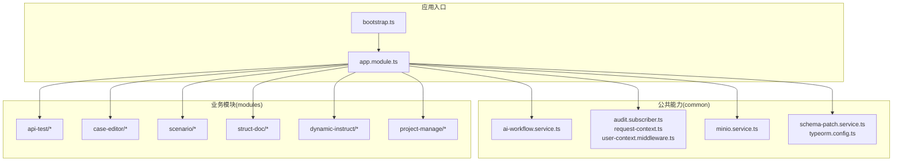
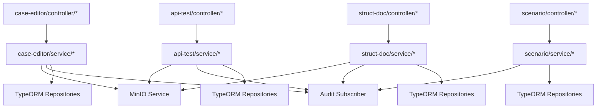
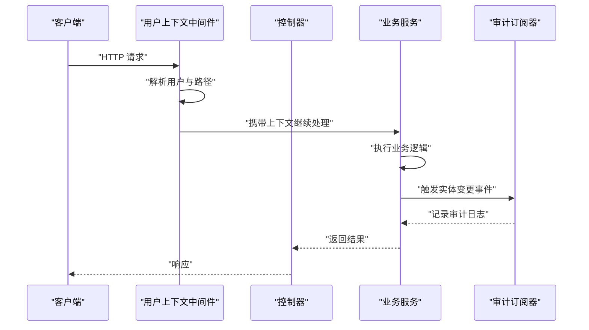
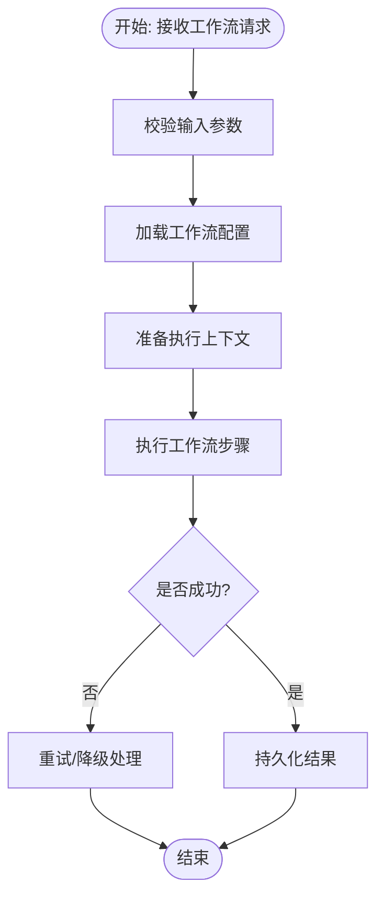
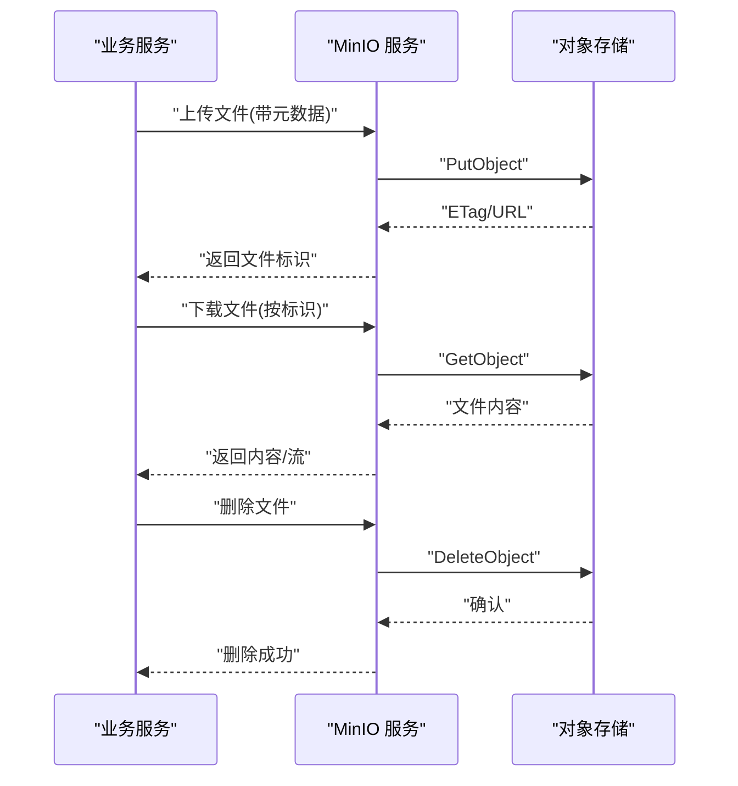
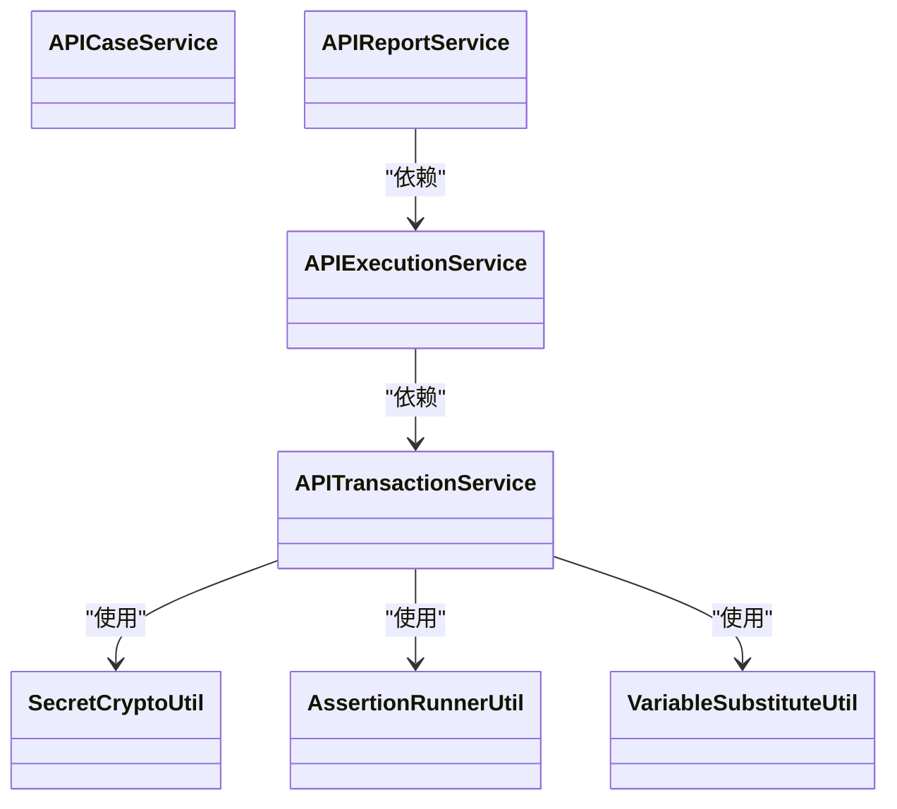
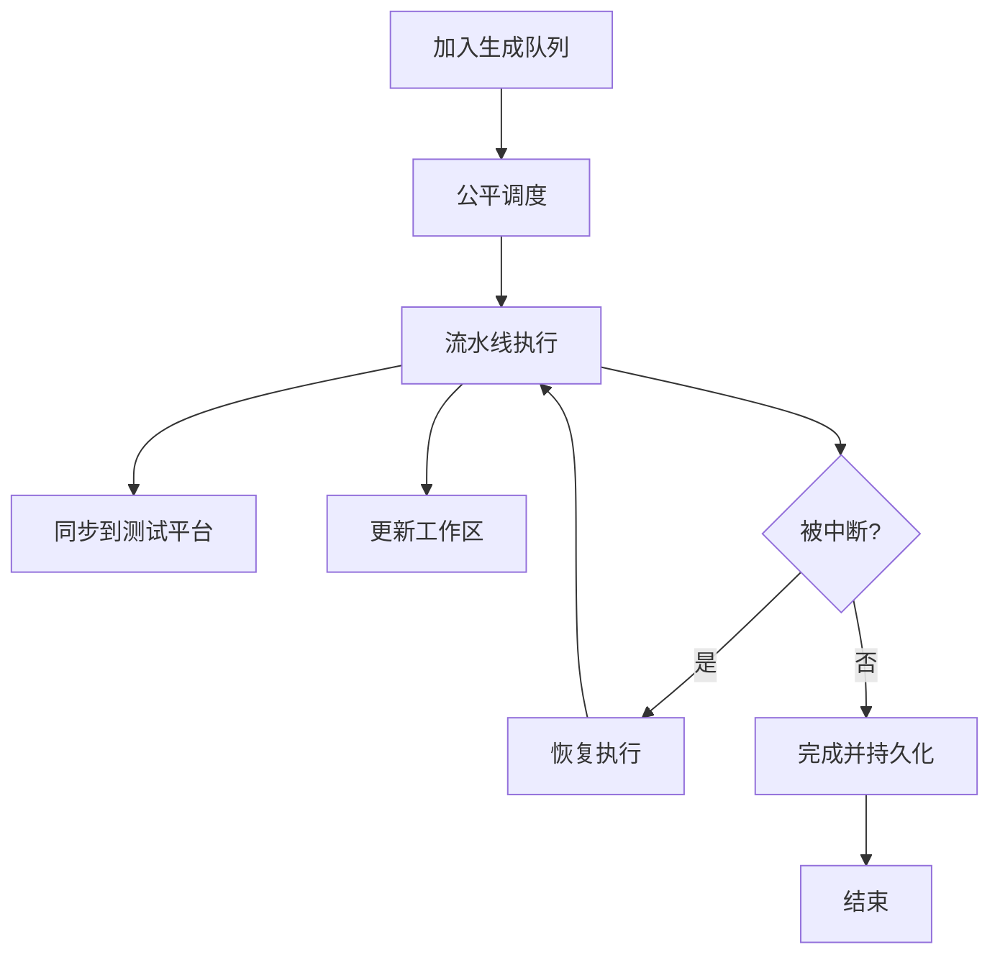
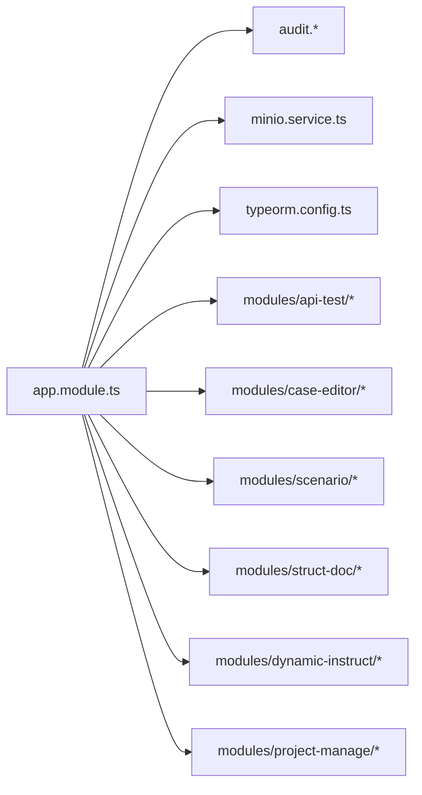

# 服务层与业务逻辑

<cite>
**本文引用的文件**
- [apps/api/src/app.module.ts](file://apps/api/src/app.module.ts)
- [apps/api/src/bootstrap.ts](file://apps/api/src/bootstrap.ts)
- [apps/api/src/common/ai-workflow/service/ai-workflow.service.ts](file://apps/api/src/common/ai-workflow/service/ai-workflow.service.ts)
- [apps/api/src/common/audit/audit.subscriber.ts](file://apps/api/src/common/audit/audit.subscriber.ts)
- [apps/api/src/common/minio/service/minio.service.ts](file://apps/api/src/common/minio/service/minio.service.ts)
- [apps/api/src/common/typeorm/schema-patch.service.ts](file://apps/api/src/common/typeorm/schema-patch.service.ts)
- [apps/api/src/modules/api-test/service/api-case.service.ts](file://apps/api/src/modules/api-test/service/api-case.service.ts)
- [apps/api/src/modules/api-test/service/api-doc.service.ts](file://apps/api/src/modules/api-test/service/api-doc.service.ts)
- [apps/api/src/modules/api-test/service/api-environment.service.ts](file://apps/api/src/modules/api-test/service/api-environment.service.ts)
- [apps/api/src/modules/api-test/service/api-execution.service.ts](file://apps/api/src/modules/api-test/service/api-execution.service.ts)
- [apps/api/src/modules/api-test/service/api-execution-set.service.ts](file://apps/api/src/modules/api-test/service/api-execution-set.service.ts)
- [apps/api/src/modules/api-test/service/api-report.service.ts](file://apps/api/src/modules/api-test/service/api-report.service.ts)
- [apps/api/src/modules/api-test/service/api-transaction.service.ts](file://apps/api/src/modules/api-test/service/api-transaction.service.ts)
- [apps/api/src/modules/case-editor/service/case-editor.service.ts](file://apps/api/src/modules/case-editor/service/case-editor.service.ts)
- [apps/api/src/modules/case-editor/service/case-generate-queue.service.ts](file://apps/api/src/modules/case-editor/service/case-generate-queue.service.ts)
- [apps/api/src/modules/case-editor/service/case-pipeline.service.ts](file://apps/api/src/modules/case-editor/service/case-pipeline.service.ts)
- [apps/api/src/modules/case-editor/service/case-test-platform-sync.service.ts](file://apps/api/src/modules/case-editor/service/case-test-platform-sync.service.ts)
- [apps/api/src/modules/case-editor/service/case-workspace.service.ts](file://apps/api/src/modules/case-editor/service/case-workspace.service.ts)
- [apps/api/src/modules/dynamic-instruct/service/dynamic-instruct.service.ts](file://apps/api/src/modules/dynamic-instruct/service/dynamic-instruct.service.ts)
- [apps/api/src/modules/project-manage/service/project-manage.service.ts](file://apps/api/src/modules/project-manage/service/project-manage.service.ts)
- [apps/api/src/modules/scenario/service/scenario.service.ts](file://apps/api/src/modules/scenario/service/scenario.service.ts)
- [apps/api/src/modules/struct-doc/service/struct-doc.service.ts](file://apps/api/src/modules/struct-doc/service/struct-doc.service.ts)
- [apps/api/src/common/audit/request-context.ts](file://apps/api/src/common/audit/request-context.ts)
- [apps/api/src/common/audit/user-context.middleware.ts](file://apps/api/src/common/audit/user-context.middleware.ts)
- [apps/api/src/common/audit/user-scope.ts](file://apps/api/src/common/audit/user-scope.ts)
- [apps/api/src/common/audit/api-route-modules.ts](file://apps/api/src/common/audit/api-route-modules.ts)
- [apps/api/src/common/ai-workflow/ai-workflow.config.ts](file://apps/api/src/common/ai-workflow/ai-workflow.config.ts)
- [apps/api/src/common/ai-workflow/util/workflow-input.util.ts](file://apps/api/src/common/ai-workflow/util/workflow-input.util.ts)
- [apps/api/src/common/minio/minio.config.ts](file://apps/api/src/common/minio/minio.config.ts)
- [apps/api/src/common/typeorm/typeorm.config.ts](file://apps/api/src/common/typeorm/typeorm.config.ts)
- [apps/api/src/common/typeorm/database-indexes.util.ts](file://apps/api/src/common/typeorm/database-indexes.util.ts)
- [apps/api/src/common/typeorm/api-schema-migrations.util.ts](file://apps/api/src/common/typeorm/api-schema-migrations.util.ts)
- [apps/api/src/common/typeorm/pre-sync-schema-patch.ts](file://apps/api/src/common/typeorm/pre-sync-schema-patch.ts)
- [apps/api/src/common/typeorm/utf8mb4-schema.util.ts](file://apps/api/src/common/typeorm/utf8mb4-schema.util.ts)
- [apps/api/src/modules/api-test/util/secret-crypto.util.ts](file://apps/api/src/modules/api-test/util/secret-crypto.util.ts)
- [apps/api/src/modules/api-test/util/assertion-runner.util.ts](file://apps/api/src/modules/api-test/util/assertion-runner.util.ts)
- [apps/api/src/modules/api-test/util/variable-substitute.util.ts](file://apps/api/src/modules/api-test/util/variable-substitute.util.ts)
- [apps/api/src/modules/api-test/util/api-doc.parser.ts](file://apps/api/src/modules/api-test/util/api-doc.parser.ts)
- [apps/api/src/modules/api-test/util/api-doc-format.const.ts](file://apps/api/src/modules/api-test/util/api-doc-format.const.ts)
- [apps/api/src/modules/api-test/util/api-doc-extract.util.ts](file://apps/api/src/modules/api-test/util/api-doc-extract.util.ts)
- [apps/api/src/modules/api-test/util/api-case-ai.util.ts](file://apps/api/src/modules/api-test/util/api-case-ai.util.ts)
- [apps/api/src/modules/case-editor/util/case-generate-fair-schedule.util.ts](file://apps/api/src/modules/case-editor/util/case-generate-fair-schedule.util.ts)
- [apps/api/src/modules/case-editor/util/case-generate-interrupted.util.ts](file://apps/api/src/modules/case-editor/util/case-generate-interrupted.util.ts)
</cite>

## 目录
1. [引言](#引言)
2. [项目结构](#项目结构)
3. [核心组件](#核心组件)
4. [架构总览](#架构总览)
5. [详细组件分析](#详细组件分析)
6. [依赖关系分析](#依赖关系分析)
7. [性能考量](#性能考量)
8. [故障排查指南](#故障排查指南)
9. [结论](#结论)
10. [附录](#附录)

## 引言
本指南聚焦于服务层与业务逻辑，系统阐述以下主题：
- 服务层设计原则：高内聚、低耦合、可测试性与可扩展性
- 依赖注入与单例模式在 NestJS 模块中的应用
- 业务逻辑封装、事务管理与数据一致性保障
- AI 工作流服务、审计服务与存储服务的实现机制
- 单元测试、Mock 对象与集成测试策略
- 具体业务服务实现示例与最佳实践

## 项目结构
后端采用 NestJS 应用，模块化组织业务域（API 测试、用例编辑、场景、结构化文档等），并通过 app.module.ts 统一装配。公共能力以 common 目录分层：AI 工作流、审计、MinIO 存储、TypeORM 配置与工具。

图表来源
- [apps/api/src/bootstrap.ts](file://apps/api/src/bootstrap.ts)
- [apps/api/src/app.module.ts](file://apps/api/src/app.module.ts)
- [apps/api/src/common/ai-workflow/service/ai-workflow.service.ts](file://apps/api/src/common/ai-workflow/service/ai-workflow.service.ts)
- [apps/api/src/common/audit/audit.subscriber.ts](file://apps/api/src/common/audit/audit.subscriber.ts)
- [apps/api/src/common/minio/service/minio.service.ts](file://apps/api/src/common/minio/service/minio.service.ts)
- [apps/api/src/common/typeorm/schema-patch.service.ts](file://apps/api/src/common/typeorm/schema-patch.service.ts)

章节来源
- [apps/api/src/app.module.ts](file://apps/api/src/app.module.ts)
- [apps/api/src/bootstrap.ts](file://apps/api/src/bootstrap.ts)

## 核心组件
- 服务层职责边界清晰：每个服务专注单一业务领域，通过 DTO/Entity/Util 分层解耦
- 依赖注入：NestJS 模块自动注入，服务间通过构造函数注入，避免全局状态
- 单例模式：默认按模块注册为单例，确保线程安全与资源复用
- 事务与一致性：基于 TypeORM 的 EntityManager/Repository 进行业务事务控制；对跨表/跨模块操作进行统一提交
- 审计与上下文：请求级上下文贯穿服务调用链，记录用户、路径与作用域
- 存储与对象存储：MinIO 服务封装上传/下载/删除，配合实体持久化
- AI 工作流：统一配置与输入工具，规范工作流执行参数与约束

章节来源
- [apps/api/src/common/audit/request-context.ts](file://apps/api/src/common/audit/request-context.ts)
- [apps/api/src/common/audit/user-context.middleware.ts](file://apps/api/src/common/audit/user-context.middleware.ts)
- [apps/api/src/common/minio/service/minio.service.ts](file://apps/api/src/common/minio/service/minio.service.ts)
- [apps/api/src/common/typeorm/schema-patch.service.ts](file://apps/api/src/common/typeorm/schema-patch.service.ts)
- [apps/api/src/common/ai-workflow/service/ai-workflow.service.ts](file://apps/api/src/common/ai-workflow/service/ai-workflow.service.ts)

## 架构总览
服务层围绕“控制器 -> 服务 -> 实体/仓储 -> 数据库”的调用链展开，公共能力通过模块共享，业务模块彼此隔离但可通过服务接口交互。

图表来源
- [apps/api/src/modules/api-test/service/api-case.service.ts](file://apps/api/src/modules/api-test/service/api-case.service.ts)
- [apps/api/src/modules/case-editor/service/case-editor.service.ts](file://apps/api/src/modules/case-editor/service/case-editor.service.ts)
- [apps/api/src/modules/scenario/service/scenario.service.ts](file://apps/api/src/modules/scenario/service/scenario.service.ts)
- [apps/api/src/modules/struct-doc/service/struct-doc.service.ts](file://apps/api/src/modules/struct-doc/service/struct-doc.service.ts)
- [apps/api/src/common/audit/audit.subscriber.ts](file://apps/api/src/common/audit/audit.subscriber.ts)
- [apps/api/src/common/minio/service/minio.service.ts](file://apps/api/src/common/minio/service/minio.service.ts)

## 详细组件分析

### 服务层设计原则与依赖注入
- 设计原则
  - 单一职责：每个服务仅负责一个业务域内的核心流程
  - 开闭原则：通过接口抽象与配置扩展新行为
  - 里氏替换：服务方法签名稳定，便于 Mock 替换
- 依赖注入
  - 在构造函数中声明依赖，由 NestJS 自动注入单例实例
  - 避免在服务内部直接 new 外部组件，降低紧耦合
- 单例模式
  - 默认模块级单例，适合无状态或轻状态服务
  - 对需要会话状态的组件，建议通过请求上下文传递而非全局状态

章节来源
- [apps/api/src/app.module.ts](file://apps/api/src/app.module.ts)

### 审计服务与请求上下文
- 请求上下文中间件在请求进入时写入用户信息与访问路径，服务层通过上下文读取当前用户与作用域
- 审计订阅器监听实体变更事件，结合上下文生成审计日志
- 用户作用域用于权限过滤与数据隔离

图表来源
- [apps/api/src/common/audit/user-context.middleware.ts](file://apps/api/src/common/audit/user-context.middleware.ts)
- [apps/api/src/common/audit/request-context.ts](file://apps/api/src/common/audit/request-context.ts)
- [apps/api/src/common/audit/audit.subscriber.ts](file://apps/api/src/common/audit/audit.subscriber.ts)

章节来源
- [apps/api/src/common/audit/user-context.middleware.ts](file://apps/api/src/common/audit/user-context.middleware.ts)
- [apps/api/src/common/audit/request-context.ts](file://apps/api/src/common/audit/request-context.ts)
- [apps/api/src/common/audit/audit.subscriber.ts](file://apps/api/src/common/audit/audit.subscriber.ts)
- [apps/api/src/common/audit/user-scope.ts](file://apps/api/src/common/audit/user-scope.ts)
- [apps/api/src/common/audit/api-route-modules.ts](file://apps/api/src/common/audit/api-route-modules.ts)

### AI 工作流服务
- 统一配置：集中定义工作流参数、超时、并发与重试策略
- 输入工具：规范化输入格式与必填字段校验，确保下游模型调用稳定性
- 执行编排：服务层协调多步骤任务，结合队列与管道处理异步流程

图表来源
- [apps/api/src/common/ai-workflow/ai-workflow.config.ts](file://apps/api/src/common/ai-workflow/ai-workflow.config.ts)
- [apps/api/src/common/ai-workflow/util/workflow-input.util.ts](file://apps/api/src/common/ai-workflow/util/workflow-input.util.ts)
- [apps/api/src/common/ai-workflow/service/ai-workflow.service.ts](file://apps/api/src/common/ai-workflow/service/ai-workflow.service.ts)

章节来源
- [apps/api/src/common/ai-workflow/ai-workflow.config.ts](file://apps/api/src/common/ai-workflow/ai-workflow.config.ts)
- [apps/api/src/common/ai-workflow/util/workflow-input.util.ts](file://apps/api/src/common/ai-workflow/util/workflow-input.util.ts)
- [apps/api/src/common/ai-workflow/service/ai-workflow.service.ts](file://apps/api/src/common/ai-workflow/service/ai-workflow.service.ts)

### 存储服务（MinIO）
- 封装对象存储操作：上传、下载、删除、预签名 URL 等
- 与实体结合：文件元数据与业务实体关联，支持软删除与版本管理
- 错误处理：区分网络异常、鉴权失败与业务错误，统一转换为服务层异常

图表来源
- [apps/api/src/common/minio/service/minio.service.ts](file://apps/api/src/common/minio/service/minio.service.ts)
- [apps/api/src/common/minio/minio.config.ts](file://apps/api/src/common/minio/minio.config.ts)

章节来源
- [apps/api/src/common/minio/service/minio.service.ts](file://apps/api/src/common/minio/service/minio.service.ts)
- [apps/api/src/common/minio/minio.config.ts](file://apps/api/src/common/minio/minio.config.ts)

### 业务服务实现示例

#### API 测试服务族
- 职责划分
  - api-case.service：用例增删改查与关联数据维护
  - api-transaction.service：事务数据解析、变量替换与断言执行
  - api-execution.service：执行集调度与运行项管理
  - api-report.service：报告聚合与导出
- 事务与一致性
  - 使用 EntityManager 包裹复杂更新，失败回滚
  - 对外部系统（如 MinIO）与数据库操作进行补偿或幂等设计
- 工具与配置
  - secret-crypto.util：敏感信息加解密
  - assertion-runner.util：断言执行引擎
  - variable-substitute.util：变量替换与环境注入

图表来源
- [apps/api/src/modules/api-test/service/api-case.service.ts](file://apps/api/src/modules/api-test/service/api-case.service.ts)
- [apps/api/src/modules/api-test/service/api-transaction.service.ts](file://apps/api/src/modules/api-test/service/api-transaction.service.ts)
- [apps/api/src/modules/api-test/service/api-execution.service.ts](file://apps/api/src/modules/api-test/service/api-execution.service.ts)
- [apps/api/src/modules/api-test/service/api-report.service.ts](file://apps/api/src/modules/api-test/service/api-report.service.ts)
- [apps/api/src/modules/api-test/util/secret-crypto.util.ts](file://apps/api/src/modules/api-test/util/secret-crypto.util.ts)
- [apps/api/src/modules/api-test/util/assertion-runner.util.ts](file://apps/api/src/modules/api-test/util/assertion-runner.util.ts)
- [apps/api/src/modules/api-test/util/variable-substitute.util.ts](file://apps/api/src/modules/api-test/util/variable-substitute.util.ts)

章节来源
- [apps/api/src/modules/api-test/service/api-case.service.ts](file://apps/api/src/modules/api-test/service/api-case.service.ts)
- [apps/api/src/modules/api-test/service/api-transaction.service.ts](file://apps/api/src/modules/api-test/service/api-transaction.service.ts)
- [apps/api/src/modules/api-test/service/api-execution.service.ts](file://apps/api/src/modules/api-test/service/api-execution.service.ts)
- [apps/api/src/modules/api-test/service/api-report.service.ts](file://apps/api/src/modules/api-test/service/api-report.service.ts)
- [apps/api/src/modules/api-test/util/secret-crypto.util.ts](file://apps/api/src/modules/api-test/util/secret-crypto.util.ts)
- [apps/api/src/modules/api-test/util/assertion-runner.util.ts](file://apps/api/src/modules/api-test/util/assertion-runner.util.ts)
- [apps/api/src/modules/api-test/util/variable-substitute.util.ts](file://apps/api/src/modules/api-test/util/variable-substitute.util.ts)

#### 用例编辑服务族
- 职责划分
  - case-editor.service：树形用例结构维护
  - case-generate-queue.service：生成任务排队与调度
  - case-pipeline.service：生成流水线编排与并发控制
  - case-test-platform-sync.service：同步到测试平台
  - case-workspace.service：工作区视图与增量更新
- 并发与公平调度
  - fair-schedule.util：公平调度算法，避免饥饿
  - interrupted.util：中断与恢复机制，保证一致性

图表来源
- [apps/api/src/modules/case-editor/service/case-generate-queue.service.ts](file://apps/api/src/modules/case-editor/service/case-generate-queue.service.ts)
- [apps/api/src/modules/case-editor/service/case-pipeline.service.ts](file://apps/api/src/modules/case-editor/service/case-pipeline.service.ts)
- [apps/api/src/modules/case-editor/service/case-test-platform-sync.service.ts](file://apps/api/src/modules/case-editor/service/case-test-platform-sync.service.ts)
- [apps/api/src/modules/case-editor/service/case-workspace.service.ts](file://apps/api/src/modules/case-editor/service/case-workspace.service.ts)
- [apps/api/src/modules/case-editor/util/case-generate-fair-schedule.util.ts](file://apps/api/src/modules/case-editor/util/case-generate-fair-schedule.util.ts)
- [apps/api/src/modules/case-editor/util/case-generate-interrupted.util.ts](file://apps/api/src/modules/case-editor/util/case-generate-interrupted.util.ts)

章节来源
- [apps/api/src/modules/case-editor/service/case-editor.service.ts](file://apps/api/src/modules/case-editor/service/case-editor.service.ts)
- [apps/api/src/modules/case-editor/service/case-generate-queue.service.ts](file://apps/api/src/modules/case-editor/service/case-generate-queue.service.ts)
- [apps/api/src/modules/case-editor/service/case-pipeline.service.ts](file://apps/api/src/modules/case-editor/service/case-pipeline.service.ts)
- [apps/api/src/modules/case-editor/service/case-test-platform-sync.service.ts](file://apps/api/src/modules/case-editor/service/case-test-platform-sync.service.ts)
- [apps/api/src/modules/case-editor/service/case-workspace.service.ts](file://apps/api/src/modules/case-editor/service/case-workspace.service.ts)
- [apps/api/src/modules/case-editor/util/case-generate-fair-schedule.util.ts](file://apps/api/src/modules/case-editor/util/case-generate-fair-schedule.util.ts)
- [apps/api/src/modules/case-editor/util/case-generate-interrupted.util.ts](file://apps/api/src/modules/case-editor/util/case-generate-interrupted.util.ts)

#### 其他业务服务
- 动态指令：动态指令的保存、列表与测试点定义
- 项目管理：项目创建、更新与批量删除
- 场景：场景的保存与提示词管理
- 结构化文档：文档解析、分块与需求提取

章节来源
- [apps/api/src/modules/dynamic-instruct/service/dynamic-instruct.service.ts](file://apps/api/src/modules/dynamic-instruct/service/dynamic-instruct.service.ts)
- [apps/api/src/modules/project-manage/service/project-manage.service.ts](file://apps/api/src/modules/project-manage/service/project-manage.service.ts)
- [apps/api/src/modules/scenario/service/scenario.service.ts](file://apps/api/src/modules/scenario/service/scenario.service.ts)
- [apps/api/src/modules/struct-doc/service/struct-doc.service.ts](file://apps/api/src/modules/struct-doc/service/struct-doc.service.ts)

### 事务管理与数据一致性
- 事务边界
  - 以服务方法为事务边界，避免跨服务长事务
  - 对外调用（MinIO、第三方 API）需幂等或具备补偿
- 一致性策略
  - 读写分离：查询型服务与写入型服务分离
  - 幂等键：对外部调用引入幂等键，防止重复执行
  - 最终一致：对非实时强一致需求采用消息/定时任务兜底

章节来源
- [apps/api/src/common/typeorm/schema-patch.service.ts](file://apps/api/src/common/typeorm/schema-patch.service.ts)
- [apps/api/src/common/typeorm/typeorm.config.ts](file://apps/api/src/common/typeorm/typeorm.config.ts)

## 依赖关系分析
- 模块内聚：各业务模块内部服务高内聚，模块之间通过服务接口交互
- 模块耦合：公共能力（审计、MinIO、TypeORM）被多模块复用，形成稳定的基础设施层
- 外部依赖：MinIO、数据库、AI 服务等通过配置与适配器模式解耦

图表来源
- [apps/api/src/app.module.ts](file://apps/api/src/app.module.ts)
- [apps/api/src/common/audit/audit.subscriber.ts](file://apps/api/src/common/audit/audit.subscriber.ts)
- [apps/api/src/common/minio/service/minio.service.ts](file://apps/api/src/common/minio/service/minio.service.ts)
- [apps/api/src/common/typeorm/typeorm.config.ts](file://apps/api/src/common/typeorm/typeorm.config.ts)

章节来源
- [apps/api/src/app.module.ts](file://apps/api/src/app.module.ts)

## 性能考量
- 服务粒度与调用链：避免过深的调用链，合并邻近事务
- 缓存与批处理：对高频查询与统计结果进行缓存；对批量操作使用批处理
- 并发控制：生成类任务使用公平调度与并发上限，避免资源争用
- IO 优化：MinIO 上传/下载使用流式处理，减少内存占用

## 故障排查指南
- 审计日志定位：通过审计订阅器与请求上下文快速定位操作人与时间线
- 事务回滚：检查服务方法是否正确包裹 EntityManager；确认异常类型是否触发回滚
- 存储问题：核对 MinIO 配置、桶权限与对象键命名规则
- AI 工作流：检查配置项与输入工具校验，关注超时与重试策略

章节来源
- [apps/api/src/common/audit/audit.subscriber.ts](file://apps/api/src/common/audit/audit.subscriber.ts)
- [apps/api/src/common/minio/service/minio.service.ts](file://apps/api/src/common/minio/service/minio.service.ts)
- [apps/api/src/common/ai-workflow/ai-workflow.config.ts](file://apps/api/src/common/ai-workflow/ai-workflow.config.ts)

## 结论
通过模块化服务设计、严格的依赖注入与单例管理、完善的审计与事务机制，以及对 AI 工作流与存储的抽象封装，该服务层实现了高内聚、低耦合与良好的可测试性。建议在新增功能时遵循现有模式，优先使用配置驱动与工具类，保持服务方法职责单一，并通过单元与集成测试保障质量。

## 附录
- 单元测试策略
  - 使用 NestJS Test 套件创建TestingModule，Mock 外部依赖（如 MinIO、审计订阅器）
  - 针对事务方法使用 InMemoryDB 或事务隔离测试环境
- 集成测试策略
  - 启动完整应用上下文，验证控制器到服务到数据库的端到端流程
  - 对 AI 工作流与存储服务分别编写独立集成测试套件
- Mock 对象建议
  - 使用 jest.mock 与 provide + useClass 替换真实服务
  - 对外部系统模拟响应码与异常场景，覆盖错误分支