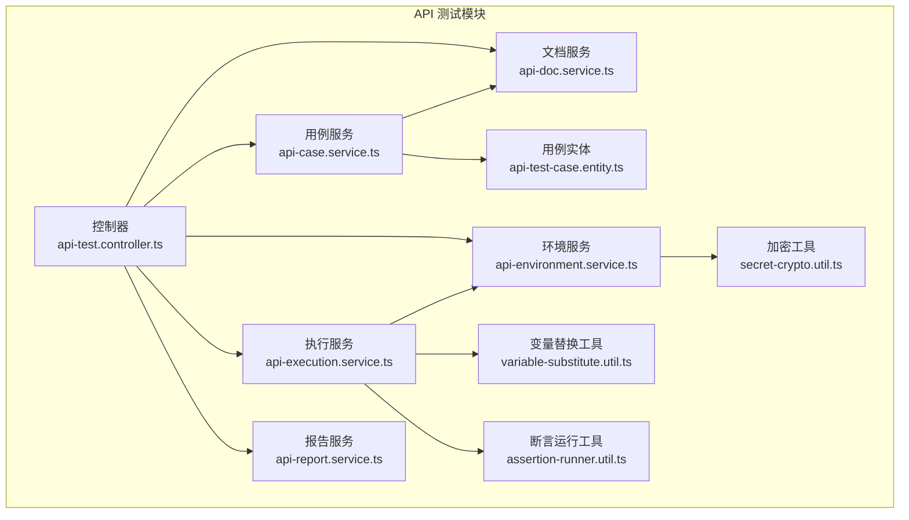
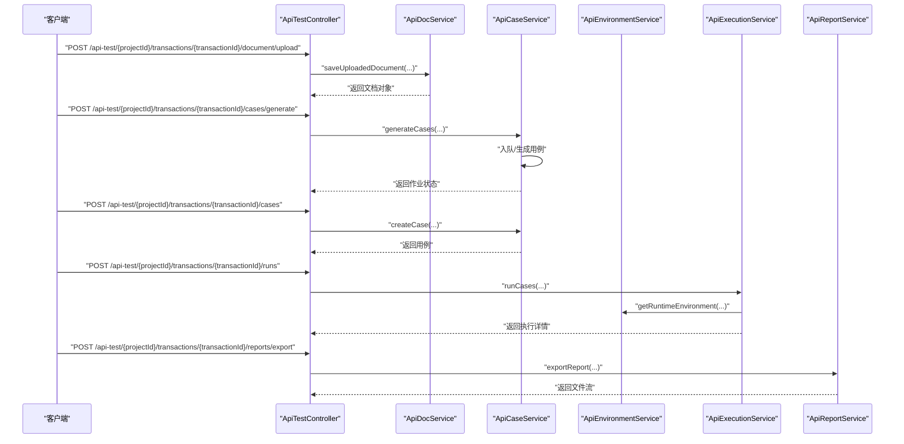
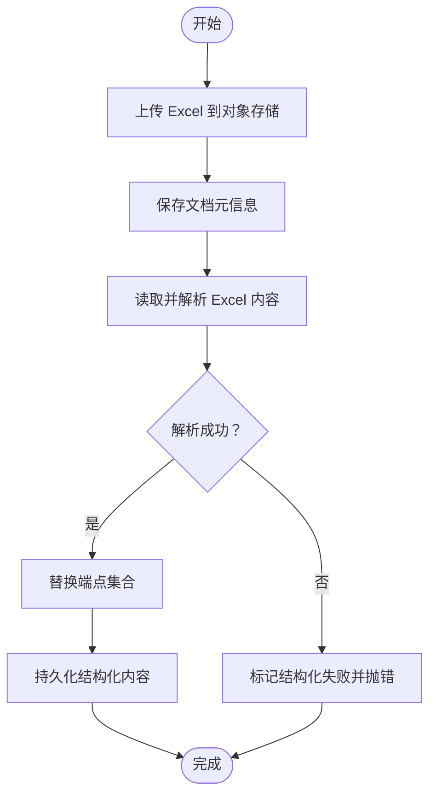
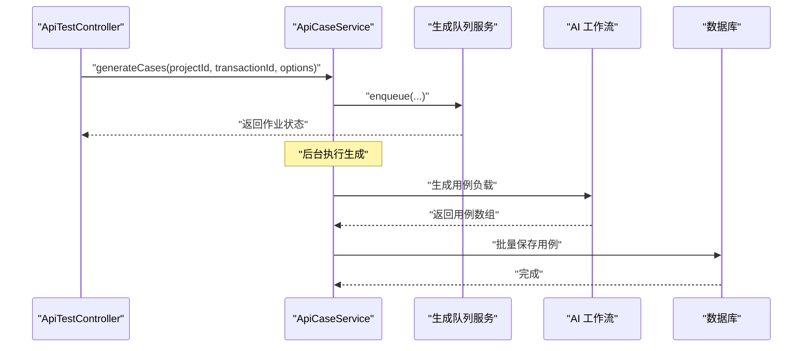
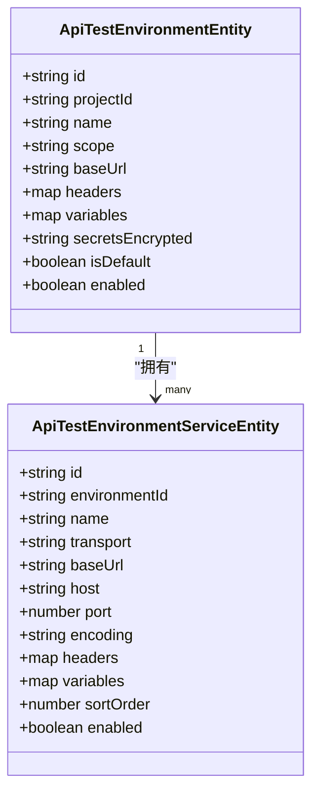
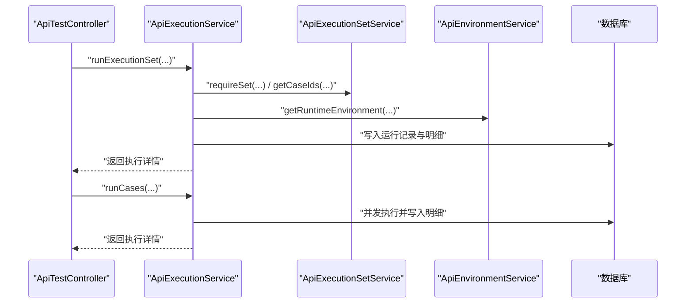
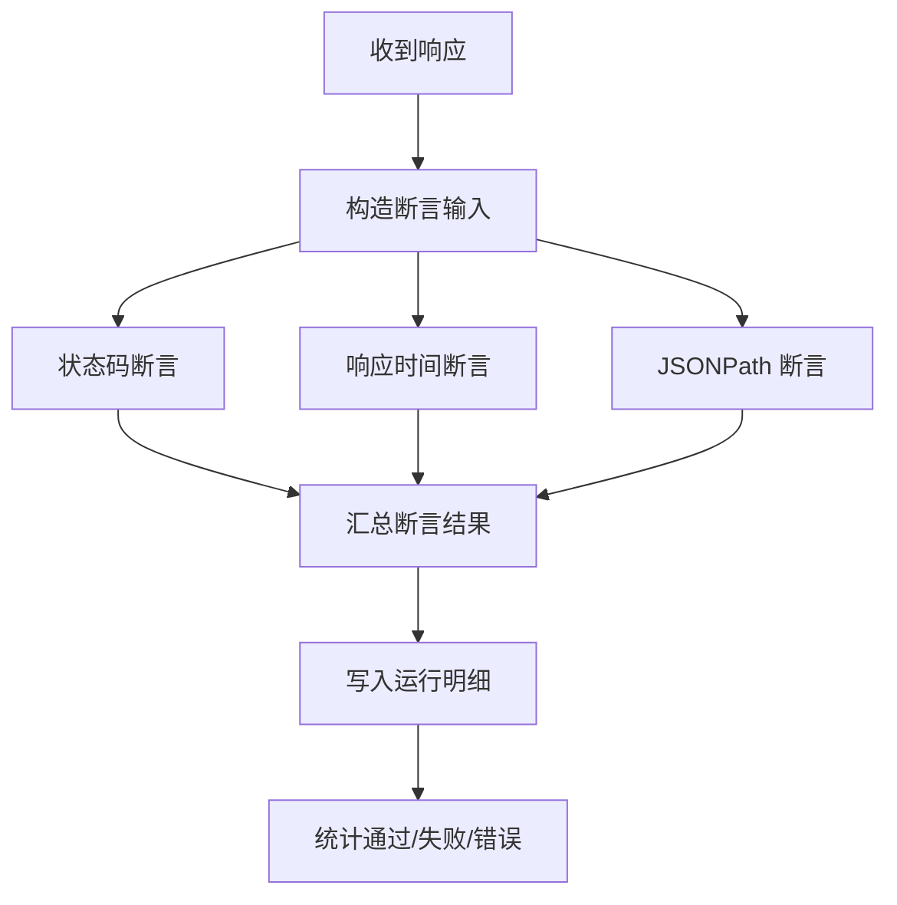
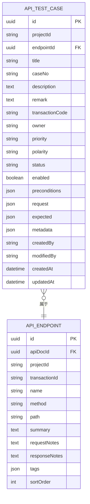
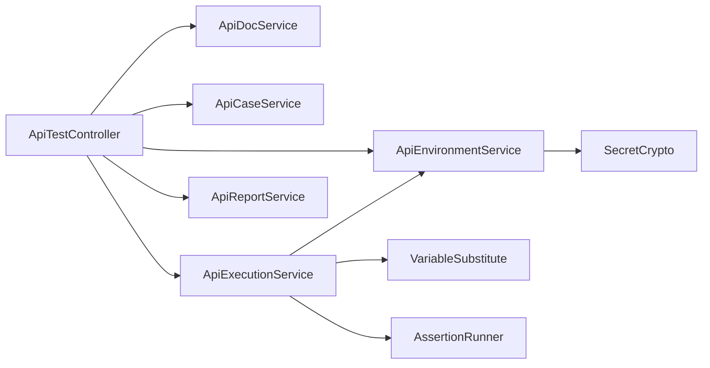

# API 测试模块

<cite>
**本文引用的文件**
- [apps/api/src/modules/api-test/index.ts](file://apps/api/src/modules/api-test/index.ts)
- [apps/api/src/modules/api-test/controller/api-test.controller.ts](file://apps/api/src/modules/api-test/controller/api-test.controller.ts)
- [apps/api/src/modules/api-test/service/api-doc.service.ts](file://apps/api/src/modules/api-test/service/api-doc.service.ts)
- [apps/api/src/modules/api-test/service/api-case.service.ts](file://apps/api/src/modules/api-test/service/api-case.service.ts)
- [apps/api/src/modules/api-test/service/api-environment.service.ts](file://apps/api/src/modules/api-test/service/api-environment.service.ts)
- [apps/api/src/modules/api-test/service/api-execution.service.ts](file://apps/api/src/modules/api-test/service/api-execution.service.ts)
- [apps/api/src/modules/api-test/service/api-report.service.ts](file://apps/api/src/modules/api-test/service/api-report.service.ts)
- [apps/api/src/modules/api-test/util/variable-substitute.util.ts](file://apps/api/src/modules/api-test/util/variable-substitute.util.ts)
- [apps/api/src/modules/api-test/util/secret-crypto.util.ts](file://apps/api/src/modules/api-test/util/secret-crypto.util.ts)
- [apps/api/src/modules/api-test/util/assertion-runner.util.ts](file://apps/api/src/modules/api-test/util/assertion-runner.util.ts)
- [apps/api/src/modules/api-test/entity/api-test-case.entity.ts](file://apps/api/src/modules/api-test/entity/api-test-case.entity.ts)
- [apps/api/src/modules/api-test/dto/save-api-case.dto.ts](file://apps/api/src/modules/api-test/dto/save-api-case.dto.ts)
- [apps/api/src/modules/api-test/dto/save-api-doc.dto.ts](file://apps/api/src/modules/api-test/dto/save-api-doc.dto.ts)
- [apps/api/src/modules/api-test/dto/save-environment.dto.ts](file://apps/api/src/modules/api-test/dto/save-environment.dto.ts)
- [apps/api/src/modules/api-test/dto/save-transaction.dto.ts](file://apps/api/src/modules/api-test/dto/save-transaction.dto.ts)
</cite>

## 目录
1. [简介](#简介)
2. [项目结构](#项目结构)
3. [核心组件](#核心组件)
4. [架构总览](#架构总览)
5. [详细组件分析](#详细组件分析)
6. [依赖关系分析](#依赖关系分析)
7. [性能考量](#性能考量)
8. [故障排查指南](#故障排查指南)
9. [结论](#结论)
10. [附录](#附录)

## 简介
本文件面向 API 测试模块，系统性阐述接口文档管理、测试用例生成与执行集管理机制；详解环境变量管理、变量替换与加密存储策略；说明测试报告生成、断言执行与结果统计功能；并覆盖事务管理、执行平台集成与批量操作的实现细节。文档同时提供完整的 API 接口清单与使用示例，帮助读者高效开展 API 测试自动化。

## 项目结构
API 测试模块采用 NestJS 的模块化组织方式，按领域拆分控制器、服务、实体与工具类，职责清晰、边界明确。模块入口负责注册 TypeORM 实体、导入 MinIO 存储与 AI 工作流模块，并导出核心服务供上层使用。

**图表来源**
- [apps/api/src/modules/api-test/index.ts:28-69](file://apps/api/src/modules/api-test/index.ts#L28-L69)
- [apps/api/src/modules/api-test/controller/api-test.controller.ts:58-72](file://apps/api/src/modules/api-test/controller/api-test.controller.ts#L58-L72)
- [apps/api/src/modules/api-test/service/api-doc.service.ts:32-46](file://apps/api/src/modules/api-test/service/api-doc.service.ts#L32-L46)
- [apps/api/src/modules/api-test/service/api-case.service.ts:38-58](file://apps/api/src/modules/api-test/service/api-case.service.ts#L38-L58)
- [apps/api/src/modules/api-test/service/api-environment.service.ts:24-31](file://apps/api/src/modules/api-test/service/api-environment.service.ts#L24-L31)
- [apps/api/src/modules/api-test/service/api-execution.service.ts:53-64](file://apps/api/src/modules/api-test/service/api-execution.service.ts#L53-L64)
- [apps/api/src/modules/api-test/service/api-report.service.ts:17-25](file://apps/api/src/modules/api-test/service/api-report.service.ts#L17-L25)
- [apps/api/src/modules/api-test/util/variable-substitute.util.ts:1-43](file://apps/api/src/modules/api-test/util/variable-substitute.util.ts#L1-L43)
- [apps/api/src/modules/api-test/util/assertion-runner.util.ts:1-107](file://apps/api/src/modules/api-test/util/assertion-runner.util.ts#L1-L107)
- [apps/api/src/modules/api-test/util/secret-crypto.util.ts:1-48](file://apps/api/src/modules/api-test/util/secret-crypto.util.ts#L1-L48)
- [apps/api/src/modules/api-test/entity/api-test-case.entity.ts:21-99](file://apps/api/src/modules/api-test/entity/api-test-case.entity.ts#L21-L99)

**章节来源**
- [apps/api/src/modules/api-test/index.ts:28-69](file://apps/api/src/modules/api-test/index.ts#L28-L69)
- [apps/api/src/modules/api-test/controller/api-test.controller.ts:58-72](file://apps/api/src/modules/api-test/controller/api-test.controller.ts#L58-L72)

## 核心组件
- 控制器层：统一暴露 REST 接口，涵盖文档上传/解析、用例 CRUD、环境与环境服务维护、执行集管理、批量执行与报告导出等。
- 服务层：
  - 文档服务：处理 Excel 上传、结构化解析、自动保存与持久化。
  - 用例服务：生成用例（含 AI 与兜底）、列表查询、校验与权限控制。
  - 环境服务：环境与环境服务的增删改查、默认项清理、运行时合并与解密。
  - 执行服务：并发执行 HTTP/TCP 案例、断言、统计与运行记录写入。
  - 报告服务：汇总统计、Excel/PDF/HTML 导出。
- 工具层：
  - 变量替换：递归替换请求中的占位符。
  - 断言运行：基于状态码、响应时间与 JSONPath 断言。
  - 加密存储：基于 AES-256-GCM 的对称加密与脱敏显示。

**章节来源**
- [apps/api/src/modules/api-test/controller/api-test.controller.ts:74-564](file://apps/api/src/modules/api-test/controller/api-test.controller.ts#L74-L564)
- [apps/api/src/modules/api-test/service/api-doc.service.ts:32-281](file://apps/api/src/modules/api-test/service/api-doc.service.ts#L32-L281)
- [apps/api/src/modules/api-test/service/api-case.service.ts:38-444](file://apps/api/src/modules/api-test/service/api-case.service.ts#L38-L444)
- [apps/api/src/modules/api-test/service/api-environment.service.ts:24-409](file://apps/api/src/modules/api-test/service/api-environment.service.ts#L24-L409)
- [apps/api/src/modules/api-test/service/api-execution.service.ts:53-611](file://apps/api/src/modules/api-test/service/api-execution.service.ts#L53-L611)
- [apps/api/src/modules/api-test/service/api-report.service.ts:17-321](file://apps/api/src/modules/api-test/service/api-report.service.ts#L17-L321)
- [apps/api/src/modules/api-test/util/variable-substitute.util.ts:1-43](file://apps/api/src/modules/api-test/util/variable-substitute.util.ts#L1-L43)
- [apps/api/src/modules/api-test/util/assertion-runner.util.ts:1-107](file://apps/api/src/modules/api-test/util/assertion-runner.util.ts#L1-L107)
- [apps/api/src/modules/api-test/util/secret-crypto.util.ts:1-48](file://apps/api/src/modules/api-test/util/secret-crypto.util.ts#L1-L48)

## 架构总览
下图展示从控制器到服务与工具的调用链路，以及数据在各层之间的流转。

**图表来源**
- [apps/api/src/modules/api-test/controller/api-test.controller.ts:135-166](file://apps/api/src/modules/api-test/controller/api-test.controller.ts#L135-L166)
- [apps/api/src/modules/api-test/service/api-doc.service.ts:59-80](file://apps/api/src/modules/api-test/service/api-doc.service.ts#L59-L80)
- [apps/api/src/modules/api-test/service/api-case.service.ts:196-223](file://apps/api/src/modules/api-test/service/api-case.service.ts#L196-L223)
- [apps/api/src/modules/api-test/service/api-environment.service.ts:104-155](file://apps/api/src/modules/api-test/service/api-environment.service.ts#L104-L155)
- [apps/api/src/modules/api-test/service/api-execution.service.ts:66-143](file://apps/api/src/modules/api-test/service/api-execution.service.ts#L66-L143)
- [apps/api/src/modules/api-test/service/api-report.service.ts:70-107](file://apps/api/src/modules/api-test/service/api-report.service.ts#L70-L107)

## 详细组件分析

### 接口文档管理
- 上传与解析
  - 支持 Excel 文件上传，校验扩展名与内容；上传后写入对象存储并记录源路径。
  - 结构化解析：读取对象存储中的 Excel，提取文本并解析接口端点，替换现有端点集合。
- 编辑与持久化
  - 支持自动保存临时结构化 Markdown 与手动保存结构化内容。
  - 保存时校验结构化内容非空，解析端点并写入数据库。
- 权限与状态
  - 严格基于项目与用户作用域查询与更新；提供“结构化状态”与“是否可生成用例”的前端提示字段。

**图表来源**
- [apps/api/src/modules/api-test/controller/api-test.controller.ts:135-166](file://apps/api/src/modules/api-test/controller/api-test.controller.ts#L135-L166)
- [apps/api/src/modules/api-test/service/api-doc.service.ts:59-129](file://apps/api/src/modules/api-test/service/api-doc.service.ts#L59-L129)

**章节来源**
- [apps/api/src/modules/api-test/controller/api-test.controller.ts:135-197](file://apps/api/src/modules/api-test/controller/api-test.controller.ts#L135-L197)
- [apps/api/src/modules/api-test/service/api-doc.service.ts:48-223](file://apps/api/src/modules/api-test/service/api-doc.service.ts#L48-L223)

### 测试用例生成与管理
- 生成流程
  - 入队生成：校验交易码与端点集合，必要时保存场景提示词 ID；返回作业状态。
  - 执行生成：优先使用 AI 生成用例，失败则回退到模板生成；批量写入用例并打上来源标记。
- 用例 CRUD
  - 列表：按项目与当前用户过滤，支持分页与排序。
  - 创建/更新：校验请求与预期配置（如 HTTP 必须包含 method/path、状态码等），自动填充审计字段。
  - 删除：级联清理执行集关联。
- 用例来源与回退
  - AI 生成时记录 promptIds；编辑后区分 manual/ai_edited，保证后续回退策略可用。

**图表来源**
- [apps/api/src/modules/api-test/controller/api-test.controller.ts:283-316](file://apps/api/src/modules/api-test/controller/api-test.controller.ts#L283-L316)
- [apps/api/src/modules/api-test/service/api-case.service.ts:196-235](file://apps/api/src/modules/api-test/service/api-case.service.ts#L196-L235)
- [apps/api/src/modules/api-test/service/api-case.service.ts:269-350](file://apps/api/src/modules/api-test/service/api-case.service.ts#L269-L350)

**章节来源**
- [apps/api/src/modules/api-test/controller/api-test.controller.ts:246-316](file://apps/api/src/modules/api-test/controller/api-test.controller.ts#L246-L316)
- [apps/api/src/modules/api-test/service/api-case.service.ts:60-194](file://apps/api/src/modules/api-test/service/api-case.service.ts#L60-L194)
- [apps/api/src/modules/api-test/service/api-case.service.ts:269-350](file://apps/api/src/modules/api-test/service/api-case.service.ts#L269-L350)

### 环境变量管理、变量替换与加密存储
- 环境与服务
  - 环境：支持全局/系统/个人作用域，默认项清理与设置；可配置基础 URL、请求头、变量与令牌。
  - 环境服务：支持 HTTP/TCP 服务，可配置编码、帧格式、主机端口、路径前缀等；支持排序与启用状态。
- 运行时合并
  - 运行时环境将环境层与服务层变量、头与目标地址合并，优先使用选中的服务；校验 HTTP 需要 http(s) 基础地址，TCP 需要 host/port。
- 变量替换
  - 在请求构建阶段递归替换 {{var}} 占位符，支持字符串、数组与对象。
- 加密存储
  - 使用 AES-256-GCM 对敏感字段加密，解密后用于运行时；对外展示掩码值，避免泄露。

**图表来源**
- [apps/api/src/modules/api-test/service/api-environment.service.ts:26-31](file://apps/api/src/modules/api-test/service/api-environment.service.ts#L26-L31)
- [apps/api/src/modules/api-test/service/api-environment.service.ts:104-155](file://apps/api/src/modules/api-test/service/api-environment.service.ts#L104-L155)
- [apps/api/src/modules/api-test/util/variable-substitute.util.ts:1-43](file://apps/api/src/modules/api-test/util/variable-substitute.util.ts#L1-L43)
- [apps/api/src/modules/api-test/util/secret-crypto.util.ts:1-48](file://apps/api/src/modules/api-test/util/secret-crypto.util.ts#L1-L48)

**章节来源**
- [apps/api/src/modules/api-test/service/api-environment.service.ts:33-155](file://apps/api/src/modules/api-test/service/api-environment.service.ts#L33-L155)
- [apps/api/src/modules/api-test/util/variable-substitute.util.ts:3-42](file://apps/api/src/modules/api-test/util/variable-substitute.util.ts#L3-L42)
- [apps/api/src/modules/api-test/util/secret-crypto.util.ts:14-41](file://apps/api/src/modules/api-test/util/secret-crypto.util.ts#L14-L41)

### 执行集管理与批量执行
- 执行集 CRUD
  - 支持创建、更新、删除执行集；可替换集内用例集合；支持查询与分页。
- 批量执行
  - 支持按执行集或直接按用例 ID 批量执行；支持并发度与字符集参数；记录运行详情与断言结果。
- 统计与回填
  - 执行完成后统计通过/失败/错误数量，回填至执行集最近一次运行记录。

**图表来源**
- [apps/api/src/modules/api-test/controller/api-test.controller.ts:487-524](file://apps/api/src/modules/api-test/controller/api-test.controller.ts#L487-L524)
- [apps/api/src/modules/api-test/service/api-execution.service.ts:145-182](file://apps/api/src/modules/api-test/service/api-execution.service.ts#L145-L182)
- [apps/api/src/modules/api-test/service/api-execution.service.ts:66-143](file://apps/api/src/modules/api-test/service/api-execution.service.ts#L66-L143)

**章节来源**
- [apps/api/src/modules/api-test/controller/api-test.controller.ts:422-524](file://apps/api/src/modules/api-test/controller/api-test.controller.ts#L422-L524)
- [apps/api/src/modules/api-test/service/api-execution.service.ts:145-182](file://apps/api/src/modules/api-test/service/api-execution.service.ts#L145-L182)
- [apps/api/src/modules/api-test/service/api-execution.service.ts:66-143](file://apps/api/src/modules/api-test/service/api-execution.service.ts#L66-L143)

### 断言执行与结果统计
- 断言规则
  - HTTP 状态码断言（支持多值与跳过检查）；响应时间断言；JSONPath 断言（包含/相等/正则/自定义描述）。
- 执行与统计
  - 将断言结果写入运行明细；统计通过/失败/错误数量；支持按交易码筛选导出。
- 报告导出
  - 支持 Excel、PDF、HTML 三种格式；PDF 包含汇总卡片与状态分布条形图。

**图表来源**
- [apps/api/src/modules/api-test/util/assertion-runner.util.ts:62-102](file://apps/api/src/modules/api-test/util/assertion-runner.util.ts#L62-L102)
- [apps/api/src/modules/api-test/service/api-execution.service.ts:287-305](file://apps/api/src/modules/api-test/service/api-execution.service.ts#L287-L305)
- [apps/api/src/modules/api-test/service/api-report.service.ts:70-146](file://apps/api/src/modules/api-test/service/api-report.service.ts#L70-L146)

**章节来源**
- [apps/api/src/modules/api-test/util/assertion-runner.util.ts:1-107](file://apps/api/src/modules/api-test/util/assertion-runner.util.ts#L1-L107)
- [apps/api/src/modules/api-test/service/api-execution.service.ts:287-305](file://apps/api/src/modules/api-test/service/api-execution.service.ts#L287-L305)
- [apps/api/src/modules/api-test/service/api-report.service.ts:27-146](file://apps/api/src/modules/api-test/service/api-report.service.ts#L27-L146)

### 数据模型与实体
- 用例实体包含请求、预期、优先级、极性、状态、启用标志与元数据等字段，支持 JSON 字段存储复杂结构。
- 控制器 DTO 定义了保存用例、生成用例、运行用例与导出报告等请求体规范。

**图表来源**
- [apps/api/src/modules/api-test/entity/api-test-case.entity.ts:21-99](file://apps/api/src/modules/api-test/entity/api-test-case.entity.ts#L21-L99)

**章节来源**
- [apps/api/src/modules/api-test/entity/api-test-case.entity.ts:21-99](file://apps/api/src/modules/api-test/entity/api-test-case.entity.ts#L21-L99)
- [apps/api/src/modules/api-test/dto/save-api-case.dto.ts:19-135](file://apps/api/src/modules/api-test/dto/save-api-case.dto.ts#L19-L135)

## 依赖关系分析
- 模块耦合
  - 控制器依赖多个服务；执行服务依赖环境服务与断言工具；报告服务依赖执行服务与端点查询。
- 外部依赖
  - MinIO 对象存储用于文档存储；ExcelJS/PDFKit 用于报告导出；iconv-lite 用于字符集编码转换。
- 并发与性能
  - 执行服务以固定并发度拉起多个执行器，确保吞吐与稳定性；断言与变量替换均为纯函数，开销低。

**图表来源**
- [apps/api/src/modules/api-test/controller/api-test.controller.ts:58-72](file://apps/api/src/modules/api-test/controller/api-test.controller.ts#L58-L72)
- [apps/api/src/modules/api-test/service/api-execution.service.ts:53-64](file://apps/api/src/modules/api-test/service/api-execution.service.ts#L53-L64)
- [apps/api/src/modules/api-test/util/variable-substitute.util.ts:1-43](file://apps/api/src/modules/api-test/util/variable-substitute.util.ts#L1-L43)
- [apps/api/src/modules/api-test/util/assertion-runner.util.ts:1-107](file://apps/api/src/modules/api-test/util/assertion-runner.util.ts#L1-L107)
- [apps/api/src/modules/api-test/util/secret-crypto.util.ts:1-48](file://apps/api/src/modules/api-test/util/secret-crypto.util.ts#L1-L48)

**章节来源**
- [apps/api/src/modules/api-test/controller/api-test.controller.ts:58-72](file://apps/api/src/modules/api-test/controller/api-test.controller.ts#L58-L72)
- [apps/api/src/modules/api-test/service/api-execution.service.ts:53-64](file://apps/api/src/modules/api-test/service/api-execution.service.ts#L53-L64)

## 性能考量
- 并发执行：默认并发 5，最大 10；根据资源情况合理调整，避免对目标系统造成压力。
- 字符集与编码：HTTP 请求头自动注入 charset；TCP 发送前按配置编码，避免乱码与解析失败。
- 资源限制：断言与日志输出对大体量响应进行截断，避免内存与网络开销过大。
- I/O 优化：文档解析与报告导出使用流式处理，降低内存峰值。

## 故障排查指南
- 文档上传失败
  - 检查文件扩展名与对象存储写入权限；确认“强制覆盖”参数与现有文档状态。
- 结构化失败
  - 查看错误信息与状态标记；重新解析或手动保存结构化内容。
- 用例生成失败
  - 确认已上传并结构化文档；检查端点集合与场景提示词 ID；查看队列状态与取消操作。
- 执行失败
  - 检查环境基础 URL 是否为 http(s)；TCP 服务是否配置 host/port；查看断言明细定位问题。
- 报告导出为空
  - 确认执行记录存在明细；按交易码筛选后导出。

**章节来源**
- [apps/api/src/modules/api-test/service/api-doc.service.ts:82-129](file://apps/api/src/modules/api-test/service/api-doc.service.ts#L82-L129)
- [apps/api/src/modules/api-test/service/api-case.service.ts:217-223](file://apps/api/src/modules/api-test/service/api-case.service.ts#L217-L223)
- [apps/api/src/modules/api-test/service/api-environment.service.ts:420-475](file://apps/api/src/modules/api-test/service/api-environment.service.ts#L420-L475)
- [apps/api/src/modules/api-test/service/api-execution.service.ts:306-330](file://apps/api/src/modules/api-test/service/api-execution.service.ts#L306-L330)
- [apps/api/src/modules/api-test/service/api-report.service.ts:70-107](file://apps/api/src/modules/api-test/service/api-report.service.ts#L70-L107)

## 结论
该模块围绕“文档—用例—环境—执行—报告”的完整闭环设计，具备完善的权限控制、变量替换与加密存储能力，支持 HTTP/TCP 多协议执行与多格式报告导出。通过执行集与批量执行，可满足规模化测试场景；配合断言与统计，便于持续改进质量。

## 附录

### API 接口清单与使用示例

- 文档管理
  - 上传接口文档（Excel）
    - 方法与路径：POST /api-test/{projectId}/transactions/{transactionId}/document/upload
    - 查询参数：force（可选，布尔）
    - 表单字段：file（必填，xls/xlsx）
    - 示例：上传后触发结构化解析，需后续调用结构化接口
  - 结构化接口文档
    - 方法与路径：POST /api-test/{projectId}/transactions/{transactionId}/document/structure
    - 返回：结构化后的文档与端点集合
  - 获取文档
    - 方法与路径：GET /api-test/{projectId}/transactions/{transactionId}/document
    - 返回：文档与端点、统计信息
  - 自动保存结构化内容
    - 方法与路径：PATCH /api-test/{projectId}/transactions/{transactionId}/document/auto-save
    - 请求体：tempStructuredMarkdown
  - 保存结构化内容
    - 方法与路径：PATCH /api-test/{projectId}/transactions/{transactionId}/document
    - 请求体：structuredMarkdown 或 endpoints 数组
  - 保存生成提示词
    - 方法与路径：PATCH /api-test/{projectId}/transactions/{transactionId}/document/generation
    - 请求体：promptIds 数组

- 用例管理
  - 列出用例
    - 方法与路径：GET /api-test/{projectId}/transactions/{transactionId}/cases
    - 查询参数：page/pageSize
  - 新建用例
    - 方法与路径：POST /api-test/{projectId}/transactions/{transactionId}/cases
    - 请求体：SaveApiCaseDto
  - 更新用例
    - 方法与路径：PATCH /api-test/{projectId}/transactions/{transactionId}/cases/{caseId}
    - 请求体：SaveApiCaseDto
  - 删除用例
    - 方法与路径：DELETE /api-test/{projectId}/transactions/{transactionId}/cases/{caseId}
  - 生成用例
    - 方法与路径：POST /api-test/{projectId}/transactions/{transactionId}/cases/generate
    - 请求体：GenerateApiCasesDto（可选 endpointIds/promptIds）
  - 查询生成状态
    - 方法与路径：GET /api-test/{projectId}/transactions/{transactionId}/cases/generate/status
  - 取消生成
    - 方法与路径：POST /api-test/{projectId}/transactions/{transactionId}/cases/generate/cancel

- 环境与环境服务
  - 列出环境
    - 方法与路径：GET /api-test/{projectId}/environments
  - 新建环境
    - 方法与路径：POST /api-test/{projectId}/environments
    - 请求体：SaveApiEnvironmentDto（可携带明文 token，仅保存时提交）
  - 更新/删除环境
    - 方法与路径：PATCH /api-test/{projectId}/environments/{environmentId}
    - 方法与路径：DELETE /api-test/{projectId}/environments/{environmentId}
  - 列出环境服务
    - 方法与路径：GET /api-test/{projectId}/environments/{environmentId}/services
  - 新建/更新/删除环境服务
    - 方法与路径：POST /api-test/{projectId}/environments/{environmentId}/services
    - 方法与路径：PATCH /api-test/{projectId}/environments/{environmentId}/services/{serviceId}
    - 方法与路径：DELETE /api-test/{projectId}/environments/{environmentId}/services/{serviceId}
  - 环境服务重排
    - 方法与路径：PATCH /api-test/{projectId}/environments/{environmentId}/services/{serviceId}/reorder
    - 请求体：direction（up/down/top）

- 执行集与批量执行
  - 列出执行集
    - 方法与路径：GET /api-test/{projectId}/transactions/{transactionId}/execution-sets
    - 查询参数：page/pageSize
  - 新建/更新/删除执行集
    - 方法与路径：POST /api-test/{projectId}/transactions/{transactionId}/execution-sets
    - 方法与路径：PATCH /api-test/{projectId}/transactions/{transactionId}/execution-sets/{setId}
    - 方法与路径：DELETE /api-test/{projectId}/transactions/{transactionId}/execution-sets/{setId}
  - 替换执行集用例
    - 方法与路径：PUT /api-test/{projectId}/transactions/{transactionId}/execution-sets/{setId}/cases
    - 请求体：caseIds 数组
  - 运行执行集
    - 方法与路径：POST /api-test/{projectId}/transactions/{transactionId}/execution-sets/{setId}/runs
    - 请求体：environmentId/environmentServiceId/concurrency/encoding
  - 运行用例
    - 方法与路径：POST /api-test/{projectId}/transactions/{transactionId}/runs
    - 请求体：caseIds/environmentId/environmentServiceId/concurrency
  - 列出运行记录
    - 方法与路径：GET /api-test/{projectId}/runs
  - 获取运行详情
    - 方法与路径：GET /api-test/{projectId}/runs/{runId}

- 报告与统计
  - 报告汇总
    - 方法与路径：GET /api-test/{projectId}/transactions/{transactionId}/reports/summary
    - 查询参数：runId（可选）
  - 导出报告
    - 方法与路径：POST /api-test/{projectId}/transactions/{transactionId}/reports/export
    - 请求体：format（xlsx/pdf/html）+ runId
    - 响应：Content-Type 与文件流

- 交易码管理
  - 列出交易码
    - 方法与路径：GET /api-test/{projectId}/transactions
  - 新建/更新/删除交易码
    - 方法与路径：POST /api-test/{projectId}/transactions
    - 方法与路径：PATCH /api-test/{projectId}/transactions/{transactionId}
    - 方法与路径：DELETE /api-test/{projectId}/transactions/{transactionId}
  - 批量删除交易码
    - 方法与路径：POST /api-test/{projectId}/transactions/batch-delete
    - 请求体：ids 数组
  - 查询上传状态
    - 方法与路径：GET /api-test/{projectId}/transactions/{transactionId}/upload-status

**章节来源**
- [apps/api/src/modules/api-test/controller/api-test.controller.ts:74-564](file://apps/api/src/modules/api-test/controller/api-test.controller.ts#L74-L564)
- [apps/api/src/modules/api-test/dto/save-api-case.dto.ts:19-135](file://apps/api/src/modules/api-test/dto/save-api-case.dto.ts#L19-L135)
- [apps/api/src/modules/api-test/dto/save-api-doc.dto.ts:5-21](file://apps/api/src/modules/api-test/dto/save-api-doc.dto.ts#L5-L21)
- [apps/api/src/modules/api-test/dto/save-environment.dto.ts:10-49](file://apps/api/src/modules/api-test/dto/save-environment.dto.ts#L10-L49)
- [apps/api/src/modules/api-test/dto/save-transaction.dto.ts:3-18](file://apps/api/src/modules/api-test/dto/save-transaction.dto.ts#L3-L18)