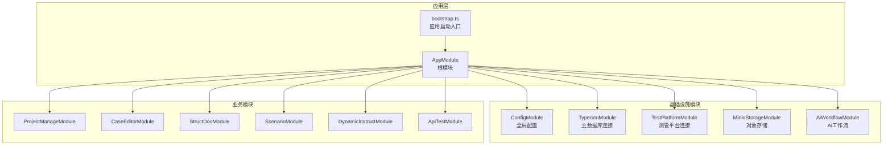
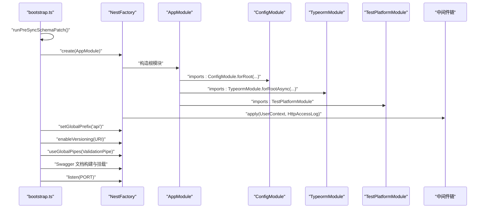
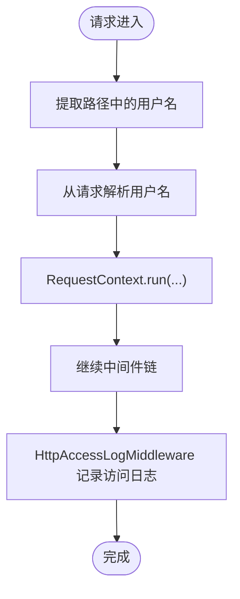
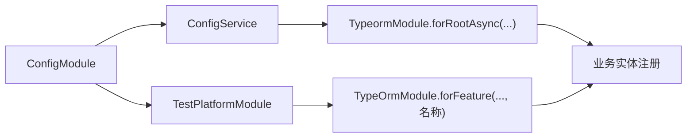
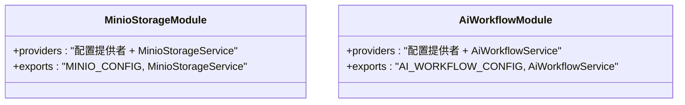
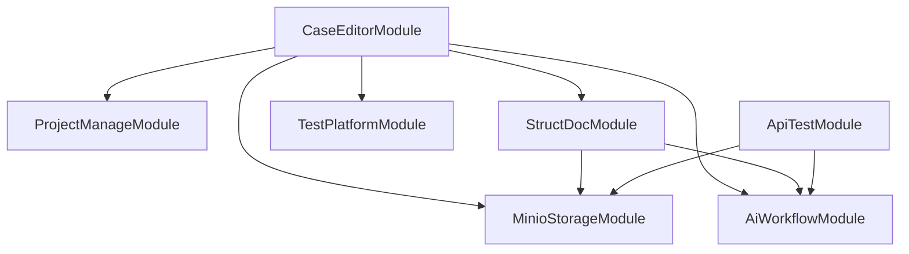
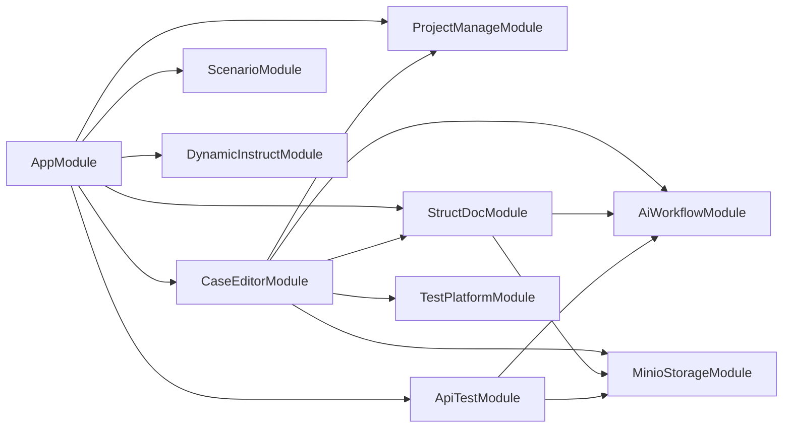

# NestJS 模块设计原理

<cite>
**本文引用的文件**
- [apps/api/src/app.module.ts](file://apps/api/src/app.module.ts)
- [apps/api/src/bootstrap.ts](file://apps/api/src/bootstrap.ts)
- [apps/api/src/modules/api-test/index.ts](file://apps/api/src/modules/api-test/index.ts)
- [apps/api/src/modules/case-editor/index.ts](file://apps/api/src/modules/case-editor/index.ts)
- [apps/api/src/modules/project-manage/index.ts](file://apps/api/src/modules/project-manage/index.ts)
- [apps/api/src/modules/struct-doc/index.ts](file://apps/api/src/modules/struct-doc/index.ts)
- [apps/api/src/modules/scenario/index.ts](file://apps/api/src/modules/scenario/index.ts)
- [apps/api/src/modules/dynamic-instruct/index.ts](file://apps/api/src/modules/dynamic-instruct/index.ts)
- [apps/api/src/common/ai-workflow/index.ts](file://apps/api/src/common/ai-workflow/index.ts)
- [apps/api/src/common/minio/index.ts](file://apps/api/src/common/minio/index.ts)
- [apps/api/src/common/typeorm/index.ts](file://apps/api/src/common/typeorm/index.ts)
- [apps/api/src/common/test-platform/index.ts](file://apps/api/src/common/test-platform/index.ts)
- [apps/api/src/config/configuration.ts](file://apps/api/src/config/configuration.ts)
- [apps/api/src/common/audit/user-context.middleware.ts](file://apps/api/src/common/audit/user-context.middleware.ts)
- [apps/api/src/common/http/http-access-log.middleware.ts](file://apps/api/src/common/http/http-access-log.middleware.ts)
</cite>

## 目录
1. [引言](#引言)
2. [项目结构](#项目结构)
3. [核心组件](#核心组件)
4. [架构总览](#架构总览)
5. [详细组件分析](#详细组件分析)
6. [依赖关系分析](#依赖关系分析)
7. [性能考量](#性能考量)
8. [故障排查指南](#故障排查指南)
9. [结论](#结论)
10. [附录](#附录)

## 引言
本文件系统性阐述该 NestJS 项目的模块设计原理，围绕以下主题展开：模块核心概念、装饰器与依赖注入、模块生命周期与初始化顺序、模块间依赖与循环依赖处理、模块加载策略、配置选项与提供者注册、控制器绑定最佳实践，以及可复用与可维护模块的设计范式。文中所有技术细节均基于仓库中的实际源码进行分析与归纳。

## 项目结构
该项目采用“根模块聚合 + 业务域模块拆分”的组织方式：
- 根模块负责导入全局配置、基础设施模块（数据库、对象存储、AI 工作流、测管平台等），并装配中间件。
- 业务模块按功能域划分（如案例编辑器、接口测试、结构化文档、场景维护、动态指令、项目管理等），每个模块内部通过 TypeORM 注册实体、提供者与控制器，并按需导出服务以供其他模块复用。
- 基础设施模块封装第三方能力（如 MinIO、TypeORM 多连接、AI 工作流）并通过配置提供者统一注入。

图表来源
- [apps/api/src/app.module.ts:21-39](file://apps/api/src/app.module.ts#L21-L39)
- [apps/api/src/bootstrap.ts:18-61](file://apps/api/src/bootstrap.ts#L18-L61)

章节来源
- [apps/api/src/app.module.ts:1-48](file://apps/api/src/app.module.ts#L1-L48)
- [apps/api/src/bootstrap.ts:1-64](file://apps/api/src/bootstrap.ts#L1-L64)

## 核心组件
- 根模块（AppModule）
  - 通过 imports 导入全局配置、数据库、测管平台、对象存储、AI 工作流、各业务模块。
  - 通过实现 NestModule 接口在 configure 中装配全局中间件（用户上下文与访问日志）。
- 基础设施模块
  - ConfigModule：集中加载配置工厂，支持多环境文件路径与全局可用。
  - TypeormModule：基于 Async 工厂创建主数据库连接，提供 SchemaPatchService。
  - TestPlatformModule：创建独立连接名的 TypeORM 连接，并导出 TypeOrmModule 以便其他模块按连接名使用。
  - MinioStorageModule：通过配置提供者注入 MinIO 客户端与服务。
  - AiWorkflowModule：通过配置提供者注入 AI 工作流配置与服务。
- 业务模块
  - 按功能域划分，统一使用 TypeOrmModule.forFeature 注册实体，提供服务与控制器，并按需导出服务以供跨模块复用。
  - 例如：CaseEditorModule、StructDocModule、ApiTestModule 等。

章节来源
- [apps/api/src/app.module.ts:21-47](file://apps/api/src/app.module.ts#L21-L47)
- [apps/api/src/common/typeorm/index.ts:10-21](file://apps/api/src/common/typeorm/index.ts#L10-L21)
- [apps/api/src/common/test-platform/index.ts:13-32](file://apps/api/src/common/test-platform/index.ts#L13-L32)
- [apps/api/src/common/minio/index.ts:9-17](file://apps/api/src/common/minio/index.ts#L9-L17)
- [apps/api/src/common/ai-workflow/index.ts:12-20](file://apps/api/src/common/ai-workflow/index.ts#L12-L20)

## 架构总览
下图展示了应用启动到模块装配的关键流程：启动入口加载环境与预检查、创建 Nest 应用、设置全局前缀与版本控制、注册全局管道与 Swagger、装配中间件、最后监听端口。

图表来源
- [apps/api/src/bootstrap.ts:18-61](file://apps/api/src/bootstrap.ts#L18-L61)
- [apps/api/src/app.module.ts:21-47](file://apps/api/src/app.module.ts#L21-L47)

## 详细组件分析

### 根模块与中间件装配
- 根模块通过 imports 组织全局依赖；通过实现 NestModule 的 configure 方法，将用户上下文中间件与访问日志中间件应用于所有路由。
- 用户上下文中间件从路径、请求头或查询参数解析用户名，注入 RequestContext 并重写路径。
- 访问日志中间件在响应 finish 事件中记录方法、路径、状态码、耗时、用户与 IP。

图表来源
- [apps/api/src/common/audit/user-context.middleware.ts:8-20](file://apps/api/src/common/audit/user-context.middleware.ts#L8-L20)
- [apps/api/src/common/http/http-access-log.middleware.ts:7-46](file://apps/api/src/common/http/http-access-log.middleware.ts#L7-L46)

章节来源
- [apps/api/src/app.module.ts:41-47](file://apps/api/src/app.module.ts#L41-L47)
- [apps/api/src/common/audit/user-context.middleware.ts:1-21](file://apps/api/src/common/audit/user-context.middleware.ts#L1-L21)
- [apps/api/src/common/http/http-access-log.middleware.ts:1-47](file://apps/api/src/common/http/http-access-log.middleware.ts#L1-L47)

### 数据库模块（TypeORM 与测管平台）
- TypeormModule 使用 Async 工厂创建主数据库连接，注入 ConfigModule 与 ConfigService，确保配置可被读取。
- TestPlatformModule 创建独立连接名的 TypeORM 连接，并导出 TypeOrmModule 以便其他模块按连接名使用 forFeature。
- 两者均通过 exports 提供连接与实体注册能力，便于业务模块按需使用。

图表来源
- [apps/api/src/common/typeorm/index.ts:10-21](file://apps/api/src/common/typeorm/index.ts#L10-L21)
- [apps/api/src/common/test-platform/index.ts:13-32](file://apps/api/src/common/test-platform/index.ts#L13-L32)

章节来源
- [apps/api/src/common/typeorm/index.ts:1-22](file://apps/api/src/common/typeorm/index.ts#L1-L22)
- [apps/api/src/common/test-platform/index.ts:1-35](file://apps/api/src/common/test-platform/index.ts#L1-L35)

### 对象存储与 AI 工作流模块
- MinioStorageModule 通过配置提供者注入 MinIO 配置与存储服务，统一对外导出配置与服务。
- AiWorkflowModule 通过配置提供者注入 AI 工作流配置与服务，统一对外导出配置与服务。

图表来源
- [apps/api/src/common/minio/index.ts:9-17](file://apps/api/src/common/minio/index.ts#L9-L17)
- [apps/api/src/common/ai-workflow/index.ts:12-20](file://apps/api/src/common/ai-workflow/index.ts#L12-L20)

章节来源
- [apps/api/src/common/minio/index.ts:1-18](file://apps/api/src/common/minio/index.ts#L1-L18)
- [apps/api/src/common/ai-workflow/index.ts:1-21](file://apps/api/src/common/ai-workflow/index.ts#L1-L21)

### 业务模块：案例编辑器、结构化文档、接口测试
- 案例编辑器模块（CaseEditorModule）
  - 注册多个实体并通过 TypeOrmModule.forFeature 注入。
  - 导入 ProjectManageModule、StructDocModule、AiWorkflowModule、MinioStorageModule、TestPlatformModule。
  - 提供并导出 CaseEditorService、CaseWorkspaceService。
- 结构化文档模块（StructDocModule）
  - 注册结构化文档相关实体，导入 MinioStorageModule 与 AiWorkflowModule。
  - 提供并导出 StructDocService。
- 接口测试模块（ApiTestModule）
  - 注册接口测试相关实体，导入 MinioStorageModule 与 AiWorkflowModule。
  - 提供并导出多个服务（如 ApiDocService、ApiCaseService、ApiExecutionService 等）。

图表来源
- [apps/api/src/modules/case-editor/index.ts:29-59](file://apps/api/src/modules/case-editor/index.ts#L29-L59)
- [apps/api/src/modules/struct-doc/index.ts:18-33](file://apps/api/src/modules/struct-doc/index.ts#L18-L33)
- [apps/api/src/modules/api-test/index.ts:28-70](file://apps/api/src/modules/api-test/index.ts#L28-L70)

章节来源
- [apps/api/src/modules/case-editor/index.ts:1-60](file://apps/api/src/modules/case-editor/index.ts#L1-L60)
- [apps/api/src/modules/struct-doc/index.ts:1-34](file://apps/api/src/modules/struct-doc/index.ts#L1-L34)
- [apps/api/src/modules/api-test/index.ts:1-70](file://apps/api/src/modules/api-test/index.ts#L1-L70)

### 场景维护与动态指令模块
- 场景模块（ScenarioModule）与动态指令模块（DynamicInstructModule）分别注册自身实体与服务，控制器用于对外暴露接口。
- 动态指令模块还引用了结构化文档与场景模块的实体，体现模块间协作。

章节来源
- [apps/api/src/modules/scenario/index.ts:1-20](file://apps/api/src/modules/scenario/index.ts#L1-L20)
- [apps/api/src/modules/dynamic-instruct/index.ts:1-30](file://apps/api/src/modules/dynamic-instruct/index.ts#L1-L30)

### 配置与环境加载
- 根模块通过 ConfigModule.forRoot 加载配置工厂与多环境文件路径，使配置对全应用可用。
- 配置工厂从环境变量读取数据库、MinIO、AI 工作流等参数，形成强类型配置对象。

章节来源
- [apps/api/src/app.module.ts:23-27](file://apps/api/src/app.module.ts#L23-L27)
- [apps/api/src/config/configuration.ts:7-48](file://apps/api/src/config/configuration.ts#L7-L48)

## 依赖关系分析
- 模块耦合与内聚
  - 根模块高内聚地聚合基础设施与业务模块，降低上层调用复杂度。
  - 业务模块通过 exports 将服务暴露给其他模块，遵循最小暴露原则。
- 直接与间接依赖
  - CaseEditorModule 直接依赖 ProjectManageModule、StructDocModule、AiWorkflowModule、MinioStorageModule、TestPlatformModule。
  - StructDocModule 与 ApiTestModule 间接共享 AiWorkflowModule 与 MinioStorageModule。
- 循环依赖处理
  - 通过 exports 与 forFeature 的模块化边界避免直接循环依赖；若出现潜在循环，建议拆分共享服务至独立模块或使用惰性导入。
- 外部依赖与集成点
  - TypeORM 多连接（主库与测管平台）通过连接名隔离。
  - MinIO 与 AI 工作流通过配置提供者注入，便于替换与测试。

图表来源
- [apps/api/src/app.module.ts:21-39](file://apps/api/src/app.module.ts#L21-L39)
- [apps/api/src/modules/case-editor/index.ts:29-59](file://apps/api/src/modules/case-editor/index.ts#L29-L59)
- [apps/api/src/modules/struct-doc/index.ts:18-33](file://apps/api/src/modules/struct-doc/index.ts#L18-L33)
- [apps/api/src/modules/api-test/index.ts:28-70](file://apps/api/src/modules/api-test/index.ts#L28-L70)

章节来源
- [apps/api/src/app.module.ts:21-39](file://apps/api/src/app.module.ts#L21-L39)
- [apps/api/src/modules/case-editor/index.ts:29-59](file://apps/api/src/modules/case-editor/index.ts#L29-L59)
- [apps/api/src/modules/struct-doc/index.ts:18-33](file://apps/api/src/modules/struct-doc/index.ts#L18-L33)
- [apps/api/src/modules/api-test/index.ts:28-70](file://apps/api/src/modules/api-test/index.ts#L28-L70)

## 性能考量
- 中间件顺序与开销
  - 用户上下文中间件仅做解析与上下文注入，成本较低；访问日志中间件在 finish 事件记录，注意避免在高频接口上产生过多日志量。
- 数据库连接
  - 主库与测管平台使用独立连接，避免相互阻塞；异步工厂创建连接，减少启动时阻塞。
- 对象存储与 AI 工作流
  - 通过配置提供者注入客户端，建议在服务层增加超时与重试策略，避免单次调用影响整体性能。
- 全局管道与版本控制
  - 全局 ValidationPipe 与 URI 版本控制提升一致性，但应关注 DTO 规模与转换开销。

## 故障排查指南
- 启动阶段
  - 若数据库连接失败，检查 TypeormModule 的 Async 工厂与 ConfigModule 注入是否正确。
  - 若测管平台连接异常，确认连接名与 forFeature 的连接名一致。
- 运行阶段
  - 若访问日志缺失，检查 HttpAccessLogMiddleware 是否正确装配。
  - 若用户上下文为空，检查路径前缀剥离逻辑与用户解析逻辑。
- 模块导出问题
  - 若其他模块无法注入某服务，确认其所在模块已将其加入 exports。

章节来源
- [apps/api/src/common/typeorm/index.ts:10-21](file://apps/api/src/common/typeorm/index.ts#L10-L21)
- [apps/api/src/common/test-platform/index.ts:13-32](file://apps/api/src/common/test-platform/index.ts#L13-L32)
- [apps/api/src/common/http/http-access-log.middleware.ts:7-46](file://apps/api/src/common/http/http-access-log.middleware.ts#L7-L46)
- [apps/api/src/common/audit/user-context.middleware.ts:8-20](file://apps/api/src/common/audit/user-context.middleware.ts#L8-L20)

## 结论
该 NestJS 项目通过根模块聚合与业务域模块拆分，实现了清晰的职责边界与良好的可扩展性。模块间通过 exports 与 forFeature 协作，配合配置提供者与中间件装配，形成了稳定、可维护的模块体系。遵循本文总结的最佳实践，可在保证性能与可维护性的前提下快速迭代新功能。

## 附录
- 模块设计最佳实践
  - 将共享能力下沉为独立模块并通过 exports 暴露必要接口。
  - 使用 forFeature 限定实体作用域，避免跨模块污染。
  - 通过配置提供者集中管理外部依赖，便于替换与测试。
  - 在根模块统一装配中间件与全局配置，保持启动流程简洁可控。
- 生命周期与初始化顺序
  - 启动入口先执行预检查，再创建应用实例，随后装配中间件与全局配置，最后监听端口。
  - 模块初始化顺序由 imports 依赖决定，建议尽量减少循环依赖，必要时拆分或延迟加载。