# 动态指令模块

<cite>
**本文档引用的文件**
- [apps/api/src/modules/dynamic-instruct/controller/dynamic-instruct.controller.ts](file://apps/api/src/modules/dynamic-instruct/controller/dynamic-instruct.controller.ts)
- [apps/api/src/modules/dynamic-instruct/service/dynamic-instruct.service.ts](file://apps/api/src/modules/dynamic-instruct/service/dynamic-instruct.service.ts)
- [apps/api/src/modules/dynamic-instruct/entity/test-point-instruct.entity.ts](file://apps/api/src/modules/dynamic-instruct/entity/test-point-instruct.entity.ts)
- [apps/api/src/modules/dynamic-instruct/entity/test-point-prompt.entity.ts](file://apps/api/src/modules/dynamic-instruct/entity/test-point-prompt.entity.ts)
- [apps/api/src/modules/dynamic-instruct/entity/dynamic-instruct.ts](file://apps/api/src/modules/dynamic-instruct/entity/dynamic-instruct.ts)
- [apps/api/src/modules/dynamic-instruct/dto/create-dynamic-test-point.dto.ts](file://apps/api/src/modules/dynamic-instruct/dto/create-dynamic-test-point.dto.ts)
- [apps/api/src/modules/dynamic-instruct/dto/save-dynamic-instruct.dto.ts](file://apps/api/src/modules/dynamic-instruct/dto/save-dynamic-instruct.dto.ts)
- [apps/api/src/modules/dynamic-instruct/dto/batch-save-dynamic-instruct.dto.ts](file://apps/api/src/modules/dynamic-instruct/dto/batch-save-dynamic-instruct.dto.ts)
- [apps/api/src/modules/dynamic-instruct/dto/list-dynamic-test-points.dto.ts](file://apps/api/src/modules/dynamic-instruct/dto/list-dynamic-test-points.dto.ts)
- [apps/api/src/modules/dynamic-instruct/dto/delete-dynamic-test-points.dto.ts](file://apps/api/src/modules/dynamic-instruct/dto/delete-dynamic-test-points.dto.ts)
- [apps/api/src/modules/dynamic-instruct/dto/update-test-point-definition.dto.ts](file://apps/api/src/modules/dynamic-instruct/dto/update-test-point-definition.dto.ts)
- [apps/api/src/modules/dynamic-instruct/util/test-point-status-sort.util.ts](file://apps/api/src/modules/dynamic-instruct/util/test-point-status-sort.util.ts)
- [apps/api/src/modules/dynamic-instruct/index.ts](file://apps/api/src/modules/dynamic-instruct/index.ts)
- [apps/api/src/modules/struct-doc/entity/test-point.entity.ts](file://apps/api/src/modules/struct-doc/entity/test-point.entity.ts)
- [apps/web/src/api/client.ts](file://apps/web/src/api/client.ts)
- [apps/web/src/utils/testPointDefinition.ts](file://apps/web/src/utils/testPointDefinition.ts)
- [apps/web/src/utils/testPointStatusSort.ts](file://apps/web/src/utils/testPointStatusSort.ts)
- [apps/web/src/stores/caseForge.ts](file://apps/web/src/stores/caseForge.ts)
</cite>

## 目录
1. [简介](#简介)
2. [项目结构](#项目结构)
3. [核心组件](#核心组件)
4. [架构总览](#架构总览)
5. [详细组件分析](#详细组件分析)
6. [依赖分析](#依赖分析)
7. [性能考虑](#性能考虑)
8. [故障排查指南](#故障排查指南)
9. [结论](#结论)
10. [附录](#附录)

## 简介
本模块围绕“测试要点”与“动态指令”的关联与管理，提供从测试点定义、指令生成到状态跟踪与批量维护的完整能力。其核心目标是：
- 定义测试要点（系统、功能模块、测试点名称等），并支持按系统/功能模块筛选与分页列表；
- 为每个测试要点绑定“自然语言约束”和“场景提示词”，并以状态驱动生成流程；
- 提供单条与批量保存动态指令的能力，并支持全量覆盖或追加模式；
- 维护生成状态（待编辑、已编辑、再编辑、生成中、生成失败、生成完成）并进行优先级排序；
- 支持恢复轮询，确保生成任务中断后的继续与结果反馈。

## 项目结构
动态指令模块采用典型的分层设计：控制器负责接口暴露，服务层封装业务逻辑，实体层映射数据库表结构，DTO 负责输入校验与契约定义；同时通过 TypeORM 注册实体，形成清晰的模块边界。

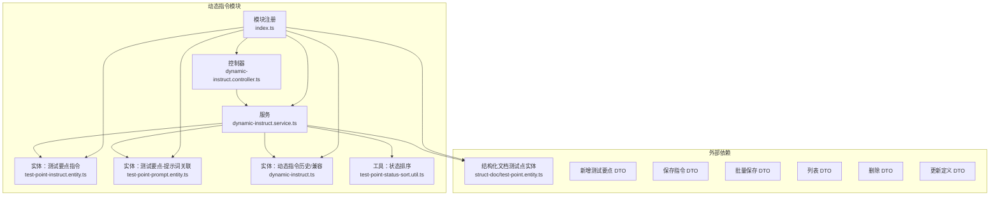

**图表来源**
- [apps/api/src/modules/dynamic-instruct/controller/dynamic-instruct.controller.ts:1-108](file://apps/api/src/modules/dynamic-instruct/controller/dynamic-instruct.controller.ts#L1-L108)
- [apps/api/src/modules/dynamic-instruct/service/dynamic-instruct.service.ts:1-474](file://apps/api/src/modules/dynamic-instruct/service/dynamic-instruct.service.ts#L1-L474)
- [apps/api/src/modules/dynamic-instruct/entity/test-point-instruct.entity.ts:1-87](file://apps/api/src/modules/dynamic-instruct/entity/test-point-instruct.entity.ts#L1-L87)
- [apps/api/src/modules/dynamic-instruct/entity/test-point-prompt.entity.ts:1-63](file://apps/api/src/modules/dynamic-instruct/entity/test-point-prompt.entity.ts#L1-L63)
- [apps/api/src/modules/dynamic-instruct/entity/dynamic-instruct.ts:1-68](file://apps/api/src/modules/dynamic-instruct/entity/dynamic-instruct.ts#L1-L68)
- [apps/api/src/modules/dynamic-instruct/util/test-point-status-sort.util.ts:1-32](file://apps/api/src/modules/dynamic-instruct/util/test-point-status-sort.util.ts#L1-L32)
- [apps/api/src/modules/dynamic-instruct/index.ts:1-30](file://apps/api/src/modules/dynamic-instruct/index.ts#L1-L30)
- [apps/api/src/modules/struct-doc/entity/test-point.entity.ts:54-119](file://apps/api/src/modules/struct-doc/entity/test-point.entity.ts#L54-L119)

**章节来源**
- [apps/api/src/modules/dynamic-instruct/index.ts:1-30](file://apps/api/src/modules/dynamic-instruct/index.ts#L1-L30)

## 核心组件
- 控制器：提供测试要点元数据、生成中列表、分页列表、新增、删除、详情、保存、批量保存、更新定义等接口。
- 服务：实现业务逻辑，包括列表构建、状态排序、保存与批量保存、删除、生成中恢复轮询等。
- 实体：
  - 测试要点指令实体：维护状态、自然语言、全量/追加标志、生成错误信息等；
  - 测试要点-提示词关联实体：维护多选提示词集合；
  - 兼容实体：历史表映射，保留部分字段。
- DTO：统一输入校验与契约定义，涵盖新增、保存、批量保存、列表、删除、更新定义等。
- 工具：状态排序工具，保证列表按优先级稳定呈现。

**章节来源**
- [apps/api/src/modules/dynamic-instruct/controller/dynamic-instruct.controller.ts:1-108](file://apps/api/src/modules/dynamic-instruct/controller/dynamic-instruct.controller.ts#L1-L108)
- [apps/api/src/modules/dynamic-instruct/service/dynamic-instruct.service.ts:1-474](file://apps/api/src/modules/dynamic-instruct/service/dynamic-instruct.service.ts#L1-L474)
- [apps/api/src/modules/dynamic-instruct/entity/test-point-instruct.entity.ts:1-87](file://apps/api/src/modules/dynamic-instruct/entity/test-point-instruct.entity.ts#L1-L87)
- [apps/api/src/modules/dynamic-instruct/entity/test-point-prompt.entity.ts:1-63](file://apps/api/src/modules/dynamic-instruct/entity/test-point-prompt.entity.ts#L1-L63)
- [apps/api/src/modules/dynamic-instruct/entity/dynamic-instruct.ts:1-68](file://apps/api/src/modules/dynamic-instruct/entity/dynamic-instruct.ts#L1-L68)
- [apps/api/src/modules/dynamic-instruct/util/test-point-status-sort.util.ts:1-32](file://apps/api/src/modules/dynamic-instruct/util/test-point-status-sort.util.ts#L1-L32)

## 架构总览
动态指令模块遵循“控制器-服务-仓储-实体”的分层架构，结合 DTO 校验与工具函数，形成稳定的业务闭环。前端通过统一的 API 客户端调用后端接口，实现测试要点与指令的全生命周期管理。

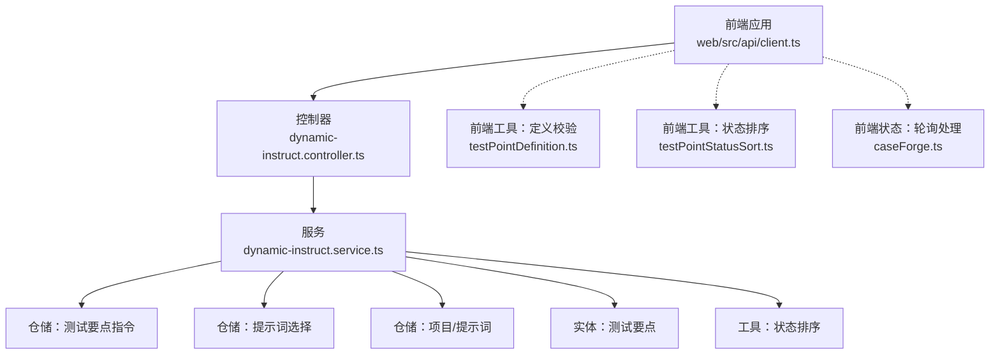

**图表来源**
- [apps/api/src/modules/dynamic-instruct/controller/dynamic-instruct.controller.ts:1-108](file://apps/api/src/modules/dynamic-instruct/controller/dynamic-instruct.controller.ts#L1-L108)
- [apps/api/src/modules/dynamic-instruct/service/dynamic-instruct.service.ts:1-474](file://apps/api/src/modules/dynamic-instruct/service/dynamic-instruct.service.ts#L1-L474)
- [apps/web/src/api/client.ts:562-642](file://apps/web/src/api/client.ts#L562-L642)
- [apps/web/src/utils/testPointDefinition.ts:1-18](file://apps/web/src/utils/testPointDefinition.ts#L1-L18)
- [apps/web/src/utils/testPointStatusSort.ts:1-33](file://apps/web/src/utils/testPointStatusSort.ts#L1-L33)
- [apps/web/src/stores/caseForge.ts:1139-1176](file://apps/web/src/stores/caseForge.ts#L1139-L1176)

## 详细组件分析

### 数据模型与关系
动态指令模块的核心数据模型围绕“测试要点”展开，通过“测试要点指令实体”承载状态与自然语言约束，通过“测试要点-提示词关联实体”建立多选提示词集合，最终在前端渲染为完整的指令视图。

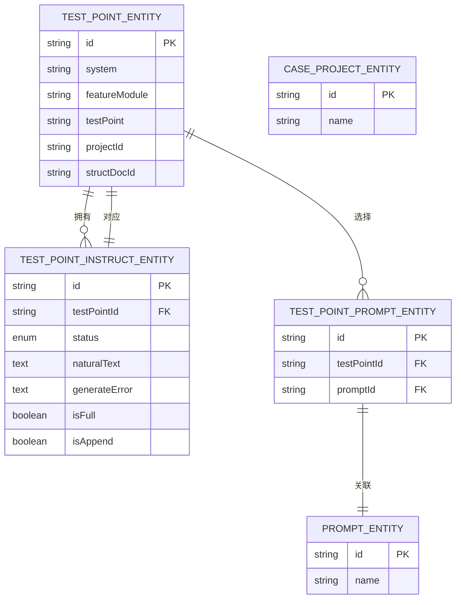

**图表来源**
- [apps/api/src/modules/dynamic-instruct/entity/test-point-instruct.entity.ts:1-87](file://apps/api/src/modules/dynamic-instruct/entity/test-point-instruct.entity.ts#L1-L87)
- [apps/api/src/modules/dynamic-instruct/entity/test-point-prompt.entity.ts:1-63](file://apps/api/src/modules/dynamic-instruct/entity/test-point-prompt.entity.ts#L1-L63)
- [apps/api/src/modules/struct-doc/entity/test-point.entity.ts:54-119](file://apps/api/src/modules/struct-doc/entity/test-point.entity.ts#L54-L119)

**章节来源**
- [apps/api/src/modules/dynamic-instruct/entity/test-point-instruct.entity.ts:1-87](file://apps/api/src/modules/dynamic-instruct/entity/test-point-instruct.entity.ts#L1-L87)
- [apps/api/src/modules/dynamic-instruct/entity/test-point-prompt.entity.ts:1-63](file://apps/api/src/modules/dynamic-instruct/entity/test-point-prompt.entity.ts#L1-L63)
- [apps/api/src/modules/struct-doc/entity/test-point.entity.ts:54-119](file://apps/api/src/modules/struct-doc/entity/test-point.entity.ts#L54-L119)

### 接口与工作流

#### 列表与筛选
- 接口：GET /dynamic-instruct/test-points
- 功能：分页列出测试要点摘要，支持按系统/功能模块筛选；内部通过 SQL 片段对状态进行稳定排序。
- 关键点：先统计总数，再取 ID 序列，最后按顺序加载实体与指令，保证排序一致性。

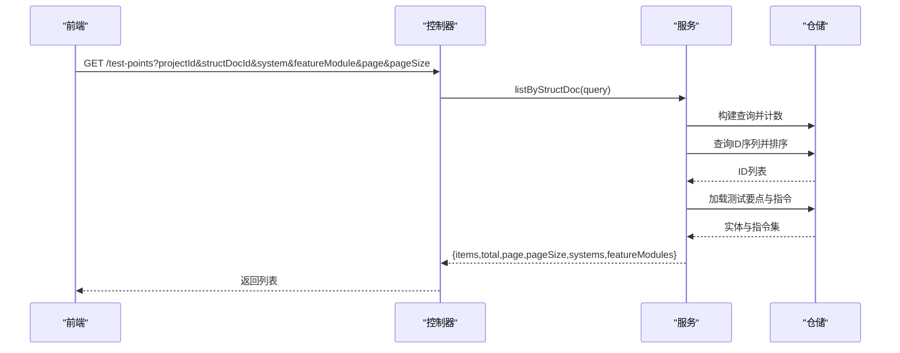

**图表来源**
- [apps/api/src/modules/dynamic-instruct/controller/dynamic-instruct.controller.ts:56-59](file://apps/api/src/modules/dynamic-instruct/controller/dynamic-instruct.controller.ts#L56-L59)
- [apps/api/src/modules/dynamic-instruct/service/dynamic-instruct.service.ts:70-140](file://apps/api/src/modules/dynamic-instruct/service/dynamic-instruct.service.ts#L70-L140)

**章节来源**
- [apps/api/src/modules/dynamic-instruct/controller/dynamic-instruct.controller.ts:56-59](file://apps/api/src/modules/dynamic-instruct/controller/dynamic-instruct.controller.ts#L56-L59)
- [apps/api/src/modules/dynamic-instruct/service/dynamic-instruct.service.ts:70-140](file://apps/api/src/modules/dynamic-instruct/service/dynamic-instruct.service.ts#L70-L140)
- [apps/api/src/modules/dynamic-instruct/dto/list-dynamic-test-points.dto.ts:1-43](file://apps/api/src/modules/dynamic-instruct/dto/list-dynamic-test-points.dto.ts#L1-L43)

#### 新增测试要点
- 接口：POST /dynamic-instruct/test-points
- 功能：创建测试要点，自动填充默认值（如系统、功能模块、测试点名称），并触达项目更新时间。
- 验证：系统、功能模块、测试点名称三者不能为空。

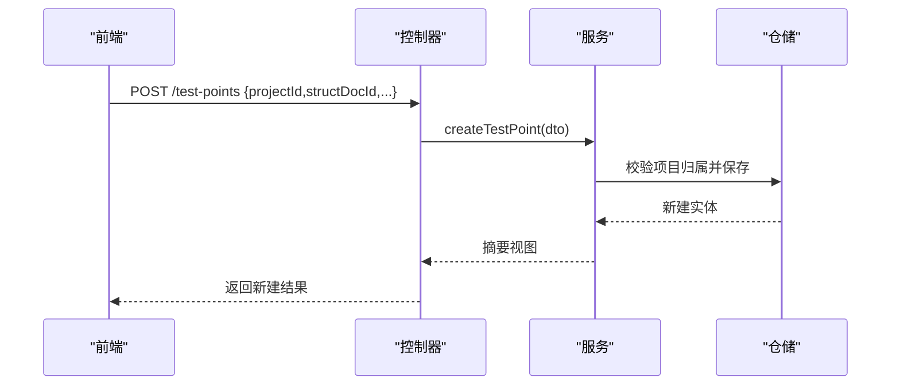

**图表来源**
- [apps/api/src/modules/dynamic-instruct/controller/dynamic-instruct.controller.ts:61-65](file://apps/api/src/modules/dynamic-instruct/controller/dynamic-instruct.controller.ts#L61-L65)
- [apps/api/src/modules/dynamic-instruct/service/dynamic-instruct.service.ts:231-248](file://apps/api/src/modules/dynamic-instruct/service/dynamic-instruct.service.ts#L231-L248)
- [apps/api/src/modules/dynamic-instruct/dto/create-dynamic-test-point.dto.ts:1-46](file://apps/api/src/modules/dynamic-instruct/dto/create-dynamic-test-point.dto.ts#L1-L46)

**章节来源**
- [apps/api/src/modules/dynamic-instruct/service/dynamic-instruct.service.ts:231-248](file://apps/api/src/modules/dynamic-instruct/service/dynamic-instruct.service.ts#L231-L248)
- [apps/api/src/modules/dynamic-instruct/dto/create-dynamic-test-point.dto.ts:1-46](file://apps/api/src/modules/dynamic-instruct/dto/create-dynamic-test-point.dto.ts#L1-L46)

#### 更新测试要点定义
- 接口：PATCH /dynamic-instruct/test-points/:testPointId/definition
- 功能：仅更新测试要点的定义字段（系统、模块、测试点及其描述），不改变指令状态。
- 验证：系统、功能模块、测试点名称三者不能为空。

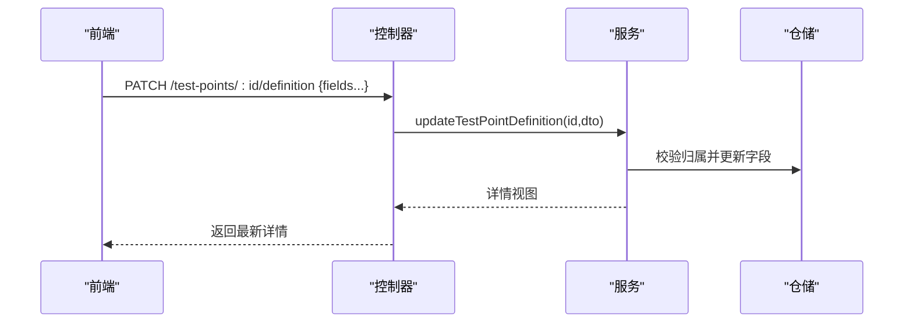

**图表来源**
- [apps/api/src/modules/dynamic-instruct/controller/dynamic-instruct.controller.ts:88-98](file://apps/api/src/modules/dynamic-instruct/controller/dynamic-instruct.controller.ts#L88-L98)
- [apps/api/src/modules/dynamic-instruct/service/dynamic-instruct.service.ts:250-297](file://apps/api/src/modules/dynamic-instruct/service/dynamic-instruct.service.ts#L250-L297)
- [apps/api/src/modules/dynamic-instruct/dto/update-test-point-definition.dto.ts:1-38](file://apps/api/src/modules/dynamic-instruct/dto/update-test-point-definition.dto.ts#L1-L38)

**章节来源**
- [apps/api/src/modules/dynamic-instruct/service/dynamic-instruct.service.ts:250-297](file://apps/api/src/modules/dynamic-instruct/service/dynamic-instruct.service.ts#L250-L297)
- [apps/api/src/modules/dynamic-instruct/dto/update-test-point-definition.dto.ts:1-38](file://apps/api/src/modules/dynamic-instruct/dto/update-test-point-definition.dto.ts#L1-L38)

#### 删除测试要点
- 接口：DELETE /dynamic-instruct/test-points
- 功能：批量删除测试要点，级联清理指令与提示词选择，并触达项目更新时间。
- 验证：至少提供一个有效 ID；若无匹配记录则抛出未找到异常。

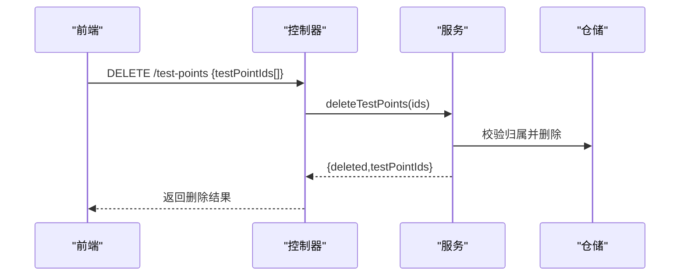

**图表来源**
- [apps/api/src/modules/dynamic-instruct/controller/dynamic-instruct.controller.ts:67-71](file://apps/api/src/modules/dynamic-instruct/controller/dynamic-instruct.controller.ts#L67-L71)
- [apps/api/src/modules/dynamic-instruct/service/dynamic-instruct.service.ts:299-316](file://apps/api/src/modules/dynamic-instruct/service/dynamic-instruct.service.ts#L299-L316)
- [apps/api/src/modules/dynamic-instruct/dto/delete-dynamic-test-points.dto.ts:1-14](file://apps/api/src/modules/dynamic-instruct/dto/delete-dynamic-test-points.dto.ts#L1-L14)

**章节来源**
- [apps/api/src/modules/dynamic-instruct/service/dynamic-instruct.service.ts:299-316](file://apps/api/src/modules/dynamic-instruct/service/dynamic-instruct.service.ts#L299-L316)
- [apps/api/src/modules/dynamic-instruct/dto/delete-dynamic-test-points.dto.ts:1-14](file://apps/api/src/modules/dynamic-instruct/dto/delete-dynamic-test-points.dto.ts#L1-L14)

#### 保存单个测试要点的动态指令
- 接口：PATCH /dynamic-instruct/test-points/:testPointId
- 功能：保存自然语言约束、状态、是否全量覆盖、是否追加，以及提示词选择；若状态为“生成失败”，保留上次错误信息。
- 关键点：先清理旧的选择，再写入新的提示词集合；状态推导逻辑：若提供了提示词或自然语言，则默认为“已编辑”。

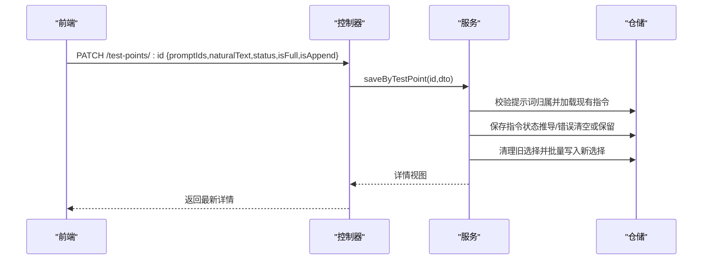

**图表来源**
- [apps/api/src/modules/dynamic-instruct/controller/dynamic-instruct.controller.ts:79-86](file://apps/api/src/modules/dynamic-instruct/controller/dynamic-instruct.controller.ts#L79-L86)
- [apps/api/src/modules/dynamic-instruct/service/dynamic-instruct.service.ts:323-383](file://apps/api/src/modules/dynamic-instruct/service/dynamic-instruct.service.ts#L323-L383)
- [apps/api/src/modules/dynamic-instruct/dto/save-dynamic-instruct.dto.ts:1-50](file://apps/api/src/modules/dynamic-instruct/dto/save-dynamic-instruct.dto.ts#L1-L50)

**章节来源**
- [apps/api/src/modules/dynamic-instruct/service/dynamic-instruct.service.ts:323-383](file://apps/api/src/modules/dynamic-instruct/service/dynamic-instruct.service.ts#L323-L383)
- [apps/api/src/modules/dynamic-instruct/dto/save-dynamic-instruct.dto.ts:1-50](file://apps/api/src/modules/dynamic-instruct/dto/save-dynamic-instruct.dto.ts#L1-L50)

#### 批量保存多个测试要点的动态指令
- 接口：PATCH /dynamic-instruct/test-points
- 功能：对多个测试要点执行相同的保存动作，共享同一组约束配置（提示词、自然语言、状态、覆盖/追加策略）。
- 处理：逐个调用单条保存逻辑，聚合结果返回。

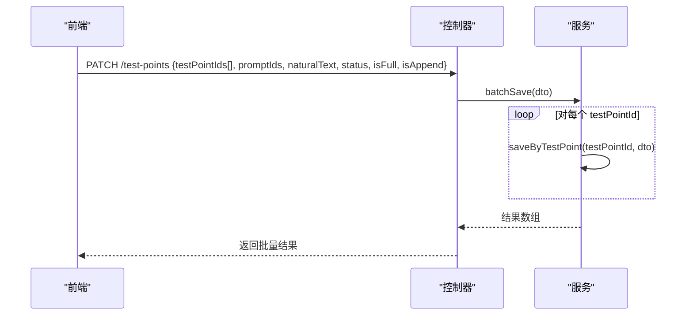

**图表来源**
- [apps/api/src/modules/dynamic-instruct/controller/dynamic-instruct.controller.ts:100-106](file://apps/api/src/modules/dynamic-instruct/controller/dynamic-instruct.controller.ts#L100-L106)
- [apps/api/src/modules/dynamic-instruct/service/dynamic-instruct.service.ts:385-395](file://apps/api/src/modules/dynamic-instruct/service/dynamic-instruct.service.ts#L385-L395)
- [apps/api/src/modules/dynamic-instruct/dto/batch-save-dynamic-instruct.dto.ts:1-17](file://apps/api/src/modules/dynamic-instruct/dto/batch-save-dynamic-instruct.dto.ts#L1-L17)

**章节来源**
- [apps/api/src/modules/dynamic-instruct/service/dynamic-instruct.service.ts:385-395](file://apps/api/src/modules/dynamic-instruct/service/dynamic-instruct.service.ts#L385-L395)
- [apps/api/src/modules/dynamic-instruct/dto/batch-save-dynamic-instruct.dto.ts:1-17](file://apps/api/src/modules/dynamic-instruct/dto/batch-save-dynamic-instruct.dto.ts#L1-L17)

#### 生成中恢复轮询
- 接口：GET /dynamic-instruct/test-points/generating
- 功能：列出仍在“生成中”的测试要点，便于进入项目时恢复轮询，避免遗漏生成结果。
- 处理：内连接指令表，筛选状态为“生成中”的记录并按创建时间排序。

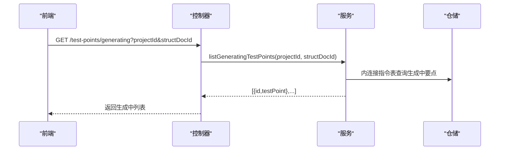

**图表来源**
- [apps/api/src/modules/dynamic-instruct/controller/dynamic-instruct.controller.ts:41-51](file://apps/api/src/modules/dynamic-instruct/controller/dynamic-instruct.controller.ts#L41-L51)
- [apps/api/src/modules/dynamic-instruct/service/dynamic-instruct.service.ts:209-229](file://apps/api/src/modules/dynamic-instruct/service/dynamic-instruct.service.ts#L209-L229)

**章节来源**
- [apps/api/src/modules/dynamic-instruct/service/dynamic-instruct.service.ts:209-229](file://apps/api/src/modules/dynamic-instruct/service/dynamic-instruct.service.ts#L209-L229)

### 状态管理与优先级排序
- 状态枚举：待编辑、已编辑、再编辑、生成中、生成失败、生成完成。
- 排序规则：生成失败 > 待编辑 > 已编辑/再编辑 > 生成中 > 生成完成；同状态按创建时间升序。
- 后端排序 SQL：通过 CASE 表达式将状态映射为排序权重，配合 createdAt 二次排序。
- 前端排序：提供独立工具函数，保证列表渲染一致。

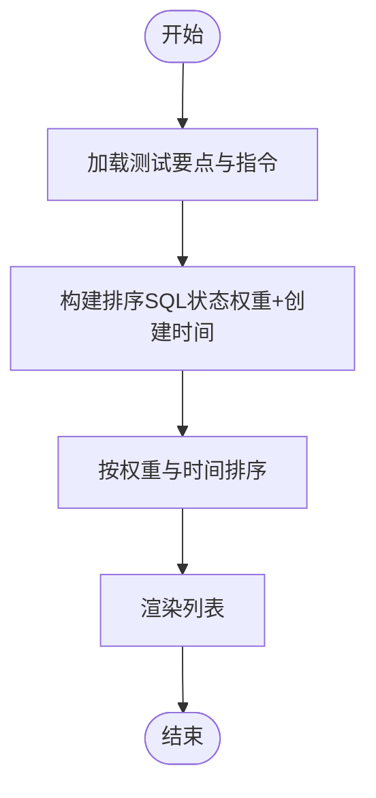

**图表来源**
- [apps/api/src/modules/dynamic-instruct/service/dynamic-instruct.service.ts:37-47](file://apps/api/src/modules/dynamic-instruct/service/dynamic-instruct.service.ts#L37-L47)
- [apps/api/src/modules/dynamic-instruct/util/test-point-status-sort.util.ts:1-32](file://apps/api/src/modules/dynamic-instruct/util/test-point-status-sort.util.ts#L1-L32)

**章节来源**
- [apps/api/src/modules/dynamic-instruct/service/dynamic-instruct.service.ts:37-47](file://apps/api/src/modules/dynamic-instruct/service/dynamic-instruct.service.ts#L37-L47)
- [apps/api/src/modules/dynamic-instruct/util/test-point-status-sort.util.ts:1-32](file://apps/api/src/modules/dynamic-instruct/util/test-point-status-sort.util.ts#L1-L32)

### 前端集成与使用示例
- 列表与元数据：通过客户端方法获取分页列表、编辑区元数据、生成中列表。
- 保存与更新：通过保存指令与更新定义接口，驱动后端状态流转。
- 轮询与反馈：前端状态管理器负责轮询生成结果，根据状态应用成功或失败处理。

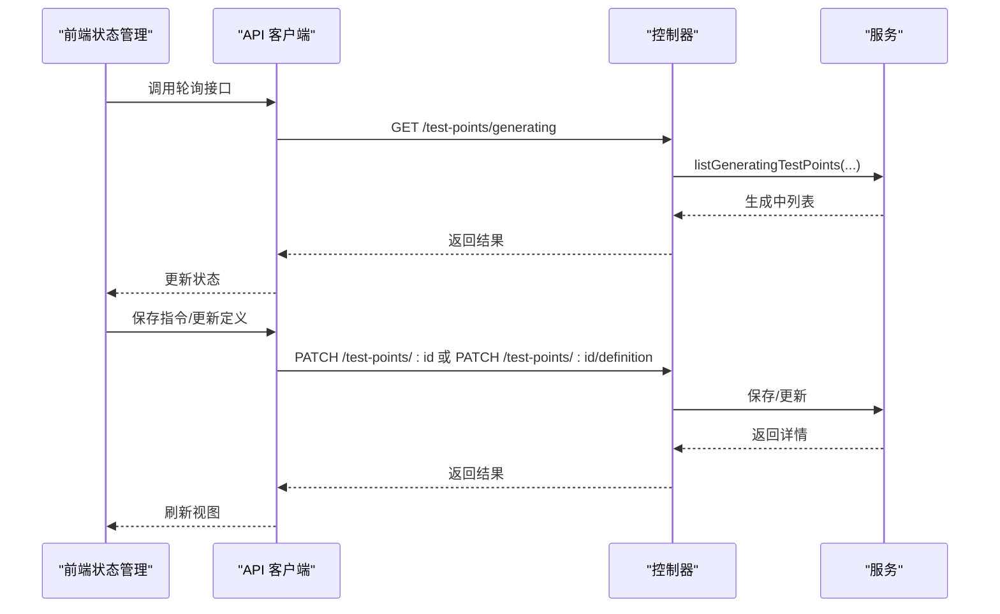

**图表来源**
- [apps/web/src/api/client.ts:562-642](file://apps/web/src/api/client.ts#L562-L642)
- [apps/web/src/stores/caseForge.ts:1139-1176](file://apps/web/src/stores/caseForge.ts#L1139-L1176)
- [apps/api/src/modules/dynamic-instruct/controller/dynamic-instruct.controller.ts:1-108](file://apps/api/src/modules/dynamic-instruct/controller/dynamic-instruct.controller.ts#L1-L108)

**章节来源**
- [apps/web/src/api/client.ts:562-642](file://apps/web/src/api/client.ts#L562-L642)
- [apps/web/src/stores/caseForge.ts:1139-1176](file://apps/web/src/stores/caseForge.ts#L1139-L1176)

## 依赖分析
- 控制器依赖服务；服务依赖仓储与工具；实体间通过外键与唯一索引建立关系；模块通过 TypeORM 注册实体。
- 前端通过统一 API 客户端调用后端接口，保持前后端契约一致。

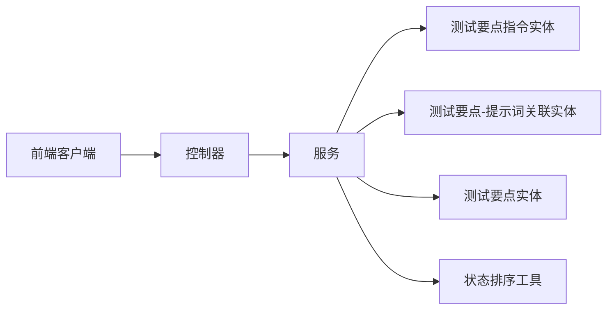

**图表来源**
- [apps/api/src/modules/dynamic-instruct/controller/dynamic-instruct.controller.ts:1-108](file://apps/api/src/modules/dynamic-instruct/controller/dynamic-instruct.controller.ts#L1-L108)
- [apps/api/src/modules/dynamic-instruct/service/dynamic-instruct.service.ts:1-474](file://apps/api/src/modules/dynamic-instruct/service/dynamic-instruct.service.ts#L1-L474)
- [apps/api/src/modules/dynamic-instruct/util/test-point-status-sort.util.ts:1-32](file://apps/api/src/modules/dynamic-instruct/util/test-point-status-sort.util.ts#L1-L32)
- [apps/web/src/api/client.ts:562-642](file://apps/web/src/api/client.ts#L562-L642)

**章节来源**
- [apps/api/src/modules/dynamic-instruct/index.ts:1-30](file://apps/api/src/modules/dynamic-instruct/index.ts#L1-L30)

## 性能考虑
- 列表查询：先计数，再取 ID 序列并排序，最后按顺序加载实体，避免一次性加载大量明细导致的内存压力。
- 状态排序：后端使用 SQL CASE 表达式进行排序权重计算，减少应用层排序成本。
- 批量保存：逐条保存，保证事务性与幂等性；如需更高吞吐，可在服务层引入批量写入优化（当前实现以一致性为主）。
- 前端渲染：提供独立排序工具，避免重复计算；建议在列表组件中缓存排序结果。

## 故障排查指南
- 未找到提示词：保存指令时若传入无效提示词 ID，将抛出未找到异常；请确认提示词归属与存在性。
- 未找到测试要点：更新定义或保存指令前会校验归属，若无匹配将抛出异常；请检查 testPointId 与项目权限。
- 删除失败：若未提供有效 ID 或无匹配记录，将抛出异常；请核对 ID 列表与项目归属。
- 生成失败：当状态为“生成失败”时，保留上次错误信息；前端应展示该错误并引导用户重试或调整约束。

**章节来源**
- [apps/api/src/modules/dynamic-instruct/service/dynamic-instruct.service.ts:337-341](file://apps/api/src/modules/dynamic-instruct/service/dynamic-instruct.service.ts#L337-L341)
- [apps/api/src/modules/dynamic-instruct/service/dynamic-instruct.service.ts:262-265](file://apps/api/src/modules/dynamic-instruct/service/dynamic-instruct.service.ts#L262-L265)
- [apps/api/src/modules/dynamic-instruct/service/dynamic-instruct.service.ts:305-311](file://apps/api/src/modules/dynamic-instruct/service/dynamic-instruct.service.ts#L305-L311)

## 结论
动态指令模块通过清晰的分层设计与严格的 DTO 校验，实现了测试要点与动态指令的全生命周期管理。其状态驱动的生成流程、稳定的排序机制与前后端协同的轮询策略，共同保障了从定义到执行的高效与可靠。建议在后续迭代中关注批量写入性能与生成任务的可观测性增强。

## 附录

### API 接口一览
- GET /dynamic-instruct/test-points/meta
  - 查询编辑区元数据（系统、功能模块、定义样例）
- GET /dynamic-instruct/test-points/generating
  - 查询仍在“生成中”的测试要点
- GET /dynamic-instruct/test-points
  - 分页列表（支持系统/功能模块筛选）
- POST /dynamic-instruct/test-points
  - 新增测试要点
- DELETE /dynamic-instruct/test-points
  - 批量删除测试要点
- GET /dynamic-instruct/test-points/:testPointId
  - 获取单个测试要点的动态指令详情
- PATCH /dynamic-instruct/test-points/:testPointId
  - 保存单个测试要点的动态指令
- PATCH /dynamic-instruct/test-points/:testPointId/definition
  - 更新单个测试要点的定义字段
- PATCH /dynamic-instruct/test-points
  - 批量保存多个测试要点的动态指令

**章节来源**
- [apps/api/src/modules/dynamic-instruct/controller/dynamic-instruct.controller.ts:32-106](file://apps/api/src/modules/dynamic-instruct/controller/dynamic-instruct.controller.ts#L32-L106)

### 使用示例（基于前端客户端）
- 获取列表与元数据
  - [apps/web/src/api/client.ts:562-583](file://apps/web/src/api/client.ts#L562-L583)
- 获取生成中列表
  - [apps/web/src/api/client.ts:585-591](file://apps/web/src/api/client.ts#L585-L591)
- 获取详情
  - [apps/web/src/api/client.ts:593-596](file://apps/web/src/api/client.ts#L593-L596)
- 新增测试要点
  - [apps/web/src/api/client.ts:598-610](file://apps/web/src/api/client.ts#L598-L610)
- 删除测试要点
  - [apps/web/src/api/client.ts:612-618](file://apps/web/src/api/client.ts#L612-L618)
- 更新定义
  - [apps/web/src/api/client.ts:620-634](file://apps/web/src/api/client.ts#L620-L634)
- 保存指令
  - [apps/web/src/api/client.ts:636-642](file://apps/web/src/api/client.ts#L636-L642)