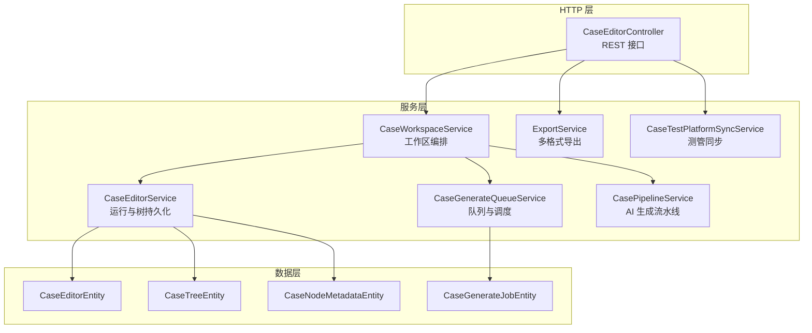
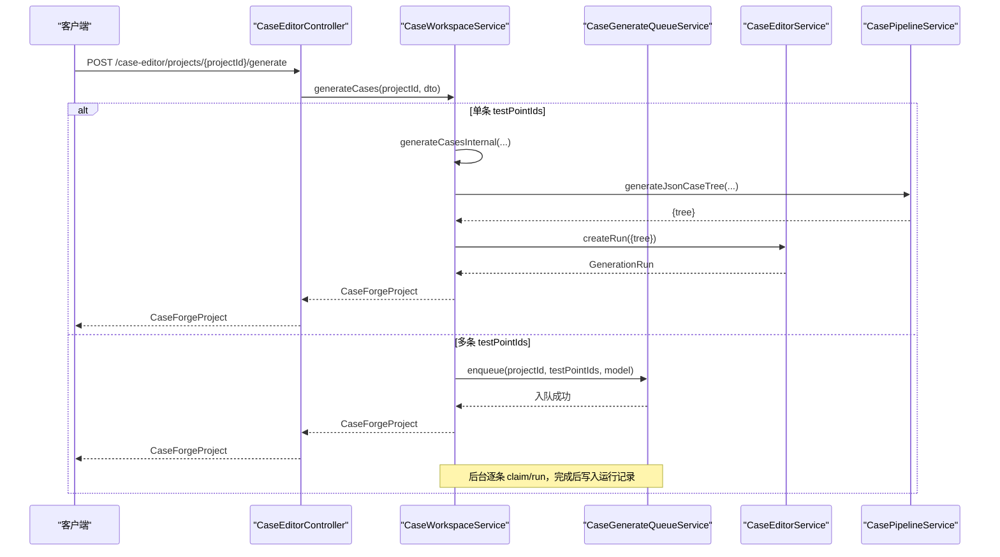
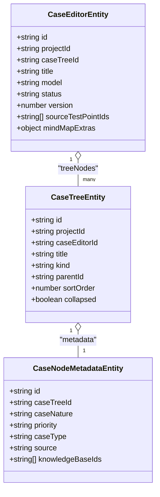
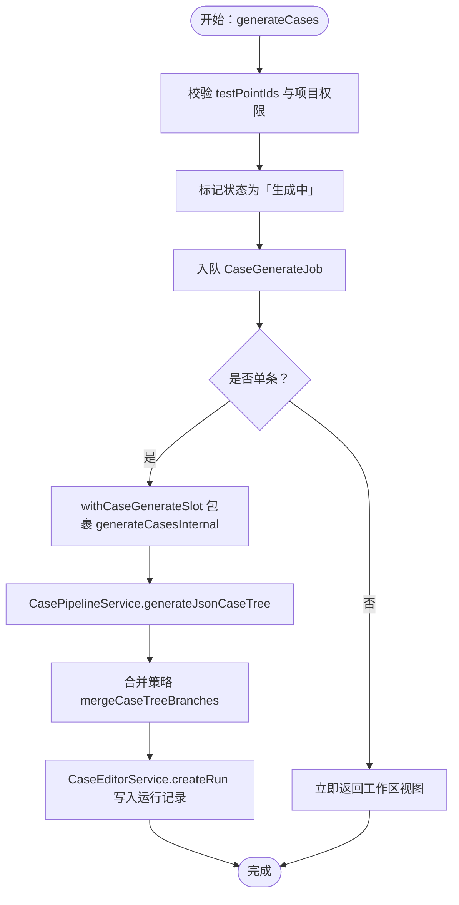
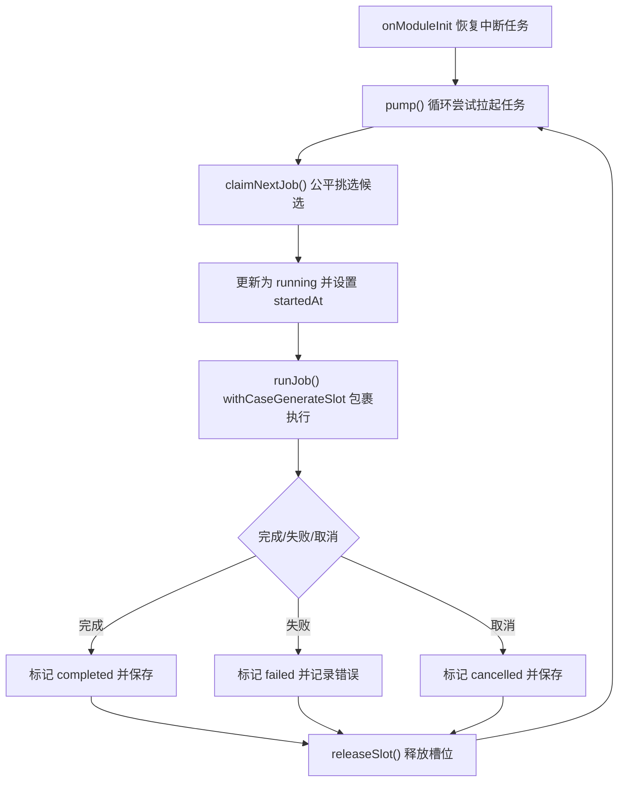
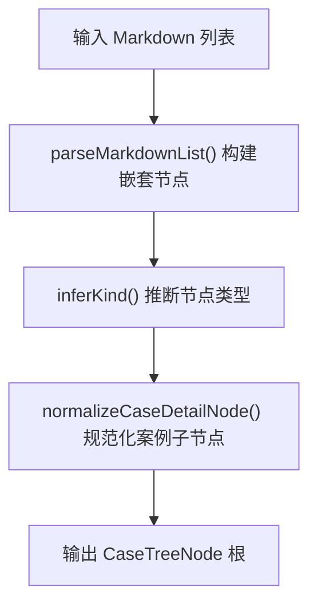
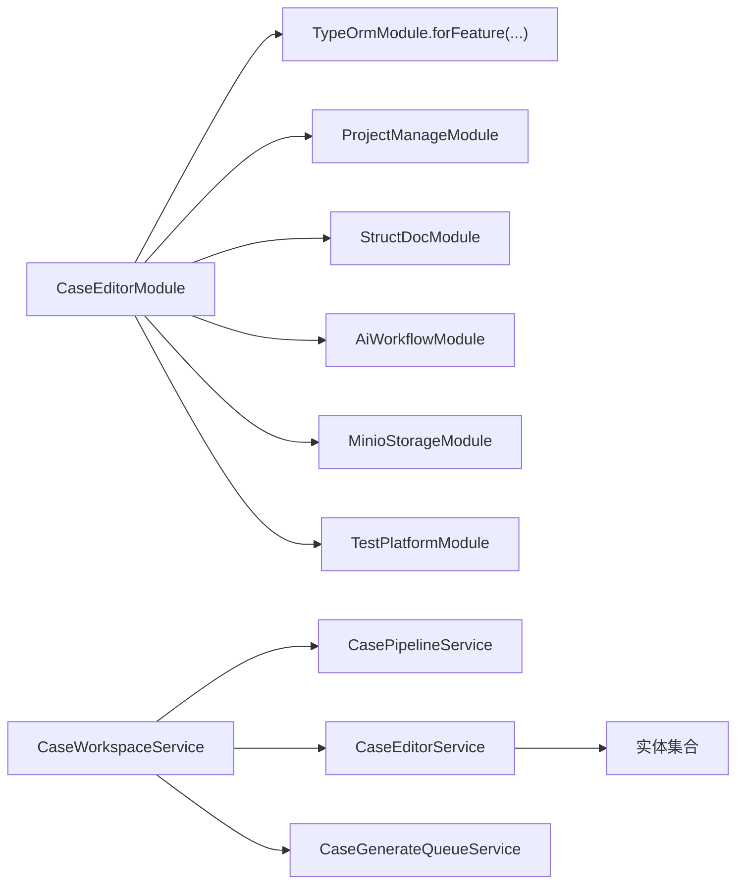

# 案例编辑器模块

<cite>
**本文引用的文件**
- [apps/api/src/modules/case-editor/index.ts](file://apps/api/src/modules/case-editor/index.ts)
- [apps/api/src/modules/case-editor/controller/case-editor.controller.ts](file://apps/api/src/modules/case-editor/controller/case-editor.controller.ts)
- [apps/api/src/modules/case-editor/service/case-editor.service.ts](file://apps/api/src/modules/case-editor/service/case-editor.service.ts)
- [apps/api/src/modules/case-editor/service/case-generate-queue.service.ts](file://apps/api/src/modules/case-editor/service/case-generate-queue.service.ts)
- [apps/api/src/modules/case-editor/service/case-workspace.service.ts](file://apps/api/src/modules/case-editor/service/case-workspace.service.ts)
- [apps/api/src/modules/case-editor/service/export.service.ts](file://apps/api/src/modules/case-editor/service/export.service.ts)
- [apps/api/src/modules/case-editor/service/case-test-platform-sync.service.ts](file://apps/api/src/modules/case-editor/service/case-test-platform-sync.service.ts)
- [apps/api/src/modules/case-editor/service/case-pipeline.service.ts](file://apps/api/src/modules/case-editor/service/case-pipeline.service.ts)
- [apps/api/src/modules/case-editor/util/case-markdown-tree.util.ts](file://apps/api/src/modules/case-editor/util/case-markdown-tree.util.ts)
- [apps/api/src/modules/case-editor/util/case-tree-merge.util.ts](file://apps/api/src/modules/case-editor/util/case-tree-merge.util.ts)
- [apps/api/src/modules/case-editor/util/case-generate-concurrency.ts](file://apps/api/src/modules/case-editor/util/case-generate-concurrency.ts)
- [apps/api/src/modules/case-editor/util/case-generate-fair-schedule.util.ts](file://apps/api/src/modules/case-editor/util/case-generate-fair-schedule.util.ts)
- [apps/api/src/modules/case-editor/entity/case-editor.entity.ts](file://apps/api/src/modules/case-editor/entity/case-editor.entity.ts)
- [apps/api/src/modules/case-editor/entity/case-tree.entity.ts](file://apps/api/src/modules/case-editor/entity/case-tree.entity.ts)
- [apps/api/src/modules/case-editor/entity/case-node-metadata.entity.ts](file://apps/api/src/modules/case-editor/entity/case-node-metadata.entity.ts)
- [apps/api/src/modules/case-editor/entity/case-generate-job.entity.ts](file://apps/api/src/modules/case-editor/entity/case-generate-job.entity.ts)
- [apps/api/src/modules/case-editor/dto/generate-cases.dto.ts](file://apps/api/src/modules/case-editor/dto/generate-cases.dto.ts)
- [apps/api/src/modules/case-editor/dto/update-run-tree.dto.ts](file://apps/api/src/modules/case-editor/dto/update-run-tree.dto.ts)
</cite>

## 目录
1. [简介](#简介)
2. [项目结构](#项目结构)
3. [核心组件](#核心组件)
4. [架构总览](#架构总览)
5. [详细组件分析](#详细组件分析)
6. [依赖关系分析](#依赖关系分析)
7. [性能考量](#性能考量)
8. [故障排查指南](#故障排查指南)
9. [结论](#结论)
10. [附录](#附录)

## 简介
本模块提供“案例编辑器”的完整能力：从需求格式化、AI 案例生成、案例树持久化、工作区编排、并发与队列调度、到导出与测管平台同步。其设计围绕“树形结构 + 元数据 + 工作流”的理念，既支持实时同步生成（单条），也支持批量异步生成（多条），并通过公平调度与全局并发限制保障系统稳定性。

## 项目结构
- 模块入口：注册实体、服务与控制器，并导出核心服务供其他模块复用。
- 控制器：暴露 HTTP 接口，包括生成、取消、队列状态、运行记录查询、树更新、分页查询、导出、同步测管平台等。
- 服务层：
  - 案例编辑运行服务：负责运行记录与案例树的持久化、差异计算与增量更新。
  - 工作区服务：编排需求格式化、动态指令、AI 生成、合并策略与状态回退。
  - 生成队列服务：DB 驱动的任务队列、公平调度、并发槽位控制、ETA 计算。
  - 导出服务：支持 JSON、Excel、XMind 多格式导出。
  - 测管平台同步服务：将案例树映射为测管平台实体并批量写入。
  - 流水线服务：AI Chat 与技能模板驱动的案例生成主干流程。
- 工具与实体：树解析工具、合并策略、并发与公平调度配置、数据库实体定义。

图表来源
- [apps/api/src/modules/case-editor/controller/case-editor.controller.ts:30-215](file://apps/api/src/modules/case-editor/controller/case-editor.controller.ts#L30-L215)
- [apps/api/src/modules/case-editor/service/case-workspace.service.ts:80-100](file://apps/api/src/modules/case-editor/service/case-workspace.service.ts#L80-L100)
- [apps/api/src/modules/case-editor/service/case-editor.service.ts:53-67](file://apps/api/src/modules/case-editor/service/case-editor.service.ts#L53-L67)
- [apps/api/src/modules/case-editor/service/case-generate-queue.service.ts:72-87](file://apps/api/src/modules/case-editor/service/case-generate-queue.service.ts#L72-L87)
- [apps/api/src/modules/case-editor/service/case-pipeline.service.ts:95-103](file://apps/api/src/modules/case-editor/service/case-pipeline.service.ts#L95-L103)
- [apps/api/src/modules/case-editor/service/export.service.ts:31-34](file://apps/api/src/modules/case-editor/service/export.service.ts#L31-L34)
- [apps/api/src/modules/case-editor/service/case-test-platform-sync.service.ts:42-58](file://apps/api/src/modules/case-editor/service/case-test-platform-sync.service.ts#L42-L58)

章节来源
- [apps/api/src/modules/case-editor/index.ts:29-60](file://apps/api/src/modules/case-editor/index.ts#L29-L60)
- [apps/api/src/modules/case-editor/controller/case-editor.controller.ts:30-215](file://apps/api/src/modules/case-editor/controller/case-editor.controller.ts#L30-L215)

## 核心组件
- 案例树结构与元数据
  - 节点类型：root/system/module/requirement/case 等，支持折叠、排序与元数据扩展。
  - 元数据字段：案例性质、优先级、类型、来源、知识库 ID 等。
- 工作区编排
  - 需求格式化、动态指令、AI 生成、合并策略、状态回退与取消。
- 生成队列与并发
  - DB 任务队列、公平调度、全局并发槽位、等待/运行统计、ETA 估算。
- 导出与同步
  - JSON、Excel、XMind 导出；测管平台案例与步骤同步。
- 控制器接口
  - 生成、取消、队列状态、运行记录、树更新、分页查询、导出、同步。

章节来源
- [apps/api/src/modules/case-editor/entity/case-tree.entity.ts:26-92](file://apps/api/src/modules/case-editor/entity/case-tree.entity.ts#L26-L92)
- [apps/api/src/modules/case-editor/entity/case-node-metadata.entity.ts:17-62](file://apps/api/src/modules/case-editor/entity/case-node-metadata.entity.ts#L17-L62)
- [apps/api/src/modules/case-editor/service/case-workspace.service.ts:80-100](file://apps/api/src/modules/case-editor/service/case-workspace.service.ts#L80-L100)
- [apps/api/src/modules/case-editor/service/case-generate-queue.service.ts:72-87](file://apps/api/src/modules/case-editor/service/case-generate-queue.service.ts#L72-L87)
- [apps/api/src/modules/case-editor/service/export.service.ts:31-34](file://apps/api/src/modules/case-editor/service/export.service.ts#L31-L34)
- [apps/api/src/modules/case-editor/service/case-test-platform-sync.service.ts:42-58](file://apps/api/src/modules/case-editor/service/case-test-platform-sync.service.ts#L42-L58)
- [apps/api/src/modules/case-editor/controller/case-editor.controller.ts:52-213](file://apps/api/src/modules/case-editor/controller/case-editor.controller.ts#L52-L213)

## 架构总览
案例编辑器采用“控制器-服务-实体-工具”的分层架构，结合 DB 队列与内存并发槽位，形成“请求-编排-生成-持久化-导出/同步”的闭环。

图表来源
- [apps/api/src/modules/case-editor/controller/case-editor.controller.ts:52-69](file://apps/api/src/modules/case-editor/controller/case-editor.controller.ts#L52-L69)
- [apps/api/src/modules/case-editor/service/case-workspace.service.ts:197-207](file://apps/api/src/modules/case-editor/service/case-workspace.service.ts#L197-L207)
- [apps/api/src/modules/case-editor/service/case-generate-queue.service.ts:162-206](file://apps/api/src/modules/case-editor/service/case-generate-queue.service.ts#L162-L206)
- [apps/api/src/modules/case-editor/service/case-editor.service.ts:68-108](file://apps/api/src/modules/case-editor/service/case-editor.service.ts#L68-L108)
- [apps/api/src/modules/case-editor/service/case-pipeline.service.ts:153-196](file://apps/api/src/modules/case-editor/service/case-pipeline.service.ts#L153-L196)

## 详细组件分析

### 案例树结构与元数据
- 数据模型
  - 案例树节点：以邻接表存储，支持多级父子关系与排序。
  - 元数据：优先级、性质、类型、来源、知识库 ID 等。
- 加载与归一化
  - 一次性加载整棵树，构建父子映射，规范化节点元数据。
- 差异与增量更新
  - 基于“扁平化 + diff + 批量插入/更新/删除”的策略，支持全量替换与增量更新。

图表来源
- [apps/api/src/modules/case-editor/entity/case-editor.entity.ts:32-103](file://apps/api/src/modules/case-editor/entity/case-editor.entity.ts#L32-L103)
- [apps/api/src/modules/case-editor/entity/case-tree.entity.ts:26-92](file://apps/api/src/modules/case-editor/entity/case-tree.entity.ts#L26-L92)
- [apps/api/src/modules/case-editor/entity/case-node-metadata.entity.ts:17-62](file://apps/api/src/modules/case-editor/entity/case-node-metadata.entity.ts#L17-L62)

章节来源
- [apps/api/src/modules/case-editor/service/case-editor.service.ts:375-477](file://apps/api/src/modules/case-editor/service/case-editor.service.ts#L375-L477)
- [apps/api/src/modules/case-editor/service/case-editor.service.ts:254-288](file://apps/api/src/modules/case-editor/service/case-editor.service.ts#L254-L288)

### 工作区编排与 AI 集成
- 主要职责
  - 需求格式化（结构化 Markdown + 分析）。
  - 动态指令（自然语言 + 场景提示词）。
  - AI 案例生成（promote-skill + AI Chat + JSON → 六级案例树）。
  - 合并策略（append/full）与节点 ID 重分配。
  - 状态回退与取消（用户点击“停止”）。
- 关键流程
  - 单条：同步执行，阻塞至完成。
  - 批量：立即入队，后台逐条执行。

图表来源
- [apps/api/src/modules/case-editor/service/case-workspace.service.ts:197-207](file://apps/api/src/modules/case-editor/service/case-workspace.service.ts#L197-L207)
- [apps/api/src/modules/case-editor/service/case-workspace.service.ts:290-454](file://apps/api/src/modules/case-editor/service/case-workspace.service.ts#L290-L454)
- [apps/api/src/modules/case-editor/service/case-pipeline.service.ts:153-196](file://apps/api/src/modules/case-editor/service/case-pipeline.service.ts#L153-L196)
- [apps/api/src/modules/case-editor/util/case-tree-merge.util.ts:17-45](file://apps/api/src/modules/case-editor/util/case-tree-merge.util.ts#L17-L45)

章节来源
- [apps/api/src/modules/case-editor/service/case-workspace.service.ts:188-277](file://apps/api/src/modules/case-editor/service/case-workspace.service.ts#L188-L277)
- [apps/api/src/modules/case-editor/service/case-pipeline.service.ts:145-196](file://apps/api/src/modules/case-editor/service/case-pipeline.service.ts#L145-L196)
- [apps/api/src/modules/case-editor/util/case-tree-merge.util.ts:17-68](file://apps/api/src/modules/case-editor/util/case-tree-merge.util.ts#L17-L68)

### 生成队列系统、并发控制与任务调度
- 队列与状态
  - DB 表 case_generate_job 记录 queued/running/completed/failed/cancelled。
  - 启动时恢复中断任务，补齐“生成中”但无活动任务的状态。
- 公平调度
  - 按用户维度限制 running 数量（perUserMax），优先放行未达上限用户的队首任务。
  - ETA 估算：基于平均运行时长与有效并行度。
- 并发控制
  - 全局内存槽位，受环境变量限制，超过则排队等待。
  - 槽位释放后触发泵动（pump）拉起下一个任务。

图表来源
- [apps/api/src/modules/case-editor/service/case-generate-queue.service.ts:88-95](file://apps/api/src/modules/case-editor/service/case-generate-queue.service.ts#L88-L95)
- [apps/api/src/modules/case-editor/service/case-generate-queue.service.ts:340-357](file://apps/api/src/modules/case-editor/service/case-generate-queue.service.ts#L340-L357)
- [apps/api/src/modules/case-editor/service/case-generate-queue.service.ts:434-475](file://apps/api/src/modules/case-editor/service/case-generate-queue.service.ts#L434-L475)
- [apps/api/src/modules/case-editor/util/case-generate-concurrency.ts:82-91](file://apps/api/src/modules/case-editor/util/case-generate-concurrency.ts#L82-L91)
- [apps/api/src/modules/case-editor/util/case-generate-fair-schedule.util.ts:49-85](file://apps/api/src/modules/case-editor/util/case-generate-fair-schedule.util.ts#L49-L85)

章节来源
- [apps/api/src/modules/case-editor/service/case-generate-queue.service.ts:97-160](file://apps/api/src/modules/case-editor/service/case-generate-queue.service.ts#L97-L160)
- [apps/api/src/modules/case-editor/util/case-generate-concurrency.ts:43-51](file://apps/api/src/modules/case-editor/util/case-generate-concurrency.ts#L43-L51)
- [apps/api/src/modules/case-editor/util/case-generate-fair-schedule.util.ts:10-18](file://apps/api/src/modules/case-editor/util/case-generate-fair-schedule.util.ts#L10-L18)

### Markdown 解析与树形结构转换
- 从 case-skill 的 Markdown 列表解析为六级案例树，自动推断节点类型与层级。
- 支持标签式子节点（前置条件/测试步骤/预期结果）与案例详情节点的规范化。

图表来源
- [apps/api/src/modules/case-editor/util/case-markdown-tree.util.ts:20-52](file://apps/api/src/modules/case-editor/util/case-markdown-tree.util.ts#L20-L52)
- [apps/api/src/modules/case-editor/util/case-markdown-tree.util.ts:68-99](file://apps/api/src/modules/case-editor/util/case-markdown-tree.util.ts#L68-L99)
- [apps/api/src/modules/case-editor/util/case-markdown-tree.util.ts:159-209](file://apps/api/src/modules/case-editor/util/case-markdown-tree.util.ts#L159-L209)

章节来源
- [apps/api/src/modules/case-editor/util/case-markdown-tree.util.ts:214-238](file://apps/api/src/modules/case-editor/util/case-markdown-tree.util.ts#L214-L238)

### 案例约束管理与工作空间服务
- 约束与合并
  - 通过 mergeCaseTreeBranches 与 reassignCaseTreeNodeIds 实现 append/full 合并与 ID 冲突规避。
- 工作空间
  - 提供项目视图、运行记录、树更新、分页查询、局部重生成等能力。
  - 支持按需懒加载测试要点下的子树（XMind 懒加载）。

章节来源
- [apps/api/src/modules/case-editor/util/case-tree-merge.util.ts:17-68](file://apps/api/src/modules/case-editor/util/case-tree-merge.util.ts#L17-L68)
- [apps/api/src/modules/case-editor/service/case-workspace.service.ts:456-478](file://apps/api/src/modules/case-editor/service/case-workspace.service.ts#L456-L478)
- [apps/api/src/modules/case-editor/service/case-editor.service.ts:153-173](file://apps/api/src/modules/case-editor/service/case-editor.service.ts#L153-L173)

### 导出功能实现
- 支持格式：JSON、Excel（xlsx）、XMind。
- Excel：可按 caseNodeIds 精确筛选导出；支持下载测管平台模板。
- XMind：生成 xmind 工作簿，包含 content.json、content.xml、摘要与标签。

章节来源
- [apps/api/src/modules/case-editor/controller/case-editor.controller.ts:134-181](file://apps/api/src/modules/case-editor/controller/case-editor.controller.ts#L134-L181)
- [apps/api/src/modules/case-editor/service/export.service.ts:34-52](file://apps/api/src/modules/case-editor/service/export.service.ts#L34-L52)
- [apps/api/src/modules/case-editor/service/export.service.ts:54-130](file://apps/api/src/modules/case-editor/service/export.service.ts#L54-L130)

### 测管平台同步
- 将案例树转换为测管平台的案例与步骤实体，支持插入/更新/跳过。
- 校验项目需求编号、案例节点有效性，事务性写入。

章节来源
- [apps/api/src/modules/case-editor/controller/case-editor.controller.ts:183-197](file://apps/api/src/modules/case-editor/controller/case-editor.controller.ts#L183-L197)
- [apps/api/src/modules/case-editor/service/case-test-platform-sync.service.ts:59-177](file://apps/api/src/modules/case-editor/service/case-test-platform-sync.service.ts#L59-L177)

## 依赖关系分析
- 模块依赖
  - CaseEditorModule 导入 TypeORM、项目管理、结构化文档、AI 工作流、MinIO、测管模块。
  - 导出 CaseEditorService 与 CaseWorkspaceService 供外部模块使用。
- 服务耦合
  - CaseWorkspaceService 依赖 CasePipelineService、CaseEditorService、CaseGenerateQueueService。
  - CaseEditorService 依赖实体与 diff 工具。
  - 导出与同步服务独立，通过共享的树结构与工具函数协作。

图表来源
- [apps/api/src/modules/case-editor/index.ts:29-58](file://apps/api/src/modules/case-editor/index.ts#L29-L58)

章节来源
- [apps/api/src/modules/case-editor/index.ts:29-58](file://apps/api/src/modules/case-editor/index.ts#L29-L58)

## 性能考量
- 案例树持久化
  - 批量插入/更新/删除，分批大小固定，降低单次事务压力。
  - 差异计算避免全量替换，提升增量更新效率。
- 队列与并发
  - 全局并发槽位限制 AI Chat 调用量，避免资源争抢。
  - 公平调度按用户上限与队首时间综合评估，兼顾吞吐与公平。
- 导出与同步
  - Excel 导出基于内存摊平后的行集，分页查询避免大对象传输。
  - 测管同步事务批量写入，减少往返次数。

## 故障排查指南
- 生成失败
  - 检查 AI Chat 与技能模板配置是否就绪。
  - 查看队列任务状态与错误消息，必要时重试或清理中断任务。
- 取消生成无效
  - 确认“停止”按钮调用 cancelGenerateCases，刷新页面不会取消。
  - 检查取消注册与回退状态是否正确写回。
- 导出为空或格式错误
  - 确认树结构是否包含可导出的案例节点。
  - 校验导出参数（格式、模板、节点筛选）。
- 同步测管失败
  - 校验项目需求编号格式与测管项目是否存在。
  - 确认所选案例节点在当前树中存在。

章节来源
- [apps/api/src/modules/case-editor/service/case-generate-queue.service.ts:97-115](file://apps/api/src/modules/case-editor/service/case-generate-queue.service.ts#L97-L115)
- [apps/api/src/modules/case-editor/service/case-workspace.service.ts:235-277](file://apps/api/src/modules/case-editor/service/case-workspace.service.ts#L235-L277)
- [apps/api/src/modules/case-editor/controller/case-editor.controller.ts:134-181](file://apps/api/src/modules/case-editor/controller/case-editor.controller.ts#L134-L181)
- [apps/api/src/modules/case-editor/service/case-test-platform-sync.service.ts:64-111](file://apps/api/src/modules/case-editor/service/case-test-platform-sync.service.ts#L64-L111)

## 结论
案例编辑器模块以“树 + 元数据 + 工作流”为核心，结合 DB 队列与内存并发控制，实现了从需求到案例树的自动化生成与编辑、导出与同步的完整链路。其模块化设计便于扩展与维护，适合在多实例部署场景下稳定运行。

## 附录

### API 接口一览（摘要）
- 生成案例树
  - POST /case-editor/projects/{projectId}/generate
  - 请求体：GenerateCasesDto（model?, testPointIds[]）
  - 响应：CaseForgeProject
- 取消生成
  - POST /case-editor/projects/{projectId}/generate/cancel
  - 请求体：CancelGenerateDto（testPointIds[]）
  - 响应：CaseForgeProject
- 查询队列状态
  - GET /case-editor/projects/{projectId}/generate/queue?testPointIds=...
  - 响应：队列状态与 ETA
- 局部重生成节点
  - POST /case-editor/projects/{projectId}/regenerate-node
  - 请求体：RegenerateNodeDto（runId, nodeId, instruction, mode）
  - 响应：GenerationRun
- 查询运行记录
  - GET /case-editor/projects/{projectId}/runs
  - GET /case-editor/projects/{projectId}/runs/{runId}
- 懒加载子树
  - GET /case-editor/projects/{projectId}/runs/{runId}/nodes/{nodeId}/children
- 分页查询案例行
  - GET /case-editor/projects/{projectId}/runs/{runId}/case-rows?...
- 导出案例树
  - GET /case-editor/projects/{projectId}/runs/{runId}/export?format=excel|xmind&template=1|true&caseNodeIds=...
- 同步至测管平台
  - POST /case-editor/projects/{projectId}/runs/{runId}/sync-test-platform
  - 请求体：SyncToTestPlatformDto（tree, caseNodeIds[]）

章节来源
- [apps/api/src/modules/case-editor/controller/case-editor.controller.ts:52-213](file://apps/api/src/modules/case-editor/controller/case-editor.controller.ts#L52-L213)
- [apps/api/src/modules/case-editor/dto/generate-cases.dto.ts:10-24](file://apps/api/src/modules/case-editor/dto/generate-cases.dto.ts#L10-L24)
- [apps/api/src/modules/case-editor/dto/update-run-tree.dto.ts:8-19](file://apps/api/src/modules/case-editor/dto/update-run-tree.dto.ts#L8-L19)