# 模块系统与业务模块

<cite>
**本文引用的文件**
- [apps/api/src/app.module.ts](file://apps/api/src/app.module.ts)
- [apps/api/src/bootstrap.ts](file://apps/api/src/bootstrap.ts)
- [apps/api/src/common/ai-workflow/index.ts](file://apps/api/src/common/ai-workflow/index.ts)
- [apps/api/src/common/minio/index.ts](file://apps/api/src/common/minio/index.ts)
- [apps/api/src/common/test-platform/index.ts](file://apps/api/src/common/test-platform/index.ts)
- [apps/api/src/common/typeorm/index.ts](file://apps/api/src/common/typeorm/index.ts)
- [apps/api/src/modules/api-test/index.ts](file://apps/api/src/modules/api-test/index.ts)
- [apps/api/src/modules/case-editor/index.ts](file://apps/api/src/modules/case-editor/index.ts)
- [apps/api/src/modules/dynamic-instruct/index.ts](file://apps/api/src/modules/dynamic-instruct/index.ts)
- [apps/api/src/modules/project-manage/index.ts](file://apps/api/src/modules/project-manage/index.ts)
- [apps/api/src/modules/struct-doc/index.ts](file://apps/api/src/modules/struct-doc/index.ts)
- [apps/api/src/modules/scenario/index.ts](file://apps/api/src/modules/scenario/index.ts)
- [apps/api/src/common/typeorm/schema-patch.service.ts](file://apps/api/src/common/typeorm/schema-patch.service.ts)
- [apps/api/src/modules/case-editor/service/case-generate-queue.service.ts](file://apps/api/src/modules/case-editor/service/case-generate-queue.service.ts)
- [apps/api/src/modules/struct-doc/service/struct-requirement-queue.service.ts](file://apps/api/src/modules/struct-doc/service/struct-requirement-queue.service.ts)
</cite>

## 目录
1. 引言
2. 项目结构
3. 核心组件
4. 架构总览
5. 详细组件分析
6. 依赖关系分析
7. 性能考量
8. 故障排查指南
9. 结论
10. 附录

## 引言
本技术指南围绕 NestJS 模块系统与业务模块展开，目标是帮助读者系统掌握模块设计原则、模块间依赖管理与循环依赖处理策略；深入理解各业务模块的功能定位、模块结构与模块间通信机制；阐述模块生命周期、初始化顺序与销毁流程；总结模块配置、提供者注册与控制器绑定的最佳实践，并通过具体业务模块实现示例，展示如何设计可复用的业务模块。

## 项目结构
本项目采用多包工作区（monorepo）组织方式，后端以 NestJS 应用为核心，根模块负责聚合配置、基础设施与各业务模块。应用启动在引导文件中完成，包括环境加载、Schema 预检查、全局中间件与管道、Swagger 文档与端口监听等。

- 根模块聚合了配置模块、TypeORM 全局模块、测管平台模块、MinIO 存储模块、AI 工作流模块以及多个业务模块。
- 启动文件负责环境准备、Schema 预检查、全局中间件与管道设置、版本控制与 Swagger 文档生成、端口监听。

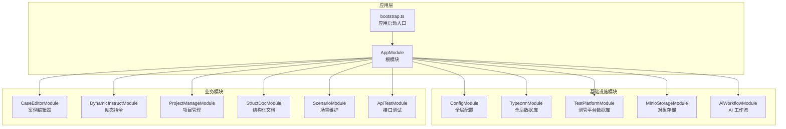

图表来源
- [apps/api/src/app.module.ts:21-39](file://apps/api/src/app.module.ts#L21-L39)
- [apps/api/src/bootstrap.ts:18-61](file://apps/api/src/bootstrap.ts#L18-L61)

章节来源
- [apps/api/src/app.module.ts:1-48](file://apps/api/src/app.module.ts#L1-L48)
- [apps/api/src/bootstrap.ts:1-64](file://apps/api/src/bootstrap.ts#L1-L64)

## 核心组件
- 根模块（AppModule）
  - 负责导入全局配置、TypeORM、测管平台、MinIO、AI 工作流与各业务模块。
  - 通过中间件消费器注册用户上下文与访问日志中间件，作用于所有路由。
- 应用启动（bootstrap.ts）
  - 加载 API 环境变量，执行 Schema 预检查。
  - 创建 Nest 应用实例，设置 CORS、全局前缀、URI 版本控制、全局验证管道。
  - 配置 Swagger 文档，监听端口并输出服务地址。

最佳实践要点
- 将跨模块共享的基础设施（如数据库、对象存储、AI 配置）收敛到独立模块，避免重复配置。
- 根模块仅做“聚合”，不承载业务逻辑，确保关注点分离。
- 启动阶段集中处理环境与 Schema 准备，减少运行期开销。

章节来源
- [apps/api/src/app.module.ts:41-47](file://apps/api/src/app.module.ts#L41-L47)
- [apps/api/src/bootstrap.ts:18-61](file://apps/api/src/bootstrap.ts#L18-L61)

## 架构总览
下图展示了模块间的依赖关系与数据流向：根模块作为中枢，将配置、数据库、对象存储与 AI 能力注入到各业务模块；业务模块之间通过实体与服务的导出/导入形成松耦合协作。

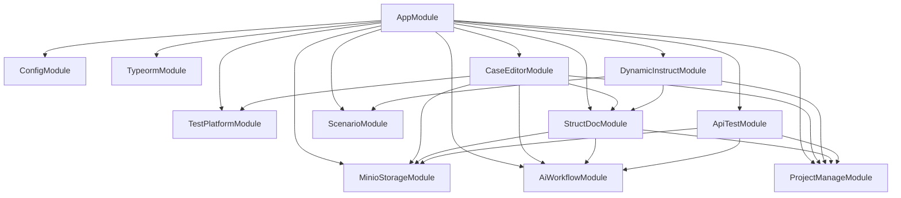

图表来源
- [apps/api/src/app.module.ts:21-39](file://apps/api/src/app.module.ts#L21-L39)
- [apps/api/src/modules/case-editor/index.ts:29-58](file://apps/api/src/modules/case-editor/index.ts#L29-L58)
- [apps/api/src/modules/api-test/index.ts:25-62](file://apps/api/src/modules/api-test/index.ts#L25-L62)
- [apps/api/src/modules/dynamic-instruct/index.ts:14-27](file://apps/api/src/modules/dynamic-instruct/index.ts#L14-L27)
- [apps/api/src/modules/struct-doc/index.ts:18-32](file://apps/api/src/modules/struct-doc/index.ts#L18-L32)
- [apps/api/src/common/ai-workflow/index.ts:12-18](file://apps/api/src/common/ai-workflow/index.ts#L12-L18)
- [apps/api/src/common/minio/index.ts:9-15](file://apps/api/src/common/minio/index.ts#L9-L15)
- [apps/api/src/common/test-platform/index.ts:13-31](file://apps/api/src/common/test-platform/index.ts#L13-L31)

## 详细组件分析

### 模块生命周期与初始化顺序
- 初始化顺序
  - 启动文件先执行 Schema 预检查，再创建应用实例。
  - 按模块定义顺序依次触发各模块的构造函数与提供者工厂。
  - onModuleInit 生命周期钩子在模块初始化时调用，用于资源准备（如队列、索引等）。
- 销毁流程
  - 应用关闭时，Nest 会按相反顺序销毁模块与提供者，释放资源。

关键实现位置
- Schema 预检查与应用创建：[apps/api/src/bootstrap.ts:19-22](file://apps/api/src/bootstrap.ts#L19-L22)
- 模块初始化钩子（示例）
  - TypeORM Schema 补丁：[apps/api/src/common/typeorm/schema-patch.service.ts:15](file://apps/api/src/common/typeorm/schema-patch.service.ts#L15)
  - 案例生成队列初始化：[apps/api/src/modules/case-editor/service/case-generate-queue.service.ts:87](file://apps/api/src/modules/case-editor/service/case-generate-queue.service.ts#L87)
  - 结构化需求队列初始化：[apps/api/src/modules/struct-doc/service/struct-requirement-queue.service.ts:36](file://apps/api/src/modules/struct-doc/service/struct-requirement-queue.service.ts#L36)

章节来源
- [apps/api/src/bootstrap.ts:18-61](file://apps/api/src/bootstrap.ts#L18-L61)
- [apps/api/src/common/typeorm/schema-patch.service.ts:15](file://apps/api/src/common/typeorm/schema-patch.service.ts#L15)
- [apps/api/src/modules/case-editor/service/case-generate-queue.service.ts:87](file://apps/api/src/modules/case-editor/service/case-generate-queue.service.ts#L87)
- [apps/api/src/modules/struct-doc/service/struct-requirement-queue.service.ts:36](file://apps/api/src/modules/struct-doc/service/struct-requirement-queue.service.ts#L36)

### 模块间依赖与循环依赖处理
- 显式依赖
  - 案例编辑器模块显式导入项目管理、结构化文档、AI 工作流、MinIO 与测管平台模块。
  - 接口测试模块显式导入 MinIO 与 AI 工作流模块。
  - 动态指令模块与结构化文档模块共享测试点实体，通过类型导出解耦。
- 循环依赖规避
  - 使用惰性导入与 forwardRef（在需要时采用）避免直接循环引用。
  - 通过 exports 将服务与配置暴露给下游模块，避免在模块内部相互 import 导致的循环。
  - 将共享实体与常量放置在公共模块或各自模块内，减少跨模块直接依赖。

章节来源
- [apps/api/src/modules/case-editor/index.ts:29-58](file://apps/api/src/modules/case-editor/index.ts#L29-L58)
- [apps/api/src/modules/api-test/index.ts:25-62](file://apps/api/src/modules/api-test/index.ts#L25-L62)
- [apps/api/src/modules/dynamic-instruct/index.ts:14-27](file://apps/api/src/modules/dynamic-instruct/index.ts#L14-L27)

### 基础设施模块

#### AI 工作流模块（AiWorkflowModule）
- 职责：提供 AI 工作流配置与服务，支持外部 AI 能力集成。
- 关键点：通过配置提供者创建并导出配置与服务，便于业务模块按需使用。

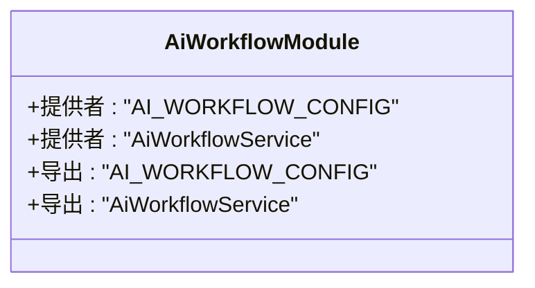

图表来源
- [apps/api/src/common/ai-workflow/index.ts:12-18](file://apps/api/src/common/ai-workflow/index.ts#L12-L18)

章节来源
- [apps/api/src/common/ai-workflow/index.ts:1-21](file://apps/api/src/common/ai-workflow/index.ts#L1-L21)

#### MinIO 存储模块（MinioStorageModule）
- 职责：封装对象存储配置与存储服务，统一上传、下载与元数据管理。
- 关键点：导出配置与服务，供文档解析、附件存储等场景使用。

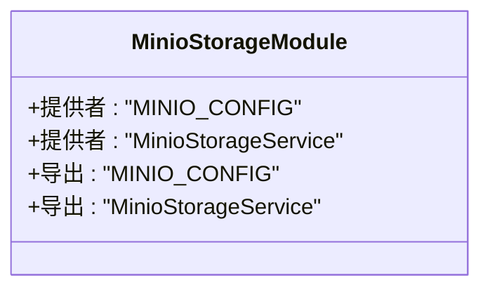

图表来源
- [apps/api/src/common/minio/index.ts:9-15](file://apps/api/src/common/minio/index.ts#L9-L15)

章节来源
- [apps/api/src/common/minio/index.ts:1-18](file://apps/api/src/common/minio/index.ts#L1-L18)

#### 测管平台模块（TestPlatformModule）
- 职责：注册测管平台数据库连接与实体，提供多库支持。
- 关键点：通过命名连接区分主库与其他业务库，避免命名冲突。

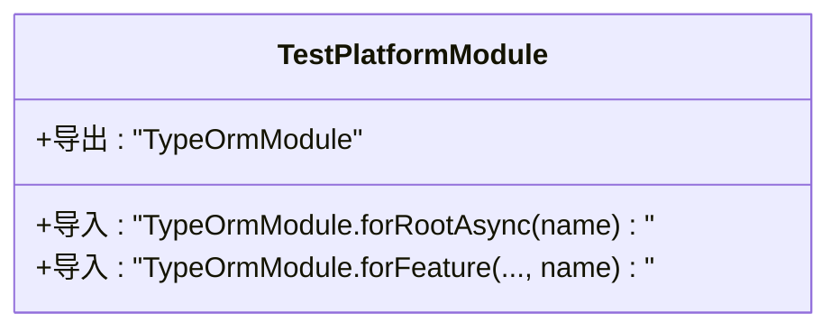

图表来源
- [apps/api/src/common/test-platform/index.ts:13-31](file://apps/api/src/common/test-platform/index.ts#L13-L31)

章节来源
- [apps/api/src/common/test-platform/index.ts:1-35](file://apps/api/src/common/test-platform/index.ts#L1-L35)

#### TypeORM 全局模块（TypeormModule）
- 职责：集中配置主数据库连接，提供 Schema 补丁服务。
- 关键点：使用异步工厂从配置服务读取参数，确保启动时配置可用。

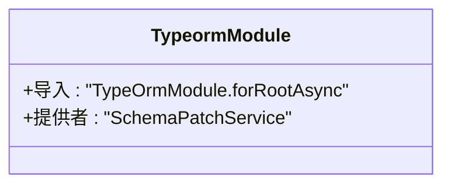

图表来源
- [apps/api/src/common/typeorm/index.ts:10-19](file://apps/api/src/common/typeorm/index.ts#L10-L19)

章节来源
- [apps/api/src/common/typeorm/index.ts:1-22](file://apps/api/src/common/typeorm/index.ts#L1-L22)

### 业务模块

#### 案例编辑器模块（CaseEditorModule）
- 职责：提供案例树、节点元数据、生成作业与工作空间管理能力；对接 MinIO、AI 工作流与测管平台。
- 结构：TypeORM 实体注册、控制器、服务与导出项。
- 通信机制：通过 exports 暴露服务，供其他模块复用；通过导入其他模块获得实体与能力。

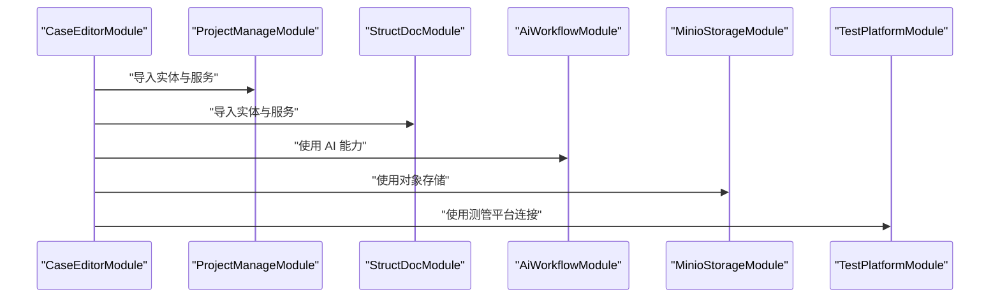

图表来源
- [apps/api/src/modules/case-editor/index.ts:29-58](file://apps/api/src/modules/case-editor/index.ts#L29-L58)

章节来源
- [apps/api/src/modules/case-editor/index.ts:1-60](file://apps/api/src/modules/case-editor/index.ts#L1-L60)

#### 动态指令模块（DynamicInstructModule）
- 职责：维护测试点指令与提示词，与结构化文档与场景模块协同。
- 结构：TypeORM 实体注册、控制器与服务。

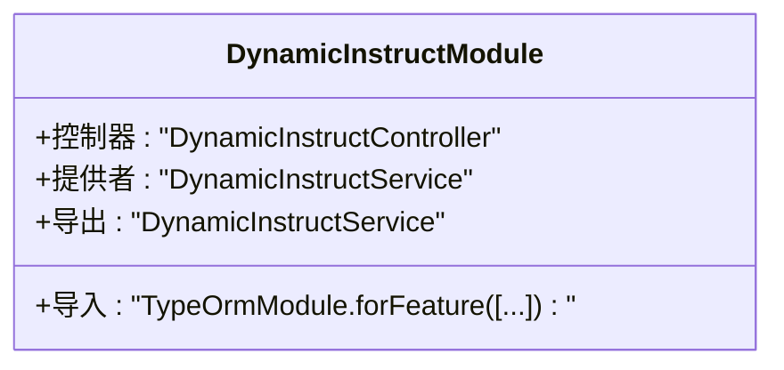

图表来源
- [apps/api/src/modules/dynamic-instruct/index.ts:14-27](file://apps/api/src/modules/dynamic-instruct/index.ts#L14-L27)

章节来源
- [apps/api/src/modules/dynamic-instruct/index.ts:1-30](file://apps/api/src/modules/dynamic-instruct/index.ts#L1-L30)

#### 项目管理模块（ProjectManageModule）
- 职责：提供项目 CRUD 与关联实体管理。
- 结构：TypeORM 实体注册、控制器与服务；向其他模块导出服务。

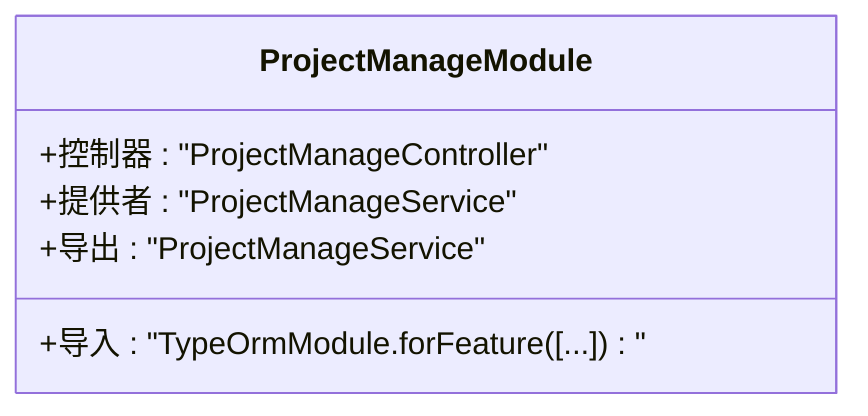

图表来源
- [apps/api/src/modules/project-manage/index.ts:15-29](file://apps/api/src/modules/project-manage/index.ts#L15-L29)

章节来源
- [apps/api/src/modules/project-manage/index.ts:1-32](file://apps/api/src/modules/project-manage/index.ts#L1-L32)

#### 结构化文档模块（StructDocModule）
- 职责：文档上传、解析、分块与需求结构化，对接 MinIO 与 AI 工作流。
- 结构：TypeORM 实体注册、控制器、服务与导出项。

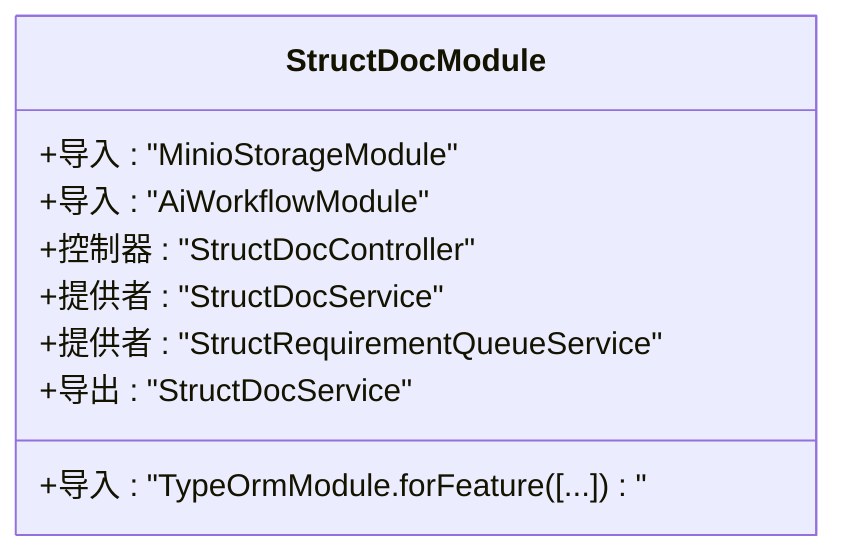

图表来源
- [apps/api/src/modules/struct-doc/index.ts:18-32](file://apps/api/src/modules/struct-doc/index.ts#L18-L32)

章节来源
- [apps/api/src/modules/struct-doc/index.ts:1-34](file://apps/api/src/modules/struct-doc/index.ts#L1-L34)

#### 场景维护模块（ScenarioModule）
- 职责：维护场景与提示词实体，为动态指令与案例编辑器提供语料支撑。
- 结构：TypeORM 实体注册、控制器与服务。

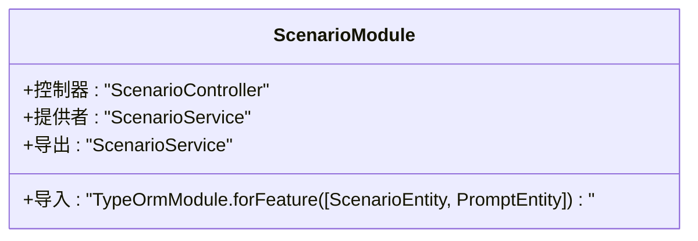

图表来源
- [apps/api/src/modules/scenario/index.ts:11-16](file://apps/api/src/modules/scenario/index.ts#L11-L16)

章节来源
- [apps/api/src/modules/scenario/index.ts:1-19](file://apps/api/src/modules/scenario/index.ts#L1-L19)

#### 接口测试模块（ApiTestModule）
- 职责：提供接口测试用例、环境、执行集、运行记录与事务管理。
- 结构：TypeORM 实体注册、控制器与服务；对接 MinIO 与 AI 工作流。

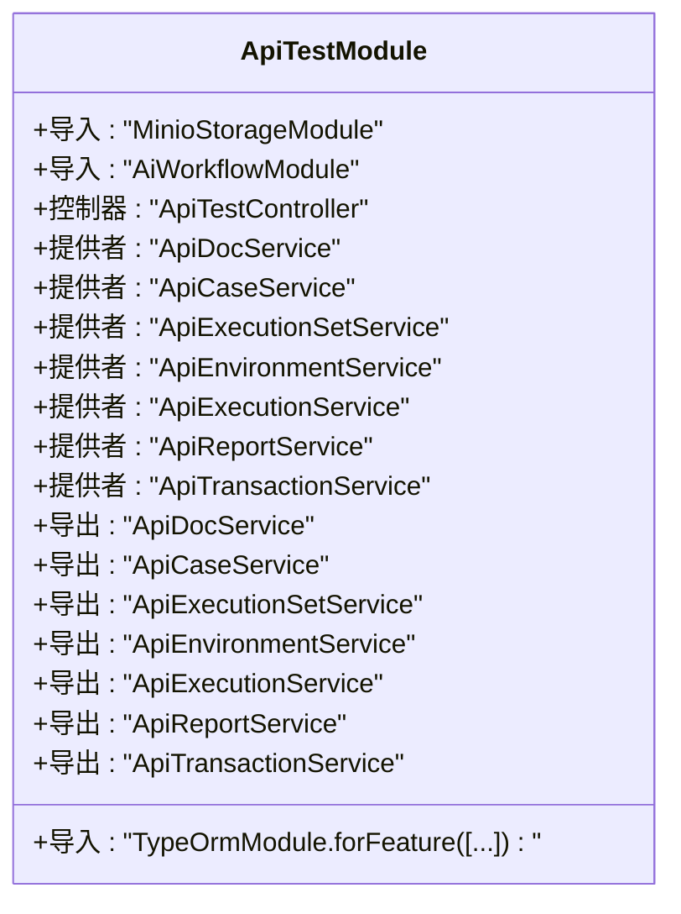

图表来源
- [apps/api/src/modules/api-test/index.ts:25-62](file://apps/api/src/modules/api-test/index.ts#L25-L62)

章节来源
- [apps/api/src/modules/api-test/index.ts:1-64](file://apps/api/src/modules/api-test/index.ts#L1-L64)

### 模块配置、提供者注册与控制器绑定最佳实践
- 配置
  - 使用配置提供者集中管理模块级配置，避免硬编码；通过 exports 将配置暴露给其他模块。
- 提供者注册
  - 将服务注册为提供者，尽量保持无状态或幂等；对有状态组件（如队列）使用 onModuleInit 完成初始化。
- 控制器绑定
  - 控制器仅承担路由与参数校验职责，业务逻辑下沉至服务；通过模块 exports 与其他模块共享服务。

章节来源
- [apps/api/src/common/ai-workflow/index.ts:12-18](file://apps/api/src/common/ai-workflow/index.ts#L12-L18)
- [apps/api/src/common/minio/index.ts:9-15](file://apps/api/src/common/minio/index.ts#L9-L15)
- [apps/api/src/modules/case-editor/index.ts:49-57](file://apps/api/src/modules/case-editor/index.ts#L49-L57)
- [apps/api/src/modules/api-test/index.ts:44-52](file://apps/api/src/modules/api-test/index.ts#L44-L52)

## 依赖关系分析
- 模块耦合度
  - 低耦合：通过 exports 与 imports 解耦，避免直接互相依赖。
  - 松耦合：业务模块通过共享实体与服务进行协作，减少紧耦合。
- 外部依赖
  - 数据库：主库由 TypeormModule 管理，测管平台通过命名连接独立管理。
  - 对象存储：MinIO 模块统一提供存储能力。
  - AI 能力：AiWorkflowModule 统一接入外部 AI 能力。
- 潜在循环依赖
  - 通过导出服务与延迟导入规避循环依赖风险；若出现循环，优先拆分公共接口或引入门面模块。

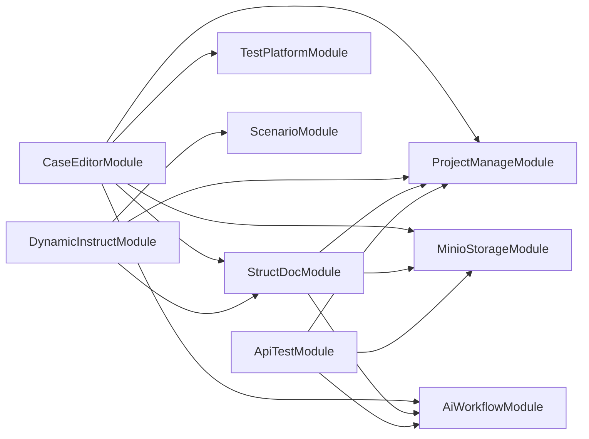

图表来源
- [apps/api/src/modules/case-editor/index.ts:29-58](file://apps/api/src/modules/case-editor/index.ts#L29-L58)
- [apps/api/src/modules/api-test/index.ts:25-62](file://apps/api/src/modules/api-test/index.ts#L25-L62)
- [apps/api/src/modules/dynamic-instruct/index.ts:14-27](file://apps/api/src/modules/dynamic-instruct/index.ts#L14-L27)
- [apps/api/src/modules/struct-doc/index.ts:18-32](file://apps/api/src/modules/struct-doc/index.ts#L18-L32)
- [apps/api/src/common/ai-workflow/index.ts:12-18](file://apps/api/src/common/ai-workflow/index.ts#L12-L18)
- [apps/api/src/common/minio/index.ts:9-15](file://apps/api/src/common/minio/index.ts#L9-L15)
- [apps/api/src/common/test-platform/index.ts:13-31](file://apps/api/src/common/test-platform/index.ts#L13-L31)

章节来源
- [apps/api/src/app.module.ts:21-39](file://apps/api/src/app.module.ts#L21-L39)

## 性能考量
- 启动性能
  - 将耗时操作（如 Schema 预检查）前置到启动阶段，减少运行期开销。
  - 合理拆分模块，避免单模块过大导致编译与初始化时间过长。
- 运行性能
  - 使用连接池与批量操作优化数据库访问。
  - 对大文件上传/下载使用流式处理与分片策略（结合 MinIO）。
  - 对 AI 调用进行缓存与限流，避免频繁调用外部服务。

## 故障排查指南
- 启动失败
  - 检查环境变量与配置提供者是否正确加载。
  - 确认数据库连接参数与 Schema 补丁是否成功执行。
- 模块初始化异常
  - 查看 onModuleInit 中的资源准备步骤（如队列、索引）是否抛错。
- 依赖注入问题
  - 确认模块 exports 是否覆盖所需服务，避免循环依赖导致的注入失败。

章节来源
- [apps/api/src/bootstrap.ts:18-61](file://apps/api/src/bootstrap.ts#L18-L61)
- [apps/api/src/common/typeorm/schema-patch.service.ts:15](file://apps/api/src/common/typeorm/schema-patch.service.ts#L15)
- [apps/api/src/modules/case-editor/service/case-generate-queue.service.ts:87](file://apps/api/src/modules/case-editor/service/case-generate-queue.service.ts#L87)
- [apps/api/src/modules/struct-doc/service/struct-requirement-queue.service.ts:36](file://apps/api/src/modules/struct-doc/service/struct-requirement-queue.service.ts#L36)

## 结论
本项目通过清晰的模块划分与基础设施抽象，实现了高内聚、低耦合的业务架构。根模块负责聚合，业务模块通过导出/导入与共享实体协作，配合生命周期钩子与配置提供者，确保初始化顺序与可维护性。遵循本文最佳实践，可在保证扩展性的前提下快速迭代新功能，并有效规避循环依赖与性能瓶颈。

## 附录
- 快速定位
  - 根模块与启动入口：[apps/api/src/app.module.ts](file://apps/api/src/app.module.ts)、[apps/api/src/bootstrap.ts](file://apps/api/src/bootstrap.ts)
  - 基础设施模块：[apps/api/src/common/ai-workflow/index.ts](file://apps/api/src/common/ai-workflow/index.ts)、[apps/api/src/common/minio/index.ts](file://apps/api/src/common/minio/index.ts)、[apps/api/src/common/test-platform/index.ts](file://apps/api/src/common/test-platform/index.ts)、[apps/api/src/common/typeorm/index.ts](file://apps/api/src/common/typeorm/index.ts)
  - 业务模块：[apps/api/src/modules/case-editor/index.ts](file://apps/api/src/modules/case-editor/index.ts)、[apps/api/src/modules/dynamic-instruct/index.ts](file://apps/api/src/modules/dynamic-instruct/index.ts)、[apps/api/src/modules/project-manage/index.ts](file://apps/api/src/modules/project-manage/index.ts)、[apps/api/src/modules/struct-doc/index.ts](file://apps/api/src/modules/struct-doc/index.ts)、[apps/api/src/modules/scenario/index.ts](file://apps/api/src/modules/scenario/index.ts)、[apps/api/src/modules/api-test/index.ts](file://apps/api/src/modules/api-test/index.ts)