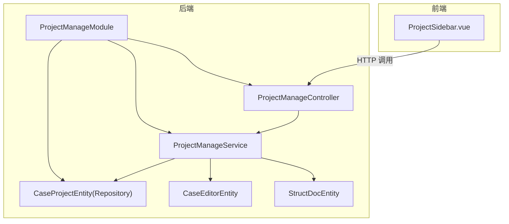
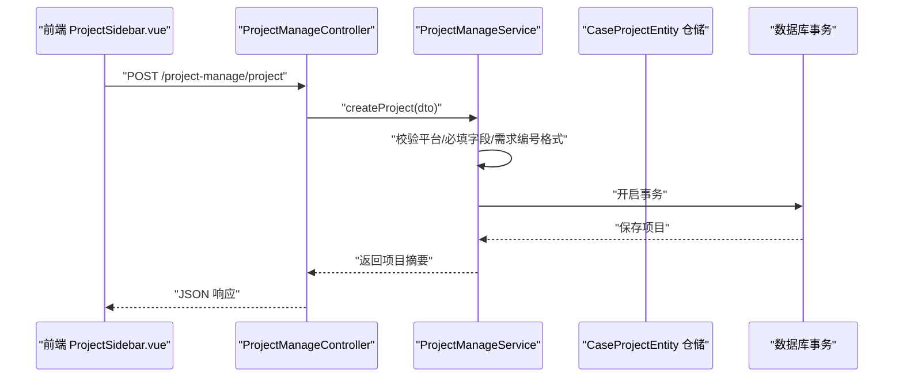
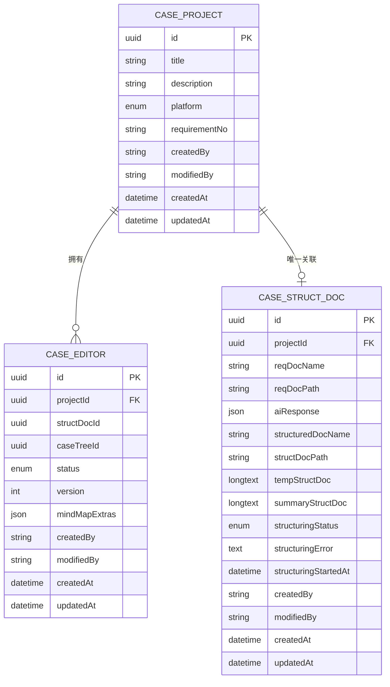
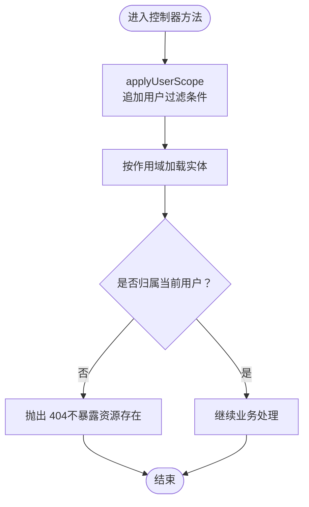
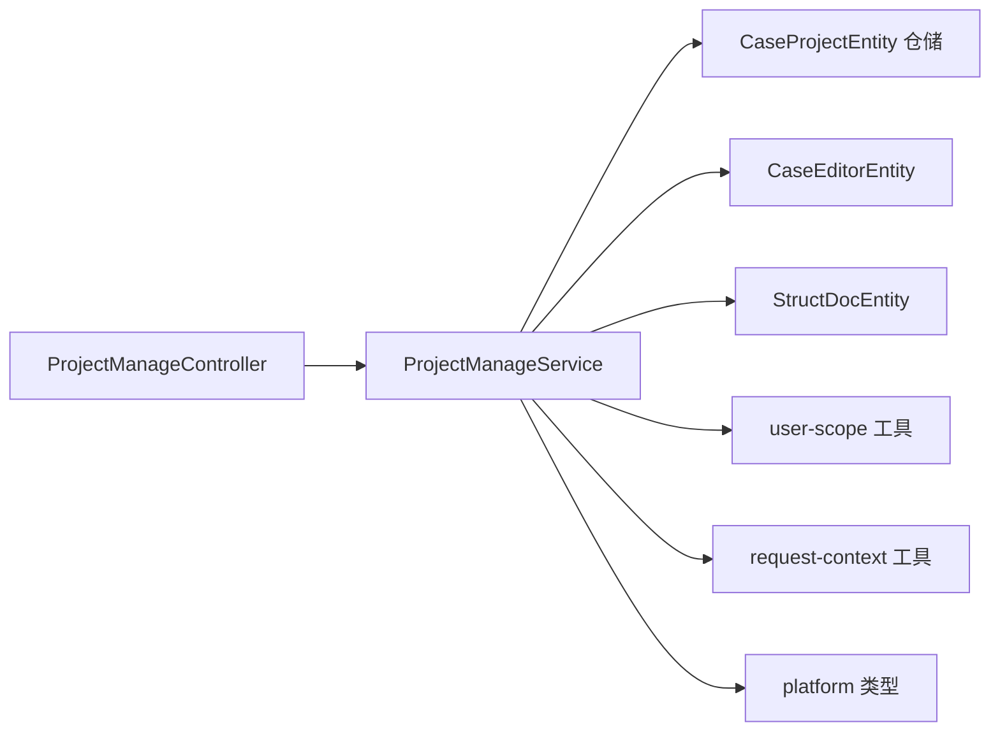

# 项目管理模块

<cite>
**本文引用的文件**
- [apps/api/src/modules/project-manage/entity/project.entity.ts](file://apps/api/src/modules/project-manage/entity/project.entity.ts)
- [apps/api/src/modules/project-manage/service/project-manage.service.ts](file://apps/api/src/modules/project-manage/service/project-manage.service.ts)
- [apps/api/src/modules/project-manage/controller/project-manage.controller.ts](file://apps/api/src/modules/project-manage/controller/project-manage.controller.ts)
- [apps/api/src/modules/project-manage/dto/create-project.dto.ts](file://apps/api/src/modules/project-manage/dto/create-project.dto.ts)
- [apps/api/src/modules/project-manage/dto/update-project.dto.ts](file://apps/api/src/modules/project-manage/dto/update-project.dto.ts)
- [apps/api/src/modules/project-manage/dto/batch-delete-projects.dto.ts](file://apps/api/src/modules/project-manage/dto/batch-delete-projects.dto.ts)
- [apps/api/src/modules/project-manage/index.ts](file://apps/api/src/modules/project-manage/index.ts)
- [packages/shared/src/platform.ts](file://packages/shared/src/platform.ts)
- [apps/api/src/common/audit/user-scope.ts](file://apps/api/src/common/audit/user-scope.ts)
- [apps/api/src/common/audit/request-context.ts](file://apps/api/src/common/audit/request-context.ts)
- [apps/api/src/common/audit/user-context.middleware.ts](file://apps/api/src/common/audit/user-context.middleware.ts)
- [apps/api/src/modules/case-editor/entity/case-editor.entity.ts](file://apps/api/src/modules/case-editor/entity/case-editor.entity.ts)
- [apps/api/src/modules/struct-doc/entity/struct-doc.entity.ts](file://apps/api/src/modules/struct-doc/entity/struct-doc.entity.ts)
- [apps/web/src/components/ProjectSidebar.vue](file://apps/web/src/components/ProjectSidebar.vue)
</cite>

## 目录
1. [简介](#简介)
2. [项目结构](#项目结构)
3. [核心组件](#核心组件)
4. [架构总览](#架构总览)
5. [详细组件分析](#详细组件分析)
6. [依赖关系分析](#依赖关系分析)
7. [性能考虑](#性能考虑)
8. [故障排查指南](#故障排查指南)
9. [结论](#结论)
10. [附录](#附录)

## 简介
本文件面向“项目管理模块”，围绕项目创建、维护与权限管理进行系统性说明。重点包括：
- 项目实体的数据模型、字段定义与业务规则
- 项目 CRUD 接口与使用示例
- 多用户环境下的权限隔离与访问控制策略
- 项目与用户的关系、平台维度划分与生命周期管理
- 批量操作与状态管理（生成次数统计）

该模块同时服务于“案例生成平台”和“接口测试平台”，通过平台字段实现资源隔离。

## 项目结构
项目管理模块位于后端 API 子系统中，采用分层设计：控制器负责 HTTP 接口，服务层承载业务逻辑，TypeORM 实体映射数据库表。前端侧边栏组件负责用户交互与调用后端接口。

图表来源
- [apps/api/src/modules/project-manage/controller/project-manage.controller.ts:24-137](file://apps/api/src/modules/project-manage/controller/project-manage.controller.ts#L24-L137)
- [apps/api/src/modules/project-manage/service/project-manage.service.ts:44-53](file://apps/api/src/modules/project-manage/service/project-manage.service.ts#L44-L53)
- [apps/api/src/modules/project-manage/entity/project.entity.ts:19-58](file://apps/api/src/modules/project-manage/entity/project.entity.ts#L19-L58)
- [apps/api/src/modules/project-manage/index.ts:15-31](file://apps/api/src/modules/project-manage/index.ts#L15-L31)

章节来源
- [apps/api/src/modules/project-manage/controller/project-manage.controller.ts:24-137](file://apps/api/src/modules/project-manage/controller/project-manage.controller.ts#L24-L137)
- [apps/api/src/modules/project-manage/service/project-manage.service.ts:44-53](file://apps/api/src/modules/project-manage/service/project-manage.service.ts#L44-L53)
- [apps/api/src/modules/project-manage/entity/project.entity.ts:19-58](file://apps/api/src/modules/project-manage/entity/project.entity.ts#L19-L58)
- [apps/api/src/modules/project-manage/index.ts:15-31](file://apps/api/src/modules/project-manage/index.ts#L15-L31)

## 核心组件
- 控制器：提供项目创建、列表查询、详情查询、更新、删除、批量删除等接口，并对分页、平台筛选、关键字搜索进行参数校验与透传。
- 服务层：封装业务规则，包括平台校验、需求编号格式与唯一性校验、生成次数统计、事务级联删除等。
- 实体与仓储：项目实体映射 case_project 表；服务层注入仓储执行持久化。
- 权限与审计：通过用户作用域中间件与审计字段，确保资源归属与操作追踪。
- 平台类型：统一定义平台枚举，区分“案例生成平台”和“接口测试平台”。

章节来源
- [apps/api/src/modules/project-manage/controller/project-manage.controller.ts:31-136](file://apps/api/src/modules/project-manage/controller/project-manage.controller.ts#L31-L136)
- [apps/api/src/modules/project-manage/service/project-manage.service.ts:59-312](file://apps/api/src/modules/project-manage/service/project-manage.service.ts#L59-L312)
- [apps/api/src/modules/project-manage/entity/project.entity.ts:27-58](file://apps/api/src/modules/project-manage/entity/project.entity.ts#L27-L58)
- [packages/shared/src/platform.ts:1-3](file://packages/shared/src/platform.ts#L1-L3)

## 架构总览
项目管理模块遵循典型的 NestJS 分层架构，结合 TypeORM 的仓储模式与用户作用域中间件，实现资源隔离与审计追踪。

图表来源
- [apps/api/src/modules/project-manage/controller/project-manage.controller.ts:31-36](file://apps/api/src/modules/project-manage/controller/project-manage.controller.ts#L31-L36)
- [apps/api/src/modules/project-manage/service/project-manage.service.ts:59-93](file://apps/api/src/modules/project-manage/service/project-manage.service.ts#L59-L93)

章节来源
- [apps/api/src/modules/project-manage/controller/project-manage.controller.ts:24-137](file://apps/api/src/modules/project-manage/controller/project-manage.controller.ts#L24-L137)
- [apps/api/src/modules/project-manage/service/project-manage.service.ts:44-93](file://apps/api/src/modules/project-manage/service/project-manage.service.ts#L44-L93)

## 详细组件分析

### 数据模型与实体关系
项目实体映射到 case_project 表，包含标题、描述、平台、需求编号以及审计字段。服务层通过关联实体统计生成次数，并在删除时级联清理。

图表来源
- [apps/api/src/modules/project-manage/entity/project.entity.ts:27-58](file://apps/api/src/modules/project-manage/entity/project.entity.ts#L27-L58)
- [apps/api/src/modules/case-editor/entity/case-editor.entity.ts:32-102](file://apps/api/src/modules/case-editor/entity/case-editor.entity.ts#L32-L102)
- [apps/api/src/modules/struct-doc/entity/struct-doc.entity.ts:30-104](file://apps/api/src/modules/struct-doc/entity/struct-doc.entity.ts#L30-L104)

章节来源
- [apps/api/src/modules/project-manage/entity/project.entity.ts:19-58](file://apps/api/src/modules/project-manage/entity/project.entity.ts#L19-L58)
- [apps/api/src/modules/case-editor/entity/case-editor.entity.ts:32-102](file://apps/api/src/modules/case-editor/entity/case-editor.entity.ts#L32-L102)
- [apps/api/src/modules/struct-doc/entity/struct-doc.entity.ts:30-104](file://apps/api/src/modules/struct-doc/entity/struct-doc.entity.ts#L30-L104)

### 权限与访问控制
- 用户作用域：通过用户上下文中间件解析当前用户，所有查询自动附加 createdBy 约束，确保用户只能看到自己的资源或系统预置资源。
- 资源归属校验：在读取、更新、删除时，先按用户作用域查找，再断言资源归属，避免越权与信息泄露。
- 审计字段：创建与更新时自动填充 createdBy/modifiedBy，便于审计与溯源。

图表来源
- [apps/api/src/common/audit/user-scope.ts:38-89](file://apps/api/src/common/audit/user-scope.ts#L38-L89)
- [apps/api/src/common/audit/user-context.middleware.ts:8-19](file://apps/api/src/common/audit/user-context.middleware.ts#L8-L19)
- [apps/api/src/common/audit/request-context.ts:8-56](file://apps/api/src/common/audit/request-context.ts#L8-L56)

章节来源
- [apps/api/src/common/audit/user-scope.ts:13-89](file://apps/api/src/common/audit/user-scope.ts#L13-L89)
- [apps/api/src/common/audit/user-context.middleware.ts:8-19](file://apps/api/src/common/audit/user-context.middleware.ts#L8-L19)
- [apps/api/src/common/audit/request-context.ts:8-56](file://apps/api/src/common/audit/request-context.ts#L8-L56)

### 业务规则与字段定义
- 平台枚举：case-forge（案例生成）、api-test（接口测试）。不同平台对标题与需求编号的要求不同。
- 需求编号格式：统一为 XQxxxx-xxxx-xx，创建与更新时会进行格式校验与标准化。
- 默认名称：当未提供标题时，案例生成平台会自动生成带序号的默认名称。
- 生成次数统计：通过关联案例编辑实体按项目聚合统计生成次数，用于侧边栏展示。

章节来源
- [packages/shared/src/platform.ts:1-3](file://packages/shared/src/platform.ts#L1-L3)
- [apps/api/src/modules/project-manage/service/project-manage.service.ts:25-34](file://apps/api/src/modules/project-manage/service/project-manage.service.ts#L25-L34)
- [apps/api/src/modules/project-manage/service/project-manage.service.ts:82-92](file://apps/api/src/modules/project-manage/service/project-manage.service.ts#L82-L92)
- [apps/api/src/modules/project-manage/service/project-manage.service.ts:283-303](file://apps/api/src/modules/project-manage/service/project-manage.service.ts#L283-L303)

### CRUD 接口与使用示例
- 创建项目
  - 方法：POST /project-manage/project
  - 参数：标题、描述、需求编号、平台（可选，默认案例生成）
  - 规则：接口测试平台要求标题与需求编号必填且需求编号唯一；案例生成平台允许标题为空并自动生成默认名称
  - 返回：项目摘要（含创建/更新时间等）
- 获取项目列表
  - 方法：GET /project-manage/projects
  - 参数：page、size、input（关键字模糊搜索）、platform
  - 返回：分页结果，包含生成次数
- 获取侧边栏项目列表
  - 方法：GET /project-manage/projects/sidebar
  - 参数：platform、page、size、input
  - 返回：简化字段集合（含生成次数）
- 获取项目详情
  - 方法：GET /project-manage/projects/:projectId
  - 返回：项目详情与生成次数
- 更新项目
  - 方法：PATCH /project-manage/projects/:projectId
  - 参数：标题、描述、需求编号（可选更新）
  - 规则：接口测试平台更新时同样校验需求编号格式与唯一性
- 删除项目
  - 方法：DELETE /project-manage/projects/:projectId
  - 行为：事务内级联删除关联的案例编辑与结构化文档
- 批量删除
  - 方法：POST /project-manage/projects/batch-delete
  - 参数：ids[]
  - 行为：去重后逐个删除，忽略不存在的 ID

章节来源
- [apps/api/src/modules/project-manage/controller/project-manage.controller.ts:31-136](file://apps/api/src/modules/project-manage/controller/project-manage.controller.ts#L31-L136)
- [apps/api/src/modules/project-manage/service/project-manage.service.ts:59-312](file://apps/api/src/modules/project-manage/service/project-manage.service.ts#L59-L312)
- [apps/api/src/modules/project-manage/dto/create-project.dto.ts:8-32](file://apps/api/src/modules/project-manage/dto/create-project.dto.ts#L8-L32)
- [apps/api/src/modules/project-manage/dto/update-project.dto.ts:7-26](file://apps/api/src/modules/project-manage/dto/update-project.dto.ts#L7-L26)
- [apps/api/src/modules/project-manage/dto/batch-delete-projects.dto.ts:7-14](file://apps/api/src/modules/project-manage/dto/batch-delete-projects.dto.ts#L7-L14)

### 生命周期与状态管理
- 生命周期：创建 → 使用（生成案例/结构化文档） → 删除（级联清理）
- 状态统计：通过案例编辑实体统计生成次数，用于前端侧边栏展示
- 平台维度：同一数据库内按 platform 字段隔离不同业务域

章节来源
- [apps/api/src/modules/project-manage/service/project-manage.service.ts:283-303](file://apps/api/src/modules/project-manage/service/project-manage.service.ts#L283-L303)
- [apps/api/src/modules/project-manage/entity/project.entity.ts:39-41](file://apps/api/src/modules/project-manage/entity/project.entity.ts#L39-L41)

### 与用户的关系管理
- 用户作用域：所有查询自动附加 createdBy 约束，确保资源隔离
- 归属校验：读取、更新、删除均需断言资源归属，避免越权
- 审计字段：创建与更新自动记录操作人

章节来源
- [apps/api/src/common/audit/user-scope.ts:13-89](file://apps/api/src/common/audit/user-scope.ts#L13-L89)
- [apps/api/src/common/audit/request-context.ts:47-56](file://apps/api/src/common/audit/request-context.ts#L47-L56)

## 依赖关系分析
模块内部依赖清晰，控制器仅依赖服务，服务依赖仓储与工具函数，避免循环依赖。

图表来源
- [apps/api/src/modules/project-manage/controller/project-manage.controller.ts:26-29](file://apps/api/src/modules/project-manage/controller/project-manage.controller.ts#L26-L29)
- [apps/api/src/modules/project-manage/service/project-manage.service.ts:46-53](file://apps/api/src/modules/project-manage/service/project-manage.service.ts#L46-L53)
- [apps/api/src/common/audit/user-scope.ts:1-90](file://apps/api/src/common/audit/user-scope.ts#L1-L90)
- [apps/api/src/common/audit/request-context.ts:1-57](file://apps/api/src/common/audit/request-context.ts#L1-L57)
- [packages/shared/src/platform.ts:1-3](file://packages/shared/src/platform.ts#L1-L3)

章节来源
- [apps/api/src/modules/project-manage/controller/project-manage.controller.ts:26-29](file://apps/api/src/modules/project-manage/controller/project-manage.controller.ts#L26-L29)
- [apps/api/src/modules/project-manage/service/project-manage.service.ts:46-53](file://apps/api/src/modules/project-manage/service/project-manage.service.ts#L46-L53)
- [apps/api/src/modules/project-manage/index.ts:15-29](file://apps/api/src/modules/project-manage/index.ts#L15-L29)

## 性能考虑
- 查询优化：项目列表与侧边栏列表均基于索引字段排序与过滤，建议保持 platform 与 updatedAt 组合索引生效。
- 生成次数统计：按项目 ID 聚合统计，建议在 case_editor 表建立合适的索引以提升 COUNT 聚合性能。
- 批量删除：使用事务逐条清理，避免大事务长时间锁表；若数据量极大，可考虑分批处理或后台队列。
- 前端分页：合理设置 page/size，避免超大分页导致数据库压力。

## 故障排查指南
- 404 未找到
  - 可能原因：资源不存在或不属于当前用户；服务层在断言归属时统一返回 404 以避免信息泄露。
  - 处理建议：确认用户上下文是否正确注入，检查 createdBy 是否匹配当前用户。
- 需求编号冲突
  - 可能原因：接口测试平台下需求编号在同一用户作用域内必须唯一。
  - 处理建议：更换唯一的需求编号或在同名项目上进行更新而非重复创建。
- 需求编号格式错误
  - 可能原因：未满足 XQxxxx-xxxx-xx 格式。
  - 处理建议：按提示修正格式或使用提取工具规范化输入。
- 删除失败
  - 可能原因：项目不存在或不在当前用户作用域内。
  - 处理建议：确认项目 ID 与用户作用域，检查事务是否成功提交。

章节来源
- [apps/api/src/common/audit/user-scope.ts:48-75](file://apps/api/src/common/audit/user-scope.ts#L48-L75)
- [apps/api/src/modules/project-manage/service/project-manage.service.ts:214-232](file://apps/api/src/modules/project-manage/service/project-manage.service.ts#L214-L232)
- [apps/api/src/modules/project-manage/service/project-manage.service.ts:241-250](file://apps/api/src/modules/project-manage/service/project-manage.service.ts#L241-L250)

## 结论
项目管理模块通过清晰的分层设计、严格的用户作用域与审计机制，实现了跨平台的项目管理能力。其 CRUD 接口覆盖了多用户场景下的创建、查询、更新、删除与批量删除需求，并提供了生成次数统计与平台隔离能力。建议在生产环境中配合合理的索引与分页策略，持续关注事务与并发场景下的性能表现。

## 附录
- 前端侧边栏交互
  - 支持新建、编辑、删除、批量删除、分页与搜索；接口调用与后端保持一致的参数约定。
  
章节来源
- [apps/web/src/components/ProjectSidebar.vue:1-200](file://apps/web/src/components/ProjectSidebar.vue#L1-L200)