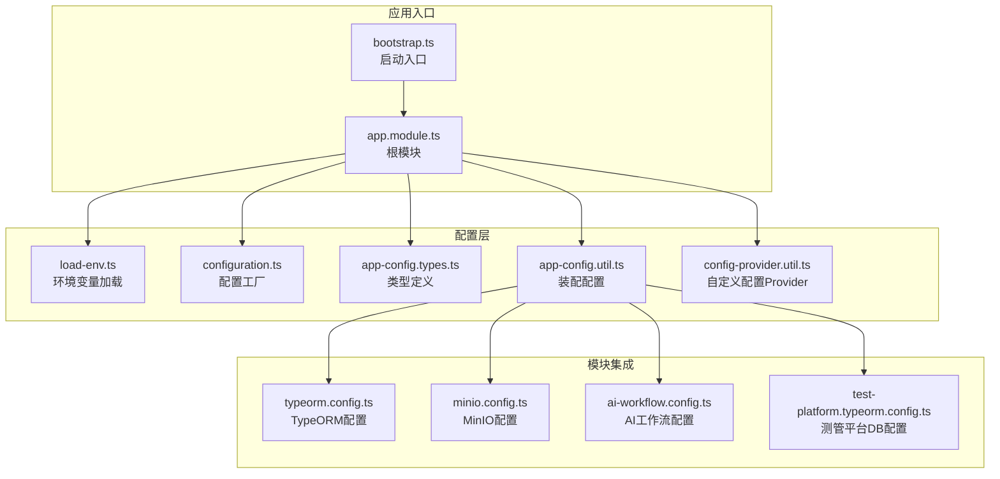
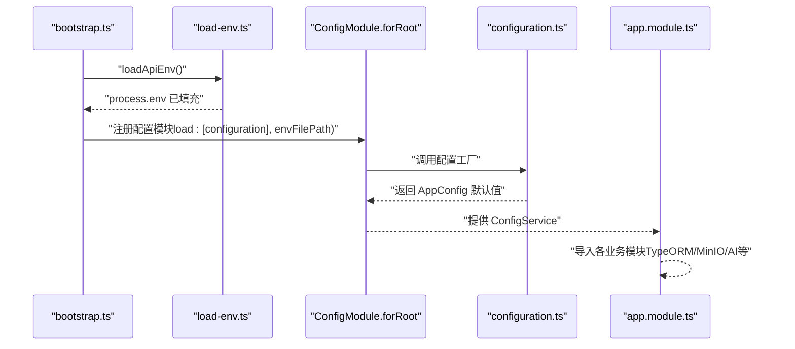
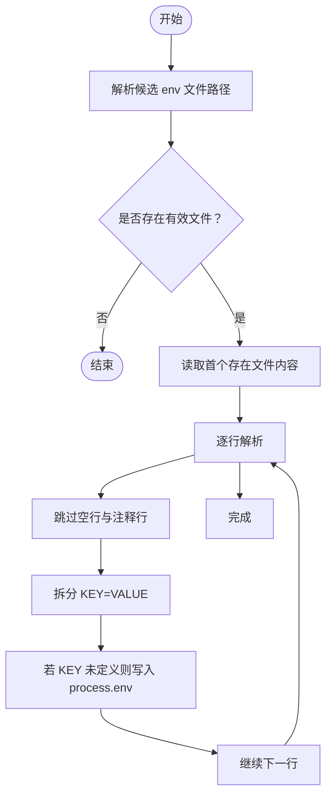
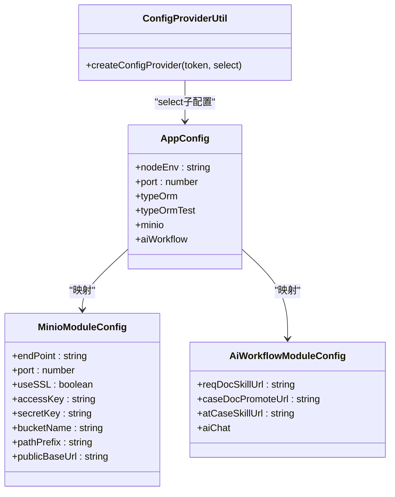
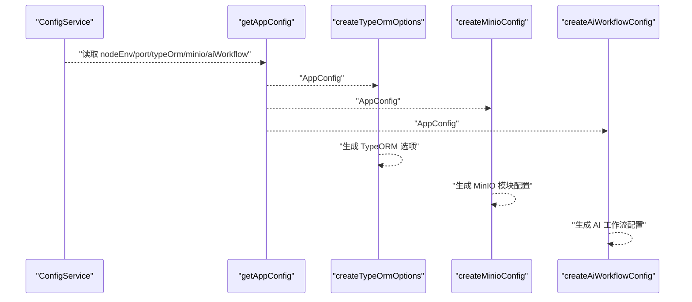
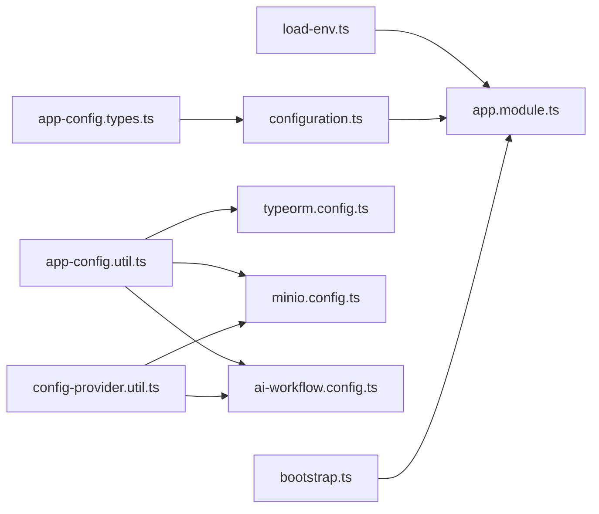

# 配置管理与环境变量

<cite>
**本文引用的文件**
- [apps/api/src/config/configuration.ts](file://apps/api/src/config/configuration.ts)
- [apps/api/src/config/load-env.ts](file://apps/api/src/config/load-env.ts)
- [apps/api/src/config/app-config.types.ts](file://apps/api/src/config/app-config.types.ts)
- [apps/api/src/config/config-provider.util.ts](file://apps/api/src/config/config-provider.util.ts)
- [apps/api/src/config/app-config.util.ts](file://apps/api/src/config/app-config.util.ts)
- [apps/api/src/common/minio/minio.config.ts](file://apps/api/src/common/minio/minio.config.ts)
- [apps/api/src/common/typeorm/typeorm.config.ts](file://apps/api/src/common/typeorm/typeorm.config.ts)
- [apps/api/src/common/test-platform/test-platform.typeorm.config.ts](file://apps/api/src/common/test-platform/test-platform.typeorm.config.ts)
- [apps/api/src/app.module.ts](file://apps/api/src/app.module.ts)
- [apps/api/src/bootstrap.ts](file://apps/api/src/bootstrap.ts)
- [apps/api/src/common/ai-workflow/ai-workflow.config.ts](file://apps/api/src/common/ai-workflow/ai-workflow.config.ts)
- [apps/api/src/common/typeorm/pre-sync-schema-patch.ts](file://apps/api/src/common/typeorm/pre-sync-schema-patch.ts)
- [apps/api/env/.development.env](file://apps/api/env/.development.env)
</cite>

## 目录
1. [简介](#简介)
2. [项目结构](#项目结构)
3. [核心组件](#核心组件)
4. [架构总览](#架构总览)
5. [详细组件分析](#详细组件分析)
6. [依赖关系分析](#依赖关系分析)
7. [性能考量](#性能考量)
8. [故障排查指南](#故障排查指南)
9. [结论](#结论)
10. [附录](#附录)

## 简介
本文件面向 NestJS 应用的配置管理与环境变量体系，围绕以下目标展开：  
- 配置模块与配置提供者的使用方式  
- 配置验证与类型转换策略  
- 环境变量加载、默认值与分层优先级  
- 应用配置的分层管理、配置合并与运行时更新建议  
- 配置安全、敏感信息保护与配置热重载最佳实践  
- 提供可落地的实现示例与参考路径，帮助构建灵活、安全的配置系统  

## 项目结构
本项目采用“按功能域划分”的模块组织方式，配置相关代码集中在 apps/api/src/config 及若干公共模块中，配合根模块集中注册与加载。

**图示来源**
- [apps/api/src/bootstrap.ts:18-64](file://apps/api/src/bootstrap.ts#L18-L64)
- [apps/api/src/app.module.ts:21-48](file://apps/api/src/app.module.ts#L21-L48)
- [apps/api/src/config/load-env.ts:32-55](file://apps/api/src/config/load-env.ts#L32-L55)
- [apps/api/src/config/configuration.ts:7-49](file://apps/api/src/config/configuration.ts#L7-L49)
- [apps/api/src/config/app-config.types.ts:6-45](file://apps/api/src/config/app-config.types.ts#L6-L45)
- [apps/api/src/config/app-config.util.ts:11-21](file://apps/api/src/config/app-config.util.ts#L11-L21)
- [apps/api/src/config/config-provider.util.ts:13-24](file://apps/api/src/config/config-provider.util.ts#L13-L24)
- [apps/api/src/common/typeorm/typeorm.config.ts:15-43](file://apps/api/src/common/typeorm/typeorm.config.ts#L15-L43)
- [apps/api/src/common/minio/minio.config.ts:25-38](file://apps/api/src/common/minio/minio.config.ts#L25-L38)
- [apps/api/src/common/ai-workflow/ai-workflow.config.ts:16-21](file://apps/api/src/common/ai-workflow/ai-workflow.config.ts#L16-L21)
- [apps/api/src/common/test-platform/test-platform.typeorm.config.ts:11-31](file://apps/api/src/common/test-platform/test-platform.typeorm.config.ts#L11-L31)

**章节来源**
- [apps/api/src/app.module.ts:21-48](file://apps/api/src/app.module.ts#L21-L48)
- [apps/api/src/bootstrap.ts:18-64](file://apps/api/src/bootstrap.ts#L18-L64)

## 核心组件
- 配置工厂与默认值：通过配置工厂统一产出 AppConfig，内置默认值，确保未设置时也能正常启动。  
- 环境变量加载：支持多层级 env 文件，按 NODE_ENV 解析优先级，逐行解析并写入 process.env，且不覆盖已存在变量。  
- 类型安全装配：通过 ConfigService 读取配置并装配为强类型对象，避免运行期类型错误。  
- 自定义配置 Provider：基于子配置选择器创建独立注入令牌，便于模块内按需注入。  
- 多数据源配置：分别针对主库、测试库、MinIO、AI 工作流等模块提供独立配置映射。  

**章节来源**
- [apps/api/src/config/configuration.ts:7-49](file://apps/api/src/config/configuration.ts#L7-L49)
- [apps/api/src/config/load-env.ts:32-55](file://apps/api/src/config/load-env.ts#L32-L55)
- [apps/api/src/config/app-config.util.ts:11-21](file://apps/api/src/config/app-config.util.ts#L11-L21)
- [apps/api/src/config/config-provider.util.ts:13-24](file://apps/api/src/config/config-provider.util.ts#L13-L24)
- [apps/api/src/common/minio/minio.config.ts:25-38](file://apps/api/src/common/minio/minio.config.ts#L25-L38)
- [apps/api/src/common/typeorm/typeorm.config.ts:15-43](file://apps/api/src/common/typeorm/typeorm.config.ts#L15-L43)
- [apps/api/src/common/test-platform/test-platform.typeorm.config.ts:11-31](file://apps/api/src/common/test-platform/test-platform.typeorm.config.ts#L11-L31)

## 架构总览
下图展示了从启动到模块装配的关键流程，包括环境变量加载、配置工厂装配与模块注入。

**图示来源**
- [apps/api/src/bootstrap.ts:9-13](file://apps/api/src/bootstrap.ts#L9-L13)
- [apps/api/src/config/load-env.ts:32-55](file://apps/api/src/config/load-env.ts#L32-L55)
- [apps/api/src/config/configuration.ts:7-49](file://apps/api/src/config/configuration.ts#L7-L49)
- [apps/api/src/app.module.ts:23-27](file://apps/api/src/app.module.ts#L23-L27)

## 详细组件分析

### 配置工厂与默认值（configuration.ts）
- 作用：作为 ConfigModule 的配置工厂，统一产出 AppConfig；对缺失的环境变量提供合理默认值。  
- 关键点：  
  - 数据库连接参数（主库与测试库）均提供默认值，测试库参数可回退到主库参数。  
  - MinIO 参数包含主机、端口、访问密钥、桶名、路径前缀与公开基础 URL。  
  - AI 工作流包含技能 URL 与 AI Chat 子配置（URL、模型、API Key、重试次数）。  
- 类型约束：与类型定义文件保持一致，保证运行期安全。

**章节来源**
- [apps/api/src/config/configuration.ts:7-49](file://apps/api/src/config/configuration.ts#L7-L49)
- [apps/api/src/config/app-config.types.ts:6-45](file://apps/api/src/config/app-config.types.ts#L6-L45)

### 环境变量加载（load-env.ts）
- 作用：按优先级解析并加载 .env 文件，支持注释行（// 与 #），逐行解析 KEY=VALUE 并写入 process.env，不覆盖已存在变量。  
- 优先级（从高到低）：  
  - env/.{NODE_ENV}.env  
  - env/.development.env  
  - .env（项目根）  
- 返回给 ConfigModule 的 envFilePath 列表用于模块初始化阶段加载。

**图示来源**
- [apps/api/src/config/load-env.ts:13-26](file://apps/api/src/config/load-env.ts#L13-L26)
- [apps/api/src/config/load-env.ts:32-55](file://apps/api/src/config/load-env.ts#L32-L55)

**章节来源**
- [apps/api/src/config/load-env.ts:13-26](file://apps/api/src/config/load-env.ts#L13-L26)
- [apps/api/src/config/load-env.ts:32-55](file://apps/api/src/config/load-env.ts#L32-L55)

### 类型安全装配（app-config.util.ts）
- 作用：从 ConfigService 获取强类型 AppConfig，避免直接操作字符串键值带来的风险。  
- 特性：  
  - 使用 get 方法读取各子配置段，结合类型定义确保字段完整性。  
  - 与 configuration.ts 的默认值配合，保证运行期不会出现未定义字段。

**章节来源**
- [apps/api/src/config/app-config.util.ts:11-21](file://apps/api/src/config/app-config.util.ts#L11-L21)

### 自定义配置 Provider（config-provider.util.ts）
- 作用：基于子配置选择器创建独立注入令牌的 Provider，便于模块内部按需注入特定配置片段。  
- 典型场景：  
  - 将 MinIO 配置映射为 MinioModuleConfig 并注入容器。  
  - 将 AI 工作流配置映射为 AiWorkflowModuleConfig 并注入容器。

**图示来源**
- [apps/api/src/config/config-provider.util.ts:13-24](file://apps/api/src/config/config-provider.util.ts#L13-L24)
- [apps/api/src/config/app-config.types.ts:6-45](file://apps/api/src/config/app-config.types.ts#L6-L45)
- [apps/api/src/common/minio/minio.config.ts:10-19](file://apps/api/src/common/minio/minio.config.ts#L10-L19)
- [apps/api/src/common/ai-workflow/ai-workflow.config.ts:10](file://apps/api/src/common/ai-workflow/ai-workflow.config.ts#L10)

**章节来源**
- [apps/api/src/config/config-provider.util.ts:13-24](file://apps/api/src/config/config-provider.util.ts#L13-L24)
- [apps/api/src/common/minio/minio.config.ts:25-38](file://apps/api/src/common/minio/minio.config.ts#L25-L38)
- [apps/api/src/common/ai-workflow/ai-workflow.config.ts:16-21](file://apps/api/src/common/ai-workflow/ai-workflow.config.ts#L16-L21)

### 多数据源配置映射
- TypeORM 主库与测试库：  
  - 主库配置由 configuration.ts 提供默认值，TypeORM 模块通过工厂方法读取并创建连接选项。  
  - 测试库配置同样提供默认值，便于同步测管平台数据。  
- MinIO：  
  - 从 AppConfig 中抽取 MinIO 字段，映射为 MinioModuleConfig，供对象存储模块使用。  
- AI 工作流：  
  - 从 AppConfig.aiWorkflow 抽取子配置，供 AI 工作流模块使用。

**图示来源**
- [apps/api/src/config/app-config.util.ts:11-21](file://apps/api/src/config/app-config.util.ts#L11-L21)
- [apps/api/src/common/typeorm/typeorm.config.ts:38-43](file://apps/api/src/common/typeorm/typeorm.config.ts#L38-L43)
- [apps/api/src/common/minio/minio.config.ts:25-38](file://apps/api/src/common/minio/minio.config.ts#L25-L38)
- [apps/api/src/common/ai-workflow/ai-workflow.config.ts:16-21](file://apps/api/src/common/ai-workflow/ai-workflow.config.ts#L16-L21)

**章节来源**
- [apps/api/src/common/typeorm/typeorm.config.ts:15-43](file://apps/api/src/common/typeorm/typeorm.config.ts#L15-L43)
- [apps/api/src/common/test-platform/test-platform.typeorm.config.ts:11-31](file://apps/api/src/common/test-platform/test-platform.typeorm.config.ts#L11-L31)
- [apps/api/src/common/minio/minio.config.ts:25-38](file://apps/api/src/common/minio/minio.config.ts#L25-L38)
- [apps/api/src/common/ai-workflow/ai-workflow.config.ts:16-21](file://apps/api/src/common/ai-workflow/ai-workflow.config.ts#L16-L21)

### 启动与模块注册（bootstrap.ts 与 app.module.ts）
- 启动阶段：先加载环境变量，再创建 Nest 应用并注册全局中间件、版本化、Swagger 等。  
- 根模块：注册 ConfigModule.forRoot，传入配置工厂与 envFilePath 列表，使全局可用 ConfigService。  
- 运行时端口：从 process.env 读取 PORT，未设置时使用默认值。

**章节来源**
- [apps/api/src/bootstrap.ts:9-13](file://apps/api/src/bootstrap.ts#L9-L13)
- [apps/api/src/bootstrap.ts:58-61](file://apps/api/src/bootstrap.ts#L58-L61)
- [apps/api/src/app.module.ts:23-27](file://apps/api/src/app.module.ts#L23-L27)

## 依赖关系分析
- 配置工厂依赖环境变量与类型定义，输出强类型配置对象。  
- 根模块依赖配置工厂与环境变量加载工具，向各业务模块提供 ConfigService。  
- 业务模块通过工厂方法或自定义 Provider 使用子配置，降低耦合度。  
- 启动入口在模块注册前加载环境变量，确保配置模块初始化时具备完整上下文。

**图示来源**
- [apps/api/src/config/load-env.ts:32-55](file://apps/api/src/config/load-env.ts#L32-L55)
- [apps/api/src/app.module.ts:23-27](file://apps/api/src/app.module.ts#L23-L27)
- [apps/api/src/config/configuration.ts:7-49](file://apps/api/src/config/configuration.ts#L7-L49)
- [apps/api/src/config/app-config.types.ts:6-45](file://apps/api/src/config/app-config.types.ts#L6-L45)
- [apps/api/src/config/app-config.util.ts:11-21](file://apps/api/src/config/app-config.util.ts#L11-L21)
- [apps/api/src/config/config-provider.util.ts:13-24](file://apps/api/src/config/config-provider.util.ts#L13-L24)
- [apps/api/src/common/typeorm/typeorm.config.ts:15-43](file://apps/api/src/common/typeorm/typeorm.config.ts#L15-L43)
- [apps/api/src/common/minio/minio.config.ts:25-38](file://apps/api/src/common/minio/minio.config.ts#L25-L38)
- [apps/api/src/common/ai-workflow/ai-workflow.config.ts:16-21](file://apps/api/src/common/ai-workflow/ai-workflow.config.ts#L16-L21)
- [apps/api/src/bootstrap.ts:9-13](file://apps/api/src/bootstrap.ts#L9-L13)

**章节来源**
- [apps/api/src/app.module.ts:21-48](file://apps/api/src/app.module.ts#L21-L48)
- [apps/api/src/bootstrap.ts:18-64](file://apps/api/src/bootstrap.ts#L18-L64)

## 性能考量
- 环境变量加载：仅在启动阶段一次性读取，成本极低，适合本地开发与 CI 场景。  
- 配置工厂默认值：减少分支判断与重复赋值逻辑，提升装配效率。  
- 模块化配置：按需注入子配置，避免不必要的依赖与内存占用。  
- 建议：生产环境尽量通过进程管理器或容器注入环境变量，避免频繁磁盘 IO。

## 故障排查指南
- 环境变量未生效  
  - 检查 NODE_ENV 是否正确，确认候选 env 文件路径是否存在于项目中。  
  - 确认注释行格式（// 或 #）与 KEY=VALUE 格式是否符合解析规则。  
  - 注意 process.env 不会覆盖已存在变量，若变量已被外部设置，需检查外部来源。  
  - 参考路径：[apps/api/src/config/load-env.ts:32-55](file://apps/api/src/config/load-env.ts#L32-L55)，[apps/api/env/.development.env:1-55](file://apps/api/env/.development.env#L1-L55)  
- 配置读取异常  
  - 确认 ConfigModule.forRoot 已正确注册配置工厂与 envFilePath。  
  - 使用 getAppConfig 读取强类型配置，避免直接拼接字符串键。  
  - 参考路径：[apps/api/src/app.module.ts:23-27](file://apps/api/src/app.module.ts#L23-L27)，[apps/api/src/config/app-config.util.ts:11-21](file://apps/api/src/config/app-config.util.ts#L11-L21)  
- 数据库连接问题  
  - 检查 TYPEORM_* 环境变量是否正确，确认默认值是否满足本地需求。  
  - 若为本地开发，确认预同步迁移脚本已执行，避免外键约束导致的同步失败。  
  - 参考路径：[apps/api/src/config/configuration.ts:10-25](file://apps/api/src/config/configuration.ts#L10-L25)，[apps/api/src/common/typeorm/pre-sync-schema-patch.ts:7-31](file://apps/api/src/common/typeorm/pre-sync-schema-patch.ts#L7-L31)  
- MinIO 或 AI 工作流配置无效  
  - 确认对应注入令牌与映射函数已正确注册 Provider。  
  - 参考路径：[apps/api/src/common/minio/minio.config.ts:25-38](file://apps/api/src/common/minio/minio.config.ts#L25-L38)，[apps/api/src/common/ai-workflow/ai-workflow.config.ts:16-21](file://apps/api/src/common/ai-workflow/ai-workflow.config.ts#L16-L21)

**章节来源**
- [apps/api/src/config/load-env.ts:32-55](file://apps/api/src/config/load-env.ts#L32-L55)
- [apps/api/src/app.module.ts:23-27](file://apps/api/src/app.module.ts#L23-L27)
- [apps/api/src/config/app-config.util.ts:11-21](file://apps/api/src/config/app-config.util.ts#L11-L21)
- [apps/api/src/config/configuration.ts:10-25](file://apps/api/src/config/configuration.ts#L10-L25)
- [apps/api/src/common/typeorm/pre-sync-schema-patch.ts:7-31](file://apps/api/src/common/typeorm/pre-sync-schema-patch.ts#L7-L31)
- [apps/api/src/common/minio/minio.config.ts:25-38](file://apps/api/src/common/minio/minio.config.ts#L25-L38)
- [apps/api/src/common/ai-workflow/ai-workflow.config.ts:16-21](file://apps/api/src/common/ai-workflow/ai-workflow.config.ts#L16-L21)

## 结论
本项目通过“配置工厂 + 环境变量加载 + 强类型装配 + 自定义 Provider”的组合，实现了清晰、可维护、可扩展的配置管理体系。其优点包括：  
- 明确的默认值与回退策略，降低部署复杂度。  
- 分层优先级的 env 文件加载，便于多环境隔离。  
- 强类型装配与模块化注入，提升可测试性与可维护性。  
建议在生产环境中进一步完善：  
- 使用进程管理器或容器注入敏感变量，避免明文写入 env 文件。  
- 对关键配置增加校验与日志记录，便于问题定位。  
- 对需要热更新的配置，采用外部配置中心或文件监控方案，并在模块层面支持平滑切换。

## 附录
- 环境变量样例文件位置：  
  - [apps/api/env/.development.env](file://apps/api/env/.development.env)  
- 关键实现参考路径：  
  - 配置工厂与默认值：[apps/api/src/config/configuration.ts](file://apps/api/src/config/configuration.ts)  
  - 环境变量加载：[apps/api/src/config/load-env.ts](file://apps/api/src/config/load-env.ts)  
  - 强类型装配：[apps/api/src/config/app-config.util.ts](file://apps/api/src/config/app-config.util.ts)  
  - 自定义 Provider：[apps/api/src/config/config-provider.util.ts](file://apps/api/src/config/config-provider.util.ts)  
  - 数据库配置映射：[apps/api/src/common/typeorm/typeorm.config.ts](file://apps/api/src/common/typeorm/typeorm.config.ts)  
  - MinIO 配置映射：[apps/api/src/common/minio/minio.config.ts](file://apps/api/src/common/minio/minio.config.ts)  
  - AI 工作流配置映射：[apps/api/src/common/ai-workflow/ai-workflow.config.ts](file://apps/api/src/common/ai-workflow/ai-workflow.config.ts)  
  - 测管平台数据库配置映射：[apps/api/src/common/test-platform/test-platform.typeorm.config.ts](file://apps/api/src/common/test-platform/test-platform.typeorm.config.ts)  
  - 根模块与启动入口：[apps/api/src/app.module.ts](file://apps/api/src/app.module.ts)，[apps/api/src/bootstrap.ts](file://apps/api/src/bootstrap.ts)