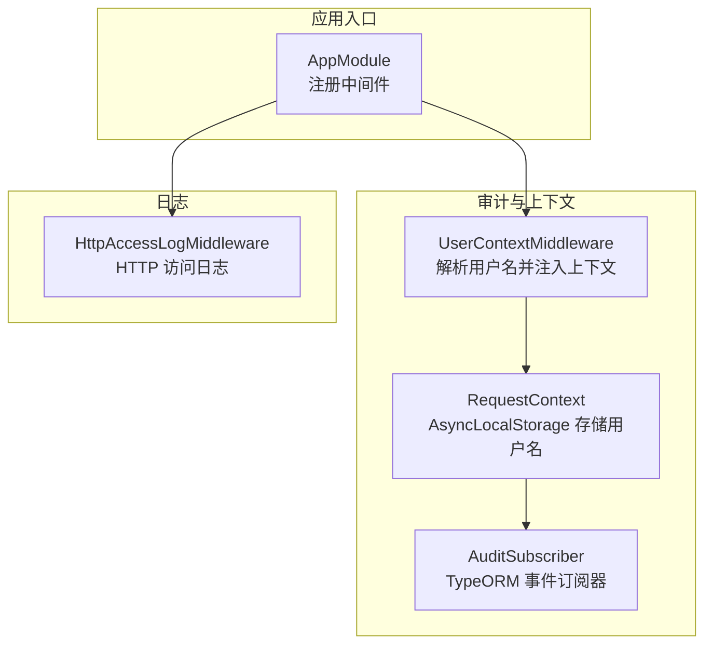
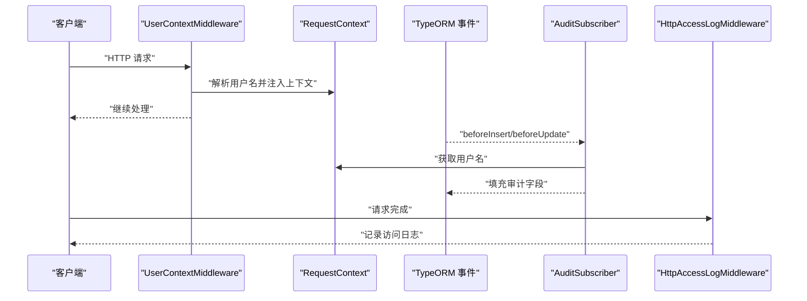
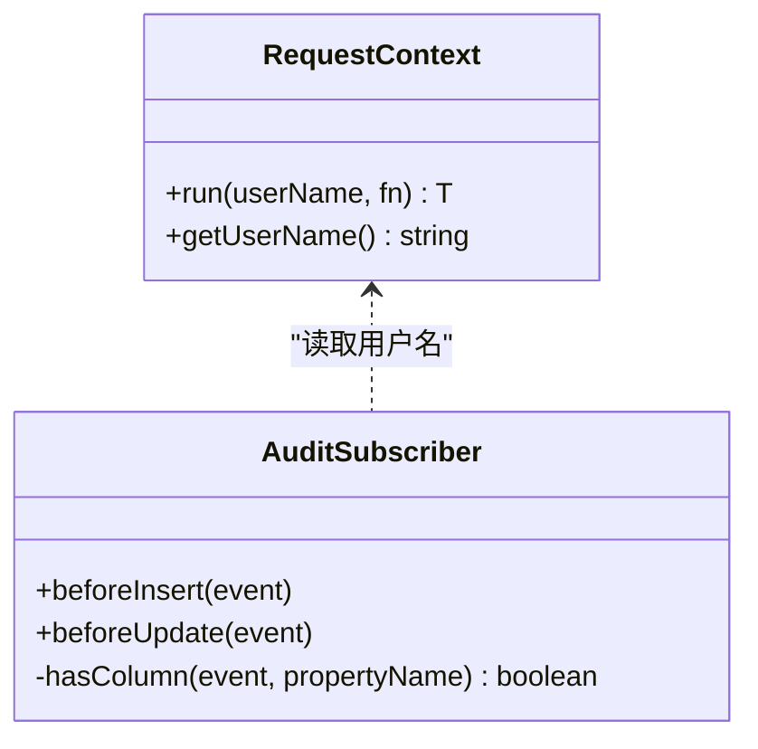
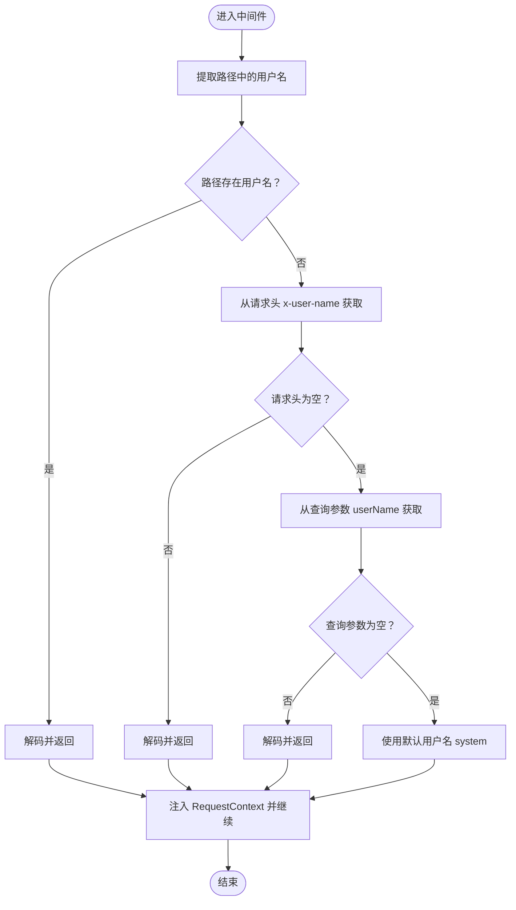
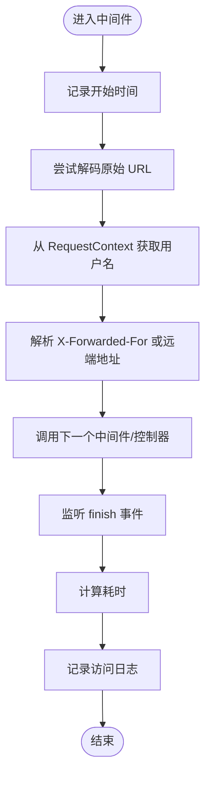
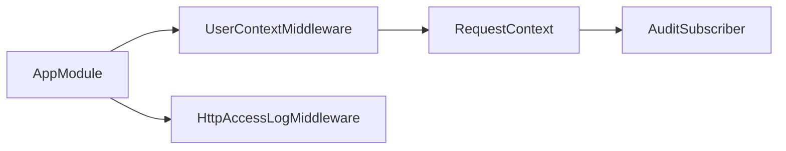

# 错误处理与日志记录

<cite>
**本文引用的文件**
- [apps/api/src/common/audit/audit.subscriber.ts](file://apps/api/src/common/audit/audit.subscriber.ts)
- [apps/api/src/common/audit/request-context.ts](file://apps/api/src/common/audit/request-context.ts)
- [apps/api/src/common/audit/user-context.middleware.ts](file://apps/api/src/common/audit/user-context.middleware.ts)
- [apps/api/src/common/http/http-access-log.middleware.ts](file://apps/api/src/common/http/http-access-log.middleware.ts)
- [apps/api/src/common/http/public-response.util.ts](file://apps/api/src/common/http/public-response.util.ts)
- [apps/api/src/app.module.ts](file://apps/api/src/app.module.ts)
</cite>

## 目录
1. [引言](#引言)
2. [项目结构](#项目结构)
3. [核心组件](#核心组件)
4. [架构总览](#架构总览)
5. [详细组件分析](#详细组件分析)
6. [依赖关系分析](#依赖关系分析)
7. [性能考虑](#性能考虑)
8. [故障排查指南](#故障排查指南)
9. [结论](#结论)
10. [附录](#附录)

## 引言
本技术指南聚焦于本项目的错误处理与日志记录体系，围绕以下目标展开：
- 基于 NestJS 的中间件与上下文机制，实现统一的请求级审计与日志采集
- 通过请求上下文在异步调用链中传递用户标识，支撑审计字段自动填充与访问日志关联
- 提供可扩展的日志记录策略与最佳实践，覆盖日志级别、轮转与性能监控
- 给出可落地的实现步骤与参考路径，帮助快速构建可观测、健壮的应用系统

本项目未发现专门的全局异常过滤器或统一错误响应格式定义文件；本文将基于现有中间件与审计机制，给出可直接落地的改进与实施建议。

## 项目结构
本项目的错误处理与日志记录主要分布在如下位置：
- 审计与请求上下文：apps/api/src/common/audit
- HTTP 访问日志中间件：apps/api/src/common/http
- 应用根模块注册中间件：apps/api/src/app.module.ts

图表来源
- [apps/api/src/app.module.ts:42-46](file://apps/api/src/app.module.ts#L42-L46)
- [apps/api/src/common/audit/user-context.middleware.ts:8-19](file://apps/api/src/common/audit/user-context.middleware.ts#L8-L19)
- [apps/api/src/common/audit/request-context.ts:8-16](file://apps/api/src/common/audit/request-context.ts#L8-L16)
- [apps/api/src/common/audit/audit.subscriber.ts:10-32](file://apps/api/src/common/audit/audit.subscriber.ts#L10-L32)
- [apps/api/src/common/http/http-access-log.middleware.ts:7-45](file://apps/api/src/common/http/http-access-log.middleware.ts#L7-45)

章节来源
- [apps/api/src/app.module.ts:41-47](file://apps/api/src/app.module.ts#L41-L47)

## 核心组件
- 请求上下文与审计字段自动填充
  - 使用 AsyncLocalStorage 在请求生命周期内存储当前用户名，并在 TypeORM 插入/更新前自动填充审计字段
  - 参考路径：[apps/api/src/common/audit/request-context.ts:8-16](file://apps/api/src/common/audit/request-context.ts#L8-L16)、[apps/api/src/common/audit/audit.subscriber.ts:10-32](file://apps/api/src/common/audit/audit.subscriber.ts#L10-L32)
- 用户上下文中间件
  - 从路径、请求头、查询参数解析用户名，重写路径并注入到请求上下文中
  - 参考路径：[apps/api/src/common/audit/user-context.middleware.ts:8-19](file://apps/api/src/common/audit/user-context.middleware.ts#L8-L19)
- HTTP 访问日志中间件
  - 记录方法、路径、状态码、耗时、用户、IP、内容长度等信息
  - 参考路径：[apps/api/src/common/http/http-access-log.middleware.ts:7-45](file://apps/api/src/common/http/http-access-log.middleware.ts#L7-45)
- 公共响应数据转换工具
  - 将内部实体转换为对外公开的数据结构，便于统一输出与审计
  - 参考路径：[apps/api/src/common/http/public-response.util.ts:16-32](file://apps/api/src/common/http/public-response.util.ts#L16-L32)

章节来源
- [apps/api/src/common/audit/request-context.ts:8-16](file://apps/api/src/common/audit/request-context.ts#L8-L16)
- [apps/api/src/common/audit/audit.subscriber.ts:10-32](file://apps/api/src/common/audit/audit.subscriber.ts#L10-L32)
- [apps/api/src/common/audit/user-context.middleware.ts:8-19](file://apps/api/src/common/audit/user-context.middleware.ts#L8-L19)
- [apps/api/src/common/http/http-access-log.middleware.ts:7-45](file://apps/api/src/common/http/http-access-log.middleware.ts#L7-45)
- [apps/api/src/common/http/public-response.util.ts:16-32](file://apps/api/src/common/http/public-response.util.ts#L16-L32)

## 架构总览
下图展示了请求进入系统后的处理流程，包括用户上下文解析、审计字段填充以及访问日志记录：

图表来源
- [apps/api/src/common/audit/user-context.middleware.ts:8-19](file://apps/api/src/common/audit/user-context.middleware.ts#L8-L19)
- [apps/api/src/common/audit/request-context.ts:8-16](file://apps/api/src/common/audit/request-context.ts#L8-L16)
- [apps/api/src/common/audit/audit.subscriber.ts:10-32](file://apps/api/src/common/audit/audit.subscriber.ts#L10-L32)
- [apps/api/src/common/http/http-access-log.middleware.ts:7-45](file://apps/api/src/common/http/http-access-log.middleware.ts#L7-45)

## 详细组件分析

### 请求上下文与审计字段自动填充
- 设计要点
  - 使用 AsyncLocalStorage 保存当前用户名，确保在异步调用链中可访问
  - TypeORM 事件订阅器在插入/更新前检查实体是否具备审计字段，若有则自动填充
- 关键行为
  - beforeInsert：填充 created_by / modified_by
  - beforeUpdate：填充 modified_by
- 复杂度与性能
  - 上下文读取为 O(1)，TypeORM 事件检查为 O(k)（k 为实体列数）
  - 对性能影响极小，建议在所有需要审计字段的实体上保持一致命名约定

图表来源
- [apps/api/src/common/audit/request-context.ts:8-16](file://apps/api/src/common/audit/request-context.ts#L8-L16)
- [apps/api/src/common/audit/audit.subscriber.ts:10-39](file://apps/api/src/common/audit/audit.subscriber.ts#L10-L39)

章节来源
- [apps/api/src/common/audit/request-context.ts:8-16](file://apps/api/src/common/audit/request-context.ts#L8-L16)
- [apps/api/src/common/audit/audit.subscriber.ts:10-39](file://apps/api/src/common/audit/audit.subscriber.ts#L10-L39)

### 用户上下文中间件
- 功能
  - 从路径、请求头、查询参数解析用户名，支持路径重写
  - 将用户名注入到 RequestContext，供后续组件使用
- 输入解析顺序
  - 路径优先，其次请求头 x-user-name，再次查询参数 userName
- 边界处理
  - 缺省值 system，解码失败回退原始字符串

图表来源
- [apps/api/src/common/audit/user-context.middleware.ts:8-19](file://apps/api/src/common/audit/user-context.middleware.ts#L8-L19)
- [apps/api/src/common/audit/request-context.ts:18-45](file://apps/api/src/common/audit/request-context.ts#L18-L45)

章节来源
- [apps/api/src/common/audit/user-context.middleware.ts:8-19](file://apps/api/src/common/audit/user-context.middleware.ts#L8-L19)
- [apps/api/src/common/audit/request-context.ts:18-45](file://apps/api/src/common/audit/request-context.ts#L18-L45)

### HTTP 访问日志中间件
- 日志内容
  - 方法、路径、状态码、耗时、用户、IP、内容长度
- 性能注意
  - 使用 finish 事件计算耗时，避免阻塞主处理流程
  - 对原始 URL 进行安全解码，防止异常导致日志丢失
- 级别选择
  - 使用 verbose 级别记录详细访问信息，便于问题定位与审计

图表来源
- [apps/api/src/common/http/http-access-log.middleware.ts:7-45](file://apps/api/src/common/http/http-access-log.middleware.ts#L7-45)

章节来源
- [apps/api/src/common/http/http-access-log.middleware.ts:7-45](file://apps/api/src/common/http/http-access-log.middleware.ts#L7-45)

### 公共响应数据转换工具
- 作用
  - 将内部实体映射为对外公开的数据结构，统一输出字段与格式
  - 支持项目、场景、测试点、接口文档、用例、执行集、运行结果等多类实体
- 建议
  - 在控制器层统一使用该工具进行响应封装，确保输出一致性
  - 如需分页或列表摘要，可复用现有“摘要”函数风格

章节来源
- [apps/api/src/common/http/public-response.util.ts:16-32](file://apps/api/src/common/http/public-response.util.ts#L16-L32)

## 依赖关系分析
- 中间件注册
  - AppModule 将 UserContextMiddleware 与 HttpAccessLogMiddleware 注册为全局中间件
- 上下文依赖
  - UserContextMiddleware 依赖 RequestContext 注入用户名
  - AuditSubscriber 依赖 RequestContext 获取用户名并填充实体
- 日志依赖
  - HttpAccessLogMiddleware 依赖 RequestContext 输出用户信息

图表来源
- [apps/api/src/app.module.ts:42-46](file://apps/api/src/app.module.ts#L42-L46)
- [apps/api/src/common/audit/user-context.middleware.ts:8-19](file://apps/api/src/common/audit/user-context.middleware.ts#L8-L19)
- [apps/api/src/common/audit/request-context.ts:8-16](file://apps/api/src/common/audit/request-context.ts#L8-L16)
- [apps/api/src/common/audit/audit.subscriber.ts:10-32](file://apps/api/src/common/audit/audit.subscriber.ts#L10-L32)
- [apps/api/src/common/http/http-access-log.middleware.ts:7-45](file://apps/api/src/common/http/http-access-log.middleware.ts#L7-45)

章节来源
- [apps/api/src/app.module.ts:42-46](file://apps/api/src/app.module.ts#L42-L46)

## 性能考虑
- 日志级别与开销
  - 访问日志使用 verbose 级别，建议在生产环境结合日志后端进行采样或降级
  - 避免在高频路径中进行昂贵的序列化或 I/O 操作
- 异步上下文
  - AsyncLocalStorage 在单请求生命周期内无额外 GC 压力，但应避免在回调中长期持有上下文对象
- 数据库审计字段
  - 仅对具备审计字段的实体生效，避免对无关实体产生检查成本
- URL 解码
  - 对原始 URL 的解码失败回退原值，减少异常路径对性能的影响

## 故障排查指南
- 用户名解析异常
  - 现象：日志中 user=system
  - 排查：确认路径、请求头、查询参数是否正确传入，检查解码逻辑
  - 参考路径：[apps/api/src/common/audit/user-context.middleware.ts:8-19](file://apps/api/src/common/audit/user-context.middleware.ts#L8-L19)、[apps/api/src/common/audit/request-context.ts:18-45](file://apps/api/src/common/audit/request-context.ts#L18-L45)
- 审计字段未填充
  - 现象：实体缺少 created_by / modified_by
  - 排查：确认实体是否具备对应列，检查 TypeORM 事件是否触发
  - 参考路径：[apps/api/src/common/audit/audit.subscriber.ts:10-39](file://apps/api/src/common/audit/audit.subscriber.ts#L10-L39)
- 访问日志缺失
  - 现象：无 HTTP 访问日志
  - 排查：确认中间件已注册，finish 事件是否正常触发
  - 参考路径：[apps/api/src/common/http/http-access-log.middleware.ts:7-45](file://apps/api/src/common/http/http-access-log.middleware.ts#L7-45)、[apps/api/src/app.module.ts:42-46](file://apps/api/src/app.module.ts#L42-L46)
- 公共响应字段不一致
  - 现象：对外输出字段与预期不符
  - 排查：核对 public-response.util 中的映射函数，确保实体字段完整
  - 参考路径：[apps/api/src/common/http/public-response.util.ts:16-32](file://apps/api/src/common/http/public-response.util.ts#L16-L32)

章节来源
- [apps/api/src/common/audit/user-context.middleware.ts:8-19](file://apps/api/src/common/audit/user-context.middleware.ts#L8-L19)
- [apps/api/src/common/audit/request-context.ts:18-45](file://apps/api/src/common/audit/request-context.ts#L18-L45)
- [apps/api/src/common/audit/audit.subscriber.ts:10-39](file://apps/api/src/common/audit/audit.subscriber.ts#L10-L39)
- [apps/api/src/common/http/http-access-log.middleware.ts:7-45](file://apps/api/src/common/http/http-access-log.middleware.ts#L7-45)
- [apps/api/src/common/http/public-response.util.ts:16-32](file://apps/api/src/common/http/public-response.util.ts#L16-L32)

## 结论
本项目通过“用户上下文中间件 + 请求上下文 + TypeORM 审计订阅者 + HTTP 访问日志中间件”的组合，实现了统一的请求级审计与可观测性基础。建议在此基础上进一步引入：
- 全局异常过滤器与统一错误响应格式
- 明确的错误分类与错误码体系
- 结合日志后端的日志轮转与性能监控策略

这些改进将显著提升系统的可维护性与可观测性，便于快速定位问题并保障线上稳定运行。

## 附录
- 实施建议（步骤化）
  - 步骤一：在 AppModule 中注册用户上下文中间件与访问日志中间件
    - 参考路径：[apps/api/src/app.module.ts:42-46](file://apps/api/src/app.module.ts#L42-L46)
  - 步骤二：在需要审计的实体中添加 created_by / modified_by 字段，并确保 TypeORM 同步
    - 参考路径：[apps/api/src/common/audit/audit.subscriber.ts:10-39](file://apps/api/src/common/audit/audit.subscriber.ts#L10-L39)
  - 步骤三：在控制器层使用公共响应工具进行统一输出
    - 参考路径：[apps/api/src/common/http/public-response.util.ts:16-32](file://apps/api/src/common/http/public-response.util.ts#L16-L32)
  - 步骤四：根据需要引入全局异常过滤器与统一错误响应格式
    - 参考路径：[apps/api/src/common/http/http-access-log.middleware.ts:7-45](file://apps/api/src/common/http/http-access-log.middleware.ts#L7-45)