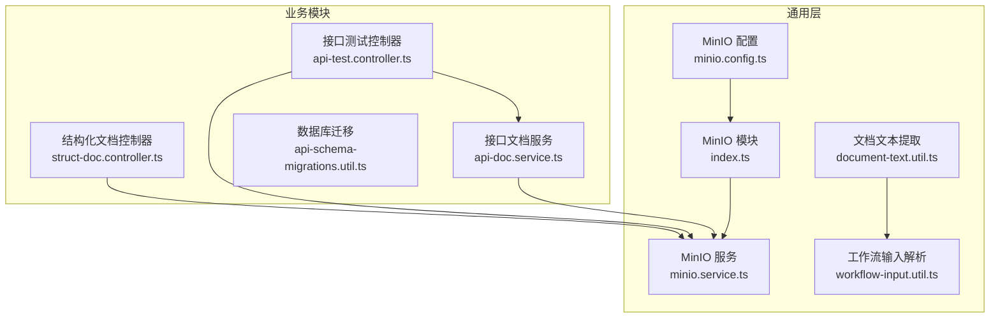
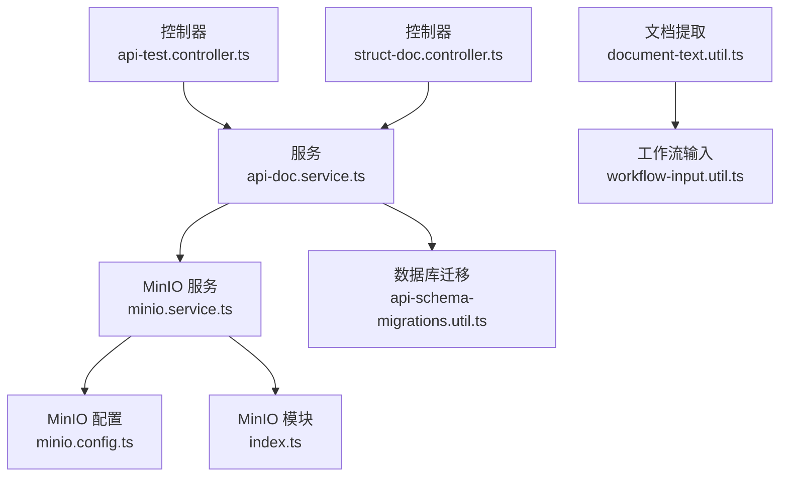
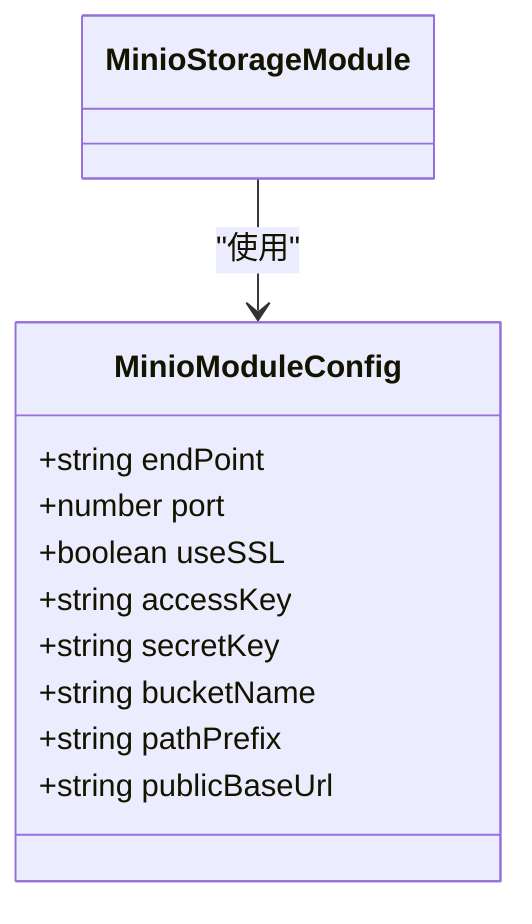
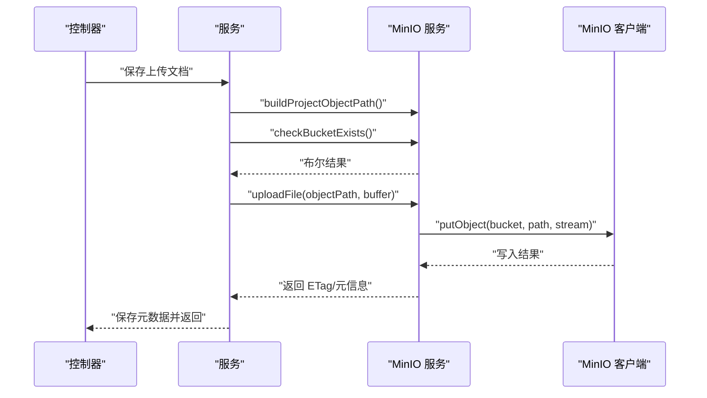
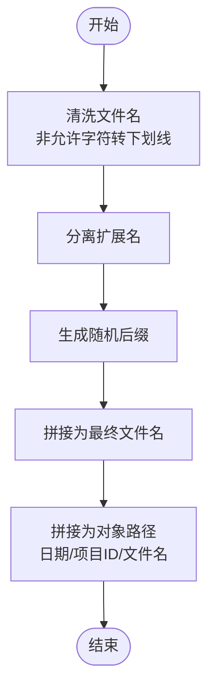
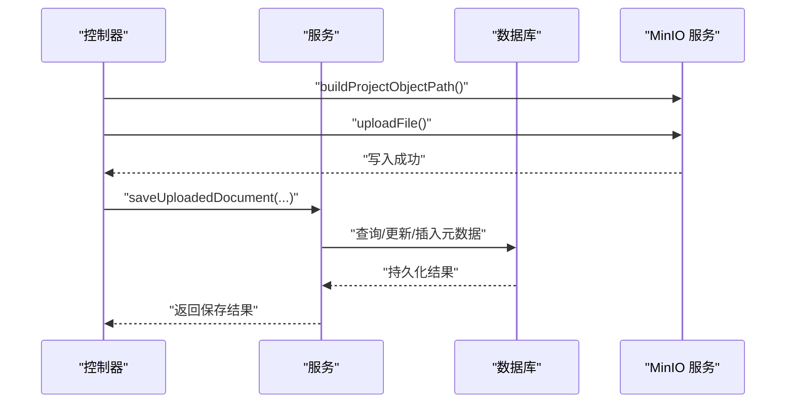
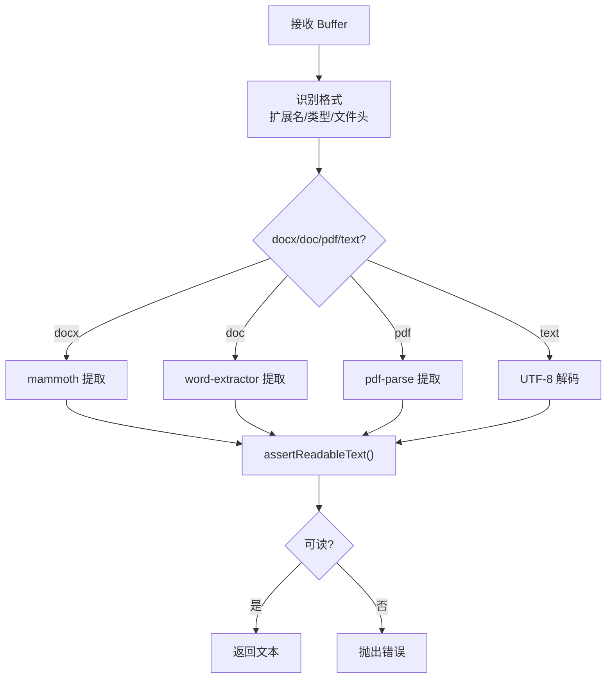
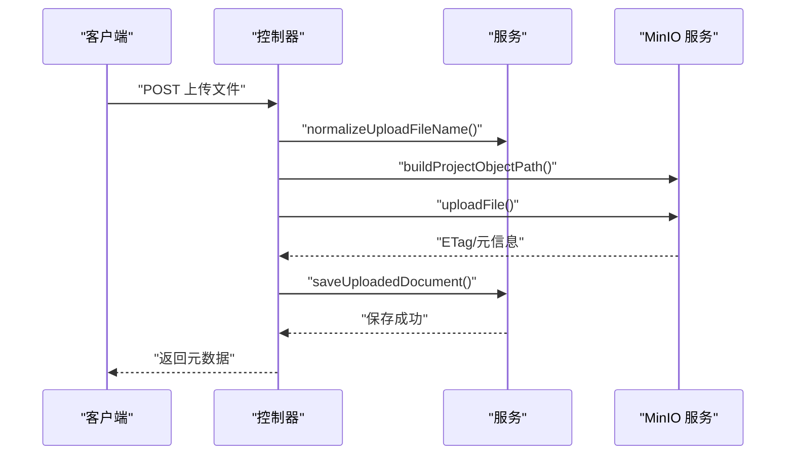
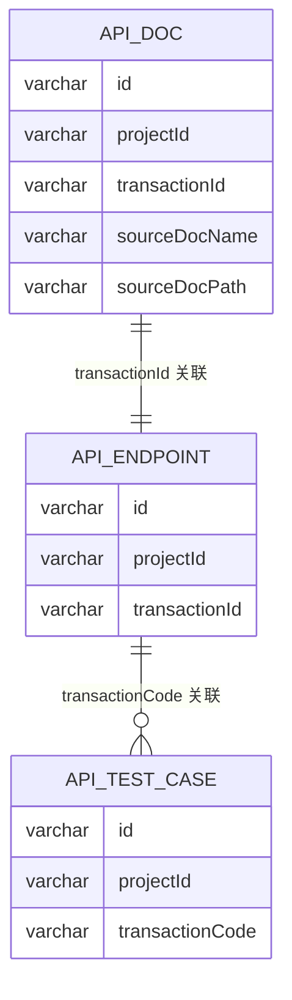
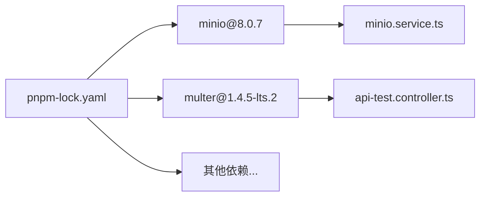

# 存储系统

<cite>
**本文引用的文件**
- [apps/api/src/common/minio/minio.config.ts](file://apps/api/src/common/minio/minio.config.ts)
- [apps/api/src/common/minio/service/minio.service.ts](file://apps/api/src/common/minio/service/minio.service.ts)
- [apps/api/src/common/minio/index.ts](file://apps/api/src/common/minio/index.ts)
- [apps/api/src/common/document/document-text.util.ts](file://apps/api/src/common/document/document-text.util.ts)
- [apps/api/src/common/ai-workflow/util/workflow-input.util.ts](file://apps/api/src/common/ai-workflow/util/workflow-input.util.ts)
- [apps/api/src/modules/api-test/controller/api-test.controller.ts](file://apps/api/src/modules/api-test/controller/api-test.controller.ts)
- [apps/api/src/modules/struct-doc/controller/struct-doc.controller.ts](file://apps/api/src/modules/struct-doc/controller/struct-doc.controller.ts)
- [apps/api/src/modules/api-test/service/api-doc.service.ts](file://apps/api/src/modules/api-test/service/api-doc.service.ts)
- [apps/api/src/common/typeorm/api-schema-migrations.util.ts](file://apps/api/src/common/typeorm/api-schema-migrations.util.ts)
- [pnpm-lock.yaml](file://pnpm-lock.yaml)
</cite>

## 目录
1. [引言](#引言)
2. [项目结构](#项目结构)
3. [核心组件](#核心组件)
4. [架构总览](#架构总览)
5. [组件详解](#组件详解)
6. [依赖关系分析](#依赖关系分析)
7. [性能考量](#性能考量)
8. [故障排查指南](#故障排查指南)
9. [结论](#结论)
10. [附录](#附录)

## 引言
本文件面向存储系统的技术文档，聚焦于 MinIO 对象存储的集成方案与落地实践。内容涵盖配置管理、连接与客户端初始化、安全策略、文件上传下载机制（含多部分上传与断点续传的可行性讨论）、文件命名与路径策略、元数据管理、文件类型识别与内容校验、安全扫描机制现状与建议、存储容量与备份策略、性能监控方案，以及与数据库的集成模式与一致性保障。

## 项目结构
MinIO 存储能力以 NestJS 模块形式提供，核心位于 common/minio 目录，并通过控制器在业务模块中调用。文档解析工具与工作流输入工具对上传文件进行类型识别与内容校验，数据库迁移工具确保相关表结构满足一致性要求。

**图示来源**
- [apps/api/src/common/minio/minio.config.ts:1-38](file://apps/api/src/common/minio/minio.config.ts#L1-L38)
- [apps/api/src/common/minio/service/minio.service.ts:1-129](file://apps/api/src/common/minio/service/minio.service.ts#L1-L129)
- [apps/api/src/common/minio/index.ts:1-17](file://apps/api/src/common/minio/index.ts#L1-L17)
- [apps/api/src/common/document/document-text.util.ts:1-123](file://apps/api/src/common/document/document-text.util.ts#L1-L123)
- [apps/api/src/common/ai-workflow/util/workflow-input.util.ts:1-51](file://apps/api/src/common/ai-workflow/util/workflow-input.util.ts#L1-L51)
- [apps/api/src/modules/api-test/controller/api-test.controller.ts:131-206](file://apps/api/src/modules/api-test/controller/api-test.controller.ts#L131-L206)
- [apps/api/src/modules/struct-doc/controller/struct-doc.controller.ts:35-176](file://apps/api/src/modules/struct-doc/controller/struct-doc.controller.ts#L35-L176)
- [apps/api/src/modules/api-test/service/api-doc.service.ts:30-66](file://apps/api/src/modules/api-test/service/api-doc.service.ts#L30-L66)
- [apps/api/src/common/typeorm/api-schema-migrations.util.ts:1-264](file://apps/api/src/common/typeorm/api-schema-migrations.util.ts#L1-L264)

**章节来源**
- [apps/api/src/common/minio/minio.config.ts:1-38](file://apps/api/src/common/minio/minio.config.ts#L1-L38)
- [apps/api/src/common/minio/service/minio.service.ts:1-129](file://apps/api/src/common/minio/service/minio.service.ts#L1-L129)
- [apps/api/src/common/minio/index.ts:1-17](file://apps/api/src/common/minio/index.ts#L1-L17)
- [apps/api/src/common/document/document-text.util.ts:1-123](file://apps/api/src/common/document/document-text.util.ts#L1-L123)
- [apps/api/src/common/ai-workflow/util/workflow-input.util.ts:1-51](file://apps/api/src/common/ai-workflow/util/workflow-input.util.ts#L1-L51)
- [apps/api/src/modules/api-test/controller/api-test.controller.ts:131-206](file://apps/api/src/modules/api-test/controller/api-test.controller.ts#L131-L206)
- [apps/api/src/modules/struct-doc/controller/struct-doc.controller.ts:35-176](file://apps/api/src/modules/struct-doc/controller/struct-doc.controller.ts#L35-L176)
- [apps/api/src/modules/api-test/service/api-doc.service.ts:30-66](file://apps/api/src/modules/api-test/service/api-doc.service.ts#L30-L66)
- [apps/api/src/common/typeorm/api-schema-migrations.util.ts:1-264](file://apps/api/src/common/typeorm/api-schema-migrations.util.ts#L1-L264)

## 核心组件
- MinIO 配置与注入令牌：定义配置接口与从应用配置构建运行时配置的方法，提供 DI 注入令牌。
- MinIO 存储服务：封装桶检查、上传、预签名 URL 生成、对象读取为 Buffer 等能力。
- MinIO 模块：将配置与服务注册为 NestJS 模块，供业务模块注入使用。
- 文档文本提取工具：根据文件名与 MIME 类型识别格式，解析 doc/docx/pdf/text，输出可读文本并进行基本校验。
- 工作流输入工具：从可访问 URL 拉取文件并解析为纯文本，结合文档提取与校验工具。
- 控制器与服务：在业务控制器中完成文件上传、路径生成、对象写入与元数据落库；服务层负责事务性与一致性保障。
- 数据库迁移工具：确保相关表结构与 UUID 字段字符集一致，建立索引与唯一约束，支撑一致性。

**章节来源**
- [apps/api/src/common/minio/minio.config.ts:1-38](file://apps/api/src/common/minio/minio.config.ts#L1-L38)
- [apps/api/src/common/minio/service/minio.service.ts:1-129](file://apps/api/src/common/minio/service/minio.service.ts#L1-L129)
- [apps/api/src/common/minio/index.ts:1-17](file://apps/api/src/common/minio/index.ts#L1-L17)
- [apps/api/src/common/document/document-text.util.ts:1-123](file://apps/api/src/common/document/document-text.util.ts#L1-L123)
- [apps/api/src/common/ai-workflow/util/workflow-input.util.ts:1-51](file://apps/api/src/common/ai-workflow/util/workflow-input.util.ts#L1-L51)
- [apps/api/src/modules/api-test/controller/api-test.controller.ts:131-206](file://apps/api/src/modules/api-test/controller/api-test.controller.ts#L131-L206)
- [apps/api/src/modules/struct-doc/controller/struct-doc.controller.ts:35-176](file://apps/api/src/modules/struct-doc/controller/struct-doc.controller.ts#L35-L176)
- [apps/api/src/modules/api-test/service/api-doc.service.ts:30-66](file://apps/api/src/modules/api-test/service/api-doc.service.ts#L30-L66)
- [apps/api/src/common/typeorm/api-schema-migrations.util.ts:1-264](file://apps/api/src/common/typeorm/api-schema-migrations.util.ts#L1-L264)

## 架构总览
MinIO 集成采用“配置 + 服务 + 模块”的分层设计，业务控制器通过依赖注入获取 MinIO 服务，完成对象路径生成、上传与访问 URL 生成；文档解析工具贯穿上传后的文本提取与校验；数据库迁移工具保障表结构与索引满足一致性要求。

**图示来源**
- [apps/api/src/modules/api-test/controller/api-test.controller.ts:131-206](file://apps/api/src/modules/api-test/controller/api-test.controller.ts#L131-L206)
- [apps/api/src/modules/struct-doc/controller/struct-doc.controller.ts:35-176](file://apps/api/src/modules/struct-doc/controller/struct-doc.controller.ts#L35-L176)
- [apps/api/src/modules/api-test/service/api-doc.service.ts:30-66](file://apps/api/src/modules/api-test/service/api-doc.service.ts#L30-L66)
- [apps/api/src/common/minio/service/minio.service.ts:1-129](file://apps/api/src/common/minio/service/minio.service.ts#L1-L129)
- [apps/api/src/common/minio/minio.config.ts:1-38](file://apps/api/src/common/minio/minio.config.ts#L1-L38)
- [apps/api/src/common/minio/index.ts:1-17](file://apps/api/src/common/minio/index.ts#L1-L17)
- [apps/api/src/common/typeorm/api-schema-migrations.util.ts:1-264](file://apps/api/src/common/typeorm/api-schema-migrations.util.ts#L1-L264)
- [apps/api/src/common/document/document-text.util.ts:1-123](file://apps/api/src/common/document/document-text.util.ts#L1-L123)
- [apps/api/src/common/ai-workflow/util/workflow-input.util.ts:1-51](file://apps/api/src/common/ai-workflow/util/workflow-input.util.ts#L1-L51)

## 组件详解

### MinIO 配置与模块
- 配置接口包含端点、端口、SSL、凭证、桶名、路径前缀与公共访问基地址。
- 运行时配置从应用配置中读取，构造 MinIO 客户端所需参数。
- 模块通过工厂函数将配置注入容器，并导出配置与服务，便于业务模块注入。

**图示来源**
- [apps/api/src/common/minio/minio.config.ts:10-19](file://apps/api/src/common/minio/minio.config.ts#L10-L19)
- [apps/api/src/common/minio/index.ts:9-16](file://apps/api/src/common/minio/index.ts#L9-L16)

**章节来源**
- [apps/api/src/common/minio/minio.config.ts:1-38](file://apps/api/src/common/minio/minio.config.ts#L1-L38)
- [apps/api/src/common/minio/index.ts:1-17](file://apps/api/src/common/minio/index.ts#L1-L17)

### MinIO 存储服务
- 初始化：基于注入的配置创建 MinIO 客户端，设置默认桶名、路径前缀与公共访问基地址。
- 对象路径生成：按“日期/项目ID/随机后缀文件名”策略生成对象路径，确保同名文件不冲突。
- 上传：先检查桶是否存在，再执行 putObject 写入。
- 访问 URL：通过 presignedGetObject 生成带过期时间的预签名 URL。
- 下载：getObject 返回流，聚合为 Buffer。
- 错误处理：对桶不存在、上传失败等情况记录日志并抛出异常。

**图示来源**
- [apps/api/src/modules/api-test/service/api-doc.service.ts:54-66](file://apps/api/src/modules/api-test/service/api-doc.service.ts#L54-L66)
- [apps/api/src/common/minio/service/minio.service.ts:35-107](file://apps/api/src/common/minio/service/minio.service.ts#L35-L107)

**章节来源**
- [apps/api/src/common/minio/service/minio.service.ts:1-129](file://apps/api/src/common/minio/service/minio.service.ts#L1-L129)

### 文件命名规则与存储路径策略
- 路径策略：日期（YYYYMMDD）/项目ID/原始文件名-随机后缀（扩展名保留）。该策略避免同名冲突并便于按日期归档。
- 文件名清洗：移除非字母数字与常见标点的字符，替换为下划线，保留中文字符。
- 随机后缀：使用随机字符串作为文件名后缀，进一步降低冲突概率。

**图示来源**
- [apps/api/src/common/minio/service/minio.service.ts:40-50](file://apps/api/src/common/minio/service/minio.service.ts#L40-L50)

**章节来源**
- [apps/api/src/common/minio/service/minio.service.ts:35-57](file://apps/api/src/common/minio/service/minio.service.ts#L35-L57)

### 元数据管理
- 控制器在上传完成后调用服务保存元数据（如文件名、对象路径、事务ID等），并在覆盖上传时校验强制标志。
- 服务层在保存前断言交易码归属关系，防止跨项目/跨交易写入。
- 数据库迁移工具确保相关表的 UUID 字段字符集与索引满足一致性要求。

**图示来源**
- [apps/api/src/modules/api-test/controller/api-test.controller.ts:131-162](file://apps/api/src/modules/api-test/controller/api-test.controller.ts#L131-L162)
- [apps/api/src/modules/api-test/service/api-doc.service.ts:54-66](file://apps/api/src/modules/api-test/service/api-doc.service.ts#L54-L66)
- [apps/api/src/common/typeorm/api-schema-migrations.util.ts:69-97](file://apps/api/src/common/typeorm/api-schema-migrations.util.ts#L69-L97)

**章节来源**
- [apps/api/src/modules/api-test/controller/api-test.controller.ts:131-173](file://apps/api/src/modules/api-test/controller/api-test.controller.ts#L131-L173)
- [apps/api/src/modules/api-test/service/api-doc.service.ts:30-66](file://apps/api/src/modules/api-test/service/api-doc.service.ts#L30-L66)
- [apps/api/src/common/typeorm/api-schema-migrations.util.ts:1-264](file://apps/api/src/common/typeorm/api-schema-migrations.util.ts#L1-L264)

### 文件类型识别、内容验证与安全扫描
- 类型识别：根据扩展名、Content-Type 与文件头特征（ZIP/OLE/PDF 标识）判断 doc/docx/pdf/text。
- 内容提取：docx 使用 mammoth，doc 使用 word-extractor，pdf 使用 pdf-parse，其他文本直接解码。
- 可读性校验：去除首尾空白，统计控制字符比例，若超过阈值则判定为不可读并报错。
- 安全扫描：当前仓库未见内置病毒扫描或敏感内容检测实现，建议在上传链路引入第三方扫描服务或在网关层接入安全防护。

**图示来源**
- [apps/api/src/common/document/document-text.util.ts:29-123](file://apps/api/src/common/document/document-text.util.ts#L29-L123)

**章节来源**
- [apps/api/src/common/document/document-text.util.ts:1-123](file://apps/api/src/common/document/document-text.util.ts#L1-L123)
- [apps/api/src/common/ai-workflow/util/workflow-input.util.ts:1-51](file://apps/api/src/common/ai-workflow/util/workflow-input.util.ts#L1-L51)

### 文件上传下载实现机制
- 上传：控制器接收 multipart 文件，生成对象路径并调用 MinIO 服务上传；上传成功后保存元数据。
- 下载：通过预签名 URL 提供临时访问；也可通过 getObject 获取流并聚合为 Buffer。
- 多部分上传与断点续传：当前实现使用 putObject 一次性上传，未见服务端多部分上传/断点续传逻辑；如需大文件高可靠传输，可在 MinIO 侧启用多部分上传并在客户端实现断点续传。

**图示来源**
- [apps/api/src/modules/api-test/controller/api-test.controller.ts:131-173](file://apps/api/src/modules/api-test/controller/api-test.controller.ts#L131-L173)
- [apps/api/src/modules/api-test/service/api-doc.service.ts:54-66](file://apps/api/src/modules/api-test/service/api-doc.service.ts#L54-L66)
- [apps/api/src/common/minio/service/minio.service.ts:82-107](file://apps/api/src/common/minio/service/minio.service.ts#L82-L107)

**章节来源**
- [apps/api/src/modules/api-test/controller/api-test.controller.ts:131-173](file://apps/api/src/modules/api-test/controller/api-test.controller.ts#L131-L173)
- [apps/api/src/common/minio/service/minio.service.ts:64-107](file://apps/api/src/common/minio/service/minio.service.ts#L64-L107)

### 安全策略
- 凭证与网络：配置中包含 accessKey/secretKey 与 useSSL 标记；当前配置中 useSSL 为 false，建议在生产环境启用 SSL。
- 访问控制：通过预签名 URL 控制访问权限与时效；建议结合 IAM 策略与桶策略最小授权原则。
- 输入清洗：控制器对上传文件名进行 Latin1 到 UTF-8 的解码与清洗，减少路径注入风险。
- 内容安全：建议在上传链路增加病毒扫描与敏感内容检测，防止恶意文件进入系统。

**章节来源**
- [apps/api/src/common/minio/minio.config.ts:25-36](file://apps/api/src/common/minio/minio.config.ts#L25-L36)
- [apps/api/src/modules/api-test/controller/api-test.controller.ts:165-173](file://apps/api/src/modules/api-test/controller/api-test.controller.ts#L165-L173)
- [apps/api/src/common/minio/service/minio.service.ts:64-80](file://apps/api/src/common/minio/service/minio.service.ts#L64-L80)

### 与数据库的集成模式与一致性
- 控制器在上传成功后调用服务保存元数据；服务层断言交易码归属，防止跨域写入。
- 数据库迁移工具确保 UUID 字段字符集与索引一致，建立必要索引与唯一约束，提升查询与约束效率。
- 一致性保障：服务层在保存元数据前进行存在性与归属性校验，配合数据库唯一索引与外键约束，降低并发写入冲突。

**图示来源**
- [apps/api/src/common/typeorm/api-schema-migrations.util.ts:69-165](file://apps/api/src/common/typeorm/api-schema-migrations.util.ts#L69-L165)

**章节来源**
- [apps/api/src/modules/api-test/service/api-doc.service.ts:164-183](file://apps/api/src/modules/api-test/service/api-doc.service.ts#L164-L183)
- [apps/api/src/common/typeorm/api-schema-migrations.util.ts:1-264](file://apps/api/src/common/typeorm/api-schema-migrations.util.ts#L1-L264)

## 依赖关系分析
- MinIO 客户端版本：仓库锁定为 8.0.7，包含异步、流式处理与 XML 解析等依赖。
- 上传中间件：multer 在 v1 中存在多个漏洞，建议升级到 v2 以获得更好的安全性与稳定性。
- 模块耦合：控制器依赖服务，服务依赖 MinIO 服务与数据库仓储；MinIO 服务依赖配置模块。

**图示来源**
- [pnpm-lock.yaml:5536-5551](file://pnpm-lock.yaml#L5536-L5551)
- [apps/api/src/common/minio/service/minio.service.ts:1-129](file://apps/api/src/common/minio/service/minio.service.ts#L1-L129)
- [apps/api/src/modules/api-test/controller/api-test.controller.ts:131-173](file://apps/api/src/modules/api-test/controller/api-test.controller.ts#L131-L173)

**章节来源**
- [pnpm-lock.yaml:5536-5551](file://pnpm-lock.yaml#L5536-L5551)
- [apps/api/src/common/minio/service/minio.service.ts:1-129](file://apps/api/src/common/minio/service/minio.service.ts#L1-L129)
- [apps/api/src/modules/api-test/controller/api-test.controller.ts:131-173](file://apps/api/src/modules/api-test/controller/api-test.controller.ts#L131-L173)

## 性能考量
- 连接与客户端：当前实现为单实例客户端，建议在生产环境考虑连接池复用与超时配置。
- 上传性能：对于大文件，建议启用 MinIO 多部分上传与断点续传；前端实现分片与并发上传。
- 缓存与 CDN：对热点文件生成预签名 URL 并结合 CDN 加速静态资源访问。
- 日志与监控：对上传耗时、失败率与桶容量进行指标埋点，结合告警系统及时发现异常。

## 故障排查指南
- 桶不存在：上传前检查桶存在性，若不存在请先创建桶。
- 上传失败：查看日志中的错误信息，确认网络连通性与凭证正确性。
- 预签名 URL 失败：检查对象路径是否正确、过期时间是否合理。
- 文档解析失败：确认文件格式与 Content-Type，检查文件头特征识别逻辑。
- 数据库一致性问题：检查迁移脚本是否执行、索引与唯一约束是否生效。

**章节来源**
- [apps/api/src/common/minio/service/minio.service.ts:92-106](file://apps/api/src/common/minio/service/minio.service.ts#L92-L106)
- [apps/api/src/common/document/document-text.util.ts:108-123](file://apps/api/src/common/document/document-text.util.ts#L108-L123)
- [apps/api/src/common/typeorm/api-schema-migrations.util.ts:1-264](file://apps/api/src/common/typeorm/api-schema-migrations.util.ts#L1-L264)

## 结论
本存储系统以 MinIO 为核心，结合控制器与服务层实现了从文件上传、路径生成、访问控制到元数据落库的完整闭环。通过文档提取与可读性校验，提升了内容可用性；数据库迁移工具保障了结构一致性。建议在生产环境中启用 SSL、引入病毒扫描与敏感内容检测，并在大文件场景下启用多部分上传与断点续传，以进一步提升安全性与可靠性。

## 附录
- 最佳实践清单
  - 启用 SSL 与最小权限 IAM 策略
  - 对上传文件进行类型识别与内容校验
  - 在上传链路引入病毒扫描与敏感内容检测
  - 大文件采用多部分上传与断点续传
  - 对热点资源使用预签名 URL + CDN
  - 建立容量与性能指标监控与告警