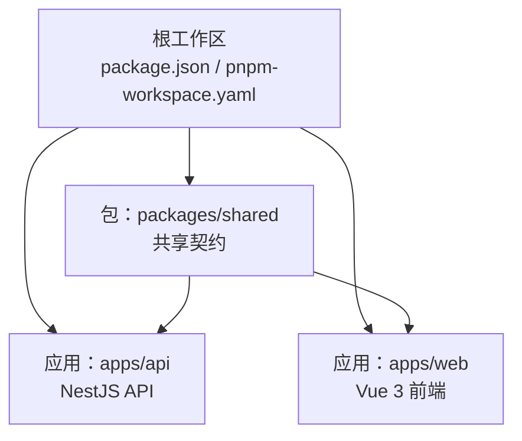
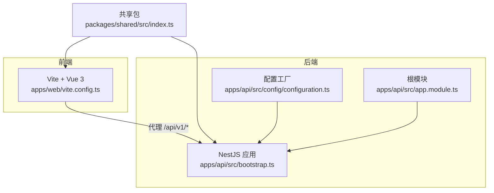
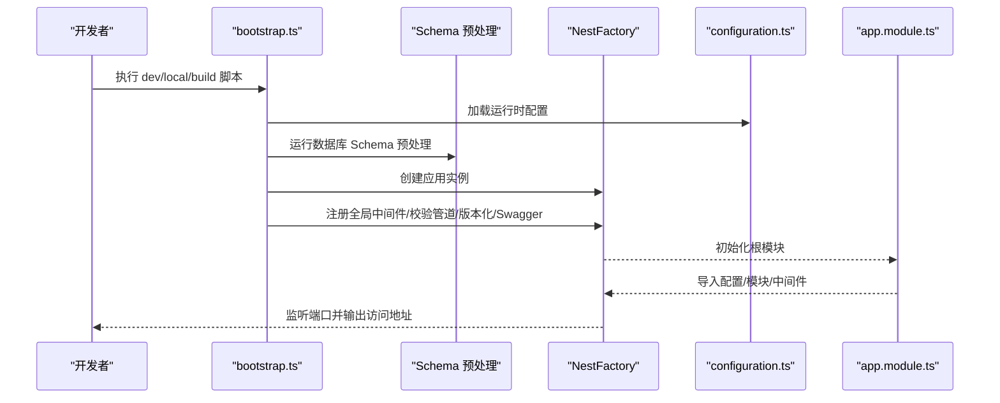
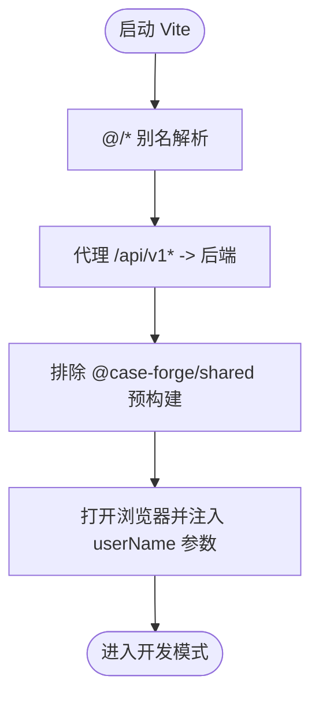
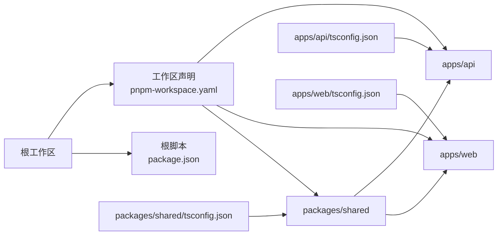

# 开发者指南

<cite>
**本文引用的文件**
- [package.json](file://package.json)
- [pnpm-workspace.yaml](file://pnpm-workspace.yaml)
- [apps/api/package.json](file://apps/api/package.json)
- [apps/web/package.json](file://apps/web/package.json)
- [packages/shared/package.json](file://packages/shared/package.json)
- [apps/api/tsconfig.json](file://apps/api/tsconfig.json)
- [apps/web/tsconfig.json](file://apps/web/tsconfig.json)
- [packages/shared/tsconfig.json](file://packages/shared/tsconfig.json)
- [apps/api/nest-cli.json](file://apps/api/nest-cli.json)
- [apps/web/vite.config.ts](file://apps/web/vite.config.ts)
- [apps/api/src/config/configuration.ts](file://apps/api/src/config/configuration.ts)
- [apps/api/src/config/app-config.types.ts](file://apps/api/src/config/app-config.types.ts)
- [packages/shared/src/index.ts](file://packages/shared/src/index.ts)
- [apps/api/src/app.module.ts](file://apps/api/src/app.module.ts)
- [apps/api/src/bootstrap.ts](file://apps/api/src/bootstrap.ts)
</cite>

## 目录
1. [简介](#简介)
2. [项目结构](#项目结构)
3. [核心组件](#核心组件)
4. [架构总览](#架构总览)
5. [详细组件分析](#详细组件分析)
6. [依赖关系分析](#依赖关系分析)
7. [性能考虑](#性能考虑)
8. [故障排查指南](#故障排查指南)
9. [结论](#结论)
10. [附录](#附录)

## 简介
本指南面向 CaseForge 项目的开发者，系统性介绍代码规范、提交规范与代码审查流程，明确开发约定、命名规范与文件组织结构，阐述贡献流程（Fork、分支管理、Pull Request、合并策略），并提供开发工具配置、IDE 设置与调试技巧。同时给出新功能开发的指导流程与最佳实践，说明共享包的使用与扩展方式，并总结常见开发问题的解决方案与经验。

## 项目结构
CaseForge 采用 monorepo 结构，根目录通过工作区声明管理多个子包与应用：
- apps/api：基于 NestJS 的后端 API 应用
- apps/web：基于 Vue 3 + Vite 的前端应用
- packages/shared：共享 TypeScript 类型与契约
- 其他根级脚本与工作区配置统一管理

图表来源
- [package.json:1-22](file://package.json#L1-L22)
- [pnpm-workspace.yaml:1-4](file://pnpm-workspace.yaml#L1-L4)

章节来源
- [package.json:1-22](file://package.json#L1-L22)
- [pnpm-workspace.yaml:1-4](file://pnpm-workspace.yaml#L1-L4)

## 核心组件
- 根工作区与脚本：统一管理开发、构建、类型检查与 Lint 脚本，指定 Node 版本要求与包管理器版本。
- 应用与包的独立配置：每个应用与包拥有独立的 package.json、tsconfig 与构建/开发脚本。
- 共享包：集中导出跨应用使用的类型、工具与常量，便于前后端一致性与复用。

章节来源
- [package.json:7-13](file://package.json#L7-L13)
- [apps/api/package.json:7-20](file://apps/api/package.json#L7-L20)
- [apps/web/package.json:6-14](file://apps/web/package.json#L6-L14)
- [packages/shared/package.json:16-20](file://packages/shared/package.json#L16-L20)

## 架构总览
整体架构由前端 Web 应用与后端 API 应用组成，二者通过本地代理进行联调；共享包提供跨应用的类型与契约支撑。

图表来源
- [apps/web/vite.config.ts:38-71](file://apps/web/vite.config.ts#L38-L71)
- [apps/api/src/bootstrap.ts:18-64](file://apps/api/src/bootstrap.ts#L18-L64)
- [apps/api/src/config/configuration.ts:1-49](file://apps/api/src/config/configuration.ts#L1-L49)
- [apps/api/src/app.module.ts:21-47](file://apps/api/src/app.module.ts#L21-L47)
- [packages/shared/src/index.ts:1-161](file://packages/shared/src/index.ts#L1-L161)

## 详细组件分析

### 后端应用（NestJS）
- 启动入口：负责加载环境、执行数据库 Schema 预处理、创建 Nest 应用、设置全局中间件与校验管道、启用 URI 版本化、注册 Swagger 文档、绑定监听端口。
- 根模块：集中导入配置、基础设施（TypeORM、MinIO、AI 工作流）、审计与日志中间件，以及各业务模块。
- 配置体系：通过 ConfigModule 加载配置工厂与多环境 .env 文件，集中管理数据库、MinIO、AI 工作流等配置项。

图表来源
- [apps/api/src/bootstrap.ts:18-64](file://apps/api/src/bootstrap.ts#L18-L64)
- [apps/api/src/config/configuration.ts:1-49](file://apps/api/src/config/configuration.ts#L1-L49)
- [apps/api/src/app.module.ts:21-47](file://apps/api/src/app.module.ts#L21-L47)

章节来源
- [apps/api/src/bootstrap.ts:18-64](file://apps/api/src/bootstrap.ts#L18-L64)
- [apps/api/src/app.module.ts:21-47](file://apps/api/src/app.module.ts#L21-L47)
- [apps/api/src/config/configuration.ts:1-49](file://apps/api/src/config/configuration.ts#L1-L49)

### 前端应用（Vue 3 + Vite）
- 本地开发：通过 Vite 提供热更新与代理，自动注入用户上下文参数，代理后端 API 到固定端口。
- 依赖优化：对工作区内共享包进行排除与延迟解析，避免预构建缓存导致的白屏问题。
- 路径别名：统一 @/* 指向 src，便于模块导入与路径管理。

图表来源
- [apps/web/vite.config.ts:38-71](file://apps/web/vite.config.ts#L38-L71)

章节来源
- [apps/web/vite.config.ts:38-71](file://apps/web/vite.config.ts#L38-L71)

### 共享包（packages/shared）
- 统一契约：集中导出场景标签、测试维度、分组策略、案例树节点类型、项目与生成运行数据模型等类型与工具。
- 复用与一致性：前后端共享同一份类型定义，减少耦合与不一致风险。

章节来源
- [packages/shared/src/index.ts:1-161](file://packages/shared/src/index.ts#L1-L161)

## 依赖关系分析
- 工作区：根工作区通过 pnpm-workspace.yaml 声明 apps/* 与 packages/*，实现包间相互引用与统一管理。
- 包内依赖：各应用与包各自维护独立的依赖与脚本；共享包被应用以 workspace:* 方式引用。
- 路径映射：TS 配置中为后端与前端分别配置了路径别名，提升可读性与可维护性。

图表来源
- [pnpm-workspace.yaml:1-4](file://pnpm-workspace.yaml#L1-L4)
- [package.json:7-13](file://package.json#L7-L13)
- [apps/api/tsconfig.json:18-29](file://apps/api/tsconfig.json#L18-L29)
- [apps/web/tsconfig.json:16-18](file://apps/web/tsconfig.json#L16-L18)
- [packages/shared/tsconfig.json:2-12](file://packages/shared/tsconfig.json#L2-L12)

章节来源
- [pnpm-workspace.yaml:1-4](file://pnpm-workspace.yaml#L1-L4)
- [apps/api/tsconfig.json:18-29](file://apps/api/tsconfig.json#L18-L29)
- [apps/web/tsconfig.json:16-18](file://apps/web/tsconfig.json#L16-L18)
- [packages/shared/tsconfig.json:2-12](file://packages/shared/tsconfig.json#L2-L12)

## 性能考虑
- 后端请求体大小限制：在启动入口中设置 JSON/URL 编码请求体上限，避免大体积上传导致内存压力。
- 前端预构建优化：排除工作区内共享包，防止缓存不一致引发的白屏问题；开启延迟解析以避免临时文件清理导致的错误。
- 数据库 Schema 预处理：在启动阶段执行 Schema 预处理，确保数据库结构与应用期望一致，减少运行期异常。

章节来源
- [apps/api/src/bootstrap.ts:33-35](file://apps/api/src/bootstrap.ts#L33-L35)
- [apps/web/vite.config.ts:48-53](file://apps/web/vite.config.ts#L48-L53)
- [apps/api/src/bootstrap.ts:19](file://apps/api/src/bootstrap.ts#L19)

## 故障排查指南
- 启动失败或端口占用
  - 检查后端监听端口是否被占用，必要时调整环境变量中的端口值。
  - 确认前端代理目标端口与后端实际监听端口一致。
- 前端白屏或模块解析错误
  - 清理 Vite 缓存后重试；确认已排除共享包参与预构建。
  - 检查路径别名配置是否正确。
- 数据库连接异常
  - 校验 TYPEORM_* 系列环境变量是否完整且正确。
  - 如需索引或迁移，请按脚本提示执行相应 SQL。
- AI 工作流或 MinIO 访问异常
  - 校验 AI 与 MinIO 对应的环境变量是否配置完整。
- 类型检查或 Lint 报错
  - 使用根脚本统一执行 typecheck/lint，定位问题后再逐个修复。

章节来源
- [apps/api/src/bootstrap.ts:58-60](file://apps/api/src/bootstrap.ts#L58-L60)
- [apps/web/vite.config.ts:59-68](file://apps/web/vite.config.ts#L59-L68)
- [apps/api/src/config/configuration.ts:10-34](file://apps/api/src/config/configuration.ts#L10-L34)
- [apps/api/package.json:18-19](file://apps/api/package.json#L18-L19)

## 结论
本指南提供了 CaseForge 项目的开发约定、工具链配置与协作流程建议。遵循本文的规范与流程，可显著提升开发效率与代码质量，降低集成与维护成本。建议团队在日常协作中严格执行脚本化与标准化流程，持续完善文档与自动化工具。

## 附录

### 代码规范与提交规范
- 统一使用 pnpm 管理依赖与脚本，确保团队环境一致。
- 使用根脚本统一执行开发、构建、类型检查与 Lint，避免跨应用差异。
- 提交前务必执行 typecheck 与 lint，保证类型安全与风格一致。
- 提交信息建议采用清晰的类型前缀（如 feat/fix/docs/chore），并简述变更内容与影响范围。

章节来源
- [package.json:7-13](file://package.json#L7-L13)
- [apps/api/package.json:12-13](file://apps/api/package.json#L12-L13)
- [apps/web/package.json:10-11](file://apps/web/package.json#L10-L11)

### 代码审查流程
- 分支策略：采用功能分支（feature/*）、修复分支（fix/*）与热修复分支（hotfix/*）。
- Pull Request：PR 描述需包含变更动机、改动范围、测试验证与注意事项；至少一名维护者审查通过后方可合并。
- 审查重点：代码可读性、边界条件、错误处理、性能与安全性、类型安全与 Lint 规范。

### 新功能开发指导流程
- 需求评审：明确需求背景、验收标准与影响面。
- 设计与建模：在共享包中补充必要的类型与契约，保持前后端一致。
- 开发与自测：遵循统一脚本与规范，完成单元与集成测试。
- 文档与演示：补充必要的注释与文档，准备演示与回归测试清单。
- 提交与合并：创建 PR 并完成审查，合并至主干后进行后续发布与验证。

### 共享包使用与扩展
- 使用方式：在应用中以 workspace:* 引用共享包，确保类型与工具可用。
- 扩展原则：新增类型与工具需保持向后兼容，避免破坏既有契约；变更前先评估影响范围并更新相关应用。

章节来源
- [packages/shared/package.json:8-14](file://packages/shared/package.json#L8-L14)
- [apps/api/package.json:22](file://apps/api/package.json#L22)
- [apps/web/package.json:17](file://apps/web/package.json#L17)

### 开发工具配置与 IDE 设置
- Node 版本：确保 Node 版本满足根脚本要求。
- VSCode 推荐插件：TypeScript TSServer、ESLint、Prettier、Vue Language Features、EditorConfig。
- 路径别名：在 IDE 中配置 TS 路径映射，提升跳转与补全体验。
- 前端代理：在 IDE 中配置本地代理规则，确保与 Vite 配置一致。

章节来源
- [package.json:15-17](file://package.json#L15-L17)
- [apps/api/tsconfig.json:18-29](file://apps/api/tsconfig.json#L18-L29)
- [apps/web/tsconfig.json:16-18](file://apps/web/tsconfig.json#L16-L18)
- [apps/web/vite.config.ts:59-68](file://apps/web/vite.config.ts#L59-L68)