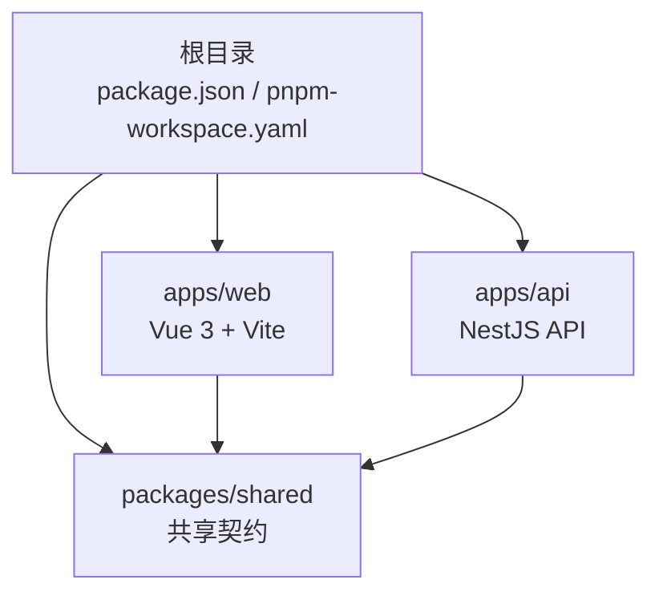
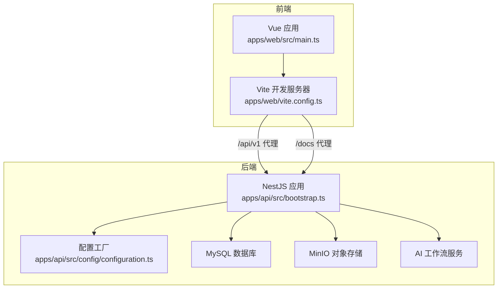
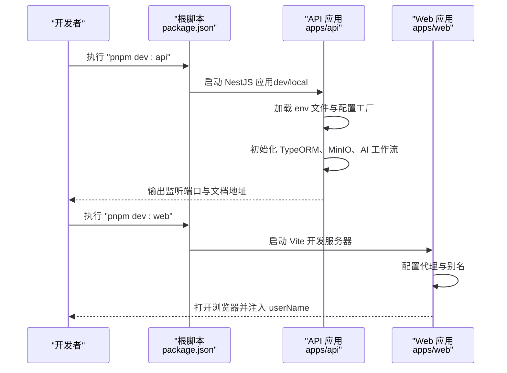
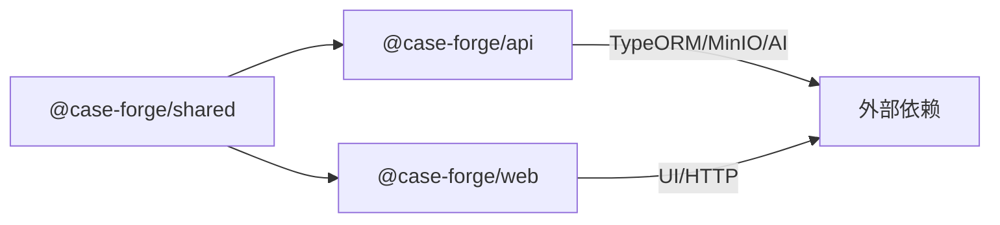

# 快速开始

<cite>
**本文引用的文件**
- [package.json](file://package.json)
- [pnpm-workspace.yaml](file://pnpm-workspace.yaml)
- [apps/api/package.json](file://apps/api/package.json)
- [apps/web/package.json](file://apps/web/package.json)
- [apps/api/src/config/configuration.ts](file://apps/api/src/config/configuration.ts)
- [apps/api/src/config/app-config.types.ts](file://apps/api/src/config/app-config.types.ts)
- [apps/api/src/config/load-env.ts](file://apps/api/src/config/load-env.ts)
- [apps/api/src/bootstrap.ts](file://apps/api/src/bootstrap.ts)
- [apps/api/src/app.module.ts](file://apps/api/src/app.module.ts)
- [apps/web/vite.config.ts](file://apps/web/vite.config.ts)
- [apps/web/src/main.ts](file://apps/web/src/main.ts)
- [packages/shared/package.json](file://packages/shared/package.json)
</cite>

## 目录
1. [简介](#简介)
2. [项目结构](#项目结构)
3. [核心组件](#核心组件)
4. [架构总览](#架构总览)
5. [详细组件分析](#详细组件分析)
6. [依赖分析](#依赖分析)
7. [性能考虑](#性能考虑)
8. [故障排除指南](#故障排除指南)
9. [结论](#结论)
10. [附录](#附录)

## 简介
本指南面向新加入的开发者，帮助你在 30 分钟内完成 CaseForge 项目的本地环境搭建与首次运行。你将学到：
- 环境要求（Node.js >= 20、pnpm）
- 依赖安装与工作区配置
- API 与 Web 应用的启动方式
- 关键配置项（数据库、MinIO、AI 工作流）
- 常用开发命令与调试技巧

## 项目结构
CaseForge 是一个基于 pnpm workspaces 的 monorepo，包含以下主要部分：
- apps/api：基于 NestJS 的后端 API 服务
- apps/web：基于 Vue 3 + Vite 的前端应用
- packages/shared：共享的 TypeScript 类型与契约
- 根目录脚本与引擎声明：统一管理开发命令与 Node 版本要求

图表来源
- [pnpm-workspace.yaml:1-4](file://pnpm-workspace.yaml#L1-L4)
- [apps/api/package.json:1-62](file://apps/api/package.json#L1-L62)
- [apps/web/package.json:1-36](file://apps/web/package.json#L1-L36)
- [packages/shared/package.json:1-25](file://packages/shared/package.json#L1-L25)

章节来源
- [pnpm-workspace.yaml:1-4](file://pnpm-workspace.yaml#L1-L4)
- [package.json:1-22](file://package.json#L1-L22)

## 核心组件
- 后端 API（NestJS）
  - 启动入口负责加载环境变量、迁移前置 Schema、注册全局中间件与校验管道，并启用 Swagger 文档。
  - 配置模块通过工厂函数从环境变量读取数据库、MinIO、AI 工作流等参数。
- 前端 Web（Vue 3 + Vite）
  - 开发服务器默认代理 /api/v1 与 /docs 到后端，便于联调。
  - 通过别名指向共享包，保证前后端类型一致性。
- 共享包（shared）
  - 提供跨应用的类型与契约，构建后供 API/Web 使用。

章节来源
- [apps/api/src/bootstrap.ts:1-64](file://apps/api/src/bootstrap.ts#L1-L64)
- [apps/api/src/config/configuration.ts:1-48](file://apps/api/src/config/configuration.ts#L1-L48)
- [apps/web/vite.config.ts:1-71](file://apps/web/vite.config.ts#L1-L71)
- [packages/shared/package.json:1-25](file://packages/shared/package.json#L1-L25)

## 架构总览
下图展示了本地开发时的典型交互：前端通过 Vite 代理访问后端 API，后端从环境变量加载配置并连接数据库与 MinIO，同时可选地对接 AI 工作流服务。

图表来源
- [apps/web/vite.config.ts:54-71](file://apps/web/vite.config.ts#L54-L71)
- [apps/api/src/bootstrap.ts:18-64](file://apps/api/src/bootstrap.ts#L18-L64)
- [apps/api/src/config/configuration.ts:10-47](file://apps/api/src/config/configuration.ts#L10-L47)

## 详细组件分析

### 环境准备与依赖安装
- Node.js 版本要求：根脚本声明 Node >= 20。
- 包管理器：推荐使用 pnpm，版本由根 package.json 的 engines 字段与 packageManager 字段约束。
- 安装步骤
  - 安装 pnpm（参考官方文档或包管理器）
  - 在仓库根目录执行安装：pnpm install
  - 安装完成后，工作区内的 API/Web/Shared 将按需构建与链接

章节来源
- [package.json:15-17](file://package.json#L15-L17)
- [package.json:6](file://package.json#L6)

### 配置文件与环境变量
- 配置加载位置
  - 后端通过 ConfigModule 加载配置工厂，并从多个候选 env 文件中读取（按优先级顺序）。
  - 前端通过 Vite 配置进行代理与别名解析。
- 关键配置项（后端）
  - 数据库（TypeORM）：主机、端口、用户名、密码、数据库名（含测试库）
  - MinIO：主机、端口、访问密钥、私有密钥、桶名、路径前缀、公开访问基础 URL
  - AI 工作流：需求文档技能接口、案例文档提升接口、AI Chat 服务的地址、模型、API Key、重试次数
- 环境文件加载策略
  - 支持按 NODE_ENV 选择 .{env}.env、.development.env 或根目录 .env；仅加载首个存在的文件且不会覆盖已存在的环境变量

章节来源
- [apps/api/src/config/configuration.ts:7-47](file://apps/api/src/config/configuration.ts#L7-L47)
- [apps/api/src/config/app-config.types.ts:6-43](file://apps/api/src/config/app-config.types.ts#L6-L43)
- [apps/api/src/config/load-env.ts:13-36](file://apps/api/src/config/load-env.ts#L13-L36)
- [apps/api/src/app.module.ts:23-27](file://apps/api/src/app.module.ts#L23-L27)

### 启动 API 与 Web 应用
- 启动顺序建议
  - 先启动后端 API，再启动前端 Web，以确保代理能正确转发请求
- 常用命令
  - 根目录命令
    - 开发模式（API）：pnpm dev:api
    - 本地模式（API）：pnpm local:api
    - 开发模式（Web）：pnpm dev:web
    - 批量构建：pnpm build
    - 批量 Lint：pnpm lint
    - 批量类型检查：pnpm typecheck
  - API 应用内部命令
    - 开发/本地启动：dev/local
    - 构建：build
    - 种子数据：seed:demo、seed:api-test
    - 数据库索引与平台列提示：db:indexes、db:platform
  - Web 应用内部命令
    - 开发：dev
    - 清理缓存后开发：dev:clean
    - 构建：build
    - 预览：preview

章节来源
- [package.json:7-14](file://package.json#L7-L14)
- [apps/api/package.json:7-19](file://apps/api/package.json#L7-L19)
- [apps/web/package.json:6-14](file://apps/web/package.json#L6-L14)

### 开发环境启动流程（30 分钟落地法）
- 步骤 1：安装 pnpm 并在根目录执行安装
- 步骤 2：准备后端环境文件
  - 在 apps/api/env 下创建对应 NODE_ENV 的 .env 文件（例如 .development.env 或 .local.env），按需填写数据库、MinIO、AI 工作流相关字段
  - 若未提供，后端将使用 configuration.ts 中的默认值
- 步骤 3：启动后端 API
  - 在根目录执行：pnpm dev:api 或 pnpm local:api
  - 观察控制台输出的监听端口与 Swagger 文档地址
- 步骤 4：启动前端 Web
  - 在根目录执行：pnpm dev:web
  - 浏览器打开 Vite 默认地址，自动注入 userName 参数
- 步骤 5：验证联调
  - 访问 /docs 查看 Swagger 文档
  - 访问 /api/v1 接口（需携带 userName 路径前缀）

图表来源
- [package.json:7-14](file://package.json#L7-L14)
- [apps/api/src/bootstrap.ts:18-64](file://apps/api/src/bootstrap.ts#L18-L64)
- [apps/web/vite.config.ts:54-71](file://apps/web/vite.config.ts#L54-L71)

## 依赖分析
- 工作区范围
  - pnpm-workspace.yaml 指定 apps/* 与 packages/* 为工作区包
- 包间关系
  - apps/api 依赖 @case-forge/shared
  - apps/web 依赖 @case-forge/shared
  - packages/shared 为纯构建产物，供其他应用消费
- 外部依赖要点
  - API：NestJS、TypeORM、MinIO SDK、MySQL2、Swagger 等
  - Web：Vue 3、Ant Design Vue、Axios、Pinia、Vue Router 等

图表来源
- [pnpm-workspace.yaml:1-4](file://pnpm-workspace.yaml#L1-L4)
- [apps/api/package.json:20-47](file://apps/api/package.json#L20-L47)
- [apps/web/package.json:15-27](file://apps/web/package.json#L15-L27)
- [packages/shared/package.json:1-25](file://packages/shared/package.json#L1-L25)

章节来源
- [pnpm-workspace.yaml:1-4](file://pnpm-workspace.yaml#L1-L4)
- [apps/api/package.json:20-47](file://apps/api/package.json#L20-L47)
- [apps/web/package.json:15-27](file://apps/web/package.json#L15-L27)
- [packages/shared/package.json:1-25](file://packages/shared/package.json#L1-L25)

## 性能考虑
- 依赖预构建与热更新
  - Web 应用通过 Vite 优化依赖，避免对工作区内共享包进行预构建，减少热重启时的临时文件冲突
- 请求体大小限制
  - API 启动时设置了较大的 JSON/URL 编码请求体限制，适合上传大体积文档或批量数据
- 代理与端口
  - 前端代理仅转发真实 API 路径，避免前端路由被错误转发，提高联调效率

章节来源
- [apps/web/vite.config.ts:48-53](file://apps/web/vite.config.ts#L48-L53)
- [apps/api/src/bootstrap.ts:33-35](file://apps/api/src/bootstrap.ts#L33-L35)
- [apps/web/vite.config.ts:59-68](file://apps/web/vite.config.ts#L59-L68)

## 故障排除指南
- Node 版本不满足要求
  - 症状：安装或运行时报错
  - 处理：升级 Node 至 >= 20，并确保 pnpm 使用受支持的版本
- pnpm 安装失败或依赖缺失
  - 症状：报错找不到模块或安装中断
  - 处理：删除锁文件与 node_modules 后重新安装；确认网络可访问上游镜像
- 环境变量未生效
  - 症状：数据库或 MinIO 连接失败
  - 处理：检查 apps/api/env 下是否存在对应 .{env}.env；确认未被已有进程变量覆盖
- Swagger 文档无法访问
  - 症状：/docs 返回 404
  - 处理：确认 API 已启动并监听端口；检查全局前缀与版本化配置
- 前端代理无效
  - 症状：页面请求 404 或跨域
  - 处理：确认 /api/v1 与 /docs 代理目标地址与端口；检查 Vite 代理规则
- 本地用户上下文
  - 症状：登录态或用户上下文异常
  - 处理：确认 Vite 开发服务器打印的 URL 已包含 userName 参数；必要时手动设置

章节来源
- [package.json:15-17](file://package.json#L15-L17)
- [apps/api/src/config/load-env.ts:32-54](file://apps/api/src/config/load-env.ts#L32-L54)
- [apps/api/src/bootstrap.ts:50-56](file://apps/api/src/bootstrap.ts#L50-L56)
- [apps/web/vite.config.ts:59-68](file://apps/web/vite.config.ts#L59-L68)
- [apps/web/src/main.ts:16](file://apps/web/src/main.ts#L16)

## 结论
按照本指南，你可以在 30 分钟内完成 CaseForge 的环境准备、配置与启动。建议先完成环境变量配置与数据库/MiNIO连通性验证，再进行功能联调。后续可结合常用命令与代理规则提升开发效率。

## 附录

### 常用开发命令清单
- 根目录
  - pnpm dev:api：启动后端 API（开发模式）
  - pnpm local:api：启动后端 API（本地模式）
  - pnpm dev:web：启动前端 Web（开发模式）
  - pnpm build：批量构建所有应用
  - pnpm lint：批量 Lint
  - pnpm typecheck：批量类型检查
- API 应用
  - pnpm dev/local：开发/本地启动
  - pnpm build：构建
  - pnpm seed:demo / seed:api-test：导入演示数据
  - pnpm db:indexes / db:platform：数据库补丁提示
- Web 应用
  - pnpm dev：开发
  - pnpm dev:clean：清理缓存后开发
  - pnpm build：构建
  - pnpm preview：本地预览

章节来源
- [package.json:7-14](file://package.json#L7-L14)
- [apps/api/package.json:7-19](file://apps/api/package.json#L7-L19)
- [apps/web/package.json:6-14](file://apps/web/package.json#L6-L14)