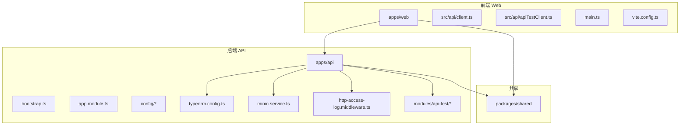
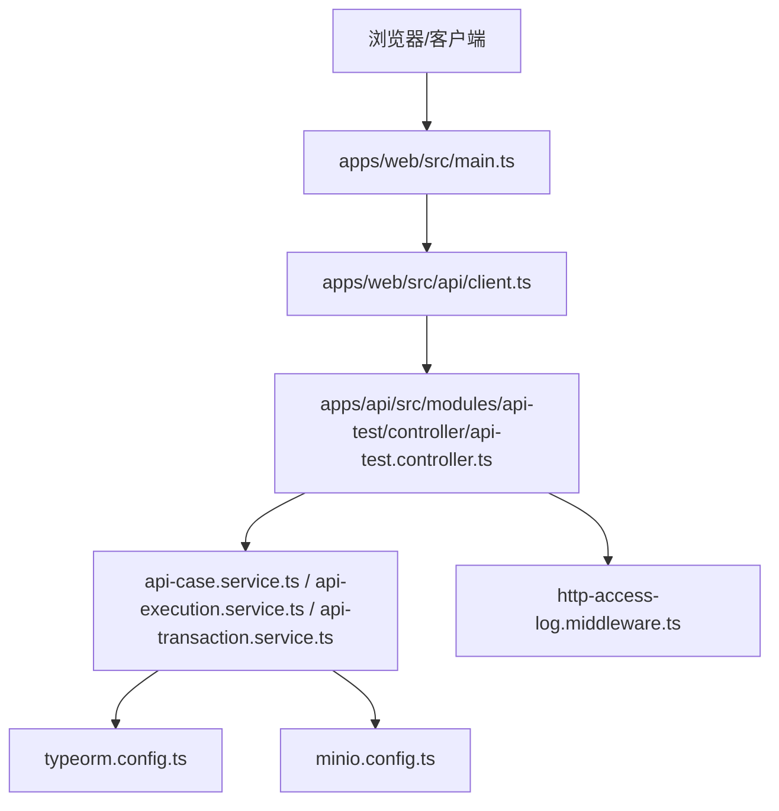
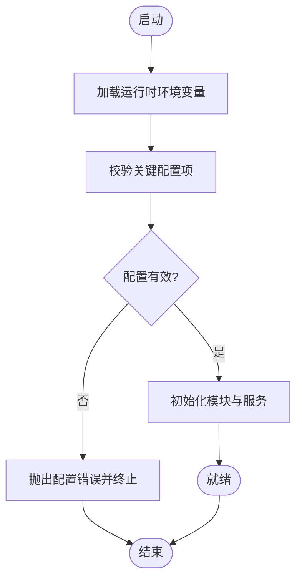
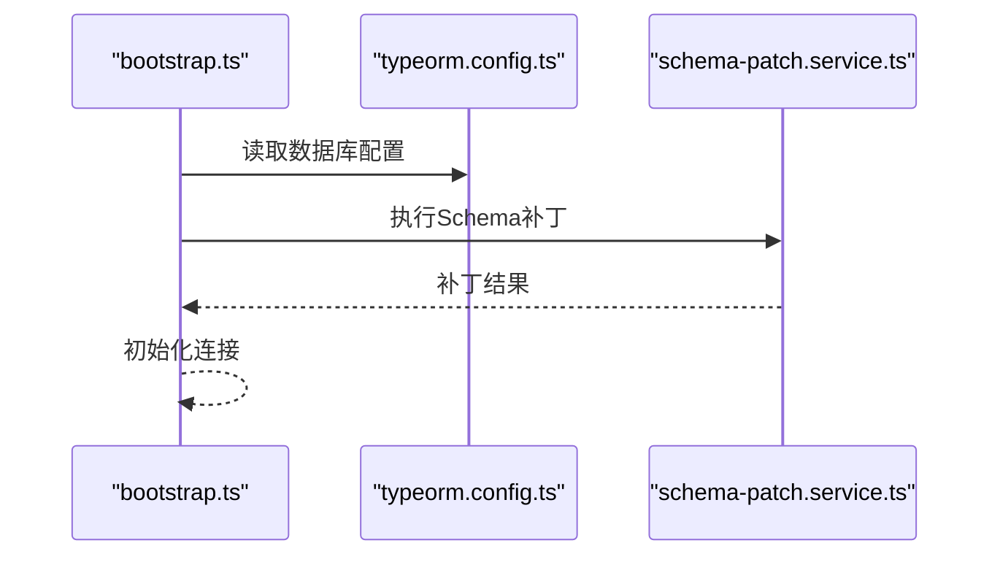
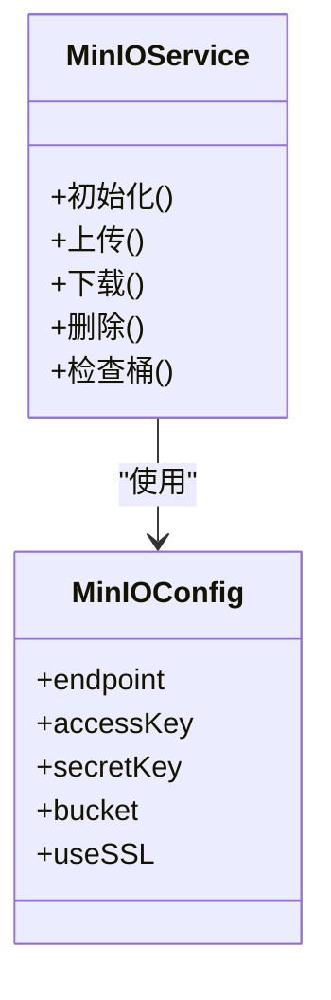
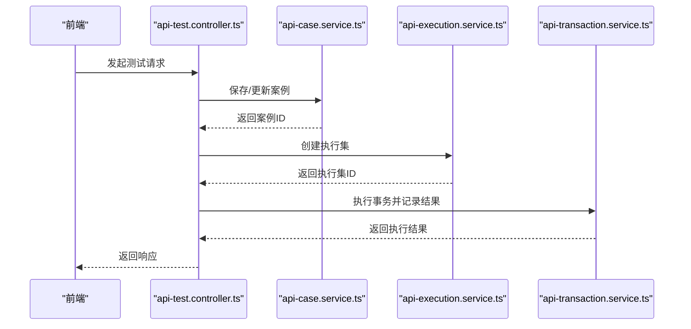
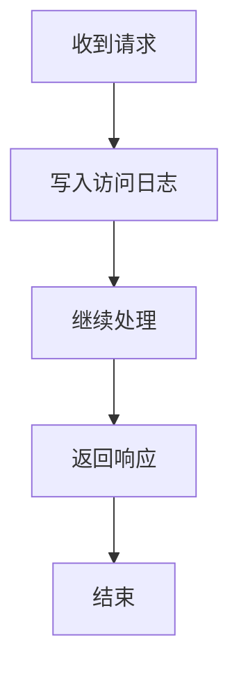
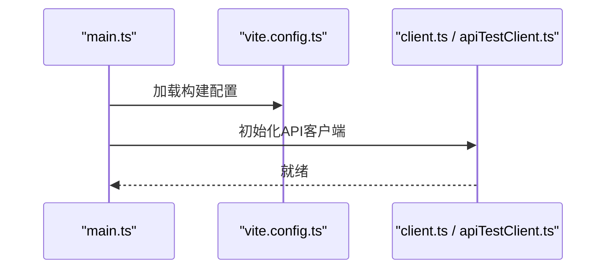
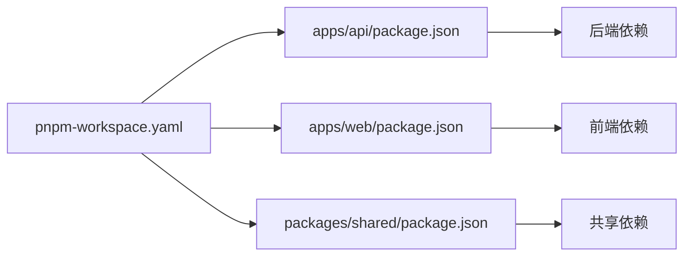

# 故障排除

<cite>
**本文引用的文件**
- [apps/api/src/bootstrap.ts](file://apps/api/src/bootstrap.ts)
- [apps/api/src/app.module.ts](file://apps/api/src/app.module.ts)
- [apps/api/src/config/configuration.ts](file://apps/api/src/config/configuration.ts)
- [apps/api/src/config/load-env.ts](file://apps/api/src/config/load-env.ts)
- [apps/api/scripts/load-env.ts](file://apps/api/scripts/load-env.ts)
- [apps/api/src/modules/api-test/service/api-case.service.ts](file://apps/api/src/modules/api-test/service/api-case.service.ts)
- [apps/api/src/modules/api-test/service/api-execution.service.ts](file://apps/api/src/modules/api-test/service/api-execution.service.ts)
- [apps/api/src/modules/api-test/service/api-transaction.service.ts](file://apps/api/src/modules/api-test/service/api-transaction.service.ts)
- [apps/api/src/modules/api-test/controller/api-test.controller.ts](file://apps/api/src/modules/api-test/controller/api-test.controller.ts)
- [apps/api/src/minio/service/minio.service.ts](file://apps/api/src/minio/service/minio.service.ts)
- [apps/api/src/minio/minio.config.ts](file://apps/api/src/minio/minio.config.ts)
- [apps/api/src/typeorm/typeorm.config.ts](file://apps/api/src/typeorm/typeorm.config.ts)
- [apps/api/src/typeorm/schema-patch.service.ts](file://apps/api/src/typeorm/schema-patch.service.ts)
- [apps/api/src/http/http-access-log.middleware.ts](file://apps/api/src/http/http-access-log.middleware.ts)
- [apps/web/src/api/client.ts](file://apps/web/src/api/client.ts)
- [apps/web/src/api/apiTestClient.ts](file://apps/web/src/api/apiTestClient.ts)
- [apps/web/src/main.ts](file://apps/web/src/main.ts)
- [apps/web/vite.config.ts](file://apps/web/vite.config.ts)
- [apps/api/nest-cli.json](file://apps/api/nest-cli.json)
- [apps/api/package.json](file://apps/api/package.json)
- [apps/web/package.json](file://apps/web/package.json)
- [package.json](file://package.json)
- [pnpm-workspace.yaml](file://pnpm-workspace.yaml)
</cite>

## 目录
1. [简介](#简介)
2. [项目结构](#项目结构)
3. [核心组件](#核心组件)
4. [架构总览](#架构总览)
5. [详细组件分析](#详细组件分析)
6. [依赖分析](#依赖分析)
7. [性能考虑](#性能考虑)
8. [故障排除指南](#故障排除指南)
9. [结论](#结论)
10. [附录](#附录)

## 简介
本指南面向 CaseForge 的运维与开发人员，提供系统化的故障排除与调试方法。内容覆盖环境配置、数据库连接、API 调用异常、前端渲染问题、日志分析、错误追踪、性能诊断、网络与文件上传、存储访问异常、监控指标与告警、以及紧急应急响应与恢复策略。文档以仓库中的实际实现为依据，结合可操作的排查步骤与可视化图示，帮助快速定位与解决问题。

## 项目结构
CaseForge 采用前后端分离的多包工作区布局：
- 后端（NestJS）：apps/api，负责业务模块、TypeORM 数据库配置、MinIO 存储、HTTP 中间件与访问日志等。
- 前端（Vue + Vite）：apps/web，负责 API 客户端封装、路由与视图层交互。
- 共享包：packages/shared，提供跨应用共享类型与工具。
- 工作区：pnpm-workspace.yaml 统一管理多包依赖与脚本。

图表来源
- [apps/api/src/bootstrap.ts](file://apps/api/src/bootstrap.ts)
- [apps/api/src/app.module.ts](file://apps/api/src/app.module.ts)
- [apps/api/src/config/configuration.ts](file://apps/api/src/config/configuration.ts)
- [apps/api/src/typeorm/typeorm.config.ts](file://apps/api/src/typeorm/typeorm.config.ts)
- [apps/api/src/minio/service/minio.service.ts](file://apps/api/src/minio/service/minio.service.ts)
- [apps/api/src/http/http-access-log.middleware.ts](file://apps/api/src/http/http-access-log.middleware.ts)
- [apps/api/src/modules/api-test/controller/api-test.controller.ts](file://apps/api/src/modules/api-test/controller/api-test.controller.ts)
- [apps/web/src/api/client.ts](file://apps/web/src/api/client.ts)
- [apps/web/src/api/apiTestClient.ts](file://apps/web/src/api/apiTestClient.ts)
- [apps/web/src/main.ts](file://apps/web/src/main.ts)
- [apps/web/vite.config.ts](file://apps/web/vite.config.ts)

章节来源
- [pnpm-workspace.yaml](file://pnpm-workspace.yaml)
- [apps/api/package.json](file://apps/api/package.json)
- [apps/web/package.json](file://apps/web/package.json)
- [package.json](file://package.json)

## 核心组件
- 应用引导与模块装配：后端通过引导文件启动 Nest 应用，模块文件集中注册控制器、服务、中间件与拦截器。
- 配置加载：运行时从环境变量加载配置，支持脚本与运行时两种加载路径。
- 数据库：TypeORM 配置与模式补丁服务，确保数据库初始化与迁移一致性。
- 对象存储：MinIO 服务封装对象存储能力，提供统一的存取接口与配置。
- 日志：HTTP 访问日志中间件记录请求与响应摘要，便于审计与排障。
- 前端客户端：Web 应用通过独立的 API 客户端封装，区分通用与测试专用客户端。

章节来源
- [apps/api/src/bootstrap.ts](file://apps/api/src/bootstrap.ts)
- [apps/api/src/app.module.ts](file://apps/api/src/app.module.ts)
- [apps/api/src/config/configuration.ts](file://apps/api/src/config/configuration.ts)
- [apps/api/src/config/load-env.ts](file://apps/api/src/config/load-env.ts)
- [apps/api/scripts/load-env.ts](file://apps/api/scripts/load-env.ts)
- [apps/api/src/typeorm/typeorm.config.ts](file://apps/api/src/typeorm/typeorm.config.ts)
- [apps/api/src/typeorm/schema-patch.service.ts](file://apps/api/src/typeorm/schema-patch.service.ts)
- [apps/api/src/minio/service/minio.service.ts](file://apps/api/src/minio/service/minio.service.ts)
- [apps/api/src/minio/minio.config.ts](file://apps/api/src/minio/minio.config.ts)
- [apps/api/src/http/http-access-log.middleware.ts](file://apps/api/src/http/http-access-log.middleware.ts)
- [apps/web/src/api/client.ts](file://apps/web/src/api/client.ts)
- [apps/web/src/api/apiTestClient.ts](file://apps/web/src/api/apiTestClient.ts)

## 架构总览
后端采用模块化设计，API 测试相关功能集中在 api-test 模块；前端通过客户端发起请求并与后端交互。数据库与对象存储作为基础设施由配置与服务层统一管理。

图表来源
- [apps/web/src/main.ts](file://apps/web/src/main.ts)
- [apps/web/src/api/client.ts](file://apps/web/src/api/client.ts)
- [apps/api/src/modules/api-test/controller/api-test.controller.ts](file://apps/api/src/modules/api-test/controller/api-test.controller.ts)
- [apps/api/src/modules/api-test/service/api-case.service.ts](file://apps/api/src/modules/api-test/service/api-case.service.ts)
- [apps/api/src/modules/api-test/service/api-execution.service.ts](file://apps/api/src/modules/api-test/service/api-execution.service.ts)
- [apps/api/src/modules/api-test/service/api-transaction.service.ts](file://apps/api/src/modules/api-test/service/api-transaction.service.ts)
- [apps/api/src/typeorm/typeorm.config.ts](file://apps/api/src/typeorm/typeorm.config.ts)
- [apps/api/src/minio/minio.config.ts](file://apps/api/src/minio/minio.config.ts)
- [apps/api/src/http/http-access-log.middleware.ts](file://apps/api/src/http/http-access-log.middleware.ts)

## 详细组件分析

### 配置与环境加载
- 运行时加载：后端在启动时加载环境变量，生成运行配置，供 TypeORM、MinIO、审计等模块使用。
- 脚本加载：提供独立脚本用于预热或批量加载环境变量，便于部署阶段的初始化。
- 关键点：确认环境变量键名与默认值、敏感信息加密存储、脚本执行权限与输出。

图表来源
- [apps/api/src/config/load-env.ts](file://apps/api/src/config/load-env.ts)
- [apps/api/scripts/load-env.ts](file://apps/api/scripts/load-env.ts)
- [apps/api/src/config/configuration.ts](file://apps/api/src/config/configuration.ts)

章节来源
- [apps/api/src/config/load-env.ts](file://apps/api/src/config/load-env.ts)
- [apps/api/scripts/load-env.ts](file://apps/api/scripts/load-env.ts)
- [apps/api/src/config/configuration.ts](file://apps/api/src/config/configuration.ts)

### 数据库连接与迁移
- TypeORM 配置：集中定义连接参数、同步策略、字符集与索引补丁。
- 模式补丁：在启动前执行补丁逻辑，避免 Schema 不一致导致的查询异常。
- 排查要点：连接字符串格式、主机可达性、认证凭据、字符集与索引缺失。

图表来源
- [apps/api/src/bootstrap.ts](file://apps/api/src/bootstrap.ts)
- [apps/api/src/typeorm/typeorm.config.ts](file://apps/api/src/typeorm/typeorm.config.ts)
- [apps/api/src/typeorm/schema-patch.service.ts](file://apps/api/src/typeorm/schema-patch.service.ts)

章节来源
- [apps/api/src/typeorm/typeorm.config.ts](file://apps/api/src/typeorm/typeorm.config.ts)
- [apps/api/src/typeorm/schema-patch.service.ts](file://apps/api/src/typeorm/schema-patch.service.ts)

### 对象存储（MinIO）
- 服务封装：统一的存储接口，屏蔽底层差异。
- 配置：访问密钥、端点、桶名、安全开关等。
- 排查要点：端点连通性、凭证有效性、桶存在性与权限、网络超时与重试。

图表来源
- [apps/api/src/minio/service/minio.service.ts](file://apps/api/src/minio/service/minio.service.ts)
- [apps/api/src/minio/minio.config.ts](file://apps/api/src/minio/minio.config.ts)

章节来源
- [apps/api/src/minio/service/minio.service.ts](file://apps/api/src/minio/service/minio.service.ts)
- [apps/api/src/minio/minio.config.ts](file://apps/api/src/minio/minio.config.ts)

### API 测试模块（控制器与服务）
- 控制器：接收前端请求，调用对应服务进行业务处理。
- 服务层：案例、执行集、事务等核心服务，负责数据持久化与流程编排。
- 排查要点：请求参数校验、事务一致性、执行集状态流转、错误捕获与返回码。

图表来源
- [apps/api/src/modules/api-test/controller/api-test.controller.ts](file://apps/api/src/modules/api-test/controller/api-test.controller.ts)
- [apps/api/src/modules/api-test/service/api-case.service.ts](file://apps/api/src/modules/api-test/service/api-case.service.ts)
- [apps/api/src/modules/api-test/service/api-execution.service.ts](file://apps/api/src/modules/api-test/service/api-execution.service.ts)
- [apps/api/src/modules/api-test/service/api-transaction.service.ts](file://apps/api/src/modules/api-test/service/api-transaction.service.ts)

章节来源
- [apps/api/src/modules/api-test/controller/api-test.controller.ts](file://apps/api/src/modules/api-test/controller/api-test.controller.ts)
- [apps/api/src/modules/api-test/service/api-case.service.ts](file://apps/api/src/modules/api-test/service/api-case.service.ts)
- [apps/api/src/modules/api-test/service/api-execution.service.ts](file://apps/api/src/modules/api-test/service/api-execution.service.ts)
- [apps/api/src/modules/api-test/service/api-transaction.service.ts](file://apps/api/src/modules/api-test/service/api-transaction.service.ts)

### HTTP 访问日志与审计
- 中间件：记录请求路径、方法、IP、耗时、状态码等，便于审计与问题回溯。
- 排查要点：日志级别、字段完整性、磁盘空间与轮转策略。

图表来源
- [apps/api/src/http/http-access-log.middleware.ts](file://apps/api/src/http/http-access-log.middleware.ts)

章节来源
- [apps/api/src/http/http-access-log.middleware.ts](file://apps/api/src/http/http-access-log.middleware.ts)

### 前端客户端与渲染
- 客户端封装：区分通用客户端与测试专用客户端，统一错误处理与拦截器。
- 引导入口：Vite 配置与主入口，确保构建与开发体验稳定。
- 排查要点：代理转发、CORS、静态资源路径、构建产物完整性。

图表来源
- [apps/web/src/main.ts](file://apps/web/src/main.ts)
- [apps/web/vite.config.ts](file://apps/web/vite.config.ts)
- [apps/web/src/api/client.ts](file://apps/web/src/api/client.ts)
- [apps/web/src/api/apiTestClient.ts](file://apps/web/src/api/apiTestClient.ts)

章节来源
- [apps/web/src/main.ts](file://apps/web/src/main.ts)
- [apps/web/vite.config.ts](file://apps/web/vite.config.ts)
- [apps/web/src/api/client.ts](file://apps/web/src/api/client.ts)
- [apps/web/src/api/apiTestClient.ts](file://apps/web/src/api/apiTestClient.ts)

## 依赖分析
- 多包工作区：通过 pnpm-workspace.yaml 管理，确保包间依赖解析与版本对齐。
- 后端依赖：NestJS、TypeORM、MinIO SDK、中间件与审计模块。
- 前端依赖：Vue 生态、Vite、API 客户端与路由。

图表来源
- [pnpm-workspace.yaml](file://pnpm-workspace.yaml)
- [apps/api/package.json](file://apps/api/package.json)
- [apps/web/package.json](file://apps/web/package.json)
- [package.json](file://package.json)

章节来源
- [pnpm-workspace.yaml](file://pnpm-workspace.yaml)
- [apps/api/package.json](file://apps/api/package.json)
- [apps/web/package.json](file://apps/web/package.json)
- [package.json](file://package.json)

## 性能考虑
- 数据库层面：合理设置连接池大小、启用索引补丁、避免 N+1 查询；对大事务分片处理。
- 存储层面：分片上传、断点续传、并发控制与重试退避；监控对象桶容量与延迟。
- API 层面：限流与熔断、缓存热点数据、压缩响应体、异步任务队列。
- 前端层面：懒加载、按需引入、构建优化、CDN 与缓存策略。

## 故障排除指南

### 环境配置错误
- 症状：应用启动失败、模块初始化异常、配置缺失导致的运行时错误。
- 排查步骤：
  - 核对运行时与脚本加载的环境变量是否一致，确认键名与默认值。
  - 检查配置文件中敏感信息是否正确注入，避免明文泄露。
  - 使用最小化配置集验证启动流程，逐步增加模块定位问题。
- 参考文件：
  - [apps/api/src/config/load-env.ts](file://apps/api/src/config/load-env.ts)
  - [apps/api/scripts/load-env.ts](file://apps/api/scripts/load-env.ts)
  - [apps/api/src/config/configuration.ts](file://apps/api/src/config/configuration.ts)

章节来源
- [apps/api/src/config/load-env.ts](file://apps/api/src/config/load-env.ts)
- [apps/api/scripts/load-env.ts](file://apps/api/scripts/load-env.ts)
- [apps/api/src/config/configuration.ts](file://apps/api/src/config/configuration.ts)

### 数据库连接失败
- 症状：启动时报连接错误、查询超时、迁移失败。
- 排查步骤：
  - 检查连接字符串、主机可达性、防火墙与端口策略。
  - 确认字符集与索引补丁已正确应用，避免不兼容导致的初始化失败。
  - 查看数据库日志与慢查询，评估连接池与并发压力。
- 参考文件：
  - [apps/api/src/typeorm/typeorm.config.ts](file://apps/api/src/typeorm/typeorm.config.ts)
  - [apps/api/src/typeorm/schema-patch.service.ts](file://apps/api/src/typeorm/schema-patch.service.ts)

章节来源
- [apps/api/src/typeorm/typeorm.config.ts](file://apps/api/src/typeorm/typeorm.config.ts)
- [apps/api/src/typeorm/schema-patch.service.ts](file://apps/api/src/typeorm/schema-patch.service.ts)

### API 调用异常
- 症状：接口报错、响应时间长、状态码异常、事务回滚。
- 排查步骤：
  - 通过访问日志定位请求路径、方法与耗时，核对控制器到服务的调用链。
  - 检查服务层的参数校验、事务边界与异常捕获策略。
  - 使用最小复现场景隔离问题，逐步加入外部依赖（数据库/存储）。
- 参考文件：
  - [apps/api/src/http/http-access-log.middleware.ts](file://apps/api/src/http/http-access-log.middleware.ts)
  - [apps/api/src/modules/api-test/controller/api-test.controller.ts](file://apps/api/src/modules/api-test/controller/api-test.controller.ts)
  - [apps/api/src/modules/api-test/service/api-case.service.ts](file://apps/api/src/modules/api-test/service/api-case.service.ts)
  - [apps/api/src/modules/api-test/service/api-execution.service.ts](file://apps/api/src/modules/api-test/service/api-execution.service.ts)
  - [apps/api/src/modules/api-test/service/api-transaction.service.ts](file://apps/api/src/modules/api-test/service/api-transaction.service.ts)

章节来源
- [apps/api/src/http/http-access-log.middleware.ts](file://apps/api/src/http/http-access-log.middleware.ts)
- [apps/api/src/modules/api-test/controller/api-test.controller.ts](file://apps/api/src/modules/api-test/controller/api-test.controller.ts)
- [apps/api/src/modules/api-test/service/api-case.service.ts](file://apps/api/src/modules/api-test/service/api-case.service.ts)
- [apps/api/src/modules/api-test/service/api-execution.service.ts](file://apps/api/src/modules/api-test/service/api-execution.service.ts)
- [apps/api/src/modules/api-test/service/api-transaction.service.ts](file://apps/api/src/modules/api-test/service/api-transaction.service.ts)

### 前端渲染问题
- 症状：页面空白、组件未渲染、路由跳转异常、构建失败。
- 排查步骤：
  - 检查 Vite 构建配置与代理设置，确认静态资源路径与 CDN。
  - 核对客户端初始化顺序，确保 API 客户端可用后再挂载应用。
  - 在浏览器开发者工具中查看网络面板与控制台错误，定位具体资源或接口问题。
- 参考文件：
  - [apps/web/vite.config.ts](file://apps/web/vite.config.ts)
  - [apps/web/src/main.ts](file://apps/web/src/main.ts)
  - [apps/web/src/api/client.ts](file://apps/web/src/api/client.ts)
  - [apps/web/src/api/apiTestClient.ts](file://apps/web/src/api/apiTestClient.ts)

章节来源
- [apps/web/vite.config.ts](file://apps/web/vite.config.ts)
- [apps/web/src/main.ts](file://apps/web/src/main.ts)
- [apps/web/src/api/client.ts](file://apps/web/src/api/client.ts)
- [apps/web/src/api/apiTestClient.ts](file://apps/web/src/api/apiTestClient.ts)

### 网络连接问题
- 症状：请求超时、DNS 解析失败、跨域拒绝、代理不通。
- 排查步骤：
  - 使用网络诊断工具验证 DNS、TCP 端口与 TLS 握手。
  - 检查 CORS 配置与代理规则，确保允许来源与方法。
  - 对外网服务（如 MinIO）验证访问密钥与桶权限。
- 参考文件：
  - [apps/web/vite.config.ts](file://apps/web/vite.config.ts)
  - [apps/web/src/api/client.ts](file://apps/web/src/api/client.ts)
  - [apps/api/src/minio/minio.config.ts](file://apps/api/src/minio/minio.config.ts)

章节来源
- [apps/web/vite.config.ts](file://apps/web/vite.config.ts)
- [apps/web/src/api/client.ts](file://apps/web/src/api/client.ts)
- [apps/api/src/minio/minio.config.ts](file://apps/api/src/minio/minio.config.ts)

### 文件上传失败与存储访问异常
- 症状：上传超时、签名失败、桶不存在、权限不足。
- 排查步骤：
  - 校验 MinIO 端点、凭证与桶名配置，确认服务可用。
  - 检查上传策略（如预签名 URL）与过期时间。
  - 查看存储侧日志与配额限制，评估带宽与并发。
- 参考文件：
  - [apps/api/src/minio/service/minio.service.ts](file://apps/api/src/minio/service/minio.service.ts)
  - [apps/api/src/minio/minio.config.ts](file://apps/api/src/minio/minio.config.ts)

章节来源
- [apps/api/src/minio/service/minio.service.ts](file://apps/api/src/minio/service/minio.service.ts)
- [apps/api/src/minio/minio.config.ts](file://apps/api/src/minio/minio.config.ts)

### 日志分析技巧与错误追踪
- 访问日志：结合请求 ID 与时间戳关联控制器、服务与数据库事务。
- 错误追踪：在服务层捕获异常并记录上下文信息，避免吞掉关键堆栈。
- 工具建议：使用结构化日志（JSON）、集中式日志平台（如 ELK/Fluentd）与告警集成。

章节来源
- [apps/api/src/http/http-access-log.middleware.ts](file://apps/api/src/http/http-access-log.middleware.ts)

### 性能诊断方法
- 指标采集：CPU、内存、连接数、QPS、P95/P99 延迟、存储 IOPS。
- 分析手段：火焰图、慢查询分析、事务拆分、缓存命中率。
- 优化策略：连接池调优、索引与查询计划优化、异步化与限流。

## 结论
通过系统化的配置校验、数据库与存储验证、API 调用链路梳理、前端渲染与网络诊断，以及日志与性能指标的综合运用，可以高效定位并解决 CaseForge 的各类故障。建议在生产环境中建立完善的监控与告警体系，并制定标准化的应急响应流程，确保快速恢复与持续改进。

## 附录

### 监控指标与告警
- 指标建议：请求量、错误率、响应时间、数据库连接数、存储容量与延迟、前端首屏时间。
- 告警策略：阈值告警、趋势告警、异常波动检测与自愈联动。

### 应急响应与恢复策略
- 快速降级：关闭非关键功能、启用只读模式、切换备用存储。
- 回滚与修复：基于版本化部署回滚至稳定版本，修复后灰度发布。
- 备份与恢复：定期备份数据库与对象存储，演练恢复流程，缩短 RTO/RPO。