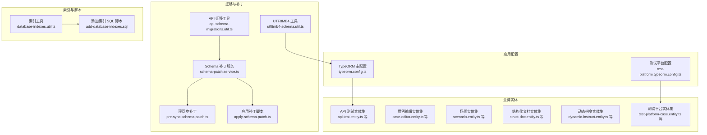
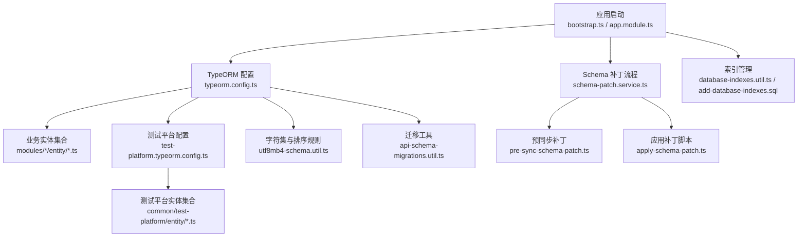
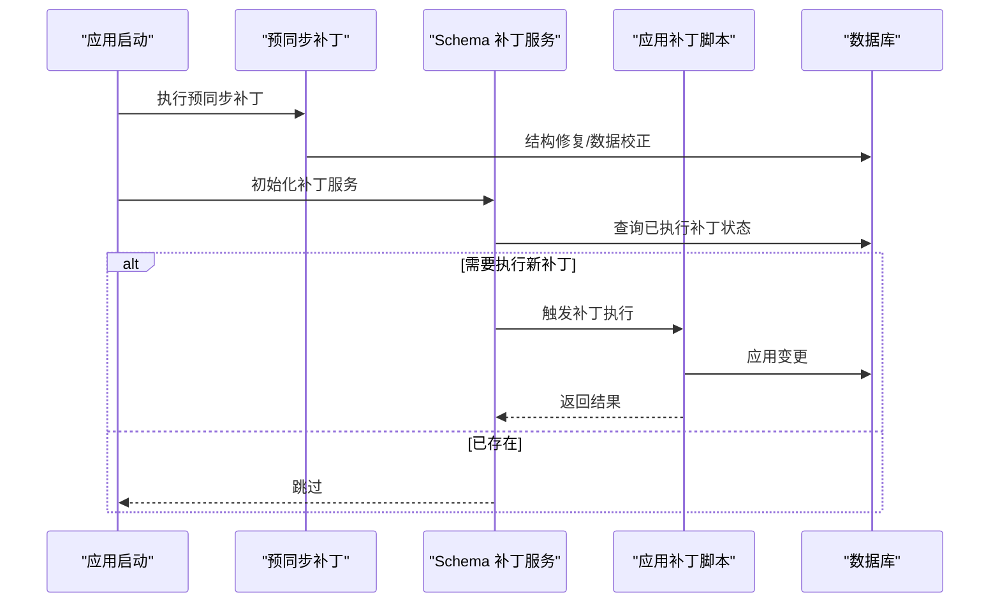
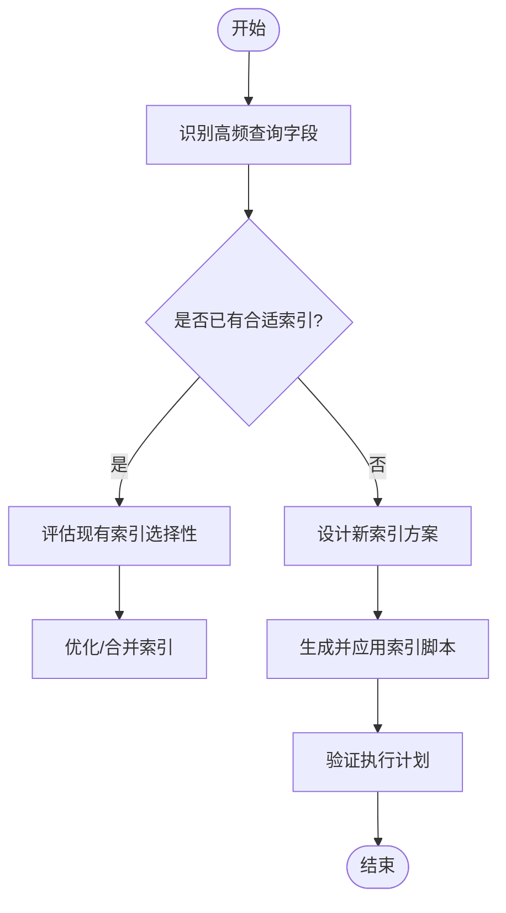
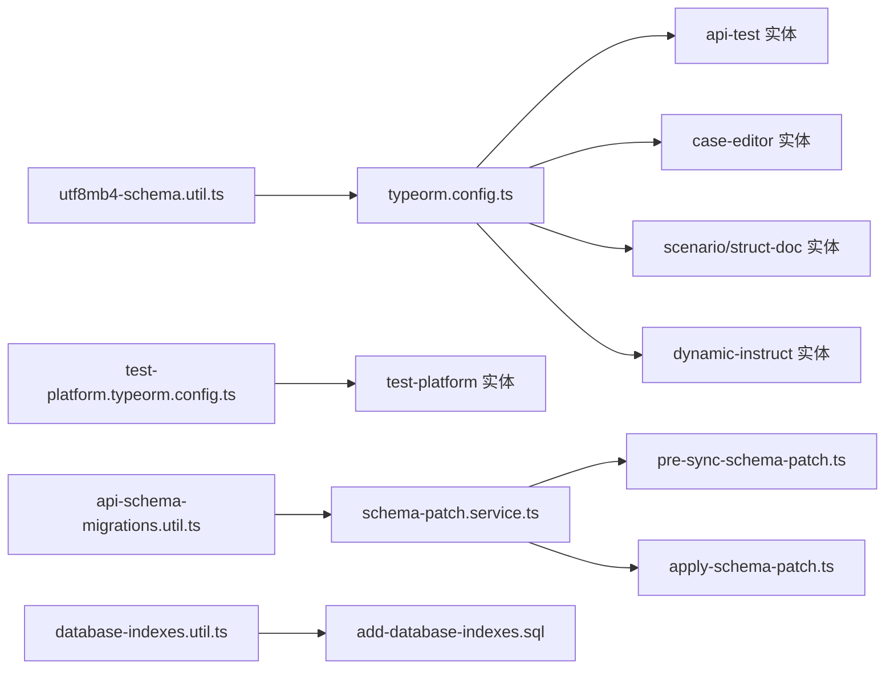

# 数据库设计

<cite>
**本文引用的文件**
- [typeorm.config.ts](file://apps/api/src/common/typeorm/typeorm.config.ts)
- [test-platform.typeorm.config.ts](file://apps/api/src/common/test-platform/test-platform.typeorm.config.ts)
- [schema-patch.service.ts](file://apps/api/src/common/typeorm/schema-patch.service.ts)
- [pre-sync-schema-patch.ts](file://apps/api/src/common/typeorm/pre-sync-schema-patch.ts)
- [database-indexes.util.ts](file://apps/api/src/common/typeorm/database-indexes.util.ts)
- [add-database-indexes.sql](file://apps/api/scripts/add-database-indexes.sql)
- [apply-schema-patch.ts](file://apps/api/scripts/apply-schema-patch.ts)
- [utf8mb4-schema.util.ts](file://apps/api/src/common/typeorm/utf8mb4-schema.util.ts)
- [api-schema-migrations.util.ts](file://apps/api/src/common/typeorm/api-schema-migrations.util.ts)
- [api-test.entity.ts](file://apps/api/src/modules/api-test/entity/api-test.entity.ts)
- [api-transaction.entity.ts](file://apps/api/src/modules/api-test/entity/api-transaction.entity.ts)
- [api-test-case.entity.ts](file://apps/api/src/modules/api-test/entity/api-test-case.entity.ts)
- [api-test-environment.entity.ts](file://apps/api/src/modules/api-test/entity/api-test-environment.entity.ts)
- [api-test-environment-service.entity.ts](file://apps/api/src/modules/api-test/entity/api-test-environment-service.entity.ts)
- [api-test-execution-set.entity.ts](file://apps/api/src/modules/api-test/entity/api-test-execution-set.entity.ts)
- [api-test-execution-set-case.entity.ts](file://apps/api/src/modules/api-test/entity/api-test-execution-set-case.entity.ts)
- [api-test-run.entity.ts](file://apps/api/src/modules/api-test/entity/api-test-run.entity.ts)
- [api-test-run-item.entity.ts](file://apps/api/src/modules/api-test/entity/api-test-run-item.entity.ts)
- [api-doc.entity.ts](file://apps/api/src/modules/api-test/entity/api-doc.entity.ts)
- [api-endpoint.entity.ts](file://apps/api/src/modules/api-test/entity/api-endpoint.entity.ts)
- [case-editor.entity.ts](file://apps/api/src/modules/case-editor/entity/case-editor.entity.ts)
- [case-tree.entity.ts](file://apps/api/src/modules/case-editor/entity/case-tree.entity.ts)
- [case-node-metadata.entity.ts](file://apps/api/src/modules/case-editor/entity/case-node-metadata.entity.ts)
- [case-constraint.entity.ts](file://apps/api/src/modules/case-editor/entity/case-constraint.entity.ts)
- [case-generate-job.entity.ts](file://apps/api/src/modules/case-editor/entity/case-generate-job.entity.ts)
- [project.entity.ts](file://apps/api/src/modules/project-manage/entity/project.entity.ts)
- [scenario.entity.ts](file://apps/api/src/modules/scenario/entity/scenario.entity.ts)
- [prompt.entity.ts](file://apps/api/src/modules/scenario/entity/prompt.entity.ts)
- [struct-doc.entity.ts](file://apps/api/src/modules/struct-doc/entity/struct-doc.entity.ts)
- [test-point-instruct.entity.ts](file://apps/api/src/modules/dynamic-instruct/entity/test-point-instruct.entity.ts)
- [test-point-prompt.entity.ts](file://apps/api/src/modules/dynamic-instruct/entity/test-point-prompt.entity.ts)
- [dynamic-instruct.ts](file://apps/api/src/modules/dynamic-instruct/entity/dynamic-instruct.ts)
- [test-platform-case.entity.ts](file://apps/api/src/common/test-platform/entity/test-platform-case.entity.ts)
- [test-platform-case-step.entity.ts](file://apps/api/src/common/test-platform/entity/test-platform-case-step.entity.ts)
- [test-platform-project.entity.ts](file://apps/api/src/common/test-platform/entity/test-platform-project.entity.ts)
</cite>

## 目录
1. [简介](#简介)
2. [项目结构](#项目结构)
3. [核心组件](#核心组件)
4. [架构总览](#架构总览)
5. [详细组件分析](#详细组件分析)
6. [依赖分析](#依赖分析)
7. [性能考虑](#性能考虑)
8. [故障排查指南](#故障排查指南)
9. [结论](#结论)
10. [附录](#附录)

## 简介
本文件系统性梳理 CaseForge 基于 TypeORM 的数据库设计与实现，覆盖以下主题：
- 实体关系设计：主要实体模型、表结构与字段约束
- 迁移策略与版本管理：Schema Patch 机制、预同步补丁与自动迁移工具
- 索引设计与性能优化：索引策略、查询优化与缓存建议
- 数据访问模式：仓储与服务层交互、事务与并发控制
- 安全、备份与监控：字符集、安全配置与运维建议
- 演进最佳实践：版本化变更、回滚与兼容性策略

## 项目结构
数据库相关代码主要集中在以下位置：
- TypeORM 配置与连接：apps/api/src/common/typeorm/*.ts
- 数据库脚本与补丁：apps/api/scripts/*.ts, *.sql
- 各业务模块实体：apps/api/src/modules/*/entity/*.ts
- 测试平台专用实体与配置：apps/api/src/common/test-platform/entity/*.ts 与配置

**图表来源**
- [typeorm.config.ts](file://apps/api/src/common/typeorm/typeorm.config.ts)
- [test-platform.typeorm.config.ts](file://apps/api/src/common/test-platform/test-platform.typeorm.config.ts)
- [schema-patch.service.ts](file://apps/api/src/common/typeorm/schema-patch.service.ts)
- [pre-sync-schema-patch.ts](file://apps/api/src/common/typeorm/pre-sync-schema-patch.ts)
- [apply-schema-patch.ts](file://apps/api/scripts/apply-schema-patch.ts)
- [api-schema-migrations.util.ts](file://apps/api/src/common/typeorm/api-schema-migrations.util.ts)
- [utf8mb4-schema.util.ts](file://apps/api/src/common/typeorm/utf8mb4-schema.util.ts)
- [database-indexes.util.ts](file://apps/api/src/common/typeorm/database-indexes.util.ts)
- [add-database-indexes.sql](file://apps/api/scripts/add-database-indexes.sql)
- [api-test.entity.ts](file://apps/api/src/modules/api-test/entity/api-test.entity.ts)
- [case-editor.entity.ts](file://apps/api/src/modules/case-editor/entity/case-editor.entity.ts)
- [scenario.entity.ts](file://apps/api/src/modules/scenario/entity/scenario.entity.ts)
- [struct-doc.entity.ts](file://apps/api/src/modules/struct-doc/entity/struct-doc.entity.ts)
- [dynamic-instruct.ts](file://apps/api/src/modules/dynamic-instruct/entity/dynamic-instruct.ts)
- [test-platform-case.entity.ts](file://apps/api/src/common/test-platform/entity/test-platform-case.entity.ts)

**章节来源**
- [typeorm.config.ts](file://apps/api/src/common/typeorm/typeorm.config.ts)
- [test-platform.typeorm.config.ts](file://apps/api/src/common/test-platform/test-platform.typeorm.config.ts)
- [database-indexes.util.ts](file://apps/api/src/common/typeorm/database-indexes.util.ts)
- [add-database-indexes.sql](file://apps/api/scripts/add-database-indexes.sql)
- [apply-schema-patch.ts](file://apps/api/scripts/apply-schema-patch.ts)
- [schema-patch.service.ts](file://apps/api/src/common/typeorm/schema-patch.service.ts)
- [pre-sync-schema-patch.ts](file://apps/api/src/common/typeorm/pre-sync-schema-patch.ts)
- [api-schema-migrations.util.ts](file://apps/api/src/common/typeorm/api-schema-migrations.util.ts)
- [utf8mb4-schema.util.ts](file://apps/api/src/common/typeorm/utf8mb4-schema.util.ts)

## 核心组件
- TypeORM 主配置：集中定义连接参数、实体映射、同步策略与日志等。
- 测试平台独立配置：隔离测试平台相关实体与连接，避免与主业务耦合。
- Schema 补丁服务：统一执行补丁逻辑，支持幂等与条件判断。
- 预同步补丁：在启动前执行必要的结构修复或数据迁移。
- 索引工具与脚本：批量生成与应用索引，提升查询性能。
- UTF8MB4 工具：确保字符集与排序规则满足多语言需求。
- API 迁移工具：辅助处理复杂迁移与版本演进。

**章节来源**
- [typeorm.config.ts](file://apps/api/src/common/typeorm/typeorm.config.ts)
- [test-platform.typeorm.config.ts](file://apps/api/src/common/test-platform/test-platform.typeorm.config.ts)
- [schema-patch.service.ts](file://apps/api/src/common/typeorm/schema-patch.service.ts)
- [pre-sync-schema-patch.ts](file://apps/api/src/common/typeorm/pre-sync-schema-patch.ts)
- [database-indexes.util.ts](file://apps/api/src/common/typeorm/database-indexes.util.ts)
- [utf8mb4-schema.util.ts](file://apps/api/src/common/typeorm/utf8mb4-schema.util.ts)
- [api-schema-migrations.util.ts](file://apps/api/src/common/typeorm/api-schema-migrations.util.ts)

## 架构总览
下图展示数据库层的整体架构与关键交互：

**图表来源**
- [typeorm.config.ts](file://apps/api/src/common/typeorm/typeorm.config.ts)
- [test-platform.typeorm.config.ts](file://apps/api/src/common/test-platform/test-platform.typeorm.config.ts)
- [schema-patch.service.ts](file://apps/api/src/common/typeorm/schema-patch.service.ts)
- [pre-sync-schema-patch.ts](file://apps/api/src/common/typeorm/pre-sync-schema-patch.ts)
- [apply-schema-patch.ts](file://apps/api/scripts/apply-schema-patch.ts)
- [database-indexes.util.ts](file://apps/api/src/common/typeorm/database-indexes.util.ts)
- [add-database-indexes.sql](file://apps/api/scripts/add-database-indexes.sql)
- [utf8mb4-schema.util.ts](file://apps/api/src/common/typeorm/utf8mb4-schema.util.ts)
- [api-schema-migrations.util.ts](file://apps/api/src/common/typeorm/api-schema-migrations.util.ts)

## 详细组件分析

### 实体关系与表结构概览
本节对核心业务实体进行分类与关系说明，并给出 ER 关系示意。

```mermaid
erDiagram
PROJECT {
uuid id PK
string name
string description
uuid creator_id
datetime created_at
datetime updated_at
}
API_TEST_CASE {
uuid id PK
uuid project_id FK
string name
text description
json steps
datetime created_at
datetime updated_at
}
API_TRANSACTION {
uuid id PK
uuid case_id FK
string method
string url
json headers
json body
int status_code
datetime created_at
}
API_TEST_ENVIRONMENT {
uuid id PK
uuid project_id FK
string name
json variables
datetime created_at
datetime updated_at
}
API_TEST_ENVIRONMENT_SERVICE {
uuid id PK
uuid env_id FK
string service_name
string base_url
datetime created_at
}
API_TEST_EXECUTION_SET {
uuid id PK
uuid project_id FK
string name
json case_ids
datetime created_at
}
API_TEST_EXECUTION_SET_CASE {
uuid id PK
uuid exec_set_id FK
uuid case_id FK
int order_index
}
API_TEST_RUN {
uuid id PK
uuid exec_set_id FK
string status
datetime started_at
datetime finished_at
}
API_TEST_RUN_ITEM {
uuid id PK
uuid run_id FK
uuid case_id FK
string status
datetime created_at
datetime updated_at
}
API_DOC {
uuid id PK
uuid project_id FK
string name
text content
datetime created_at
datetime updated_at
}
API_ENDPOINT {
uuid id PK
uuid project_id FK
string path
string method
uuid doc_id FK
}
CASE_EDITOR {
uuid id PK
uuid project_id FK
text tree_data
datetime created_at
datetime updated_at
}
CASE_TREE {
uuid id PK
uuid editor_id FK
text nodes
datetime created_at
}
CASE_NODE_METADATA {
uuid id PK
uuid tree_id FK
string node_key
json metadata
}
CASE_CONSTRAINT {
uuid id PK
uuid editor_id FK
string constraint_type
json definition
}
CASE_GENERATE_JOB {
uuid id PK
uuid editor_id FK
string status
json params
datetime created_at
}
SCENARIO {
uuid id PK
uuid project_id FK
string title
text content
datetime created_at
datetime updated_at
}
PROMPT {
uuid id PK
uuid scenario_id FK
text content
string role
}
STRUCT_DOC {
uuid id PK
uuid project_id FK
string title
text content
datetime created_at
datetime updated_at
}
DYNAMIC_INSTRUCT {
uuid id PK
uuid project_id FK
string instruct_type
json payload
datetime created_at
}
TEST_POINT_INSTRUCT {
uuid id PK
uuid instruct_id FK
string point_key
json actions
}
TEST_POINT_PROMPT {
uuid id PK
uuid instruct_id FK
string point_key
text content
}
TEST_PLATFORM_PROJECT {
uuid id PK
string external_id
string name
datetime created_at
}
TEST_PLATFORM_CASE {
uuid id PK
uuid project_id FK
string external_id
string name
datetime created_at
}
TEST_PLATFORM_CASE_STEP {
uuid id PK
uuid case_id FK
string action
string target
string value
int order_index
}
PROJECT ||--o{ API_TEST_CASE : "包含"
API_TEST_CASE ||--o{ API_TRANSACTION : "包含"
PROJECT ||--o{ API_TEST_ENVIRONMENT : "包含"
API_TEST_ENVIRONMENT ||--o{ API_TEST_ENVIRONMENT_SERVICE : "包含"
PROJECT ||--o{ API_TEST_EXECUTION_SET : "包含"
API_TEST_EXECUTION_SET ||--o{ API_TEST_EXECUTION_SET_CASE : "包含"
API_TEST_EXECUTION_SET ||--o{ API_TEST_RUN : "触发"
API_TEST_RUN ||--o{ API_TEST_RUN_ITEM : "记录"
PROJECT ||--o{ API_DOC : "拥有"
API_DOC ||--o{ API_ENDPOINT : "解析"
PROJECT ||--o{ CASE_EDITOR : "拥有"
CASE_EDITOR ||--o{ CASE_TREE : "包含"
CASE_TREE ||--o{ CASE_NODE_METADATA : "包含"
CASE_EDITOR ||--o{ CASE_CONSTRAINT : "包含"
CASE_EDITOR ||--o{ CASE_GENERATE_JOB : "生成"
PROJECT ||--o{ SCENARIO : "拥有"
SCENARIO ||--o{ PROMPT : "包含"
PROJECT ||--o{ STRUCT_DOC : "拥有"
PROJECT ||--o{ DYNAMIC_INSTRUCT : "拥有"
DYNAMIC_INSTRUCT ||--o{ TEST_POINT_INSTRUCT : "包含"
DYNAMIC_INSTRUCT ||--o{ TEST_POINT_PROMPT : "包含"
TEST_PLATFORM_PROJECT ||--o{ TEST_PLATFORM_CASE : "包含"
TEST_PLATFORM_CASE ||--o{ TEST_PLATFORM_CASE_STEP : "包含"
```

**图表来源**
- [project.entity.ts](file://apps/api/src/modules/project-manage/entity/project.entity.ts)
- [api-test-case.entity.ts](file://apps/api/src/modules/api-test/entity/api-test-case.entity.ts)
- [api-transaction.entity.ts](file://apps/api/src/modules/api-test/entity/api-transaction.entity.ts)
- [api-test-environment.entity.ts](file://apps/api/src/modules/api-test/entity/api-test-environment.entity.ts)
- [api-test-environment-service.entity.ts](file://apps/api/src/modules/api-test/entity/api-test-environment-service.entity.ts)
- [api-test-execution-set.entity.ts](file://apps/api/src/modules/api-test/entity/api-test-execution-set.entity.ts)
- [api-test-execution-set-case.entity.ts](file://apps/api/src/modules/api-test/entity/api-test-execution-set-case.entity.ts)
- [api-test-run.entity.ts](file://apps/api/src/modules/api-test/entity/api-test-run.entity.ts)
- [api-test-run-item.entity.ts](file://apps/api/src/modules/api-test/entity/api-test-run-item.entity.ts)
- [api-doc.entity.ts](file://apps/api/src/modules/api-test/entity/api-doc.entity.ts)
- [api-endpoint.entity.ts](file://apps/api/src/modules/api-test/entity/api-endpoint.entity.ts)
- [case-editor.entity.ts](file://apps/api/src/modules/case-editor/entity/case-editor.entity.ts)
- [case-tree.entity.ts](file://apps/api/src/modules/case-editor/entity/case-tree.entity.ts)
- [case-node-metadata.entity.ts](file://apps/api/src/modules/case-editor/entity/case-node-metadata.entity.ts)
- [case-constraint.entity.ts](file://apps/api/src/modules/case-editor/entity/case-constraint.entity.ts)
- [case-generate-job.entity.ts](file://apps/api/src/modules/case-editor/entity/case-generate-job.entity.ts)
- [scenario.entity.ts](file://apps/api/src/modules/scenario/entity/scenario.entity.ts)
- [prompt.entity.ts](file://apps/api/src/modules/scenario/entity/prompt.entity.ts)
- [struct-doc.entity.ts](file://apps/api/src/modules/struct-doc/entity/struct-doc.entity.ts)
- [dynamic-instruct.ts](file://apps/api/src/modules/dynamic-instruct/entity/dynamic-instruct.ts)
- [test-point-instruct.entity.ts](file://apps/api/src/modules/dynamic-instruct/entity/test-point-instruct.entity.ts)
- [test-point-prompt.entity.ts](file://apps/api/src/modules/dynamic-instruct/entity/test-point-prompt.entity.ts)
- [test-platform-project.entity.ts](file://apps/api/src/common/test-platform/entity/test-platform-project.entity.ts)
- [test-platform-case.entity.ts](file://apps/api/src/common/test-platform/entity/test-platform-case.entity.ts)
- [test-platform-case-step.entity.ts](file://apps/api/src/common/test-platform/entity/test-platform-case-step.entity.ts)

**章节来源**
- [project.entity.ts](file://apps/api/src/modules/project-manage/entity/project.entity.ts)
- [api-test-case.entity.ts](file://apps/api/src/modules/api-test/entity/api-test-case.entity.ts)
- [api-transaction.entity.ts](file://apps/api/src/modules/api-test/entity/api-transaction.entity.ts)
- [api-test-environment.entity.ts](file://apps/api/src/modules/api-test/entity/api-test-environment.entity.ts)
- [api-test-environment-service.entity.ts](file://apps/api/src/modules/api-test/entity/api-test-environment-service.entity.ts)
- [api-test-execution-set.entity.ts](file://apps/api/src/modules/api-test/entity/api-test-execution-set.entity.ts)
- [api-test-execution-set-case.entity.ts](file://apps/api/src/modules/api-test/entity/api-test-execution-set-case.entity.ts)
- [api-test-run.entity.ts](file://apps/api/src/modules/api-test/entity/api-test-run.entity.ts)
- [api-test-run-item.entity.ts](file://apps/api/src/modules/api-test/entity/api-test-run-item.entity.ts)
- [api-doc.entity.ts](file://apps/api/src/modules/api-test/entity/api-doc.entity.ts)
- [api-endpoint.entity.ts](file://apps/api/src/modules/api-test/entity/api-endpoint.entity.ts)
- [case-editor.entity.ts](file://apps/api/src/modules/case-editor/entity/case-editor.entity.ts)
- [case-tree.entity.ts](file://apps/api/src/modules/case-editor/entity/case-tree.entity.ts)
- [case-node-metadata.entity.ts](file://apps/api/src/modules/case-editor/entity/case-node-metadata.entity.ts)
- [case-constraint.entity.ts](file://apps/api/src/modules/case-editor/entity/case-constraint.entity.ts)
- [case-generate-job.entity.ts](file://apps/api/src/modules/case-editor/entity/case-generate-job.entity.ts)
- [scenario.entity.ts](file://apps/api/src/modules/scenario/entity/scenario.entity.ts)
- [prompt.entity.ts](file://apps/api/src/modules/scenario/entity/prompt.entity.ts)
- [struct-doc.entity.ts](file://apps/api/src/modules/struct-doc/entity/struct-doc.entity.ts)
- [dynamic-instruct.ts](file://apps/api/src/modules/dynamic-instruct/entity/dynamic-instruct.ts)
- [test-point-instruct.entity.ts](file://apps/api/src/modules/dynamic-instruct/entity/test-point-instruct.entity.ts)
- [test-point-prompt.entity.ts](file://apps/api/src/modules/dynamic-instruct/entity/test-point-prompt.entity.ts)
- [test-platform-project.entity.ts](file://apps/api/src/common/test-platform/entity/test-platform-project.entity.ts)
- [test-platform-case.entity.ts](file://apps/api/src/common/test-platform/entity/test-platform-case.entity.ts)
- [test-platform-case-step.entity.ts](file://apps/api/src/common/test-platform/entity/test-platform-case-step.entity.ts)

### 迁移策略与版本管理（Schema Patch）
- 预同步补丁：在应用启动早期执行，用于修复关键结构问题或数据一致性。
- Schema 补丁服务：封装补丁执行逻辑，支持幂等与条件判断，避免重复执行。
- 应用补丁脚本：通过命令行脚本触发，便于 CI/CD 或运维自动化。
- API 迁移工具：辅助处理复杂迁移，确保版本演进可控。
- 字符集与排序规则：统一使用 UTF8MB4，保证多语言与表情符号存储。

**图表来源**
- [pre-sync-schema-patch.ts](file://apps/api/src/common/typeorm/pre-sync-schema-patch.ts)
- [schema-patch.service.ts](file://apps/api/src/common/typeorm/schema-patch.service.ts)
- [apply-schema-patch.ts](file://apps/api/scripts/apply-schema-patch.ts)

**章节来源**
- [pre-sync-schema-patch.ts](file://apps/api/src/common/typeorm/pre-sync-schema-patch.ts)
- [schema-patch.service.ts](file://apps/api/src/common/typeorm/schema-patch.service.ts)
- [apply-schema-patch.ts](file://apps/api/scripts/apply-schema-patch.ts)
- [api-schema-migrations.util.ts](file://apps/api/src/common/typeorm/api-schema-migrations.util.ts)
- [utf8mb4-schema.util.ts](file://apps/api/src/common/typeorm/utf8mb4-schema.util.ts)

### 索引设计原则与性能优化
- 索引工具：集中维护常用查询字段的索引，支持批量生成与应用。
- SQL 脚本：提供可直接执行的索引创建语句，便于手动或自动化部署。
- 性能优化建议：
  - 对高频过滤/排序字段建立单列或复合索引。
  - 避免过度索引导致写入性能下降。
  - 使用 EXPLAIN 分析慢查询，结合业务场景调整索引策略。
  - 对大表分页查询采用“延迟关联”或游标分页。

**图表来源**
- [database-indexes.util.ts](file://apps/api/src/common/typeorm/database-indexes.util.ts)
- [add-database-indexes.sql](file://apps/api/scripts/add-database-indexes.sql)

**章节来源**
- [database-indexes.util.ts](file://apps/api/src/common/typeorm/database-indexes.util.ts)
- [add-database-indexes.sql](file://apps/api/scripts/add-database-indexes.sql)

### 数据访问模式与查询优化
- 仓储与服务：通过服务层封装复杂查询与聚合操作，保持控制器简洁。
- 事务与并发：对写密集操作使用显式事务；对只读查询启用只读会话以降低锁竞争。
- 缓存策略：热点数据可引入 Redis 缓存；对频繁读取的配置与字典表设置短 TTL。
- 分页与懒加载：对列表接口使用游标分页或基于主键的分页，避免深度偏移。

[本节为通用指导，不直接分析具体文件]

### 数据库安全配置
- 字符集与排序规则：统一使用 UTF8MB4，避免存储异常字符引发错误。
- 最小权限原则：数据库用户仅授予必要权限，避免使用超级账号。
- 参数化查询：所有外部输入必须经参数绑定，防止注入攻击。
- 敏感信息加密：环境变量与密钥通过配置中心管理，不在数据库中明文存储。

**章节来源**
- [utf8mb4-schema.util.ts](file://apps/api/src/common/typeorm/utf8mb4-schema.util.ts)

### 备份恢复与监控
- 备份：定期全量+增量备份，保留至少 3 个最近备份版本。
- 恢复：制定演练计划，验证备份可用性与恢复时间目标。
- 监控：关注慢查询、锁等待、连接数与磁盘 IO，设置阈值告警。

[本节为通用指导，不直接分析具体文件]

### 数据模型演进最佳实践
- 版本化变更：所有结构变更需通过补丁或迁移脚本，禁止直接修改生产库。
- 兼容性：新增字段默认可空或提供默认值；删除字段先标记弃用再清理。
- 回滚策略：每次变更保留回滚脚本；重大变更采用灰度发布。
- 文档同步：变更记录与实体注释保持一致，便于团队协作。

[本节为通用指导，不直接分析具体文件]

## 依赖分析
- 组件内聚与解耦：TypeORM 配置与各业务模块实体分离，测试平台使用独立配置。
- 外部依赖：MySQL/兼容引擎；TypeORM ORM；Node 环境下的脚本工具链。
- 可能的循环依赖：实体间通过外键关联，避免在类型层面形成循环导入。

**图表来源**
- [typeorm.config.ts](file://apps/api/src/common/typeorm/typeorm.config.ts)
- [test-platform.typeorm.config.ts](file://apps/api/src/common/test-platform/test-platform.typeorm.config.ts)
- [schema-patch.service.ts](file://apps/api/src/common/typeorm/schema-patch.service.ts)
- [pre-sync-schema-patch.ts](file://apps/api/src/common/typeorm/pre-sync-schema-patch.ts)
- [apply-schema-patch.ts](file://apps/api/scripts/apply-schema-patch.ts)
- [database-indexes.util.ts](file://apps/api/src/common/typeorm/database-indexes.util.ts)
- [add-database-indexes.sql](file://apps/api/scripts/add-database-indexes.sql)
- [utf8mb4-schema.util.ts](file://apps/api/src/common/typeorm/utf8mb4-schema.util.ts)
- [api-schema-migrations.util.ts](file://apps/api/src/common/typeorm/api-schema-migrations.util.ts)

**章节来源**
- [typeorm.config.ts](file://apps/api/src/common/typeorm/typeorm.config.ts)
- [test-platform.typeorm.config.ts](file://apps/api/src/common/test-platform/test-platform.typeorm.config.ts)
- [schema-patch.service.ts](file://apps/api/src/common/typeorm/schema-patch.service.ts)
- [pre-sync-schema-patch.ts](file://apps/api/src/common/typeorm/pre-sync-schema-patch.ts)
- [apply-schema-patch.ts](file://apps/api/scripts/apply-schema-patch.ts)
- [database-indexes.util.ts](file://apps/api/src/common/typeorm/database-indexes.util.ts)
- [add-database-indexes.sql](file://apps/api/scripts/add-database-indexes.sql)
- [utf8mb4-schema.util.ts](file://apps/api/src/common/typeorm/utf8mb4-schema.util.ts)
- [api-schema-migrations.util.ts](file://apps/api/src/common/typeorm/api-schema-migrations.util.ts)

## 性能考虑
- 查询优化：优先使用覆盖索引；避免 SELECT *；合理使用 JOIN 与子查询。
- 写入优化：批量插入/更新；减少不必要的事务长度；利用数据库的批量能力。
- 缓存：热点读取使用缓存；写后失效或定时刷新；注意缓存穿透与雪崩。
- 监控：开启慢查询日志；定期分析执行计划；根据业务峰值调优连接池。

[本节为通用指导，不直接分析具体文件]

## 故障排查指南
- 启动失败：检查 TypeORM 配置与连接参数；确认数据库可达与权限正确。
- 迁移失败：查看补丁执行日志；核对 apply-schema-patch.ts 的输出；按顺序重试。
- 查询缓慢：使用 EXPLAIN 分析；检查索引是否命中；评估是否需要新增索引。
- 字符乱码：确认 UTF8MB4 设置；检查客户端连接字符集；验证排序规则。

**章节来源**
- [typeorm.config.ts](file://apps/api/src/common/typeorm/typeorm.config.ts)
- [schema-patch.service.ts](file://apps/api/src/common/typeorm/schema-patch.service.ts)
- [apply-schema-patch.ts](file://apps/api/scripts/apply-schema-patch.ts)
- [utf8mb4-schema.util.ts](file://apps/api/src/common/typeorm/utf8mb4-schema.util.ts)

## 结论
本设计以 TypeORM 为核心，结合 Schema Patch、索引工具与迁移工具，构建了可演进、可维护且具备良好性能的数据库层。通过清晰的实体边界与独立配置，既满足主业务需求，又为测试平台等扩展场景预留空间。建议在后续迭代中持续完善监控与回滚策略，确保数据库变更的安全与稳定。

## 附录
- 常用实体清单与职责简述：
  - 项目管理：项目、场景、提示词、结构化文档
  - API 测试：用例、事务、环境、执行集、运行记录、文档与端点
  - 用例编辑：树形结构、节点元数据、约束与生成作业
  - 动态指令：测试点指令与提示词
  - 测试平台：项目、用例与步骤

[本节为概览性内容，不直接分析具体文件]