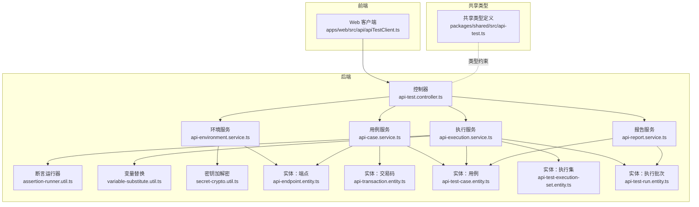
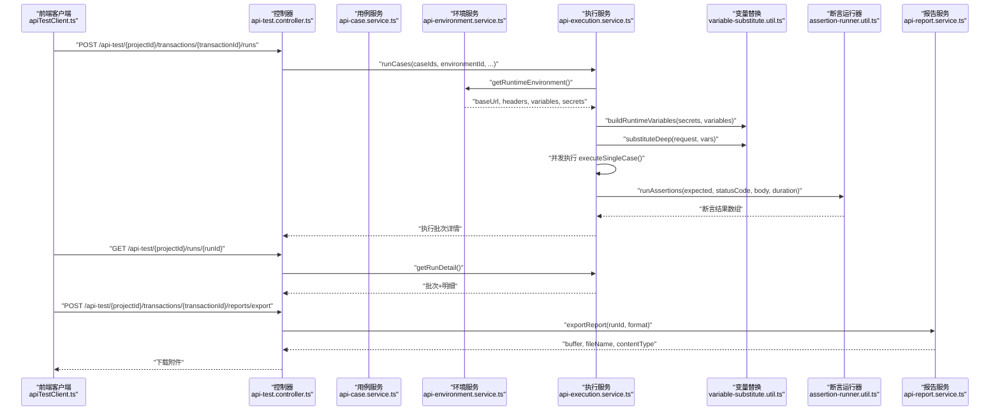
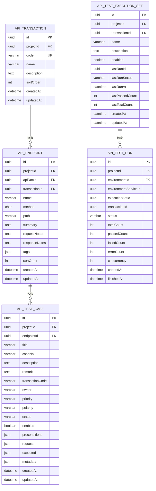
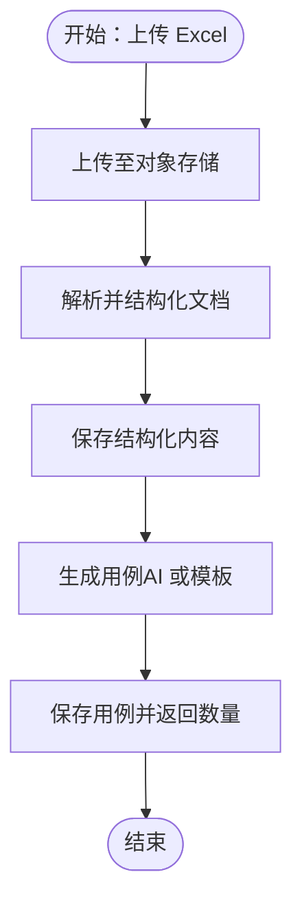
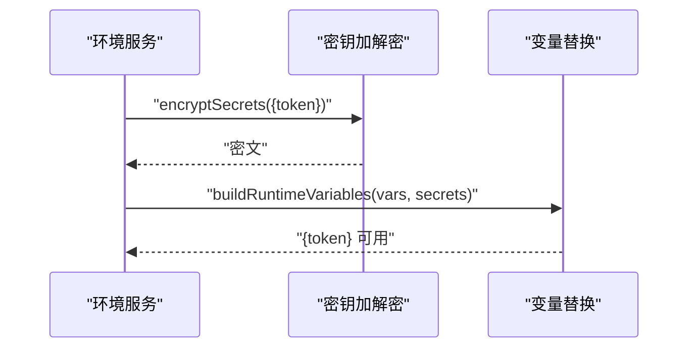
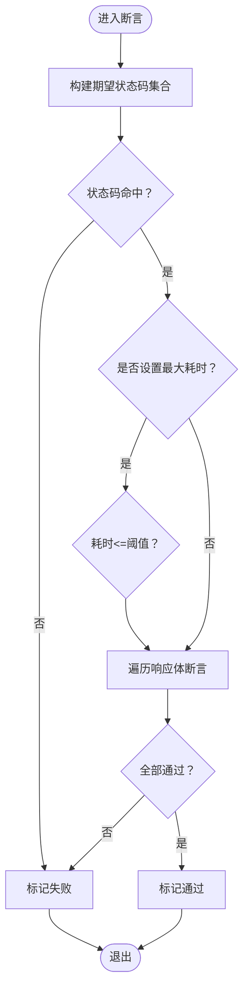
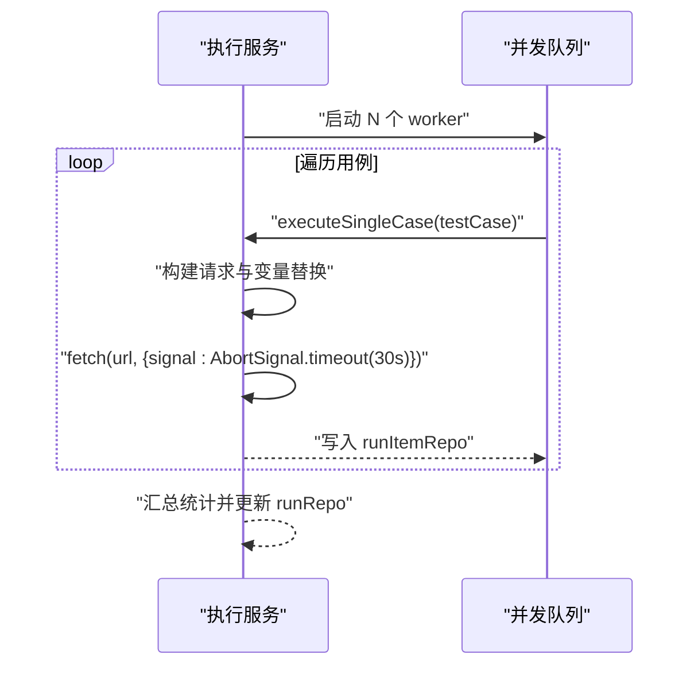
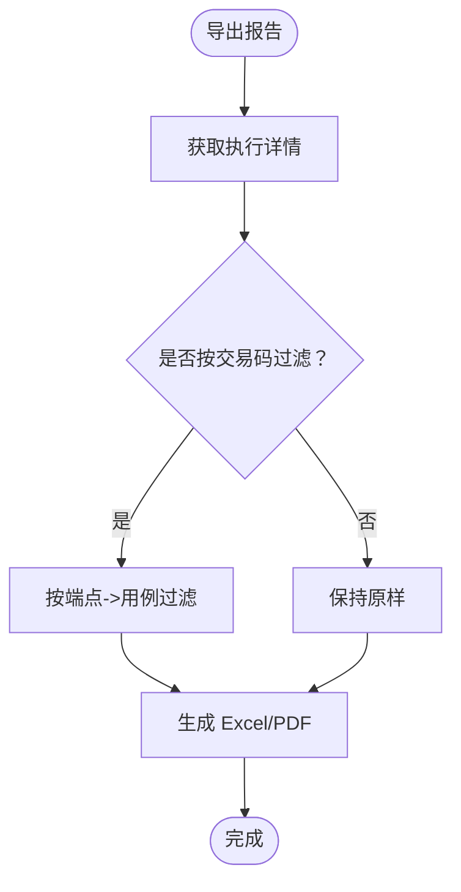
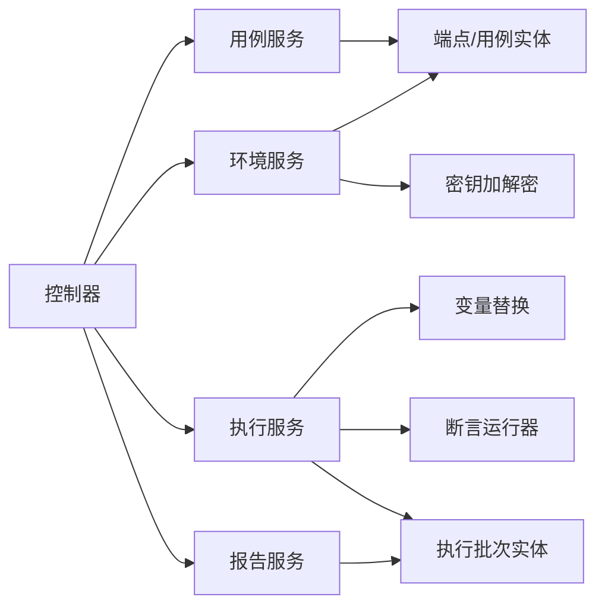

# API 测试模块

<cite>
**本文引用的文件**
- [apps/api/src/modules/api-test/controller/api-test.controller.ts](file://apps/api/src/modules/api-test/controller/api-test.controller.ts)
- [apps/api/src/modules/api-test/service/api-case.service.ts](file://apps/api/src/modules/api-test/service/api-case.service.ts)
- [apps/api/src/modules/api-test/service/api-environment.service.ts](file://apps/api/src/modules/api-test/service/api-environment.service.ts)
- [apps/api/src/modules/api-test/service/api-execution.service.ts](file://apps/api/src/modules/api-test/service/api-execution.service.ts)
- [apps/api/src/modules/api-test/service/api-report.service.ts](file://apps/api/src/modules/api-test/service/api-report.service.ts)
- [apps/api/src/modules/api-test/util/assertion-runner.util.ts](file://apps/api/src/modules/api-test/util/assertion-runner.util.ts)
- [apps/api/src/modules/api-test/util/variable-substitute.util.ts](file://apps/api/src/modules/api-test/util/variable-substitute.util.ts)
- [apps/api/src/modules/api-test/util/secret-crypto.util.ts](file://apps/api/src/modules/api-test/util/secret-crypto.util.ts)
- [apps/api/src/modules/api-test/entity/api-endpoint.entity.ts](file://apps/api/src/modules/api-test/entity/api-endpoint.entity.ts)
- [apps/api/src/modules/api-test/entity/api-transaction.entity.ts](file://apps/api/src/modules/api-test/entity/api-transaction.entity.ts)
- [apps/api/src/modules/api-test/entity/api-test-case.entity.ts](file://apps/api/src/modules/api-test/entity/api-test-case.entity.ts)
- [apps/api/src/modules/api-test/entity/api-test-execution-set.entity.ts](file://apps/api/src/modules/api-test/entity/api-test-execution-set.entity.ts)
- [apps/api/src/modules/api-test/entity/api-test-run.entity.ts](file://apps/api/src/modules/api-test/entity/api-test-run.entity.ts)
- [packages/shared/src/api-test.ts](file://packages/shared/src/api-test.ts)
- [apps/web/src/api/apiTestClient.ts](file://apps/web/src/api/apiTestClient.ts)
</cite>

## 目录
1. [简介](#简介)
2. [项目结构](#项目结构)
3. [核心组件](#核心组件)
4. [架构总览](#架构总览)
5. [详细组件分析](#详细组件分析)
6. [依赖关系分析](#依赖关系分析)
7. [性能考量](#性能考量)
8. [故障排查指南](#故障排查指南)
9. [结论](#结论)
10. [附录](#附录)

## 简介
本文件为 API 测试模块的全面技术文档，覆盖接口文档管理、测试用例生成、执行集编排、测试报告生成等完整链路。重点阐释以下方面：
- API 端点实体设计与数据模型
- 事务处理机制与交易码关联
- 断言执行引擎与变量替换机制
- 环境变量管理与密钥加密存储
- 并发控制、超时处理与错误恢复策略
- 报告统计、性能指标与导出能力
- 完整的 API 接口规范、请求/响应格式与错误码说明

## 项目结构
后端采用 NestJS + TypeORM 架构，按功能域划分模块；前端通过统一客户端封装调用。

图表来源
- [apps/api/src/modules/api-test/controller/api-test.controller.ts:1-507](file://apps/api/src/modules/api-test/controller/api-test.controller.ts#L1-L507)
- [apps/api/src/modules/api-test/service/api-case.service.ts:1-279](file://apps/api/src/modules/api-test/service/api-case.service.ts#L1-L279)
- [apps/api/src/modules/api-test/service/api-environment.service.ts:1-254](file://apps/api/src/modules/api-test/service/api-environment.service.ts#L1-L254)
- [apps/api/src/modules/api-test/service/api-execution.service.ts:1-316](file://apps/api/src/modules/api-test/service/api-execution.service.ts#L1-L316)
- [apps/api/src/modules/api-test/service/api-report.service.ts:1-199](file://apps/api/src/modules/api-test/service/api-report.service.ts#L1-L199)
- [apps/api/src/modules/api-test/util/assertion-runner.util.ts:1-102](file://apps/api/src/modules/api-test/util/assertion-runner.util.ts#L1-L102)
- [apps/api/src/modules/api-test/util/variable-substitute.util.ts:1-43](file://apps/api/src/modules/api-test/util/variable-substitute.util.ts#L1-L43)
- [apps/api/src/modules/api-test/util/secret-crypto.util.ts:1-48](file://apps/api/src/modules/api-test/util/secret-crypto.util.ts#L1-L48)
- [apps/api/src/modules/api-test/entity/api-endpoint.entity.ts:1-67](file://apps/api/src/modules/api-test/entity/api-endpoint.entity.ts#L1-L67)
- [apps/api/src/modules/api-test/entity/api-transaction.entity.ts:1-56](file://apps/api/src/modules/api-test/entity/api-transaction.entity.ts#L1-L56)
- [apps/api/src/modules/api-test/entity/api-test-case.entity.ts:1-95](file://apps/api/src/modules/api-test/entity/api-test-case.entity.ts#L1-L95)
- [apps/api/src/modules/api-test/entity/api-test-execution-set.entity.ts:1-62](file://apps/api/src/modules/api-test/entity/api-test-execution-set.entity.ts#L1-L62)
- [apps/api/src/modules/api-test/entity/api-test-run.entity.ts:1-62](file://apps/api/src/modules/api-test/entity/api-test-run.entity.ts#L1-L62)
- [packages/shared/src/api-test.ts:1-69](file://packages/shared/src/api-test.ts#L1-L69)
- [apps/web/src/api/apiTestClient.ts:1-498](file://apps/web/src/api/apiTestClient.ts#L1-L498)

章节来源
- [apps/api/src/modules/api-test/controller/api-test.controller.ts:1-507](file://apps/api/src/modules/api-test/controller/api-test.controller.ts#L1-L507)
- [apps/web/src/api/apiTestClient.ts:1-498](file://apps/web/src/api/apiTestClient.ts#L1-L498)

## 核心组件
- 控制器层：统一暴露 REST 接口，负责路由、鉴权与参数校验，协调各服务完成业务流程。
- 服务层：
  - 用例服务：管理接口文档、端点与测试用例的生命周期，支持 AI/模板生成用例。
  - 环境服务：管理执行环境与环境服务（多实例），支持变量与密钥合并及加解密。
  - 执行服务：并发调度用例执行，构建请求、发送 HTTP、断言与统计，产出执行批次与明细。
  - 报告服务：聚合统计、过滤按交易码、导出 Excel/PDF。
- 工具层：
  - 变量替换：深度递归替换请求中的占位符。
  - 断言运行器：基于状态码、响应体、耗时等规则进行断言。
  - 密钥加解密：基于 AES-256-GCM 的对称加密封装。
- 实体层：以 TypeORM 映射数据库表，建立端点、交易码、用例、执行集、执行批次等关系。

章节来源
- [apps/api/src/modules/api-test/service/api-case.service.ts:1-279](file://apps/api/src/modules/api-test/service/api-case.service.ts#L1-L279)
- [apps/api/src/modules/api-test/service/api-environment.service.ts:1-254](file://apps/api/src/modules/api-test/service/api-environment.service.ts#L1-L254)
- [apps/api/src/modules/api-test/service/api-execution.service.ts:1-316](file://apps/api/src/modules/api-test/service/api-execution.service.ts#L1-L316)
- [apps/api/src/modules/api-test/service/api-report.service.ts:1-199](file://apps/api/src/modules/api-test/service/api-report.service.ts#L1-L199)
- [apps/api/src/modules/api-test/util/variable-substitute.util.ts:1-43](file://apps/api/src/modules/api-test/util/variable-substitute.util.ts#L1-L43)
- [apps/api/src/modules/api-test/util/assertion-runner.util.ts:1-102](file://apps/api/src/modules/api-test/util/assertion-runner.util.ts#L1-L102)
- [apps/api/src/modules/api-test/util/secret-crypto.util.ts:1-48](file://apps/api/src/modules/api-test/util/secret-crypto.util.ts#L1-L48)

## 架构总览
下图展示从 Web 前端到后端控制器、服务与工具的调用链路，以及数据在实体间的流转。

图表来源
- [apps/web/src/api/apiTestClient.ts:437-452](file://apps/web/src/api/apiTestClient.ts#L437-L452)
- [apps/api/src/modules/api-test/controller/api-test.controller.ts:448-475](file://apps/api/src/modules/api-test/controller/api-test.controller.ts#L448-L475)
- [apps/api/src/modules/api-test/service/api-execution.service.ts:38-114](file://apps/api/src/modules/api-test/service/api-execution.service.ts#L38-L114)
- [apps/api/src/modules/api-test/service/api-environment.service.ts:92-135](file://apps/api/src/modules/api-test/service/api-environment.service.ts#L92-L135)
- [apps/api/src/modules/api-test/util/variable-substitute.util.ts:33-42](file://apps/api/src/modules/api-test/util/variable-substitute.util.ts#L33-L42)
- [apps/api/src/modules/api-test/util/assertion-runner.util.ts:62-97](file://apps/api/src/modules/api-test/util/assertion-runner.util.ts#L62-L97)
- [apps/api/src/modules/api-test/service/api-report.service.ts:63-89](file://apps/api/src/modules/api-test/service/api-report.service.ts#L63-L89)

## 详细组件分析

### 数据模型与实体设计
- 交易码（ApiTransactionEntity）
  - 关键字段：项目标识、交易码 code、名称、描述、排序、审计字段。
  - 作用：作为接口文档与端点的归属维度，贯穿用例与执行集。
- 端点（ApiEndpointEntity）
  - 关键字段：所属交易码、项目、方法、路径、标签、排序、摘要与注释。
  - 约束：多端点对应一文档，端点删除级联清理用例。
- 用例（ApiTestCaseEntity）
  - 关键字段：标题、编号、优先级、极性、状态、启用标志、前置条件、请求与期望断言、元数据。
  - 关联：绑定端点，便于按端点/交易码筛选。
- 执行集（ApiTestExecutionSetEntity）
  - 关键字段：名称、描述、启用、最近一次运行统计、审计字段。
  - 作用：将多个用例组织为可复用的执行集合。
- 执行批次（ApiTestRunEntity）
  - 关键字段：环境、执行集、交易码、状态、计数、并发度、起止时间。
  - 关联：一对多明细项（ApiTestRunItemEntity）。

图表来源
- [apps/api/src/modules/api-test/entity/api-transaction.entity.ts:1-56](file://apps/api/src/modules/api-test/entity/api-transaction.entity.ts#L1-L56)
- [apps/api/src/modules/api-test/entity/api-endpoint.entity.ts:1-67](file://apps/api/src/modules/api-test/entity/api-endpoint.entity.ts#L1-L67)
- [apps/api/src/modules/api-test/entity/api-test-case.entity.ts:1-95](file://apps/api/src/modules/api-test/entity/api-test-case.entity.ts#L1-L95)
- [apps/api/src/modules/api-test/entity/api-test-execution-set.entity.ts:1-62](file://apps/api/src/modules/api-test/entity/api-test-execution-set.entity.ts#L1-L62)
- [apps/api/src/modules/api-test/entity/api-test-run.entity.ts:1-62](file://apps/api/src/modules/api-test/entity/api-test-run.entity.ts#L1-L62)

章节来源
- [apps/api/src/modules/api-test/entity/api-transaction.entity.ts:1-56](file://apps/api/src/modules/api-test/entity/api-transaction.entity.ts#L1-L56)
- [apps/api/src/modules/api-test/entity/api-endpoint.entity.ts:1-67](file://apps/api/src/modules/api-test/entity/api-endpoint.entity.ts#L1-L67)
- [apps/api/src/modules/api-test/entity/api-test-case.entity.ts:1-95](file://apps/api/src/modules/api-test/entity/api-test-case.entity.ts#L1-L95)
- [apps/api/src/modules/api-test/entity/api-test-execution-set.entity.ts:1-62](file://apps/api/src/modules/api-test/entity/api-test-execution-set.entity.ts#L1-L62)
- [apps/api/src/modules/api-test/entity/api-test-run.entity.ts:1-62](file://apps/api/src/modules/api-test/entity/api-test-run.entity.ts#L1-L62)

### 接口文档管理与用例生成
- 文档上传与结构化解析
  - 支持 Excel 上传、对象存储保存、异步解析与结构化 Markdown 生成。
  - 提供自动保存与手动保存两种模式，确保编辑过程中的数据安全。
- 端点与用例
  - 端点列表按交易码与排序组织；用例绑定端点并可按交易码筛选。
  - 用例生成支持 AI 与模板兜底两种策略，优先使用结构化文档与端点信息生成高质量用例。
- 用例编辑与状态
  - 支持优先级、极性、状态、启用开关、断言配置等；元数据记录来源（AI/手动/AI 编辑）。

图表来源
- [apps/api/src/modules/api-test/controller/api-test.controller.ts:135-185](file://apps/api/src/modules/api-test/controller/api-test.controller.ts#L135-L185)
- [apps/api/src/modules/api-test/service/api-case.service.ts:162-230](file://apps/api/src/modules/api-test/service/api-case.service.ts#L162-L230)

章节来源
- [apps/api/src/modules/api-test/controller/api-test.controller.ts:135-276](file://apps/api/src/modules/api-test/controller/api-test.controller.ts#L135-L276)
- [apps/api/src/modules/api-test/service/api-case.service.ts:162-230](file://apps/api/src/modules/api-test/service/api-case.service.ts#L162-L230)

### 环境变量管理与密钥加密存储
- 运行时环境构建
  - 合并基础环境变量与服务级变量/头/路径前缀；支持默认环境与多服务叠加。
- 密钥加解密
  - 使用 AES-256-GCM 对称加密，密钥派生自应用密钥或环境变量；密文以 Base64 存储。
- 变量替换
  - 支持 {{var}} 与 {var} 两种语法，深层递归替换请求体、查询、路径与头。
- 敏感信息脱敏
  - 在请求快照中对 Authorization、Token、Secret 等头进行掩码显示。

图表来源
- [apps/api/src/modules/api-test/service/api-environment.service.ts:92-135](file://apps/api/src/modules/api-test/service/api-environment.service.ts#L92-L135)
- [apps/api/src/modules/api-test/util/secret-crypto.util.ts:14-41](file://apps/api/src/modules/api-test/util/secret-crypto.util.ts#L14-L41)
- [apps/api/src/modules/api-test/util/variable-substitute.util.ts:33-42](file://apps/api/src/modules/api-test/util/variable-substitute.util.ts#L33-L42)

章节来源
- [apps/api/src/modules/api-test/service/api-environment.service.ts:92-135](file://apps/api/src/modules/api-test/service/api-environment.service.ts#L92-L135)
- [apps/api/src/modules/api-test/util/secret-crypto.util.ts:14-41](file://apps/api/src/modules/api-test/util/secret-crypto.util.ts#L14-L41)
- [apps/api/src/modules/api-test/util/variable-substitute.util.ts:1-43](file://apps/api/src/modules/api-test/util/variable-substitute.util.ts#L1-L43)

### 断言执行引擎
- 断言类型
  - 状态码：支持单值或数组匹配；可配置最大响应时间阈值。
  - 响应体：jsonPath、equals、contains、matches 等。
- 执行流程
  - 统计耗时，解析响应体（尝试 JSON 解析），逐条断言，汇总结果。
- 结果判定
  - 全部断言通过才视为“通过”，否则“失败”。

图表来源
- [apps/api/src/modules/api-test/util/assertion-runner.util.ts:62-97](file://apps/api/src/modules/api-test/util/assertion-runner.util.ts#L62-L97)

章节来源
- [apps/api/src/modules/api-test/util/assertion-runner.util.ts:1-102](file://apps/api/src/modules/api-test/util/assertion-runner.util.ts#L1-L102)

### 测试执行与并发控制
- 并发策略
  - 默认并发 5，上限 10；每个并发 worker 顺序取用待执行用例，保证公平调度。
- 超时与错误
  - 单次请求超时 30 秒；异常捕获后记录错误断言与错误信息。
- 请求构建
  - GET/HEAD 自动忽略 Body；非字符串 Body 序列化为 JSON；路径变量替换；查询参数拼接；头合并与敏感头掩码。
- 执行集编排
  - 通过执行集一次性拉取用例集合，执行完成后更新执行集的最近运行统计。

图表来源
- [apps/api/src/modules/api-test/service/api-execution.service.ts:272-286](file://apps/api/src/modules/api-test/service/api-execution.service.ts#L272-L286)
- [apps/api/src/modules/api-test/service/api-execution.service.ts:179-270](file://apps/api/src/modules/api-test/service/api-execution.service.ts#L179-L270)

章节来源
- [apps/api/src/modules/api-test/service/api-execution.service.ts:22-286](file://apps/api/src/modules/api-test/service/api-execution.service.ts#L22-L286)

### 测试报告与可视化
- 统计概览
  - 总数、通过、失败、错误、通过率、起止时间、并发度等。
- 明细导出
  - Excel：包含批次、计数、并发、时间、明细（案例、状态、耗时、URL、HTTP、断言摘要）。
  - PDF：包含批次、计数、通过率、并发、失败与错误案例及其断言详情。
- 按交易码过滤
  - 将执行集/批次限定在特定交易码对应的端点与用例范围内。

图表来源
- [apps/api/src/modules/api-test/service/api-report.service.ts:63-121](file://apps/api/src/modules/api-test/service/api-report.service.ts#L63-L121)
- [apps/api/src/modules/api-test/service/api-report.service.ts:123-197](file://apps/api/src/modules/api-test/service/api-report.service.ts#L123-L197)

章节来源
- [apps/api/src/modules/api-test/service/api-report.service.ts:1-199](file://apps/api/src/modules/api-test/service/api-report.service.ts#L1-L199)

### API 接口规范与错误码
- 通用响应
  - 成功：2xx；错误：4xx/5xx；部分接口返回 { ok: true } 表示操作成功。
- 重要错误码
  - 400：参数缺失或非法（如未选择案例、未找到可执行案例、缺少状态码配置等）。
  - 404：资源不存在（环境、服务、用例、执行记录等）。
  - 500：内部错误（如断言引擎异常、导出失败等）。
- 关键接口（节选）
  - 交易码管理：列出、创建、更新、删除、批量删除。
  - 文档管理：上传、结构化、获取、自动保存、保存。
  - 用例管理：列出、创建、更新、删除、生成。
  - 环境管理：列出、创建、更新、删除、服务管理。
  - 执行集：列出、创建、更新、删除、替换用例、运行。
  - 执行：运行用例、运行执行集、列出批次、获取批次详情。
  - 报告：概览、导出。

章节来源
- [apps/api/src/modules/api-test/controller/api-test.controller.ts:70-507](file://apps/api/src/modules/api-test/controller/api-test.controller.ts#L70-L507)
- [apps/web/src/api/apiTestClient.ts:149-498](file://apps/web/src/api/apiTestClient.ts#L149-L498)
- [packages/shared/src/api-test.ts:1-69](file://packages/shared/src/api-test.ts#L1-L69)

## 依赖关系分析
- 控制器依赖服务，服务间通过领域边界清晰分离：用例、环境、执行、报告。
- 执行服务依赖变量替换与断言运行器，形成“请求构建—断言—统计”的闭环。
- 环境服务依赖密钥加解密工具，保障密文安全。
- 实体层通过外键与索引维护一致性与查询效率。

图表来源
- [apps/api/src/modules/api-test/controller/api-test.controller.ts:57-68](file://apps/api/src/modules/api-test/controller/api-test.controller.ts#L57-L68)
- [apps/api/src/modules/api-test/service/api-execution.service.ts:27-36](file://apps/api/src/modules/api-test/service/api-execution.service.ts#L27-L36)
- [apps/api/src/modules/api-test/service/api-environment.service.ts:22-27](file://apps/api/src/modules/api-test/service/api-environment.service.ts#L22-L27)
- [apps/api/src/modules/api-test/util/variable-substitute.util.ts:1-43](file://apps/api/src/modules/api-test/util/variable-substitute.util.ts#L1-L43)
- [apps/api/src/modules/api-test/util/assertion-runner.util.ts:1-102](file://apps/api/src/modules/api-test/util/assertion-runner.util.ts#L1-L102)
- [apps/api/src/modules/api-test/util/secret-crypto.util.ts:1-48](file://apps/api/src/modules/api-test/util/secret-crypto.util.ts#L1-L48)

章节来源
- [apps/api/src/modules/api-test/controller/api-test.controller.ts:1-507](file://apps/api/src/modules/api-test/controller/api-test.controller.ts#L1-L507)
- [apps/api/src/modules/api-test/service/api-execution.service.ts:1-316](file://apps/api/src/modules/api-test/service/api-execution.service.ts#L1-L316)
- [apps/api/src/modules/api-test/service/api-environment.service.ts:1-254](file://apps/api/src/modules/api-test/service/api-environment.service.ts#L1-L254)
- [apps/api/src/modules/api-test/service/api-report.service.ts:1-199](file://apps/api/src/modules/api-test/service/api-report.service.ts#L1-L199)

## 性能考量
- 并发度：默认 5，最大 10，避免对目标系统造成瞬时压力；可根据环境容量动态调整。
- 超时控制：单请求 30 秒超时，防止长时间阻塞；建议结合重试与熔断策略。
- 日志与监控：建议在控制器与服务层增加关键指标埋点（吞吐、P95/P99、错误分布）。
- 导出性能：Excel/PDF 导出为 CPU 密集型任务，建议异步化并在前端轮询结果。

## 故障排查指南
- 常见问题
  - “未找到可执行的启用案例”：检查用例启用状态与项目权限范围。
  - “执行环境不存在或已禁用”：确认环境与服务存在且启用。
  - “断言未通过”：查看失败断言名称与期望/实际值，定位响应体或状态码配置。
  - “请求失败”：检查网络连通、超时设置与服务端错误日志。
- 排查步骤
  - 从执行批次详情入手，核对请求快照与响应快照。
  - 使用报告过滤交易码，缩小问题范围。
  - 检查环境服务叠加后的 baseUrl、headers 与变量是否正确。

章节来源
- [apps/api/src/modules/api-test/service/api-execution.service.ts:47-69](file://apps/api/src/modules/api-test/service/api-execution.service.ts#L47-L69)
- [apps/api/src/modules/api-test/service/api-environment.service.ts:216-224](file://apps/api/src/modules/api-test/service/api-environment.service.ts#L216-L224)
- [apps/api/src/modules/api-test/util/assertion-runner.util.ts:53-59](file://apps/api/src/modules/api-test/util/assertion-runner.util.ts#L53-L59)

## 结论
该模块以清晰的分层架构实现了从接口文档到测试用例、从环境管理到执行与报告的全链路能力。通过可插拔的环境服务、强健的断言引擎与并发执行策略，满足了不同规模项目的 API 测试需求。建议后续在异步导出、指标监控与重试策略方面进一步增强。

## 附录
- 前端调用参考
  - 列举交易码、文档、用例、环境、执行集、执行批次与报告导出等均通过统一客户端封装。
- 类型定义参考
  - 包含用例优先级、极性、状态、断言类型、请求/期望结构等，前后端一致约束。

章节来源
- [apps/web/src/api/apiTestClient.ts:149-498](file://apps/web/src/api/apiTestClient.ts#L149-L498)
- [packages/shared/src/api-test.ts:1-69](file://packages/shared/src/api-test.ts#L1-L69)