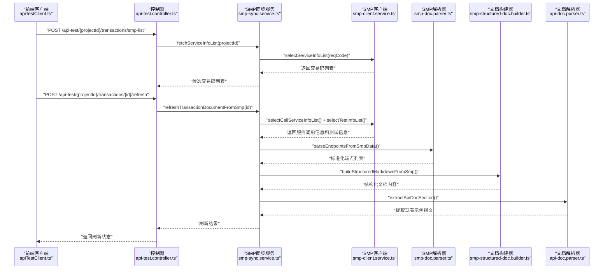
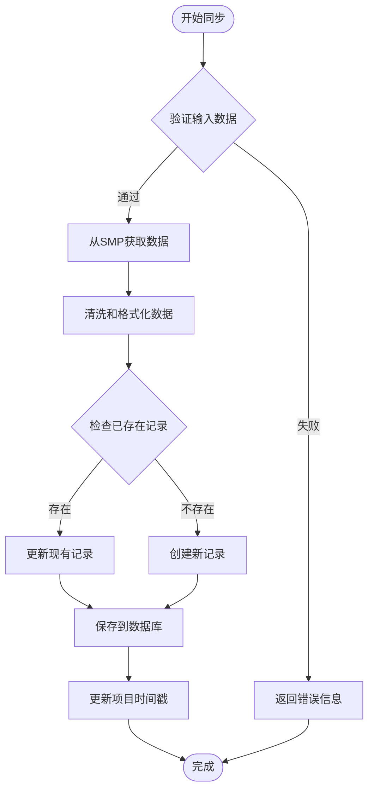
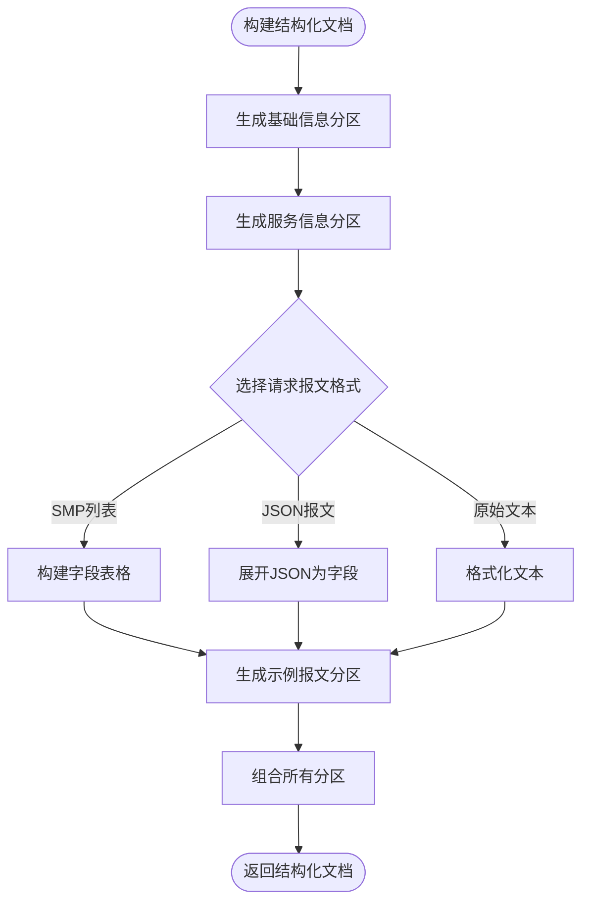
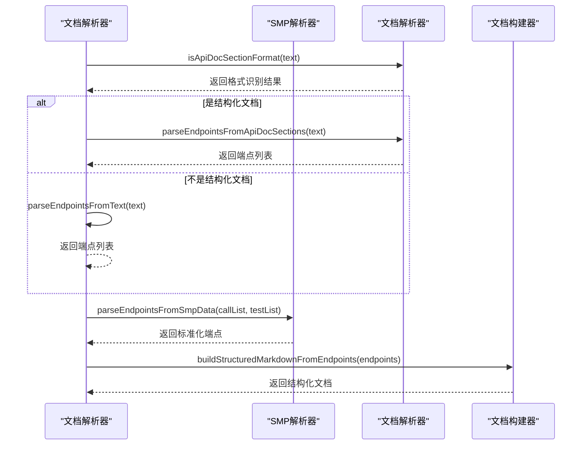
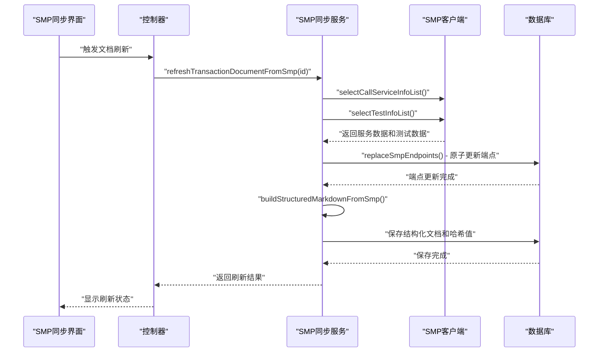
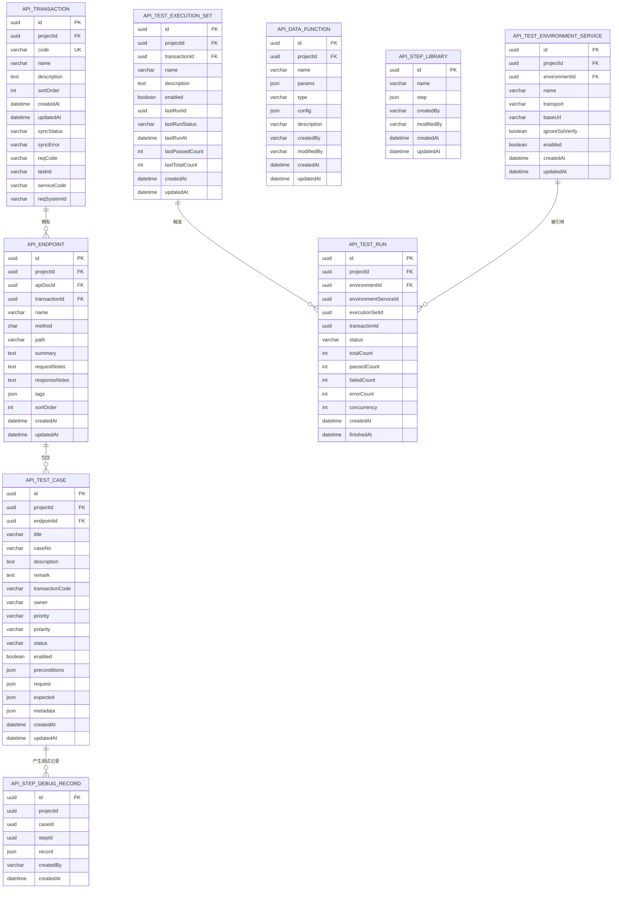
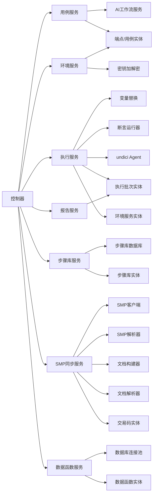

# API 测试模块

<cite>
**本文引用的文件**
- [apps/api/src/modules/api-test/controller/api-test.controller.ts](file://apps/api/src/modules/api-test/controller/api-test.controller.ts)
- [apps/api/src/modules/api-test/service/smp-sync.service.ts](file://apps/api/src/modules/api-test/service/smp-sync.service.ts)
- [apps/api/src/modules/api-test/service/smp-client.service.ts](file://apps/api/src/modules/api-test/service/smp-client.service.ts)
- [apps/api/src/modules/api-test/util/smp-doc.parser.ts](file://apps/api/src/modules/api-test/util/smp-doc.parser.ts)
- [apps/api/src/modules/api-test/util/smp-structured-doc.builder.ts](file://apps/api/src/modules/api-test/util/smp-structured-doc.builder.ts)
- [apps/api/src/modules/api-test/util/api-doc.parser.ts](file://apps/api/src/modules/api-test/util/api-doc.parser.ts)
- [apps/api/src/modules/api-test/util/api-doc-format.const.ts](file://apps/api/src/modules/api-test/util/api-doc-format.const.ts)
- [apps/api/src/modules/api-test/service/api-case.service.ts](file://apps/api/src/modules/api-test/service/api-case.service.ts)
- [apps/api/src/modules/api-test/service/api-environment.service.ts](file://apps/api/src/modules/api-test/service/api-environment.service.ts)
- [apps/api/src/modules/api-test/service/api-execution.service.ts](file://apps/api/src/modules/api-test/service/api-execution.service.ts)
- [apps/api/src/modules/api-test/service/api-report.service.ts](file://apps/api/src/modules/api-test/service/api-report.service.ts)
- [apps/api/src/modules/api-test/service/api-data-function.service.ts](file://apps/api/src/modules/api-test/service/api-data-function.service.ts)
- [apps/api/src/modules/api-test/service/api-step-library.service.ts](file://apps/api/src/modules/api-test/service/api-step-library.service.ts)
- [apps/api/src/common/ai-workflow/service/ai-workflow.service.ts](file://apps/api/src/common/ai-workflow/service/ai-workflow.service.ts)
- [apps/web/src/components/api-test/ApiCaseWorkbench.vue](file://apps/web/src/components/api-test/ApiCaseWorkbench.vue)
- [apps/web/src/components/api-test/ApiDocumentEditor.vue](file://apps/web/src/components/api-test/ApiDocumentEditor.vue)
- [apps/web/src/components/api-test/ApiDataFunctionMaintainModal.vue](file://apps/web/src/components/api-test/ApiDataFunctionMaintainModal.vue)
- [apps/web/src/components/api-test/ApiTransactionSmpSyncModal.vue](file://apps/web/src/components/api-test/ApiTransactionSmpSyncModal.vue)
- [apps/web/src/views/ApiTestDashboardView.vue](file://apps/web/src/views/ApiTestDashboardView.vue)
- [packages/shared/src/api-test.ts](file://packages/shared/src/api-test.ts)
- [apps/web/src/api/apiTestClient.ts](file://apps/web/src/api/apiTestClient.ts)
</cite>

## 更新摘要
**变更内容**
- **增强** SMP数据处理能力：优化交易码同步流程，支持增量更新和状态跟踪
- **标准化** 结构化文档格式：统一基础信息、服务信息、请求报文、示例报文四个分区
- **改进** API文档服务：增强端点解析逻辑，支持多种数据源和格式转换
- **优化** 输入清理机制：新增数据清洗和验证功能，提升数据质量
- **增强** 端点解析优化：支持从SMP数据构建标准端点结构，提高兼容性
- **完善** 文档格式统一化：确保不同来源的文档格式一致性，便于AI处理

## 目录
1. [简介](#简介)
2. [项目结构](#项目结构)
3. [核心组件](#核心组件)
4. [架构总览](#架构总览)
5. [详细组件分析](#详细组件分析)
6. [依赖关系分析](#依赖关系分析)
7. [性能考量](#性能考量)
8. [故障排查指南](#故障排查指南)
9. [结论](#结论)
10. [附录](#附录)

## 简介
本文件为 API 测试模块的全面技术文档，覆盖接口文档管理、测试用例生成、执行集编排、测试报告生成等完整链路。重点阐释以下方面：
- API 端点实体设计与数据模型
- 事务处理机制与交易码关联
- **增强** SMP数据处理能力，支持增量更新和状态跟踪
- **标准化** 结构化文档格式，统一基础信息、服务信息、请求报文、示例报文分区
- **改进** API文档服务，增强端点解析和格式转换能力
- **优化** 输入清理机制，提升数据质量和系统稳定性
- 多步骤执行引擎与步骤库管理
- 单步调试与历史追踪功能
- 服务管理平台（SMP）集成与自动同步
- 数据函数系统与动态参数生成
- AI驱动测试用例生成能力
- 断言执行引擎与变量替换机制
- 环境变量管理与密钥加密存储
- 并发控制、超时处理与错误恢复策略
- 报告统计、性能指标与导出能力
- 完整的 API 接口规范、请求/响应格式与错误码说明

## 项目结构
后端采用 NestJS + TypeORM 架构，按功能域划分模块；前端通过统一客户端封装调用。

```mermaid
graph TB
subgraph "后端"
Ctl["控制器<br/>api-test.controller.ts"]
SvcCase["用例服务<br/>api-case.service.ts"]
SvcEnv["环境服务<br/>api-environment.service.ts"]
SvcExec["执行服务<br/>api-execution.service.ts"]
SvcReport["报告服务<br/>api-report.service.ts"]
SvcSmp["SMP同步服务<br/>smp-sync.service.ts"]
SvcDataFn["数据函数服务<br/>api-data-function.service.ts"]
SvcStepLib["步骤库服务<br/>api-step-library.service.ts"]
SvcAi["AI工作流服务<br/>ai-workflow.service.ts"]
UtilAssert["断言运行器<br/>assertion-runner.util.ts"]
UtilVar["变量替换<br/>variable-substitute.util.ts"]
UtilCrypto["密钥加解密<br/>secret-crypto.util.ts"]
SmpParser["SMP解析器<br/>smp-doc.parser.ts"]
SmpBuilder["SMP文档构建器<br/>smp-structured-doc.builder.ts"]
DocParser["文档解析器<br/>api-doc.parser.ts"]
DocFormat["文档格式常量<br/>api-doc-format.const.ts"]
E1["实体：端点<br/>api-endpoint.entity.ts"]
E2["实体：交易码<br/>api-transaction.entity.ts"]
E3["实体：用例<br/>api-test-case.entity.ts"]
E4["实体：执行集<br/>api-test-execution-set.entity.ts"]
E5["实体：执行批次<br/>api-test-run.entity.ts"]
E6["实体：数据函数<br/>api-data-function.entity.ts"]
E7["实体：步骤库<br/>api-step-library.entity.ts"]
E8["实体：调试记录<br/>api-step-debug-record.entity.ts"]
E9["实体：环境服务<br/>api-test-environment-service.entity.ts"]
end
subgraph "共享类型"
Shared["共享类型定义<br/>packages/shared/src/api-test.ts"]
end
subgraph "前端"
Web["Web 客户端<br/>apps/web/src/api/apiTestClient.ts"]
CompWorkbench["步骤编辑器<br/>ApiCaseWorkbench.vue"]
CompDocEditor["文档编辑器<br/>ApiDocumentEditor.vue"]
CompSmp["SMP同步对话框<br/>ApiTransactionSmpSyncModal.vue"]
CompDataFn["数据函数维护<br/>ApiDataFunctionMaintainModal.vue"]
end
Web --> Ctl
CompWorkbench --> SvcStepLib
CompDocEditor --> SvcStepLib
CompSmp --> SvcSmp
CompDataFn --> SvcDataFn
Ctl --> SvcCase
Ctl --> SvcEnv
Ctl --> SvcExec
Ctl --> SvcReport
Ctl --> SvcSmp
Ctl --> SvcDataFn
Ctl --> SvcStepLib
SvcExec --> UtilVar
SvcExec --> UtilAssert
SvcEnv --> UtilCrypto
SvcExec --> E9
SvcCase --> E3
SvcEnv --> E1
SvcExec --> E3
SvcExec --> E5
SvcReport --> E3
SvcReport --> E5
SvcCase --> E1
SvcCase --> E2
SvcExec --> E4
SvcSmp --> E2
SvcDataFn --> E6
SvcStepLib --> E7
SvcSmp --> SmpParser
SvcSmp --> SmpBuilder
SvcSmp --> DocParser
SvcSmp --> DocFormat
```

**图表来源**
- [apps/api/src/modules/api-test/controller/api-test.controller.ts:98-119](file://apps/api/src/modules/api-test/controller/api-test.controller.ts#L98-L119)
- [apps/api/src/modules/api-test/service/smp-sync.service.ts:23-25](file://apps/api/src/modules/api-test/service/smp-sync.service.ts#L23-L25)
- [apps/api/src/modules/api-test/util/smp-doc.parser.ts:1-83](file://apps/api/src/modules/api-test/util/smp-doc.parser.ts#L1-L83)
- [apps/api/src/modules/api-test/util/smp-structured-doc.builder.ts:1-238](file://apps/api/src/modules/api-test/util/smp-structured-doc.builder.ts#L1-L238)
- [apps/api/src/modules/api-test/util/api-doc.parser.ts:1-407](file://apps/api/src/modules/api-test/util/api-doc.parser.ts#L1-L407)
- [apps/api/src/modules/api-test/util/api-doc-format.const.ts:1-17](file://apps/api/src/modules/api-test/util/api-doc-format.const.ts#L1-L17)

章节来源
- [apps/api/src/modules/api-test/controller/api-test.controller.ts:1-1032](file://apps/api/src/modules/api-test/controller/api-test.controller.ts#L1-L1032)
- [apps/web/src/api/apiTestClient.ts:522-550](file://apps/web/src/api/apiTestClient.ts#L522-L550)

## 核心组件
- 控制器层：统一暴露 REST 接口，负责路由、鉴权与参数校验，协调各服务完成业务流程。
- 服务层：
  - 用例服务：管理接口文档、端点与测试用例的生命周期，支持 AI/模板生成用例。
  - 环境服务：管理执行环境与环境服务（多实例），支持变量与密钥合并及加解密。
  - 执行服务：并发调度用例执行，构建请求、发送 HTTP、断言与统计，产出执行批次与明细。
  - 报告服务：聚合统计、过滤按交易码、导出 Excel/PDF。
  - **增强** SMP同步服务：优化数据处理流程，支持增量更新和状态跟踪，提供结构化文档构建能力。
  - **改进** API文档服务：增强端点解析逻辑，支持多种数据源和格式转换，统一文档格式。
  - **新增** 步骤库服务：提供步骤模板的CRUD操作，支持步骤复用与版本管理。
  - **新增** 数据函数服务：提供动态参数生成，支持模板公式、SQL查询、JavaScript和Python脚本。
  - **增强** AI工作流服务：支持需求文档结构化、案例JSON生成与智能提示词优化。
- 工具层：
  - 变量替换：深度递归替换请求中的占位符。
  - 断言运行器：基于状态码、响应体、耗时等规则进行断言。
  - 密钥加解密：基于 AES-256-GCM 的对称加密封装。
  - SSL验证绕过：使用Node.js undici Agent实现自签名证书支持。
  - **增强** SMP解析器：优化端点解析逻辑，支持从SMP数据构建标准端点结构。
  - **标准化** 文档构建器：统一结构化文档格式，确保基础信息、服务信息、请求报文、示例报文分区一致性。
  - **改进** 文档解析器：增强格式识别和解析能力，支持多种文档格式。
- 实体层：以 TypeORM 映射数据库表，建立端点、交易码、用例、执行集、执行批次、数据函数、步骤库、调试记录、环境服务等关系。

章节来源
- [apps/api/src/modules/api-test/service/smp-sync.service.ts:1-611](file://apps/api/src/modules/api-test/service/smp-sync.service.ts#L1-L611)
- [apps/api/src/modules/api-test/util/smp-doc.parser.ts:1-83](file://apps/api/src/modules/api-test/util/smp-doc.parser.ts#L1-L83)
- [apps/api/src/modules/api-test/util/smp-structured-doc.builder.ts:1-238](file://apps/api/src/modules/api-test/util/smp-structured-doc.builder.ts#L1-L238)
- [apps/api/src/modules/api-test/util/api-doc.parser.ts:1-407](file://apps/api/src/modules/api-test/util/api-doc.parser.ts#L1-L407)
- [apps/api/src/modules/api-test/util/api-doc-format.const.ts:1-17](file://apps/api/src/modules/api-test/util/api-doc-format.const.ts#L1-L17)

## 架构总览
下图展示从 Web 前端到后端控制器、服务与工具的调用链路，以及数据在实体间的流转。

```mermaid
sequenceDiagram
participant FE as "前端客户端<br/>apiTestClient.ts"
participant CTL as "控制器<br/>api-test.controller.ts"
participant SVC_SMP as "SMP同步服务<br/>smp-sync.service.ts"
participant CLIENT as "SMP客户端<br/>smp-client.service.ts"
participant PARSER as "SMP解析器<br/>smp-doc.parser.ts"
participant BUILDER as "文档构建器<br/>smp-structured-doc.builder.ts"
participant DOCPARSER as "文档解析器<br/>api-doc.parser.ts"
FE->>CTL : "POST /api-test/{projectId}/transactions/smp-list"
CTL->>SVC_SMP : "fetchServiceInfoList(projectId)"
SVC_SMP->>CLIENT : "selectServiceInfoList(reqCode)"
CLIENT-->>SVC_SMP : "返回交易码列表"
SVC_SMP-->>CTL : "候选交易码列表"
FE->>CTL : "POST /api-test/{projectId}/transactions/{id}/refresh"
CTL->>SVC_SMP : "refreshTransactionDocumentFromSmp(id)"
SVC_SMP->>CLIENT : "selectCallServiceInfoList() + selectTestInfoList()"
CLIENT-->>SVC_SMP : "返回服务调用信息和测试信息"
SVC_SMP->>PARSER : "parseEndpointsFromSmpData()"
PARSER-->>SVC_SMP : "标准化端点列表"
SVC_SMP->>BUILDER : "buildStructuredMarkdownFromSmp()"
BUILDER-->>SVC_SMP : "结构化文档内容"
SVC_SMP->>DOCPARSER : "extractApiDocSection()"
DOCPARSER-->>SVC_SMP : "提取现有示例报文"
SVC_SMP-->>CTL : "刷新结果"
CTL-->>FE : "返回刷新状态"
```

**图表来源**
- [apps/api/src/modules/api-test/controller/api-test.controller.ts:277-290](file://apps/api/src/modules/api-test/controller/api-test.controller.ts#L277-L290)
- [apps/api/src/modules/api-test/service/smp-sync.service.ts:193-335](file://apps/api/src/modules/api-test/service/smp-sync.service.ts#L193-L335)
- [apps/api/src/modules/api-test/service/smp-client.service.ts:173-274](file://apps/api/src/modules/api-test/service/smp-client.service.ts#L173-L274)
- [apps/api/src/modules/api-test/util/smp-doc.parser.ts:3-45](file://apps/api/src/modules/api-test/util/smp-doc.parser.ts#L3-L45)
- [apps/api/src/modules/api-test/util/smp-structured-doc.builder.ts:28-86](file://apps/api/src/modules/api-test/util/smp-structured-doc.builder.ts#L28-L86)
- [apps/api/src/modules/api-test/util/api-doc.parser.ts:38-46](file://apps/api/src/modules/api-test/util/api-doc.parser.ts#L38-L46)

## 详细组件分析

### SMP数据处理增强
- **增强** 交易码同步流程
  - 支持增量更新：通过唯一键（reqCode|taskId|serviceCode|reqSystemId|code）避免重复同步
  - 状态跟踪：新增syncStatus和syncError字段，跟踪同步状态和错误信息
  - 批量验证：增强批量同步时的数据验证，防止重复和冲突
  - 事务处理：使用数据库事务确保数据一致性
- **优化** 数据清洗机制
  - 输入清理：对交易码、名称、描述等字段进行trim处理
  - 空值处理：对可选字段提供默认值和空值保护
  - 类型转换：确保数据类型正确性，避免后续处理错误
- **改进** 错误处理
  - 详细错误信息：提供具体的错误原因和修复建议
  - 异常捕获：捕获并记录SMP通信异常
  - 降级处理：在网络异常时提供demo模式支持

```mermaid
flowchart TD
Start(["开始同步"]) --> Validate{"验证输入数据"}
Validate --> |通过| FetchData["从SMP获取数据"]
Validate --> |失败| Error["返回错误信息"]
FetchData --> CleanData["清洗和格式化数据"]
CleanData --> CheckExisting{"检查已存在记录"}
CheckExisting --> |存在| Update["更新现有记录"]
CheckExisting --> |不存在| Create["创建新记录"]
Update --> Save["保存到数据库"]
Create --> Save
Save --> UpdateProject["更新项目时间戳"]
UpdateProject --> End(["完成"])
Error --> End
```

**图表来源**
- [apps/api/src/modules/api-test/service/smp-sync.service.ts:89-167](file://apps/api/src/modules/api-test/service/smp-sync.service.ts#L89-L167)
- [apps/api/src/modules/api-test/service/smp-sync.service.ts:480-555](file://apps/api/src/modules/api-test/service/smp-sync.service.ts#L480-L555)

章节来源
- [apps/api/src/modules/api-test/service/smp-sync.service.ts:89-167](file://apps/api/src/modules/api-test/service/smp-sync.service.ts#L89-L167)
- [apps/api/src/modules/api-test/service/smp-sync.service.ts:480-555](file://apps/api/src/modules/api-test/service/smp-sync.service.ts#L480-L555)

### 结构化文档格式标准化
- **标准化** 文档分区结构
  - 基础信息：服务编码、原服务交易码、服务名称、服务属性
  - 服务信息：功能描述、业务规则、服务名称、服务属性
  - 请求报文：从SMP head/body列表或JSON报文体构建字段表格
  - 示例报文：保留用户编辑内容，首次同步时填充SMP数据
- **增强** 文档构建逻辑
  - 多数据源支持：支持SMP head/body列表、JSON报文体、原始文本等多种格式
  - 智能回退：当主要格式不可用时自动回退到其他格式
  - 内容保护：保护用户已编辑的示例报文不被覆盖
- **优化** 字段处理
  - 去重机制：避免重复字段行
  - 路径计算：正确计算节点父路径和完整路径
  - 必填标识：标准化必填字段的标识方式

```mermaid
flowchart TD
Start(["构建结构化文档"]) --> BasicInfo["生成基础信息分区"]
BasicInfo --> ServiceInfo["生成服务信息分区"]
ServiceInfo --> RequestBody{"选择请求报文格式"}
RequestBody --> |SMP列表| BuildFieldTable["构建字段表格"]
RequestBody --> |JSON报文| FlattenJson["展开JSON为字段"]
RequestBody --> |原始文本| FormatText["格式化文本"]
BuildFieldTable --> ExampleMsg["生成示例报文分区"]
FlattenJson --> ExampleMsg
FormatText --> ExampleMsg
ExampleMsg --> Combine["组合所有分区"]
Combine --> End(["返回结构化文档"])
```

**图表来源**
- [apps/api/src/modules/api-test/util/smp-structured-doc.builder.ts:28-86](file://apps/api/src/modules/api-test/util/smp-structured-doc.builder.ts#L28-L86)
- [apps/api/src/modules/api-test/util/smp-structured-doc.builder.ts:96-129](file://apps/api/src/modules/api-test/util/smp-structured-doc.builder.ts#L96-L129)
- [apps/api/src/modules/api-test/util/smp-structured-doc.builder.ts:158-186](file://apps/api/src/modules/api-test/util/smp-structured-doc.builder.ts#L158-L186)

章节来源
- [apps/api/src/modules/api-test/util/smp-structured-doc.builder.ts:28-86](file://apps/api/src/modules/api-test/util/smp-structured-doc.builder.ts#L28-L86)
- [apps/api/src/modules/api-test/util/smp-structured-doc.builder.ts:96-129](file://apps/api/src/modules/api-test/util/smp-structured-doc.builder.ts#L96-L129)
- [apps/api/src/modules/api-test/util/smp-structured-doc.builder.ts:158-186](file://apps/api/src/modules/api-test/util/smp-structured-doc.builder.ts#L158-L186)

### API文档服务改进
- **增强** 端点解析能力
  - 多格式支持：支持从SMP数据、Excel结构化文档、Markdown文本等多种来源解析端点
  - 智能识别：自动识别文档格式并选择合适的解析策略
  - 容错处理：对不完整或损坏的数据提供降级处理
- **优化** 方法解析逻辑
  - 优先级排序：socketWay > requestMethod > callMethod > POST
  - 协议支持：支持HTTP、TCP、TUXEDO等多种传输协议
  - 路径规范化：自动处理路径前缀和格式标准化
- **改进** 文档压缩功能
  - 智能裁剪：根据字符预算智能裁剪报文字段
  - 优先级处理：优先保留必填字段，按需添加选填字段
  - 长度控制：确保压缩后的文档不超过AI模型的长度限制

```mermaid
sequenceDiagram
participant Parser as "文档解析器"
participant SmpParser as "SMP解析器"
participant DocParser as "文档解析器"
participant Builder as "文档构建器"
Parser->>DocParser : isApiDocSectionFormat(text)
DocParser-->>Parser : 返回格式识别结果
alt 是结构化文档
Parser->>DocParser : parseEndpointsFromApiDocSections(text)
DocParser-->>Parser : 返回端点列表
else 不是结构化文档
Parser->>Parser : parseEndpointsFromText(text)
Parser-->>Parser : 返回端点列表
end
Parser->>SmpParser : parseEndpointsFromSmpData(callList, testList)
SmpParser-->>Parser : 返回标准化端点
Parser->>Builder : buildStructuredMarkdownFromEndpoints(endpoints)
Builder-->>Parser : 返回结构化文档
```

**图表来源**
- [apps/api/src/modules/api-test/util/api-doc.parser.ts:30-121](file://apps/api/src/modules/api-test/util/api-doc.parser.ts#L30-L121)
- [apps/api/src/modules/api-test/util/api-doc.parser.ts:124-187](file://apps/api/src/modules/api-test/util/api-doc.parser.ts#L124-L187)
- [apps/api/src/modules/api-test/util/smp-doc.parser.ts:3-45](file://apps/api/src/modules/api-test/util/smp-doc.parser.ts#L3-L45)

章节来源
- [apps/api/src/modules/api-test/util/api-doc.parser.ts:30-121](file://apps/api/src/modules/api-test/util/api-doc.parser.ts#L30-L121)
- [apps/api/src/modules/api-test/util/api-doc.parser.ts:124-187](file://apps/api/src/modules/api-test/util/api-doc.parser.ts#L124-L187)
- [apps/api/src/modules/api-test/util/smp-doc.parser.ts:3-45](file://apps/api/src/modules/api-test/util/smp-doc.parser.ts#L3-L45)

### 输入清理和数据验证
- **增强** 数据清洗功能
  - 字符串清理：对所有字符串字段执行trim操作，去除多余空白
  - 空值处理：对可选字段提供合理的默认值
  - 类型转换：确保数据类型正确性，避免后续处理错误
- **改进** 验证机制
  - 批量验证：在批量操作中验证所有输入数据
  - 重复检测：检测并阻止重复的交易码同步
  - 完整性检查：确保必需字段的存在性和有效性
- **优化** 错误处理
  - 详细错误信息：提供具体的错误原因和修复建议
  - 异常分类：区分不同类型的错误并提供相应处理
  - 日志记录：记录详细的错误信息便于问题排查

章节来源
- [apps/api/src/modules/api-test/service/smp-sync.service.ts:539-555](file://apps/api/src/modules/api-test/service/smp-sync.service.ts#L539-L555)
- [apps/api/src/modules/api-test/service/smp-sync.service.ts:480-537](file://apps/api/src/modules/api-test/service/smp-sync.service.ts#L480-L537)

### 端点解析优化
- **增强** 解析逻辑
  - 多数据源支持：同时支持callServiceList和serviceTestList
  - 智能对齐：根据索引对齐两个数据源的相关条目
  - 容错处理：对缺失或不完整的数据提供降级处理
- **优化** 方法确定
  - 优先级策略：socketWay > requestMethod > callMethod > POST
  - 协议识别：正确识别HTTP、TCP等不同协议的方法
  - 默认值处理：为缺失的方法信息提供合理默认值
- **改进** 路径处理
  - 标准化：确保路径格式的一致性
  - 前缀处理：正确处理路径前缀和根路径
  - URL解析：从完整URL中提取正确的路径部分

章节来源
- [apps/api/src/modules/api-test/util/smp-doc.parser.ts:3-45](file://apps/api/src/modules/api-test/util/smp-doc.parser.ts#L3-L45)
- [apps/api/src/modules/api-test/util/smp-doc.parser.ts:53-67](file://apps/api/src/modules/api-test/util/smp-doc.parser.ts#L53-L67)

### 文档格式统一化
- **标准化** 文档结构
  - 固定分区：基础信息、服务信息、请求报文、示例报文
  - 分隔符：使用统一的"----"作为分区分隔符
  - 字段格式：标准化的键值对格式
- **增强** 格式兼容性
  - 历史兼容：支持旧版Excel工作表名称
  - 格式检测：自动识别文档格式类型
  - 转换能力：在不同格式间进行转换
- **优化** 内容处理
  - 内容保护：保护用户编辑的内容不被覆盖
  - 智能填充：在适当时机填充默认内容
  - 格式美化：确保输出格式的整洁和可读性

章节来源
- [apps/api/src/modules/api-test/util/api-doc-format.const.ts:1-17](file://apps/api/src/modules/api-test/util/api-doc-format.const.ts#L1-L17)
- [apps/api/src/modules/api-test/util/api-doc.parser.ts:30-46](file://apps/api/src/modules/api-test/util/api-doc.parser.ts#L30-L46)
- [apps/api/src/modules/api-test/util/smp-structured-doc.builder.ts:74-86](file://apps/api/src/modules/api-test/util/smp-structured-doc.builder.ts#L74-L86)

### 服务管理平台（SMP）集成增强
- **增强** 数据刷新机制
  - 增量检测：通过哈希对比检测数据变更
  - 状态跟踪：记录同步状态和错误信息
  - 智能回退：在网络异常时使用demo模式
- **改进** 端点更新逻辑
  - 原子操作：先更新端点再保存SMP数据，避免半截状态
  - 差异更新：只更新变化的字段，保持用户自定义内容
  - 级联删除：自动清理不再存在的端点
- **优化** 文档构建流程
  - 并行处理：同时获取服务调用信息和测试信息
  - 缓存机制：缓存已解析的结构化文档
  - 内容保护：保护用户编辑的示例报文

```mermaid
sequenceDiagram
participant UI as "SMP同步界面"
participant CTRL as "控制器"
participant SYNC as "SMP同步服务"
participant CLIENT as "SMP客户端"
participant DB as "数据库"
UI->>CTRL : "触发文档刷新"
CTRL->>SYNC : "refreshTransactionDocumentFromSmp(id)"
SYNC->>CLIENT : "selectCallServiceInfoList()"
SYNC->>CLIENT : "selectTestInfoList()"
CLIENT-->>SYNC : "返回服务数据和测试数据"
SYNC->>DB : "replaceSmpEndpoints() - 原子更新端点"
DB-->>SYNC : "端点更新完成"
SYNC->>SYNC : "buildStructuredMarkdownFromSmp()"
SYNC->>DB : "保存结构化文档和哈希值"
DB-->>SYNC : "保存完成"
SYNC-->>CTRL : "返回刷新结果"
CTRL-->>UI : "显示刷新状态"
```

**图表来源**
- [apps/api/src/modules/api-test/service/smp-sync.service.ts:193-335](file://apps/api/src/modules/api-test/service/smp-sync.service.ts#L193-L335)
- [apps/api/src/modules/api-test/service/smp-sync.service.ts:337-407](file://apps/api/src/modules/api-test/service/smp-sync.service.ts#L337-L407)

章节来源
- [apps/api/src/modules/api-test/service/smp-sync.service.ts:193-335](file://apps/api/src/modules/api-test/service/smp-sync.service.ts#L193-L335)
- [apps/api/src/modules/api-test/service/smp-sync.service.ts:337-407](file://apps/api/src/modules/api-test/service/smp-sync.service.ts#L337-L407)

### 数据模型与实体设计
- 交易码（ApiTransactionEntity）
  - 关键字段：项目标识、交易码 code、名称、描述、排序、审计字段。
  - **增强** 同步状态字段：syncStatus、syncError，用于跟踪SMP同步状态。
  - **增强** SMP关联字段：reqCode、taskId、serviceCode、reqSystemId，用于唯一标识SMP记录。
  - 作用：作为接口文档与端点的归属维度，贯穿用例与执行集。
- 端点（ApiEndpointEntity）
  - 关键字段：所属交易码、项目、方法、路径、标签、排序、摘要与注释。
  - **优化** 约束：多端点对应一文档，端点删除级联清理用例。
- 用例（ApiTestCaseEntity）
  - 关键字段：标题、编号、优先级、极性、状态、启用标志、前置条件、请求与期望断言、元数据。
  - **支持** 多步骤用例：每个步骤独立配置。
  - 关联：绑定端点，便于按端点/交易码筛选。
- 执行集（ApiTestExecutionSetEntity）
  - 关键字段：名称、描述、启用、最近一次运行统计、审计字段。
  - 作用：将多个用例组织为可复用的执行集合。
- 执行批次（ApiTestRunEntity）
  - 关键字段：环境、执行集、交易码、状态、计数、并发度、起止时间。
  - 关联：一对多明细项（ApiTestRunItemEntity）。
- **新增** 数据函数（ApiDataFunctionEntity）
  - 关键字段：项目名称、函数名、参数列表、类型（template/sql）、配置对象、描述。
  - 支持内置函数与自定义函数，支持JavaScript和Python脚本执行。
- **新增** 步骤库（ApiStepLibraryEntity）
  - 关键字段：步骤名称、完整步骤配置、创建者、修改者、时间戳。
  - 支持用户隔离，提供步骤模板复用能力。
- **新增** 调试记录（ApiStepDebugRecordEntity）
  - 关键字段：项目ID、用例ID、步骤ID、调试记录数据、创建时间。
  - 支持按用例和步骤查询调试历史。
- **新增** 环境服务（ApiTestEnvironmentServiceEntity）
  - 关键字段：环境ID、服务名称、传输协议、基础URL、SSL验证配置。
  - **支持** ignoreSslVerify字段：控制是否跳过HTTPS证书验证。
  - 支持多种传输协议：HTTP、TCP等。

```mermaid
erDiagram
API_TRANSACTION {
uuid id PK
uuid projectId FK
varchar code UK
varchar name
text description
int sortOrder
datetime createdAt
datetime updatedAt
varchar syncStatus
varchar syncError
varchar reqCode
varchar taskId
varchar serviceCode
varchar reqSystemId
}
API_ENDPOINT {
uuid id PK
uuid projectId FK
uuid apiDocId FK
uuid transactionId FK
varchar name
char method
varchar path
text summary
text requestNotes
text responseNotes
json tags
int sortOrder
datetime createdAt
datetime updatedAt
}
API_TEST_CASE {
uuid id PK
uuid projectId FK
uuid endpointId FK
varchar title
varchar caseNo
text description
text remark
varchar transactionCode
varchar owner
varchar priority
varchar polarity
varchar status
boolean enabled
json preconditions
json request
json expected
json metadata
datetime createdAt
datetime updatedAt
}
API_TEST_EXECUTION_SET {
uuid id PK
uuid projectId FK
uuid transactionId FK
varchar name
text description
boolean enabled
uuid lastRunId
varchar lastRunStatus
datetime lastRunAt
int lastPassedCount
int lastTotalCount
datetime createdAt
datetime updatedAt
}
API_TEST_RUN {
uuid id PK
uuid projectId FK
uuid environmentId FK
uuid environmentServiceId
uuid executionSetId
uuid transactionId
varchar status
int totalCount
int passedCount
int failedCount
int errorCount
int concurrency
datetime createdAt
datetime finishedAt
}
API_DATA_FUNCTION {
uuid id PK
uuid projectId FK
varchar name
json params
varchar type
json config
varchar description
varchar createdBy
varchar modifiedBy
datetime createdAt
datetime updatedAt
}
API_STEP_LIBRARY {
uuid id PK
varchar name
json step
varchar createdBy
varchar modifiedBy
datetime createdAt
datetime updatedAt
}
API_STEP_DEBUG_RECORD {
uuid id PK
uuid projectId
uuid caseId
uuid stepId
json record
varchar createdBy
datetime createdAt
}
API_TEST_ENVIRONMENT_SERVICE {
uuid id PK
uuid projectId FK
uuid environmentId FK
varchar name
varchar transport
varchar baseUrl
boolean ignoreSslVerify
boolean enabled
datetime createdAt
datetime updatedAt
}
API_TRANSACTION ||--o{ API_ENDPOINT : "拥有"
API_ENDPOINT ||--o{ API_TEST_CASE : "包含"
API_TEST_EXECUTION_SET ||--o{ API_TEST_RUN : "触发"
API_TEST_CASE ||--o{ API_STEP_DEBUG_RECORD : "产生调试记录"
API_TEST_ENVIRONMENT_SERVICE ||--o{ API_TEST_RUN : "被引用"
```

**图表来源**
- [apps/api/src/modules/api-test/entity/api-transaction.entity.ts:1-56](file://apps/api/src/modules/api-test/entity/api-transaction.entity.ts#L1-L56)
- [apps/api/src/modules/api-test/entity/api-endpoint.entity.ts:1-67](file://apps/api/src/modules/api-test/entity/api-endpoint.entity.ts#L1-L67)
- [apps/api/src/modules/api-test/entity/api-test-case.entity.ts:1-95](file://apps/api/src/modules/api-test/entity/api-test-case.entity.ts#L1-L95)
- [apps/api/src/modules/api-test/entity/api-test-execution-set.entity.ts:1-62](file://apps/api/src/modules/api-test/entity/api-test-execution-set.entity.ts#L1-L62)
- [apps/api/src/modules/api-test/entity/api-test-run.entity.ts:1-62](file://apps/api/src/modules/api-test/entity/api-test-run.entity.ts#L1-L62)
- [apps/api/src/modules/api-test/entity/api-data-function.entity.ts:1-27](file://apps/api/src/modules/api-test/entity/api-data-function.entity.ts#L1-L27)
- [apps/api/src/modules/api-test/entity/api-step-library.entity.ts:1-34](file://apps/api/src/modules/api-test/entity/api-step-library.entity.ts#L1-L34)
- [apps/api/src/modules/api-test/entity/api-step-debug-record.entity.ts:1-34](file://apps/api/src/modules/api-test/entity/api-step-debug-record.entity.ts#L1-L34)
- [apps/api/src/modules/api-test/entity/api-test-environment-service.entity.ts:1-92](file://apps/api/src/modules/api-test/entity/api-test-environment-service.entity.ts#L1-L92)

章节来源
- [apps/api/src/modules/api-test/entity/api-transaction.entity.ts:1-56](file://apps/api/src/modules/api-test/entity/api-transaction.entity.ts#L1-L56)
- [apps/api/src/modules/api-test/entity/api-endpoint.entity.ts:1-67](file://apps/api/src/modules/api-test/entity/api-endpoint.entity.ts#L1-L67)
- [apps/api/src/modules/api-test/entity/api-test-case.entity.ts:1-95](file://apps/api/src/modules/api-test/entity/api-test-case.entity.ts#L1-L95)
- [apps/api/src/modules/api-test/entity/api-test-execution-set.entity.ts:1-62](file://apps/api/src/modules/api-test/entity/api-test-execution-set.entity.ts#L1-L62)
- [apps/api/src/modules/api-test/entity/api-test-run.entity.ts:1-62](file://apps/api/src/modules/api-test/entity/api-test-run.entity.ts#L1-L62)
- [apps/api/src/modules/api-test/entity/api-data-function.entity.ts:1-27](file://apps/api/src/modules/api-test/entity/api-data-function.entity.ts#L1-L27)
- [apps/api/src/modules/api-test/entity/api-step-library.entity.ts:1-34](file://apps/api/src/modules/api-test/entity/api-step-library.entity.ts#L1-L34)
- [apps/api/src/modules/api-test/entity/api-step-debug-record.entity.ts:1-34](file://apps/api/src/modules/api-test/entity/api-step-debug-record.entity.ts#L1-L34)
- [apps/api/src/modules/api-test/entity/api-test-environment-service.entity.ts:1-92](file://apps/api/src/modules/api-test/entity/api-test-environment-service.entity.ts#L1-L92)

### 数据函数系统
- **支持** 函数类型
  - 模板函数：可视化公式构建器，支持文本拼接、时间戳、随机数、UUID等。
  - SQL函数：安全查询数据库，仅允许SELECT语句，支持参数绑定。
  - 脚本函数：支持JavaScript和Python脚本，提供安全沙箱执行环境。
- **内置** 函数库
  - 日期时间函数：DATE_YYYYMMDD、DATETIME_YYYYMMDDHHMMSS、TIMESTAMP_MS。
  - 标识符函数：UUID、RANDOM_4等常用生成器。
  - 算术运算：支持加减乘除等数学操作。
- **安全** 执行机制
  - JavaScript：限制为标准函数形式，禁止危险操作。
  - Python：限制import语句，仅允许datetime和random模块。
  - 超时保护：脚本执行限制2秒，防止无限循环。
  - 输出限制：限制输出大小，防止内存溢出。
- **前端** 维护界面
  - 函数列表管理，支持新建、编辑、删除。
  - 可视化公式构建器，实时预览结果。
  - 脚本编辑器，支持语法高亮与AI辅助生成。
  - 数据库连接管理，支持多种数据库类型。

章节来源
- [apps/api/src/modules/api-test/service/api-data-function.service.ts:1-662](file://apps/api/src/modules/api-test/service/api-data-function.service.ts#L1-L662)
- [apps/web/src/components/api-test/ApiDataFunctionMaintainModal.vue:1-1175](file://apps/web/src/components/api-test/ApiDataFunctionMaintainModal.vue#L1-L1175)

### AI驱动测试用例生成增强
- **增强** 需求文档结构化
  - 支持从Word、Excel等文档提取需求内容。
  - 使用AI对需求进行结构化分析，生成标准化Markdown。
  - 支持技能文档（skill）定制化处理流程。
- **增强** 案例JSON生成
  - 基于结构化需求生成测试要点和测试用例。
  - 支持并发处理多个测试要点，提高生成效率。
  - 内置重试机制，处理AI响应解析失败情况。
  - 支持中文标点规范化，提高JSON解析成功率。
- **增强** 前端工作区
  - 沉浸式工作区体验，支持全屏模式。
  - 实时进度显示与取消功能。
  - 生成历史版本管理，支持回滚与对比。

章节来源
- [apps/api/src/common/ai-workflow/service/ai-workflow.service.ts:1-619](file://apps/api/src/common/ai-workflow/service/ai-workflow.service.ts#L1-L619)
- [apps/api/src/modules/case-editor/service/case-pipeline.service.ts:49-209](file://apps/api/src/modules/case-editor/service/case-pipeline.service.ts#L49-L209)
- [apps/web/src/views/ApiTestDashboardView.vue:28-100](file://apps/web/src/views/ApiTestDashboardView.vue#L28-L100)

### 环境变量管理与密钥加密存储
- 运行时环境构建
  - 合并基础环境变量与服务级变量/头/路径前缀；支持默认环境与多服务叠加。
- 密钥加解密
  - 使用 AES-256-GCM 对称加密，密钥派生自应用密钥或环境变量；密文以 Base64 存储。
- 变量替换
  - 支持 {{var}} 与 {var} 两种语法，深层递归替换请求体、查询、路径与头。
- 敏感信息脱敏
  - 在请求快照中对 Authorization、Token、Secret 等头进行掩码显示。

章节来源
- [apps/api/src/modules/api-test/service/api-environment.service.ts:92-135](file://apps/api/src/modules/api-test/service/api-environment.service.ts#L92-L135)
- [apps/api/src/modules/api-test/util/secret-crypto.util.ts:14-41](file://apps/api/src/modules/api-test/util/secret-crypto.util.ts#L14-L41)
- [apps/api/src/modules/api-test/util/variable-substitute.util.ts:1-43](file://apps/api/src/modules/api-test/util/variable-substitute.util.ts#L1-L43)

### 断言执行引擎
- 断言类型
  - 状态码：支持单值或数组匹配；可配置最大响应时间阈值。
  - 响应体：jsonPath、equals、contains、matches 等。
- 执行流程
  - 统计耗时，解析响应体（尝试 JSON 解析），逐条断言，汇总结果。
- 结果判定
  - 全部断言通过才视为"通过"，否则"失败"。

章节来源
- [apps/api/src/modules/api-test/util/assertion-runner.util.ts:1-102](file://apps/api/src/modules/api-test/util/assertion-runner.util.ts#L1-L102)

### 测试执行与并发控制
- 并发策略
  - 默认并发 5，上限 10；每个并发 worker 顺序取用待执行用例，保证公平调度。
- 超时与错误
  - 单次请求超时 30 秒；异常捕获后记录错误断言与错误信息。
- 请求构建
  - GET/HEAD 自动忽略 Body；非字符串 Body 序列化为 JSON；路径变量替换；查询参数拼接；头合并与敏感头掩码。
- 执行集编排
  - 通过执行集一次性拉取用例集合，执行完成后更新执行集的最近运行统计。
- **支持** SSL验证配置
  - 支持服务级SSL验证绕过配置，适用于自签名证书环境。
  - 调试运行支持显式覆盖SSL验证配置。
  - 使用undici Agent实现高效的SSL验证绕过。

章节来源
- [apps/api/src/modules/api-test/service/api-execution.service.ts:22-835](file://apps/api/src/modules/api-test/service/api-execution.service.ts#L22-L835)

### 测试报告与可视化
- 统计概览
  - 总数、通过、失败、错误、通过率、起止时间、并发度等。
- 明细导出
  - Excel：包含批次、计数、并发、时间、明细（案例、状态、耗时、URL、HTTP、断言摘要）。
  - PDF：包含批次、计数、通过率、并发、失败与错误案例及其断言详情。
- 按交易码过滤
  - 将执行集/批次限定在特定交易码对应的端点与用例范围内。

章节来源
- [apps/api/src/modules/api-test/service/api-report.service.ts:1-199](file://apps/api/src/modules/api-test/service/api-report.service.ts#L1-L199)

### API 接口规范与错误码
- 通用响应
  - 成功：2xx；错误：4xx/5xx；部分接口返回 { ok: true } 表示操作成功。
- 重要错误码
  - 400：参数缺失或非法（如未选择案例、未找到可执行案例、缺少状态码配置等）。
  - 404：资源不存在（环境、服务、用例、执行记录等）。
  - 500：内部错误（如断言引擎异常、导出失败等）。
- 关键接口（节选）
  - 交易码管理：列出、创建、更新、删除、批量删除。
  - **增强** 步骤库管理：列出、创建、更新、删除步骤模板。
  - **增强** 调试记录管理：列出、清空步骤调试历史。
  - **增强** SMP集成：获取候选列表、同步交易码、刷新文档。
  - **新增** 数据函数：管理连接、函数CRUD、预览执行。
  - **新增** 调试运行：支持SSL验证绕过参数的调试执行。
  - 文档管理：上传、结构化、获取、自动保存、保存。
  - 用例管理：列出、创建、更新、删除、生成。
  - 环境管理：列出、创建、更新、删除、服务管理。
  - 执行集：列出、创建、更新、删除、替换用例、运行。
  - 执行：运行用例、运行执行集、列出批次、获取批次详情。
  - 报告：概览、导出。

章节来源
- [apps/api/src/modules/api-test/controller/api-test.controller.ts:70-1032](file://apps/api/src/modules/api-test/controller/api-test.controller.ts#L70-L1032)
- [apps/web/src/api/apiTestClient.ts:149-550](file://apps/web/src/api/apiTestClient.ts#L149-L550)
- [packages/shared/src/api-test.ts:1-330](file://packages/shared/src/api-test.ts#L1-L330)

## 依赖关系分析
- 控制器依赖服务，服务间通过领域边界清晰分离：用例、环境、执行、报告。
- 执行服务依赖变量替换与断言运行器，形成"请求构建—断言—统计"的闭环。
- 环境服务依赖密钥加解密工具，保障密文安全。
- **增强** SMP同步服务依赖SMP客户端、解析器和文档构建器，实现与服务管理平台的通信。
- **改进** API文档服务依赖文档解析器和格式常量，提供统一的文档处理能力。
- **新增** 步骤库服务提供步骤模板管理，支持用例复用。
- **新增** 数据函数服务支持多种数据库驱动和脚本语言执行。
- **增强** AI工作流服务提供需求结构化与案例生成能力。
- **支持** SSL验证绕过功能依赖Node.js undici Agent，提供底层网络请求控制。
- 实体层通过外键与索引维护一致性与查询效率。

```mermaid
graph LR
CTL["控制器"] --> SVC_CASE["用例服务"]
CTL --> SVC_ENV["环境服务"]
CTL --> SVC_EXEC["执行服务"]
CTL --> SVC_REPORT["报告服务"]
CTL --> SVC_STEP["步骤库服务"]
CTL --> SVC_SMP["SMP同步服务"]
CTL --> SVC_DATAFN["数据函数服务"]
SVC_EXEC --> UTIL_VAR["变量替换"]
SVC_EXEC --> UTIL_ASSERT["断言运行器"]
SVC_EXEC --> UNDICI["undici Agent"]
SVC_ENV --> UTIL_CRYPTO["密钥加解密"]
SVC_STEP --> STEP_DB["步骤库数据库"]
SVC_SMP --> SMP_CLIENT["SMP客户端"]
SVC_SMP --> SMP_PARSER["SMP解析器"]
SVC_SMP --> DOC_BUILDER["文档构建器"]
SVC_SMP --> DOC_PARSER["文档解析器"]
SVC_DATAFN --> DB_POOLS["数据库连接池"]
SVC_CASE --> SVC_AI["AI工作流服务"]
SVC_CASE --> E1["端点/用例实体"]
SVC_ENV --> E1
SVC_EXEC --> E2["执行批次实体"]
SVC_REPORT --> E2
SVC_STEP --> E3["步骤库实体"]
SVC_SMP --> E4["交易码实体"]
SVC_DATAFN --> E5["数据函数实体"]
SVC_EXEC --> E6["环境服务实体"]
```

**图表来源**
- [apps/api/src/modules/api-test/controller/api-test.controller.ts:57-119](file://apps/api/src/modules/api-test/controller/api-test.controller.ts#L57-L119)
- [apps/api/src/modules/api-test/service/smp-sync.service.ts:23-31](file://apps/api/src/modules/api-test/service/smp-sync.service.ts#L23-L31)
- [apps/api/src/modules/api-test/util/smp-doc.parser.ts:1-83](file://apps/api/src/modules/api-test/util/smp-doc.parser.ts#L1-L83)
- [apps/api/src/modules/api-test/util/smp-structured-doc.builder.ts:1-238](file://apps/api/src/modules/api-test/util/smp-structured-doc.builder.ts#L1-L238)
- [apps/api/src/modules/api-test/util/api-doc.parser.ts:1-407](file://apps/api/src/modules/api-test/util/api-doc.parser.ts#L1-L407)

章节来源
- [apps/api/src/modules/api-test/controller/api-test.controller.ts:1-1032](file://apps/api/src/modules/api-test/controller/api-test.controller.ts#L1-L1032)
- [apps/api/src/modules/api-test/service/smp-sync.service.ts:1-611](file://apps/api/src/modules/api-test/service/smp-sync.service.ts#L1-L611)
- [apps/api/src/modules/api-test/util/smp-doc.parser.ts:1-83](file://apps/api/src/modules/api-test/util/smp-doc.parser.ts#L1-L83)
- [apps/api/src/modules/api-test/util/smp-structured-doc.builder.ts:1-238](file://apps/api/src/modules/api-test/util/smp-structured-doc.builder.ts#L1-L238)
- [apps/api/src/modules/api-test/util/api-doc.parser.ts:1-407](file://apps/api/src/modules/api-test/util/api-doc.parser.ts#L1-L407)

## 性能考量
- 并发度：默认 5，最大 10，避免对目标系统造成瞬时压力；可根据环境容量动态调整。
- 超时控制：单请求 30 秒超时，防止长时间阻塞；建议结合重试与熔断策略。
- **支持** SSL验证绕过性能优化：使用全局undici Agent复用连接池，避免每次请求重建连接开销。
- **支持** 步骤并发：支持步骤级并发执行，合理分组可显著提升测试效率。
- **支持** 步骤库缓存：步骤模板本地缓存，减少重复加载开销。
- **支持** 调试记录限制：最多保留30条调试记录，避免数据库膨胀。
- **增强** SMP集成性能：支持demo模式，减少开发环境对外部系统的依赖；使用哈希对比减少不必要的数据刷新。
- **增强** 数据函数执行：脚本执行限制2秒，防止无限循环；数据库查询限制10秒。
- **增强** AI生成性能：支持并发处理多个测试要点，提高整体生成效率。
- **优化** 文档处理性能：结构化文档构建采用增量更新，避免全量重建。
- **优化** 端点解析性能：支持多种数据源的快速解析和格式转换。
- 日志与监控：建议在控制器与服务层增加关键指标埋点（吞吐、P95/P99、错误分布）。
- 导出性能：Excel/PDF 导出为 CPU 密集型任务，建议异步化并在前端轮询结果。

## 故障排查指南
- 常见问题
  - "未找到可执行的启用案例"：检查用例启用状态与项目权限范围。
  - "执行环境不存在或已禁用"：确认环境与服务存在且启用。
  - "断言未通过"：查看失败断言名称与期望/实际值，定位响应体或状态码配置。
  - "请求失败"：检查网络连通、超时设置与服务端错误日志。
  - **支持** "SSL证书验证失败"：检查目标服务器SSL证书配置，必要时在服务设置中启用SSL验证绕过。
  - **支持** "步骤配置不完整"：检查步骤的请求和断言配置是否完整。
  - **支持** "步骤库访问被拒绝"：确认步骤库权限和用户隔离设置。
  - **支持** "调试记录为空"：检查调试功能是否启用，确认步骤ID是否正确。
  - **增强** "SMP同步失败"：检查SMP配置、网络连接与权限设置；查看syncStatus和syncError字段。
  - **增强** "数据函数执行错误"：检查脚本语法、数据库连接与权限配置。
  - **增强** "AI生成失败"：检查AI服务配置、网络连通与输入数据质量。
  - **增强** "文档格式错误"：检查文档分区结构是否符合标准格式要求。
  - **增强** "端点解析失败"：检查SMP数据格式和完整性。
- 排查步骤
  - 从执行批次详情入手，核对请求快照与响应快照。
  - 使用报告过滤交易码，缩小问题范围。
  - 检查环境服务叠加后的 baseUrl、headers 与变量是否正确。
  - **支持** 检查环境服务的SSL验证配置，确认ignoreSslVerify设置是否符合预期。
  - **支持** 检查步骤库配置和步骤模板有效性。
  - **支持** 查看调试历史记录，定位具体步骤问题。
  - **增强** 检查SMP同步状态与错误信息，查看syncStatus字段。
  - **增强** 验证数据函数配置与数据库连接。
  - **增强** 查看AI生成历史记录与错误日志。
  - **增强** 检查结构化文档格式是否符合标准分区要求。
  - **增强** 验证端点解析逻辑和数据源格式。

章节来源
- [apps/api/src/modules/api-test/service/smp-sync.service.ts:171-186](file://apps/api/src/modules/api-test/service/smp-sync.service.ts#L171-L186)
- [apps/api/src/modules/api-test/service/smp-sync.service.ts:237-245](file://apps/api/src/modules/api-test/service/smp-sync.service.ts#L237-L245)
- [apps/api/src/modules/api-test/util/smp-doc.parser.ts:3-45](file://apps/api/src/modules/api-test/util/smp-doc.parser.ts#L3-L45)
- [apps/api/src/modules/api-test/util/smp-structured-doc.builder.ts:28-86](file://apps/api/src/modules/api-test/util/smp-structured-doc.builder.ts#L28-L86)

## 结论
该模块以清晰的分层架构实现了从接口文档到测试用例、从环境管理到执行与报告的全链路能力。通过可插拔的环境服务、强健的断言引擎与并发执行策略，满足了不同规模项目的 API 测试需求。**重大增强**包括：

- **增强** SMP数据处理能力：提供了增强的交易码同步流程，支持增量更新、状态跟踪和数据清洗，提升了系统稳定性和数据质量。
- **标准化** 结构化文档格式：统一了基础信息、服务信息、请求报文、示例报文四个分区，确保了文档格式的一致性和可处理性。
- **改进** API文档服务：增强了端点解析逻辑，支持多种数据源和格式转换，提高了兼容性和鲁棒性。
- **优化** 输入清理机制：新增了数据清洗和验证功能，提升了数据质量和系统稳定性。
- **增强** 端点解析优化：支持从SMP数据构建标准端点结构，提高了解析准确性和效率。
- **完善** 文档格式统一化：确保不同来源的文档格式一致性，便于AI处理和后续自动化流程。
- **支持** 多步骤执行引擎：提供了灵活的用例编排能力，支持复杂业务场景的多步骤测试。
- **支持** 步骤库管理系统：实现了步骤模板的创建、管理和复用，提升了测试用例的开发效率。
- **支持** 单步调试与历史追踪：提供了完善的调试功能，大幅提升了问题定位效率。
- **增强** 服务管理平台（SMP）集成：实现了与企业服务治理平台的无缝对接，支持交易码自动同步与文档实时更新。
- **支持** 数据函数系统：提供了灵活的动态参数生成能力，支持多种数据源和执行方式。
- **增强** AI驱动测试生成：显著提升了测试用例生成的智能化水平。
- **支持** SSL验证绕过功能：提供了灵活的HTTPS证书验证配置，支持自签名证书环境下的测试执行。
- **增强** 前端体验优化：提供了直观的界面操作，降低了用户使用门槛。

建议后续在异步导出、指标监控与重试策略方面进一步增强，同时持续优化AI生成质量和SMP集成稳定性。在生产环境中应谨慎使用SSL验证绕过功能，确保网络安全。

## 附录
- 前端调用参考
  - 列举交易码、文档、用例、环境、执行集、执行批次与报告导出等均通过统一客户端封装。
  - **支持** 步骤库管理的API调用示例：创建、更新、删除步骤模板。
  - **支持** 调试记录的API调用示例：查询和清空调试历史。
  - **增强** SMP同步和数据函数管理的API调用示例。
  - **支持** 调试运行的API调用示例：支持SSL验证绕过参数。
- 类型定义参考
  - 包含用例优先级、极性、状态、断言类型、请求/期望结构等，前后端一致约束。
  - **支持** 步骤相关类型定义：ApiCaseStep、ApiStepTarget、ApiCaseExport。
  - **增强** SMP相关类型定义和数据函数配置结构。
  - **支持** 环境服务SSL验证配置类型：ignoreSslVerify布尔字段。

章节来源
- [apps/web/src/api/apiTestClient.ts:149-550](file://apps/web/src/api/apiTestClient.ts#L149-L550)
- [packages/shared/src/api-test.ts:1-330](file://packages/shared/src/api-test.ts#L1-L330)
- [apps/api/src/modules/api-test/service/smp-client.service.ts:10-94](file://apps/api/src/modules/api-test/service/smp-client.service.ts#L10-L94)
- [apps/api/src/modules/api-test/dto/save-data-function.dto.ts:1-50](file://apps/api/src/modules/api-test/dto/save-data-function.dto.ts#L1-L50)
- [apps/api/src/modules/api-test/dto/execution-platform.dto.ts:94-97](file://apps/api/src/modules/api-test/dto/execution-platform.dto.ts#L94-L97)