# API 测试模块

<cite>
**本文引用的文件**
- [apps/api/src/modules/api-test/controller/api-test.controller.ts](file://apps/api/src/modules/api-test/controller/api-test.controller.ts)
- [apps/api/src/modules/api-test/service/api-case.service.ts](file://apps/api/src/modules/api-test/service/api-case.service.ts)
- [apps/api/src/modules/api-test/service/api-environment.service.ts](file://apps/api/src/modules/api-test/service/api-environment.service.ts)
- [apps/api/src/modules/api-test/service/api-execution.service.ts](file://apps/api/src/modules/api-test/service/api-execution.service.ts)
- [apps/api/src/modules/api-test/service/api-report.service.ts](file://apps/api/src/modules/api-test/service/api-report.service.ts)
- [apps/api/src/modules/api-test/service/smp-sync.service.ts](file://apps/api/src/modules/api-test/service/smp-sync.service.ts)
- [apps/api/src/modules/api-test/service/smp-client.service.ts](file://apps/api/src/modules/api-test/service/smp-client.service.ts)
- [apps/api/src/modules/api-test/service/api-data-function.service.ts](file://apps/api/src/modules/api-test/service/api-data-function.service.ts)
- [apps/api/src/modules/api-test/entity/api-data-function.entity.ts](file://apps/api/src/modules/api-test/entity/api-data-function.entity.ts)
- [apps/api/src/common/ai-workflow/service/ai-workflow.service.ts](file://apps/api/src/common/ai-workflow/service/ai-workflow.service.ts)
- [apps/api/src/modules/case-editor/service/case-pipeline.service.ts](file://apps/api/src/modules/case-editor/service/case-pipeline.service.ts)
- [apps/web/src/components/api-test/ApiDataFunctionMaintainModal.vue](file://apps/web/src/components/api-test/ApiDataFunctionMaintainModal.vue)
- [apps/web/src/components/api-test/ApiTransactionSmpSyncModal.vue](file://apps/web/src/components/api-test/ApiTransactionSmpSyncModal.vue)
- [apps/web/src/views/ApiTestDashboardView.vue](file://apps/web/src/views/ApiTestDashboardView.vue)
- [packages/shared/src/api-test.ts](file://packages/shared/src/api-test.ts)
- [apps/web/src/api/apiTestClient.ts](file://apps/web/src/api/apiTestClient.ts)
</cite>

## 更新摘要
**变更内容**
- 新增服务管理平台（SMP）集成，支持交易码自动同步与文档刷新
- 新增数据函数系统，支持模板公式、SQL查询、JavaScript和Python脚本执行
- 增强AI驱动测试用例生成能力，支持结构化需求文档与智能案例生成
- 前端组件大幅增强，包括数据函数维护界面、SMP同步对话框等
- 完善事务处理机制，支持SMP状态跟踪与变更检测

## 目录
1. [简介](#简介)
2. [项目结构](#项目结构)
3. [核心组件](#核心组件)
4. [架构总览](#架构总览)
5. [详细组件分析](#详细组件分析)
6. [依赖关系分析](#依赖关系分析)
7. [性能考量](#性能考量)
8. [故障排查指南](#故障排查指南)
9. [结论](#结论)
10. [附录](#附录)

## 简介
本文件为 API 测试模块的全面技术文档，覆盖接口文档管理、测试用例生成、执行集编排、测试报告生成等完整链路。重点阐释以下方面：
- API 端点实体设计与数据模型
- 事务处理机制与交易码关联
- **新增** 服务管理平台（SMP）集成与自动同步
- **新增** 数据函数系统与动态参数生成
- **增强** AI驱动测试用例生成能力
- 断言执行引擎与变量替换机制
- 环境变量管理与密钥加密存储
- 并发控制、超时处理与错误恢复策略
- 报告统计、性能指标与导出能力
- 完整的 API 接口规范、请求/响应格式与错误码说明

## 项目结构
后端采用 NestJS + TypeORM 架构，按功能域划分模块；前端通过统一客户端封装调用。

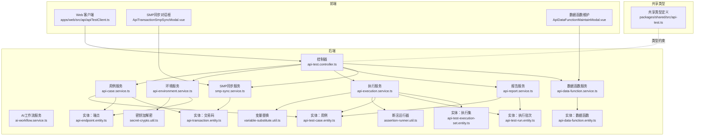
```mermaid
graph TB
subgraph "后端"
Ctl["控制器<br/>api-test.controller.ts"]
SvcCase["用例服务<br/>api-case.service.ts"]
SvcEnv["环境服务<br/>api-environment.service.ts"]
SvcExec["执行服务<br/>api-execution.service.ts"]
SvcReport["报告服务<br/>api-report.service.ts"]
SvcSmp["SMP同步服务<br/>smp-sync.service.ts"]
SvcDataFn["数据函数服务<br/>api-data-function.service.ts"]
SvcAi["AI工作流服务<br/>ai-workflow.service.ts"]
UtilAssert["断言运行器<br/>assertion-runner.util.ts"]
UtilVar["变量替换<br/>variable-substitute.util.ts"]
UtilCrypto["密钥加解密<br/>secret-crypto.util.ts"]
E1["实体：端点<br/>api-endpoint.entity.ts"]
E2["实体：交易码<br/>api-transaction.entity.ts"]
E3["实体：用例<br/>api-test-case.entity.ts"]
E4["实体：执行集<br/>api-test-execution-set.entity.ts"]
E5["实体：执行批次<br/>api-test-run.entity.ts"]
E6["实体：数据函数<br/>api-data-function.entity.ts"]
end
subgraph "共享类型"
Shared["共享类型定义<br/>packages/shared/src/api-test.ts"]
end
subgraph "前端"
Web["Web 客户端<br/>apps/web/src/api/apiTestClient.ts"]
CompSmp["SMP同步对话框<br/>ApiTransactionSmpSyncModal.vue"]
CompDataFn["数据函数维护<br/>ApiDataFunctionMaintainModal.vue"]
end
Web --> Ctl
CompSmp --> SvcSmp
CompDataFn --> SvcDataFn
Ctl --> SvcCase
Ctl --> SvcEnv
Ctl --> SvcExec
Ctl --> SvcReport
Ctl --> SvcSmp
Ctl --> SvcDataFn
SvcExec --> UtilVar
SvcExec --> UtilAssert
SvcEnv --> UtilCrypto
SvcCase --> E3
SvcEnv --> E1
SvcExec --> E3
SvcExec --> E5
SvcReport --> E3
SvcReport --> E5
SvcCase --> E1
SvcCase --> E2
SvcExec --> E4
SvcSmp --> E2
SvcDataFn --> E6
Shared -. 类型约束 .- Ctl
```

**图表来源**
- [apps/api/src/modules/api-test/controller/api-test.controller.ts:1-973](file://apps/api/src/modules/api-test/controller/api-test.controller.ts#L1-L973)
- [apps/api/src/modules/api-test/service/smp-sync.service.ts:1-598](file://apps/api/src/modules/api-test/service/smp-sync.service.ts#L1-L598)
- [apps/api/src/modules/api-test/service/api-data-function.service.ts:1-662](file://apps/api/src/modules/api-test/service/api-data-function.service.ts#L1-L662)
- [apps/web/src/components/api-test/ApiTransactionSmpSyncModal.vue:1-221](file://apps/web/src/components/api-test/ApiTransactionSmpSyncModal.vue#L1-L221)
- [apps/web/src/components/api-test/ApiDataFunctionMaintainModal.vue:1-1175](file://apps/web/src/components/api-test/ApiDataFunctionMaintainModal.vue#L1-L1175)

章节来源
- [apps/api/src/modules/api-test/controller/api-test.controller.ts:1-973](file://apps/api/src/modules/api-test/controller/api-test.controller.ts#L1-L973)
- [apps/web/src/api/apiTestClient.ts:1-498](file://apps/web/src/api/apiTestClient.ts#L1-L498)

## 核心组件
- 控制器层：统一暴露 REST 接口，负责路由、鉴权与参数校验，协调各服务完成业务流程。
- 服务层：
  - 用例服务：管理接口文档、端点与测试用例的生命周期，支持 AI/模板生成用例。
  - 环境服务：管理执行环境与环境服务（多实例），支持变量与密钥合并及加解密。
  - 执行服务：并发调度用例执行，构建请求、发送 HTTP、断言与统计，产出执行批次与明细。
  - 报告服务：聚合统计、过滤按交易码、导出 Excel/PDF。
  - **新增** SMP同步服务：与服务管理平台集成，实现交易码自动同步与文档刷新。
  - **新增** 数据函数服务：提供动态参数生成，支持模板公式、SQL查询、JavaScript和Python脚本。
  - **增强** AI工作流服务：支持需求文档结构化、案例JSON生成与智能提示词优化。
- 工具层：
  - 变量替换：深度递归替换请求中的占位符。
  - 断言运行器：基于状态码、响应体、耗时等规则进行断言。
  - 密钥加解密：基于 AES-256-GCM 的对称加密封装。
- 实体层：以 TypeORM 映射数据库表，建立端点、交易码、用例、执行集、执行批次、数据函数等关系。

章节来源
- [apps/api/src/modules/api-test/service/api-case.service.ts:1-279](file://apps/api/src/modules/api-test/service/api-case.service.ts#L1-L279)
- [apps/api/src/modules/api-test/service/api-environment.service.ts:1-254](file://apps/api/src/modules/api-test/service/api-environment.service.ts#L1-L254)
- [apps/api/src/modules/api-test/service/api-execution.service.ts:1-316](file://apps/api/src/modules/api-test/service/api-execution.service.ts#L1-L316)
- [apps/api/src/modules/api-test/service/api-report.service.ts:1-199](file://apps/api/src/modules/api-test/service/api-report.service.ts#L1-L199)
- [apps/api/src/modules/api-test/service/smp-sync.service.ts:1-598](file://apps/api/src/modules/api-test/service/smp-sync.service.ts#L1-L598)
- [apps/api/src/modules/api-test/service/api-data-function.service.ts:1-662](file://apps/api/src/modules/api-test/service/api-data-function.service.ts#L1-L662)
- [apps/api/src/common/ai-workflow/service/ai-workflow.service.ts:1-619](file://apps/api/src/common/ai-workflow/service/ai-workflow.service.ts#L1-L619)

## 架构总览
下图展示从 Web 前端到后端控制器、服务与工具的调用链路，以及数据在实体间的流转。

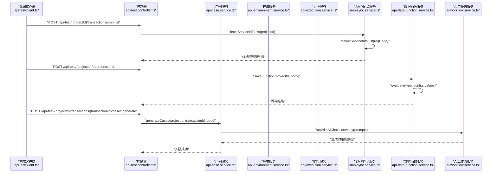
```mermaid
sequenceDiagram
participant FE as "前端客户端<br/>apiTestClient.ts"
participant CTL as "控制器<br/>api-test.controller.ts"
participant SVC_CASE as "用例服务<br/>api-case.service.ts"
participant SVC_ENV as "环境服务<br/>api-environment.service.ts"
participant SVC_EXEC as "执行服务<br/>api-execution.service.ts"
participant SVC_SMP as "SMP同步服务<br/>smp-sync.service.ts"
participant SVC_DATAFN as "数据函数服务<br/>api-data-function.service.ts"
participant SVC_AI as "AI工作流服务<br/>ai-workflow.service.ts"
FE->>CTL : "POST /api-test/{projectId}/transactions/smp-list"
CTL->>SVC_SMP : "fetchServiceInfoList(projectId)"
SVC_SMP->>SVC_SMP : "selectServiceInfoList(reqCode)"
SVC_SMP-->>CTL : "候选交易码列表"
FE->>CTL : "POST /api-test/{projectId}/data-functions"
CTL->>SVC_DATAFN : "saveFunction(projectId, body)"
SVC_DATAFN->>SVC_DATAFN : "evaluate(type, config, values)"
SVC_DATAFN-->>CTL : "保存结果"
FE->>CTL : "POST /api-test/{projectId}/transactions/{transactionId}/cases/generate"
CTL->>SVC_CASE : "generateCases(projectId, transactionId, body)"
SVC_CASE->>SVC_AI : "runWithAiChatJsonArray(prompts)"
SVC_AI-->>SVC_CASE : "生成的用例数组"
SVC_CASE-->>CTL : "入队成功"
```

**图表来源**
- [apps/web/src/api/apiTestClient.ts:437-452](file://apps/web/src/api/apiTestClient.ts#L437-L452)
- [apps/api/src/modules/api-test/controller/api-test.controller.ts:277-290](file://apps/api/src/modules/api-test/controller/api-test.controller.ts#L277-L290)
- [apps/api/src/modules/api-test/controller/api-test.controller.ts:165-193](file://apps/api/src/modules/api-test/controller/api-test.controller.ts#L165-L193)
- [apps/api/src/modules/api-test/controller/api-test.controller.ts:482-494](file://apps/api/src/modules/api-test/controller/api-test.controller.ts#L482-L494)
- [apps/api/src/modules/api-test/service/smp-sync.service.ts:65-83](file://apps/api/src/modules/api-test/service/smp-sync.service.ts#L65-L83)
- [apps/api/src/modules/api-test/service/api-data-function.service.ts:235-263](file://apps/api/src/modules/api-test/service/api-data-function.service.ts#L235-L263)
- [apps/api/src/common/ai-workflow/service/ai-workflow.service.ts:351-390](file://apps/api/src/common/ai-workflow/service/ai-workflow.service.ts#L351-L390)

## 详细组件分析

### 数据模型与实体设计
- 交易码（ApiTransactionEntity）
  - 关键字段：项目标识、交易码 code、名称、描述、排序、审计字段。
  - **新增** 同步状态字段：syncStatus、syncError，用于跟踪SMP同步状态。
  - **新增** SMP关联字段：reqCode、taskId、serviceCode、reqSystemId，用于唯一标识SMP记录。
  - 作用：作为接口文档与端点的归属维度，贯穿用例与执行集。
- 端点（ApiEndpointEntity）
  - 关键字段：所属交易码、项目、方法、路径、标签、排序、摘要与注释。
  - 约束：多端点对应一文档，端点删除级联清理用例。
- 用例（ApiTestCaseEntity）
  - 关键字段：标题、编号、优先级、极性、状态、启用标志、前置条件、请求与期望断言、元数据。
  - 关联：绑定端点，便于按端点/交易码筛选。
- 执行集（ApiTestExecutionSetEntity）
  - 关键字段：名称、描述、启用、最近一次运行统计、审计字段。
  - 作用：将多个用例组织为可复用的执行集合。
- 执行批次（ApiTestRunEntity）
  - 关键字段：环境、执行集、交易码、状态、计数、并发度、起止时间。
  - 关联：一对多明细项（ApiTestRunItemEntity）。
- **新增** 数据函数（ApiDataFunctionEntity）
  - 关键字段：项目名称、函数名、参数列表、类型（template/sql）、配置对象、描述。
  - 支持内置函数与自定义函数，支持JavaScript和Python脚本执行。

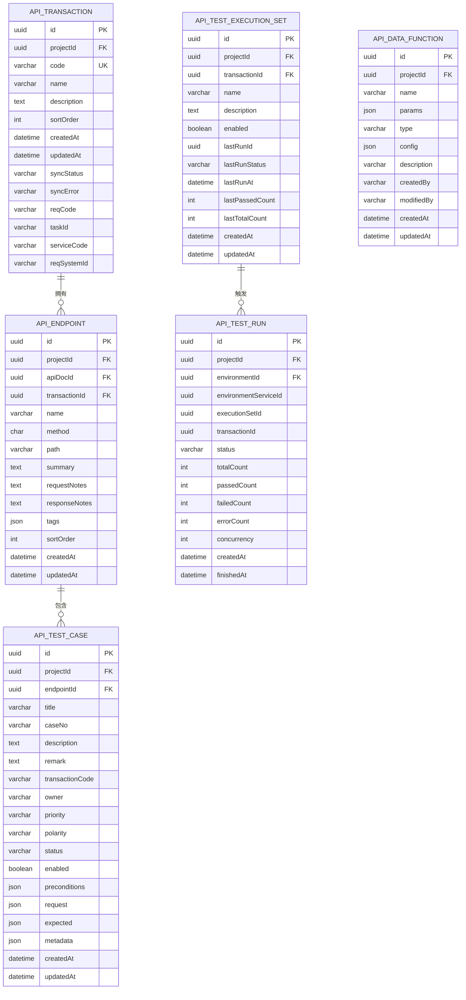
```mermaid
erDiagram
API_TRANSACTION {
uuid id PK
uuid projectId FK
varchar code UK
varchar name
text description
int sortOrder
datetime createdAt
datetime updatedAt
varchar syncStatus
varchar syncError
varchar reqCode
varchar taskId
varchar serviceCode
varchar reqSystemId
}
API_ENDPOINT {
uuid id PK
uuid projectId FK
uuid apiDocId FK
uuid transactionId FK
varchar name
char method
varchar path
text summary
text requestNotes
text responseNotes
json tags
int sortOrder
datetime createdAt
datetime updatedAt
}
API_TEST_CASE {
uuid id PK
uuid projectId FK
uuid endpointId FK
varchar title
varchar caseNo
text description
text remark
varchar transactionCode
varchar owner
varchar priority
varchar polarity
varchar status
boolean enabled
json preconditions
json request
json expected
json metadata
datetime createdAt
datetime updatedAt
}
API_TEST_EXECUTION_SET {
uuid id PK
uuid projectId FK
uuid transactionId FK
varchar name
text description
boolean enabled
uuid lastRunId
varchar lastRunStatus
datetime lastRunAt
int lastPassedCount
int lastTotalCount
datetime createdAt
datetime updatedAt
}
API_TEST_RUN {
uuid id PK
uuid projectId FK
uuid environmentId FK
uuid environmentServiceId
uuid executionSetId
uuid transactionId
varchar status
int totalCount
int passedCount
int failedCount
int errorCount
int concurrency
datetime createdAt
datetime finishedAt
}
API_DATA_FUNCTION {
uuid id PK
uuid projectId FK
varchar name
json params
varchar type
json config
varchar description
varchar createdBy
varchar modifiedBy
datetime createdAt
datetime updatedAt
}
API_TRANSACTION ||--o{ API_ENDPOINT : "拥有"
API_ENDPOINT ||--o{ API_TEST_CASE : "包含"
API_TEST_EXECUTION_SET ||--o{ API_TEST_RUN : "触发"
```

**图表来源**
- [apps/api/src/modules/api-test/entity/api-transaction.entity.ts:1-56](file://apps/api/src/modules/api-test/entity/api-transaction.entity.ts#L1-L56)
- [apps/api/src/modules/api-test/entity/api-endpoint.entity.ts:1-67](file://apps/api/src/modules/api-test/entity/api-endpoint.entity.ts#L1-L67)
- [apps/api/src/modules/api-test/entity/api-test-case.entity.ts:1-95](file://apps/api/src/modules/api-test/entity/api-test-case.entity.ts#L1-L95)
- [apps/api/src/modules/api-test/entity/api-test-execution-set.entity.ts:1-62](file://apps/api/src/modules/api-test/entity/api-test-execution-set.entity.ts#L1-L62)
- [apps/api/src/modules/api-test/entity/api-test-run.entity.ts:1-62](file://apps/api/src/modules/api-test/entity/api-test-run.entity.ts#L1-L62)
- [apps/api/src/modules/api-test/entity/api-data-function.entity.ts:1-27](file://apps/api/src/modules/api-test/entity/api-data-function.entity.ts#L1-L27)

章节来源
- [apps/api/src/modules/api-test/entity/api-transaction.entity.ts:1-56](file://apps/api/src/modules/api-test/entity/api-transaction.entity.ts#L1-L56)
- [apps/api/src/modules/api-test/entity/api-endpoint.entity.ts:1-67](file://apps/api/src/modules/api-test/entity/api-endpoint.entity.ts#L1-L67)
- [apps/api/src/modules/api-test/entity/api-test-case.entity.ts:1-95](file://apps/api/src/modules/api-test/entity/api-test-case.entity.ts#L1-L95)
- [apps/api/src/modules/api-test/entity/api-test-execution-set.entity.ts:1-62](file://apps/api/src/modules/api-test/entity/api-test-execution-set.entity.ts#L1-L62)
- [apps/api/src/modules/api-test/entity/api-test-run.entity.ts:1-62](file://apps/api/src/modules/api-test/entity/api-test-run.entity.ts#L1-L62)
- [apps/api/src/modules/api-test/entity/api-data-function.entity.ts:1-27](file://apps/api/src/modules/api-test/entity/api-data-function.entity.ts#L1-L27)

### 服务管理平台（SMP）集成
- **新增** 交易码同步
  - 从SMP平台拉取交易码候选列表，支持搜索与批量选择。
  - 通过唯一键（reqCode|taskId|serviceCode|reqSystemId|code）避免重复同步。
  - 支持增量更新，保持现有同步状态。
- **新增** 文档刷新与变更检测
  - 定期从SMP拉取服务调用信息与测试信息。
  - 通过哈希对比检测数据变更，标记需要重新生成的交易码。
  - 自动解析并更新端点信息，保持文档与SMP同步。
- **新增** 前端交互
  - SMP同步对话框支持搜索、多选、批量同步。
  - 显示交易码详情、服务编码、响应系统等关键信息。
  - 同步状态反馈与错误处理。

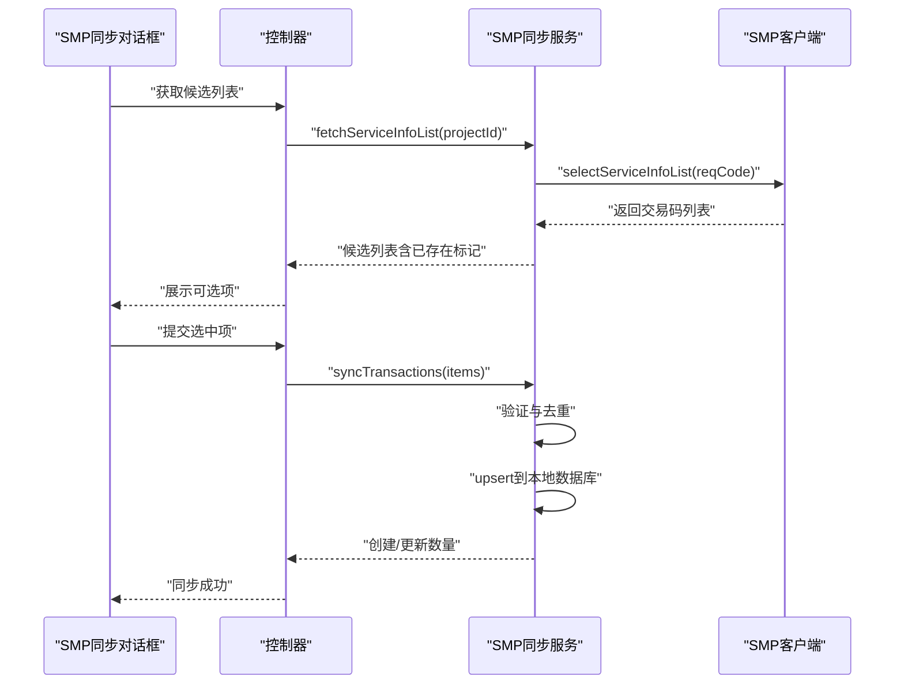
```mermaid
sequenceDiagram
participant UI as "SMP同步对话框"
participant CTRL as "控制器"
participant SMP as "SMP同步服务"
participant CLIENT as "SMP客户端"
UI->>CTRL : "获取候选列表"
CTRL->>SMP : "fetchServiceInfoList(projectId)"
SMP->>CLIENT : "selectServiceInfoList(reqCode)"
CLIENT-->>SMP : "返回交易码列表"
SMP-->>CTRL : "候选列表含已存在标记"
CTRL-->>UI : "展示可选项"
UI->>CTRL : "提交选中项"
CTRL->>SMP : "syncTransactions(items)"
SMP->>SMP : "验证与去重"
SMP->>SMP : "upsert到本地数据库"
SMP-->>CTRL : "创建/更新数量"
CTRL-->>UI : "同步成功"
```

**图表来源**
- [apps/web/src/components/api-test/ApiTransactionSmpSyncModal.vue:131-168](file://apps/web/src/components/api-test/ApiTransactionSmpSyncModal.vue#L131-L168)
- [apps/api/src/modules/api-test/controller/api-test.controller.ts:277-290](file://apps/api/src/modules/api-test/controller/api-test.controller.ts#L277-L290)
- [apps/api/src/modules/api-test/service/smp-sync.service.ts:65-166](file://apps/api/src/modules/api-test/service/smp-sync.service.ts#L65-L166)
- [apps/api/src/modules/api-test/service/smp-client.service.ts:135-168](file://apps/api/src/modules/api-test/service/smp-client.service.ts#L135-L168)

章节来源
- [apps/api/src/modules/api-test/service/smp-sync.service.ts:1-598](file://apps/api/src/modules/api-test/service/smp-sync.service.ts#L1-L598)
- [apps/api/src/modules/api-test/service/smp-client.service.ts:1-280](file://apps/api/src/modules/api-test/service/smp-client.service.ts#L1-L280)
- [apps/web/src/components/api-test/ApiTransactionSmpSyncModal.vue:1-221](file://apps/web/src/components/api-test/ApiTransactionSmpSyncModal.vue#L1-L221)

### 数据函数系统
- **新增** 函数类型支持
  - 模板函数：可视化公式构建器，支持文本拼接、时间戳、随机数、UUID等。
  - SQL函数：安全查询数据库，仅允许SELECT语句，支持参数绑定。
  - 脚本函数：支持JavaScript和Python脚本，提供安全沙箱执行环境。
- **新增** 内置函数库
  - 日期时间函数：DATE_YYYYMMDD、DATETIME_YYYYMMDDHHMMSS、TIMESTAMP_MS。
  - 标识符函数：UUID、RANDOM_4等常用生成器。
  - 算术运算：支持加减乘除等数学操作。
- **新增** 安全执行机制
  - JavaScript：限制为标准函数形式，禁止危险操作。
  - Python：限制import语句，仅允许datetime和random模块。
  - 超时保护：脚本执行限制2秒，防止无限循环。
  - 输出限制：限制输出大小，防止内存溢出。
- **新增** 前端维护界面
  - 函数列表管理，支持新建、编辑、删除。
  - 可视化公式构建器，实时预览结果。
  - 脚本编辑器，支持语法高亮与AI辅助生成。
  - 数据库连接管理，支持多种数据库类型。

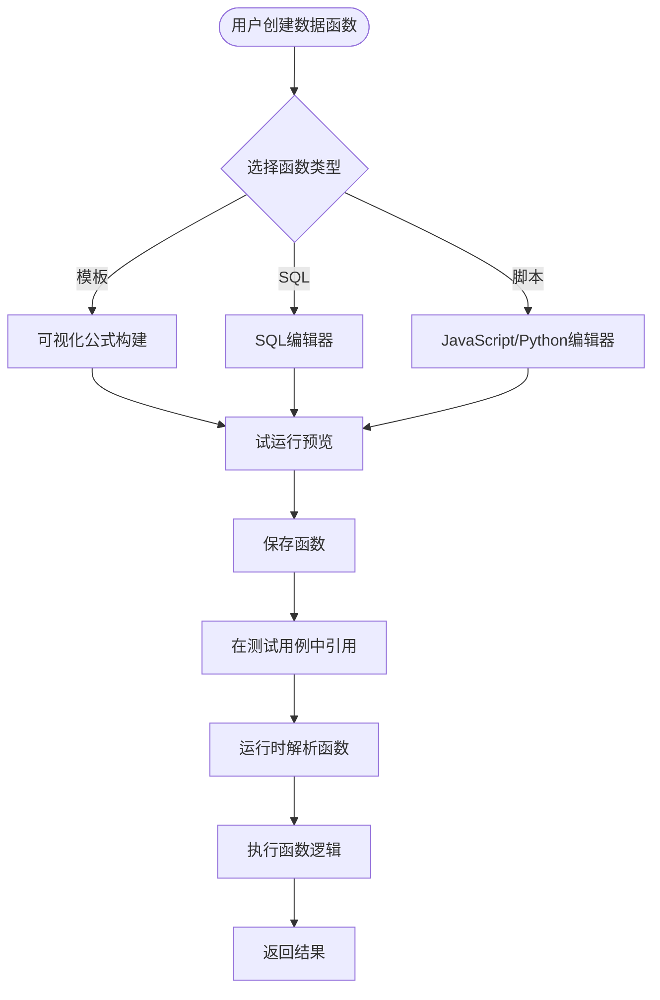
```mermaid
flowchart TD
Start(["用户创建数据函数"]) --> Type{"选择函数类型"}
Type --> |模板| Builder["可视化公式构建"]
Type --> |SQL| SqlEditor["SQL编辑器"]
Type --> |脚本| ScriptEditor["JavaScript/Python编辑器"]
Builder --> Preview["试运行预览"]
SqlEditor --> Preview
ScriptEditor --> Preview
Preview --> Save["保存函数"]
Save --> Use["在测试用例中引用"]
Use --> Resolve["运行时解析函数"]
Resolve --> Execute["执行函数逻辑"]
Execute --> Result["返回结果"]
```

**图表来源**
- [apps/web/src/components/api-test/ApiDataFunctionMaintainModal.vue:88-147](file://apps/web/src/components/api-test/ApiDataFunctionMaintainModal.vue#L88-L147)
- [apps/api/src/modules/api-test/service/api-data-function.service.ts:235-356](file://apps/api/src/modules/api-test/service/api-data-function.service.ts#L235-L356)
- [apps/api/src/modules/api-test/service/api-data-function.service.ts:372-440](file://apps/api/src/modules/api-test/service/api-data-function.service.ts#L372-L440)

章节来源
- [apps/api/src/modules/api-test/service/api-data-function.service.ts:1-662](file://apps/api/src/modules/api-test/service/api-data-function.service.ts#L1-L662)
- [apps/web/src/components/api-test/ApiDataFunctionMaintainModal.vue:1-1175](file://apps/web/src/components/api-test/ApiDataFunctionMaintainModal.vue#L1-L1175)

### AI驱动测试用例生成增强
- **增强** 需求文档结构化
  - 支持从Word、Excel等文档提取需求内容。
  - 使用AI对需求进行结构化分析，生成标准化Markdown。
  - 支持技能文档（skill）定制化处理流程。
- **增强** 案例JSON生成
  - 基于结构化需求生成测试要点和测试用例。
  - 支持并发处理多个测试要点，提高生成效率。
  - 内置重试机制，处理AI响应解析失败情况。
  - 支持中文标点规范化，提高JSON解析成功率。
- **增强** 前端工作区
  - 沉浸式工作区体验，支持全屏模式。
  - 实时进度显示与取消功能。
  - 生成历史版本管理，支持回滚与对比。

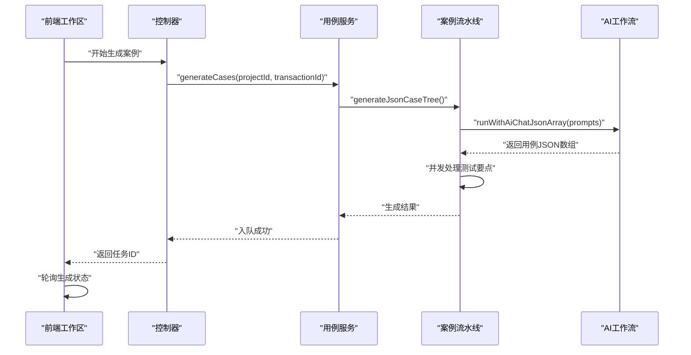
```mermaid
sequenceDiagram
participant FE as "前端工作区"
participant CTRL as "控制器"
participant CASE as "用例服务"
participant PIPELINE as "案例流水线"
participant AI as "AI工作流"
FE->>CTRL : "开始生成案例"
CTRL->>CASE : "generateCases(projectId, transactionId)"
CASE->>PIPELINE : "generateJsonCaseTree()"
PIPELINE->>AI : "runWithAiChatJsonArray(prompts)"
AI-->>PIPELINE : "返回用例JSON数组"
PIPELINE->>PIPELINE : "并发处理测试要点"
PIPELINE-->>CASE : "生成结果"
CASE-->>CTRL : "入队成功"
CTRL-->>FE : "返回任务ID"
FE->>FE : "轮询生成状态"
```

**图表来源**
- [apps/api/src/modules/case-editor/service/case-pipeline.service.ts:165-197](file://apps/api/src/modules/case-editor/service/case-pipeline.service.ts#L165-L197)
- [apps/api/src/common/ai-workflow/service/ai-workflow.service.ts:351-390](file://apps/api/src/common/ai-workflow/service/ai-workflow.service.ts#L351-L390)
- [apps/web/src/views/ApiTestDashboardView.vue:28-100](file://apps/web/src/views/ApiTestDashboardView.vue#L28-L100)

章节来源
- [apps/api/src/common/ai-workflow/service/ai-workflow.service.ts:1-619](file://apps/api/src/common/ai-workflow/service/ai-workflow.service.ts#L1-L619)
- [apps/api/src/modules/case-editor/service/case-pipeline.service.ts:49-209](file://apps/api/src/modules/case-editor/service/case-pipeline.service.ts#L49-L209)
- [apps/web/src/views/ApiTestDashboardView.vue:28-100](file://apps/web/src/views/ApiTestDashboardView.vue#L28-L100)

### 环境变量管理与密钥加密存储
- 运行时环境构建
  - 合并基础环境变量与服务级变量/头/路径前缀；支持默认环境与多服务叠加。
- 密钥加解密
  - 使用 AES-256-GCM 对称加密，密钥派生自应用密钥或环境变量；密文以 Base64 存储。
- 变量替换
  - 支持 {{var}} 与 {var} 两种语法，深层递归替换请求体、查询、路径与头。
- 敏感信息脱敏
  - 在请求快照中对 Authorization、Token、Secret 等头进行掩码显示。

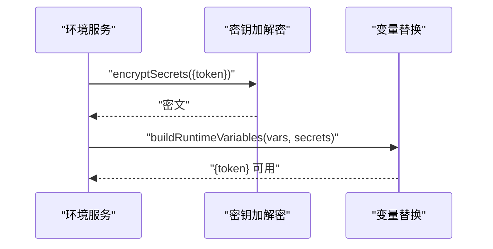
```mermaid
sequenceDiagram
participant ENV as "环境服务"
participant SEC as "密钥加解密"
participant VAR as "变量替换"
ENV->>SEC : "encryptSecrets({token})"
SEC-->>ENV : "密文"
ENV->>VAR : "buildRuntimeVariables(vars, secrets)"
VAR-->>ENV : "{token} 可用"
```

**图表来源**
- [apps/api/src/modules/api-test/service/api-environment.service.ts:92-135](file://apps/api/src/modules/api-test/service/api-environment.service.ts#L92-L135)
- [apps/api/src/modules/api-test/util/secret-crypto.util.ts:14-41](file://apps/api/src/modules/api-test/util/secret-crypto.util.ts#L14-L41)
- [apps/api/src/modules/api-test/util/variable-substitute.util.ts:33-42](file://apps/api/src/modules/api-test/util/variable-substitute.util.ts#L33-L42)

章节来源
- [apps/api/src/modules/api-test/service/api-environment.service.ts:92-135](file://apps/api/src/modules/api-test/service/api-environment.service.ts#L92-L135)
- [apps/api/src/modules/api-test/util/secret-crypto.util.ts:14-41](file://apps/api/src/modules/api-test/util/secret-crypto.util.ts#L14-L41)
- [apps/api/src/modules/api-test/util/variable-substitute.util.ts:1-43](file://apps/api/src/modules/api-test/util/variable-substitute.util.ts#L1-L43)

### 断言执行引擎
- 断言类型
  - 状态码：支持单值或数组匹配；可配置最大响应时间阈值。
  - 响应体：jsonPath、equals、contains、matches 等。
- 执行流程
  - 统计耗时，解析响应体（尝试 JSON 解析），逐条断言，汇总结果。
- 结果判定
  - 全部断言通过才视为"通过"，否则"失败"。

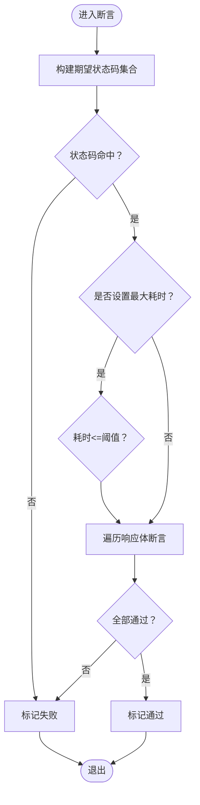
```mermaid
flowchart TD
Enter(["进入断言"]) --> BuildCodes["构建期望状态码集合"]
BuildCodes --> StatusOK{"状态码命中？"}
StatusOK --> |否| Fail["标记失败"]
StatusOK --> |是| DurationChk{"是否设置最大耗时？"}
DurationChk --> |是| DurPass{"耗时<=阈值？"} --> BodyChk
DurationChk --> |否| BodyChk["遍历响应体断言"]
BodyChk --> BodyPass{"全部通过？"}
BodyPass --> |是| Pass["标记通过"]
BodyPass --> |否| Fail
Fail --> Exit(["退出"])
Pass --> Exit
```

**图表来源**
- [apps/api/src/modules/api-test/util/assertion-runner.util.ts:62-97](file://apps/api/src/modules/api-test/util/assertion-runner.util.ts#L62-L97)

章节来源
- [apps/api/src/modules/api-test/util/assertion-runner.util.ts:1-102](file://apps/api/src/modules/api-test/util/assertion-runner.util.ts#L1-L102)

### 测试执行与并发控制
- 并发策略
  - 默认并发 5，上限 10；每个并发 worker 顺序取用待执行用例，保证公平调度。
- 超时与错误
  - 单次请求超时 30 秒；异常捕获后记录错误断言与错误信息。
- 请求构建
  - GET/HEAD 自动忽略 Body；非字符串 Body 序列化为 JSON；路径变量替换；查询参数拼接；头合并与敏感头掩码。
- 执行集编排
  - 通过执行集一次性拉取用例集合，执行完成后更新执行集的最近运行统计。

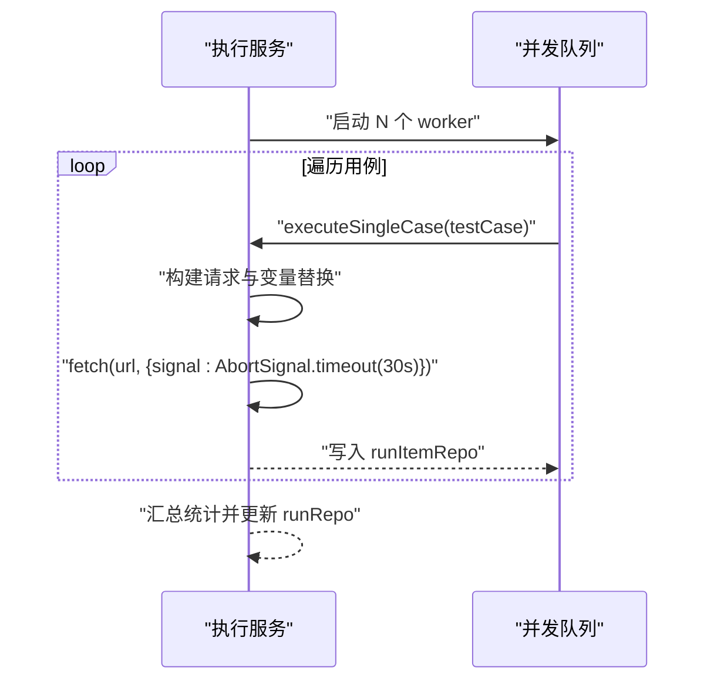
```mermaid
sequenceDiagram
participant EXEC as "执行服务"
participant Q as "并发队列"
EXEC->>Q : "启动 N 个 worker"
loop 遍历用例
Q->>EXEC : "executeSingleCase(testCase)"
EXEC->>EXEC : "构建请求与变量替换"
EXEC->>EXEC : "fetch(url, {signal : AbortSignal.timeout(30s)})"
EXEC-->>Q : "写入 runItemRepo"
end
EXEC-->>EXEC : "汇总统计并更新 runRepo"
```

**图表来源**
- [apps/api/src/modules/api-test/service/api-execution.service.ts:272-286](file://apps/api/src/modules/api-test/service/api-execution.service.ts#L272-L286)
- [apps/api/src/modules/api-test/service/api-execution.service.ts:179-270](file://apps/api/src/modules/api-test/service/api-execution.service.ts#L179-L270)

章节来源
- [apps/api/src/modules/api-test/service/api-execution.service.ts:22-286](file://apps/api/src/modules/api-test/service/api-execution.service.ts#L22-L286)

### 测试报告与可视化
- 统计概览
  - 总数、通过、失败、错误、通过率、起止时间、并发度等。
- 明细导出
  - Excel：包含批次、计数、并发、时间、明细（案例、状态、耗时、URL、HTTP、断言摘要）。
  - PDF：包含批次、计数、通过率、并发、失败与错误案例及其断言详情。
- 按交易码过滤
  - 将执行集/批次限定在特定交易码对应的端点与用例范围内。

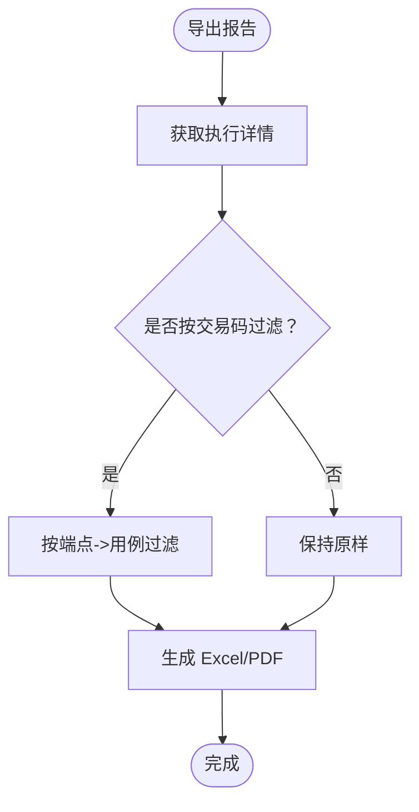
```mermaid
flowchart TD
Start(["导出报告"]) --> FetchRun["获取执行详情"]
FetchRun --> Filter{"是否按交易码过滤？"}
Filter --> |是| ByTx["按端点->用例过滤"]
Filter --> |否| Keep["保持原样"]
ByTx --> Export["生成 Excel/PDF"]
Keep --> Export
Export --> Done(["完成"])
```

**图表来源**
- [apps/api/src/modules/api-test/service/api-report.service.ts:63-121](file://apps/api/src/modules/api-test/service/api-report.service.ts#L63-L121)
- [apps/api/src/modules/api-test/service/api-report.service.ts:123-197](file://apps/api/src/modules/api-test/service/api-report.service.ts#L123-L197)

章节来源
- [apps/api/src/modules/api-test/service/api-report.service.ts:1-199](file://apps/api/src/modules/api-test/service/api-report.service.ts#L1-L199)

### API 接口规范与错误码
- 通用响应
  - 成功：2xx；错误：4xx/5xx；部分接口返回 { ok: true } 表示操作成功。
- 重要错误码
  - 400：参数缺失或非法（如未选择案例、未找到可执行案例、缺少状态码配置等）。
  - 404：资源不存在（环境、服务、用例、执行记录等）。
  - 500：内部错误（如断言引擎异常、导出失败等）。
- 关键接口（节选）
  - 交易码管理：列出、创建、更新、删除、批量删除。
  - **新增** SMP集成：获取候选列表、同步交易码、刷新文档。
  - **新增** 数据函数：管理连接、函数CRUD、预览执行。
  - 文档管理：上传、结构化、获取、自动保存、保存。
  - 用例管理：列出、创建、更新、删除、生成。
  - 环境管理：列出、创建、更新、删除、服务管理。
  - 执行集：列出、创建、更新、删除、替换用例、运行。
  - 执行：运行用例、运行执行集、列出批次、获取批次详情。
  - 报告：概览、导出。

章节来源
- [apps/api/src/modules/api-test/controller/api-test.controller.ts:70-973](file://apps/api/src/modules/api-test/controller/api-test.controller.ts#L70-L973)
- [apps/web/src/api/apiTestClient.ts:149-498](file://apps/web/src/api/apiTestClient.ts#L149-L498)
- [packages/shared/src/api-test.ts:1-69](file://packages/shared/src/api-test.ts#L1-L69)

## 依赖关系分析
- 控制器依赖服务，服务间通过领域边界清晰分离：用例、环境、执行、报告。
- 执行服务依赖变量替换与断言运行器，形成"请求构建—断言—统计"的闭环。
- 环境服务依赖密钥加解密工具，保障密文安全。
- **新增** SMP同步服务依赖SMP客户端，实现与服务管理平台的通信。
- **新增** 数据函数服务支持多种数据库驱动和脚本语言执行。
- **增强** AI工作流服务提供需求结构化与案例生成能力。
- 实体层通过外键与索引维护一致性与查询效率。

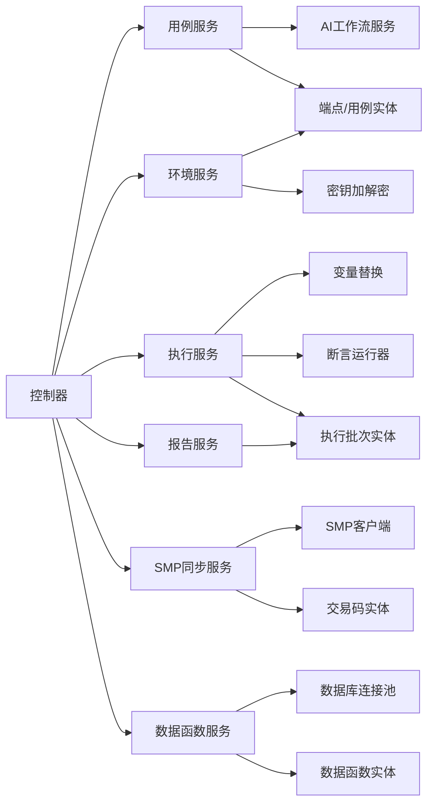
```mermaid
graph LR
CTL["控制器"] --> SVC_CASE["用例服务"]
CTL --> SVC_ENV["环境服务"]
CTL --> SVC_EXEC["执行服务"]
CTL --> SVC_REPORT["报告服务"]
CTL --> SVC_SMP["SMP同步服务"]
CTL --> SVC_DATAFN["数据函数服务"]
SVC_EXEC --> UTIL_VAR["变量替换"]
SVC_EXEC --> UTIL_ASSERT["断言运行器"]
SVC_ENV --> UTIL_CRYPTO["密钥加解密"]
SVC_SMP --> SMP_CLIENT["SMP客户端"]
SVC_DATAFN --> DB_POOLS["数据库连接池"]
SVC_CASE --> SVC_AI["AI工作流服务"]
SVC_CASE --> E1["端点/用例实体"]
SVC_ENV --> E1
SVC_EXEC --> E2["执行批次实体"]
SVC_REPORT --> E2
SVC_SMP --> E3["交易码实体"]
SVC_DATAFN --> E4["数据函数实体"]
```

**图表来源**
- [apps/api/src/modules/api-test/controller/api-test.controller.ts:57-95](file://apps/api/src/modules/api-test/controller/api-test.controller.ts#L57-L95)
- [apps/api/src/modules/api-test/service/api-execution.service.ts:27-36](file://apps/api/src/modules/api-test/service/api-execution.service.ts#L27-L36)
- [apps/api/src/modules/api-test/service/api-environment.service.ts:22-27](file://apps/api/src/modules/api-test/service/api-environment.service.ts#L22-L27)
- [apps/api/src/modules/api-test/service/smp-sync.service.ts:48-60](file://apps/api/src/modules/api-test/service/smp-sync.service.ts#L48-L60)
- [apps/api/src/modules/api-test/service/api-data-function.service.ts:115-120](file://apps/api/src/modules/api-test/service/api-data-function.service.ts#L115-L120)

章节来源
- [apps/api/src/modules/api-test/controller/api-test.controller.ts:1-973](file://apps/api/src/modules/api-test/controller/api-test.controller.ts#L1-L973)
- [apps/api/src/modules/api-test/service/api-execution.service.ts:1-316](file://apps/api/src/modules/api-test/service/api-execution.service.ts#L1-L316)
- [apps/api/src/modules/api-test/service/api-environment.service.ts:1-254](file://apps/api/src/modules/api-test/service/api-environment.service.ts#L1-L254)
- [apps/api/src/modules/api-test/service/api-report.service.ts:1-199](file://apps/api/src/modules/api-test/service/api-report.service.ts#L1-L199)
- [apps/api/src/modules/api-test/service/smp-sync.service.ts:1-598](file://apps/api/src/modules/api-test/service/smp-sync.service.ts#L1-L598)
- [apps/api/src/modules/api-test/service/api-data-function.service.ts:1-662](file://apps/api/src/modules/api-test/service/api-data-function.service.ts#L1-L662)

## 性能考量
- 并发度：默认 5，最大 10，避免对目标系统造成瞬时压力；可根据环境容量动态调整。
- 超时控制：单请求 30 秒超时，防止长时间阻塞；建议结合重试与熔断策略。
- **新增** SMP集成性能：支持demo模式，减少开发环境对外部系统的依赖。
- **新增** 数据函数执行：脚本执行限制2秒，防止无限循环；数据库查询限制10秒。
- **增强** AI生成性能：支持并发处理多个测试要点，提高整体生成效率。
- 日志与监控：建议在控制器与服务层增加关键指标埋点（吞吐、P95/P99、错误分布）。
- 导出性能：Excel/PDF 导出为 CPU 密集型任务，建议异步化并在前端轮询结果。

## 故障排查指南
- 常见问题
  - "未找到可执行的启用案例"：检查用例启用状态与项目权限范围。
  - "执行环境不存在或已禁用"：确认环境与服务存在且启用。
  - "断言未通过"：查看失败断言名称与期望/实际值，定位响应体或状态码配置。
  - "请求失败"：检查网络连通、超时设置与服务端错误日志。
  - **新增** "SMP同步失败"：检查SMP配置、网络连接与权限设置。
  - **新增** "数据函数执行错误"：检查脚本语法、数据库连接与权限配置。
  - **增强** "AI生成失败"：检查AI服务配置、网络连通与输入数据质量。
- 排查步骤
  - 从执行批次详情入手，核对请求快照与响应快照。
  - 使用报告过滤交易码，缩小问题范围。
  - 检查环境服务叠加后的 baseUrl、headers 与变量是否正确。
  - **新增** 检查SMP同步状态与错误信息。
  - **新增** 验证数据函数配置与数据库连接。
  - **增强** 查看AI生成历史记录与错误日志。

章节来源
- [apps/api/src/modules/api-test/service/api-execution.service.ts:47-69](file://apps/api/src/modules/api-test/service/api-execution.service.ts#L47-L69)
- [apps/api/src/modules/api-test/service/api-environment.service.ts:216-224](file://apps/api/src/modules/api-test/service/api-environment.service.ts#L216-L224)
- [apps/api/src/modules/api-test/util/assertion-runner.util.ts:53-59](file://apps/api/src/modules/api-test/util/assertion-runner.util.ts#L53-L59)
- [apps/api/src/modules/api-test/service/smp-sync.service.ts:171-186](file://apps/api/src/modules/api-test/service/smp-sync.service.ts#L171-L186)
- [apps/api/src/modules/api-test/service/api-data-function.service.ts:372-440](file://apps/api/src/modules/api-test/service/api-data-function.service.ts#L372-L440)

## 结论
该模块以清晰的分层架构实现了从接口文档到测试用例、从环境管理到执行与报告的全链路能力。通过可插拔的环境服务、强健的断言引擎与并发执行策略，满足了不同规模项目的 API 测试需求。**重大增强**包括：

- **服务管理平台（SMP）集成**：实现了与企业服务治理平台的无缝对接，支持交易码自动同步与文档实时更新。
- **数据函数系统**：提供了灵活的动态参数生成能力，支持多种数据源和执行方式。
- **AI驱动测试生成**：显著提升了测试用例生成的智能化水平，支持复杂需求的自动化处理。
- **前端体验优化**：提供了直观的界面操作，降低了用户使用门槛。

建议后续在异步导出、指标监控与重试策略方面进一步增强，同时持续优化AI生成质量和SMP集成稳定性。

## 附录
- 前端调用参考
  - 列举交易码、文档、用例、环境、执行集、执行批次与报告导出等均通过统一客户端封装。
  - **新增** SMP同步和数据函数管理的API调用示例。
- 类型定义参考
  - 包含用例优先级、极性、状态、断言类型、请求/期望结构等，前后端一致约束。
  - **新增** SMP相关类型定义和数据函数配置结构。

章节来源
- [apps/web/src/api/apiTestClient.ts:149-498](file://apps/web/src/api/apiTestClient.ts#L149-L498)
- [packages/shared/src/api-test.ts:1-69](file://packages/shared/src/api-test.ts#L1-L69)
- [apps/api/src/modules/api-test/service/smp-client.service.ts:10-94](file://apps/api/src/modules/api-test/service/smp-client.service.ts#L10-L94)
- [apps/api/src/modules/api-test/dto/save-data-function.dto.ts:1-50](file://apps/api/src/modules/api-test/dto/save-data-function.dto.ts#L1-L50)