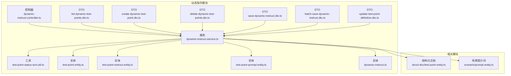
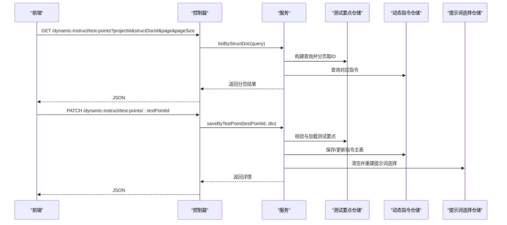
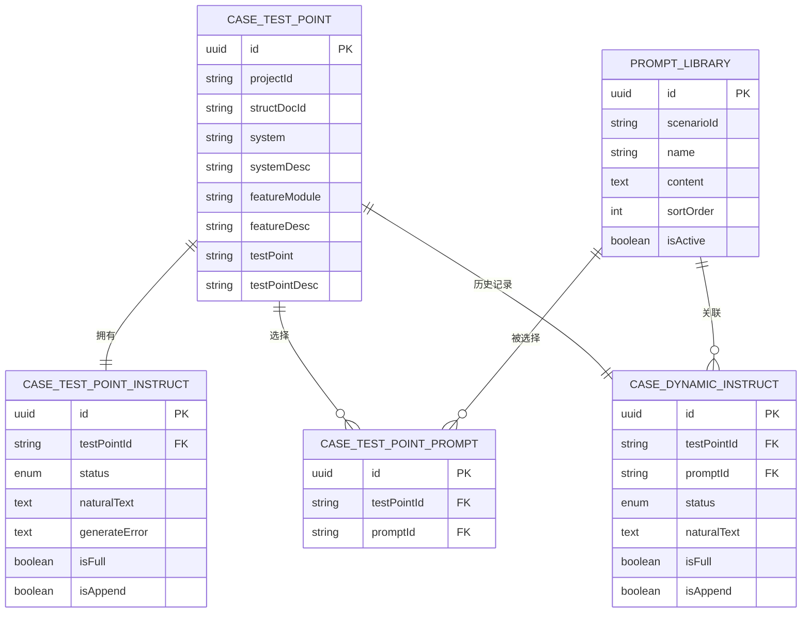
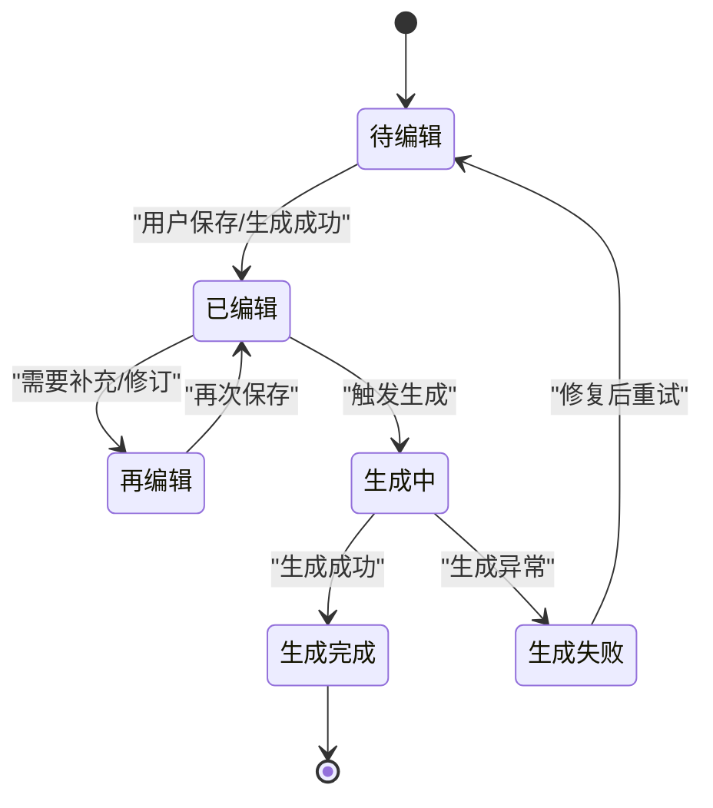
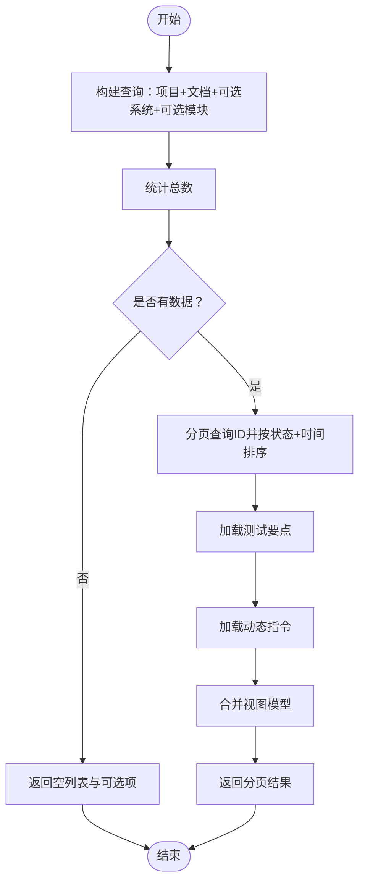
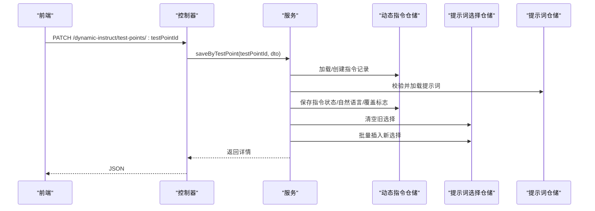
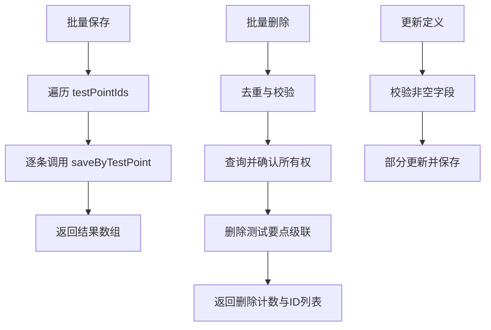
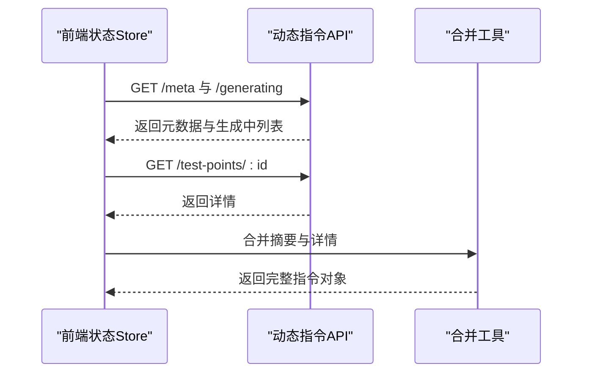
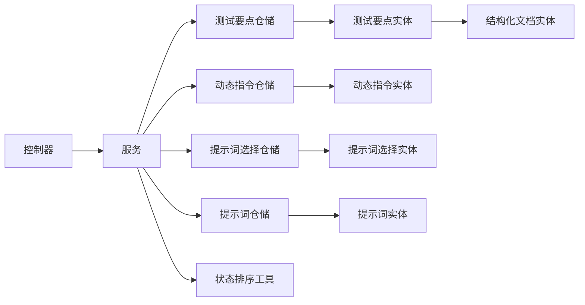

# 动态指令模块

<cite>
**本文引用的文件**
- [apps/api/src/modules/dynamic-instruct/controller/dynamic-instruct.controller.ts](file://apps/api/src/modules/dynamic-instruct/controller/dynamic-instruct.controller.ts)
- [apps/api/src/modules/dynamic-instruct/service/dynamic-instruct.service.ts](file://apps/api/src/modules/dynamic-instruct/service/dynamic-instruct.service.ts)
- [apps/api/src/modules/dynamic-instruct/entity/test-point-instruct.entity.ts](file://apps/api/src/modules/dynamic-instruct/entity/test-point-instruct.entity.ts)
- [apps/api/src/modules/dynamic-instruct/entity/test-point-prompt.entity.ts](file://apps/api/src/modules/dynamic-instruct/entity/test-point-prompt.entity.ts)
- [apps/api/src/modules/dynamic-instruct/entity/dynamic-instruct.ts](file://apps/api/src/modules/dynamic-instruct/entity/dynamic-instruct.ts)
- [apps/api/src/modules/dynamic-instruct/dto/list-dynamic-test-points.dto.ts](file://apps/api/src/modules/dynamic-instruct/dto/list-dynamic-test-points.dto.ts)
- [apps/api/src/modules/dynamic-instruct/dto/create-dynamic-test-point.dto.ts](file://apps/api/src/modules/dynamic-instruct/dto/create-dynamic-test-point.dto.ts)
- [apps/api/src/modules/dynamic-instruct/dto/delete-dynamic-test-points.dto.ts](file://apps/api/src/modules/dynamic-instruct/dto/delete-dynamic-test-points.dto.ts)
- [apps/api/src/modules/dynamic-instruct/dto/save-dynamic-instruct.dto.ts](file://apps/api/src/modules/dynamic-instruct/dto/save-dynamic-instruct.dto.ts)
- [apps/api/src/modules/dynamic-instruct/dto/batch-save-dynamic-instruct.dto.ts](file://apps/api/src/modules/dynamic-instruct/dto/batch-save-dynamic-instruct.dto.ts)
- [apps/api/src/modules/dynamic-instruct/dto/update-test-point-definition.dto.ts](file://apps/api/src/modules/dynamic-instruct/dto/update-test-point-definition.dto.ts)
- [apps/api/src/modules/dynamic-instruct/util/test-point-status-sort.util.ts](file://apps/api/src/modules/dynamic-instruct/util/test-point-status-sort.util.ts)
- [apps/api/src/modules/struct-doc/entity/test-point.entity.ts](file://apps/api/src/modules/struct-doc/entity/test-point.entity.ts)
- [apps/api/src/modules/scenario/entity/prompt.entity.ts](file://apps/api/src/modules/scenario/entity/prompt.entity.ts)
- [apps/web/src/stores/caseForge.ts](file://apps/web/src/stores/caseForge.ts)
- [apps/web/src/utils/testPointMerge.ts](file://apps/web/src/utils/testPointMerge.ts)
</cite>

## 目录
1. [简介](#简介)
2. [项目结构](#项目结构)
3. [核心组件](#核心组件)
4. [架构总览](#架构总览)
5. [详细组件分析](#详细组件分析)
6. [依赖分析](#依赖分析)
7. [性能考虑](#性能考虑)
8. [故障排查指南](#故障排查指南)
9. [结论](#结论)
10. [附录](#附录)

## 简介
本模块围绕“动态指令”能力，提供基于测试要点（Test Point）的智能指令生成与管理机制。其核心目标是：
- 将结构化文档中的测试要点与场景提示词（Prompt）进行关联，形成可编辑、可追踪的动态指令。
- 支持测试要点的新增、更新、删除、批量保存、列表查询与筛选。
- 提供状态管理（如“生成中/生成完成/生成失败/待编辑/已编辑/再编辑”）与排序算法，确保任务流与执行顺序可控。
- 通过自然语言约束与提示词集合，驱动后续的自动化案例生成与执行。

该模块采用“控制器-服务-实体-DTO-工具”的分层设计，结合数据库实体关系与前端工作区状态管理，实现从“测试要点定义”到“动态指令详情”的完整闭环。

## 项目结构
动态指令模块位于后端 NestJS 应用的 modules 下，包含控制器、服务、实体、DTO、工具等子模块，并与结构化文档与场景提示词模块存在跨模块依赖。

图表来源
- [apps/api/src/modules/dynamic-instruct/controller/dynamic-instruct.controller.ts:1-108](file://apps/api/src/modules/dynamic-instruct/controller/dynamic-instruct.controller.ts#L1-L108)
- [apps/api/src/modules/dynamic-instruct/service/dynamic-instruct.service.ts:1-474](file://apps/api/src/modules/dynamic-instruct/service/dynamic-instruct.service.ts#L1-L474)
- [apps/api/src/modules/dynamic-instruct/entity/test-point-instruct.entity.ts:1-87](file://apps/api/src/modules/dynamic-instruct/entity/test-point-instruct.entity.ts#L1-L87)
- [apps/api/src/modules/dynamic-instruct/entity/test-point-prompt.entity.ts:1-63](file://apps/api/src/modules/dynamic-instruct/entity/test-point-prompt.entity.ts#L1-L63)
- [apps/api/src/modules/dynamic-instruct/entity/dynamic-instruct.ts:1-68](file://apps/api/src/modules/dynamic-instruct/entity/dynamic-instruct.ts#L1-L68)
- [apps/api/src/modules/struct-doc/entity/test-point.entity.ts:1-119](file://apps/api/src/modules/struct-doc/entity/test-point.entity.ts#L1-L119)
- [apps/api/src/modules/scenario/entity/prompt.entity.ts:1-97](file://apps/api/src/modules/scenario/entity/prompt.entity.ts#L1-L97)

章节来源
- [apps/api/src/modules/dynamic-instruct/controller/dynamic-instruct.controller.ts:1-108](file://apps/api/src/modules/dynamic-instruct/controller/dynamic-instruct.controller.ts#L1-L108)
- [apps/api/src/modules/dynamic-instruct/service/dynamic-instruct.service.ts:1-474](file://apps/api/src/modules/dynamic-instruct/service/dynamic-instruct.service.ts#L1-L474)

## 核心组件
- 控制器：提供 REST API，负责接收请求、参数校验与响应封装。
- 服务：实现业务逻辑，包括测试要点与动态指令的查询、保存、批量保存、删除、状态计算与排序。
- 实体：定义数据库表结构与关系，包括测试要点、动态指令主表、提示词选择中间表以及历史表。
- DTO：定义请求与响应的数据结构与验证规则。
- 工具：提供状态排序与比较的辅助方法。

章节来源
- [apps/api/src/modules/dynamic-instruct/service/dynamic-instruct.service.ts:52-474](file://apps/api/src/modules/dynamic-instruct/service/dynamic-instruct.service.ts#L52-L474)
- [apps/api/src/modules/dynamic-instruct/entity/test-point-instruct.entity.ts:1-87](file://apps/api/src/modules/dynamic-instruct/entity/test-point-instruct.entity.ts#L1-L87)
- [apps/api/src/modules/dynamic-instruct/entity/test-point-prompt.entity.ts:1-63](file://apps/api/src/modules/dynamic-instruct/entity/test-point-prompt.entity.ts#L1-L63)
- [apps/api/src/modules/dynamic-instruct/entity/dynamic-instruct.ts:1-68](file://apps/api/src/modules/dynamic-instruct/entity/dynamic-instruct.ts#L1-L68)
- [apps/api/src/modules/dynamic-instruct/util/test-point-status-sort.util.ts:1-32](file://apps/api/src/modules/dynamic-instruct/util/test-point-status-sort.util.ts#L1-L32)

## 架构总览
动态指令模块遵循典型的三层架构：
- 表现层：控制器暴露 HTTP 接口，处理分页、筛选、批量操作等。
- 领域层：服务聚合仓储与工具，实现复杂业务流程与状态机。
- 数据持久层：实体与仓储负责数据读写与关系维护。

图表来源
- [apps/api/src/modules/dynamic-instruct/controller/dynamic-instruct.controller.ts:56-86](file://apps/api/src/modules/dynamic-instruct/controller/dynamic-instruct.controller.ts#L56-L86)
- [apps/api/src/modules/dynamic-instruct/service/dynamic-instruct.service.ts:70-140](file://apps/api/src/modules/dynamic-instruct/service/dynamic-instruct.service.ts#L70-L140)
- [apps/api/src/modules/dynamic-instruct/service/dynamic-instruct.service.ts:323-383](file://apps/api/src/modules/dynamic-instruct/service/dynamic-instruct.service.ts#L323-L383)

## 详细组件分析

### 数据模型与关系
动态指令涉及三类核心实体及其关系：
- 测试要点（TestPoint）：承载系统、模块、测试要点文本等基础定义。
- 测试要点动态指令（TestPointInstruct）：与测试要点一对一，记录状态、自然语言、全量/追加标志等。
- 测试要点提示词选择（TestPointPrompt）：多对多中间表，记录测试要点勾选的场景提示词。
- 历史动态指令（DynamicInstruct）：与测试要点一对一，历史表用于记录历史版本或归档。

图表来源
- [apps/api/src/modules/dynamic-instruct/entity/test-point-instruct.entity.ts:32-86](file://apps/api/src/modules/dynamic-instruct/entity/test-point-instruct.entity.ts#L32-L86)
- [apps/api/src/modules/dynamic-instruct/entity/test-point-prompt.entity.ts:20-62](file://apps/api/src/modules/dynamic-instruct/entity/test-point-prompt.entity.ts#L20-L62)
- [apps/api/src/modules/dynamic-instruct/entity/dynamic-instruct.ts:11-67](file://apps/api/src/modules/dynamic-instruct/entity/dynamic-instruct.ts#L11-L67)
- [apps/api/src/modules/struct-doc/entity/test-point.entity.ts:23-119](file://apps/api/src/modules/struct-doc/entity/test-point.entity.ts#L23-L119)
- [apps/api/src/modules/scenario/entity/prompt.entity.ts:22-96](file://apps/api/src/modules/scenario/entity/prompt.entity.ts#L22-L96)

章节来源
- [apps/api/src/modules/dynamic-instruct/entity/test-point-instruct.entity.ts:1-87](file://apps/api/src/modules/dynamic-instruct/entity/test-point-instruct.entity.ts#L1-L87)
- [apps/api/src/modules/dynamic-instruct/entity/test-point-prompt.entity.ts:1-63](file://apps/api/src/modules/dynamic-instruct/entity/test-point-prompt.entity.ts#L1-L63)
- [apps/api/src/modules/dynamic-instruct/entity/dynamic-instruct.ts:1-68](file://apps/api/src/modules/dynamic-instruct/entity/dynamic-instruct.ts#L1-L68)
- [apps/api/src/modules/struct-doc/entity/test-point.entity.ts:1-119](file://apps/api/src/modules/struct-doc/entity/test-point.entity.ts#L1-L119)
- [apps/api/src/modules/scenario/entity/prompt.entity.ts:1-97](file://apps/api/src/modules/scenario/entity/prompt.entity.ts#L1-L97)

### 测试要点生命周期与状态机
测试要点的动态指令状态包括：生成失败、待编辑、已编辑/再编辑、生成中、生成完成。服务端通过 SQL 片段与工具函数对状态进行排序与比较，保证列表呈现与任务调度的一致性。

图表来源
- [apps/api/src/modules/dynamic-instruct/service/dynamic-instruct.service.ts:37-47](file://apps/api/src/modules/dynamic-instruct/service/dynamic-instruct.service.ts#L37-L47)
- [apps/api/src/modules/dynamic-instruct/util/test-point-status-sort.util.ts:3-17](file://apps/api/src/modules/dynamic-instruct/util/test-point-status-sort.util.ts#L3-L17)

章节来源
- [apps/api/src/modules/dynamic-instruct/service/dynamic-instruct.service.ts:37-47](file://apps/api/src/modules/dynamic-instruct/service/dynamic-instruct.service.ts#L37-L47)
- [apps/api/src/modules/dynamic-instruct/util/test-point-status-sort.util.ts:1-32](file://apps/api/src/modules/dynamic-instruct/util/test-point-status-sort.util.ts#L1-L32)

### 列表与筛选：分页、系统/模块过滤与排序
- 分页与筛选：支持按系统与功能模块精确过滤，分页大小受统一规范限制。
- 排序策略：基于状态优先级与创建时间进行稳定排序，确保“紧急/高优”状态优先显示。
- 元数据：提供系统与模块的可选项，便于前端自动完成与筛选。

图表来源
- [apps/api/src/modules/dynamic-instruct/service/dynamic-instruct.service.ts:70-140](file://apps/api/src/modules/dynamic-instruct/service/dynamic-instruct.service.ts#L70-L140)
- [apps/api/src/modules/dynamic-instruct/dto/list-dynamic-test-points.dto.ts:10-42](file://apps/api/src/modules/dynamic-instruct/dto/list-dynamic-test-points.dto.ts#L10-L42)

章节来源
- [apps/api/src/modules/dynamic-instruct/service/dynamic-instruct.service.ts:70-140](file://apps/api/src/modules/dynamic-instruct/service/dynamic-instruct.service.ts#L70-L140)
- [apps/api/src/modules/dynamic-instruct/dto/list-dynamic-test-points.dto.ts:1-43](file://apps/api/src/modules/dynamic-instruct/dto/list-dynamic-test-points.dto.ts#L1-L43)

### 动态指令生成与保存规则
- 指令保存：支持传入提示词ID数组、自然语言、状态、是否全量覆盖、是否追加。
- 状态推导：若未显式传入状态，则根据是否存在提示词或自然语言决定默认状态。
- 提示词选择：先清空旧选择，再批量插入新选择，保证一致性。
- 项目时间戳：每次变更后触达项目更新时间，用于缓存失效与排序。

图表来源
- [apps/api/src/modules/dynamic-instruct/controller/dynamic-instruct.controller.ts:79-86](file://apps/api/src/modules/dynamic-instruct/controller/dynamic-instruct.controller.ts#L79-L86)
- [apps/api/src/modules/dynamic-instruct/service/dynamic-instruct.service.ts:323-383](file://apps/api/src/modules/dynamic-instruct/service/dynamic-instruct.service.ts#L323-L383)

章节来源
- [apps/api/src/modules/dynamic-instruct/service/dynamic-instruct.service.ts:323-383](file://apps/api/src/modules/dynamic-instruct/service/dynamic-instruct.service.ts#L323-L383)
- [apps/api/src/modules/dynamic-instruct/dto/save-dynamic-instruct.dto.ts:22-49](file://apps/api/src/modules/dynamic-instruct/dto/save-dynamic-instruct.dto.ts#L22-L49)

### 批量保存、删除与更新
- 批量保存：对多个测试要点应用相同的约束配置（提示词、自然语言、状态、覆盖标志），逐条调用保存逻辑。
- 批量删除：去重校验，仅删除当前用户有权限的测试要点，并级联清理动态指令与提示词选择。
- 更新定义：对测试要点的系统、模块、名称等字段进行部分更新，保持非空约束。

图表来源
- [apps/api/src/modules/dynamic-instruct/controller/dynamic-instruct.controller.ts:67-71](file://apps/api/src/modules/dynamic-instruct/controller/dynamic-instruct.controller.ts#L67-L71)
- [apps/api/src/modules/dynamic-instruct/controller/dynamic-instruct.controller.ts:88-98](file://apps/api/src/modules/dynamic-instruct/controller/dynamic-instruct.controller.ts#L88-L98)
- [apps/api/src/modules/dynamic-instruct/service/dynamic-instruct.service.ts:389-395](file://apps/api/src/modules/dynamic-instruct/service/dynamic-instruct.service.ts#L389-L395)
- [apps/api/src/modules/dynamic-instruct/service/dynamic-instruct.service.ts:299-316](file://apps/api/src/modules/dynamic-instruct/service/dynamic-instruct.service.ts#L299-L316)
- [apps/api/src/modules/dynamic-instruct/service/dynamic-instruct.service.ts:250-297](file://apps/api/src/modules/dynamic-instruct/service/dynamic-instruct.service.ts#L250-L297)
- [apps/api/src/modules/dynamic-instruct/dto/batch-save-dynamic-instruct.dto.ts:10-16](file://apps/api/src/modules/dynamic-instruct/dto/batch-save-dynamic-instruct.dto.ts#L10-L16)
- [apps/api/src/modules/dynamic-instruct/dto/delete-dynamic-test-points.dto.ts:7-13](file://apps/api/src/modules/dynamic-instruct/dto/delete-dynamic-test-points.dto.ts#L7-L13)
- [apps/api/src/modules/dynamic-instruct/dto/update-test-point-definition.dto.ts:7-37](file://apps/api/src/modules/dynamic-instruct/dto/update-test-point-definition.dto.ts#L7-L37)

章节来源
- [apps/api/src/modules/dynamic-instruct/service/dynamic-instruct.service.ts:299-316](file://apps/api/src/modules/dynamic-instruct/service/dynamic-instruct.service.ts#L299-L316)
- [apps/api/src/modules/dynamic-instruct/service/dynamic-instruct.service.ts:389-395](file://apps/api/src/modules/dynamic-instruct/service/dynamic-instruct.service.ts#L389-L395)
- [apps/api/src/modules/dynamic-instruct/service/dynamic-instruct.service.ts:250-297](file://apps/api/src/modules/dynamic-instruct/service/dynamic-instruct.service.ts#L250-L297)

### 前端工作区与状态同步
- 工作区元数据：加载系统/模块可选项与定义样例，支持自动完成与筛选。
- 恢复轮询：列出仍在“生成中”的测试要点，便于进入项目时恢复刷新。
- 详情加载：按需加载单个测试要点的动态指令详情，并与摘要合并，避免重复请求。
- 合并策略：将摘要与详情字段进行合并，缺失字段使用默认值填充，保证渲染一致性。

图表来源
- [apps/api/src/modules/dynamic-instruct/controller/dynamic-instruct.controller.ts:32-51](file://apps/api/src/modules/dynamic-instruct/controller/dynamic-instruct.controller.ts#L32-L51)
- [apps/web/src/stores/caseForge.ts:379-480](file://apps/web/src/stores/caseForge.ts#L379-L480)
- [apps/web/src/utils/testPointMerge.ts:23-40](file://apps/web/src/utils/testPointMerge.ts#L23-L40)

章节来源
- [apps/web/src/stores/caseForge.ts:379-480](file://apps/web/src/stores/caseForge.ts#L379-L480)
- [apps/web/src/utils/testPointMerge.ts:1-42](file://apps/web/src/utils/testPointMerge.ts#L1-L42)

## 依赖分析
- 控制器依赖服务；服务依赖多个仓储与工具；实体之间通过外键建立一对一/一对多/多对多关系。
- 跨模块依赖：动态指令模块依赖结构化文档模块（测试要点）与场景提示词模块（提示词库）。
- 外部依赖：TypeORM、NestJS、Swagger、class-validator/class-transformer。

图表来源
- [apps/api/src/modules/dynamic-instruct/controller/dynamic-instruct.controller.ts:22-30](file://apps/api/src/modules/dynamic-instruct/controller/dynamic-instruct.controller.ts#L22-L30)
- [apps/api/src/modules/dynamic-instruct/service/dynamic-instruct.service.ts:54-65](file://apps/api/src/modules/dynamic-instruct/service/dynamic-instruct.service.ts#L54-L65)
- [apps/api/src/modules/dynamic-instruct/util/test-point-status-sort.util.ts:1-1](file://apps/api/src/modules/dynamic-instruct/util/test-point-status-sort.util.ts#L1-L1)

章节来源
- [apps/api/src/modules/dynamic-instruct/service/dynamic-instruct.service.ts:54-65](file://apps/api/src/modules/dynamic-instruct/service/dynamic-instruct.service.ts#L54-L65)

## 性能考虑
- 分页与索引：列表查询使用 LEFT JOIN 并按状态+时间排序，建议在相关列建立合适索引以提升查询性能。
- 批量操作：批量保存采用逐条保存策略，若对吞吐量敏感，可在服务层引入事务批处理或批量写入优化。
- 并发与锁：提示词选择在保存前清空并重建，避免并发冲突；如需进一步降低竞争，可考虑行级锁或乐观锁。
- 前端缓存：前端Store对详情加载进行去重与合并，减少重复请求与渲染抖动。

## 故障排查指南
- 权限与归属：所有读写操作均会校验项目归属，若出现“资源不存在”，检查项目ID与结构化文档ID是否匹配。
- 状态异常：当状态为“生成失败”时，可查看生成错误字段；若状态长时间停留在“生成中”，可通过“生成中列表”接口恢复轮询。
- 参数校验：提示词ID必须存在于当前用户作用域内；若提示词ID无效，将抛出资源未找到异常。
- 批量操作：批量删除需提供有效ID列表；空列表将触发参数异常；批量保存会逐条执行，个别失败不影响其他条目。

章节来源
- [apps/api/src/modules/dynamic-instruct/service/dynamic-instruct.service.ts:337-341](file://apps/api/src/modules/dynamic-instruct/service/dynamic-instruct.service.ts#L337-L341)
- [apps/api/src/modules/dynamic-instruct/service/dynamic-instruct.service.ts:300-316](file://apps/api/src/modules/dynamic-instruct/service/dynamic-instruct.service.ts#L300-L316)
- [apps/api/src/modules/dynamic-instruct/controller/dynamic-instruct.controller.ts:42-51](file://apps/api/src/modules/dynamic-instruct/controller/dynamic-instruct.controller.ts#L42-L51)

## 结论
动态指令模块通过清晰的分层设计与严谨的数据模型，实现了从测试要点到动态指令的全链路管理。其状态机与排序算法保障了任务流的可控性，批量与单项操作满足不同场景需求。配合前端工作区的元数据与详情合并策略，整体体验流畅且具备良好的扩展性。

## 附录

### API 接口清单与说明
- 获取工作区元数据
  - 方法：GET
  - 路径：/dynamic-instruct/test-points/meta
  - 查询参数：projectId, structDocId
  - 返回：系统列表、模块列表、定义样例（不含动态指令正文）

- 列出生成中的测试要点
  - 方法：GET
  - 路径：/dynamic-instruct/test-points/generating
  - 查询参数：projectId, structDocId
  - 返回：测试要点ID与名称列表

- 分页查询测试要点摘要
  - 方法：GET
  - 路径：/dynamic-instruct/test-points
  - 查询参数：projectId, structDocId, system, featureModule, page, pageSize
  - 返回：分页结果、系统/模块可选项

- 新增测试要点
  - 方法：POST
  - 路径：/dynamic-instruct/test-points
  - 请求体：CreateDynamicTestPointDto
  - 返回：测试要点摘要

- 批量删除测试要点
  - 方法：DELETE
  - 路径：/dynamic-instruct/test-points
  - 请求体：DeleteDynamicTestPointsDto
  - 返回：删除数量与ID列表

- 获取单个测试要点动态指令详情
  - 方法：GET
  - 路径：/dynamic-instruct/test-points/:testPointId
  - 返回：动态指令详情（状态、自然语言、提示词列表等）

- 保存单个测试要点动态指令
  - 方法：PATCH
  - 路径：/dynamic-instruct/test-points/:testPointId
  - 请求体：SaveDynamicInstructDto
  - 返回：动态指令详情

- 更新测试要点定义字段
  - 方法：PATCH
  - 路径：/dynamic-instruct/test-points/:testPointId/definition
  - 请求体：UpdateTestPointDefinitionDto
  - 返回：最新详情

- 批量保存多个测试要点动态指令
  - 方法：PATCH
  - 路径：/dynamic-instruct/test-points
  - 请求体：BatchSaveDynamicInstructDto
  - 返回：每个测试要点的保存结果数组

章节来源
- [apps/api/src/modules/dynamic-instruct/controller/dynamic-instruct.controller.ts:32-106](file://apps/api/src/modules/dynamic-instruct/controller/dynamic-instruct.controller.ts#L32-L106)
- [apps/api/src/modules/dynamic-instruct/dto/list-dynamic-test-points.dto.ts:10-42](file://apps/api/src/modules/dynamic-instruct/dto/list-dynamic-test-points.dto.ts#L10-L42)
- [apps/api/src/modules/dynamic-instruct/dto/create-dynamic-test-point.dto.ts:7-45](file://apps/api/src/modules/dynamic-instruct/dto/create-dynamic-test-point.dto.ts#L7-L45)
- [apps/api/src/modules/dynamic-instruct/dto/delete-dynamic-test-points.dto.ts:7-13](file://apps/api/src/modules/dynamic-instruct/dto/delete-dynamic-test-points.dto.ts#L7-L13)
- [apps/api/src/modules/dynamic-instruct/dto/save-dynamic-instruct.dto.ts:22-49](file://apps/api/src/modules/dynamic-instruct/dto/save-dynamic-instruct.dto.ts#L22-L49)
- [apps/api/src/modules/dynamic-instruct/dto/batch-save-dynamic-instruct.dto.ts:10-16](file://apps/api/src/modules/dynamic-instruct/dto/batch-save-dynamic-instruct.dto.ts#L10-L16)
- [apps/api/src/modules/dynamic-instruct/dto/update-test-point-definition.dto.ts:7-37](file://apps/api/src/modules/dynamic-instruct/dto/update-test-point-definition.dto.ts#L7-L37)