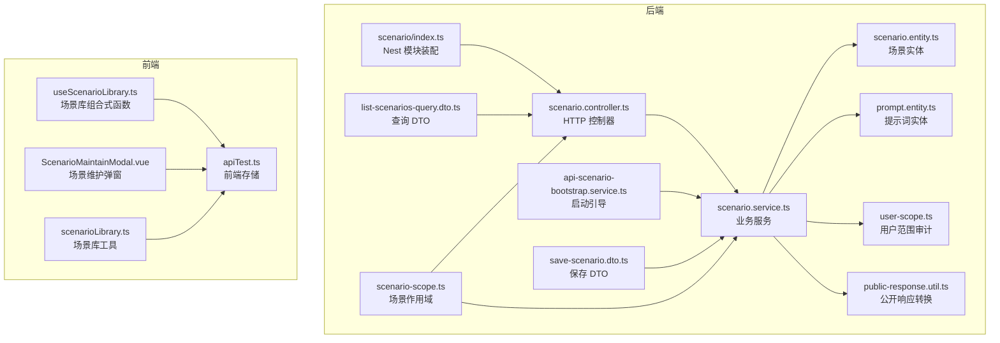
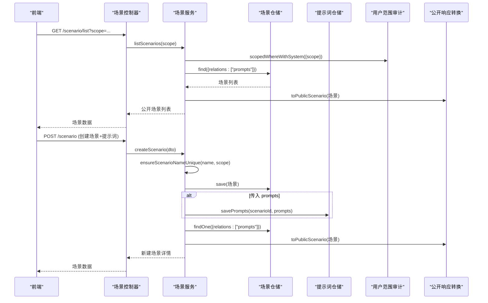
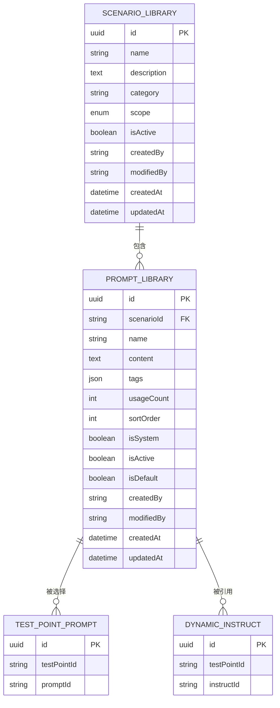
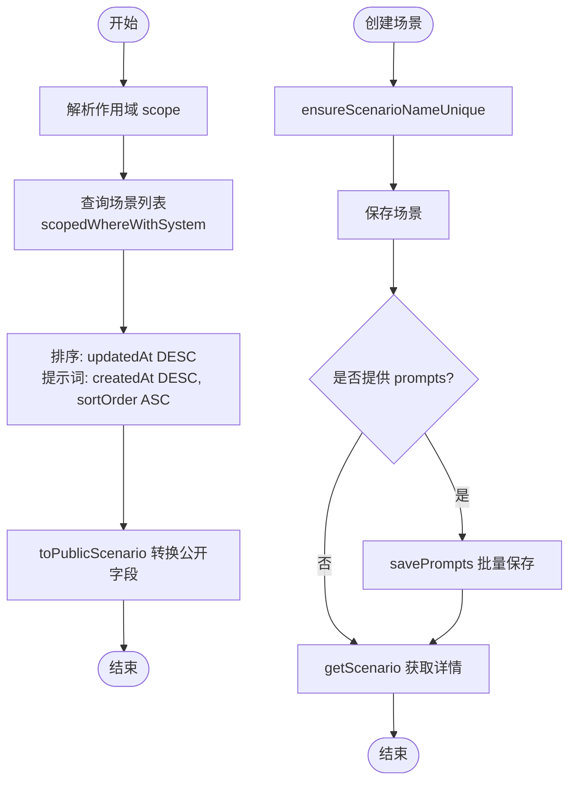
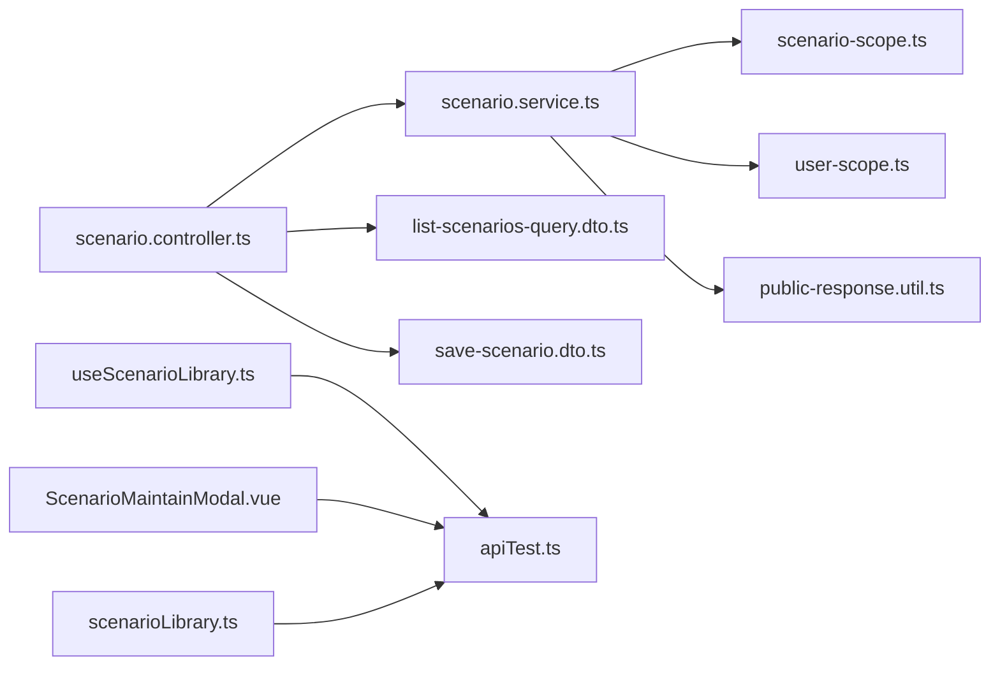

# 场景模块

<cite>
**本文引用的文件**
- [apps/api/src/modules/scenario/index.ts](file://apps/api/src/modules/scenario/index.ts)
- [apps/api/src/modules/scenario/controller/scenario.controller.ts](file://apps/api/src/modules/scenario/controller/scenario.controller.ts)
- [apps/api/src/modules/scenario/service/scenario.service.ts](file://apps/api/src/modules/scenario/service/scenario.service.ts)
- [apps/api/src/modules/scenario/entity/scenario.entity.ts](file://apps/api/src/modules/scenario/entity/scenario.entity.ts)
- [apps/api/src/modules/scenario/entity/prompt.entity.ts](file://apps/api/src/modules/scenario/entity/prompt.entity.ts)
- [apps/api/src/modules/scenario/dto/save-scenario.dto.ts](file://apps/api/src/modules/scenario/dto/save-scenario.dto.ts)
- [apps/api/src/modules/scenario/dto/list-scenarios-query.dto.ts](file://apps/api/src/modules/scenario/dto/list-scenarios-query.dto.ts)
- [apps/api/src/modules/scenario/service/api-scenario-bootstrap.service.ts](file://apps/api/src/modules/scenario/service/api-scenario-bootstrap.service.ts)
- [apps/api/src/common/audit/user-scope.ts](file://apps/api/src/common/audit/user-scope.ts)
- [apps/api/src/common/http/public-response.util.ts](file://apps/api/src/common/http/public-response.util.ts)
- [packages/shared/src/scenario-scope.ts](file://packages/shared/src/scenario-scope.ts)
- [packages/shared/src/index.ts](file://packages/shared/src/index.ts)
- [apps/api/src/modules/api-test/service/api-execution.service.ts](file://apps/api/src/modules/api-test/service/api-execution.service.ts)
- [apps/api/scripts/seed-demo-data.ts](file://apps/api/scripts/seed-demo-data.ts)
- [apps/web/src/composables/useScenarioLibrary.ts](file://apps/web/src/composables/useScenarioLibrary.ts)
- [apps/web/src/components/ScenarioMaintainModal.vue](file://apps/web/src/components/ScenarioMaintainModal.vue)
- [apps/web/src/utils/scenarioLibrary.ts](file://apps/web/src/utils/scenarioLibrary.ts)
- [apps/web/src/stores/apiTest.ts](file://apps/web/src/stores/apiTest.ts)
</cite>

## 目录
1. [引言](#引言)
2. [项目结构](#项目结构)
3. [核心组件](#核心组件)
4. [架构总览](#架构总览)
5. [详细组件分析](#详细组件分析)
6. [依赖分析](#依赖分析)
7. [性能考虑](#性能考虑)
8. [故障排查指南](#故障排查指南)
9. [结论](#结论)
10. [附录](#附录)

## 引言
本技术文档围绕“场景模块”的设计与实现进行系统化梳理，涵盖场景与提示词的定义、管理与执行机制，场景实体设计理念、场景与测试要点的关联关系、提示词模板的动态生成与场景配置的灵活性，以及导入导出、版本管理与批量操作能力。同时，文档阐述了场景执行的并发控制、状态跟踪与结果收集机制，并提供模块的 API 接口文档、数据模型说明与实际应用场景示例，帮助读者快速理解并高效使用该模块。

## 项目结构
场景模块位于后端 NestJS 应用的 scenario 子域，采用“领域驱动”的分层组织方式：控制器负责对外暴露 HTTP 接口；服务层封装业务逻辑；TypeORM 实体映射数据库表；共享类型与工具提供跨模块通用能力；前端通过组合式函数与存储层对接场景库。

图表来源
- [apps/api/src/modules/scenario/index.ts:12-19](file://apps/api/src/modules/scenario/index.ts#L12-L19)
- [apps/api/src/modules/scenario/controller/scenario.controller.ts:22-27](file://apps/api/src/modules/scenario/controller/scenario.controller.ts#L22-L27)
- [apps/api/src/modules/scenario/service/scenario.service.ts:35-40](file://apps/api/src/modules/scenario/service/scenario.service.ts#L35-L40)
- [apps/api/src/modules/scenario/service/api-scenario-bootstrap.service.ts:12-20](file://apps/api/src/modules/scenario/service/api-scenario-bootstrap.service.ts#L12-L20)
- [apps/api/src/modules/scenario/entity/scenario.entity.ts:19-71](file://apps/api/src/modules/scenario/entity/scenario.entity.ts#L19-L71)
- [apps/api/src/modules/scenario/entity/prompt.entity.ts:22-96](file://apps/api/src/modules/scenario/entity/prompt.entity.ts#L22-L96)
- [apps/api/src/modules/scenario/dto/save-scenario.dto.ts:69-102](file://apps/api/src/modules/scenario/dto/save-scenario.dto.ts#L69-L102)
- [apps/api/src/modules/scenario/dto/list-scenarios-query.dto.ts:9-15](file://apps/api/src/modules/scenario/dto/list-scenarios-query.dto.ts#L9-L15)
- [packages/shared/src/scenario-scope.ts:1-13](file://packages/shared/src/scenario-scope.ts#L1-L13)
- [apps/api/src/common/audit/user-scope.ts:18-36](file://apps/api/src/common/audit/user-scope.ts#L18-L36)
- [apps/api/src/common/http/public-response.util.ts:34-59](file://apps/api/src/common/http/public-response.util.ts#L34-L59)
- [apps/web/src/composables/useScenarioLibrary.ts:8-14](file://apps/web/src/composables/useScenarioLibrary.ts#L8-L14)
- [apps/web/src/components/ScenarioMaintainModal.vue:16-22](file://apps/web/src/components/ScenarioMaintainModal.vue#L16-L22)
- [apps/web/src/utils/scenarioLibrary.ts:84-124](file://apps/web/src/utils/scenarioLibrary.ts#L84-L124)
- [apps/web/src/stores/apiTest.ts:1232-1251](file://apps/web/src/stores/apiTest.ts#L1232-L1251)

章节来源
- [apps/api/src/modules/scenario/index.ts:12-19](file://apps/api/src/modules/scenario/index.ts#L12-L19)
- [apps/api/src/modules/scenario/controller/scenario.controller.ts:22-27](file://apps/api/src/modules/scenario/controller/scenario.controller.ts#L22-L27)
- [apps/api/src/modules/scenario/service/scenario.service.ts:35-40](file://apps/api/src/modules/scenario/service/scenario.service.ts#L35-L40)
- [apps/api/src/modules/scenario/service/api-scenario-bootstrap.service.ts:12-20](file://apps/api/src/modules/scenario/service/api-scenario-bootstrap.service.ts#L12-L20)
- [apps/api/src/modules/scenario/entity/scenario.entity.ts:19-71](file://apps/api/src/modules/scenario/entity/scenario.entity.ts#L19-L71)
- [apps/api/src/modules/scenario/entity/prompt.entity.ts:22-96](file://apps/api/src/modules/scenario/entity/prompt.entity.ts#L22-L96)
- [apps/api/src/modules/scenario/dto/save-scenario.dto.ts:69-102](file://apps/api/src/modules/scenario/dto/save-scenario.dto.ts#L69-L102)
- [apps/api/src/modules/scenario/dto/list-scenarios-query.dto.ts:9-15](file://apps/api/src/modules/scenario/dto/list-scenarios-query.dto.ts#L9-L15)
- [packages/shared/src/scenario-scope.ts:1-13](file://packages/shared/src/scenario-scope.ts#L1-L13)
- [apps/api/src/common/audit/user-scope.ts:18-36](file://apps/api/src/common/audit/user-scope.ts#L18-L36)
- [apps/api/src/common/http/public-response.util.ts:34-59](file://apps/api/src/common/http/public-response.util.ts#L34-L59)
- [apps/web/src/composables/useScenarioLibrary.ts:8-14](file://apps/web/src/composables/useScenarioLibrary.ts#L8-L14)
- [apps/web/src/components/ScenarioMaintainModal.vue:16-22](file://apps/web/src/components/ScenarioMaintainModal.vue#L16-L22)
- [apps/web/src/utils/scenarioLibrary.ts:84-124](file://apps/web/src/utils/scenarioLibrary.ts#L84-L124)
- [apps/web/src/stores/apiTest.ts:1232-1251](file://apps/web/src/stores/apiTest.ts#L1232-L1251)

## 核心组件
- 场景模块装配：注册实体、控制器与服务，导出服务供其他模块使用。
- 场景控制器：提供场景列表、详情、创建、更新、删除的 HTTP 接口。
- 场景服务：实现场景与提示词的增删改查、唯一性校验、替换与保存策略。
- 场景实体与提示词实体：定义场景与提示词的数据结构、索引与关系。
- 共享类型与工具：统一场景作用域、用户范围审计、公开响应转换。
- 启动引导：在应用启动时写入系统预置接口测试场景。

章节来源
- [apps/api/src/modules/scenario/index.ts:12-19](file://apps/api/src/modules/scenario/index.ts#L12-L19)
- [apps/api/src/modules/scenario/controller/scenario.controller.ts:29-60](file://apps/api/src/modules/scenario/controller/scenario.controller.ts#L29-L60)
- [apps/api/src/modules/scenario/service/scenario.service.ts:43-142](file://apps/api/src/modules/scenario/service/scenario.service.ts#L43-L142)
- [apps/api/src/modules/scenario/entity/scenario.entity.ts:23-71](file://apps/api/src/modules/scenario/entity/scenario.entity.ts#L23-L71)
- [apps/api/src/modules/scenario/entity/prompt.entity.ts:26-96](file://apps/api/src/modules/scenario/entity/prompt.entity.ts#L26-L96)
- [apps/api/src/modules/scenario/service/api-scenario-bootstrap.service.ts:22-30](file://apps/api/src/modules/scenario/service/api-scenario-bootstrap.service.ts#L22-L30)
- [packages/shared/src/scenario-scope.ts:1-13](file://packages/shared/src/scenario-scope.ts#L1-L13)
- [apps/api/src/common/audit/user-scope.ts:18-75](file://apps/api/src/common/audit/user-scope.ts#L18-L75)
- [apps/api/src/common/http/public-response.util.ts:34-59](file://apps/api/src/common/http/public-response.util.ts#L34-L59)

## 架构总览
场景模块遵循“控制器-服务-仓储-实体”的分层架构，结合共享类型与审计工具，确保场景与提示词的可维护性与安全性。前端通过组合式函数与存储层对接场景库，支持自动保存、批量操作与状态管理。

图表来源
- [apps/api/src/modules/scenario/controller/scenario.controller.ts:29-60](file://apps/api/src/modules/scenario/controller/scenario.controller.ts#L29-L60)
- [apps/api/src/modules/scenario/service/scenario.service.ts:43-108](file://apps/api/src/modules/scenario/service/scenario.service.ts#L43-L108)
- [apps/api/src/common/audit/user-scope.ts:28-36](file://apps/api/src/common/audit/user-scope.ts#L28-L36)
- [apps/api/src/common/http/public-response.util.ts:34-59](file://apps/api/src/common/http/public-response.util.ts#L34-L59)

## 详细组件分析

### 数据模型与实体设计
- 场景实体：包含名称、描述、类别、作用域、启用状态、创建/修改人与时间戳，以及与提示词的一对多关系。索引覆盖启用状态与更新时间、名称、用户与更新时间等维度，优化查询性能。
- 提示词实体：包含所属场景、名称、内容、标签、使用计数、排序、系统预设标记、启用状态与默认勾选标记，以及与测试点选择的多对多关系。索引保证场景内名称唯一与排序查询效率。

图表来源
- [apps/api/src/modules/scenario/entity/scenario.entity.ts:23-71](file://apps/api/src/modules/scenario/entity/scenario.entity.ts#L23-L71)
- [apps/api/src/modules/scenario/entity/prompt.entity.ts:26-96](file://apps/api/src/modules/scenario/entity/prompt.entity.ts#L26-L96)

章节来源
- [apps/api/src/modules/scenario/entity/scenario.entity.ts:23-71](file://apps/api/src/modules/scenario/entity/scenario.entity.ts#L23-L71)
- [apps/api/src/modules/scenario/entity/prompt.entity.ts:26-96](file://apps/api/src/modules/scenario/entity/prompt.entity.ts#L26-L96)

### 场景与提示词的管理与执行
- 场景列表与详情：按作用域与用户范围过滤，返回场景及其提示词列表，支持按启用状态与更新时间排序。
- 创建与更新：创建时校验名称唯一性，支持一次性保存提示词；更新时可全量替换提示词，保持提示词名称在同场景内的唯一性。
- 删除：级联删除场景下的所有提示词。
- 执行：接口测试模块提供执行集运行能力，支持并发度控制、状态跟踪与结果收集，前端通过存储层管理执行状态与结果下载。

图表来源
- [apps/api/src/modules/scenario/service/scenario.service.ts:43-108](file://apps/api/src/modules/scenario/service/scenario.service.ts#L43-L108)
- [apps/api/src/common/audit/user-scope.ts:28-36](file://apps/api/src/common/audit/user-scope.ts#L28-L36)
- [apps/api/src/common/http/public-response.util.ts:34-59](file://apps/api/src/common/http/public-response.util.ts#L34-L59)

章节来源
- [apps/api/src/modules/scenario/service/scenario.service.ts:43-142](file://apps/api/src/modules/scenario/service/scenario.service.ts#L43-L142)
- [apps/api/src/modules/api-test/service/api-execution.service.ts:66-112](file://apps/api/src/modules/api-test/service/api-execution.service.ts#L66-L112)
- [apps/web/src/stores/apiTest.ts:1137-1156](file://apps/web/src/stores/apiTest.ts#L1137-L1156)

### 提示词模板的动态生成与场景配置灵活性
- 提示词模板：每个提示词包含名称、内容、标签、排序与启用状态，支持作为动态指令的基础模板，配合测试点选择形成可复用的测试指令集合。
- 场景配置：场景支持分类、描述与启用状态，作用域区分“案例动态指令”与“接口测试”，便于在不同业务域灵活复用与隔离。
- 系统预置：启动时写入系统预置接口测试场景，确保新实例具备基础能力。

章节来源
- [apps/api/src/modules/scenario/entity/prompt.entity.ts:26-96](file://apps/api/src/modules/scenario/entity/prompt.entity.ts#L26-L96)
- [apps/api/src/modules/scenario/entity/scenario.entity.ts:23-71](file://apps/api/src/modules/scenario/entity/scenario.entity.ts#L23-L71)
- [apps/api/src/modules/scenario/service/api-scenario-bootstrap.service.ts:22-30](file://apps/api/src/modules/scenario/service/api-scenario-bootstrap.service.ts#L22-L30)
- [apps/api/scripts/seed-demo-data.ts:179-205](file://apps/api/scripts/seed-demo-data.ts#L179-L205)

### 导入导出、版本管理与批量操作
- 导入：通过保存接口批量写入场景与提示词，利用替换策略保留或删除提示词，实现“全量导入”效果。
- 导出：前端提供报告导出能力，结合执行集运行结果生成多种格式的报告文件。
- 版本管理：实体包含创建/修改人与时间戳，支持基于审计字段的变更追踪。
- 批量操作：前端通过组合式函数与存储层实现场景与提示词的批量保存、自动保存与状态同步。

章节来源
- [apps/api/src/modules/scenario/service/scenario.service.ts:144-160](file://apps/api/src/modules/scenario/service/scenario.service.ts#L144-L160)
- [apps/web/src/stores/apiTest.ts:1257-1271](file://apps/web/src/stores/apiTest.ts#L1257-L1271)
- [apps/web/src/composables/useScenarioLibrary.ts:16-22](file://apps/web/src/composables/useScenarioLibrary.ts#L16-L22)
- [apps/web/src/components/ScenarioMaintainModal.vue:188-230](file://apps/web/src/components/ScenarioMaintainModal.vue#L188-L230)
- [apps/web/src/utils/scenarioLibrary.ts:84-124](file://apps/web/src/utils/scenarioLibrary.ts#L84-L124)

### 场景执行的并发控制、状态跟踪与结果收集
- 并发控制：接口测试执行服务根据输入并发度与最大并发限制进行裁剪，确保系统稳定。
- 状态跟踪：执行集运行时创建运行记录，记录状态、总数、并发度与时间戳，前端轮询或监听更新。
- 结果收集：运行项包含请求快照、响应快照、断言与耗时等指标，最终汇总通过前端存储进行展示与导出。

章节来源
- [apps/api/src/modules/api-test/service/api-execution.service.ts:66-112](file://apps/api/src/modules/api-test/service/api-execution.service.ts#L66-L112)
- [apps/web/src/stores/apiTest.ts:1137-1156](file://apps/web/src/stores/apiTest.ts#L1137-L1156)

## 依赖分析
场景模块与以下组件存在直接依赖关系：
- 共享类型：场景作用域、测试维度与分组策略等类型定义。
- 审计工具：用户范围过滤与资源归属校验，保障数据安全与隐私。
- 公开响应转换：统一输出场景与提示词的公开字段，避免内部细节泄露。
- 前端组合式函数与存储：提供场景库加载、保存与删除的前端能力。

图表来源
- [packages/shared/src/scenario-scope.ts:1-13](file://packages/shared/src/scenario-scope.ts#L1-L13)
- [apps/api/src/common/audit/user-scope.ts:18-75](file://apps/api/src/common/audit/user-scope.ts#L18-L75)
- [apps/api/src/common/http/public-response.util.ts:34-59](file://apps/api/src/common/http/public-response.util.ts#L34-L59)
- [apps/api/src/modules/scenario/controller/scenario.controller.ts:16-18](file://apps/api/src/modules/scenario/controller/scenario.controller.ts#L16-L18)
- [apps/api/src/modules/scenario/dto/list-scenarios-query.dto.ts:9-15](file://apps/api/src/modules/scenario/dto/list-scenarios-query.dto.ts#L9-L15)
- [apps/api/src/modules/scenario/dto/save-scenario.dto.ts:69-102](file://apps/api/src/modules/scenario/dto/save-scenario.dto.ts#L69-L102)
- [apps/web/src/composables/useScenarioLibrary.ts:8-14](file://apps/web/src/composables/useScenarioLibrary.ts#L8-L14)
- [apps/web/src/stores/apiTest.ts:1232-1251](file://apps/web/src/stores/apiTest.ts#L1232-L1251)
- [apps/web/src/components/ScenarioMaintainModal.vue:16-22](file://apps/web/src/components/ScenarioMaintainModal.vue#L16-L22)
- [apps/web/src/utils/scenarioLibrary.ts:84-124](file://apps/web/src/utils/scenarioLibrary.ts#L84-L124)

章节来源
- [packages/shared/src/scenario-scope.ts:1-13](file://packages/shared/src/scenario-scope.ts#L1-L13)
- [apps/api/src/common/audit/user-scope.ts:18-75](file://apps/api/src/common/audit/user-scope.ts#L18-L75)
- [apps/api/src/common/http/public-response.util.ts:34-59](file://apps/api/src/common/http/public-response.util.ts#L34-L59)
- [apps/api/src/modules/scenario/controller/scenario.controller.ts:16-18](file://apps/api/src/modules/scenario/controller/scenario.controller.ts#L16-L18)
- [apps/api/src/modules/scenario/dto/list-scenarios-query.dto.ts:9-15](file://apps/api/src/modules/scenario/dto/list-scenarios-query.dto.ts#L9-L15)
- [apps/api/src/modules/scenario/dto/save-scenario.dto.ts:69-102](file://apps/api/src/modules/scenario/dto/save-scenario.dto.ts#L69-L102)
- [apps/web/src/composables/useScenarioLibrary.ts:8-14](file://apps/web/src/composables/useScenarioLibrary.ts#L8-L14)
- [apps/web/src/stores/apiTest.ts:1232-1251](file://apps/web/src/stores/apiTest.ts#L1232-L1251)
- [apps/web/src/components/ScenarioMaintainModal.vue:16-22](file://apps/web/src/components/ScenarioMaintainModal.vue#L16-L22)
- [apps/web/src/utils/scenarioLibrary.ts:84-124](file://apps/web/src/utils/scenarioLibrary.ts#L84-L124)

## 性能考虑
- 查询优化：场景与提示词实体建立复合索引，支持按启用状态、更新时间、场景与排序字段的高效查询。
- 批量写入：提示词保存采用批量插入/更新，减少往返次数；替换策略先删除再保存，避免冗余数据。
- 并发控制：执行服务对并发度进行裁剪，避免过载；前端自动保存采用防抖与去重，降低无效请求。
- 响应转换：统一的公开响应转换避免重复序列化与字段暴露。

章节来源
- [apps/api/src/modules/scenario/entity/scenario.entity.ts:20-22](file://apps/api/src/modules/scenario/entity/scenario.entity.ts#L20-L22)
- [apps/api/src/modules/scenario/entity/prompt.entity.ts:23-25](file://apps/api/src/modules/scenario/entity/prompt.entity.ts#L23-L25)
- [apps/api/src/modules/scenario/service/scenario.service.ts:189-208](file://apps/api/src/modules/scenario/service/scenario.service.ts#L189-L208)
- [apps/api/src/modules/api-test/service/api-execution.service.ts:79-82](file://apps/api/src/modules/api-test/service/api-execution.service.ts#L79-L82)
- [apps/web/src/components/ScenarioMaintainModal.vue:385-400](file://apps/web/src/components/ScenarioMaintainModal.vue#L385-L400)

## 故障排查指南
- 名称冲突：创建/更新时若场景名称重复，抛出“已存在”异常；请调整名称或确认作用域。
- 资源不可见：按用户范围查询时，非本人且非系统预置资源返回“不存在”，检查登录用户与资源归属。
- 提示词重复：同一场景内提示词名称不允许重复，检查 prompts 的 name 字段。
- 执行失败：执行集运行前需确保至少选择一条启用案例；检查案例状态与选择集合。

章节来源
- [apps/api/src/modules/scenario/service/scenario.service.ts:162-173](file://apps/api/src/modules/scenario/service/scenario.service.ts#L162-L173)
- [apps/api/src/common/audit/user-scope.ts:48-75](file://apps/api/src/common/audit/user-scope.ts#L48-L75)
- [apps/api/src/modules/scenario/service/scenario.service.ts:175-187](file://apps/api/src/modules/scenario/service/scenario.service.ts#L175-L187)
- [apps/api/src/modules/api-test/service/api-execution.service.ts:76-98](file://apps/api/src/modules/api-test/service/api-execution.service.ts#L76-L98)

## 结论
场景模块以清晰的分层架构与完善的实体设计为基础，结合共享类型与审计工具，实现了场景与提示词的可维护、可复用与可追溯。通过启动引导与前端组合式函数，模块在不同业务域（案例动态指令与接口测试）间提供了统一的场景库能力，并支持高效的执行与结果管理。建议在生产环境中关注并发控制、索引策略与前端自动保存的用户体验，持续优化场景库的导入导出与批量操作体验。

## 附录

### API 接口文档
- 获取场景列表
  - 方法：GET
  - 路径：/scenario/list
  - 查询参数：scope（可选，枚举：case/api）
  - 返回：场景数组（含提示词）
- 获取单个场景详情
  - 方法：GET
  - 路径：/scenario/:id
  - 返回：场景详情（含提示词）
- 创建场景
  - 方法：POST
  - 路径：/scenario
  - 请求体：SaveScenarioDto（包含 name、description、category、scope、isActive、prompts）
  - 返回：新建场景详情
- 更新场景
  - 方法：PATCH
  - 路径：/scenario/:id
  - 请求体：SaveScenarioDto（prompts 可选，传入则全量替换）
  - 返回：更新后的场景详情
- 删除场景
  - 方法：DELETE
  - 路径：/scenario/:id
  - 返回：{ id, deleted: true }

章节来源
- [apps/api/src/modules/scenario/controller/scenario.controller.ts:29-60](file://apps/api/src/modules/scenario/controller/scenario.controller.ts#L29-L60)
- [apps/api/src/modules/scenario/dto/list-scenarios-query.dto.ts:9-15](file://apps/api/src/modules/scenario/dto/list-scenarios-query.dto.ts#L9-L15)
- [apps/api/src/modules/scenario/dto/save-scenario.dto.ts:69-102](file://apps/api/src/modules/scenario/dto/save-scenario.dto.ts#L69-L102)

### 数据模型说明
- 场景实体（scenario_library）
  - 关键字段：id、name、description、category、scope、isActive、createdBy、modifiedBy、createdAt、updatedAt
  - 关系：一对多 -> 提示词
- 提示词实体（prompt_library）
  - 关键字段：id、scenarioId、name、content、tags、usageCount、sortOrder、isSystem、isActive、isDefault、createdBy、modifiedBy、createdAt、updatedAt
  - 关系：多对多 -> 测试点选择、动态指令

章节来源
- [apps/api/src/modules/scenario/entity/scenario.entity.ts:23-71](file://apps/api/src/modules/scenario/entity/scenario.entity.ts#L23-L71)
- [apps/api/src/modules/scenario/entity/prompt.entity.ts:26-96](file://apps/api/src/modules/scenario/entity/prompt.entity.ts#L26-L96)

### 实际应用场景示例
- 接口测试场景库：通过启动引导写入系统预置场景，用户可在接口测试工作流中选择合适的提示词模板，快速生成与执行测试案例。
- 案例动态指令：在案例生成流水线中，依据场景标签与模块特征，动态拼装提示词模板，提升案例生成的准确性与一致性。
- 批量维护：前端场景维护弹窗支持自动保存与批量更新，适合在大规模场景与提示词维护时提高效率。

章节来源
- [apps/api/src/modules/scenario/service/api-scenario-bootstrap.service.ts:22-30](file://apps/api/src/modules/scenario/service/api-scenario-bootstrap.service.ts#L22-L30)
- [apps/api/scripts/seed-demo-data.ts:179-205](file://apps/api/scripts/seed-demo-data.ts#L179-L205)
- [apps/web/src/components/ScenarioMaintainModal.vue:188-230](file://apps/web/src/components/ScenarioMaintainModal.vue#L188-L230)
- [apps/web/src/stores/apiTest.ts:1232-1251](file://apps/web/src/stores/apiTest.ts#L1232-L1251)