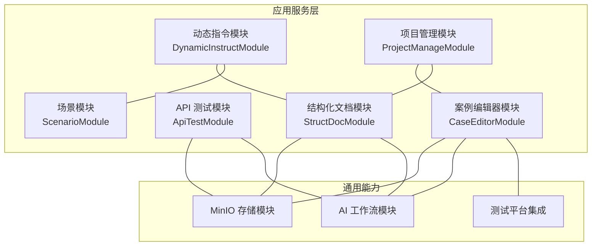
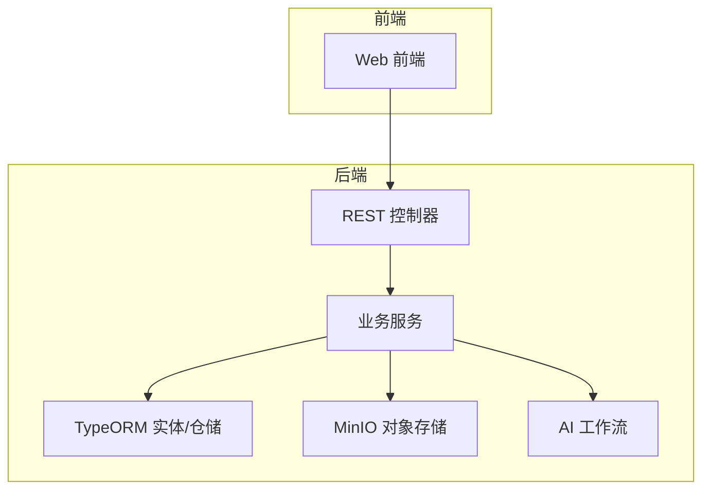
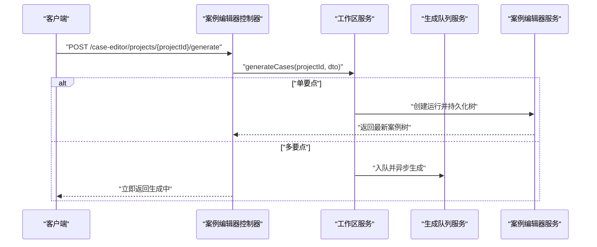
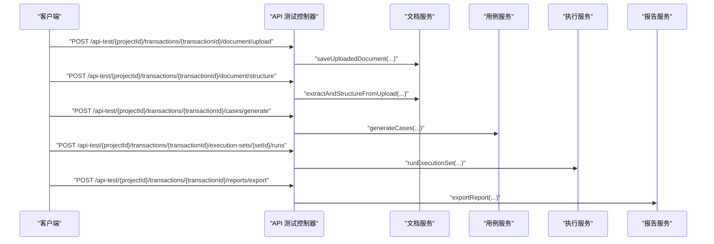
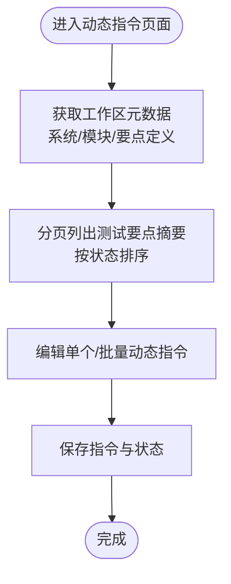
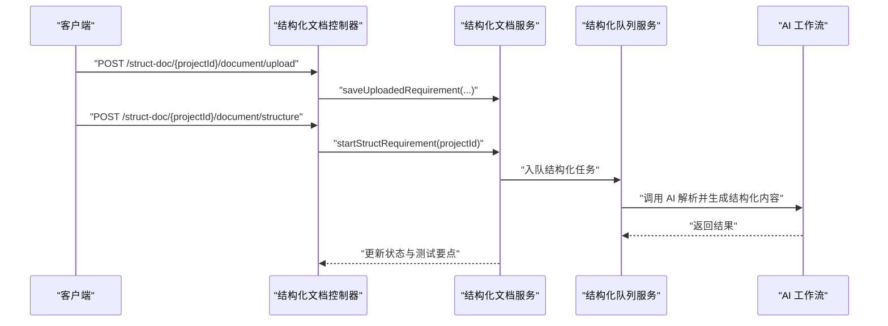
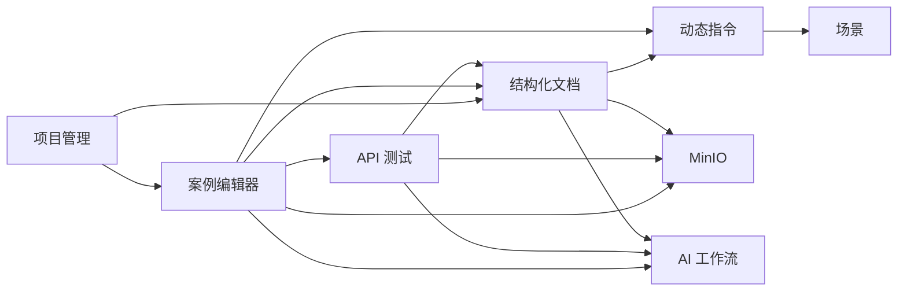

# 核心功能模块

<cite>
**本文引用的文件**
- [apps/api/src/modules/case-editor/index.ts](file://apps/api/src/modules/case-editor/index.ts)
- [apps/api/src/modules/case-editor/controller/case-editor.controller.ts](file://apps/api/src/modules/case-editor/controller/case-editor.controller.ts)
- [apps/api/src/modules/case-editor/service/case-editor.service.ts](file://apps/api/src/modules/case-editor/service/case-editor.service.ts)
- [apps/api/src/modules/api-test/index.ts](file://apps/api/src/modules/api-test/index.ts)
- [apps/api/src/modules/api-test/controller/api-test.controller.ts](file://apps/api/src/modules/api-test/controller/api-test.controller.ts)
- [apps/api/src/modules/api-test/service/api-case.service.ts](file://apps/api/src/modules/api-test/service/api-case.service.ts)
- [apps/api/src/modules/dynamic-instruct/index.ts](file://apps/api/src/modules/dynamic-instruct/index.ts)
- [apps/api/src/modules/dynamic-instruct/controller/dynamic-instruct.controller.ts](file://apps/api/src/modules/dynamic-instruct/controller/dynamic-instruct.controller.ts)
- [apps/api/src/modules/dynamic-instruct/service/dynamic-instruct.service.ts](file://apps/api/src/modules/dynamic-instruct/service/dynamic-instruct.service.ts)
- [apps/api/src/modules/project-manage/index.ts](file://apps/api/src/modules/project-manage/index.ts)
- [apps/api/src/modules/project-manage/controller/project-manage.controller.ts](file://apps/api/src/modules/project-manage/controller/project-manage.controller.ts)
- [apps/api/src/modules/scenario/index.ts](file://apps/api/src/modules/scenario/index.ts)
- [apps/api/src/modules/scenario/controller/scenario.controller.ts](file://apps/api/src/modules/scenario/controller/scenario.controller.ts)
- [apps/api/src/modules/struct-doc/index.ts](file://apps/api/src/modules/struct-doc/index.ts)
- [apps/api/src/modules/struct-doc/controller/struct-doc.controller.ts](file://apps/api/src/modules/struct-doc/controller/struct-doc.controller.ts)
- [apps/api/src/modules/struct-doc/service/struct-doc.service.ts](file://apps/api/src/modules/struct-doc/service/struct-doc.service.ts)
</cite>

## 目录
1. [引言](#引言)
2. [项目结构](#项目结构)
3. [核心组件](#核心组件)
4. [架构总览](#架构总览)
5. [详细组件分析](#详细组件分析)
6. [依赖分析](#依赖分析)
7. [性能考虑](#性能考虑)
8. [故障排查指南](#故障排查指南)
9. [结论](#结论)
10. [附录](#附录)

## 引言
本文件面向 CaseForge 的六大核心业务模块，系统梳理其功能定位、核心能力与实现原理，重点覆盖：
- 案例编辑器：智能生成机制与运行树管理
- API 测试：从接口文档到执行报告的全生命周期
- 动态指令：以测试要点为驱动的约束与提示词体系
- 项目管理：团队协作与项目治理
- 场景管理：AI 集成与提示词驱动
- 结构化文档：需求文档解析与测试要点抽取

文档同时阐明模块间的依赖关系与数据交互模式，给出扩展与定制化建议。

## 项目结构
六大模块均采用 NestJS 模块化组织，遵循“控制器-服务-实体-DTO”的分层设计，配合 TypeORM 实体与 MinIO 存储、AI 工作流模块协同，形成前后端一致的领域边界与职责划分。

图表来源
- [apps/api/src/modules/case-editor/index.ts:29-58](file://apps/api/src/modules/case-editor/index.ts#L29-L58)
- [apps/api/src/modules/api-test/index.ts:25-42](file://apps/api/src/modules/api-test/index.ts#L25-L42)
- [apps/api/src/modules/dynamic-instruct/index.ts:14-27](file://apps/api/src/modules/dynamic-instruct/index.ts#L14-L27)
- [apps/api/src/modules/project-manage/index.ts:15-24](file://apps/api/src/modules/project-manage/index.ts#L15-L24)
- [apps/api/src/modules/struct-doc/index.ts:18-28](file://apps/api/src/modules/struct-doc/index.ts#L18-L28)

章节来源
- [apps/api/src/modules/case-editor/index.ts:1-60](file://apps/api/src/modules/case-editor/index.ts#L1-L60)
- [apps/api/src/modules/api-test/index.ts:1-64](file://apps/api/src/modules/api-test/index.ts#L1-L64)
- [apps/api/src/modules/dynamic-instruct/index.ts:1-30](file://apps/api/src/modules/dynamic-instruct/index.ts#L1-L30)
- [apps/api/src/modules/project-manage/index.ts:1-32](file://apps/api/src/modules/project-manage/index.ts#L1-L32)
- [apps/api/src/modules/scenario/index.ts:1-19](file://apps/api/src/modules/scenario/index.ts#L1-L19)
- [apps/api/src/modules/struct-doc/index.ts:1-34](file://apps/api/src/modules/struct-doc/index.ts#L1-L34)

## 核心组件
- 案例编辑器模块：提供案例树生成、运行记录管理、按需加载、Excel/XMind 导出、与测试平台同步等功能。
- API 测试模块：提供接口文档上传/解析、用例生成、环境与执行集管理、批量执行、报告导出等。
- 动态指令模块：围绕测试要点的约束与提示词，提供工作区元数据、生成状态跟踪、批量保存与定义更新。
- 项目管理模块：提供项目创建、列表、搜索、更新、删除与运行统计等。
- 场景模块：维护场景与提示词，支撑 AI 工作流的上下文注入。
- 结构化文档模块：提供需求文档上传、AI 结构化、自动保存、正式保存与测试要点同步。

章节来源
- [apps/api/src/modules/case-editor/controller/case-editor.controller.ts:30-214](file://apps/api/src/modules/case-editor/controller/case-editor.controller.ts#L30-L214)
- [apps/api/src/modules/api-test/controller/api-test.controller.ts:54-506](file://apps/api/src/modules/api-test/controller/api-test.controller.ts#L54-L506)
- [apps/api/src/modules/dynamic-instruct/controller/dynamic-instruct.controller.ts:24-107](file://apps/api/src/modules/dynamic-instruct/controller/dynamic-instruct.controller.ts#L24-L107)
- [apps/api/src/modules/project-manage/controller/project-manage.controller.ts:23-118](file://apps/api/src/modules/project-manage/controller/project-manage.controller.ts#L23-L118)
- [apps/api/src/modules/scenario/controller/scenario.controller.ts:18-55](file://apps/api/src/modules/scenario/controller/scenario.controller.ts#L18-L55)
- [apps/api/src/modules/struct-doc/controller/struct-doc.controller.ts:36-176](file://apps/api/src/modules/struct-doc/controller/struct-doc.controller.ts#L36-L176)

## 架构总览
六大模块通过统一的控制器暴露 REST 接口，服务层协调 TypeORM 实体、MinIO 文件存储与 AI 工作流，形成“请求-控制器-服务-仓储/存储”的清晰链路。

图表来源
- [apps/api/src/modules/case-editor/controller/case-editor.controller.ts:30-214](file://apps/api/src/modules/case-editor/controller/case-editor.controller.ts#L30-L214)
- [apps/api/src/modules/api-test/controller/api-test.controller.ts:54-506](file://apps/api/src/modules/api-test/controller/api-test.controller.ts#L54-L506)
- [apps/api/src/modules/struct-doc/controller/struct-doc.controller.ts:36-176](file://apps/api/src/modules/struct-doc/controller/struct-doc.controller.ts#L36-L176)

## 详细组件分析

### 案例编辑器模块
- 功能定位：以“测试要点”为输入，驱动案例树的智能生成与运行管理，支持导出与测试平台同步。
- 核心能力：
  - 案例生成：支持同步/异步两种模式，队列进度与 ETA 查询，节点级重生成。
  - 运行管理：运行摘要、单次运行详情、按需加载子树、Excel 行分页查询。
  - 导出能力：Excel 模板下载与内容导出、XMind 导出。
  - 平台同步：将案例树同步至测试平台。
- 实现要点：
  - 控制器聚合生成、取消、队列、重生成、运行查询、导出与同步等接口。
  - 服务层负责运行记录创建/查询、树形持久化与懒加载、Excel 行过滤与分页。
  - 与结构化文档、动态指令、项目管理、MinIO、测试平台模块耦合。

图表来源
- [apps/api/src/modules/case-editor/controller/case-editor.controller.ts:52-86](file://apps/api/src/modules/case-editor/controller/case-editor.controller.ts#L52-L86)
- [apps/api/src/modules/case-editor/service/case-editor.service.ts:64-104](file://apps/api/src/modules/case-editor/service/case-editor.service.ts#L64-L104)

章节来源
- [apps/api/src/modules/case-editor/controller/case-editor.controller.ts:30-214](file://apps/api/src/modules/case-editor/controller/case-editor.controller.ts#L30-L214)
- [apps/api/src/modules/case-editor/service/case-editor.service.ts:48-200](file://apps/api/src/modules/case-editor/service/case-editor.service.ts#L48-L200)

### API 测试模块
- 功能定位：围绕接口文档的全生命周期管理，从上传、解析、结构化到用例生成、执行与报告导出。
- 核心能力：
  - 文档管理：上传 Excel、解析结构化、自动保存与正式保存。
  - 用例管理：增删改查、AI 生成、批量删除。
  - 环境与执行集：环境/服务 CRUD、执行集 CRUD、替换用例、并发执行。
  - 报告：汇总与导出。
- 实现要点：
  - 控制器覆盖交易码、文档、用例、环境、执行集、运行与报告的完整路径。
  - 服务层封装 AI 生成、编号规则、回退生成策略与审计字段。

图表来源
- [apps/api/src/modules/api-test/controller/api-test.controller.ts:135-505](file://apps/api/src/modules/api-test/controller/api-test.controller.ts#L135-L505)
- [apps/api/src/modules/api-test/service/api-case.service.ts:162-200](file://apps/api/src/modules/api-test/service/api-case.service.ts#L162-L200)

章节来源
- [apps/api/src/modules/api-test/controller/api-test.controller.ts:54-506](file://apps/api/src/modules/api-test/controller/api-test.controller.ts#L54-L506)
- [apps/api/src/modules/api-test/service/api-case.service.ts:28-200](file://apps/api/src/modules/api-test/service/api-case.service.ts#L28-L200)

### 动态指令模块
- 功能定位：以测试要点为核心，提供动态指令（场景提示词+自然语言）的编辑、保存与批量管理。
- 核心能力：
  - 工作区元数据：系统/模块自动补全与筛选。
  - 生成状态：跟踪“生成中/完成/失败/待编辑/再编辑”等状态。
  - 测试要点：新增、删除、单条/批量保存、定义字段更新。
- 实现要点：
  - 服务层构建分页查询、状态排序、系统/模块维度的筛选与去重。
  - 与结构化文档、场景模块、项目管理模块协作。

图表来源
- [apps/api/src/modules/dynamic-instruct/controller/dynamic-instruct.controller.ts:32-106](file://apps/api/src/modules/dynamic-instruct/controller/dynamic-instruct.controller.ts#L32-L106)
- [apps/api/src/modules/dynamic-instruct/service/dynamic-instruct.service.ts:67-140](file://apps/api/src/modules/dynamic-instruct/service/dynamic-instruct.service.ts#L67-L140)

章节来源
- [apps/api/src/modules/dynamic-instruct/controller/dynamic-instruct.controller.ts:24-107](file://apps/api/src/modules/dynamic-instruct/controller/dynamic-instruct.controller.ts#L24-L107)
- [apps/api/src/modules/dynamic-instruct/service/dynamic-instruct.service.ts:52-200](file://apps/api/src/modules/dynamic-instruct/service/dynamic-instruct.service.ts#L52-L200)

### 项目管理模块
- 功能定位：项目创建、列表、搜索、更新、删除与运行统计，支撑其他模块的项目维度隔离。
- 核心能力：
  - 侧边栏项目列表：含运行次数等摘要。
  - 分页查询与搜索：按标题/需求编号模糊匹配。
  - 批量删除与单项目 CRUD。
- 实现要点：
  - 控制器提供平台维度筛选（案例生成/接口测试）。
  - 服务层封装分页、搜索与审计字段。

章节来源
- [apps/api/src/modules/project-manage/controller/project-manage.controller.ts:23-118](file://apps/api/src/modules/project-manage/controller/project-manage.controller.ts#L23-L118)

### 场景模块
- 功能定位：场景与提示词的维护，为 AI 工作流提供上下文与提示词。
- 核心能力：
  - 场景列表、详情、创建、更新、删除。
- 实现要点：
  - 与动态指令模块协作，动态指令可绑定场景提示词。

章节来源
- [apps/api/src/modules/scenario/controller/scenario.controller.ts:18-55](file://apps/api/src/modules/scenario/controller/scenario.controller.ts#L18-L55)

### 结构化文档模块
- 功能定位：需求文档的上传、AI 结构化、自动保存、正式保存与测试要点同步。
- 核心能力：
  - 上传限制与校验、对象存储落盘、项目标题联动。
  - 异步结构化触发与取消、超时检测与清理。
  - 自动保存与正式保存、测试要点同步。
- 实现要点：
  - 服务层协调 MinIO、AI 工作流与数据库事务，保证一致性。
  - 支持并发结构化槽位控制与超时策略。

图表来源
- [apps/api/src/modules/struct-doc/controller/struct-doc.controller.ts:68-122](file://apps/api/src/modules/struct-doc/controller/struct-doc.controller.ts#L68-L122)
- [apps/api/src/modules/struct-doc/service/struct-doc.service.ts:75-143](file://apps/api/src/modules/struct-doc/service/struct-doc.service.ts#L75-L143)

章节来源
- [apps/api/src/modules/struct-doc/controller/struct-doc.controller.ts:36-176](file://apps/api/src/modules/struct-doc/controller/struct-doc.controller.ts#L36-L176)
- [apps/api/src/modules/struct-doc/service/struct-doc.service.ts:54-200](file://apps/api/src/modules/struct-doc/service/struct-doc.service.ts#L54-L200)

## 依赖分析
- 模块内聚与解耦：
  - 各模块通过 TypeORM 实体与 DTO 明确边界，控制器仅做参数校验与路由转发。
  - 通用能力（MinIO、AI 工作流、审计与用户域）在公共模块中复用。
- 关键耦合点：
  - 案例编辑器依赖结构化文档、动态指令、场景与测试平台。
  - API 测试依赖 MinIO 与 AI 工作流，用例生成与文档结构化强相关。
  - 动态指令依赖结构化文档与场景模块。
  - 结构化文档依赖 MinIO 与 AI 工作流，同时向动态指令与项目管理输出测试要点。
- 循环依赖规避：
  - 使用 forwardRef 在结构化文档服务中注入队列服务，避免循环导入。

图表来源
- [apps/api/src/modules/case-editor/index.ts:29-58](file://apps/api/src/modules/case-editor/index.ts#L29-L58)
- [apps/api/src/modules/api-test/index.ts:25-42](file://apps/api/src/modules/api-test/index.ts#L25-L42)
- [apps/api/src/modules/dynamic-instruct/index.ts:14-27](file://apps/api/src/modules/dynamic-instruct/index.ts#L14-L27)
- [apps/api/src/modules/struct-doc/index.ts:18-28](file://apps/api/src/modules/struct-doc/index.ts#L18-L28)

章节来源
- [apps/api/src/modules/case-editor/index.ts:1-60](file://apps/api/src/modules/case-editor/index.ts#L1-L60)
- [apps/api/src/modules/api-test/index.ts:1-64](file://apps/api/src/modules/api-test/index.ts#L1-L64)
- [apps/api/src/modules/dynamic-instruct/index.ts:1-30](file://apps/api/src/modules/dynamic-instruct/index.ts#L1-L30)
- [apps/api/src/modules/struct-doc/index.ts:1-34](file://apps/api/src/modules/struct-doc/index.ts#L1-L34)

## 性能考虑
- 案例树导出与 Excel 分页：
  - 服务端对树进行内存摊平后过滤与分页，建议控制单次导出行数上限，避免大列表内存压力。
- 生成队列与并发：
  - 案例编辑器与结构化文档均提供队列与并发控制，建议结合系统资源设置合理并发度，避免阻塞。
- 文件上传与存储：
  - 控制器对上传类型与大小进行前置校验，服务端再次确认，减少无效 IO。
- 数据库查询：
  - 动态指令使用状态排序 SQL 与分页查询，注意索引与筛选条件的组合优化。

## 故障排查指南
- 上传失败/格式错误：
  - 结构化文档与 API 测试文档上传均包含格式与大小校验，检查文件类型与大小限制。
- 结构化任务卡住：
  - 使用取消端点清理“结构化中”状态，必要时检查 AI 工作流可用性与队列作业状态。
- 生成任务中断：
  - 案例编辑器提供队列状态查询与取消接口，结合日志定位具体任务。
- 权限与归属：
  - 多处控制器使用项目归属校验，确保请求用户对目标项目有权限。

章节来源
- [apps/api/src/modules/struct-doc/controller/struct-doc.controller.ts:74-87](file://apps/api/src/modules/struct-doc/controller/struct-doc.controller.ts#L74-L87)
- [apps/api/src/modules/struct-doc/service/struct-doc.service.ts:75-94](file://apps/api/src/modules/struct-doc/service/struct-doc.service.ts#L75-L94)
- [apps/api/src/modules/case-editor/controller/case-editor.controller.ts:61-86](file://apps/api/src/modules/case-editor/controller/case-editor.controller.ts#L61-L86)
- [apps/api/src/modules/api-test/controller/api-test.controller.ts:142-149](file://apps/api/src/modules/api-test/controller/api-test.controller.ts#L142-L149)

## 结论
六大模块围绕“项目-文档-要点-用例-执行-报告”的测试闭环构建，既保持高内聚又通过统一的控制器与通用能力实现低耦合。案例编辑器与结构化文档形成“需求-案例”的智能生成链路，动态指令与场景模块提供提示词与约束驱动，API 测试模块承接执行与报告，项目管理模块提供治理与协作基础。整体架构具备良好的扩展性与定制空间。

## 附录
- 扩展建议：
  - 案例编辑器：支持更多导出格式、增量同步与版本对比。
  - API 测试：引入执行集编排与条件执行、报告可视化增强。
  - 动态指令：增加指令模板库与自动化推荐。
  - 项目管理：引入成员角色与权限矩阵、审计日志。
  - 场景模块：支持场景版本与继承。
  - 结构化文档：多模态输入（图片/表格）、更细粒度的测试要点映射。