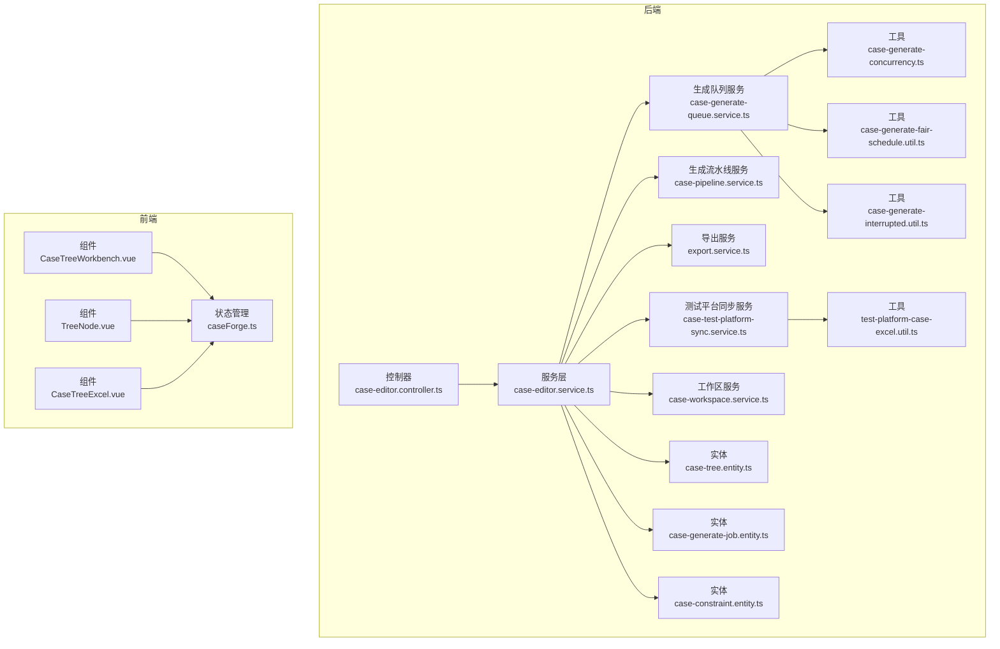
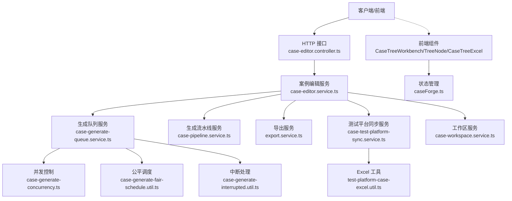
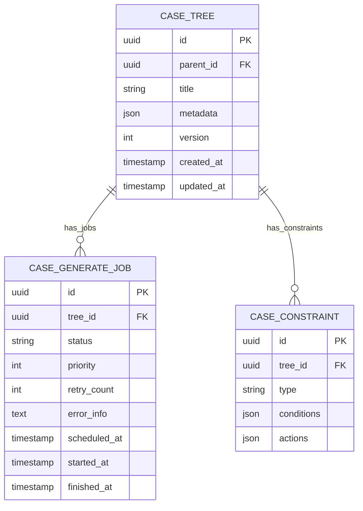
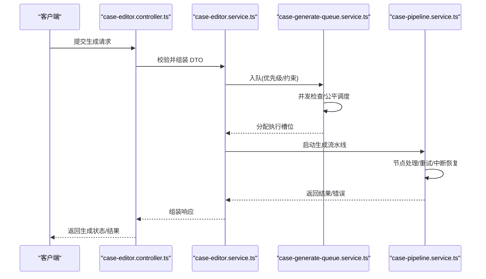
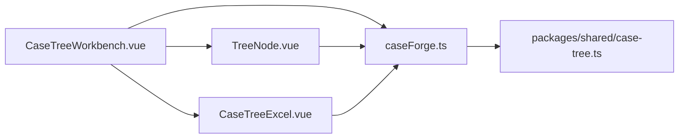
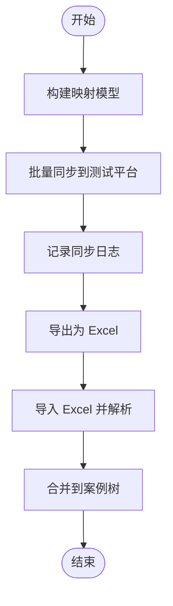
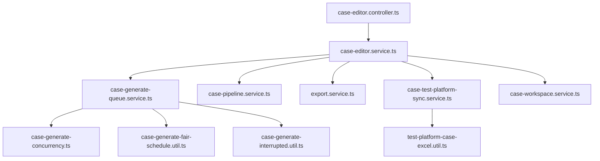

# 案例编辑器模块

<cite>
**本文引用的文件**
- [apps/api/src/modules/case-editor/controller/case-editor.controller.ts](file://apps/api/src/modules/case-editor/controller/case-editor.controller.ts)
- [apps/api/src/modules/case-editor/service/case-editor.service.ts](file://apps/api/src/modules/case-editor/service/case-editor.service.ts)
- [apps/api/src/modules/case-editor/service/case-generate-queue.service.ts](file://apps/api/src/modules/case-editor/service/case-generate-queue.service.ts)
- [apps/api/src/modules/case-editor/service/case-pipeline.service.ts](file://apps/api/src/modules/case-editor/service/case-pipeline.service.ts)
- [apps/api/src/modules/case-editor/service/export.service.ts](file://apps/api/src/modules/case-editor/service/export.service.ts)
- [apps/api/src/modules/case-editor/service/case-test-platform-sync.service.ts](file://apps/api/src/modules/case-editor/service/case-test-platform-sync.service.ts)
- [apps/api/src/modules/case-editor/service/case-workspace.service.ts](file://apps/api/src/modules/case-editor/service/case-workspace.service.ts)
- [apps/api/src/modules/case-editor/entity/case-tree.entity.ts](file://apps/api/src/modules/case-editor/entity/case-tree.entity.ts)
- [apps/api/src/modules/case-editor/entity/case-generate-job.entity.ts](file://apps/api/src/modules/case-editor/entity/case-generate-job.entity.ts)
- [apps/api/src/modules/case-editor/entity/case-constraint.entity.ts](file://apps/api/src/modules/case-editor/entity/case-constraint.entity.ts)
- [apps/api/src/modules/case-editor/util/case-generate-concurrency.ts](file://apps/api/src/modules/case-editor/util/case-generate-concurrency.ts)
- [apps/api/src/modules/case-editor/util/case-generate-fair-schedule.util.ts](file://apps/api/src/modules/case-editor/util/case-generate-fair-schedule.util.ts)
- [apps/api/src/modules/case-editor/util/case-generate-interrupted.util.ts](file://apps/api/src/modules/case-editor/util/case-generate-interrupted.util.ts)
- [apps/api/src/modules/case-editor/util/case-generate-queue-metrics.util.ts](file://apps/api/src/modules/case-editor/util/case-generate-queue-metrics.util.ts)
- [apps/api/src/modules/case-editor/util/case-markdown-tree.util.ts](file://apps/api/src/modules/case-editor/util/case-markdown-tree.util.ts)
- [apps/api/src/modules/case-editor/util/case-tree-merge.util.ts](file://apps/api/src/modules/case-editor/util/case-tree-merge.util.ts)
- [apps/api/src/modules/case-editor/util/test-platform-case-excel.util.ts](file://apps/api/src/modules/case-editor/util/test-platform-case-excel.util.ts)
- [apps/api/src/modules/case-editor/dto/generate-cases.dto.ts](file://apps/api/src/modules/case-editor/dto/generate-cases.dto.ts)
- [apps/api/src/modules/case-editor/dto/regenerate-node.dto.ts](file://apps/api/src/modules/case-editor/dto/regenerate-node.dto.ts)
- [apps/api/src/modules/case-editor/dto/sync-to-test-platform.dto.ts](file://apps/api/src/modules/case-editor/dto/sync-to-test-platform.dto.ts)
- [apps/api/src/modules/case-editor/dto/update-run-tree.dto.ts](file://apps/api/src/modules/case-editor/dto/update-run-tree.dto.ts)
- [apps/api/src/modules/case-editor/dto/list-case-rows.dto.ts](file://apps/api/src/modules/case-editor/dto/list-case-rows.dto.ts)
- [apps/api/src/modules/case-editor/dto/format-requirement.dto.ts](file://apps/api/src/modules/case-editor/dto/format-requirement.dto.ts)
- [apps/api/src/modules/case-editor/dto/cancel-generate.dto.ts](file://apps/api/src/modules/case-editor/dto/cancel-generate.dto.ts)
- [apps/api/src/modules/case-editor/dto/update-document.dto.ts](file://apps/api/src/modules/case-editor/dto/update-document.dto.ts)
- [apps/web/src/components/CaseTreeWorkbench.vue](file://apps/web/src/components/CaseTreeWorkbench.vue)
- [apps/web/src/components/TreeNode.vue](file://apps/web/src/components/TreeNode.vue)
- [apps/web/src/components/CaseTreeExcel.vue](file://apps/web/src/components/CaseTreeExcel.vue)
- [apps/web/src/stores/caseForge.ts](file://apps/web/src/stores/caseForge.ts)
- [packages/shared/src/case-tree.ts](file://packages/shared/src/case-tree.ts)
</cite>

## 目录
1. [简介](#简介)
2. [项目结构](#项目结构)
3. [核心组件](#核心组件)
4. [架构总览](#架构总览)
5. [详细组件分析](#详细组件分析)
6. [依赖关系分析](#依赖关系分析)
7. [性能考量](#性能考量)
8. [故障排查指南](#故障排查指南)
9. [结论](#结论)
10. [附录](#附录)

## 简介
本技术文档聚焦于“案例编辑器模块”，系统性阐述以下能力与实现细节：
- 智能案例生成：基于 AI 工作流的生成管线、生成队列管理、并发控制、公平调度与中断恢复。
- 案例树数据结构：节点模型、约束管理、版本合并与差异计算。
- 可视化编辑：前端工作台、节点操作与 Excel 导入导出。
- 测试平台同步：结构化用例映射与批量同步。
- 批量操作与 API：接口定义、数据模型与使用示例。

## 项目结构
案例编辑器模块位于后端 NestJS 应用的 modules 子目录中，采用按功能分层组织：
- controller：HTTP 入口，暴露 CRUD、生成、同步、导出等接口。
- service：业务服务，包含生成队列、流水线、导出、工作区、测试平台同步等。
- entity：数据库实体，承载案例树、生成作业、约束等持久化结构。
- util：工具函数，涵盖并发、调度、中断、队列指标、Markdown 树、Excel 转换等。
- dto：请求/响应数据传输对象，规范接口输入输出。
- web 前端：Vue 组件负责可视化编辑、Excel 操作与状态管理。

图表来源
- [apps/api/src/modules/case-editor/controller/case-editor.controller.ts](file://apps/api/src/modules/case-editor/controller/case-editor.controller.ts)
- [apps/api/src/modules/case-editor/service/case-editor.service.ts](file://apps/api/src/modules/case-editor/service/case-editor.service.ts)
- [apps/api/src/modules/case-editor/service/case-generate-queue.service.ts](file://apps/api/src/modules/case-editor/service/case-generate-queue.service.ts)
- [apps/api/src/modules/case-editor/service/case-pipeline.service.ts](file://apps/api/src/modules/case-editor/service/case-pipeline.service.ts)
- [apps/api/src/modules/case-editor/service/export.service.ts](file://apps/api/src/modules/case-editor/service/export.service.ts)
- [apps/api/src/modules/case-editor/service/case-test-platform-sync.service.ts](file://apps/api/src/modules/case-editor/service/case-test-platform-sync.service.ts)
- [apps/api/src/modules/case-editor/service/case-workspace.service.ts](file://apps/api/src/modules/case-editor/service/case-workspace.service.ts)
- [apps/api/src/modules/case-editor/entity/case-tree.entity.ts](file://apps/api/src/modules/case-editor/entity/case-tree.entity.ts)
- [apps/api/src/modules/case-editor/entity/case-generate-job.entity.ts](file://apps/api/src/modules/case-editor/entity/case-generate-job.entity.ts)
- [apps/api/src/modules/case-editor/entity/case-constraint.entity.ts](file://apps/api/src/modules/case-editor/entity/case-constraint.entity.ts)
- [apps/api/src/modules/case-editor/util/case-generate-concurrency.ts](file://apps/api/src/modules/case-editor/util/case-generate-concurrency.ts)
- [apps/api/src/modules/case-editor/util/case-generate-fair-schedule.util.ts](file://apps/api/src/modules/case-editor/util/case-generate-fair-schedule.util.ts)
- [apps/api/src/modules/case-editor/util/case-generate-interrupted.util.ts](file://apps/api/src/modules/case-editor/util/case-generate-interrupted.util.ts)
- [apps/api/src/modules/case-editor/util/test-platform-case-excel.util.ts](file://apps/api/src/modules/case-editor/util/test-platform-case-excel.util.ts)
- [apps/web/src/components/CaseTreeWorkbench.vue](file://apps/web/src/components/CaseTreeWorkbench.vue)
- [apps/web/src/components/TreeNode.vue](file://apps/web/src/components/TreeNode.vue)
- [apps/web/src/components/CaseTreeExcel.vue](file://apps/web/src/components/CaseTreeExcel.vue)
- [apps/web/src/stores/caseForge.ts](file://apps/web/src/stores/caseForge.ts)

章节来源
- [apps/api/src/modules/case-editor/controller/case-editor.controller.ts](file://apps/api/src/modules/case-editor/controller/case-editor.controller.ts)
- [apps/api/src/modules/case-editor/service/case-editor.service.ts](file://apps/api/src/modules/case-editor/service/case-editor.service.ts)
- [apps/api/src/modules/case-editor/service/case-generate-queue.service.ts](file://apps/api/src/modules/case-editor/service/case-generate-queue.service.ts)
- [apps/api/src/modules/case-editor/service/case-pipeline.service.ts](file://apps/api/src/modules/case-editor/service/case-pipeline.service.ts)
- [apps/api/src/modules/case-editor/service/export.service.ts](file://apps/api/src/modules/case-editor/service/export.service.ts)
- [apps/api/src/modules/case-editor/service/case-test-platform-sync.service.ts](file://apps/api/src/modules/case-editor/service/case-test-platform-sync.service.ts)
- [apps/api/src/modules/case-editor/service/case-workspace.service.ts](file://apps/api/src/modules/case-editor/service/case-workspace.service.ts)
- [apps/api/src/modules/case-editor/entity/case-tree.entity.ts](file://apps/api/src/modules/case-editor/entity/case-tree.entity.ts)
- [apps/api/src/modules/case-editor/entity/case-generate-job.entity.ts](file://apps/api/src/modules/case-editor/entity/case-generate-job.entity.ts)
- [apps/api/src/modules/case-editor/entity/case-constraint.entity.ts](file://apps/api/src/modules/case-editor/entity/case-constraint.entity.ts)
- [apps/api/src/modules/case-editor/util/case-generate-concurrency.ts](file://apps/api/src/modules/case-editor/util/case-generate-concurrency.ts)
- [apps/api/src/modules/case-editor/util/case-generate-fair-schedule.util.ts](file://apps/api/src/modules/case-editor/util/case-generate-fair-schedule.util.ts)
- [apps/api/src/modules/case-editor/util/case-generate-interrupted.util.ts](file://apps/api/src/modules/case-editor/util/case-generate-interrupted.util.ts)
- [apps/api/src/modules/case-editor/util/test-platform-case-excel.util.ts](file://apps/api/src/modules/case-editor/util/test-platform-case-excel.util.ts)
- [apps/web/src/components/CaseTreeWorkbench.vue](file://apps/web/src/components/CaseTreeWorkbench.vue)
- [apps/web/src/components/TreeNode.vue](file://apps/web/src/components/TreeNode.vue)
- [apps/web/src/components/CaseTreeExcel.vue](file://apps/web/src/components/CaseTreeExcel.vue)
- [apps/web/src/stores/caseForge.ts](file://apps/web/src/stores/caseForge.ts)

## 核心组件
- 控制器：统一暴露案例树、生成、同步、导出、运行树更新等接口，负责参数校验与响应封装。
- 服务层：
  - 案例编辑服务：协调生成、合并、约束、工作区等流程。
  - 生成队列服务：维护作业队列、并发、调度、中断与指标。
  - 生成流水线服务：编排 AI 工作流、节点重生成、失败重试。
  - 导出服务：支持 Excel 导出与格式转换。
  - 测试平台同步服务：将案例树映射为平台用例并批量同步。
  - 工作区服务：维护用户工作区上下文与权限。
- 实体层：持久化案例树、生成作业、约束等。
- 工具层：并发控制、公平调度、中断处理、队列指标、Markdown 树、Excel 转换等。
- 前端组件：可视化工作台、节点编辑、Excel 导入导出、状态管理。

章节来源
- [apps/api/src/modules/case-editor/controller/case-editor.controller.ts](file://apps/api/src/modules/case-editor/controller/case-editor.controller.ts)
- [apps/api/src/modules/case-editor/service/case-editor.service.ts](file://apps/api/src/modules/case-editor/service/case-editor.service.ts)
- [apps/api/src/modules/case-editor/service/case-generate-queue.service.ts](file://apps/api/src/modules/case-editor/service/case-generate-queue.service.ts)
- [apps/api/src/modules/case-editor/service/case-pipeline.service.ts](file://apps/api/src/modules/case-editor/service/case-pipeline.service.ts)
- [apps/api/src/modules/case-editor/service/export.service.ts](file://apps/api/src/modules/case-editor/service/export.service.ts)
- [apps/api/src/modules/case-editor/service/case-test-platform-sync.service.ts](file://apps/api/src/modules/case-editor/service/case-test-platform-sync.service.ts)
- [apps/api/src/modules/case-editor/service/case-workspace.service.ts](file://apps/api/src/modules/case-editor/service/case-workspace.service.ts)
- [apps/api/src/modules/case-editor/entity/case-tree.entity.ts](file://apps/api/src/modules/case-editor/entity/case-tree.entity.ts)
- [apps/api/src/modules/case-editor/entity/case-generate-job.entity.ts](file://apps/api/src/modules/case-editor/entity/case-generate-job.entity.ts)
- [apps/api/src/modules/case-editor/entity/case-constraint.entity.ts](file://apps/api/src/modules/case-editor/entity/case-constraint.entity.ts)
- [apps/api/src/modules/case-editor/util/case-generate-concurrency.ts](file://apps/api/src/modules/case-editor/util/case-generate-concurrency.ts)
- [apps/api/src/modules/case-editor/util/case-generate-fair-schedule.util.ts](file://apps/api/src/modules/case-editor/util/case-generate-fair-schedule.util.ts)
- [apps/api/src/modules/case-editor/util/case-generate-interrupted.util.ts](file://apps/api/src/modules/case-editor/util/case-generate-interrupted.util.ts)
- [apps/api/src/modules/case-editor/util/test-platform-case-excel.util.ts](file://apps/api/src/modules/case-editor/util/test-platform-case-excel.util.ts)

## 架构总览
案例编辑器以“控制器-服务-实体-工具”分层架构为核心，结合前端 Vue 组件完成可视化编辑与批量操作。生成流程通过队列与流水线解耦 AI 工作流；同步与导出通过专用服务对接外部平台与文件格式。

图表来源
- [apps/api/src/modules/case-editor/controller/case-editor.controller.ts](file://apps/api/src/modules/case-editor/controller/case-editor.controller.ts)
- [apps/api/src/modules/case-editor/service/case-editor.service.ts](file://apps/api/src/modules/case-editor/service/case-editor.service.ts)
- [apps/api/src/modules/case-editor/service/case-generate-queue.service.ts](file://apps/api/src/modules/case-editor/service/case-generate-queue.service.ts)
- [apps/api/src/modules/case-editor/service/case-pipeline.service.ts](file://apps/api/src/modules/case-editor/service/case-pipeline.service.ts)
- [apps/api/src/modules/case-editor/service/export.service.ts](file://apps/api/src/modules/case-editor/service/export.service.ts)
- [apps/api/src/modules/case-editor/service/case-test-platform-sync.service.ts](file://apps/api/src/modules/case-editor/service/case-test-platform-sync.service.ts)
- [apps/api/src/modules/case-editor/service/case-workspace.service.ts](file://apps/api/src/modules/case-editor/service/case-workspace.service.ts)
- [apps/api/src/modules/case-editor/util/case-generate-concurrency.ts](file://apps/api/src/modules/case-editor/util/case-generate-concurrency.ts)
- [apps/api/src/modules/case-editor/util/case-generate-fair-schedule.util.ts](file://apps/api/src/modules/case-editor/util/case-generate-fair-schedule.util.ts)
- [apps/api/src/modules/case-editor/util/case-generate-interrupted.util.ts](file://apps/api/src/modules/case-editor/util/case-generate-interrupted.util.ts)
- [apps/api/src/modules/case-editor/util/test-platform-case-excel.util.ts](file://apps/api/src/modules/case-editor/util/test-platform-case-excel.util.ts)
- [apps/web/src/components/CaseTreeWorkbench.vue](file://apps/web/src/components/CaseTreeWorkbench.vue)
- [apps/web/src/components/TreeNode.vue](file://apps/web/src/components/TreeNode.vue)
- [apps/web/src/components/CaseTreeExcel.vue](file://apps/web/src/components/CaseTreeExcel.vue)
- [apps/web/src/stores/caseForge.ts](file://apps/web/src/stores/caseForge.ts)

## 详细组件分析

### 案例树数据结构与约束管理
- 数据模型
  - 案例树实体：描述树形节点、层级关系、元数据与版本信息。
  - 生成作业实体：记录生成任务状态、优先级、重试次数与错误信息。
  - 约束实体：表达节点间的依赖、互斥与执行顺序等规则。
- 合并与差异
  - 合并工具：在多用户/多分支场景下进行树结构合并与冲突解决。
  - 差异工具：计算两棵树之间的差异，用于增量更新与版本对比。
- 可视化与 Markdown
  - Markdown 树工具：将树结构序列化为 Markdown 表达，便于展示与编辑。
- 版本控制
  - 通过作业实体与合并策略实现版本演进与回滚支持。

图表来源
- [apps/api/src/modules/case-editor/entity/case-tree.entity.ts](file://apps/api/src/modules/case-editor/entity/case-tree.entity.ts)
- [apps/api/src/modules/case-editor/entity/case-generate-job.entity.ts](file://apps/api/src/modules/case-editor/entity/case-generate-job.entity.ts)
- [apps/api/src/modules/case-editor/entity/case-constraint.entity.ts](file://apps/api/src/modules/case-editor/entity/case-constraint.entity.ts)

章节来源
- [apps/api/src/modules/case-editor/entity/case-tree.entity.ts](file://apps/api/src/modules/case-editor/entity/case-tree.entity.ts)
- [apps/api/src/modules/case-editor/entity/case-generate-job.entity.ts](file://apps/api/src/modules/case-editor/entity/case-generate-job.entity.ts)
- [apps/api/src/modules/case-editor/entity/case-constraint.entity.ts](file://apps/api/src/modules/case-editor/entity/case-constraint.entity.ts)
- [apps/api/src/modules/case-editor/util/case-tree-merge.util.ts](file://apps/api/src/modules/case-editor/util/case-tree-merge.util.ts)
- [apps/api/src/modules/case-editor/util/case-markdown-tree.util.ts](file://apps/api/src/modules/case-editor/util/case-markdown-tree.util.ts)

### 智能案例生成与队列管理
- 生成队列
  - 作业入队：根据优先级与约束排序，支持批量提交与去重。
  - 并发控制：限制同时运行的任务数，避免资源争用。
  - 公平调度：轮转或权重分配，确保高优先级与长任务不被饥饿。
  - 中断恢复：记录中断点，支持断点续跑与失败重试。
  - 队列指标：统计吞吐、等待时间、失败率等关键指标。
- 生成流水线
  - 编排节点：从需求到步骤再到用例的多阶段处理。
  - 重生成：针对单节点或子树的增量重生成。
  - 失败处理：捕获异常并写入作业错误信息，触发告警或重试。
- 并发与调度工具
  - 并发控制：全局并发上限与队列配额。
  - 公平调度：基于优先级与等待时长的调度策略。
  - 中断处理：持久化中断状态，保障可恢复性。

图表来源
- [apps/api/src/modules/case-editor/controller/case-editor.controller.ts](file://apps/api/src/modules/case-editor/controller/case-editor.controller.ts)
- [apps/api/src/modules/case-editor/service/case-editor.service.ts](file://apps/api/src/modules/case-editor/service/case-editor.service.ts)
- [apps/api/src/modules/case-editor/service/case-generate-queue.service.ts](file://apps/api/src/modules/case-editor/service/case-generate-queue.service.ts)
- [apps/api/src/modules/case-editor/service/case-pipeline.service.ts](file://apps/api/src/modules/case-editor/service/case-pipeline.service.ts)
- [apps/api/src/modules/case-editor/util/case-generate-concurrency.ts](file://apps/api/src/modules/case-editor/util/case-generate-concurrency.ts)
- [apps/api/src/modules/case-editor/util/case-generate-fair-schedule.util.ts](file://apps/api/src/modules/case-editor/util/case-generate-fair-schedule.util.ts)
- [apps/api/src/modules/case-editor/util/case-generate-interrupted.util.ts](file://apps/api/src/modules/case-editor/util/case-generate-interrupted.util.ts)
- [apps/api/src/modules/case-editor/util/case-generate-queue-metrics.util.ts](file://apps/api/src/modules/case-editor/util/case-generate-queue-metrics.util.ts)

章节来源
- [apps/api/src/modules/case-editor/service/case-generate-queue.service.ts](file://apps/api/src/modules/case-editor/service/case-generate-queue.service.ts)
- [apps/api/src/modules/case-editor/service/case-pipeline.service.ts](file://apps/api/src/modules/case-editor/service/case-pipeline.service.ts)
- [apps/api/src/modules/case-editor/util/case-generate-concurrency.ts](file://apps/api/src/modules/case-editor/util/case-generate-concurrency.ts)
- [apps/api/src/modules/case-editor/util/case-generate-fair-schedule.util.ts](file://apps/api/src/modules/case-editor/util/case-generate-fair-schedule.util.ts)
- [apps/api/src/modules/case-editor/util/case-generate-interrupted.util.ts](file://apps/api/src/modules/case-editor/util/case-generate-interrupted.util.ts)
- [apps/api/src/modules/case-editor/util/case-generate-queue-metrics.util.ts](file://apps/api/src/modules/case-editor/util/case-generate-queue-metrics.util.ts)

### 可视化编辑与节点操作
- 前端工作台
  - 案例树工作台：提供拖拽、展开/折叠、增删改查等交互。
  - 节点组件：支持节点详情编辑、前置条件配置与执行步骤管理。
  - Excel 操作：导入/导出用例表格，支持批量编辑与快速填充。
- 状态管理
  - 使用状态仓库集中管理当前树、选中节点、编辑态与同步状态。
- 数据模型
  - 共享类型定义：前后端一致的节点、步骤、约束等模型，减少耦合。

图表来源
- [apps/web/src/components/CaseTreeWorkbench.vue](file://apps/web/src/components/CaseTreeWorkbench.vue)
- [apps/web/src/components/TreeNode.vue](file://apps/web/src/components/TreeNode.vue)
- [apps/web/src/components/CaseTreeExcel.vue](file://apps/web/src/components/CaseTreeExcel.vue)
- [apps/web/src/stores/caseForge.ts](file://apps/web/src/stores/caseForge.ts)
- [packages/shared/src/case-tree.ts](file://packages/shared/src/case-tree.ts)

章节来源
- [apps/web/src/components/CaseTreeWorkbench.vue](file://apps/web/src/components/CaseTreeWorkbench.vue)
- [apps/web/src/components/TreeNode.vue](file://apps/web/src/components/TreeNode.vue)
- [apps/web/src/components/CaseTreeExcel.vue](file://apps/web/src/components/CaseTreeExcel.vue)
- [apps/web/src/stores/caseForge.ts](file://apps/web/src/stores/caseForge.ts)
- [packages/shared/src/case-tree.ts](file://packages/shared/src/case-tree.ts)

### 测试平台同步与 Excel 导入导出
- 测试平台同步
  - 映射规则：将案例树节点映射为平台用例实体，保留步骤与约束。
  - 批量同步：支持增量同步与全量覆盖，记录同步日志与失败项。
  - Excel 工具：提供平台用例的 Excel 结构转换与字段映射。
- Excel 导入导出
  - 导出：将案例树结构与步骤导出为 Excel，支持模板与自定义列。
  - 导入：解析 Excel 并转换为内部树结构，进行校验与合并。

图表来源
- [apps/api/src/modules/case-editor/service/case-test-platform-sync.service.ts](file://apps/api/src/modules/case-editor/service/case-test-platform-sync.service.ts)
- [apps/api/src/modules/case-editor/util/test-platform-case-excel.util.ts](file://apps/api/src/modules/case-editor/util/test-platform-case-excel.util.ts)
- [apps/api/src/modules/case-editor/service/export.service.ts](file://apps/api/src/modules/case-editor/service/export.service.ts)

章节来源
- [apps/api/src/modules/case-editor/service/case-test-platform-sync.service.ts](file://apps/api/src/modules/case-editor/service/case-test-platform-sync.service.ts)
- [apps/api/src/modules/case-editor/util/test-platform-case-excel.util.ts](file://apps/api/src/modules/case-editor/util/test-platform-case-excel.util.ts)
- [apps/api/src/modules/case-editor/service/export.service.ts](file://apps/api/src/modules/case-editor/service/export.service.ts)

### API 接口与数据模型
- 生成相关
  - 提交生成：提交需求文本与上下文，返回生成作业 ID。
  - 取消生成：根据作业 ID 取消排队或正在执行的任务。
  - 重生成节点：对指定节点进行增量重生成。
- 运行树更新
  - 更新运行树：提交运行时树结构，进行校验与保存。
- 列表与格式化
  - 列出用例行：按分页列出用例行数据。
  - 格式化需求：对输入的需求文本进行规范化处理。
- 文档更新
  - 更新文档：更新关联文档内容并触发相关刷新。
- 同步到测试平台
  - 提交同步：选择范围与策略，触发批量同步。

章节来源
- [apps/api/src/modules/case-editor/dto/generate-cases.dto.ts](file://apps/api/src/modules/case-editor/dto/generate-cases.dto.ts)
- [apps/api/src/modules/case-editor/dto/cancel-generate.dto.ts](file://apps/api/src/modules/case-editor/dto/cancel-generate.dto.ts)
- [apps/api/src/modules/case-editor/dto/regenerate-node.dto.ts](file://apps/api/src/modules/case-editor/dto/regenerate-node.dto.ts)
- [apps/api/src/modules/case-editor/dto/update-run-tree.dto.ts](file://apps/api/src/modules/case-editor/dto/update-run-tree.dto.ts)
- [apps/api/src/modules/case-editor/dto/list-case-rows.dto.ts](file://apps/api/src/modules/case-editor/dto/list-case-rows.dto.ts)
- [apps/api/src/modules/case-editor/dto/format-requirement.dto.ts](file://apps/api/src/modules/case-editor/dto/format-requirement.dto.ts)
- [apps/api/src/modules/case-editor/dto/update-document.dto.ts](file://apps/api/src/modules/case-editor/dto/update-document.dto.ts)
- [apps/api/src/modules/case-editor/dto/sync-to-test-platform.dto.ts](file://apps/api/src/modules/case-editor/dto/sync-to-test-platform.dto.ts)

## 依赖关系分析
- 组件内聚与耦合
  - 控制器仅负责路由与 DTO 校验，业务逻辑集中在服务层，内聚度高。
  - 服务间通过明确的接口契约协作，避免循环依赖。
- 外部依赖
  - 数据库 ORM：TypeORM 实体与仓储模式。
  - 文件存储：MinIO（由其他模块使用，此处不展开）。
  - 测试平台：通过同步服务对接第三方平台 API。
- 关键依赖链
  - 控制器 → 案例编辑服务 → 生成队列/流水线/导出/同步/工作区。
  - 生成队列 → 并发/调度/中断工具 → 作业实体。
  - 同步/导出 → Excel 工具 → 平台实体。

图表来源
- [apps/api/src/modules/case-editor/controller/case-editor.controller.ts](file://apps/api/src/modules/case-editor/controller/case-editor.controller.ts)
- [apps/api/src/modules/case-editor/service/case-editor.service.ts](file://apps/api/src/modules/case-editor/service/case-editor.service.ts)
- [apps/api/src/modules/case-editor/service/case-generate-queue.service.ts](file://apps/api/src/modules/case-editor/service/case-generate-queue.service.ts)
- [apps/api/src/modules/case-editor/service/case-pipeline.service.ts](file://apps/api/src/modules/case-editor/service/case-pipeline.service.ts)
- [apps/api/src/modules/case-editor/service/export.service.ts](file://apps/api/src/modules/case-editor/service/export.service.ts)
- [apps/api/src/modules/case-editor/service/case-test-platform-sync.service.ts](file://apps/api/src/modules/case-editor/service/case-test-platform-sync.service.ts)
- [apps/api/src/modules/case-editor/service/case-workspace.service.ts](file://apps/api/src/modules/case-editor/service/case-workspace.service.ts)
- [apps/api/src/modules/case-editor/util/case-generate-concurrency.ts](file://apps/api/src/modules/case-editor/util/case-generate-concurrency.ts)
- [apps/api/src/modules/case-editor/util/case-generate-fair-schedule.util.ts](file://apps/api/src/modules/case-editor/util/case-generate-fair-schedule.util.ts)
- [apps/api/src/modules/case-editor/util/case-generate-interrupted.util.ts](file://apps/api/src/modules/case-editor/util/case-generate-interrupted.util.ts)
- [apps/api/src/modules/case-editor/util/test-platform-case-excel.util.ts](file://apps/api/src/modules/case-editor/util/test-platform-case-excel.util.ts)

章节来源
- [apps/api/src/modules/case-editor/controller/case-editor.controller.ts](file://apps/api/src/modules/case-editor/controller/case-editor.controller.ts)
- [apps/api/src/modules/case-editor/service/case-editor.service.ts](file://apps/api/src/modules/case-editor/service/case-editor.service.ts)
- [apps/api/src/modules/case-editor/service/case-generate-queue.service.ts](file://apps/api/src/modules/case-editor/service/case-generate-queue.service.ts)
- [apps/api/src/modules/case-editor/service/case-pipeline.service.ts](file://apps/api/src/modules/case-editor/service/case-pipeline.service.ts)
- [apps/api/src/modules/case-editor/service/export.service.ts](file://apps/api/src/modules/case-editor/service/export.service.ts)
- [apps/api/src/modules/case-editor/service/case-test-platform-sync.service.ts](file://apps/api/src/modules/case-editor/service/case-test-platform-sync.service.ts)
- [apps/api/src/modules/case-editor/service/case-workspace.service.ts](file://apps/api/src/modules/case-editor/service/case-workspace.service.ts)
- [apps/api/src/modules/case-editor/util/case-generate-concurrency.ts](file://apps/api/src/modules/case-editor/util/case-generate-concurrency.ts)
- [apps/api/src/modules/case-editor/util/case-generate-fair-schedule.util.ts](file://apps/api/src/modules/case-editor/util/case-generate-fair-schedule.util.ts)
- [apps/api/src/modules/case-editor/util/case-generate-interrupted.util.ts](file://apps/api/src/modules/case-editor/util/case-generate-interrupted.util.ts)
- [apps/api/src/modules/case-editor/util/test-platform-case-excel.util.ts](file://apps/api/src/modules/case-editor/util/test-platform-case-excel.util.ts)

## 性能考量
- 并发与调度
  - 合理设置并发上限，避免数据库与 AI 服务过载。
  - 公平调度降低长任务饥饿风险，提升整体吞吐。
- 队列指标监控
  - 关注平均等待时间、失败率与重试次数，及时扩容或优化。
- I/O 与缓存
  - 对热点树结构与中间结果进行缓存，减少重复计算。
- 导出与同步
  - 分批导出与同步，避免大文件/大批量导致内存峰值过高。

## 故障排查指南
- 生成失败
  - 检查作业实体中的错误信息与重试次数，定位具体节点。
  - 查看中断状态与恢复点，确认是否可断点续跑。
- 队列卡顿
  - 核对并发与调度配置，确认是否存在死锁或长时间阻塞任务。
  - 审核队列指标，识别瓶颈环节。
- 同步异常
  - 校验映射规则与 Excel 字段，逐条复核失败项。
  - 查看同步日志，区分网络/权限/数据问题。
- 前端编辑异常
  - 检查状态仓库与共享模型一致性，确认节点操作是否正确提交。

章节来源
- [apps/api/src/modules/case-editor/util/case-generate-interrupted.util.ts](file://apps/api/src/modules/case-editor/util/case-generate-interrupted.util.ts)
- [apps/api/src/modules/case-editor/util/case-generate-queue-metrics.util.ts](file://apps/api/src/modules/case-editor/util/case-generate-queue-metrics.util.ts)
- [apps/api/src/modules/case-editor/service/case-test-platform-sync.service.ts](file://apps/api/src/modules/case-editor/service/case-test-platform-sync.service.ts)
- [apps/web/src/stores/caseForge.ts](file://apps/web/src/stores/caseForge.ts)

## 结论
案例编辑器模块通过清晰的分层架构与完善的工具链，实现了从需求到用例的自动化生成、可视化的树形编辑、稳定的队列调度与高效的平台同步。建议持续完善并发与调度策略、增强可观测性与告警体系，并扩展更多测试平台适配与导入模板。

## 附录
- 使用示例
  - 生成案例：提交需求文本与上下文，轮询作业状态直至完成。
  - 可视化编辑：在工作台中拖拽节点、配置约束与步骤，导出为 Excel。
  - 同步到平台：选择范围与策略，触发批量同步并查看结果。
- 最佳实践
  - 合理设置生成优先级与并发，避免资源争用。
  - 对长任务启用断点续跑与重试策略。
  - 在前端保持状态与模型一致，减少脏写与冲突。