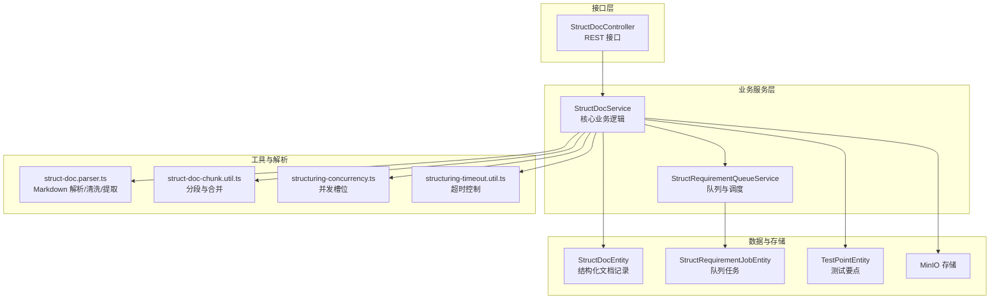
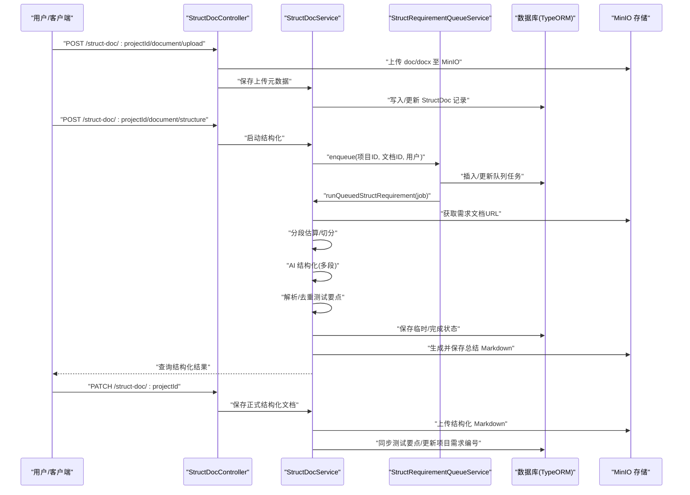
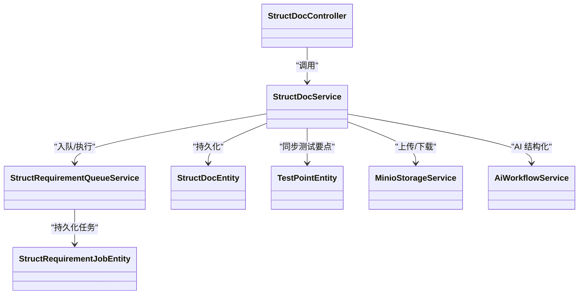

# 结构化文档模块

<cite>
**本文引用的文件**
- [apps/api/src/modules/struct-doc/controller/struct-doc.controller.ts](file://apps/api/src/modules/struct-doc/controller/struct-doc.controller.ts)
- [apps/api/src/modules/struct-doc/service/struct-doc.service.ts](file://apps/api/src/modules/struct-doc/service/struct-doc.service.ts)
- [apps/api/src/modules/struct-doc/service/struct-requirement-queue.service.ts](file://apps/api/src/modules/struct-doc/service/struct-requirement-queue.service.ts)
- [apps/api/src/modules/struct-doc/util/struct-doc.parser.ts](file://apps/api/src/modules/struct-doc/util/struct-doc.parser.ts)
- [apps/api/src/modules/struct-doc/util/struct-doc-chunk.util.ts](file://apps/api/src/modules/struct-doc/util/struct-doc-chunk.util.ts)
- [apps/api/src/modules/struct-doc/util/structuring-concurrency.ts](file://apps/api/src/modules/struct-doc/util/structuring-concurrency.ts)
- [apps/api/src/modules/struct-doc/util/structuring-timeout.util.ts](file://apps/api/src/modules/struct-doc/util/structuring-timeout.util.ts)
- [apps/api/src/modules/struct-doc/util/struct-requirement-interrupted.util.ts](file://apps/api/src/modules/struct-doc/util/struct-requirement-interrupted.util.ts)
- [apps/api/src/modules/struct-doc/entity/struct-doc.entity.ts](file://apps/api/src/modules/struct-doc/entity/struct-doc.entity.ts)
- [apps/api/src/modules/struct-doc/entity/struct-requirement-job.entity.ts](file://apps/api/src/modules/struct-doc/entity/struct-requirement-job.entity.ts)
- [apps/api/src/modules/struct-doc/entity/test-point.entity.ts](file://apps/api/src/modules/struct-doc/entity/test-point.entity.ts)
- [apps/api/src/modules/struct-doc/dto/save-struct-doc.dto.ts](file://apps/api/src/modules/struct-doc/dto/save-struct-doc.dto.ts)
- [apps/api/src/modules/struct-doc/dto/auto-save-struct-doc.dto.ts](file://apps/api/src/modules/struct-doc/dto/auto-save-struct-doc.dto.ts)
- [packages/shared/src/struct-doc.ts](file://packages/shared/src/struct-doc.ts)
</cite>

## 目录
1. [简介](#简介)
2. [项目结构](#项目结构)
3. [核心组件](#核心组件)
4. [架构总览](#架构总览)
5. [详细组件分析](#详细组件分析)
6. [依赖分析](#依赖分析)
7. [性能考虑](#性能考虑)
8. [故障排查指南](#故障排查指南)
9. [结论](#结论)
10. [附录](#附录)

## 简介
本模块面向“结构化需求文档”的全链路处理能力，涵盖文档上传、AI 异步结构化、分段处理、Markdown 解析与去重、测试要点同步、临时/正式保存、MinIO 存储集成、并发与超时控制、以及在案例生成流程中的数据流转。其设计目标是：
- 支持 doc/docx 需求文档上传与元数据记录；
- 通过 AI 对长文档进行分段结构化，保证解析准确与性能稳定；
- 将结构化结果解析为标准化的测试要点模型，支持增量/全量同步；
- 提供并发槽位与超时控制，保障系统稳定性；
- 为案例生成提供高质量、可复用的需求总结。

## 项目结构
结构化文档模块位于应用后端的 struct-doc 子域，采用“控制器-服务-工具-实体-DTO”的分层组织方式，配合数据库持久化与 MinIO 存储，形成闭环的数据处理流水线。

图示来源
- [apps/api/src/modules/struct-doc/controller/struct-doc.controller.ts:38-177](file://apps/api/src/modules/struct-doc/controller/struct-doc.controller.ts#L38-L177)
- [apps/api/src/modules/struct-doc/service/struct-doc.service.ts:54-800](file://apps/api/src/modules/struct-doc/service/struct-doc.service.ts#L54-L800)
- [apps/api/src/modules/struct-doc/service/struct-requirement-queue.service.ts:24-288](file://apps/api/src/modules/struct-doc/service/struct-requirement-queue.service.ts#L24-L288)
- [apps/api/src/modules/struct-doc/util/struct-doc.parser.ts:33-824](file://apps/api/src/modules/struct-doc/util/struct-doc.parser.ts#L33-L824)
- [apps/api/src/modules/struct-doc/util/struct-doc-chunk.util.ts:286-478](file://apps/api/src/modules/struct-doc/util/struct-doc-chunk.util.ts#L286-L478)
- [apps/api/src/modules/struct-doc/util/structuring-concurrency.ts:52-67](file://apps/api/src/modules/struct-doc/util/structuring-concurrency.ts#L52-L67)
- [apps/api/src/modules/struct-doc/util/structuring-timeout.util.ts:5-74](file://apps/api/src/modules/struct-doc/util/structuring-timeout.util.ts#L5-L74)
- [apps/api/src/modules/struct-doc/entity/struct-doc.entity.ts:31-105](file://apps/api/src/modules/struct-doc/entity/struct-doc.entity.ts#L31-L105)
- [apps/api/src/modules/struct-doc/entity/struct-requirement-job.entity.ts:24-69](file://apps/api/src/modules/struct-doc/entity/struct-requirement-job.entity.ts#L24-L69)
- [apps/api/src/modules/struct-doc/entity/test-point.entity.ts:23-119](file://apps/api/src/modules/struct-doc/entity/test-point.entity.ts#L23-L119)

章节来源
- [apps/api/src/modules/struct-doc/controller/struct-doc.controller.ts:38-177](file://apps/api/src/modules/struct-doc/controller/struct-doc.controller.ts#L38-L177)
- [apps/api/src/modules/struct-doc/service/struct-doc.service.ts:54-800](file://apps/api/src/modules/struct-doc/service/struct-doc.service.ts#L54-L800)
- [apps/api/src/modules/struct-doc/service/struct-requirement-queue.service.ts:24-288](file://apps/api/src/modules/struct-doc/service/struct-requirement-queue.service.ts#L24-L288)

## 核心组件
- 控制器层：提供上传、结构化、取消、查询、自动保存、正式保存等 REST 接口，负责参数校验与鉴权范围检查。
- 服务层：封装业务流程，协调队列、存储、AI 工作流与实体持久化，实现超时与并发控制、任务恢复与状态管理。
- 队列服务：基于数据库的任务表实现入队、抢占、运行、完成/失败/取消状态管理，支持服务重启恢复。
- 解析工具：多策略解析结构化 Markdown，提取系统/模块/测试要点，清洗 AI 输出，去重与标准化。
- 分段工具：按章节/字符窗口切分长文档，合并多段结构化结果，生成统一的最终 Markdown。
- 实体模型：结构化文档记录、队列任务、测试要点三类实体，定义字段、索引与关联关系。
- DTO：定义保存结构化文档与自动保存的输入结构，约束字段合法性。

章节来源
- [apps/api/src/modules/struct-doc/controller/struct-doc.controller.ts:38-177](file://apps/api/src/modules/struct-doc/controller/struct-doc.controller.ts#L38-L177)
- [apps/api/src/modules/struct-doc/service/struct-doc.service.ts:54-800](file://apps/api/src/modules/struct-doc/service/struct-doc.service.ts#L54-L800)
- [apps/api/src/modules/struct-doc/service/struct-requirement-queue.service.ts:24-288](file://apps/api/src/modules/struct-doc/service/struct-requirement-queue.service.ts#L24-L288)
- [apps/api/src/modules/struct-doc/util/struct-doc.parser.ts:33-824](file://apps/api/src/modules/struct-doc/util/struct-doc.parser.ts#L33-L824)
- [apps/api/src/modules/struct-doc/util/struct-doc-chunk.util.ts:286-478](file://apps/api/src/modules/struct-doc/util/struct-doc-chunk.util.ts#L286-L478)
- [apps/api/src/modules/struct-doc/entity/struct-doc.entity.ts:31-105](file://apps/api/src/modules/struct-doc/entity/struct-doc.entity.ts#L31-L105)
- [apps/api/src/modules/struct-doc/entity/struct-requirement-job.entity.ts:24-69](file://apps/api/src/modules/struct-doc/entity/struct-requirement-job.entity.ts#L24-L69)
- [apps/api/src/modules/struct-doc/entity/test-point.entity.ts:23-119](file://apps/api/src/modules/struct-doc/entity/test-point.entity.ts#L23-L119)
- [apps/api/src/modules/struct-doc/dto/save-struct-doc.dto.ts:54-76](file://apps/api/src/modules/struct-doc/dto/save-struct-doc.dto.ts#L54-L76)
- [apps/api/src/modules/struct-doc/dto/auto-save-struct-doc.dto.ts:9-16](file://apps/api/src/modules/struct-doc/dto/auto-save-struct-doc.dto.ts#L9-L16)

## 架构总览
整体架构以“控制器-服务-队列-实体-存储”为主线，结合解析与分段工具，形成可扩展、可观测、可恢复的结构化处理流水线。

图示来源
- [apps/api/src/modules/struct-doc/controller/struct-doc.controller.ts:68-122](file://apps/api/src/modules/struct-doc/controller/struct-doc.controller.ts#L68-L122)
- [apps/api/src/modules/struct-doc/service/struct-doc.service.ts:238-406](file://apps/api/src/modules/struct-doc/service/struct-doc.service.ts#L238-L406)
- [apps/api/src/modules/struct-doc/service/struct-requirement-queue.service.ts:90-286](file://apps/api/src/modules/struct-doc/service/struct-requirement-queue.service.ts#L90-L286)
- [apps/api/src/modules/struct-doc/util/struct-doc-chunk.util.ts:286-316](file://apps/api/src/modules/struct-doc/util/struct-doc-chunk.util.ts#L286-L316)

## 详细组件分析

### 控制器层：HTTP 接口与参数校验
- 上传接口：限制文件大小与扩展名，校验项目归属，上传至 MinIO 并记录元数据。
- 结构化接口：异步触发，支持取消；查询接口支持开关是否包含测试要点列表。
- 自动保存与正式保存：前者持久化临时 Markdown，后者将结构化文档写入 MinIO 并同步测试要点。

章节来源
- [apps/api/src/modules/struct-doc/controller/struct-doc.controller.ts:48-177](file://apps/api/src/modules/struct-doc/controller/struct-doc.controller.ts#L48-L177)
- [packages/shared/src/struct-doc.ts:1-5](file://packages/shared/src/struct-doc.ts#L1-L5)

### 服务层：核心业务逻辑
- 上传状态查询、保存上传元数据（支持强制覆盖清理历史测试要点）。
- 启动结构化：若已有进行中任务则直接返回；否则入队并更新状态。
- 队列执行：设置开始时间与状态，拉取需求文本与技能模板，估算分段数，执行结构化，解析测试要点，生成总结，更新项目需求编号。
- 超时与失败处理：到期标记失败、失败消息回填、队列任务失败/取消。
- 案例生成需求总结：优先返回缓存总结，缺失时按需生成并回退全文。

章节来源
- [apps/api/src/modules/struct-doc/service/struct-doc.service.ts:76-799](file://apps/api/src/modules/struct-doc/service/struct-doc.service.ts#L76-L799)

### 队列服务：任务调度与恢复
- 入队：若存在活动任务则直接返回；否则更新文档状态并插入队列记录。
- 抢占与运行：基于数据库乐观更新抢占任务，运行结束后根据文档状态更新队列任务状态。
- 重启恢复：将运行中任务重置为待入队，补建缺失的队列任务，确保“结构化中”状态可恢复。
- 并发与释放钩子：通过全局槽位与释放回调驱动泵式调度。

章节来源
- [apps/api/src/modules/struct-doc/service/struct-requirement-queue.service.ts:90-286](file://apps/api/src/modules/struct-doc/service/struct-requirement-queue.service.ts#L90-L286)

### 解析工具：Markdown 解析与清洗
- 多策略解析：功能模块分块 → 宽松功能模块 → 旧版标题块 → 纯文本 → 全局测试要点章节。
- 清洗与标准化：去除 AI 思维标签、统一测试要点条目格式、规范化章节边界。
- 去重：基于系统/模块/测试要点标题/描述组合键去重。
- 文件名与编号：生成结构化文档默认文件名、提取需求编号。

章节来源
- [apps/api/src/modules/struct-doc/util/struct-doc.parser.ts:33-824](file://apps/api/src/modules/struct-doc/util/struct-doc.parser.ts#L33-L824)

### 分段工具：长文档切分与合并
- 预估分段：依据字符数与系统章节结构决定是否分段。
- 切分策略：系统章节优先；其次按章节打包；最后按字符窗口硬切分。
- 合并策略：按系统/模块维度去重合并，生成统一标题、概述与系统分析章节。

章节来源
- [apps/api/src/modules/struct-doc/util/struct-doc-chunk.util.ts:68-478](file://apps/api/src/modules/struct-doc/util/struct-doc-chunk.util.ts#L68-L478)

### 并发与超时控制
- 并发槽位：全局并发上限与项目占用检测，防止 AI 调用过载。
- 超时策略：基础超时分钟数与每段额外分钟数，超时自动失败并回填消息。
- 最大预估分段：限制超时计算的分段基数，避免极端情况下的过长等待。

章节来源
- [apps/api/src/modules/struct-doc/util/structuring-concurrency.ts:52-67](file://apps/api/src/modules/struct-doc/util/structuring-concurrency.ts#L52-L67)
- [apps/api/src/modules/struct-doc/util/structuring-timeout.util.ts:5-74](file://apps/api/src/modules/struct-doc/util/structuring-timeout.util.ts#L5-L74)

### 实体模型：数据结构与关系
- 结构化文档记录：记录原始/结构化文档路径、临时/总结 Markdown、结构化状态与错误信息。
- 队列任务：持久化任务状态、排队/开始/结束时间、错误消息。
- 测试要点：系统/模块/测试要点及其描述，关联结构化文档与项目。

章节来源
- [apps/api/src/modules/struct-doc/entity/struct-doc.entity.ts:31-105](file://apps/api/src/modules/struct-doc/entity/struct-doc.entity.ts#L31-L105)
- [apps/api/src/modules/struct-doc/entity/struct-requirement-job.entity.ts:24-69](file://apps/api/src/modules/struct-doc/entity/struct-requirement-job.entity.ts#L24-L69)
- [apps/api/src/modules/struct-doc/entity/test-point.entity.ts:23-119](file://apps/api/src/modules/struct-doc/entity/test-point.entity.ts#L23-L119)

### DTO：输入约束与示例
- 保存结构化文档 DTO：结构化 Markdown、文件名、测试要点列表。
- 自动保存 DTO：临时 Markdown 内容。

章节来源
- [apps/api/src/modules/struct-doc/dto/save-struct-doc.dto.ts:54-76](file://apps/api/src/modules/struct-doc/dto/save-struct-doc.dto.ts#L54-L76)
- [apps/api/src/modules/struct-doc/dto/auto-save-struct-doc.dto.ts:9-16](file://apps/api/src/modules/struct-doc/dto/auto-save-struct-doc.dto.ts#L9-L16)

## 依赖分析
- 组件耦合：控制器依赖服务；服务依赖队列、存储、解析与分段工具；队列依赖服务执行；实体间通过外键关联。
- 外部依赖：MinIO 存储、TypeORM、AI 工作流服务。
- 循环依赖：通过 forwardRef 解决服务间的循环依赖问题。

图示来源
- [apps/api/src/modules/struct-doc/controller/struct-doc.controller.ts:38-177](file://apps/api/src/modules/struct-doc/controller/struct-doc.controller.ts#L38-L177)
- [apps/api/src/modules/struct-doc/service/struct-doc.service.ts:54-800](file://apps/api/src/modules/struct-doc/service/struct-doc.service.ts#L54-L800)
- [apps/api/src/modules/struct-doc/service/struct-requirement-queue.service.ts:24-288](file://apps/api/src/modules/struct-doc/service/struct-requirement-queue.service.ts#L24-L288)
- [apps/api/src/modules/struct-doc/entity/struct-doc.entity.ts:31-105](file://apps/api/src/modules/struct-doc/entity/struct-doc.entity.ts#L31-L105)
- [apps/api/src/modules/struct-doc/entity/struct-requirement-job.entity.ts:24-69](file://apps/api/src/modules/struct-doc/entity/struct-requirement-job.entity.ts#L24-L69)
- [apps/api/src/modules/struct-doc/entity/test-point.entity.ts:23-119](file://apps/api/src/modules/struct-doc/entity/test-point.entity.ts#L23-L119)

## 性能考虑
- 分段结构化：针对长文档按系统章节或字符窗口切分，降低单次 AI 调用负载，提升吞吐与稳定性。
- 并发控制：全局并发上限与项目占用检测，避免 AI 限流与资源争用。
- 超时策略：可配置的基础超时与分段加时，防止长时间占用资源。
- 缓存与回退：案例生成需求总结优先使用缓存，失败时回退全文，兼顾性能与正确性。
- 存储与索引：实体建立关键索引，减少查询成本；MinIO 使用短期访问链接，避免长期暴露。

## 故障排查指南
- 结构化进行中但无任务：检查队列中是否存在“运行中”任务，必要时通过取消接口重置状态。
- 超时失败：确认超时配置与分段数；查看日志中的超时消息；适当提高超时分钟数。
- 解析不到测试要点：确认 Markdown 是否包含标准章节结构；查看解析日志中的警告。
- 上传失败：检查文件大小与扩展名限制；确认 MinIO 连接与权限。
- 重启恢复：服务启动会自动将运行中任务重置为待入队并补建队列任务，观察日志确认恢复数量。

章节来源
- [apps/api/src/modules/struct-doc/service/struct-doc.service.ts:76-94](file://apps/api/src/modules/struct-doc/service/struct-doc.service.ts#L76-L94)
- [apps/api/src/modules/struct-doc/service/struct-requirement-queue.service.ts:133-185](file://apps/api/src/modules/struct-doc/service/struct-requirement-queue.service.ts#L133-L185)
- [apps/api/src/modules/struct-doc/util/structuring-timeout.util.ts:35-62](file://apps/api/src/modules/struct-doc/util/structuring-timeout.util.ts#L35-L62)

## 结论
该模块通过清晰的分层设计与完善的工具链，实现了从需求文档上传到结构化输出、测试要点同步与案例生成支持的完整闭环。其分段结构化、并发与超时控制、任务恢复与解析去重等机制，既保证了解析准确性，也提升了系统的稳定性与可维护性。

## 附录

### API 接口规范
- 查询上传状态
  - 方法与路径：GET /struct-doc/{projectId}/upload-status
  - 返回：hasExisting, reqDocName
- 上传 doc/docx
  - 方法与路径：POST /struct-doc/{projectId}/document/upload
  - 参数：multipart/form-data，file（doc/docx），query.force（可选）
  - 限制：大小不超过 30MB，扩展名 doc/docx
- 异步结构化
  - 方法与路径：POST /struct-doc/{projectId}/document/structure
  - 返回：当前结构化详情（202）
- 取消结构化
  - 方法与路径：POST /struct-doc/{projectId}/document/structure/cancel
  - 返回：当前结构化详情
- 查询结构化文档与测试要点
  - 方法与路径：GET /struct-doc/{projectId}
  - 参数：includeTestPoints=false 时仅返回元数据与状态
- 自动保存临时 Markdown
  - 方法与路径：PATCH /struct-doc/{projectId}/auto-save
  - 参数：tempStructDoc
- 保存正式结构化文档
  - 方法与路径：PATCH /struct-doc/{projectId}
  - 参数：structuredDocName（可选）、tempStructDoc（可选）、testPoints（可选）

章节来源
- [apps/api/src/modules/struct-doc/controller/struct-doc.controller.ts:48-177](file://apps/api/src/modules/struct-doc/controller/struct-doc.controller.ts#L48-L177)
- [apps/api/src/modules/struct-doc/dto/save-struct-doc.dto.ts:54-76](file://apps/api/src/modules/struct-doc/dto/save-struct-doc.dto.ts#L54-L76)
- [apps/api/src/modules/struct-doc/dto/auto-save-struct-doc.dto.ts:9-16](file://apps/api/src/modules/struct-doc/dto/auto-save-struct-doc.dto.ts#L9-L16)
- [packages/shared/src/struct-doc.ts:1-5](file://packages/shared/src/struct-doc.ts#L1-L5)

### 支持的文档格式
- 需求文档：doc、docx（上传限制 30MB）
- 结构化输出：Markdown（.md）

章节来源
- [apps/api/src/modules/struct-doc/controller/struct-doc.controller.ts:84-87](file://apps/api/src/modules/struct-doc/controller/struct-doc.controller.ts#L84-L87)
- [packages/shared/src/struct-doc.ts:1-5](file://packages/shared/src/struct-doc.ts#L1-L5)

### 使用示例（步骤说明）
- 上传需求文档：选择 doc/docx 文件，确认大小与扩展名符合要求，上传成功后记录元数据。
- 触发结构化：点击“结构化”，系统入队并开始异步处理；可随时取消。
- 查看结果：查询接口返回结构化详情与测试要点列表。
- 在线编辑：自动保存临时 Markdown，便于持续编辑。
- 正式保存：确认结构化内容后保存，系统上传 Markdown 至 MinIO 并同步测试要点。

章节来源
- [apps/api/src/modules/struct-doc/controller/struct-doc.controller.ts:68-177](file://apps/api/src/modules/struct-doc/controller/struct-doc.controller.ts#L68-L177)
- [apps/api/src/modules/struct-doc/service/struct-doc.service.ts:238-648](file://apps/api/src/modules/struct-doc/service/struct-doc.service.ts#L238-L648)

### 文档处理在案例生成流程中的作用
- 需求总结：优先使用缓存的案例生成需求总结，失败时回退全文，保障案例生成效率。
- 测试要点同步：结构化完成后解析测试要点并增量同步，确保案例树构建所需数据完整。
- 项目信息联动：提取需求编号并更新项目信息，便于后续流程引用。

章节来源
- [apps/api/src/modules/struct-doc/service/struct-doc.service.ts:502-549](file://apps/api/src/modules/struct-doc/service/struct-doc.service.ts#L502-L549)
- [apps/api/src/modules/struct-doc/service/struct-doc.service.ts:652-667](file://apps/api/src/modules/struct-doc/service/struct-doc.service.ts#L652-L667)
- [apps/api/src/modules/struct-doc/util/struct-doc.parser.ts:815-823](file://apps/api/src/modules/struct-doc/util/struct-doc.parser.ts#L815-L823)