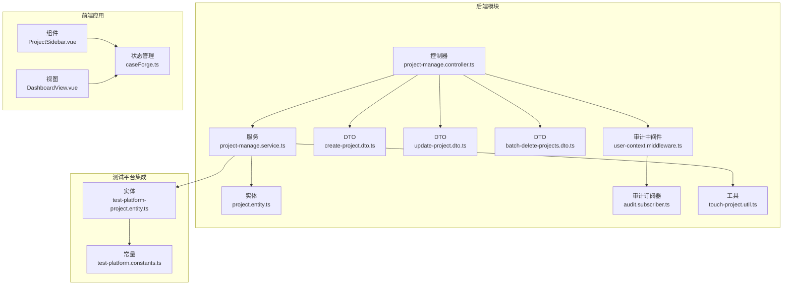
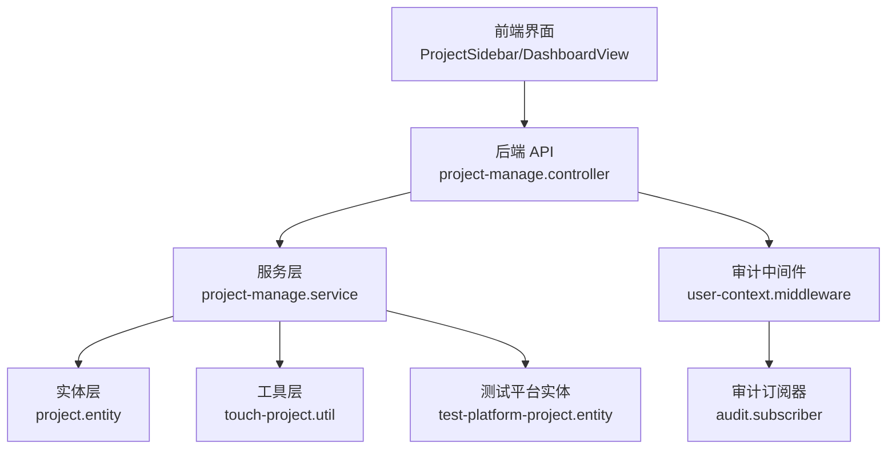
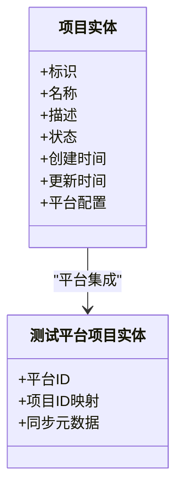
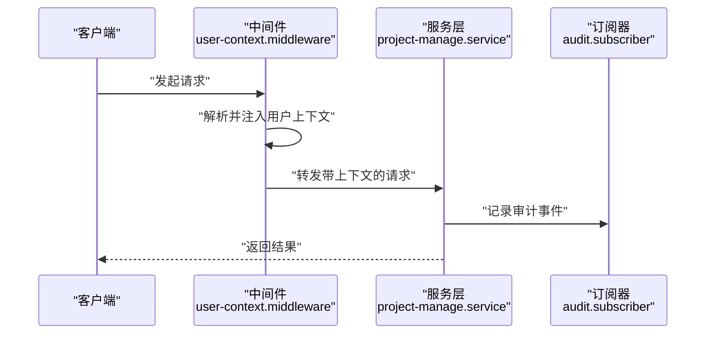
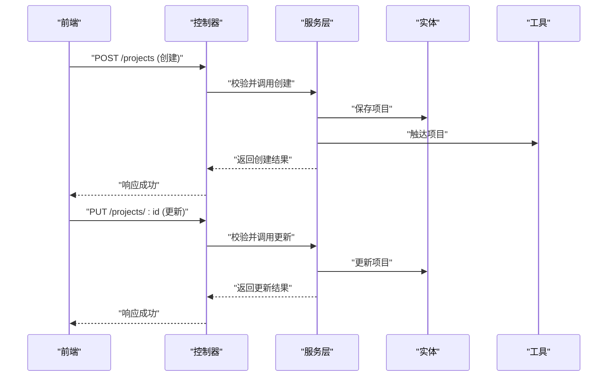
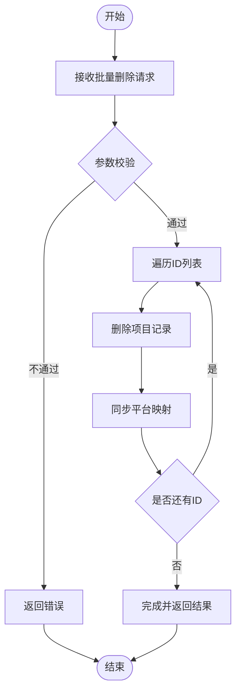
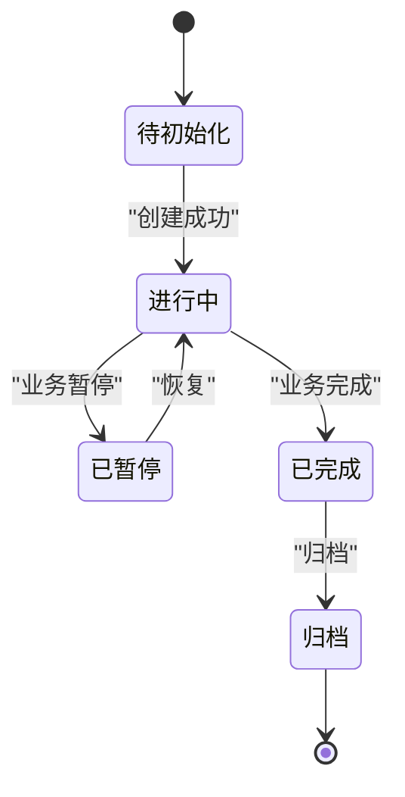
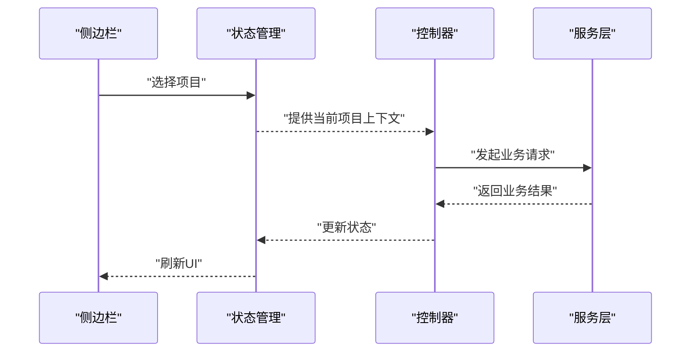
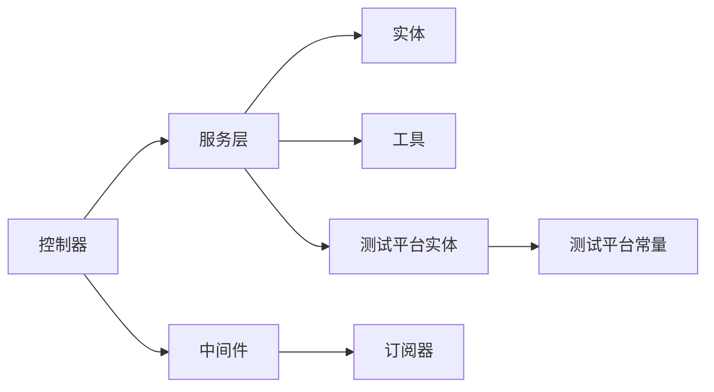

# 项目管理模块

<cite>
**本文档引用的文件**
- [apps/api/src/modules/project-manage/controller/project-manage.controller.ts](file://apps/api/src/modules/project-manage/controller/project-manage.controller.ts)
- [apps/api/src/modules/project-manage/service/project-manage.service.ts](file://apps/api/src/modules/project-manage/service/project-manage.service.ts)
- [apps/api/src/modules/project-manage/entity/project.entity.ts](file://apps/api/src/modules/project-manage/entity/project.entity.ts)
- [apps/api/src/modules/project-manage/dto/create-project.dto.ts](file://apps/api/src/modules/project-manage/dto/create-project.dto.ts)
- [apps/api/src/modules/project-manage/dto/update-project.dto.ts](file://apps/api/src/modules/project-manage/dto/update-project.dto.ts)
- [apps/api/src/modules/project-manage/dto/batch-delete-projects.dto.ts](file://apps/api/src/modules/project-manage/dto/batch-delete-projects.dto.ts)
- [apps/api/src/common/project/touch-project.util.ts](file://apps/api/src/common/project/touch-project.util.ts)
- [apps/web/src/components/ProjectSidebar.vue](file://apps/web/src/components/ProjectSidebar.vue)
- [apps/web/src/views/DashboardView.vue](file://apps/web/src/views/DashboardView.vue)
- [apps/web/src/stores/caseForge.ts](file://apps/web/src/stores/caseForge.ts)
- [apps/api/src/modules/test-platform/entity/test-platform-project.entity.ts](file://apps/api/src/modules/test-platform/entity/test-platform-project.entity.ts)
- [apps/api/src/modules/test-platform/test-platform.constants.ts](file://apps/api/src/modules/test-platform/test-platform.constants.ts)
- [apps/api/src/common/audit/user-context.middleware.ts](file://apps/api/src/common/audit/user-context.middleware.ts)
- [apps/api/src/common/audit/user-scope.ts](file://apps/api/src/common/audit/user-scope.ts)
- [apps/api/src/common/audit/audit.subscriber.ts](file://apps/api/src/common/audit/audit.subscriber.ts)
</cite>

## 目录
1. [简介](#简介)
2. [项目结构](#项目结构)
3. [核心组件](#核心组件)
4. [架构总览](#架构总览)
5. [详细组件分析](#详细组件分析)
6. [依赖分析](#依赖分析)
7. [性能考虑](#性能考虑)
8. [故障排除指南](#故障排除指南)
9. [结论](#结论)
10. [附录](#附录)

## 简介
本文件面向项目管理模块的业务与技术实现，围绕“项目”的创建、维护、权限控制、状态管理与生命周期、批量操作、平台集成与跨平台兼容性展开。文档以代码库为依据，梳理模块边界、数据模型、接口契约与前端交互，并给出可操作的流程图与时序图，帮助开发者与产品人员快速理解并正确使用项目管理能力。

## 项目结构
项目管理模块位于后端 NestJS 应用的 modules 子目录中，采用按功能分层的组织方式：控制器（controller）、服务（service）、实体（entity）与 DTO（数据传输对象）。前端侧通过 Web 应用提供项目侧边栏、仪表盘等交互入口；同时存在审计中间件与订阅器保障用户上下文与变更追踪。

**图表来源**
- [apps/api/src/modules/project-manage/controller/project-manage.controller.ts](file://apps/api/src/modules/project-manage/controller/project-manage.controller.ts)
- [apps/api/src/modules/project-manage/service/project-manage.service.ts](file://apps/api/src/modules/project-manage/service/project-manage.service.ts)
- [apps/api/src/modules/project-manage/entity/project.entity.ts](file://apps/api/src/modules/project-manage/entity/project.entity.ts)
- [apps/api/src/modules/project-manage/dto/create-project.dto.ts](file://apps/api/src/modules/project-manage/dto/create-project.dto.ts)
- [apps/api/src/modules/project-manage/dto/update-project.dto.ts](file://apps/api/src/modules/project-manage/dto/update-project.dto.ts)
- [apps/api/src/modules/project-manage/dto/batch-delete-projects.dto.ts](file://apps/api/src/modules/project-manage/dto/batch-delete-projects.dto.ts)
- [apps/api/src/common/project/touch-project.util.ts](file://apps/api/src/common/project/touch-project.util.ts)
- [apps/api/src/common/audit/user-context.middleware.ts](file://apps/api/src/common/audit/user-context.middleware.ts)
- [apps/api/src/common/audit/audit.subscriber.ts](file://apps/api/src/common/audit/audit.subscriber.ts)
- [apps/api/src/modules/test-platform/entity/test-platform-project.entity.ts](file://apps/api/src/modules/test-platform/entity/test-platform-project.entity.ts)
- [apps/api/src/modules/test-platform/test-platform.constants.ts](file://apps/api/src/modules/test-platform/test-platform.constants.ts)
- [apps/web/src/components/ProjectSidebar.vue](file://apps/web/src/components/ProjectSidebar.vue)
- [apps/web/src/views/DashboardView.vue](file://apps/web/src/views/DashboardView.vue)
- [apps/web/src/stores/caseForge.ts](file://apps/web/src/stores/caseForge.ts)

**章节来源**
- [apps/api/src/modules/project-manage/controller/project-manage.controller.ts](file://apps/api/src/modules/project-manage/controller/project-manage.controller.ts)
- [apps/api/src/modules/project-manage/service/project-manage.service.ts](file://apps/api/src/modules/project-manage/service/project-manage.service.ts)
- [apps/api/src/modules/project-manage/entity/project.entity.ts](file://apps/api/src/modules/project-manage/entity/project.entity.ts)
- [apps/api/src/modules/project-manage/dto/create-project.dto.ts](file://apps/api/src/modules/project-manage/dto/create-project.dto.ts)
- [apps/api/src/modules/project-manage/dto/update-project.dto.ts](file://apps/api/src/modules/project-manage/dto/update-project.dto.ts)
- [apps/api/src/modules/project-manage/dto/batch-delete-projects.dto.ts](file://apps/api/src/modules/project-manage/dto/batch-delete-projects.dto.ts)
- [apps/api/src/common/project/touch-project.util.ts](file://apps/api/src/common/project/touch-project.util.ts)
- [apps/api/src/common/audit/user-context.middleware.ts](file://apps/api/src/common/audit/user-context.middleware.ts)
- [apps/api/src/common/audit/audit.subscriber.ts](file://apps/api/src/common/audit/audit.subscriber.ts)
- [apps/api/src/modules/test-platform/entity/test-platform-project.entity.ts](file://apps/api/src/modules/test-platform/entity/test-platform-project.entity.ts)
- [apps/api/src/modules/test-platform/test-platform.constants.ts](file://apps/api/src/modules/test-platform/test-platform.constants.ts)
- [apps/web/src/components/ProjectSidebar.vue](file://apps/web/src/components/ProjectSidebar.vue)
- [apps/web/src/views/DashboardView.vue](file://apps/web/src/views/DashboardView.vue)
- [apps/web/src/stores/caseForge.ts](file://apps/web/src/stores/caseForge.ts)

## 核心组件
- 控制器：负责接收 HTTP 请求、参数校验、调用服务层并返回响应。
- 服务层：封装业务逻辑，处理项目 CRUD、批量操作、状态更新与平台集成。
- 实体：定义项目数据模型及与数据库表的映射关系。
- DTO：约束请求输入，确保参数合法性与一致性。
- 审计链路：通过中间件注入用户上下文，订阅器记录审计事件。
- 工具：提供项目“触达”（最近活跃时间等）辅助能力。
- 前端交互：侧边栏与仪表盘联动状态管理，驱动项目选择与切换。

**章节来源**
- [apps/api/src/modules/project-manage/controller/project-manage.controller.ts](file://apps/api/src/modules/project-manage/controller/project-manage.controller.ts)
- [apps/api/src/modules/project-manage/service/project-manage.service.ts](file://apps/api/src/modules/project-manage/service/project-manage.service.ts)
- [apps/api/src/modules/project-manage/entity/project.entity.ts](file://apps/api/src/modules/project-manage/entity/project.entity.ts)
- [apps/api/src/common/audit/user-context.middleware.ts](file://apps/api/src/common/audit/user-context.middleware.ts)
- [apps/api/src/common/audit/audit.subscriber.ts](file://apps/api/src/common/audit/audit.subscriber.ts)
- [apps/api/src/common/project/touch-project.util.ts](file://apps/api/src/common/project/touch-project.util.ts)
- [apps/web/src/components/ProjectSidebar.vue](file://apps/web/src/components/ProjectSidebar.vue)
- [apps/web/src/views/DashboardView.vue](file://apps/web/src/views/DashboardView.vue)
- [apps/web/src/stores/caseForge.ts](file://apps/web/src/stores/caseForge.ts)

## 架构总览
项目管理模块遵循典型的三层架构：表现层（Web 前端）、应用层（NestJS 控制器与服务）、基础设施层（TypeORM 实体与审计）。模块间通过清晰的 DTO 输入输出契约进行解耦，服务层对业务规则进行集中处理，审计中间件与订阅器贯穿请求生命周期以保证可追溯性。

**图表来源**
- [apps/api/src/modules/project-manage/controller/project-manage.controller.ts](file://apps/api/src/modules/project-manage/controller/project-manage.controller.ts)
- [apps/api/src/modules/project-manage/service/project-manage.service.ts](file://apps/api/src/modules/project-manage/service/project-manage.service.ts)
- [apps/api/src/modules/project-manage/entity/project.entity.ts](file://apps/api/src/modules/project-manage/entity/project.entity.ts)
- [apps/api/src/common/project/touch-project.util.ts](file://apps/api/src/common/project/touch-project.util.ts)
- [apps/api/src/common/audit/user-context.middleware.ts](file://apps/api/src/common/audit/user-context.middleware.ts)
- [apps/api/src/common/audit/audit.subscriber.ts](file://apps/api/src/common/audit/audit.subscriber.ts)
- [apps/api/src/modules/test-platform/entity/test-platform-project.entity.ts](file://apps/api/src/modules/test-platform/entity/test-platform-project.entity.ts)
- [apps/web/src/components/ProjectSidebar.vue](file://apps/web/src/components/ProjectSidebar.vue)
- [apps/web/src/views/DashboardView.vue](file://apps/web/src/views/DashboardView.vue)

## 详细组件分析

### 数据模型与业务规则
项目实体承载项目的基本信息与状态，服务层负责在其基础上实现业务规则与状态转换。实体与平台集成相关联，支持跨平台同步与兼容。

**图表来源**
- [apps/api/src/modules/project-manage/entity/project.entity.ts](file://apps/api/src/modules/project-manage/entity/project.entity.ts)
- [apps/api/src/modules/test-platform/entity/test-platform-project.entity.ts](file://apps/api/src/modules/test-platform/entity/test-platform-project.entity.ts)

**章节来源**
- [apps/api/src/modules/project-manage/entity/project.entity.ts](file://apps/api/src/modules/project-manage/entity/project.entity.ts)
- [apps/api/src/modules/test-platform/entity/test-platform-project.entity.ts](file://apps/api/src/modules/test-platform/entity/test-platform-project.entity.ts)

### 权限控制与访问策略
- 用户上下文注入：通过审计中间件在请求进入时解析并注入当前用户信息，确保后续服务层与审计记录具备正确的主体上下文。
- 用户作用域：结合用户作用域定义，限定用户可见与可操作的项目范围，避免越权访问。
- 审计订阅：订阅器记录关键操作事件，便于回溯与合规审查。

**图表来源**
- [apps/api/src/common/audit/user-context.middleware.ts](file://apps/api/src/common/audit/user-context.middleware.ts)
- [apps/api/src/common/audit/audit.subscriber.ts](file://apps/api/src/common/audit/audit.subscriber.ts)
- [apps/api/src/modules/project-manage/service/project-manage.service.ts](file://apps/api/src/modules/project-manage/service/project-manage.service.ts)

**章节来源**
- [apps/api/src/common/audit/user-context.middleware.ts](file://apps/api/src/common/audit/user-context.middleware.ts)
- [apps/api/src/common/audit/user-scope.ts](file://apps/api/src/common/audit/user-scope.ts)
- [apps/api/src/common/audit/audit.subscriber.ts](file://apps/api/src/common/audit/audit.subscriber.ts)

### 创建与维护流程
- 创建：前端提交创建 DTO，控制器进行参数校验后交由服务层持久化；服务层可触发项目“触达”工具以初始化活跃时间等元数据。
- 维护：更新 DTO 覆盖性地更新项目属性；服务层执行业务规则校验与平台同步。
- 触达：工具方法用于更新项目最近活跃时间或相关指标，确保项目列表排序与检索的时效性。

**图表来源**
- [apps/api/src/modules/project-manage/controller/project-manage.controller.ts](file://apps/api/src/modules/project-manage/controller/project-manage.controller.ts)
- [apps/api/src/modules/project-manage/service/project-manage.service.ts](file://apps/api/src/modules/project-manage/service/project-manage.service.ts)
- [apps/api/src/modules/project-manage/entity/project.entity.ts](file://apps/api/src/modules/project-manage/entity/project.entity.ts)
- [apps/api/src/common/project/touch-project.util.ts](file://apps/api/src/common/project/touch-project.util.ts)

**章节来源**
- [apps/api/src/modules/project-manage/controller/project-manage.controller.ts](file://apps/api/src/modules/project-manage/controller/project-manage.controller.ts)
- [apps/api/src/modules/project-manage/service/project-manage.service.ts](file://apps/api/src/modules/project-manage/service/project-manage.service.ts)
- [apps/api/src/common/project/touch-project.util.ts](file://apps/api/src/common/project/touch-project.util.ts)

### 批量操作与状态管理
- 批量删除：通过批量 DTO 提供 ID 列表，服务层逐项校验与删除，必要时清理平台映射与关联资源。
- 状态管理：服务层根据业务规则推进项目状态流转，审计订阅器记录状态变更历史，前端通过状态管理驱动 UI 更新。

**图表来源**
- [apps/api/src/modules/project-manage/dto/batch-delete-projects.dto.ts](file://apps/api/src/modules/project-manage/dto/batch-delete-projects.dto.ts)
- [apps/api/src/modules/project-manage/service/project-manage.service.ts](file://apps/api/src/modules/project-manage/service/project-manage.service.ts)

**章节来源**
- [apps/api/src/modules/project-manage/dto/batch-delete-projects.dto.ts](file://apps/api/src/modules/project-manage/dto/batch-delete-projects.dto.ts)
- [apps/api/src/modules/project-manage/service/project-manage.service.ts](file://apps/api/src/modules/project-manage/service/project-manage.service.ts)

### 生命周期控制与平台集成
- 生命周期：从创建到启用/禁用/归档等状态演进，服务层严格控制状态机与前置条件。
- 平台集成：项目实体与测试平台项目实体建立映射关系，常量定义平台标识与行为差异，确保跨平台兼容与数据同步。

**图表来源**
- [apps/api/src/modules/project-manage/entity/project.entity.ts](file://apps/api/src/modules/project-manage/entity/project.entity.ts)
- [apps/api/src/modules/test-platform/entity/test-platform-project.entity.ts](file://apps/api/src/modules/test-platform/entity/test-platform-project.entity.ts)
- [apps/api/src/modules/test-platform/test-platform.constants.ts](file://apps/api/src/modules/test-platform/test-platform.constants.ts)

**章节来源**
- [apps/api/src/modules/project-manage/entity/project.entity.ts](file://apps/api/src/modules/project-manage/entity/project.entity.ts)
- [apps/api/src/modules/test-platform/entity/test-platform-project.entity.ts](file://apps/api/src/modules/test-platform/entity/test-platform-project.entity.ts)
- [apps/api/src/modules/test-platform/test-platform.constants.ts](file://apps/api/src/modules/test-platform/test-platform.constants.ts)

### API 接口规范
以下为项目管理模块对外暴露的典型接口（以路径与方法表示），具体参数与响应结构以 DTO 与实体为准：

- 创建项目
  - 方法与路径：POST /projects
  - 请求体：create-project.dto
  - 响应：项目实体
  - 关键校验：名称唯一性、平台配置合法性
  - 审计：记录创建事件

- 获取项目详情
  - 方法与路径：GET /projects/:id
  - 路径参数：id
  - 响应：项目实体
  - 权限：基于用户作用域限制可见范围

- 更新项目
  - 方法与路径：PUT /projects/:id
  - 路径参数：id
  - 请求体：update-project.dto
  - 响应：更新后的项目实体
  - 审计：记录修改事件

- 删除项目
  - 方法与路径：DELETE /projects/:id
  - 路径参数：id
  - 响应：删除结果
  - 审计：记录删除事件

- 批量删除项目
  - 方法与路径：DELETE /projects/batch
  - 请求体：batch-delete-projects.dto
  - 响应：批量结果
  - 审计：记录批量删除事件

- 同步至测试平台
  - 方法与路径：POST /projects/:id/sync-to-test-platform
  - 路径参数：id
  - 请求体：sync-to-test-platform.dto
  - 响应：同步结果
  - 平台：依据 test-platform.constants 中的平台标识进行差异化处理

**章节来源**
- [apps/api/src/modules/project-manage/controller/project-manage.controller.ts](file://apps/api/src/modules/project-manage/controller/project-manage.controller.ts)
- [apps/api/src/modules/project-manage/dto/create-project.dto.ts](file://apps/api/src/modules/project-manage/dto/create-project.dto.ts)
- [apps/api/src/modules/project-manage/dto/update-project.dto.ts](file://apps/api/src/modules/project-manage/dto/update-project.dto.ts)
- [apps/api/src/modules/project-manage/dto/batch-delete-projects.dto.ts](file://apps/api/src/modules/project-manage/dto/batch-delete-projects.dto.ts)
- [apps/api/src/modules/test-platform/test-platform.constants.ts](file://apps/api/src/modules/test-platform/test-platform.constants.ts)

### 前端交互与状态管理
- 项目侧边栏：展示项目列表，支持选择与跳转；与状态管理联动，保持当前项目上下文一致。
- 仪表盘：根据当前项目渲染相关内容，支持项目维度的统计与概览。
- 状态管理：store 统一维护当前项目、权限与平台配置，控制器与服务层据此进行权限判断与平台适配。

**图表来源**
- [apps/web/src/components/ProjectSidebar.vue](file://apps/web/src/components/ProjectSidebar.vue)
- [apps/web/src/views/DashboardView.vue](file://apps/web/src/views/DashboardView.vue)
- [apps/web/src/stores/caseForge.ts](file://apps/web/src/stores/caseForge.ts)
- [apps/api/src/modules/project-manage/controller/project-manage.controller.ts](file://apps/api/src/modules/project-manage/controller/project-manage.controller.ts)
- [apps/api/src/modules/project-manage/service/project-manage.service.ts](file://apps/api/src/modules/project-manage/service/project-manage.service.ts)

**章节来源**
- [apps/web/src/components/ProjectSidebar.vue](file://apps/web/src/components/ProjectSidebar.vue)
- [apps/web/src/views/DashboardView.vue](file://apps/web/src/views/DashboardView.vue)
- [apps/web/src/stores/caseForge.ts](file://apps/web/src/stores/caseForge.ts)

## 依赖分析
- 模块内聚：控制器仅负责路由与参数校验，服务层承担业务规则与平台集成，职责清晰。
- 外部依赖：TypeORM 实体映射、审计中间件与订阅器、测试平台常量与实体。
- 潜在风险：批量操作需注意幂等性与事务边界；平台同步需处理失败重试与补偿。

**图表来源**
- [apps/api/src/modules/project-manage/controller/project-manage.controller.ts](file://apps/api/src/modules/project-manage/controller/project-manage.controller.ts)
- [apps/api/src/modules/project-manage/service/project-manage.service.ts](file://apps/api/src/modules/project-manage/service/project-manage.service.ts)
- [apps/api/src/modules/project-manage/entity/project.entity.ts](file://apps/api/src/modules/project-manage/entity/project.entity.ts)
- [apps/api/src/common/project/touch-project.util.ts](file://apps/api/src/common/project/touch-project.util.ts)
- [apps/api/src/common/audit/user-context.middleware.ts](file://apps/api/src/common/audit/user-context.middleware.ts)
- [apps/api/src/common/audit/audit.subscriber.ts](file://apps/api/src/common/audit/audit.subscriber.ts)
- [apps/api/src/modules/test-platform/entity/test-platform-project.entity.ts](file://apps/api/src/modules/test-platform/entity/test-platform-project.entity.ts)
- [apps/api/src/modules/test-platform/test-platform.constants.ts](file://apps/api/src/modules/test-platform/test-platform.constants.ts)

**章节来源**
- [apps/api/src/modules/project-manage/controller/project-manage.controller.ts](file://apps/api/src/modules/project-manage/controller/project-manage.controller.ts)
- [apps/api/src/modules/project-manage/service/project-manage.service.ts](file://apps/api/src/modules/project-manage/service/project-manage.service.ts)
- [apps/api/src/modules/project-manage/entity/project.entity.ts](file://apps/api/src/modules/project-manage/entity/project.entity.ts)
- [apps/api/src/common/project/touch-project.util.ts](file://apps/api/src/common/project/touch-project.util.ts)
- [apps/api/src/common/audit/user-context.middleware.ts](file://apps/api/src/common/audit/user-context.middleware.ts)
- [apps/api/src/common/audit/audit.subscriber.ts](file://apps/api/src/common/audit/audit.subscriber.ts)
- [apps/api/src/modules/test-platform/entity/test-platform-project.entity.ts](file://apps/api/src/modules/test-platform/entity/test-platform-project.entity.ts)
- [apps/api/src/modules/test-platform/test-platform.constants.ts](file://apps/api/src/modules/test-platform/test-platform.constants.ts)

## 性能考虑
- 批量操作：建议分批处理与并发控制，避免单次请求过大导致超时或锁竞争。
- 查询优化：为常用过滤字段（如状态、创建时间）建立索引，减少全表扫描。
- 缓存策略：对只读项目列表与平台映射进行缓存，降低重复查询成本。
- 平台同步：异步队列处理跨平台同步，设置重试与退避策略，避免阻塞主流程。

## 故障排除指南
- 权限相关
  - 现象：无法查看或编辑项目
  - 排查：确认用户作用域与项目归属；检查审计中间件是否正确注入用户上下文
  - 参考：user-context.middleware.ts、user-scope.ts
- 审计缺失
  - 现象：操作无审计记录
  - 排查：确认中间件已注册且订阅器正常运行
  - 参考：audit.subscriber.ts
- 批量删除异常
  - 现象：部分项目未被删除
  - 排查：检查 DTO 参数与服务层事务边界；关注平台同步失败分支
  - 参考：batch-delete-projects.dto.ts、project-manage.service.ts
- 平台同步失败
  - 现象：跨平台数据不同步
  - 排查：核对 test-platform.constants 中的平台标识与实体映射；查看服务层同步逻辑
  - 参考：test-platform.constants.ts、test-platform-project.entity.ts

**章节来源**
- [apps/api/src/common/audit/user-context.middleware.ts](file://apps/api/src/common/audit/user-context.middleware.ts)
- [apps/api/src/common/audit/user-scope.ts](file://apps/api/src/common/audit/user-scope.ts)
- [apps/api/src/common/audit/audit.subscriber.ts](file://apps/api/src/common/audit/audit.subscriber.ts)
- [apps/api/src/modules/project-manage/dto/batch-delete-projects.dto.ts](file://apps/api/src/modules/project-manage/dto/batch-delete-projects.dto.ts)
- [apps/api/src/modules/project-manage/service/project-manage.service.ts](file://apps/api/src/modules/project-manage/service/project-manage.service.ts)
- [apps/api/src/modules/test-platform/test-platform.constants.ts](file://apps/api/src/modules/test-platform/test-platform.constants.ts)
- [apps/api/src/modules/test-platform/entity/test-platform-project.entity.ts](file://apps/api/src/modules/test-platform/entity/test-platform-project.entity.ts)

## 结论
项目管理模块以清晰的分层与契约设计实现了从创建、维护到权限控制与平台集成的完整闭环。通过审计中间件与订阅器保障可追溯性，借助工具与状态管理提升用户体验。建议在生产环境中完善批量操作的幂等性与平台同步的容错机制，持续优化查询与缓存策略以提升整体性能。

## 附录
- 术语
  - 项目：系统中的业务单元，包含名称、描述、状态等元数据
  - 平台：测试平台或其他外部系统，项目可与其建立映射关系
  - 审计：对用户操作进行记录与追踪的技术手段
- 参考文件
  - 控制器、服务、实体、DTO、工具与审计组件均已在本文档中引用并分析