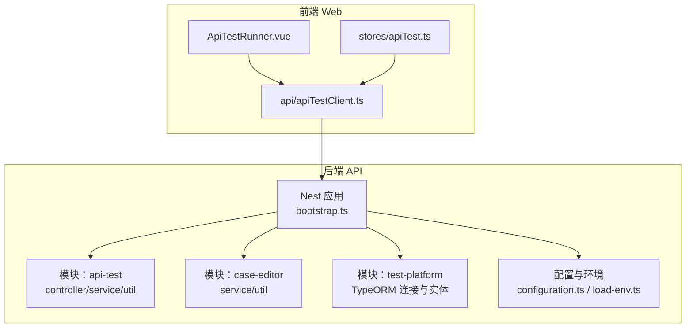
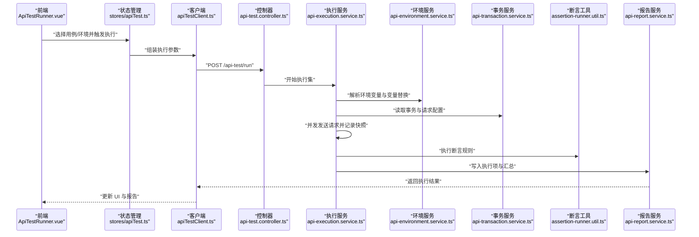
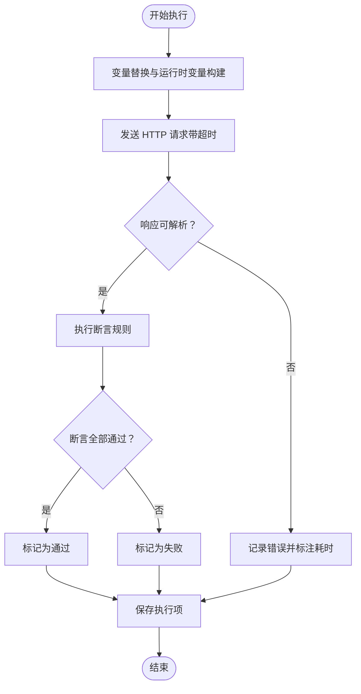
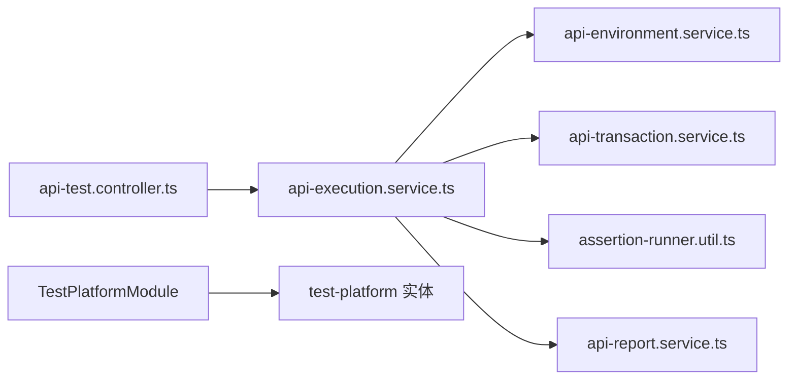

# 测试策略

<cite>
**本文引用的文件**
- [apps/api/src/modules/api-test/service/api-execution.service.ts](file://apps/api/src/modules/api-test/service/api-execution.service.ts)
- [apps/api/src/modules/api-test/service/api-case.service.ts](file://apps/api/src/modules/api-test/service/api-case.service.ts)
- [apps/api/src/modules/api-test/service/api-environment.service.ts](file://apps/api/src/modules/api-test/service/api-environment.service.ts)
- [apps/api/src/modules/api-test/service/api-execution-set.service.ts](file://apps/api/src/modules/api-test/service/api-execution-set.service.ts)
- [apps/api/src/modules/api-test/service/api-report.service.ts](file://apps/api/src/modules/api-test/service/api-report.service.ts)
- [apps/api/src/modules/api-test/service/api-transaction.service.ts](file://apps/api/src/modules/api-test/service/api-transaction.service.ts)
- [apps/api/src/modules/api-test/util/assertion-runner.util.ts](file://apps/api/src/modules/api-test/util/assertion-runner.util.ts)
- [apps/api/src/modules/api-test/util/variable-substitute.util.ts](file://apps/api/src/modules/api-test/util/variable-substitute.util.ts)
- [apps/api/src/modules/api-test/controller/api-test.controller.ts](file://apps/api/src/modules/api-test/controller/api-test.controller.ts)
- [apps/api/src/modules/case-editor/service/case-workspace.service.ts](file://apps/api/src/modules/case-editor/service/case-workspace.service.ts)
- [apps/api/src/modules/case-editor/service/case-pipeline.service.ts](file://apps/api/src/modules/case-editor/service/case-pipeline.service.ts)
- [apps/api/src/common/test-platform/index.ts](file://apps/api/src/common/test-platform/index.ts)
- [apps/api/src/common/test-platform/test-platform.constants.ts](file://apps/api/src/common/test-platform/test-platform.constants.ts)
- [apps/api/src/common/test-platform/test-platform.typeorm.config.ts](file://apps/api/src/common/test-platform/test-platform.typeorm.config.ts)
- [apps/api/src/common/test-platform/entity/test-platform-case.entity.ts](file://apps/api/src/common/test-platform/entity/test-platform-case.entity.ts)
- [apps/api/src/common/test-platform/entity/test-platform-case-step.entity.ts](file://apps/api/src/common/test-platform/entity/test-platform-case-step.entity.ts)
- [apps/api/src/common/test-platform/entity/test-platform-project.entity.ts](file://apps/api/src/common/test-platform/entity/test-platform-project.entity.ts)
- [apps/api/scripts/seed-api-test-demo.ts](file://apps/api/scripts/seed-api-test-demo.ts)
- [apps/api/scripts/seed-demo-data.ts](file://apps/api/scripts/seed-demo-data.ts)
- [apps/api/src/config/configuration.ts](file://apps/api/src/config/configuration.ts)
- [apps/api/src/config/load-env.ts](file://apps/api/src/config/load-env.ts)
- [apps/api/src/bootstrap.ts](file://apps/api/src/bootstrap.ts)
- [apps/api/package.json](file://apps/api/package.json)
- [apps/web/src/components/api-test/ApiTestRunner.vue](file://apps/web/src/components/api-test/ApiTestRunner.vue)
- [apps/web/src/stores/apiTest.ts](file://apps/web/src/stores/apiTest.ts)
- [apps/web/src/api/apiTestClient.ts](file://apps/web/src/api/apiTestClient.ts)
</cite>

## 目录
1. [引言](#引言)
2. [项目结构](#项目结构)
3. [核心组件](#核心组件)
4. [架构总览](#架构总览)
5. [详细组件分析](#详细组件分析)
6. [依赖关系分析](#依赖关系分析)
7. [性能考虑](#性能考虑)
8. [故障排查指南](#故障排查指南)
9. [结论](#结论)
10. [附录](#附录)

## 引言
本文件为 CaseForge 的测试策略与实施指南，面向后端 API 与前端 Web 应用，系统性阐述单元测试、集成测试、端到端测试的组织方式与执行策略；说明测试数据准备与管理（含种子脚本与环境隔离）、API 自动化测试流程与用例设计、覆盖率要求；并给出性能测试、压力测试与安全测试的实施方案；最后覆盖测试工具链配置、CI 中的测试执行与结果分析，以及 TDD 实践与质量保障流程。

## 项目结构
- 后端应用位于 apps/api，采用 NestJS 架构，模块化组织业务域，如 api-test、case-editor、dynamic-instruct、project-manage、struct-doc 等。
- 前端应用位于 apps/web，基于 Vue 3/Vite，通过 apiTestClient.ts 与后端交互。
- 测试相关能力集中在 api-test 模块的服务层与工具层，配合种子脚本与测试平台模块实现测试数据与执行闭环。
- 配置与环境加载位于 apps/api/src/config，支持不同环境变量与数据库连接配置。

图示来源
- [apps/api/src/bootstrap.ts](file://apps/api/src/bootstrap.ts)
- [apps/api/src/modules/api-test/controller/api-test.controller.ts](file://apps/api/src/modules/api-test/controller/api-test.controller.ts)
- [apps/api/src/modules/api-test/service/api-execution.service.ts](file://apps/api/src/modules/api-test/service/api-execution.service.ts)
- [apps/api/src/common/test-platform/index.ts](file://apps/api/src/common/test-platform/index.ts)
- [apps/api/src/config/configuration.ts](file://apps/api/src/config/configuration.ts)
- [apps/web/src/components/api-test/ApiTestRunner.vue](file://apps/web/src/components/api-test/ApiTestRunner.vue)
- [apps/web/src/stores/apiTest.ts](file://apps/web/src/stores/apiTest.ts)
- [apps/web/src/api/apiTestClient.ts](file://apps/web/src/api/apiTestClient.ts)

章节来源
- [apps/api/src/bootstrap.ts](file://apps/api/src/bootstrap.ts)
- [apps/api/src/config/configuration.ts](file://apps/api/src/config/configuration.ts)
- [apps/api/src/config/load-env.ts](file://apps/api/src/config/load-env.ts)

## 核心组件
- 接口测试执行器：负责并发调度、请求构建、断言执行与结果记录。
- 断言与变量替换：统一断言规则与变量注入，确保测试可复用与可维护。
- 测试环境与事务：管理环境变量、请求体与期望响应，支撑多场景用例。
- 测试报告：汇总执行结果、统计状态与耗时。
- 测试平台模块：独立的 TypeORM 连接与实体，用于对接外部测管平台。
- 种子脚本：快速生成演示数据与接口测试样例，便于本地调试与回归验证。

章节来源
- [apps/api/src/modules/api-test/service/api-execution.service.ts](file://apps/api/src/modules/api-test/service/api-execution.service.ts)
- [apps/api/src/modules/api-test/util/assertion-runner.util.ts](file://apps/api/src/modules/api-test/util/assertion-runner.util.ts)
- [apps/api/src/modules/api-test/util/variable-substitute.util.ts](file://apps/api/src/modules/api-test/util/variable-substitute.util.ts)
- [apps/api/src/modules/api-test/service/api-environment.service.ts](file://apps/api/src/modules/api-test/service/api-environment.service.ts)
- [apps/api/src/modules/api-test/service/api-transaction.service.ts](file://apps/api/src/modules/api-test/service/api-transaction.service.ts)
- [apps/api/src/modules/api-test/service/api-report.service.ts](file://apps/api/src/modules/api-test/service/api-report.service.ts)
- [apps/api/src/common/test-platform/index.ts](file://apps/api/src/common/test-platform/index.ts)

## 架构总览
下图展示了从前端到后端的测试执行路径，以及测试数据与报告的流转。

图示来源
- [apps/web/src/components/api-test/ApiTestRunner.vue](file://apps/web/src/components/api-test/ApiTestRunner.vue)
- [apps/web/src/stores/apiTest.ts](file://apps/web/src/stores/apiTest.ts)
- [apps/web/src/api/apiTestClient.ts](file://apps/web/src/api/apiTestClient.ts)
- [apps/api/src/modules/api-test/controller/api-test.controller.ts](file://apps/api/src/modules/api-test/controller/api-test.controller.ts)
- [apps/api/src/modules/api-test/service/api-execution.service.ts](file://apps/api/src/modules/api-test/service/api-execution.service.ts)
- [apps/api/src/modules/api-test/service/api-environment.service.ts](file://apps/api/src/modules/api-test/service/api-environment.service.ts)
- [apps/api/src/modules/api-test/service/api-transaction.service.ts](file://apps/api/src/modules/api-test/service/api-transaction.service.ts)
- [apps/api/src/modules/api-test/util/assertion-runner.util.ts](file://apps/api/src/modules/api-test/util/assertion-runner.util.ts)
- [apps/api/src/modules/api-test/service/api-report.service.ts](file://apps/api/src/modules/api-test/service/api-report.service.ts)

## 详细组件分析

### 接口测试执行服务（ApiExecutionService）
- 职责：并发调度测试用例、构造请求、执行断言、记录执行项与汇总报告。
- 关键特性：
  - 并发度控制：默认并发与最大并发限制，避免资源争用。
  - 请求超时：统一 30 秒超时，防止阻塞。
  - 断言执行：基于期望值与响应体进行断言，产出通过/失败/错误状态。
  - 变量替换：支持复杂嵌套结构的变量注入，提升用例复用性。
- 错误处理：网络异常、JSON 解析失败等场景均归类为“错误”状态并记录耗时。

图示来源
- [apps/api/src/modules/api-test/service/api-execution.service.ts](file://apps/api/src/modules/api-test/service/api-execution.service.ts)
- [apps/api/src/modules/api-test/util/variable-substitute.util.ts](file://apps/api/src/modules/api-test/util/variable-substitute.util.ts)
- [apps/api/src/modules/api-test/util/assertion-runner.util.ts](file://apps/api/src/modules/api-test/util/assertion-runner.util.ts)

章节来源
- [apps/api/src/modules/api-test/service/api-execution.service.ts](file://apps/api/src/modules/api-test/service/api-execution.service.ts)

### 断言与变量替换工具
- 断言工具：集中定义断言规则（状态码、响应体、耗时等），统一返回断言结果，便于扩展与维护。
- 变量替换工具：支持深拷贝与递归替换，确保复杂对象与数组的变量注入准确无误。

章节来源
- [apps/api/src/modules/api-test/util/assertion-runner.util.ts](file://apps/api/src/modules/api-test/util/assertion-runner.util.ts)
- [apps/api/src/modules/api-test/util/variable-substitute.util.ts](file://apps/api/src/modules/api-test/util/variable-substitute.util.ts)

### 测试环境与事务服务
- 环境服务：管理测试环境变量、作用域与替换上下文，确保用例在不同环境下的可移植性。
- 事务服务：封装单个请求的配置（方法、URL、头、体等），并与断言工具协同工作。

章节来源
- [apps/api/src/modules/api-test/service/api-environment.service.ts](file://apps/api/src/modules/api-test/service/api-environment.service.ts)
- [apps/api/src/modules/api-test/service/api-transaction.service.ts](file://apps/api/src/modules/api-test/service/api-transaction.service.ts)

### 报告与执行集服务
- 执行集服务：编排多个用例的执行顺序与并发策略，协调执行服务与报告服务。
- 报告服务：汇总执行项、统计状态分布、输出执行摘要，供前端展示与导出。

章节来源
- [apps/api/src/modules/api-test/service/api-execution-set.service.ts](file://apps/api/src/modules/api-test/service/api-execution-set.service.ts)
- [apps/api/src/modules/api-test/service/api-report.service.ts](file://apps/api/src/modules/api-test/service/api-report.service.ts)

### 测试平台模块（TestPlatformModule）
- 独立的 TypeORM 连接与实体，用于对接外部测管平台，隔离测试数据与执行环境。
- 通过常量与配置工厂分离连接名与配置，便于在不同环境中切换。

章节来源
- [apps/api/src/common/test-platform/index.ts](file://apps/api/src/common/test-platform/index.ts)
- [apps/api/src/common/test-platform/test-platform.constants.ts](file://apps/api/src/common/test-platform/test-platform.constants.ts)
- [apps/api/src/common/test-platform/test-platform.typeorm.config.ts](file://apps/api/src/common/test-platform/test-platform.typeorm.config.ts)
- [apps/api/src/common/test-platform/entity/test-platform-case.entity.ts](file://apps/api/src/common/test-platform/entity/test-platform-case.entity.ts)
- [apps/api/src/common/test-platform/entity/test-platform-case-step.entity.ts](file://apps/api/src/common/test-platform/entity/test-platform-case-step.entity.ts)
- [apps/api/src/common/test-platform/entity/test-platform-project.entity.ts](file://apps/api/src/common/test-platform/entity/test-platform-project.entity.ts)

### 种子数据脚本
- 演示数据脚本：一键生成演示项目、场景、测试要点与案例运行，便于前端调试与回归验证。
- 接口测试演示脚本：生成演示项目、端点与用例，并输出默认环境与执行 ID，指导前端定位。

章节来源
- [apps/api/scripts/seed-demo-data.ts](file://apps/api/scripts/seed-demo-data.ts)
- [apps/api/scripts/seed-api-test-demo.ts](file://apps/api/scripts/seed-api-test-demo.ts)

### 前端测试执行与状态管理
- ApiTestRunner.vue：前端测试执行入口，负责选择用例与环境、触发执行并展示结果。
- stores/apiTest.ts：集中管理测试状态、选中用例、环境选项与执行进度。
- apiTestClient.ts：封装与后端的通信，统一请求格式与错误处理。

章节来源
- [apps/web/src/components/api-test/ApiTestRunner.vue](file://apps/web/src/components/api-test/ApiTestRunner.vue)
- [apps/web/src/stores/apiTest.ts](file://apps/web/src/stores/apiTest.ts)
- [apps/web/src/api/apiTestClient.ts](file://apps/web/src/api/apiTestClient.ts)

## 依赖关系分析
- 组件耦合：
  - 控制器仅作为入口，实际逻辑由服务层承担，保持高内聚低耦合。
  - 执行服务依赖环境与事务服务，断言工具独立于执行流程，便于扩展。
- 外部依赖：
  - TypeORM 连接（主库与测试平台库）需在不同环境隔离配置。
  - 前端通过 apiTestClient.ts 与后端交互，需关注跨域与鉴权策略。

图示来源
- [apps/api/src/modules/api-test/controller/api-test.controller.ts](file://apps/api/src/modules/api-test/controller/api-test.controller.ts)
- [apps/api/src/modules/api-test/service/api-execution.service.ts](file://apps/api/src/modules/api-test/service/api-execution.service.ts)
- [apps/api/src/modules/api-test/service/api-environment.service.ts](file://apps/api/src/modules/api-test/service/api-environment.service.ts)
- [apps/api/src/modules/api-test/service/api-transaction.service.ts](file://apps/api/src/modules/api-test/service/api-transaction.service.ts)
- [apps/api/src/modules/api-test/util/assertion-runner.util.ts](file://apps/api/src/modules/api-test/util/assertion-runner.util.ts)
- [apps/api/src/modules/api-test/service/api-report.service.ts](file://apps/api/src/modules/api-test/service/api-report.service.ts)
- [apps/api/src/common/test-platform/index.ts](file://apps/api/src/common/test-platform/index.ts)

## 性能考虑
- 并发控制：执行服务内置默认并发与最大并发限制，建议在 CI 中根据资源调整并发度以平衡吞吐与稳定性。
- 超时设置：统一 30 秒超时，避免长尾请求拖慢整体执行；可根据接口特性在环境配置中微调。
- 断言成本：断言规则应尽量轻量，避免在断言阶段引入额外 IO 或复杂计算。
- 数据准备：优先使用种子脚本生成最小化测试集，减少冷启动时间与初始化成本。
- 前端渲染：大结果集分页展示，避免一次性渲染过多节点导致 UI 卡顿。

## 故障排查指南
- 执行失败定位：
  - 查看执行项状态与断言详情，确认期望值与响应体差异。
  - 检查变量替换是否正确，尤其是嵌套对象与数组。
- 环境问题：
  - 确认环境变量是否生效，必要时在环境服务中打印上下文进行验证。
- 并发与超时：
  - 若出现超时或资源争用，降低并发度或增加超时阈值。
- 报告缺失：
  - 检查报告服务是否正常写入，确认数据库连接与权限。
- 前端执行异常：
  - 使用 apiTestClient.ts 的错误处理逻辑，结合浏览器开发者工具查看网络与状态码。

章节来源
- [apps/api/src/modules/api-test/service/api-execution.service.ts](file://apps/api/src/modules/api-test/service/api-execution.service.ts)
- [apps/api/src/modules/api-test/util/assertion-runner.util.ts](file://apps/api/src/modules/api-test/util/assertion-runner.util.ts)
- [apps/web/src/api/apiTestClient.ts](file://apps/web/src/api/apiTestClient.ts)

## 结论
本测试策略围绕“可执行、可复用、可观测”的原则，通过服务层解耦、工具层抽象与种子脚本支撑，形成从单元到端到端的完整测试闭环。建议在 CI 中引入覆盖率门槛、性能基线与安全扫描，持续优化测试效率与质量。

## 附录

### 测试组织与执行策略
- 单元测试：
  - 针对服务层与工具层函数进行隔离测试，重点覆盖断言规则与变量替换。
  - 使用内存数据库或 Mock 依赖，确保测试可重复。
- 集成测试：
  - 覆盖控制器到服务层的端到端路径，结合种子脚本准备最小化数据集。
  - 关注并发与超时行为，验证执行服务的稳定性。
- 端到端测试：
  - 前端通过 ApiTestRunner.vue 触发执行，后端返回报告，验证 UI 与后端协作。
  - 建议在 CI 中固定并发度与超时，避免环境抖动影响结果。

### 测试数据准备与管理
- 种子脚本：
  - 使用演示脚本快速生成项目、场景、测试要点与用例，便于本地调试。
  - 在 CI 中使用相同脚本生成受控测试集，确保一致性。
- 环境隔离：
  - 主库与测试平台库分离，通过配置文件与环境变量区分。
  - 不同分支或 PR 使用独立数据库实例，避免数据污染。

章节来源
- [apps/api/scripts/seed-demo-data.ts](file://apps/api/scripts/seed-demo-data.ts)
- [apps/api/scripts/seed-api-test-demo.ts](file://apps/api/scripts/seed-api-test-demo.ts)
- [apps/api/src/common/test-platform/test-platform.typeorm.config.ts](file://apps/api/src/common/test-platform/test-platform.typeorm.config.ts)
- [apps/api/src/config/configuration.ts](file://apps/api/src/config/configuration.ts)

### API 测试自动化流程与覆盖率
- 自动化流程：
  - 前端选择用例与环境，后端执行服务并发调度，断言工具统一评估，报告服务汇总输出。
- 用例设计：
  - 覆盖正向、反向与边界条件；利用变量替换提升复用率。
- 覆盖率要求：
  - 建议语句覆盖率不低于 80%，分支覆盖率不低于 70%，关键路径必须覆盖。

章节来源
- [apps/api/src/modules/api-test/service/api-execution.service.ts](file://apps/api/src/modules/api-test/service/api-execution.service.ts)
- [apps/api/src/modules/api-test/util/assertion-runner.util.ts](file://apps/api/src/modules/api-test/util/assertion-runner.util.ts)
- [apps/web/src/components/api-test/ApiTestRunner.vue](file://apps/web/src/components/api-test/ApiTestRunner.vue)

### 性能测试、压力测试与安全测试
- 性能测试：
  - 基准测试：固定用例集与并发度，记录平均耗时与 P95/P99。
  - 渐进式并发：逐步提升并发度，观察吞吐与错误率拐点。
- 压力测试：
  - 持续高负载运行数小时，监控 CPU、内存、数据库连接池与执行队列。
- 安全测试：
  - 输入验证：对控制器参数与事务体进行恶意输入测试。
  - 权限控制：模拟越权访问，验证审计与鉴权中间件。

### 测试工具链与 CI 集成
- 工具链建议：
  - 测试框架：Jest（后端）+ Vitest（前端）。
  - 覆盖率：Istanbul/NYC（后端）+ c8（后端）+ V8（前端）。
  - 静态分析：ESLint + TypeScript 编译检查。
- CI 执行：
  - 分阶段流水线：安装依赖 → 类型检查 → 单元测试（带覆盖率） → 集成测试 → 端到端测试 → 安全扫描 → 报告发布。
  - 结果分析：覆盖率阈值失败即阻断，性能基线偏离发出告警。

### 测试驱动开发（TDD）与质量保证
- TDD 实践：
  - 先编写失败用例，再实现最小功能，最后重构与完善断言。
  - 小步提交，频繁合并，保持测试通过与覆盖率稳定。
- 质量门禁：
  - 代码审查强制包含测试用例；新增断言需有对应场景覆盖。
  - 每次变更至少补充 1~2 个相关用例，确保回归安全。