# 数据流设计

<cite>
**本文引用的文件**
- [apps/api/src/bootstrap.ts](file://apps/api/src/bootstrap.ts)
- [apps/api/src/app.module.ts](file://apps/api/src/app.module.ts)
- [apps/api/src/common/audit/request-context.ts](file://apps/api/src/common/audit/request-context.ts)
- [apps/api/src/common/audit/user-context.middleware.ts](file://apps/api/src/common/audit/user-context.middleware.ts)
- [apps/api/src/modules/api-test/controller/api-test.controller.ts](file://apps/api/src/modules/api-test/controller/api-test.controller.ts)
- [apps/api/src/modules/api-test/service/api-case.service.ts](file://apps/api/src/modules/api-test/service/api-case.service.ts)
- [apps/api/src/modules/api-test/service/api-transaction.service.ts](file://apps/api/src/modules/api-test/service/api-transaction.service.ts)
- [apps/api/src/modules/case-editor/controller/case-editor.controller.ts](file://apps/api/src/modules/case-editor/controller/case-editor.controller.ts)
- [apps/api/src/modules/case-editor/service/case-editor.service.ts](file://apps/api/src/modules/case-editor/service/case-editor.service.ts)
- [apps/api/src/modules/project-manage/controller/project-manage.controller.ts](file://apps/api/src/modules/project-manage/controller/project-manage.controller.ts)
- [apps/api/src/modules/project-manage/service/project-manage.service.ts](file://apps/api/src/modules/project-manage/service/project-manage.service.ts)
- [apps/api/src/modules/struct-doc/controller/struct-doc.controller.ts](file://apps/api/src/modules/struct-doc/controller/struct-doc.controller.ts)
- [apps/api/src/modules/struct-doc/service/struct-doc.service.ts](file://apps/api/src/modules/struct-doc/service/struct-doc.service.ts)
- [apps/api/src/common/minio/service/minio.service.ts](file://apps/api/src/common/minio/service/minio.service.ts)
- [apps/api/src/common/typeorm/typeorm.config.ts](file://apps/api/src/common/typeorm/typeorm.config.ts)
- [apps/api/src/common/typeorm/schema-patch.service.ts](file://apps/api/src/common/typeorm/schema-patch.service.ts)
- [apps/api/src/common/http/public-response.util.ts](file://apps/api/src/common/http/public-response.util.ts)
- [apps/web/src/main.ts](file://apps/web/src/main.ts)
- [apps/web/src/api/client.ts](file://apps/web/src/api/client.ts)
- [apps/web/src/api/apiTestClient.ts](file://apps/web/src/api/apiTestClient.ts)
- [apps/web/src/utils/userContext.ts](file://apps/web/src/utils/userContext.ts)
- [apps/web/src/stores/caseForge.ts](file://apps/web/src/stores/caseForge.ts)
- [apps/web/src/stores/apiTest.ts](file://apps/web/src/stores/apiTest.ts)
</cite>

## 目录
1. [引言](#引言)
2. [项目结构](#项目结构)
3. [核心组件](#核心组件)
4. [架构总览](#架构总览)
5. [详细组件分析](#详细组件分析)
6. [依赖关系分析](#依赖关系分析)
7. [性能考量](#性能考量)
8. [故障排查指南](#故障排查指南)
9. [结论](#结论)
10. [附录](#附录)

## 引言
本文件面向 CaseForge 系统，聚焦“数据流设计”。目标是系统化描述从用户请求进入系统到响应返回的完整生命周期，涵盖数据在各层之间的传递方式、状态管理机制、请求上下文与身份验证流程、前后端交互模式（REST 与 WebSocket）、缓存策略、数据一致性与事务处理、以及数据验证与错误处理。

## 项目结构
CaseForge 采用前后端分离架构：
- 后端：NestJS 应用，模块化组织业务域（如 API 测试、用例编辑、项目管理、结构化文档等），通过控制器暴露 REST 接口，服务层实现业务逻辑，TypeORM 进行持久化，MinIO 提供对象存储能力。
- 前端：Vue3 + Vite 应用，通过自定义客户端封装 HTTP 请求，使用 Pinia 状态管理，路由驱动页面切换，组件负责视图与交互。

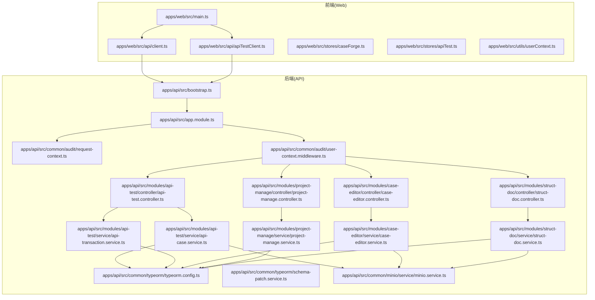

图表来源
- [apps/web/src/main.ts:1-50](file://apps/web/src/main.ts#L1-L50)
- [apps/web/src/api/client.ts:1-100](file://apps/web/src/api/client.ts#L1-L100)
- [apps/web/src/api/apiTestClient.ts:1-100](file://apps/web/src/api/apiTestClient.ts#L1-L100)
- [apps/api/src/bootstrap.ts:1-50](file://apps/api/src/bootstrap.ts#L1-L50)
- [apps/api/src/app.module.ts:1-100](file://apps/api/src/app.module.ts#L1-L100)
- [apps/api/src/common/audit/request-context.ts:1-100](file://apps/api/src/common/audit/request-context.ts#L1-L100)
- [apps/api/src/common/audit/user-context.middleware.ts:1-100](file://apps/api/src/common/audit/user-context.middleware.ts#L1-L100)
- [apps/api/src/modules/api-test/controller/api-test.controller.ts:1-100](file://apps/api/src/modules/api-test/controller/api-test.controller.ts#L1-L100)
- [apps/api/src/modules/api-test/service/api-case.service.ts:1-100](file://apps/api/src/modules/api-test/service/api-case.service.ts#L1-L100)
- [apps/api/src/modules/api-test/service/api-transaction.service.ts:1-100](file://apps/api/src/modules/api-test/service/api-transaction.service.ts#L1-L100)
- [apps/api/src/modules/case-editor/controller/case-editor.controller.ts:1-100](file://apps/api/src/modules/case-editor/controller/case-editor.controller.ts#L1-L100)
- [apps/api/src/modules/case-editor/service/case-editor.service.ts:1-100](file://apps/api/src/modules/case-editor/service/case-editor.service.ts#L1-L100)
- [apps/api/src/modules/project-manage/controller/project-manage.controller.ts:1-100](file://apps/api/src/modules/project-manage/controller/project-manage.controller.ts#L1-L100)
- [apps/api/src/modules/project-manage/service/project-manage.service.ts:1-100](file://apps/api/src/modules/project-manage/service/project-manage.service.ts#L1-L100)
- [apps/api/src/modules/struct-doc/controller/struct-doc.controller.ts:1-100](file://apps/api/src/modules/struct-doc/controller/struct-doc.controller.ts#L1-L100)
- [apps/api/src/modules/struct-doc/service/struct-doc.service.ts:1-100](file://apps/api/src/modules/struct-doc/service/struct-doc.service.ts#L1-L100)
- [apps/api/src/common/typeorm/typeorm.config.ts:1-100](file://apps/api/src/common/typeorm/typeorm.config.ts#L1-L100)
- [apps/api/src/common/typeorm/schema-patch.service.ts:1-100](file://apps/api/src/common/typeorm/schema-patch.service.ts#L1-L100)
- [apps/api/src/common/minio/service/minio.service.ts:1-100](file://apps/api/src/common/minio/service/minio.service.ts#L1-L100)

章节来源
- [apps/web/src/main.ts:1-50](file://apps/web/src/main.ts#L1-L50)
- [apps/api/src/bootstrap.ts:1-50](file://apps/api/src/bootstrap.ts#L1-L50)
- [apps/api/src/app.module.ts:1-100](file://apps/api/src/app.module.ts#L1-L100)

## 核心组件
- 请求上下文与审计中间件：通过请求上下文与用户上下文中间件，确保每个请求携带用户身份信息，并贯穿后续服务层调用链。
- 控制器层：按业务域划分控制器，统一暴露 REST 接口；控制器仅做参数解析与结果包装，不直接访问数据库。
- 服务层：实现具体业务逻辑，协调实体、仓储与外部服务（如 MinIO）。
- 持久化层：基于 TypeORM 的配置与迁移补丁服务，保障数据库结构一致性与演进。
- 对象存储：MinIO 服务提供文件上传、下载与元数据管理。
- 前端客户端：封装通用 HTTP 客户端与 API 测试专用客户端，集中处理鉴权头、重试与错误提示。
- 状态管理：Pinia Store 负责前端局部状态与跨组件共享状态。

章节来源
- [apps/api/src/common/audit/request-context.ts:1-100](file://apps/api/src/common/audit/request-context.ts#L1-L100)
- [apps/api/src/common/audit/user-context.middleware.ts:1-100](file://apps/api/src/common/audit/user-context.middleware.ts#L1-L100)
- [apps/api/src/common/typeorm/typeorm.config.ts:1-100](file://apps/api/src/common/typeorm/typeorm.config.ts#L1-L100)
- [apps/api/src/common/typeorm/schema-patch.service.ts:1-100](file://apps/api/src/common/typeorm/schema-patch.service.ts#L1-L100)
- [apps/api/src/common/minio/service/minio.service.ts:1-100](file://apps/api/src/common/minio/service/minio.service.ts#L1-L100)
- [apps/web/src/api/client.ts:1-100](file://apps/web/src/api/client.ts#L1-L100)
- [apps/web/src/api/apiTestClient.ts:1-100](file://apps/web/src/api/apiTestClient.ts#L1-L100)
- [apps/web/src/stores/caseForge.ts:1-100](file://apps/web/src/stores/caseForge.ts#L1-L100)
- [apps/web/src/stores/apiTest.ts:1-100](file://apps/web/src/stores/apiTest.ts#L1-L100)

## 架构总览
下图展示一次典型 API 测试相关请求的端到端数据流：从前端发起请求，经由中间件注入用户上下文，到控制器解析参数，再到服务层执行业务逻辑，最后持久化或调用外部存储。

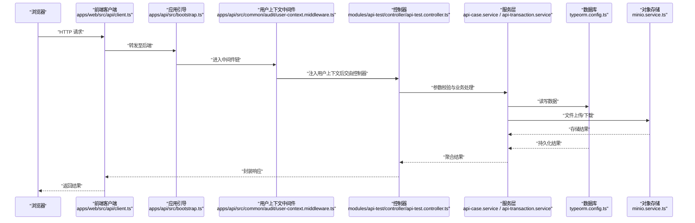

图表来源
- [apps/web/src/api/client.ts:1-100](file://apps/web/src/api/client.ts#L1-L100)
- [apps/api/src/bootstrap.ts:1-50](file://apps/api/src/bootstrap.ts#L1-L50)
- [apps/api/src/common/audit/user-context.middleware.ts:1-100](file://apps/api/src/common/audit/user-context.middleware.ts#L1-L100)
- [apps/api/src/modules/api-test/controller/api-test.controller.ts:1-100](file://apps/api/src/modules/api-test/controller/api-test.controller.ts#L1-L100)
- [apps/api/src/modules/api-test/service/api-case.service.ts:1-100](file://apps/api/src/modules/api-test/service/api-case.service.ts#L1-L100)
- [apps/api/src/common/typeorm/typeorm.config.ts:1-100](file://apps/api/src/common/typeorm/typeorm.config.ts#L1-L100)
- [apps/api/src/common/minio/service/minio.service.ts:1-100](file://apps/api/src/common/minio/service/minio.service.ts#L1-L100)

## 详细组件分析

### 请求上下文与身份验证流程
- 请求上下文：通过请求上下文工具在内存中保存当前请求的上下文信息，便于日志审计与追踪。
- 用户上下文中间件：在请求进入控制器之前，从认证凭据中解析用户身份，注入到请求上下文中，确保后续服务层可读取当前用户。
- 响应封装：公共响应工具对控制器输出进行统一格式化，隐藏内部错误细节，向客户端暴露安全、一致的响应结构。

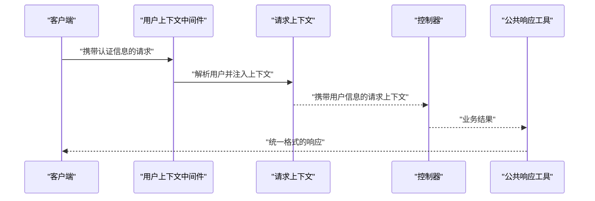

图表来源
- [apps/api/src/common/audit/request-context.ts:1-100](file://apps/api/src/common/audit/request-context.ts#L1-L100)
- [apps/api/src/common/audit/user-context.middleware.ts:1-100](file://apps/api/src/common/audit/user-context.middleware.ts#L1-L100)
- [apps/api/src/common/http/public-response.util.ts:1-100](file://apps/api/src/common/http/public-response.util.ts#L1-L100)

章节来源
- [apps/api/src/common/audit/request-context.ts:1-100](file://apps/api/src/common/audit/request-context.ts#L1-L100)
- [apps/api/src/common/audit/user-context.middleware.ts:1-100](file://apps/api/src/common/audit/user-context.middleware.ts#L1-L100)
- [apps/api/src/common/http/public-response.util.ts:1-100](file://apps/api/src/common/http/public-response.util.ts#L1-L100)

### 前后端数据交互模式
- RESTful API：前端通过通用客户端与测试专用客户端发起请求，控制器接收 DTO 参数，服务层执行业务规则，最终以统一响应格式返回。
- WebSocket 实时同步：仓库未发现 WebSocket 相关实现代码，因此本节不涉及具体代码映射。

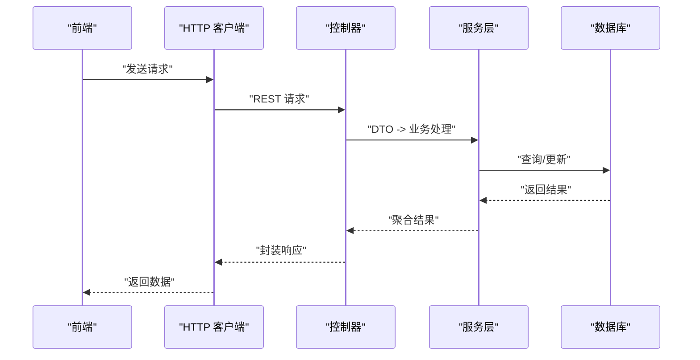

图表来源
- [apps/web/src/api/client.ts:1-100](file://apps/web/src/api/client.ts#L1-L100)
- [apps/web/src/api/apiTestClient.ts:1-100](file://apps/web/src/api/apiTestClient.ts#L1-L100)
- [apps/api/src/modules/api-test/controller/api-test.controller.ts:1-100](file://apps/api/src/modules/api-test/controller/api-test.controller.ts#L1-L100)
- [apps/api/src/modules/api-test/service/api-case.service.ts:1-100](file://apps/api/src/modules/api-test/service/api-case.service.ts#L1-L100)

章节来源
- [apps/web/src/api/client.ts:1-100](file://apps/web/src/api/client.ts#L1-L100)
- [apps/web/src/api/apiTestClient.ts:1-100](file://apps/web/src/api/apiTestClient.ts#L1-L100)
- [apps/api/src/modules/api-test/controller/api-test.controller.ts:1-100](file://apps/api/src/modules/api-test/controller/api-test.controller.ts#L1-L100)

### 缓存策略、数据一致性与事务处理
- 缓存策略：仓库未发现显式的缓存实现（如 Redis）。若需引入缓存，建议在服务层对热点查询结果进行缓存，并配合失效策略与双写一致性。
- 数据一致性：通过 TypeORM 配置与迁移补丁服务，确保数据库结构演进的一致性；在关键业务场景中，优先使用数据库事务保证原子性。
- 事务处理：服务层在需要强一致性的操作中开启事务，失败时回滚，成功时提交；对外部存储（如 MinIO）与数据库的多阶段操作，需设计补偿机制或幂等控制。

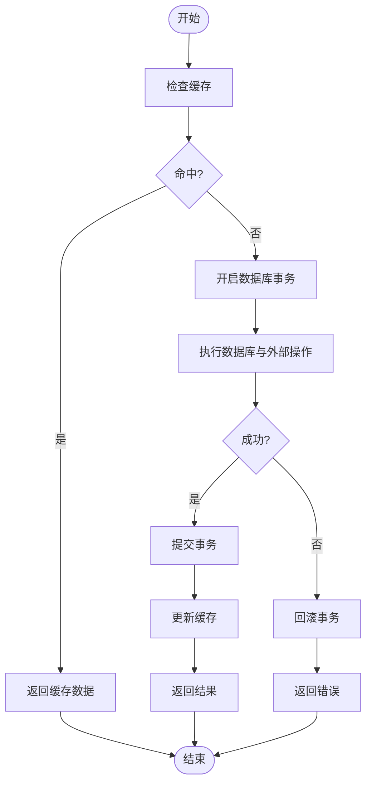

图表来源
- [apps/api/src/common/typeorm/typeorm.config.ts:1-100](file://apps/api/src/common/typeorm/typeorm.config.ts#L1-L100)
- [apps/api/src/common/typeorm/schema-patch.service.ts:1-100](file://apps/api/src/common/typeorm/schema-patch.service.ts#L1-L100)
- [apps/api/src/common/minio/service/minio.service.ts:1-100](file://apps/api/src/common/minio/service/minio.service.ts#L1-L100)

章节来源
- [apps/api/src/common/typeorm/typeorm.config.ts:1-100](file://apps/api/src/common/typeorm/typeorm.config.ts#L1-L100)
- [apps/api/src/common/typeorm/schema-patch.service.ts:1-100](file://apps/api/src/common/typeorm/schema-patch.service.ts#L1-L100)
- [apps/api/src/common/minio/service/minio.service.ts:1-100](file://apps/api/src/common/minio/service/minio.service.ts#L1-L100)

### 数据验证与错误处理
- 数据验证：控制器使用 DTO 对输入参数进行结构与规则校验；服务层进一步进行业务规则校验。
- 错误处理：公共响应工具统一包装错误，避免泄露内部异常细节；中间件与控制器捕获异常并转换为标准响应码与消息。
- 异常传播：异常在服务层被捕获并转换为领域错误，向上游控制器与客户端传播统一格式的错误响应。

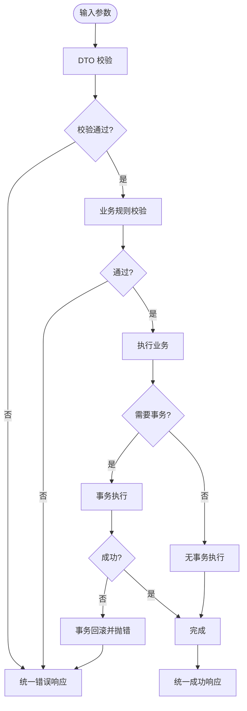

图表来源
- [apps/api/src/common/http/public-response.util.ts:1-100](file://apps/api/src/common/http/public-response.util.ts#L1-L100)
- [apps/api/src/common/typeorm/typeorm.config.ts:1-100](file://apps/api/src/common/typeorm/typeorm.config.ts#L1-L100)

章节来源
- [apps/api/src/common/http/public-response.util.ts:1-100](file://apps/api/src/common/http/public-response.util.ts#L1-L100)
- [apps/api/src/common/typeorm/typeorm.config.ts:1-100](file://apps/api/src/common/typeorm/typeorm.config.ts#L1-L100)

### 具体业务域数据流示例

#### API 测试域
- 控制器：接收用例与事务相关的请求，解析 DTO 并委派给服务层。
- 服务层：处理用例保存、事务执行、报告生成等逻辑，必要时访问数据库与 MinIO。
- 数据一致性：对用例与事务的创建/更新使用事务，确保关联数据一致。

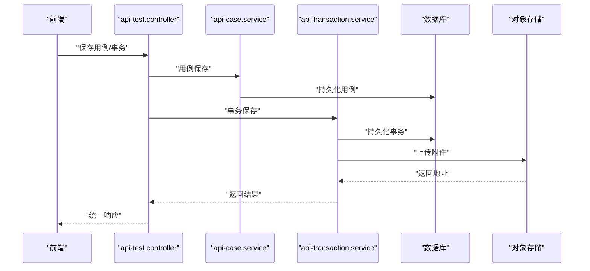

图表来源
- [apps/api/src/modules/api-test/controller/api-test.controller.ts:1-100](file://apps/api/src/modules/api-test/controller/api-test.controller.ts#L1-L100)
- [apps/api/src/modules/api-test/service/api-case.service.ts:1-100](file://apps/api/src/modules/api-test/service/api-case.service.ts#L1-L100)
- [apps/api/src/modules/api-test/service/api-transaction.service.ts:1-100](file://apps/api/src/modules/api-test/service/api-transaction.service.ts#L1-L100)
- [apps/api/src/common/minio/service/minio.service.ts:1-100](file://apps/api/src/common/minio/service/minio.service.ts#L1-L100)

章节来源
- [apps/api/src/modules/api-test/controller/api-test.controller.ts:1-100](file://apps/api/src/modules/api-test/controller/api-test.controller.ts#L1-L100)
- [apps/api/src/modules/api-test/service/api-case.service.ts:1-100](file://apps/api/src/modules/api-test/service/api-case.service.ts#L1-L100)
- [apps/api/src/modules/api-test/service/api-transaction.service.ts:1-100](file://apps/api/src/modules/api-test/service/api-transaction.service.ts#L1-L100)

#### 用例编辑域
- 控制器：处理用例树、节点元数据、生成任务等请求。
- 服务层：维护用例工作区、生成队列与流水线，协调与测试平台的同步。
- 数据一致性：用例树合并与并发生成需考虑锁与冲突解决。

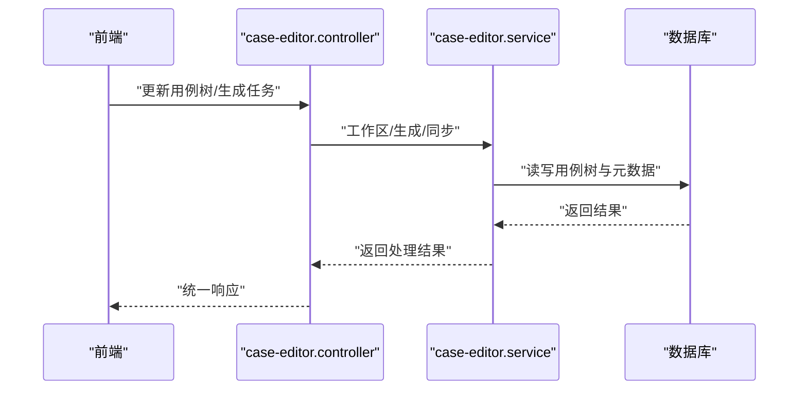

图表来源
- [apps/api/src/modules/case-editor/controller/case-editor.controller.ts:1-100](file://apps/api/src/modules/case-editor/controller/case-editor.controller.ts#L1-L100)
- [apps/api/src/modules/case-editor/service/case-editor.service.ts:1-100](file://apps/api/src/modules/case-editor/service/case-editor.service.ts#L1-L100)

章节来源
- [apps/api/src/modules/case-editor/controller/case-editor.controller.ts:1-100](file://apps/api/src/modules/case-editor/controller/case-editor.controller.ts#L1-L100)
- [apps/api/src/modules/case-editor/service/case-editor.service.ts:1-100](file://apps/api/src/modules/case-editor/service/case-editor.service.ts#L1-L100)

#### 项目管理域
- 控制器：处理项目 CRUD 与批量删除等请求。
- 服务层：执行项目级业务逻辑，可能涉及关联实体清理与资源回收。

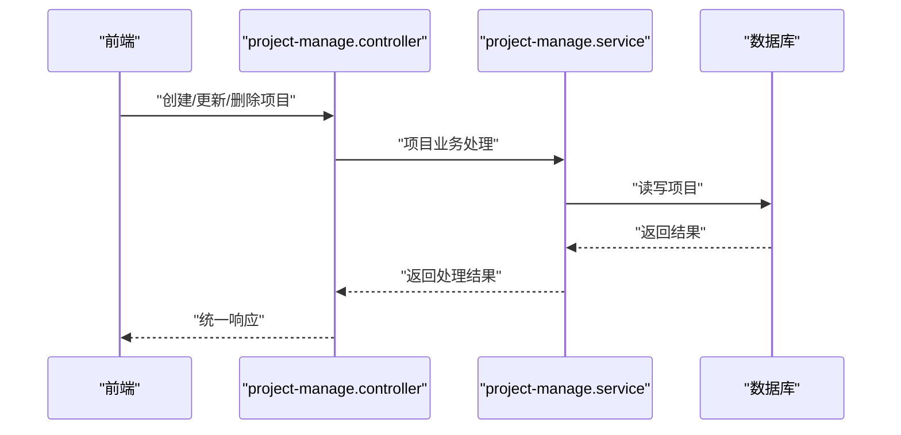

图表来源
- [apps/api/src/modules/project-manage/controller/project-manage.controller.ts:1-100](file://apps/api/src/modules/project-manage/controller/project-manage.controller.ts#L1-L100)
- [apps/api/src/modules/project-manage/service/project-manage.service.ts:1-100](file://apps/api/src/modules/project-manage/service/project-manage.service.ts#L1-L100)

章节来源
- [apps/api/src/modules/project-manage/controller/project-manage.controller.ts:1-100](file://apps/api/src/modules/project-manage/controller/project-manage.controller.ts#L1-L100)
- [apps/api/src/modules/project-manage/service/project-manage.service.ts:1-100](file://apps/api/src/modules/project-manage/service/project-manage.service.ts#L1-L100)

#### 结构化文档域
- 控制器：处理结构化文档与需求任务的请求。
- 服务层：分块处理与队列调度，支持中断与超时控制。

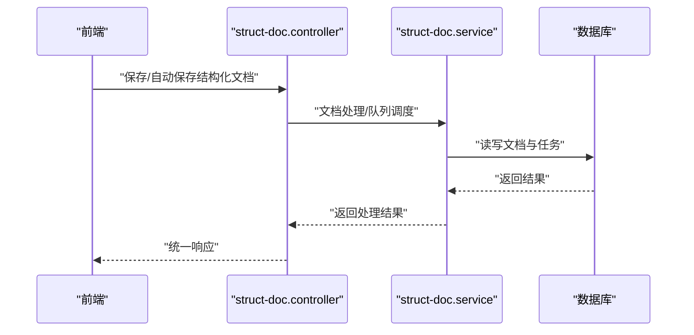

图表来源
- [apps/api/src/modules/struct-doc/controller/struct-doc.controller.ts:1-100](file://apps/api/src/modules/struct-doc/controller/struct-doc.controller.ts#L1-L100)
- [apps/api/src/modules/struct-doc/service/struct-doc.service.ts:1-100](file://apps/api/src/modules/struct-doc/service/struct-doc.service.ts#L1-L100)

章节来源
- [apps/api/src/modules/struct-doc/controller/struct-doc.controller.ts:1-100](file://apps/api/src/modules/struct-doc/controller/struct-doc.controller.ts#L1-L100)
- [apps/api/src/modules/struct-doc/service/struct-doc.service.ts:1-100](file://apps/api/src/modules/struct-doc/service/struct-doc.service.ts#L1-L100)

## 依赖关系分析
- 组件耦合：控制器仅依赖服务接口，降低耦合；服务层依赖 TypeORM 与 MinIO 服务，保持业务与基础设施解耦。
- 外部依赖：前端通过客户端库与后端通信；后端通过 TypeORM 与数据库交互，通过 MinIO 与对象存储交互。
- 可能的循环依赖：控制器与服务层之间为单向依赖，未见循环依赖迹象。

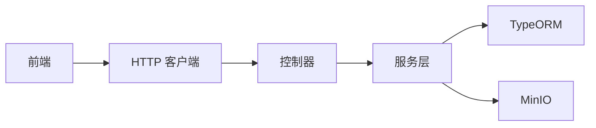

图表来源
- [apps/web/src/api/client.ts:1-100](file://apps/web/src/api/client.ts#L1-L100)
- [apps/api/src/modules/api-test/controller/api-test.controller.ts:1-100](file://apps/api/src/modules/api-test/controller/api-test.controller.ts#L1-L100)
- [apps/api/src/modules/api-test/service/api-case.service.ts:1-100](file://apps/api/src/modules/api-test/service/api-case.service.ts#L1-L100)
- [apps/api/src/common/typeorm/typeorm.config.ts:1-100](file://apps/api/src/common/typeorm/typeorm.config.ts#L1-L100)
- [apps/api/src/common/minio/service/minio.service.ts:1-100](file://apps/api/src/common/minio/service/minio.service.ts#L1-L100)

章节来源
- [apps/web/src/api/client.ts:1-100](file://apps/web/src/api/client.ts#L1-L100)
- [apps/api/src/common/typeorm/typeorm.config.ts:1-100](file://apps/api/src/common/typeorm/typeorm.config.ts#L1-L100)
- [apps/api/src/common/minio/service/minio.service.ts:1-100](file://apps/api/src/common/minio/service/minio.service.ts#L1-L100)

## 性能考量
- I/O 密集优化：API 测试与结构化文档处理存在大量 I/O（数据库与 MinIO），建议在服务层引入连接池与并发限制，避免阻塞。
- 缓存与索引：对高频查询建立合适索引，结合缓存减少重复计算与数据库压力。
- 事务边界：合理划分事务范围，避免长事务占用资源；对批量操作采用分页与异步化。
- 前端渲染：利用 Pinia 精细化状态管理，避免不必要的重渲染；对大列表采用虚拟滚动与懒加载。

## 故障排查指南
- 请求无用户上下文：检查用户上下文中间件是否正确注入；确认认证头是否随请求传递。
- 统一错误响应缺失：核对公共响应工具是否被控制器调用；检查异常是否被中间件捕获。
- 数据库迁移问题：确认迁移补丁服务已执行；检查数据库连接配置与权限。
- 对象存储异常：检查 MinIO 服务连通性与桶权限；确认上传/下载路径与签名有效性。
- 前端状态不同步：检查 Pinia Store 的变更与订阅；确认路由守卫与鉴权拦截逻辑。

章节来源
- [apps/api/src/common/audit/user-context.middleware.ts:1-100](file://apps/api/src/common/audit/user-context.middleware.ts#L1-L100)
- [apps/api/src/common/http/public-response.util.ts:1-100](file://apps/api/src/common/http/public-response.util.ts#L1-L100)
- [apps/api/src/common/typeorm/schema-patch.service.ts:1-100](file://apps/api/src/common/typeorm/schema-patch.service.ts#L1-L100)
- [apps/api/src/common/minio/service/minio.service.ts:1-100](file://apps/api/src/common/minio/service/minio.service.ts#L1-L100)
- [apps/web/src/stores/caseForge.ts:1-100](file://apps/web/src/stores/caseForge.ts#L1-L100)
- [apps/web/src/stores/apiTest.ts:1-100](file://apps/web/src/stores/apiTest.ts#L1-L100)

## 结论
本设计文档梳理了 CaseForge 的数据流全貌：从前端请求到后端控制器、服务层与持久化层的完整路径，明确了请求上下文与身份验证机制、RESTful 交互模式、以及潜在的缓存、一致性与事务策略。对于 WebSocket 实时同步，当前仓库未提供实现，可在后续扩展中纳入统一的事件/消息通道设计。建议在现有基础上逐步引入缓存与更细粒度的事务边界控制，持续提升系统性能与稳定性。

## 附录
- 关键入口与模块
  - 应用引导与模块装配：[apps/api/src/bootstrap.ts](file://apps/api/src/bootstrap.ts)，[apps/api/src/app.module.ts](file://apps/api/src/app.module.ts)
  - 审计与上下文：[apps/api/src/common/audit/request-context.ts](file://apps/api/src/common/audit/request-context.ts)，[apps/api/src/common/audit/user-context.middleware.ts](file://apps/api/src/common/audit/user-context.middleware.ts)
  - 类型与持久化：[apps/api/src/common/typeorm/typeorm.config.ts](file://apps/api/src/common/typeorm/typeorm.config.ts)，[apps/api/src/common/typeorm/schema-patch.service.ts](file://apps/api/src/common/typeorm/schema-patch.service.ts)
  - 对象存储：[apps/api/src/common/minio/service/minio.service.ts](file://apps/api/src/common/minio/service/minio.service.ts)
  - 前端入口与客户端：[apps/web/src/main.ts](file://apps/web/src/main.ts)，[apps/web/src/api/client.ts](file://apps/web/src/api/client.ts)，[apps/web/src/api/apiTestClient.ts](file://apps/web/src/api/apiTestClient.ts)
  - 状态管理：[apps/web/src/stores/caseForge.ts](file://apps/web/src/stores/caseForge.ts)，[apps/web/src/stores/apiTest.ts](file://apps/web/src/stores/apiTest.ts)