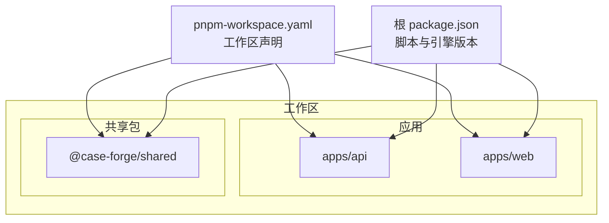
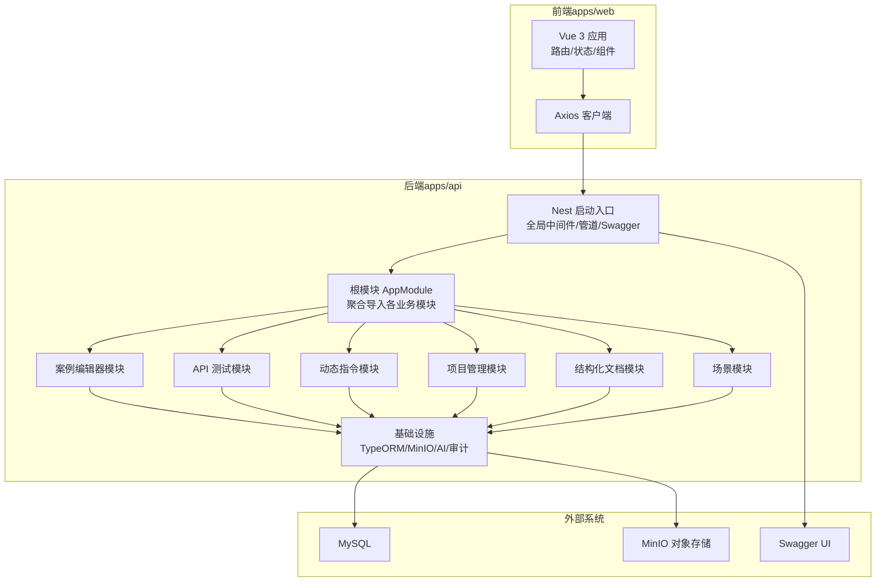
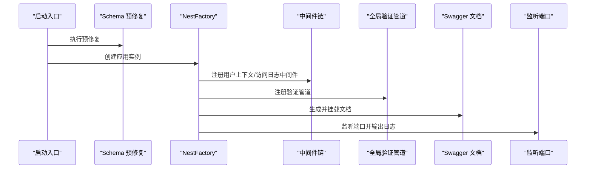
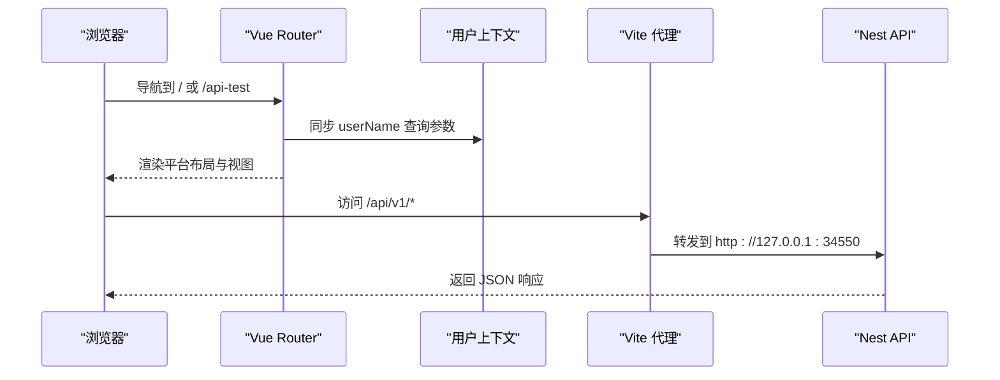
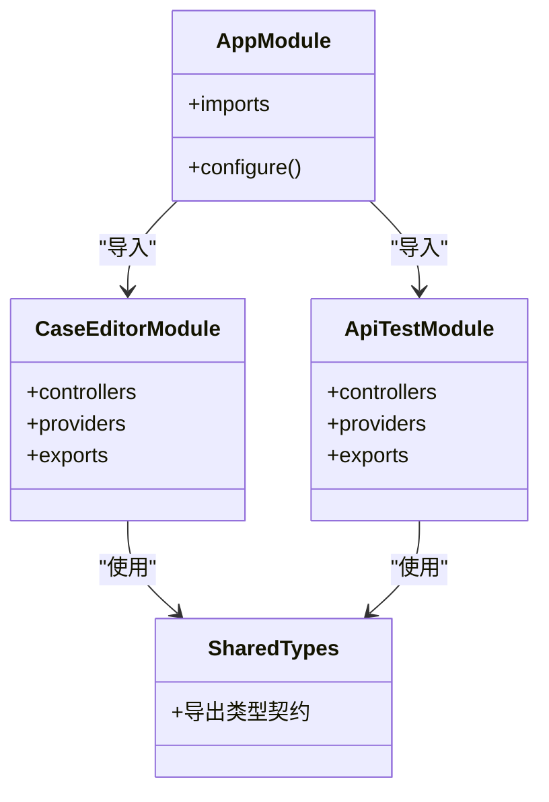
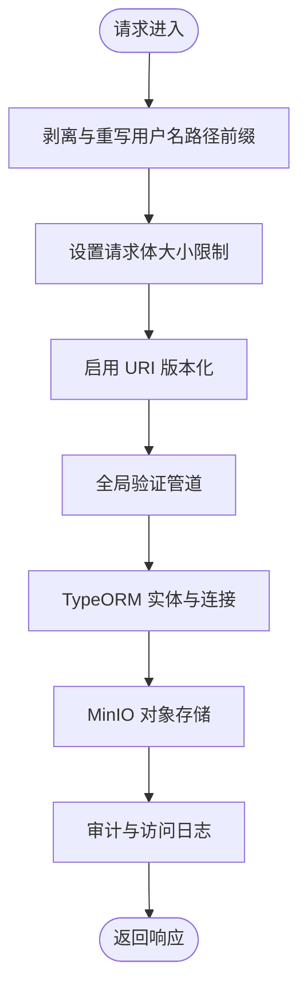
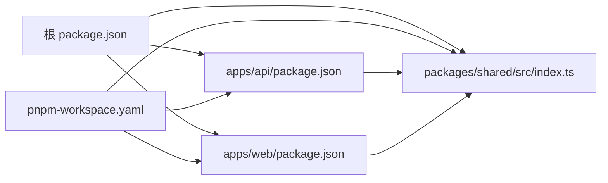

# 整体架构设计

<cite>
**本文引用的文件**
- [apps/api/src/app.module.ts](file://apps/api/src/app.module.ts)
- [apps/api/src/bootstrap.ts](file://apps/api/src/bootstrap.ts)
- [apps/api/nest-cli.json](file://apps/api/nest-cli.json)
- [apps/api/package.json](file://apps/api/package.json)
- [apps/web/vite.config.ts](file://apps/web/vite.config.ts)
- [apps/web/src/main.ts](file://apps/web/src/main.ts)
- [apps/web/src/router/index.ts](file://apps/web/src/router/index.ts)
- [apps/web/package.json](file://apps/web/package.json)
- [packages/shared/src/index.ts](file://packages/shared/src/index.ts)
- [package.json](file://package.json)
- [pnpm-workspace.yaml](file://pnpm-workspace.yaml)
- [apps/api/src/modules/case-editor/index.ts](file://apps/api/src/modules/case-editor/index.ts)
- [apps/api/src/modules/api-test/index.ts](file://apps/api/src/modules/api-test/index.ts)
</cite>

## 目录
1. [引言](#引言)
2. [项目结构](#项目结构)
3. [核心组件](#核心组件)
4. [架构总览](#架构总览)
5. [详细组件分析](#详细组件分析)
6. [依赖关系分析](#依赖关系分析)
7. [性能考虑](#性能考虑)
8. [故障排查指南](#故障排查指南)
9. [结论](#结论)
10. [附录](#附录)

## 引言
本文件面向 CaseForge 的整体架构设计，系统性阐述其分层架构（表现层、业务层、数据访问层、基础设施层）、Monorepo 组织方式（apps/ 与 packages/）、前后端分离与 RESTful API 设计、模块化实现（NestJS 模块系统与 Vue 组件架构）、系统边界与外部依赖、以及关键架构决策的技术考量与权衡。

## 项目结构
CaseForge 采用 Monorepo 管理，根目录通过工作区定义聚合多个子包与应用。核心目录与职责如下：
- apps/api：基于 NestJS 的后端 API 应用，提供 REST 接口、中间件、模块化业务域与基础设施集成。
- apps/web：基于 Vue 3 的前端 SPA 应用，负责用户界面、状态管理与路由。
- packages/shared：共享类型与工具，被前后端共同使用，确保契约一致性。
- 根 package.json 与 pnpm-workspace.yaml：统一脚本与工作区声明，便于开发与构建编排。

图表来源
- [pnpm-workspace.yaml:1-4](file://pnpm-workspace.yaml#L1-L4)
- [package.json:1-22](file://package.json#L1-L22)
- [apps/api/package.json:1-62](file://apps/api/package.json#L1-L62)
- [apps/web/package.json:1-36](file://apps/web/package.json#L1-L36)

章节来源
- [pnpm-workspace.yaml:1-4](file://pnpm-workspace.yaml#L1-L4)
- [package.json:1-22](file://package.json#L1-L22)

## 核心组件
- 根应用模块（NestJS）：集中导入配置、中间件、TypeORM、MinIO、AI 工作流、测试平台模块与各业务模块，统一装配应用。
- 应用启动入口：加载环境、执行 Schema 预修复、创建 Nest 应用、设置 CORS、全局前缀、版本化、全局验证管道、Swagger 文档与监听端口。
- 前端入口与路由：初始化 Pinia、Ant Design Vue、国际化、用户上下文与全局反馈；定义平台路由与前置校验。
- 共享包：统一导出案例树、分页、API 测试、平台与结构化文档等类型与契约。

章节来源
- [apps/api/src/app.module.ts:1-48](file://apps/api/src/app.module.ts#L1-L48)
- [apps/api/src/bootstrap.ts:1-64](file://apps/api/src/bootstrap.ts#L1-L64)
- [apps/web/src/main.ts:1-20](file://apps/web/src/main.ts#L1-L20)
- [apps/web/src/router/index.ts:1-65](file://apps/web/src/router/index.ts#L1-L65)
- [packages/shared/src/index.ts:1-156](file://packages/shared/src/index.ts#L1-L156)

## 架构总览
CaseForge 采用典型的前后端分离架构：
- 表现层：Vue 3 前端应用，通过 Axios 访问后端 REST API，并在开发时经 Vite 代理转发至 Nest 后端。
- 业务层：NestJS 模块化业务域（如案例编辑器、API 测试、动态指令、项目管理、结构化文档、场景等），每个模块封装实体、DTO、Service、Controller 与工具。
- 数据访问层：TypeORM 集成 MySQL，支持 Schema 预修复与索引策略；MinIO 提供对象存储能力。
- 基础设施层：日志中间件、审计订阅、用户上下文中间件、Swagger 文档、版本化路由、全局验证管道。

图表来源
- [apps/api/src/bootstrap.ts:1-64](file://apps/api/src/bootstrap.ts#L1-L64)
- [apps/api/src/app.module.ts:1-48](file://apps/api/src/app.module.ts#L1-L48)
- [apps/api/src/modules/case-editor/index.ts:1-60](file://apps/api/src/modules/case-editor/index.ts#L1-L60)
- [apps/api/src/modules/api-test/index.ts:1-64](file://apps/api/src/modules/api-test/index.ts#L1-L64)

## 详细组件分析

### 后端启动与全局配置
- 环境加载与 Schema 预修复：启动前执行数据库 Schema 预修复，保证迁移一致性。
- 中间件链路：用户上下文中间件与访问日志中间件在所有路由前生效。
- 全局前缀与版本化：统一前缀“/api”，URI 版本化默认 v1。
- 全局验证管道：开启转换与白名单校验，减少脏数据进入业务层。
- Swagger 文档：自动生成 API 文档并通过“/docs”暴露。
- 端口与主机：监听 0.0.0.0，便于容器与网络访问。

图表来源
- [apps/api/src/bootstrap.ts:18-61](file://apps/api/src/bootstrap.ts#L18-L61)

章节来源
- [apps/api/src/bootstrap.ts:1-64](file://apps/api/src/bootstrap.ts#L1-L64)

### 前端路由与开发代理
- 路由策略：基于 Vue Router 的 History 模式，平台路由包含“/case-forge”与“/api-test”，均通过统一布局渲染。
- 用户名同步：前置守卫从查询参数同步 userName 到全局上下文，确保 API 请求路径前缀一致性。
- 开发代理：Vite 将“/api/v1”与“/docs”代理到后端，避免前端路由冲突与跨域问题。

图表来源
- [apps/web/src/router/index.ts:44-57](file://apps/web/src/router/index.ts#L44-L57)
- [apps/web/vite.config.ts:54-69](file://apps/web/vite.config.ts#L54-L69)

章节来源
- [apps/web/src/router/index.ts:1-65](file://apps/web/src/router/index.ts#L1-L65)
- [apps/web/vite.config.ts:1-71](file://apps/web/vite.config.ts#L1-L71)

### 模块化设计（NestJS 与 Vue）
- NestJS 模块：每个业务域（案例编辑器、API 测试、动态指令、项目管理、结构化文档、场景）以独立模块封装，内部通过 TypeORM 注册实体、注入服务、导出可复用服务，降低耦合、提升内聚。
- Vue 组件与状态：组件按功能拆分（如 API 测试工作台、案例树工作台、沉浸式舞台球等），状态通过 Pinia Store 管理，路由与布局解耦。

图表来源
- [apps/api/src/app.module.ts:21-39](file://apps/api/src/app.module.ts#L21-L39)
- [apps/api/src/modules/case-editor/index.ts:29-58](file://apps/api/src/modules/case-editor/index.ts#L29-L58)
- [apps/api/src/modules/api-test/index.ts:25-62](file://apps/api/src/modules/api-test/index.ts#L25-L62)
- [packages/shared/src/index.ts:1-156](file://packages/shared/src/index.ts#L1-L156)

章节来源
- [apps/api/src/modules/case-editor/index.ts:1-60](file://apps/api/src/modules/case-editor/index.ts#L1-L60)
- [apps/api/src/modules/api-test/index.ts:1-64](file://apps/api/src/modules/api-test/index.ts#L1-L64)
- [packages/shared/src/index.ts:1-156](file://packages/shared/src/index.ts#L1-L156)

### 数据访问与基础设施
- TypeORM 配置：通过模块导入实体，结合预修复与 UTF-8 扩展配置，保障 Schema 一致性与字符集兼容。
- MinIO 存储：对象存储用于文档附件与报告导出等大文件场景。
- 审计与日志：用户上下文中间件与访问日志中间件贯穿请求生命周期，便于追踪与合规。

图表来源
- [apps/api/src/bootstrap.ts:24-48](file://apps/api/src/bootstrap.ts#L24-L48)
- [apps/api/src/app.module.ts:42-46](file://apps/api/src/app.module.ts#L42-L46)

章节来源
- [apps/api/src/bootstrap.ts:1-64](file://apps/api/src/bootstrap.ts#L1-L64)
- [apps/api/src/app.module.ts:1-48](file://apps/api/src/app.module.ts#L1-L48)

## 依赖关系分析
- 工作区聚合：pnpm-workspace.yaml 明确 apps/* 与 packages/* 为工作区成员，根 package.json 提供统一脚本与 Node 版本约束。
- 应用依赖：apps/api 与 apps/web 均依赖 @case-forge/shared，确保类型与契约一致；API 应用依赖 Nest 生态、TypeORM、MinIO、Swagger 等；Web 应用依赖 Vue 3、Pinia、Ant Design Vue、Axios 等。
- 构建与运行：API 使用 Nest CLI 与 tsconfig-paths，Web 使用 Vite 与 Vue 插件；开发脚本通过根脚本统一调度。

图表来源
- [package.json:7-14](file://package.json#L7-L14)
- [pnpm-workspace.yaml:1-4](file://pnpm-workspace.yaml#L1-L4)
- [apps/api/package.json:20-47](file://apps/api/package.json#L20-L47)
- [apps/web/package.json:15-27](file://apps/web/package.json#L15-L27)
- [packages/shared/src/index.ts:1-156](file://packages/shared/src/index.ts#L1-L156)

章节来源
- [package.json:1-22](file://package.json#L1-L22)
- [pnpm-workspace.yaml:1-4](file://pnpm-workspace.yaml#L1-L4)
- [apps/api/package.json:1-62](file://apps/api/package.json#L1-L62)
- [apps/web/package.json:1-36](file://apps/web/package.json#L1-L36)

## 性能考虑
- 请求体大小限制：后端对 JSON/URL 编码体设置较大上限，满足大文档与复杂案例数据传输需求。
- 代理与热更新：前端 Vite 代理仅转发真实 API，避免前端路由干扰；optimizeDeps.exclude 排除共享包，防止预构建缓存导致白屏。
- 资源与渲染：Vue 组件采用 ResizeObserver 等机制优化思维导图与工作区渲染性能，减少不必要重绘。

章节来源
- [apps/api/src/bootstrap.ts:33-35](file://apps/api/src/bootstrap.ts#L33-L35)
- [apps/web/vite.config.ts:48-53](file://apps/web/vite.config.ts#L48-L53)
- [apps/web/src/views/ApiTestDashboardView.vue:78-100](file://apps/web/src/views/ApiTestDashboardView.vue#L78-L100)

## 故障排查指南
- 启动失败或端口占用：检查后端监听端口与主机绑定，确认 0.0.0.0 与防火墙放通。
- 跨域与代理：确认 Vite 代理规则仅转发“/api/v1”与“/docs”，避免前端路由被错误转发。
- Schema 不一致：执行启动前的 Schema 预修复流程，确保数据库结构与实体一致。
- 类型不匹配：核对 @case-forge/shared 的导出契约，前后端保持一致版本。

章节来源
- [apps/api/src/bootstrap.ts:58-61](file://apps/api/src/bootstrap.ts#L58-L61)
- [apps/web/vite.config.ts:59-68](file://apps/web/vite.config.ts#L59-L68)
- [apps/api/src/bootstrap.ts:19-19](file://apps/api/src/bootstrap.ts#L19-L19)
- [packages/shared/src/index.ts:1-156](file://packages/shared/src/index.ts#L1-L156)

## 结论
CaseForge 通过 Monorepo 组织与前后端分离架构，实现了清晰的职责划分与高效的协作模式。NestJS 模块化与 Vue 组件化进一步提升了可维护性与可扩展性。配合 TypeORM、MinIO、Swagger 与全局中间件/管道，系统在数据一致性、可观察性与开发体验方面达到良好平衡。建议持续完善第三方集成（如 AI 工作流）与监控告警体系，以支撑更大规模的案例生成与测试场景。

## 附录
- 关键文件与职责速览
  - apps/api/src/app.module.ts：根模块聚合与中间件装配
  - apps/api/src/bootstrap.ts：启动入口与全局配置
  - apps/web/vite.config.ts：开发代理与别名配置
  - apps/web/src/router/index.ts：路由与前置守卫
  - packages/shared/src/index.ts：共享类型与契约
  - pnpm-workspace.yaml：工作区成员声明
  - apps/api/nest-cli.json：Nest 编译与资源配置

章节来源
- [apps/api/src/app.module.ts:1-48](file://apps/api/src/app.module.ts#L1-L48)
- [apps/api/src/bootstrap.ts:1-64](file://apps/api/src/bootstrap.ts#L1-L64)
- [apps/web/vite.config.ts:1-71](file://apps/web/vite.config.ts#L1-L71)
- [apps/web/src/router/index.ts:1-65](file://apps/web/src/router/index.ts#L1-L65)
- [packages/shared/src/index.ts:1-156](file://packages/shared/src/index.ts#L1-L156)
- [pnpm-workspace.yaml:1-4](file://pnpm-workspace.yaml#L1-L4)
- [apps/api/nest-cli.json:1-16](file://apps/api/nest-cli.json#L1-L16)