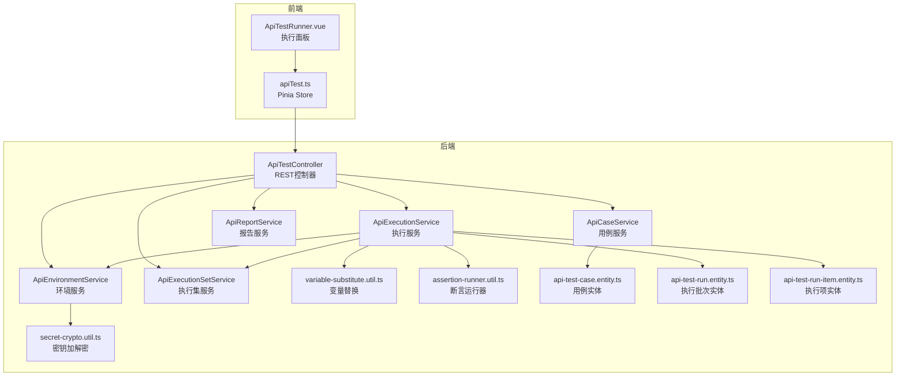
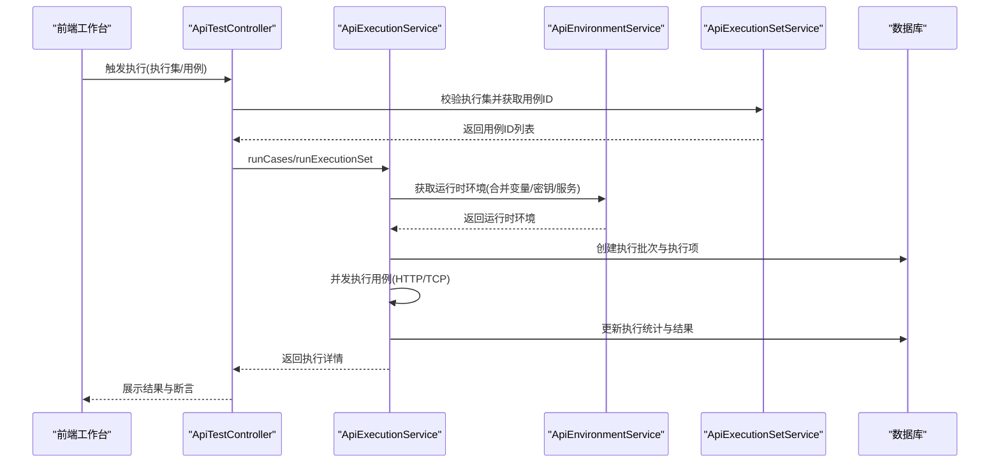
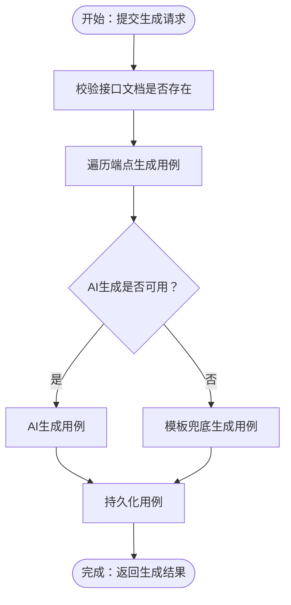
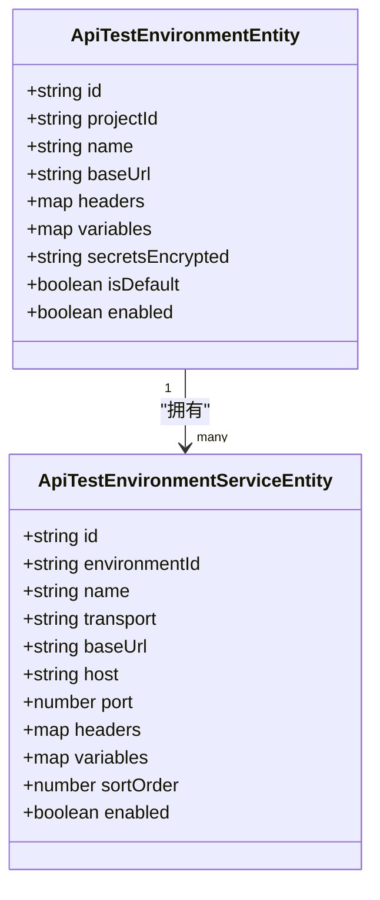
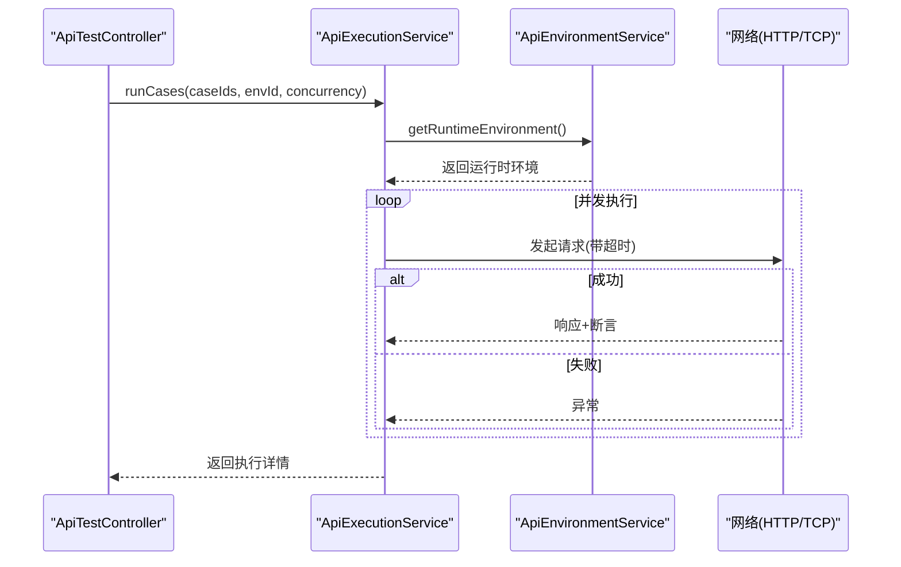
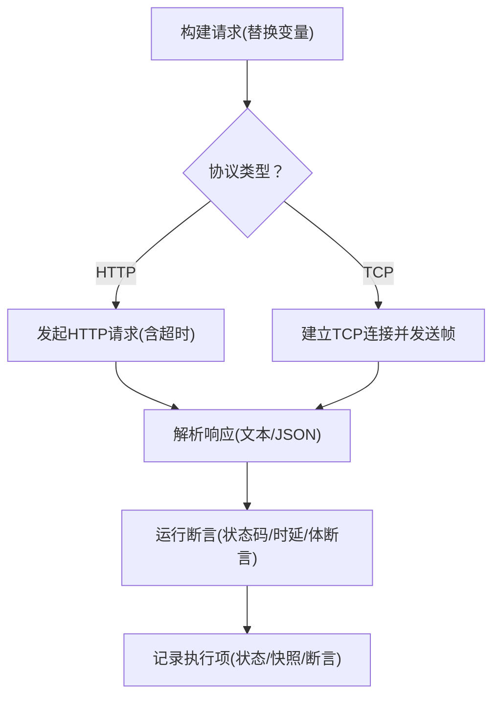
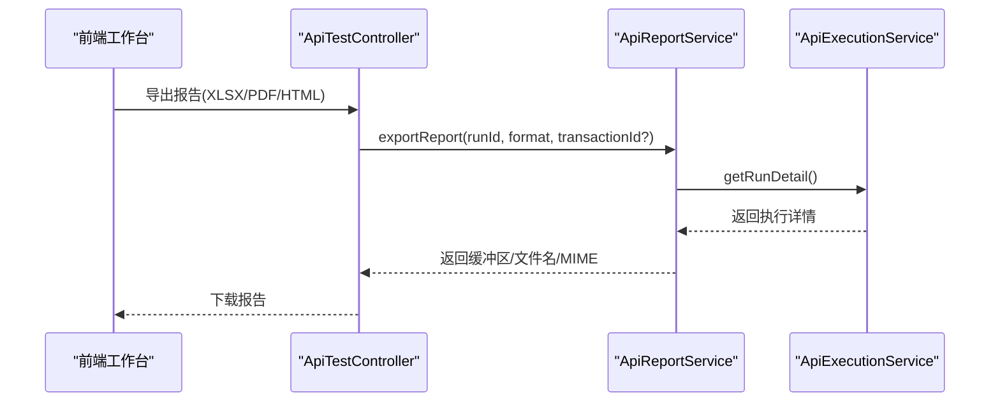
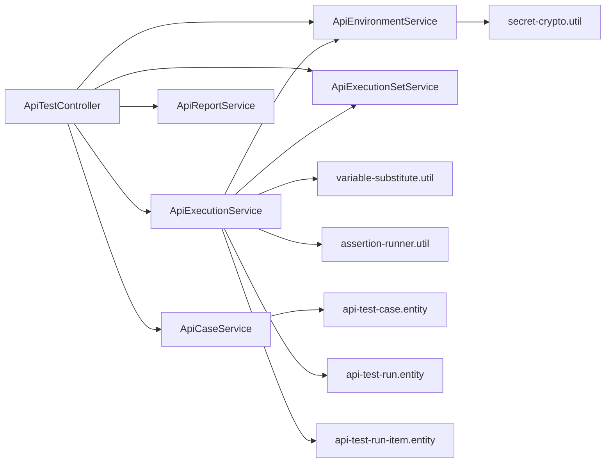

# API测试模块

<cite>
**本文档引用的文件**
- [apps/api/src/modules/api-test/controller/api-test.controller.ts](file://apps/api/src/modules/api-test/controller/api-test.controller.ts)
- [apps/api/src/modules/api-test/service/api-case.service.ts](file://apps/api/src/modules/api-test/service/api-case.service.ts)
- [apps/api/src/modules/api-test/service/api-environment.service.ts](file://apps/api/src/modules/api-test/service/api-environment.service.ts)
- [apps/api/src/modules/api-test/service/api-execution.service.ts](file://apps/api/src/modules/api-test/service/api-execution.service.ts)
- [apps/api/src/modules/api-test/service/api-execution-set.service.ts](file://apps/api/src/modules/api-test/service/api-execution-set.service.ts)
- [apps/api/src/modules/api-test/service/api-report.service.ts](file://apps/api/src/modules/api-test/service/api-report.service.ts)
- [apps/api/src/modules/api-test/util/variable-substitute.util.ts](file://apps/api/src/modules/api-test/util/variable-substitute.util.ts)
- [apps/api/src/modules/api-test/util/assertion-runner.util.ts](file://apps/api/src/modules/api-test/util/assertion-runner.util.ts)
- [apps/api/src/modules/api-test/util/secret-crypto.util.ts](file://apps/api/src/modules/api-test/util/secret-crypto.util.ts)
- [apps/api/src/modules/api-test/entity/api-test-case.entity.ts](file://apps/api/src/modules/api-test/entity/api-test-case.entity.ts)
- [apps/api/src/modules/api-test/entity/api-test-run.entity.ts](file://apps/api/src/modules/api-test/entity/api-test-run.entity.ts)
- [apps/api/src/modules/api-test/entity/api-test-run-item.entity.ts](file://apps/api/src/modules/api-test/entity/api-test-run-item.entity.ts)
- [apps/api/src/modules/api-test/dto/save-api-case.dto.ts](file://apps/api/src/modules/api-test/dto/save-api-case.dto.ts)
- [apps/api/src/modules/api-test/dto/execution-platform.dto.ts](file://apps/api/src/modules/api-test/dto/execution-platform.dto.ts)
- [apps/web/src/components/api-test/ApiTestRunner.vue](file://apps/web/src/components/api-test/ApiTestRunner.vue)
- [apps/web/src/stores/apiTest.ts](file://apps/web/src/stores/apiTest.ts)
</cite>

## 目录
1. [简介](#简介)
2. [项目结构](#项目结构)
3. [核心组件](#核心组件)
4. [架构总览](#架构总览)
5. [详细组件分析](#详细组件分析)
6. [依赖关系分析](#依赖关系分析)
7. [性能考虑](#性能考虑)
8. [故障排查指南](#故障排查指南)
9. [结论](#结论)
10. [附录](#附录)

## 简介
本文件为API测试模块的全面技术文档，覆盖以下主题：
- API测试用例设计与实现：HTTP/TCP请求构建、断言机制与执行流程
- 测试环境管理系统：环境变量配置、动态替换与安全加密
- API执行集概念与实现：并发执行、超时控制与结果聚合
- 测试报告生成：HTML/PDF/XLSX模板、统计分析与历史对比
- 完整API端点参考：用例管理、环境配置、执行控制与报告查询
- 实际使用示例：创建测试用例、配置执行环境、分析测试结果
- 与MinIO存储的集成：测试数据与附件管理

## 项目结构
API测试模块位于后端NestJS应用的api子项目中，采用按功能域划分的目录结构，核心由控制器、服务层、实体与工具函数组成，并配套Web前端工作台。

图表来源
- [apps/api/src/modules/api-test/controller/api-test.controller.ts:58-564](file://apps/api/src/modules/api-test/controller/api-test.controller.ts#L58-L564)
- [apps/api/src/modules/api-test/service/api-case.service.ts:38-444](file://apps/api/src/modules/api-test/service/api-case.service.ts#L38-L444)
- [apps/api/src/modules/api-test/service/api-environment.service.ts:24-409](file://apps/api/src/modules/api-test/service/api-environment.service.ts#L24-L409)
- [apps/api/src/modules/api-test/service/api-execution.service.ts:53-611](file://apps/api/src/modules/api-test/service/api-execution.service.ts#L53-L611)
- [apps/api/src/modules/api-test/service/api-execution-set.service.ts:28-258](file://apps/api/src/modules/api-test/service/api-execution-set.service.ts#L28-L258)
- [apps/api/src/modules/api-test/service/api-report.service.ts:17-321](file://apps/api/src/modules/api-test/service/api-report.service.ts#L17-L321)
- [apps/api/src/modules/api-test/util/variable-substitute.util.ts:1-43](file://apps/api/src/modules/api-test/util/variable-substitute.util.ts#L1-L43)
- [apps/api/src/modules/api-test/util/assertion-runner.util.ts:1-107](file://apps/api/src/modules/api-test/util/assertion-runner.util.ts#L1-L107)
- [apps/api/src/modules/api-test/util/secret-crypto.util.ts:1-48](file://apps/api/src/modules/api-test/util/secret-crypto.util.ts#L1-L48)
- [apps/api/src/modules/api-test/entity/api-test-case.entity.ts:21-99](file://apps/api/src/modules/api-test/entity/api-test-case.entity.ts#L21-L99)
- [apps/api/src/modules/api-test/entity/api-test-run.entity.ts:11-62](file://apps/api/src/modules/api-test/entity/api-test-run.entity.ts#L11-L62)
- [apps/api/src/modules/api-test/entity/api-test-run-item.entity.ts:13-59](file://apps/api/src/modules/api-test/entity/api-test-run-item.entity.ts#L13-L59)
- [apps/web/src/components/api-test/ApiTestRunner.vue:1-800](file://apps/web/src/components/api-test/ApiTestRunner.vue#L1-L800)
- [apps/web/src/stores/apiTest.ts:146-800](file://apps/web/src/stores/apiTest.ts#L146-L800)

章节来源
- [apps/api/src/modules/api-test/controller/api-test.controller.ts:58-564](file://apps/api/src/modules/api-test/controller/api-test.controller.ts#L58-L564)
- [apps/web/src/components/api-test/ApiTestRunner.vue:1-800](file://apps/web/src/components/api-test/ApiTestRunner.vue#L1-L800)
- [apps/web/src/stores/apiTest.ts:146-800](file://apps/web/src/stores/apiTest.ts#L146-L800)

## 核心组件
- 控制器层：统一暴露REST端点，负责参数校验、鉴权与调用服务层
- 服务层：封装业务逻辑，包括用例管理、环境管理、执行调度、报告生成
- 实体层：持久化用例、执行批次与执行项等数据模型
- 工具层：变量替换、断言运行、密钥加解密等通用能力
- 前端工作台：可视化用例、环境、执行集与报告的管理与查看

章节来源
- [apps/api/src/modules/api-test/service/api-case.service.ts:38-444](file://apps/api/src/modules/api-test/service/api-case.service.ts#L38-L444)
- [apps/api/src/modules/api-test/service/api-environment.service.ts:24-409](file://apps/api/src/modules/api-test/service/api-environment.service.ts#L24-L409)
- [apps/api/src/modules/api-test/service/api-execution.service.ts:53-611](file://apps/api/src/modules/api-test/service/api-execution.service.ts#L53-L611)
- [apps/api/src/modules/api-test/service/api-execution-set.service.ts:28-258](file://apps/api/src/modules/api-test/service/api-execution-set.service.ts#L28-L258)
- [apps/api/src/modules/api-test/service/api-report.service.ts:17-321](file://apps/api/src/modules/api-test/service/api-report.service.ts#L17-L321)
- [apps/api/src/modules/api-test/entity/api-test-case.entity.ts:21-99](file://apps/api/src/modules/api-test/entity/api-test-case.entity.ts#L21-L99)
- [apps/api/src/modules/api-test/entity/api-test-run.entity.ts:11-62](file://apps/api/src/modules/api-test/entity/api-test-run.entity.ts#L11-L62)
- [apps/api/src/modules/api-test/entity/api-test-run-item.entity.ts:13-59](file://apps/api/src/modules/api-test/entity/api-test-run-item.entity.ts#L13-L59)

## 架构总览
系统采用“控制器-服务-实体-工具”的分层架构，前端通过Store与API交互，后端通过TypeORM进行数据持久化，执行阶段通过并发与超时控制保障稳定性。

图表来源
- [apps/api/src/modules/api-test/controller/api-test.controller.ts:487-524](file://apps/api/src/modules/api-test/controller/api-test.controller.ts#L487-L524)
- [apps/api/src/modules/api-test/service/api-execution.service.ts:66-182](file://apps/api/src/modules/api-test/service/api-execution.service.ts#L66-L182)
- [apps/api/src/modules/api-test/service/api-environment.service.ts:104-155](file://apps/api/src/modules/api-test/service/api-environment.service.ts#L104-L155)
- [apps/api/src/modules/api-test/service/api-execution-set.service.ts:168-192](file://apps/api/src/modules/api-test/service/api-execution-set.service.ts#L168-L192)

## 详细组件分析

### 用例管理与生成
- 用例CRUD：支持按项目与交易码维度查询、创建、更新、删除用例
- AI生成：基于接口文档与场景提示，自动生成用例并回退到模板兜底
- 参数校验：HTTP用例要求method/path与状态码，TCP用例要求请求体

图表来源
- [apps/api/src/modules/api-test/service/api-case.service.ts:196-350](file://apps/api/src/modules/api-test/service/api-case.service.ts#L196-L350)
- [apps/api/src/modules/api-test/dto/save-api-case.dto.ts:19-92](file://apps/api/src/modules/api-test/dto/save-api-case.dto.ts#L19-L92)

章节来源
- [apps/api/src/modules/api-test/service/api-case.service.ts:60-350](file://apps/api/src/modules/api-test/service/api-case.service.ts#L60-L350)
- [apps/api/src/modules/api-test/dto/save-api-case.dto.ts:19-92](file://apps/api/src/modules/api-test/dto/save-api-case.dto.ts#L19-L92)

### 环境管理系统
- 环境与服务：支持全局/项目级环境，多服务叠加（HTTP/TCP），支持排序与启用状态
- 动态替换：运行时合并环境变量、服务变量与密钥，形成最终运行时变量
- 安全加密：AES-256-GCM对称加密存储密钥，运行时解密，前端仅显示掩码

图表来源
- [apps/api/src/modules/api-test/entity/api-test-case.entity.ts:21-99](file://apps/api/src/modules/api-test/entity/api-test-case.entity.ts#L21-L99)
- [apps/api/src/modules/api-test/entity/api-test-run.entity.ts:11-62](file://apps/api/src/modules/api-test/entity/api-test-run.entity.ts#L11-L62)
- [apps/api/src/modules/api-test/entity/api-test-run-item.entity.ts:13-59](file://apps/api/src/modules/api-test/entity/api-test-run-item.entity.ts#L13-L59)

章节来源
- [apps/api/src/modules/api-test/service/api-environment.service.ts:33-155](file://apps/api/src/modules/api-test/service/api-environment.service.ts#L33-L155)
- [apps/api/src/modules/api-test/util/secret-crypto.util.ts:14-47](file://apps/api/src/modules/api-test/util/secret-crypto.util.ts#L14-L47)

### 执行集与并发执行
- 执行集：将多个用例组织为集合，支持替换用例、记录最近执行结果
- 并发执行：固定最大并发度，逐批拉取用例并行执行
- 超时控制：HTTP默认超时、TCP连接超时，异常捕获并记录
- 结果聚合：统计通过/失败/错误数量，生成执行项快照与断言结果

图表来源
- [apps/api/src/modules/api-test/controller/api-test.controller.ts:505-524](file://apps/api/src/modules/api-test/controller/api-test.controller.ts#L505-L524)
- [apps/api/src/modules/api-test/service/api-execution.service.ts:66-182](file://apps/api/src/modules/api-test/service/api-execution.service.ts#L66-L182)

章节来源
- [apps/api/src/modules/api-test/service/api-execution.service.ts:66-492](file://apps/api/src/modules/api-test/service/api-execution.service.ts#L66-L492)
- [apps/api/src/modules/api-test/service/api-execution-set.service.ts:140-192](file://apps/api/src/modules/api-test/service/api-execution-set.service.ts#L140-L192)

### 断言机制与执行流程
- 断言类型：状态码、响应时间、JSON路径断言（等于/包含/匹配）
- 执行流程：构建请求 -> 发送 -> 解析 -> 断言 -> 记录结果
- 变量替换：支持路径、头、体等多字段变量替换，避免硬编码

图表来源
- [apps/api/src/modules/api-test/service/api-execution.service.ts:210-418](file://apps/api/src/modules/api-test/service/api-execution.service.ts#L210-L418)
- [apps/api/src/modules/api-test/util/assertion-runner.util.ts:62-106](file://apps/api/src/modules/api-test/util/assertion-runner.util.ts#L62-L106)
- [apps/api/src/modules/api-test/util/variable-substitute.util.ts:13-42](file://apps/api/src/modules/api-test/util/variable-substitute.util.ts#L13-L42)

章节来源
- [apps/api/src/modules/api-test/util/assertion-runner.util.ts:1-107](file://apps/api/src/modules/api-test/util/assertion-runner.util.ts#L1-L107)
- [apps/api/src/modules/api-test/util/variable-substitute.util.ts:1-43](file://apps/api/src/modules/api-test/util/variable-substitute.util.ts#L1-L43)

### 报告生成与历史对比
- 导出格式：XLSX、PDF、HTML三类
- 统计维度：总数、通过、失败、错误、通过率、各状态分布
- 历史对比：支持按执行集或交易码筛选，支持最近批次概览

图表来源
- [apps/api/src/modules/api-test/controller/api-test.controller.ts:543-562](file://apps/api/src/modules/api-test/controller/api-test.controller.ts#L543-L562)
- [apps/api/src/modules/api-test/service/api-report.service.ts:70-146](file://apps/api/src/modules/api-test/service/api-report.service.ts#L70-L146)

章节来源
- [apps/api/src/modules/api-test/service/api-report.service.ts:27-321](file://apps/api/src/modules/api-test/service/api-report.service.ts#L27-L321)

### 前端工作台与使用示例
- 执行面板：维护环境与执行集，查看执行状态与结果，支持批量删除与管理案例
- Store：封装API调用、轮询生成状态、切换工作台阶段
- 使用示例：创建交易码 -> 上传接口文档 -> 结构化 -> 生成用例 -> 配置环境 -> 执行 -> 查看报告

章节来源
- [apps/web/src/components/api-test/ApiTestRunner.vue:1-800](file://apps/web/src/components/api-test/ApiTestRunner.vue#L1-L800)
- [apps/web/src/stores/apiTest.ts:146-800](file://apps/web/src/stores/apiTest.ts#L146-L800)

## 依赖关系分析

图表来源
- [apps/api/src/modules/api-test/controller/api-test.controller.ts:58-564](file://apps/api/src/modules/api-test/controller/api-test.controller.ts#L58-L564)
- [apps/api/src/modules/api-test/service/api-execution.service.ts:53-65](file://apps/api/src/modules/api-test/service/api-execution.service.ts#L53-L65)
- [apps/api/src/modules/api-test/util/variable-substitute.util.ts:1-43](file://apps/api/src/modules/api-test/util/variable-substitute.util.ts#L1-L43)
- [apps/api/src/modules/api-test/util/assertion-runner.util.ts:1-107](file://apps/api/src/modules/api-test/util/assertion-runner.util.ts#L1-L107)
- [apps/api/src/modules/api-test/util/secret-crypto.util.ts:1-48](file://apps/api/src/modules/api-test/util/secret-crypto.util.ts#L1-L48)
- [apps/api/src/modules/api-test/entity/api-test-case.entity.ts:21-99](file://apps/api/src/modules/api-test/entity/api-test-case.entity.ts#L21-L99)
- [apps/api/src/modules/api-test/entity/api-test-run.entity.ts:11-62](file://apps/api/src/modules/api-test/entity/api-test-run.entity.ts#L11-L62)
- [apps/api/src/modules/api-test/entity/api-test-run-item.entity.ts:13-59](file://apps/api/src/modules/api-test/entity/api-test-run-item.entity.ts#L13-L59)

章节来源
- [apps/api/src/modules/api-test/controller/api-test.controller.ts:58-564](file://apps/api/src/modules/api-test/controller/api-test.controller.ts#L58-L564)
- [apps/api/src/modules/api-test/service/api-execution.service.ts:53-65](file://apps/api/src/modules/api-test/service/api-execution.service.ts#L53-L65)

## 性能考虑
- 并发控制：默认并发5，上限10，避免对目标系统造成过大压力
- 超时策略：HTTP请求默认30秒，TCP连接默认30秒，防止长时间阻塞
- 编码处理：支持UTF-8与GBK等编码，必要时进行字符集转换
- 数据截断：响应体超过阈值进行截断，避免内存与传输开销过大
- 查询优化：分页查询、索引命中、按需加载关联数据

## 故障排查指南
- 环境配置问题
  - HTTP服务缺少Base URL或协议不正确：检查环境与服务配置
  - TCP服务缺少主机与端口：检查服务配置或自动解析
- 执行失败
  - 状态码不在预期范围：核对断言配置与接口行为
  - 响应时间超限：调整断言阈值或优化目标系统
  - 请求异常：查看执行项快照中的错误信息
- 报告导出
  - 无明细数据：确认执行批次存在且包含用例
  - 编码问题：确保导出时选择正确的编码格式

章节来源
- [apps/api/src/modules/api-test/service/api-execution.service.ts:436-475](file://apps/api/src/modules/api-test/service/api-execution.service.ts#L436-L475)
- [apps/api/src/modules/api-test/service/api-report.service.ts:70-107](file://apps/api/src/modules/api-test/service/api-report.service.ts#L70-L107)

## 结论
本模块提供了完整的API测试闭环：从用例生成、环境配置、并发执行到报告导出。通过变量替换与断言机制保证测试灵活性与准确性，借助加密与权限控制保障安全性。前端工作台进一步提升了用户体验与可运维性。

## 附录

### API端点参考

- 用例管理
  - GET/POST/PUT/DELETE /:projectId/transactions/:transactionId/cases
  - POST /:projectId/transactions/:transactionId/cases/generate
  - GET /:projectId/transactions/:transactionId/cases/generate/status
  - POST /:projectId/transactions/:transactionId/cases/generate/cancel

- 接口文档
  - POST /:projectId/transactions/:transactionId/document/upload
  - POST /:projectId/transactions/:transactionId/document/structure
  - GET /:projectId/transactions/:transactionId/document
  - PATCH /:projectId/transactions/:transactionId/document/auto-save
  - PATCH /:projectId/transactions/:transactionId/document
  - PATCH /:projectId/transactions/:transactionId/document/generation
  - GET /:projectId/transactions/:transactionId/endpoints

- 环境管理
  - GET/POST/PUT/DELETE /:projectId/environments
  - GET /:projectId/environments/:environmentId/services
  - POST/PUT/DELETE /:projectId/environments/:environmentId/services
  - PUT /:projectId/environments/:environmentId/services/:serviceId/reorder

- 执行集
  - GET/POST/PUT/DELETE /:projectId/transactions/:transactionId/execution-sets
  - PUT /:projectId/transactions/:transactionId/execution-sets/:setId/cases
  - POST /:projectId/transactions/:transactionId/execution-sets/:setId/runs

- 执行控制
  - POST /:projectId/transactions/:transactionId/runs
  - GET /:projectId/runs
  - GET /:projectId/runs/:runId

- 报告查询与导出
  - GET /:projectId/transactions/:transactionId/reports/summary
  - POST /:projectId/transactions/:transactionId/reports/export

章节来源
- [apps/api/src/modules/api-test/controller/api-test.controller.ts:74-562](file://apps/api/src/modules/api-test/controller/api-test.controller.ts#L74-L562)

### 最佳实践
- 在环境服务中配置多种协议与编码，便于跨系统测试
- 合理设置并发度与断言阈值，平衡执行效率与稳定性
- 使用执行集组织常用测试序列，便于回归与冒烟测试
- 定期清理过期执行记录，保持数据库健康