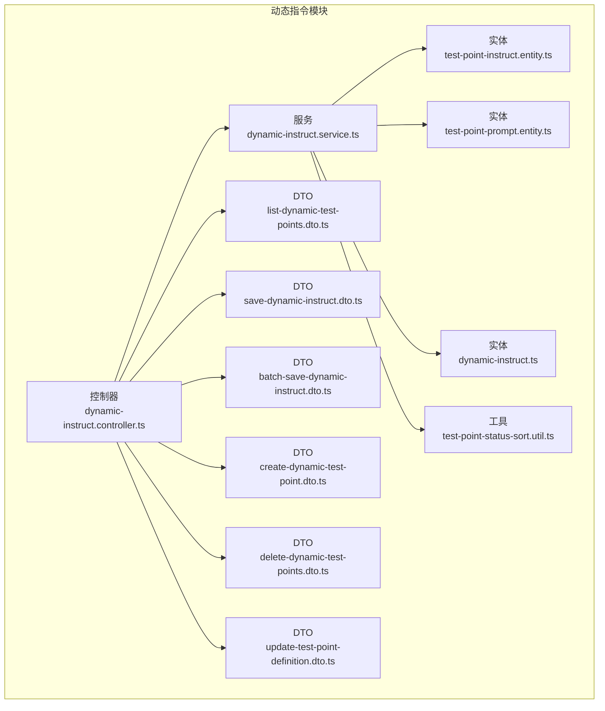
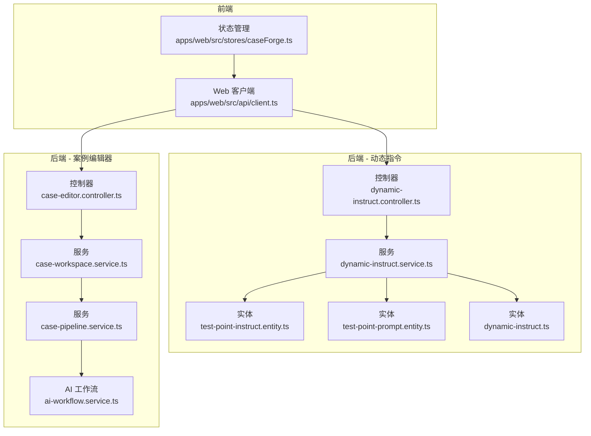
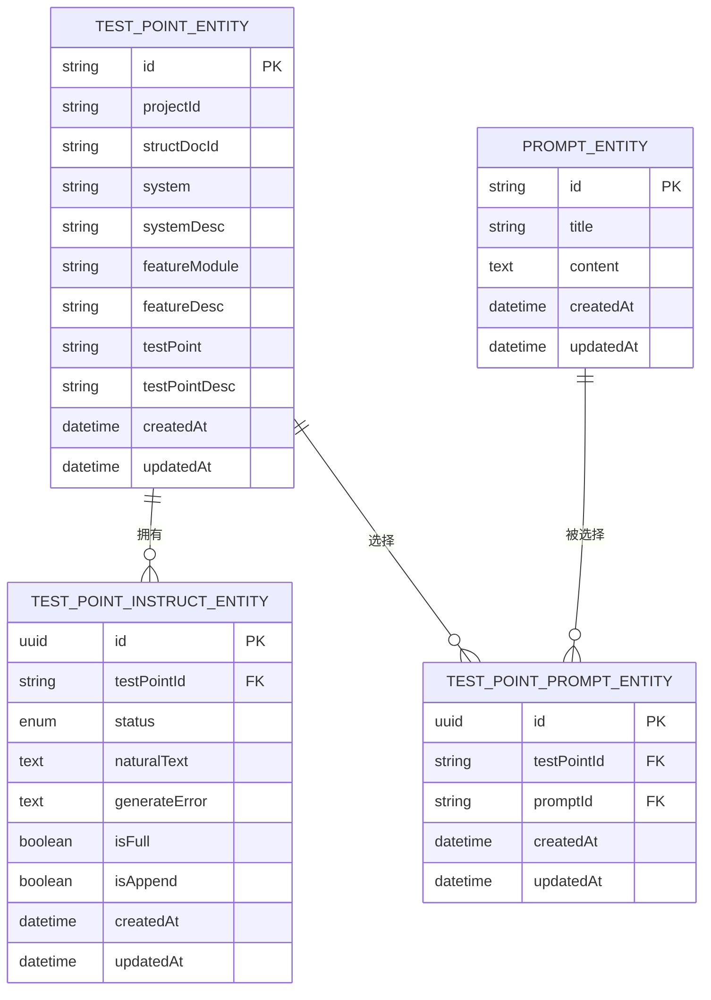
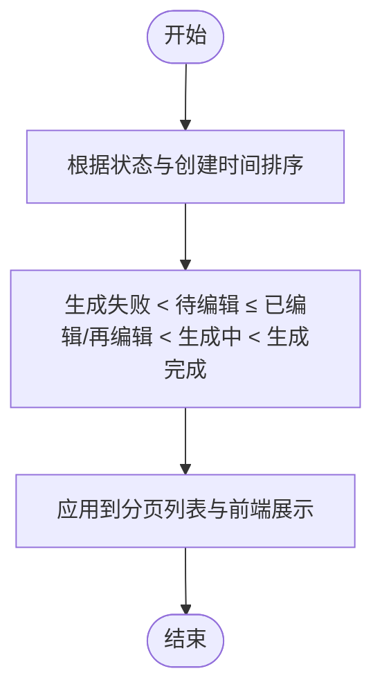
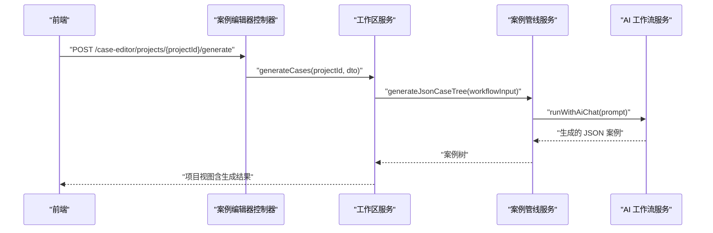
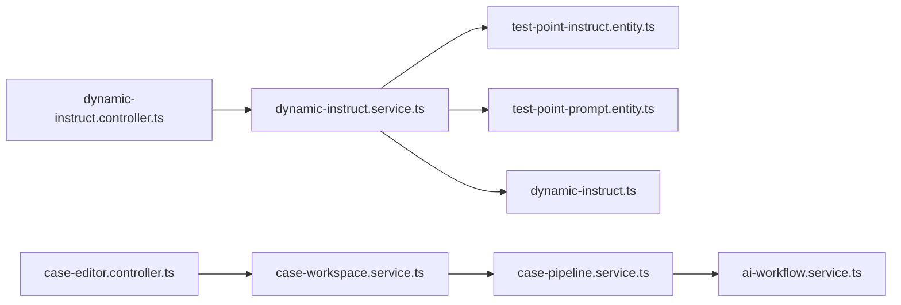

# 动态指令模块

<cite>
**本文引用的文件**
- [apps/api/src/modules/dynamic-instruct/controller/dynamic-instruct.controller.ts](file://apps/api/src/modules/dynamic-instruct/controller/dynamic-instruct.controller.ts)
- [apps/api/src/modules/dynamic-instruct/service/dynamic-instruct.service.ts](file://apps/api/src/modules/dynamic-instruct/service/dynamic-instruct.service.ts)
- [apps/api/src/modules/dynamic-instruct/entity/dynamic-instruct.ts](file://apps/api/src/modules/dynamic-instruct/entity/dynamic-instruct.ts)
- [apps/api/src/modules/dynamic-instruct/entity/test-point-instruct.entity.ts](file://apps/api/src/modules/dynamic-instruct/entity/test-point-instruct.entity.ts)
- [apps/api/src/modules/dynamic-instruct/entity/test-point-prompt.entity.ts](file://apps/api/src/modules/dynamic-instruct/entity/test-point-prompt.entity.ts)
- [apps/api/src/modules/dynamic-instruct/dto/batch-save-dynamic-instruct.dto.ts](file://apps/api/src/modules/dynamic-instruct/dto/batch-save-dynamic-instruct.dto.ts)
- [apps/api/src/modules/dynamic-instruct/dto/create-dynamic-test-point.dto.ts](file://apps/api/src/modules/dynamic-instruct/dto/create-dynamic-test-point.dto.ts)
- [apps/api/src/modules/dynamic-instruct/dto/delete-dynamic-test-points.dto.ts](file://apps/api/src/modules/dynamic-instruct/dto/delete-dynamic-test-points.dto.ts)
- [apps/api/src/modules/dynamic-instruct/dto/list-dynamic-test-points.dto.ts](file://apps/api/src/modules/dynamic-instruct/dto/list-dynamic-test-points.dto.ts)
- [apps/api/src/modules/dynamic-instruct/dto/save-dynamic-instruct.dto.ts](file://apps/api/src/modules/dynamic-instruct/dto/save-dynamic-instruct.dto.ts)
- [apps/api/src/modules/dynamic-instruct/dto/update-test-point-definition.dto.ts](file://apps/api/src/modules/dynamic-instruct/dto/update-test-point-definition.dto.ts)
- [apps/api/src/modules/dynamic-instruct/util/test-point-status-sort.util.ts](file://apps/api/src/modules/dynamic-instruct/util/test-point-status-sort.util.ts)
- [apps/api/src/modules/case-editor/controller/case-editor.controller.ts](file://apps/api/src/modules/case-editor/controller/case-editor.controller.ts)
- [apps/api/src/modules/case-editor/service/case-workspace.service.ts](file://apps/api/src/modules/case-editor/service/case-workspace.service.ts)
- [apps/api/src/modules/case-editor/service/case-pipeline.service.ts](file://apps/api/src/modules/case-editor/service/case-pipeline.service.ts)
- [apps/api/src/common/ai-workflow/service/ai-workflow.service.ts](file://apps/api/src/common/ai-workflow/service/ai-workflow.service.ts)
- [apps/web/src/api/client.ts](file://apps/web/src/api/client.ts)
- [apps/web/src/stores/caseForge.ts](file://apps/web/src/stores/caseForge.ts)
</cite>

## 目录
1. [简介](#简介)
2. [项目结构](#项目结构)
3. [核心组件](#核心组件)
4. [架构总览](#架构总览)
5. [详细组件分析](#详细组件分析)
6. [依赖关系分析](#依赖关系分析)
7. [性能考量](#性能考量)
8. [故障排查指南](#故障排查指南)
9. [结论](#结论)
10. [附录](#附录)

## 简介
动态指令模块围绕“测试要点”与“动态指令”的协同设计，提供测试要点的定义、筛选、状态管理与批量维护能力，并将测试要点与场景提示词（Prompt）进行关联，支撑后续在案例编辑器中驱动自动化案例生成。模块的关键目标包括：
- 定义测试要点的分类与属性，支持按系统、功能模块与描述信息进行组织
- 维护测试要点的动态指令状态与版本化行为（全量覆盖/追加）
- 提供基于提示词与自然语言约束的智能生成策略入口
- 支持批量保存、更新与删除测试要点及其动态指令
- 与案例编辑器协同，将动态指令作为生成输入的一部分参与自动化测试案例生成

## 项目结构
动态指令模块位于后端 NestJS 应用的 modules 下，采用按职责分层的目录组织方式：
- controller 层：暴露 REST API，负责路由与参数校验
- service 层：实现业务逻辑，处理数据持久化与状态流转
- entity 层：定义数据库实体与关系映射
- dto 层：定义请求/响应数据传输对象，承担参数校验
- util 层：提供状态排序等工具方法

图表来源
- [apps/api/src/modules/dynamic-instruct/controller/dynamic-instruct.controller.ts:24-107](file://apps/api/src/modules/dynamic-instruct/controller/dynamic-instruct.controller.ts#L24-L107)
- [apps/api/src/modules/dynamic-instruct/service/dynamic-instruct.service.ts:52-65](file://apps/api/src/modules/dynamic-instruct/service/dynamic-instruct.service.ts#L52-L65)
- [apps/api/src/modules/dynamic-instruct/entity/test-point-instruct.entity.ts:32-86](file://apps/api/src/modules/dynamic-instruct/entity/test-point-instruct.entity.ts#L32-L86)
- [apps/api/src/modules/dynamic-instruct/entity/test-point-prompt.entity.ts:20-62](file://apps/api/src/modules/dynamic-instruct/entity/test-point-prompt.entity.ts#L20-L62)
- [apps/api/src/modules/dynamic-instruct/entity/dynamic-instruct.ts:11-67](file://apps/api/src/modules/dynamic-instruct/entity/dynamic-instruct.ts#L11-L67)
- [apps/api/src/modules/dynamic-instruct/dto/list-dynamic-test-points.dto.ts:9-42](file://apps/api/src/modules/dynamic-instruct/dto/list-dynamic-test-points.dto.ts#L9-L42)
- [apps/api/src/modules/dynamic-instruct/dto/save-dynamic-instruct.dto.ts:22-49](file://apps/api/src/modules/dynamic-instruct/dto/save-dynamic-instruct.dto.ts#L22-L49)
- [apps/api/src/modules/dynamic-instruct/dto/batch-save-dynamic-instruct.dto.ts:9-16](file://apps/api/src/modules/dynamic-instruct/dto/batch-save-dynamic-instruct.dto.ts#L9-L16)
- [apps/api/src/modules/dynamic-instruct/dto/create-dynamic-test-point.dto.ts:7-45](file://apps/api/src/modules/dynamic-instruct/dto/create-dynamic-test-point.dto.ts#L7-L45)
- [apps/api/src/modules/dynamic-instruct/dto/delete-dynamic-test-points.dto.ts:7-13](file://apps/api/src/modules/dynamic-instruct/dto/delete-dynamic-test-points.dto.ts#L7-L13)
- [apps/api/src/modules/dynamic-instruct/dto/update-test-point-definition.dto.ts:7-37](file://apps/api/src/modules/dynamic-instruct/dto/update-test-point-definition.dto.ts#L7-L37)
- [apps/api/src/modules/dynamic-instruct/util/test-point-status-sort.util.ts:3-31](file://apps/api/src/modules/dynamic-instruct/util/test-point-status-sort.util.ts#L3-L31)

章节来源
- [apps/api/src/modules/dynamic-instruct/controller/dynamic-instruct.controller.ts:24-107](file://apps/api/src/modules/dynamic-instruct/controller/dynamic-instruct.controller.ts#L24-L107)
- [apps/api/src/modules/dynamic-instruct/service/dynamic-instruct.service.ts:52-65](file://apps/api/src/modules/dynamic-instruct/service/dynamic-instruct.service.ts#L52-L65)

## 核心组件
- 控制器：提供测试要点与动态指令的查询、新增、删除、单条与批量保存等接口
- 服务：实现分页查询、状态管理、提示词关联、批量保存、生成中恢复轮询等功能
- 实体：测试要点动态指令主表、测试要点与提示词的多对多关联表、历史/兼容实体
- DTO：参数校验与 API 输入输出契约
- 工具：状态排序与比较

章节来源
- [apps/api/src/modules/dynamic-instruct/controller/dynamic-instruct.controller.ts:24-107](file://apps/api/src/modules/dynamic-instruct/controller/dynamic-instruct.controller.ts#L24-L107)
- [apps/api/src/modules/dynamic-instruct/service/dynamic-instruct.service.ts:70-140](file://apps/api/src/modules/dynamic-instruct/service/dynamic-instruct.service.ts#L70-L140)
- [apps/api/src/modules/dynamic-instruct/entity/test-point-instruct.entity.ts:32-86](file://apps/api/src/modules/dynamic-instruct/entity/test-point-instruct.entity.ts#L32-L86)
- [apps/api/src/modules/dynamic-instruct/entity/test-point-prompt.entity.ts:20-62](file://apps/api/src/modules/dynamic-instruct/entity/test-point-prompt.entity.ts#L20-L62)
- [apps/api/src/modules/dynamic-instruct/dto/save-dynamic-instruct.dto.ts:22-49](file://apps/api/src/modules/dynamic-instruct/dto/save-dynamic-instruct.dto.ts#L22-L49)
- [apps/api/src/modules/dynamic-instruct/util/test-point-status-sort.util.ts:3-31](file://apps/api/src/modules/dynamic-instruct/util/test-point-status-sort.util.ts#L3-L31)

## 架构总览
动态指令模块与案例编辑器模块紧密协作，前者负责测试要点与动态指令的维护，后者在生成案例时消费这些指令作为输入。

图表来源
- [apps/api/src/modules/dynamic-instruct/controller/dynamic-instruct.controller.ts:24-107](file://apps/api/src/modules/dynamic-instruct/controller/dynamic-instruct.controller.ts#L24-L107)
- [apps/api/src/modules/dynamic-instruct/service/dynamic-instruct.service.ts:52-65](file://apps/api/src/modules/dynamic-instruct/service/dynamic-instruct.service.ts#L52-L65)
- [apps/api/src/modules/case-editor/controller/case-editor.controller.ts:30-69](file://apps/api/src/modules/case-editor/controller/case-editor.controller.ts#L30-L69)
- [apps/api/src/modules/case-editor/service/case-workspace.service.ts:36-454](file://apps/api/src/modules/case-editor/service/case-workspace.service.ts#L36-L454)
- [apps/api/src/modules/case-editor/service/case-pipeline.service.ts:630-1489](file://apps/api/src/modules/case-editor/service/case-pipeline.service.ts#L630-L1489)
- [apps/api/src/common/ai-workflow/service/ai-workflow.service.ts:38-83](file://apps/api/src/common/ai-workflow/service/ai-workflow.service.ts#L38-L83)
- [apps/web/src/api/client.ts:562-642](file://apps/web/src/api/client.ts#L562-L642)
- [apps/web/src/stores/caseForge.ts:1139-1176](file://apps/web/src/stores/caseForge.ts#L1139-L1176)

## 详细组件分析

### 数据模型设计
动态指令模块的核心数据模型围绕“测试要点”与“动态指令”展开，同时通过“提示词选择”建立测试要点与场景提示词之间的多对多关系。

图表来源
- [apps/api/src/modules/dynamic-instruct/entity/test-point-instruct.entity.ts:32-86](file://apps/api/src/modules/dynamic-instruct/entity/test-point-instruct.entity.ts#L32-L86)
- [apps/api/src/modules/dynamic-instruct/entity/test-point-prompt.entity.ts:20-62](file://apps/api/src/modules/dynamic-instruct/entity/test-point-prompt.entity.ts#L20-L62)
- [apps/api/src/modules/dynamic-instruct/entity/dynamic-instruct.ts:11-67](file://apps/api/src/modules/dynamic-instruct/entity/dynamic-instruct.ts#L11-L67)

章节来源
- [apps/api/src/modules/dynamic-instruct/entity/test-point-instruct.entity.ts:32-86](file://apps/api/src/modules/dynamic-instruct/entity/test-point-instruct.entity.ts#L32-L86)
- [apps/api/src/modules/dynamic-instruct/entity/test-point-prompt.entity.ts:20-62](file://apps/api/src/modules/dynamic-instruct/entity/test-point-prompt.entity.ts#L20-L62)
- [apps/api/src/modules/dynamic-instruct/entity/dynamic-instruct.ts:11-67](file://apps/api/src/modules/dynamic-instruct/entity/dynamic-instruct.ts#L11-L67)

### 测试要点与状态管理
- 测试要点支持系统、功能模块、测试要点名称与描述等属性，便于在结构化文档内进行分类与筛选
- 动态指令状态包含“待编辑、已编辑、再编辑、生成中、生成失败、生成完成”，并提供稳定的排序规则
- 状态排序 SQL 与工具函数确保列表展示的一致性与可预期性

图表来源
- [apps/api/src/modules/dynamic-instruct/service/dynamic-instruct.service.ts:37-47](file://apps/api/src/modules/dynamic-instruct/service/dynamic-instruct.service.ts#L37-L47)
- [apps/api/src/modules/dynamic-instruct/util/test-point-status-sort.util.ts:3-31](file://apps/api/src/modules/dynamic-instruct/util/test-point-status-sort.util.ts#L3-L31)

章节来源
- [apps/api/src/modules/dynamic-instruct/service/dynamic-instruct.service.ts:37-47](file://apps/api/src/modules/dynamic-instruct/service/dynamic-instruct.service.ts#L37-L47)
- [apps/api/src/modules/dynamic-instruct/util/test-point-status-sort.util.ts:3-31](file://apps/api/src/modules/dynamic-instruct/util/test-point-status-sort.util.ts#L3-L31)

### 指令生成算法与提示词优化
- 案例生成由案例编辑器模块统一调度，动态指令模块仅提供测试要点与提示词选择作为输入
- 生成流程会将测试要点的自然语言约束与提示词组合，形成案例生成的上下文输入
- 生成完成后，动态指令状态从“生成中”更新为“生成完成”，失败时更新为“生成失败”并保留错误信息

图表来源
- [apps/api/src/modules/case-editor/controller/case-editor.controller.ts:52-59](file://apps/api/src/modules/case-editor/controller/case-editor.controller.ts#L52-L59)
- [apps/api/src/modules/case-editor/service/case-workspace.service.ts:344-427](file://apps/api/src/modules/case-editor/service/case-workspace.service.ts#L344-L427)
- [apps/api/src/modules/case-editor/service/case-pipeline.service.ts:630-668](file://apps/api/src/modules/case-editor/service/case-pipeline.service.ts#L630-L668)
- [apps/api/src/common/ai-workflow/service/ai-workflow.service.ts:38-83](file://apps/api/src/common/ai-workflow/service/ai-workflow.service.ts#L38-L83)

章节来源
- [apps/api/src/modules/case-editor/controller/case-editor.controller.ts:52-59](file://apps/api/src/modules/case-editor/controller/case-editor.controller.ts#L52-L59)
- [apps/api/src/modules/case-editor/service/case-workspace.service.ts:344-427](file://apps/api/src/modules/case-editor/service/case-workspace.service.ts#L344-L427)
- [apps/api/src/modules/case-editor/service/case-pipeline.service.ts:630-668](file://apps/api/src/modules/case-editor/service/case-pipeline.service.ts#L630-L668)
- [apps/api/src/common/ai-workflow/service/ai-workflow.service.ts:38-83](file://apps/api/src/common/ai-workflow/service/ai-workflow.service.ts#L38-L83)

### API 参考

- 获取测试要点元数据（编辑区自动完成与筛选项）
  - 方法：GET
  - 路径：/dynamic-instruct/test-points/meta
  - 参数：projectId, structDocId
  - 返回：系统列表、功能模块列表、定义样例（不含动态指令正文）

- 查询生成中的测试要点（用于恢复轮询）
  - 方法：GET
  - 路径：/dynamic-instruct/test-points/generating
  - 参数：projectId, structDocId
  - 返回：测试要点 ID 与名称列表

- 分页查询测试要点摘要
  - 方法：GET
  - 路径：/dynamic-instruct/test-points
  - 查询参数：projectId, structDocId, system, featureModule, page, pageSize
  - 返回：分页结果、系统与功能模块维度、测试要点摘要（不含正文）

- 新增测试要点
  - 方法：POST
  - 路径：/dynamic-instruct/test-points
  - 请求体：CreateDynamicTestPointDto
  - 返回：测试要点摘要

- 删除测试要点
  - 方法：DELETE
  - 路径：/dynamic-instruct/test-points
  - 请求体：DeleteDynamicTestPointsDto
  - 返回：删除计数与受影响 ID 列表

- 获取单个测试要点的动态指令详情
  - 方法：GET
  - 路径：/dynamic-instruct/test-points/{testPointId}
  - 返回：测试要点详情、状态、自然语言、提示词列表

- 保存单个测试要点的动态指令
  - 方法：PATCH
  - 路径：/dynamic-instruct/test-points/{testPointId}
  - 请求体：SaveDynamicInstructDto
  - 返回：动态指令详情（含状态、自然语言、提示词）

- 更新单个测试要点的定义字段
  - 方法：PATCH
  - 路径：/dynamic-instruct/test-points/{testPointId}/definition
  - 请求体：UpdateTestPointDefinitionDto
  - 返回：动态指令详情

- 批量保存多个测试要点的动态指令
  - 方法：PATCH
  - 路径：/dynamic-instruct/test-points
  - 请求体：BatchSaveDynamicInstructDto（含 testPointIds 与约束字段）
  - 返回：每个测试要点的动态指令详情数组

章节来源
- [apps/api/src/modules/dynamic-instruct/controller/dynamic-instruct.controller.ts:32-106](file://apps/api/src/modules/dynamic-instruct/controller/dynamic-instruct.controller.ts#L32-L106)
- [apps/api/src/modules/dynamic-instruct/dto/list-dynamic-test-points.dto.ts:9-42](file://apps/api/src/modules/dynamic-instruct/dto/list-dynamic-test-points.dto.ts#L9-L42)
- [apps/api/src/modules/dynamic-instruct/dto/create-dynamic-test-point.dto.ts:7-45](file://apps/api/src/modules/dynamic-instruct/dto/create-dynamic-test-point.dto.ts#L7-L45)
- [apps/api/src/modules/dynamic-instruct/dto/delete-dynamic-test-points.dto.ts:7-13](file://apps/api/src/modules/dynamic-instruct/dto/delete-dynamic-test-points.dto.ts#L7-L13)
- [apps/api/src/modules/dynamic-instruct/dto/save-dynamic-instruct.dto.ts:22-49](file://apps/api/src/modules/dynamic-instruct/dto/save-dynamic-instruct.dto.ts#L22-L49)
- [apps/api/src/modules/dynamic-instruct/dto/batch-save-dynamic-instruct.dto.ts:9-16](file://apps/api/src/modules/dynamic-instruct/dto/batch-save-dynamic-instruct.dto.ts#L9-L16)
- [apps/api/src/modules/dynamic-instruct/dto/update-test-point-definition.dto.ts:7-37](file://apps/api/src/modules/dynamic-instruct/dto/update-test-point-definition.dto.ts#L7-L37)

### 前端集成与使用示例
- 前端通过客户端封装的 API 进行调用，包括列表、元数据、生成中查询、详情、新增、删除、更新定义与保存指令
- 在案例生成前，建议先调用“获取生成中测试要点”接口以恢复轮询状态
- 生成完成后，前端可轮询更新后的状态并展示生成结果

章节来源
- [apps/web/src/api/client.ts:562-642](file://apps/web/src/api/client.ts#L562-L642)
- [apps/web/src/stores/caseForge.ts:1139-1176](file://apps/web/src/stores/caseForge.ts#L1139-L1176)

## 依赖关系分析
- 控制器依赖服务层进行业务处理
- 服务层依赖实体仓储与公共工具（审计、项目更新标记）
- 案例编辑器模块依赖动态指令模块提供的测试要点与提示词选择，作为生成输入
- AI 工作流模块为案例生成提供底层推理能力

图表来源
- [apps/api/src/modules/dynamic-instruct/controller/dynamic-instruct.controller.ts:24-107](file://apps/api/src/modules/dynamic-instruct/controller/dynamic-instruct.controller.ts#L24-L107)
- [apps/api/src/modules/dynamic-instruct/service/dynamic-instruct.service.ts:52-65](file://apps/api/src/modules/dynamic-instruct/service/dynamic-instruct.service.ts#L52-L65)
- [apps/api/src/modules/case-editor/controller/case-editor.controller.ts:30-69](file://apps/api/src/modules/case-editor/controller/case-editor.controller.ts#L30-L69)
- [apps/api/src/modules/case-editor/service/case-workspace.service.ts:36-454](file://apps/api/src/modules/case-editor/service/case-workspace.service.ts#L36-L454)
- [apps/api/src/modules/case-editor/service/case-pipeline.service.ts:630-1489](file://apps/api/src/modules/case-editor/service/case-pipeline.service.ts#L630-L1489)
- [apps/api/src/common/ai-workflow/service/ai-workflow.service.ts:38-83](file://apps/api/src/common/ai-workflow/service/ai-workflow.service.ts#L38-L83)

章节来源
- [apps/api/src/modules/dynamic-instruct/controller/dynamic-instruct.controller.ts:24-107](file://apps/api/src/modules/dynamic-instruct/controller/dynamic-instruct.controller.ts#L24-L107)
- [apps/api/src/modules/dynamic-instruct/service/dynamic-instruct.service.ts:52-65](file://apps/api/src/modules/dynamic-instruct/service/dynamic-instruct.service.ts#L52-L65)
- [apps/api/src/modules/case-editor/controller/case-editor.controller.ts:30-69](file://apps/api/src/modules/case-editor/controller/case-editor.controller.ts#L30-L69)
- [apps/api/src/modules/case-editor/service/case-workspace.service.ts:36-454](file://apps/api/src/modules/case-editor/service/case-workspace.service.ts#L36-L454)
- [apps/api/src/modules/case-editor/service/case-pipeline.service.ts:630-1489](file://apps/api/src/modules/case-editor/service/case-pipeline.service.ts#L630-L1489)
- [apps/api/src/common/ai-workflow/service/ai-workflow.service.ts:38-83](file://apps/api/src/common/ai-workflow/service/ai-workflow.service.ts#L38-L83)

## 性能考量
- 列表查询采用分页与状态排序 SQL，避免全表扫描，提升大数据量下的响应速度
- 使用 LEFT JOIN 与子查询减少 N+1 查询风险
- 批量保存通过循环逐条处理，若需要更高吞吐可考虑事务批处理优化
- 生成中测试要点查询用于恢复轮询，减少重复生成开销

## 故障排查指南
- 生成失败：当案例生成异常时，动态指令状态更新为“生成失败”，并保留错误信息；前端可据此弹窗提示并引导用户重试
- 生成中恢复：项目加载时调用“生成中测试要点”接口，前端轮询直至完成或失败
- 权限与归属：所有操作均通过审计工具校验项目归属，越权访问将抛出异常

章节来源
- [apps/api/src/modules/dynamic-instruct/service/dynamic-instruct.service.ts:429-444](file://apps/api/src/modules/dynamic-instruct/service/dynamic-instruct.service.ts#L429-L444)
- [apps/web/src/stores/caseForge.ts:1142-1176](file://apps/web/src/stores/caseForge.ts#L1142-L1176)

## 结论
动态指令模块通过清晰的数据模型与稳定的 API 设计，实现了测试要点与动态指令的全生命周期管理，并与案例编辑器模块无缝衔接，为自动化测试案例生成提供了可靠的基础。其状态管理与提示词关联机制，使得测试要点能够在不同阶段被正确地消费与迭代，从而提升整体测试效率与质量。

## 附录
- 前端 API 客户端封装与轮询逻辑可参考 Web 客户端与状态管理模块
- 案例生成的完整流程由案例编辑器模块统一编排，动态指令模块仅提供输入数据