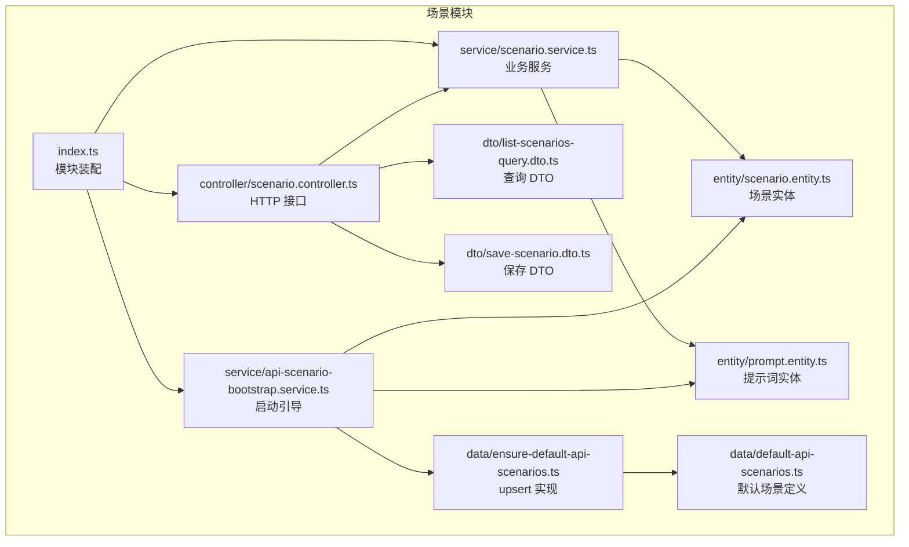
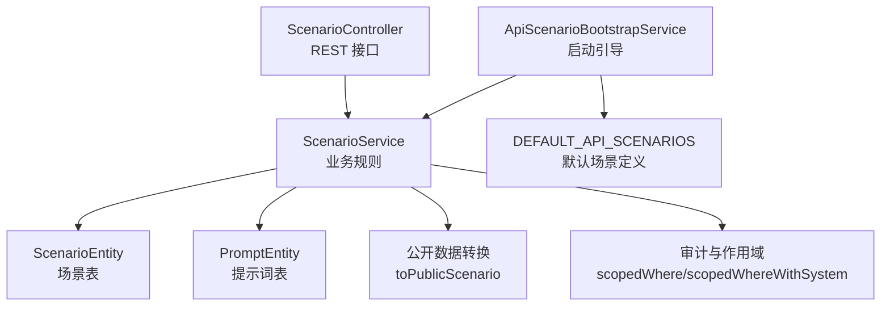
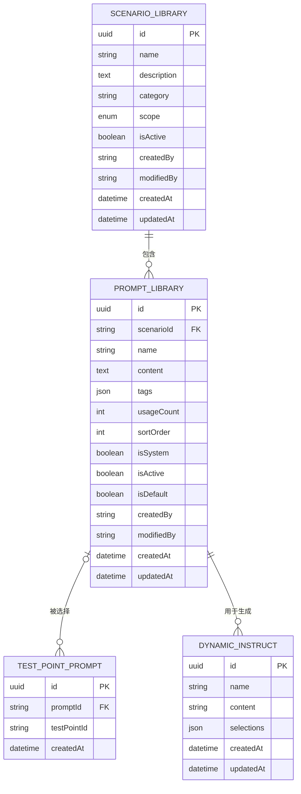
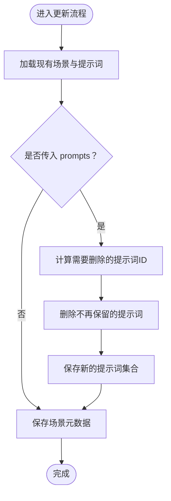
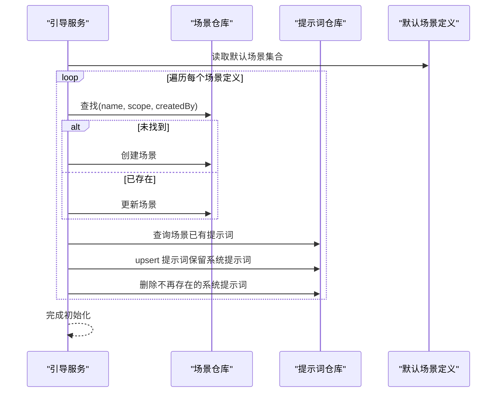
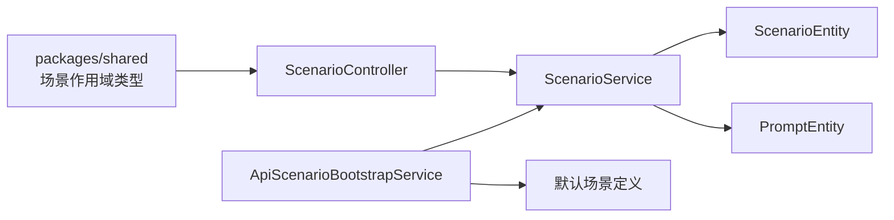

# 场景模块

<cite>
**本文引用的文件**
- [apps/api/src/modules/scenario/index.ts](file://apps/api/src/modules/scenario/index.ts)
- [apps/api/src/modules/scenario/controller/scenario.controller.ts](file://apps/api/src/modules/scenario/controller/scenario.controller.ts)
- [apps/api/src/modules/scenario/service/scenario.service.ts](file://apps/api/src/modules/scenario/service/scenario.service.ts)
- [apps/api/src/modules/scenario/service/api-scenario-bootstrap.service.ts](file://apps/api/src/modules/scenario/service/api-scenario-bootstrap.service.ts)
- [apps/api/src/modules/scenario/entity/scenario.entity.ts](file://apps/api/src/modules/scenario/entity/scenario.entity.ts)
- [apps/api/src/modules/scenario/entity/prompt.entity.ts](file://apps/api/src/modules/scenario/entity/prompt.entity.ts)
- [apps/api/src/modules/scenario/dto/save-scenario.dto.ts](file://apps/api/src/modules/scenario/dto/save-scenario.dto.ts)
- [apps/api/src/modules/scenario/dto/list-scenarios-query.dto.ts](file://apps/api/src/modules/scenario/dto/list-scenarios-query.dto.ts)
- [apps/api/src/modules/scenario/data/default-api-scenarios.ts](file://apps/api/src/modules/scenario/data/default-api-scenarios.ts)
- [apps/api/src/modules/scenario/data/ensure-default-api-scenarios.ts](file://apps/api/src/modules/scenario/data/ensure-default-api-scenarios.ts)
- [packages/shared/src/index.ts](file://packages/shared/src/index.ts)
</cite>

## 目录
1. [引言](#引言)
2. [项目结构](#项目结构)
3. [核心组件](#核心组件)
4. [架构总览](#架构总览)
5. [详细组件分析](#详细组件分析)
6. [依赖分析](#依赖分析)
7. [性能考虑](#性能考虑)
8. [故障排查指南](#故障排查指南)
9. [结论](#结论)
10. [附录](#附录)

## 引言
场景模块围绕“测试场景”与“提示词库”的数据模型与业务能力展开，提供场景的创建、查询、更新、删除与激活控制，同时支持提示词的批量保存与替换。系统在启动时通过引导服务写入默认的接口测试场景模板，确保团队开箱即用。场景与AI工作流的集成体现在提示词注入、参数传递与结果处理等环节，便于将场景化策略注入到自动化测试与案例生成流程中。

## 项目结构
场景模块位于后端 NestJS 应用的模块化目录中，采用“按功能域划分”的组织方式，包含控制器、服务、实体、DTO、数据初始化与模块装配文件。模块通过 TypeORM 进行数据库持久化，控制器提供标准的 REST API，服务封装业务规则与数据一致性保障，引导服务负责系统预置场景的初始化。

图表来源
- [apps/api/src/modules/scenario/index.ts:12-19](file://apps/api/src/modules/scenario/index.ts#L12-L19)
- [apps/api/src/modules/scenario/controller/scenario.controller.ts:22-27](file://apps/api/src/modules/scenario/controller/scenario.controller.ts#L22-L27)
- [apps/api/src/modules/scenario/service/scenario.service.ts:35-40](file://apps/api/src/modules/scenario/service/scenario.service.ts#L35-L40)
- [apps/api/src/modules/scenario/service/api-scenario-bootstrap.service.ts:15-20](file://apps/api/src/modules/scenario/service/api-scenario-bootstrap.service.ts#L15-L20)
- [apps/api/src/modules/scenario/entity/scenario.entity.ts:19-71](file://apps/api/src/modules/scenario/entity/scenario.entity.ts#L19-L71)
- [apps/api/src/modules/scenario/entity/prompt.entity.ts:22-96](file://apps/api/src/modules/scenario/entity/prompt.entity.ts#L22-L96)
- [apps/api/src/modules/scenario/dto/save-scenario.dto.ts:69-102](file://apps/api/src/modules/scenario/dto/save-scenario.dto.ts#L69-L102)
- [apps/api/src/modules/scenario/dto/list-scenarios-query.dto.ts:9-15](file://apps/api/src/modules/scenario/dto/list-scenarios-query.dto.ts#L9-L15)
- [apps/api/src/modules/scenario/data/default-api-scenarios.ts:22-325](file://apps/api/src/modules/scenario/data/default-api-scenarios.ts#L22-L325)
- [apps/api/src/modules/scenario/data/ensure-default-api-scenarios.ts:14-112](file://apps/api/src/modules/scenario/data/ensure-default-api-scenarios.ts#L14-L112)

章节来源
- [apps/api/src/modules/scenario/index.ts:12-19](file://apps/api/src/modules/scenario/index.ts#L12-L19)
- [apps/api/src/modules/scenario/controller/scenario.controller.ts:22-60](file://apps/api/src/modules/scenario/controller/scenario.controller.ts#L22-L60)
- [apps/api/src/modules/scenario/service/scenario.service.ts:34-209](file://apps/api/src/modules/scenario/service/scenario.service.ts#L34-L209)
- [apps/api/src/modules/scenario/service/api-scenario-bootstrap.service.ts:12-31](file://apps/api/src/modules/scenario/service/api-scenario-bootstrap.service.ts#L12-L31)
- [apps/api/src/modules/scenario/entity/scenario.entity.ts:19-71](file://apps/api/src/modules/scenario/entity/scenario.entity.ts#L19-L71)
- [apps/api/src/modules/scenario/entity/prompt.entity.ts:22-96](file://apps/api/src/modules/scenario/entity/prompt.entity.ts#L22-L96)
- [apps/api/src/modules/scenario/dto/save-scenario.dto.ts:22-102](file://apps/api/src/modules/scenario/dto/save-scenario.dto.ts#L22-L102)
- [apps/api/src/modules/scenario/dto/list-scenarios-query.dto.ts:9-15](file://apps/api/src/modules/scenario/dto/list-scenarios-query.dto.ts#L9-L15)
- [apps/api/src/modules/scenario/data/default-api-scenarios.ts:22-325](file://apps/api/src/modules/scenario/data/default-api-scenarios.ts#L22-L325)
- [apps/api/src/modules/scenario/data/ensure-default-api-scenarios.ts:14-112](file://apps/api/src/modules/scenario/data/ensure-default-api-scenarios.ts#L14-L112)

## 核心组件
- 模块装配：通过 index.ts 导出服务与控制器，注册 TypeORM 实体，形成独立的功能域模块。
- 控制器：提供场景列表、详情、创建、更新、删除的 REST 接口，统一处理查询 DTO 与保存 DTO。
- 服务：实现场景与提示词的增删改查、唯一性校验、提示词替换、访问与所有权校验、公开数据转换等。
- 实体：场景与提示词的数据库映射，包含索引、字段约束与级联删除策略。
- DTO：定义保存与查询的数据结构与校验规则。
- 引导服务：应用启动时写入系统预置的接口测试场景，保证默认模板可用。
- 默认场景数据：内置接口测试场景的模板集合，包含提示词内容、标签、排序与默认勾选策略。

章节来源
- [apps/api/src/modules/scenario/index.ts:12-19](file://apps/api/src/modules/scenario/index.ts#L12-L19)
- [apps/api/src/modules/scenario/controller/scenario.controller.ts:24-60](file://apps/api/src/modules/scenario/controller/scenario.controller.ts#L24-L60)
- [apps/api/src/modules/scenario/service/scenario.service.ts:34-209](file://apps/api/src/modules/scenario/service/scenario.service.ts#L34-L209)
- [apps/api/src/modules/scenario/entity/scenario.entity.ts:23-71](file://apps/api/src/modules/scenario/entity/scenario.entity.ts#L23-L71)
- [apps/api/src/modules/scenario/entity/prompt.entity.ts:26-96](file://apps/api/src/modules/scenario/entity/prompt.entity.ts#L26-L96)
- [apps/api/src/modules/scenario/dto/save-scenario.dto.ts:22-102](file://apps/api/src/modules/scenario/dto/save-scenario.dto.ts#L22-L102)
- [apps/api/src/modules/scenario/dto/list-scenarios-query.dto.ts:9-15](file://apps/api/src/modules/scenario/dto/list-scenarios-query.dto.ts#L9-L15)
- [apps/api/src/modules/scenario/service/api-scenario-bootstrap.service.ts:12-31](file://apps/api/src/modules/scenario/service/api-scenario-bootstrap.service.ts#L12-L31)
- [apps/api/src/modules/scenario/data/default-api-scenarios.ts:22-325](file://apps/api/src/modules/scenario/data/default-api-scenarios.ts#L22-L325)

## 架构总览
场景模块遵循“控制器-服务-实体”的分层架构，控制器负责请求接入与参数校验，服务封装业务规则与数据一致性，实体映射数据库表结构。默认场景通过引导服务在应用启动时完成 upsert，确保系统具备可复用的接口测试模板。

图表来源
- [apps/api/src/modules/scenario/controller/scenario.controller.ts:24-60](file://apps/api/src/modules/scenario/controller/scenario.controller.ts#L24-L60)
- [apps/api/src/modules/scenario/service/scenario.service.ts:35-40](file://apps/api/src/modules/scenario/service/scenario.service.ts#L35-L40)
- [apps/api/src/modules/scenario/entity/scenario.entity.ts:19-71](file://apps/api/src/modules/scenario/entity/scenario.entity.ts#L19-L71)
- [apps/api/src/modules/scenario/entity/prompt.entity.ts:22-96](file://apps/api/src/modules/scenario/entity/prompt.entity.ts#L22-L96)
- [apps/api/src/modules/scenario/service/api-scenario-bootstrap.service.ts:22-30](file://apps/api/src/modules/scenario/service/api-scenario-bootstrap.service.ts#L22-L30)
- [apps/api/src/modules/scenario/data/default-api-scenarios.ts:22-325](file://apps/api/src/modules/scenario/data/default-api-scenarios.ts#L22-L325)

## 详细组件分析

### 数据模型与关系
场景与提示词采用一对多关系，场景删除时级联删除其提示词。提示词与测试点选择、动态指令存在关联，便于在案例生成与执行中进行筛选与复用。

图表来源
- [apps/api/src/modules/scenario/entity/scenario.entity.ts:23-71](file://apps/api/src/modules/scenario/entity/scenario.entity.ts#L23-L71)
- [apps/api/src/modules/scenario/entity/prompt.entity.ts:26-96](file://apps/api/src/modules/scenario/entity/prompt.entity.ts#L26-L96)

章节来源
- [apps/api/src/modules/scenario/entity/scenario.entity.ts:23-71](file://apps/api/src/modules/scenario/entity/scenario.entity.ts#L23-L71)
- [apps/api/src/modules/scenario/entity/prompt.entity.ts:26-96](file://apps/api/src/modules/scenario/entity/prompt.entity.ts#L26-L96)

### 场景与提示词的保存与替换流程
服务在保存场景时支持同时保存提示词；在更新场景时，若传入提示词数组则会对现有提示词进行全量替换，保留指定 ID 的提示词并删除不在新列表中的旧提示词。

图表来源
- [apps/api/src/modules/scenario/service/scenario.service.ts:115-132](file://apps/api/src/modules/scenario/service/scenario.service.ts#L115-L132)
- [apps/api/src/modules/scenario/service/scenario.service.ts:144-160](file://apps/api/src/modules/scenario/service/scenario.service.ts#L144-L160)

章节来源
- [apps/api/src/modules/scenario/service/scenario.service.ts:115-160](file://apps/api/src/modules/scenario/service/scenario.service.ts#L115-L160)

### 默认场景的加载与管理
应用启动时，引导服务遍历默认场景定义，按名称、作用域与创建者进行匹配，若不存在则创建，存在则更新；随后对提示词进行 upsert，保留系统提示词并清理不再存在的系统提示词。

图表来源
- [apps/api/src/modules/scenario/service/api-scenario-bootstrap.service.ts:22-30](file://apps/api/src/modules/scenario/service/api-scenario-bootstrap.service.ts#L22-L30)
- [apps/api/src/modules/scenario/data/ensure-default-api-scenarios.ts:23-112](file://apps/api/src/modules/scenario/data/ensure-default-api-scenarios.ts#L23-L112)
- [apps/api/src/modules/scenario/data/default-api-scenarios.ts:22-325](file://apps/api/src/modules/scenario/data/default-api-scenarios.ts#L22-L325)

章节来源
- [apps/api/src/modules/scenario/service/api-scenario-bootstrap.service.ts:22-30](file://apps/api/src/modules/scenario/service/api-scenario-bootstrap.service.ts#L22-L30)
- [apps/api/src/modules/scenario/data/ensure-default-api-scenarios.ts:14-112](file://apps/api/src/modules/scenario/data/ensure-default-api-scenarios.ts#L14-L112)
- [apps/api/src/modules/scenario/data/default-api-scenarios.ts:22-325](file://apps/api/src/modules/scenario/data/default-api-scenarios.ts#L22-L325)

### 场景与AI工作流的集成
场景与AI工作流的集成主要体现在以下方面：
- 提示词注入：在生成或执行测试任务前，从场景中提取提示词集合，作为工作流输入的一部分。
- 参数传递：将场景的类别、标签、排序等元信息与提示词内容一并传递给工作流，以便按场景维度进行筛选与组合。
- 结果处理：工作流输出的测试案例可与场景绑定，便于后续检索、归档与复用。

该部分为概念性说明，用于指导集成实践，不直接对应具体源码文件。

## 依赖分析
- 模块内聚：场景模块内部职责清晰，控制器仅负责路由与参数校验，服务集中处理业务规则，实体专注数据映射。
- 外部依赖：共享包提供场景作用域类型与公共常量；审计工具提供作用域查询与访问控制辅助方法。
- 潜在耦合：提示词与测试点、动态指令存在关联，需注意在删除场景或提示词时的级联策略与数据一致性。

图表来源
- [packages/shared/src/index.ts:159-159](file://packages/shared/src/index.ts#L159-L159)
- [apps/api/src/modules/scenario/controller/scenario.controller.ts:16-18](file://apps/api/src/modules/scenario/controller/scenario.controller.ts#L16-L18)
- [apps/api/src/modules/scenario/service/scenario.service.ts:17-27](file://apps/api/src/modules/scenario/service/scenario.service.ts#L17-L27)
- [apps/api/src/modules/scenario/service/api-scenario-bootstrap.service.ts:9-9](file://apps/api/src/modules/scenario/service/api-scenario-bootstrap.service.ts#L9-L9)
- [apps/api/src/modules/scenario/data/default-api-scenarios.ts:22-325](file://apps/api/src/modules/scenario/data/default-api-scenarios.ts#L22-L325)

章节来源
- [packages/shared/src/index.ts:159-159](file://packages/shared/src/index.ts#L159-L159)
- [apps/api/src/modules/scenario/controller/scenario.controller.ts:16-18](file://apps/api/src/modules/scenario/controller/scenario.controller.ts#L16-L18)
- [apps/api/src/modules/scenario/service/scenario.service.ts:17-27](file://apps/api/src/modules/scenario/service/scenario.service.ts#L17-L27)
- [apps/api/src/modules/scenario/service/api-scenario-bootstrap.service.ts:9-9](file://apps/api/src/modules/scenario/service/api-scenario-bootstrap.service.ts#L9-L9)
- [apps/api/src/modules/scenario/data/default-api-scenarios.ts:22-325](file://apps/api/src/modules/scenario/data/default-api-scenarios.ts#L22-L325)

## 性能考虑
- 查询优化：场景列表查询按启用状态与更新时间排序，提示词按创建时间与排序字段排序，建议在高频查询场景下确保相关索引生效。
- 批量保存：提示词保存采用批量插入与更新，减少事务往返；替换提示词时先删除再插入，避免冗余数据。
- 启动初始化：默认场景 upsert 在应用启动时一次性完成，避免运行期抖动；建议在大规模场景时评估初始化耗时并分批处理。

## 故障排查指南
- 名称冲突：场景名称在同一作用域内必须唯一，重复会抛出错误；请检查作用域与名称组合。
- 提示词重复：同一场景内的提示词名称不可重复，重复会抛出错误；请调整提示词名称或移除重复项。
- 访问与所有权：读取与删除场景需满足访问范围与所有权校验，若无权限会抛出异常；请确认当前用户的作用域与所属关系。
- 启动失败：引导服务在初始化默认场景时捕获异常并记录日志；请查看日志定位具体失败原因。

章节来源
- [apps/api/src/modules/scenario/service/scenario.service.ts:162-173](file://apps/api/src/modules/scenario/service/scenario.service.ts#L162-L173)
- [apps/api/src/modules/scenario/service/scenario.service.ts:175-187](file://apps/api/src/modules/scenario/service/scenario.service.ts#L175-L187)
- [apps/api/src/modules/scenario/service/scenario.service.ts:77-78](file://apps/api/src/modules/scenario/service/scenario.service.ts#L77-L78)
- [apps/api/src/modules/scenario/service/api-scenario-bootstrap.service.ts:26-28](file://apps/api/src/modules/scenario/service/api-scenario-bootstrap.service.ts#L26-L28)

## 结论
场景模块通过清晰的数据模型与严格的业务规则，提供了可扩展的场景与提示词管理能力。默认场景的系统预置确保了开箱即用，而与AI工作流的集成则为自动化测试与案例生成提供了强大的策略支撑。模块在设计上注重可维护性与可扩展性，适合在复杂测试体系中长期演进。

## 附录

### 场景管理 API 参考
- 获取场景列表
  - 方法：GET
  - 路径：/scenario/list
  - 查询参数：scope（可选，枚举：case、api）
  - 返回：场景列表（含提示词）
- 获取单个场景详情
  - 方法：GET
  - 路径：/scenario/:id
  - 返回：场景详情（含提示词）
- 创建场景
  - 方法：POST
  - 路径：/scenario
  - 请求体：SaveScenarioDto（包含 name、description、category、scope、isActive、prompts）
  - 返回：创建后的场景详情
- 更新场景
  - 方法：PATCH
  - 路径：/scenario/:id
  - 请求体：SaveScenarioDto（可选包含 prompts 进行全量替换）
  - 返回：更新后的场景详情
- 删除场景
  - 方法：DELETE
  - 路径：/scenario/:id
  - 返回：{ id, deleted: true }

章节来源
- [apps/api/src/modules/scenario/controller/scenario.controller.ts:29-60](file://apps/api/src/modules/scenario/controller/scenario.controller.ts#L29-L60)
- [apps/api/src/modules/scenario/dto/list-scenarios-query.dto.ts:9-15](file://apps/api/src/modules/scenario/dto/list-scenarios-query.dto.ts#L9-L15)
- [apps/api/src/modules/scenario/dto/save-scenario.dto.ts:69-102](file://apps/api/src/modules/scenario/dto/save-scenario.dto.ts#L69-L102)

### 场景定义与提示词管理最佳实践
- 场景分类：按测试维度（如功能、安全、断言）与业务领域（如通用规则、涉帐接口）进行分类，便于检索与复用。
- 提示词命名：在同一场景内保持提示词名称唯一，避免歧义；为提示词添加语义化标签，提升筛选效率。
- 默认场景扩展：基于默认模板进行二次开发，新增提示词时保持 isSystem 标记与 isDefault 策略的一致性，确保系统升级时的兼容性。
- 权限与作用域：严格区分场景作用域（case、api），在跨域场景中避免误用他人场景。

章节来源
- [apps/api/src/modules/scenario/data/default-api-scenarios.ts:22-325](file://apps/api/src/modules/scenario/data/default-api-scenarios.ts#L22-L325)
- [apps/api/src/modules/scenario/service/scenario.service.ts:175-187](file://apps/api/src/modules/scenario/service/scenario.service.ts#L175-L187)