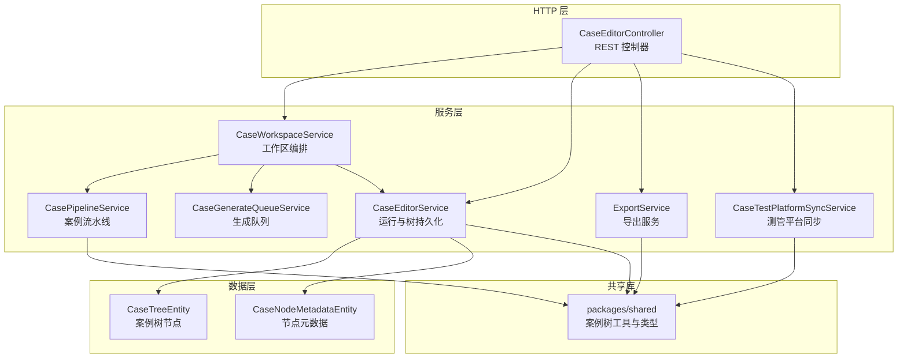
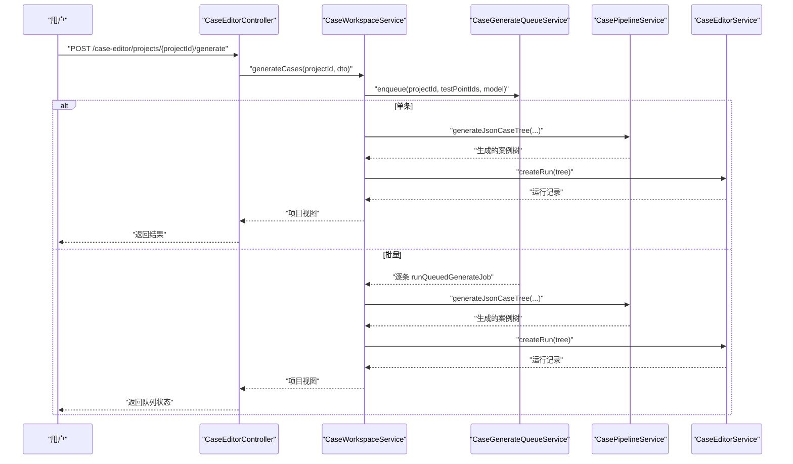
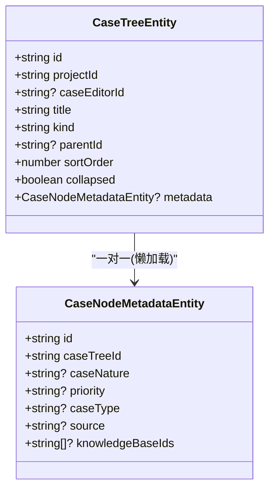
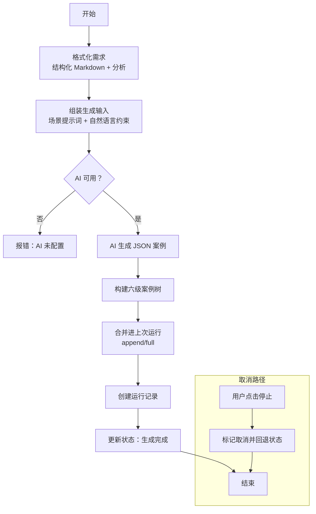
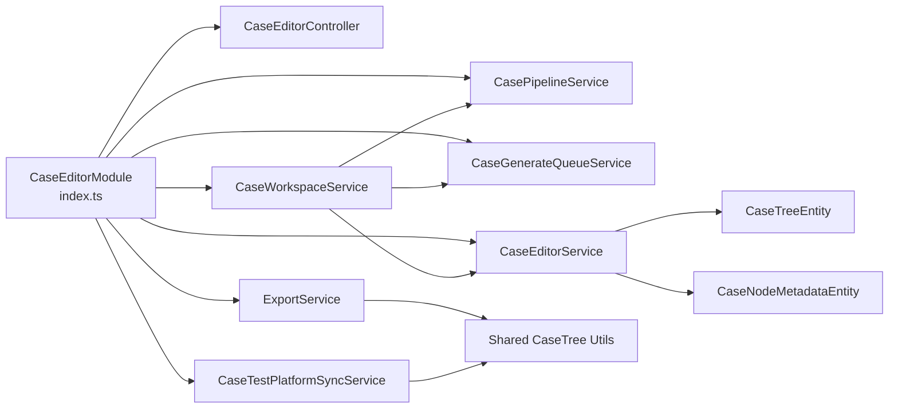

# 案例编辑器模块

<cite>
**本文引用的文件**
- [apps/api/src/modules/case-editor/index.ts](file://apps/api/src/modules/case-editor/index.ts)
- [apps/api/src/modules/case-editor/controller/case-editor.controller.ts](file://apps/api/src/modules/case-editor/controller/case-editor.controller.ts)
- [apps/api/src/modules/case-editor/service/case-editor.service.ts](file://apps/api/src/modules/case-editor/service/case-editor.service.ts)
- [apps/api/src/modules/case-editor/service/case-generate-queue.service.ts](file://apps/api/src/modules/case-editor/service/case-generate-queue.service.ts)
- [apps/api/src/modules/case-editor/service/case-pipeline.service.ts](file://apps/api/src/modules/case-editor/service/case-pipeline.service.ts)
- [apps/api/src/modules/case-editor/service/case-workspace.service.ts](file://apps/api/src/modules/case-editor/service/case-workspace.service.ts)
- [apps/api/src/modules/case-editor/service/export.service.ts](file://apps/api/src/modules/case-editor/service/export.service.ts)
- [apps/api/src/modules/case-editor/service/case-test-platform-sync.service.ts](file://apps/api/src/modules/case-editor/service/case-test-platform-sync.service.ts)
- [apps/api/src/modules/case-editor/entity/case-tree.entity.ts](file://apps/api/src/modules/case-editor/entity/case-tree.entity.ts)
- [apps/api/src/modules/case-editor/entity/case-node-metadata.entity.ts](file://apps/api/src/modules/case-editor/entity/case-node-metadata.entity.ts)
- [apps/api/src/modules/case-editor/util/case-tree-diff.util.ts](file://apps/api/src/modules/case-editor/util/case-tree-diff.util.ts)
- [apps/api/src/modules/case-editor/util/case-workflow-input.util.ts](file://apps/api/src/modules/case-editor/util/case-workflow-input.util.ts)
- [apps/api/src/modules/case-editor/util/case-tree-merge.util.ts](file://apps/api/src/modules/case-editor/util/case-tree-merge.util.ts)
- [apps/api/src/modules/case-editor/util/case-generate-concurrency.ts](file://apps/api/src/modules/case-editor/util/case-generate-concurrency.ts)
- [apps/api/src/modules/case-editor/dto/generate-cases.dto.ts](file://apps/api/src/modules/case-editor/dto/generate-cases.dto.ts)
- [apps/api/src/modules/case-editor/dto/update-run-tree.dto.ts](file://apps/api/src/modules/case-editor/dto/update-run-tree.dto.ts)
- [apps/api/src/modules/case-editor/dto/sync-to-test-platform.dto.ts](file://apps/api/src/modules/case-editor/dto/sync-to-test-platform.dto.ts)
- [packages/shared/src/case-tree.ts](file://packages/shared/src/case-tree.ts)
</cite>

## 目录
1. [简介](#简介)
2. [项目结构](#项目结构)
3. [核心组件](#核心组件)
4. [架构总览](#架构总览)
5. [详细组件分析](#详细组件分析)
6. [依赖分析](#依赖分析)
7. [性能考量](#性能考量)
8. [故障排查指南](#故障排查指南)
9. [结论](#结论)
10. [附录](#附录)

## 简介
本技术文档面向案例编辑器模块，系统性阐述案例树结构设计理念与实现细节，覆盖节点层级关系、元数据管理与约束规则；详解 AI 生成案例的完整工作流程，从需求解析到案例树构建；剖析案例编辑器核心服务架构，包括案例生成队列、流水线处理与工作空间管理；并提供增删改查、批量处理与导出机制说明，以及与 AI 工作流和测试平台的集成方式。

## 项目结构
案例编辑器模块采用 NestJS 模块化组织，核心由控制器、服务、实体与工具类组成，并通过 TypeORM 管理案例树与元数据持久化，结合共享库提供案例树通用能力与导出能力。

图表来源
- [apps/api/src/modules/case-editor/controller/case-editor.controller.ts:30-214](file://apps/api/src/modules/case-editor/controller/case-editor.controller.ts#L30-L214)
- [apps/api/src/modules/case-editor/service/case-workspace.service.ts:80-100](file://apps/api/src/modules/case-editor/service/case-workspace.service.ts#L80-L100)
- [apps/api/src/modules/case-editor/service/case-editor.service.ts:53-66](file://apps/api/src/modules/case-editor/service/case-editor.service.ts#L53-L66)
- [apps/api/src/modules/case-editor/entity/case-tree.entity.ts:26-91](file://apps/api/src/modules/case-editor/entity/case-tree.entity.ts#L26-L91)
- [apps/api/src/modules/case-editor/entity/case-node-metadata.entity.ts:18-61](file://apps/api/src/modules/case-editor/entity/case-node-metadata.entity.ts#L18-L61)
- [packages/shared/src/case-tree.ts:1-200](file://packages/shared/src/case-tree.ts#L1-L200)

章节来源
- [apps/api/src/modules/case-editor/index.ts:29-59](file://apps/api/src/modules/case-editor/index.ts#L29-L59)

## 核心组件
- 案例树结构与元数据
  - 案例树节点实体支持系统/模块/测试要点/案例等层级，配合元数据实体存储优先级、性质、来源与知识库等扩展信息。
  - 案例树工具提供标准化、扁平化、Excel 导出映射与标题清洗等能力。
- 工作区编排服务
  - 聚合需求格式化、动态指令、生成队列与运行记录，协调单条/批量生成与取消。
- 案例流水线服务
  - 主路径：promote-skill + AI Chat + JSON → 六级案例树；遗留路径：case-skill 旧模板。
- 生成队列服务
  - DB 任务队列、公平调度、并发槽控制、ETA 估算与中断恢复。
- 运行持久化服务
  - 案例树运行记录创建、查询、更新与差异写入，支持懒加载与分页。
- 导出服务
  - JSON、Excel、XMind 多格式导出，支持测管平台模板与摘要。
- 测管平台同步服务
  - 将案例树映射为测管平台用例与步骤，支持插入/更新/跳过统计。

章节来源
- [apps/api/src/modules/case-editor/entity/case-tree.entity.ts:26-91](file://apps/api/src/modules/case-editor/entity/case-tree.entity.ts#L26-L91)
- [apps/api/src/modules/case-editor/entity/case-node-metadata.entity.ts:18-61](file://apps/api/src/modules/case-editor/entity/case-node-metadata.entity.ts#L18-L61)
- [apps/api/src/modules/case-editor/service/case-workspace.service.ts:80-100](file://apps/api/src/modules/case-editor/service/case-workspace.service.ts#L80-L100)
- [apps/api/src/modules/case-editor/service/case-pipeline.service.ts:95-196](file://apps/api/src/modules/case-editor/service/case-pipeline.service.ts#L95-L196)
- [apps/api/src/modules/case-editor/service/case-generate-queue.service.ts:72-95](file://apps/api/src/modules/case-editor/service/case-generate-queue.service.ts#L72-L95)
- [apps/api/src/modules/case-editor/service/case-editor.service.ts:53-108](file://apps/api/src/modules/case-editor/service/case-editor.service.ts#L53-L108)
- [apps/api/src/modules/case-editor/service/export.service.ts:31-52](file://apps/api/src/modules/case-editor/service/export.service.ts#L31-L52)
- [apps/api/src/modules/case-editor/service/case-test-platform-sync.service.ts:42-57](file://apps/api/src/modules/case-editor/service/case-test-platform-sync.service.ts#L42-L57)

## 架构总览
案例编辑器模块围绕“工作区编排 + 案例流水线 + 队列调度 + 运行持久化 + 导出/同步”的闭环展开，REST 控制器作为入口，工作区服务协调生成与编辑，流水线负责 AI 驱动生成，队列保障资源公平与可观测，运行服务负责树的持久化与差异更新，导出与同步服务提供外部输出能力。

图表来源
- [apps/api/src/modules/case-editor/controller/case-editor.controller.ts:52-59](file://apps/api/src/modules/case-editor/controller/case-editor.controller.ts#L52-L59)
- [apps/api/src/modules/case-editor/service/case-workspace.service.ts:197-207](file://apps/api/src/modules/case-editor/service/case-workspace.service.ts#L197-L207)
- [apps/api/src/modules/case-editor/service/case-generate-queue.service.ts:162-206](file://apps/api/src/modules/case-editor/service/case-generate-queue.service.ts#L162-L206)
- [apps/api/src/modules/case-editor/service/case-pipeline.service.ts:153-196](file://apps/api/src/modules/case-editor/service/case-pipeline.service.ts#L153-L196)
- [apps/api/src/modules/case-editor/service/case-editor.service.ts:68-108](file://apps/api/src/modules/case-editor/service/case-editor.service.ts#L68-L108)

## 详细组件分析

### 案例树结构与元数据管理
- 层级关系
  - 支持 root → system → module → requirement → case 的六级结构，必要时自动补齐“案例标题”等子节点。
  - 提供标题清洗、性质与优先级规范化、显示标题生成等工具函数。
- 元数据管理
  - 案例节点元数据包含性质、优先级、类型、来源与知识库 ID 列表。
  - 保存时对缺失元数据进行补齐与规范化，确保导出与展示一致性。
- 约束规则
  - 生成阶段强制“案例详情 [正/反]”标题与六级要素完整性；编辑阶段允许保留用户自定义结构。

图表来源
- [apps/api/src/modules/case-editor/entity/case-tree.entity.ts:36-91](file://apps/api/src/modules/case-editor/entity/case-tree.entity.ts#L36-L91)
- [apps/api/src/modules/case-editor/entity/case-node-metadata.entity.ts:18-61](file://apps/api/src/modules/case-editor/entity/case-node-metadata.entity.ts#L18-L61)

章节来源
- [packages/shared/src/case-tree.ts:13-29](file://packages/shared/src/case-tree.ts#L13-L29)
- [packages/shared/src/case-tree.ts:100-145](file://packages/shared/src/case-tree.ts#L100-L145)
- [packages/shared/src/case-tree.ts:290-339](file://packages/shared/src/case-tree.ts#L290-L339)
- [apps/api/src/modules/case-editor/util/case-tree-diff.util.ts:45-86](file://apps/api/src/modules/case-editor/util/case-tree-diff.util.ts#L45-L86)

### 案例生成工作流（从需求解析到案例树）
- 需求格式化
  - 通过 AI Chat 将原始需求文本转换为结构化 Markdown 并提取分析结果，同步测试要点。
- 生成输入组装
  - 组装场景提示词包与自然语言约束，形成 promote-skill 的 {prompts} 文本。
- AI 生成
  - 调用 AI Chat + promote-skill 获取 JSON 案例数组，构建六级案例树。
- 合并与持久化
  - 与上一轮运行合并（append/full 可配置），写入运行记录并更新状态。
- 取消与中断
  - 用户点击“停止”时写回撤销状态，清理并发槽并中断后续生成。

图表来源
- [apps/api/src/modules/case-editor/service/case-workspace.service.ts:289-454](file://apps/api/src/modules/case-editor/service/case-workspace.service.ts#L289-L454)
- [apps/api/src/modules/case-editor/service/case-pipeline.service.ts:153-196](file://apps/api/src/modules/case-editor/service/case-pipeline.service.ts#L153-L196)
- [apps/api/src/modules/case-editor/util/case-workflow-input.util.ts:40-81](file://apps/api/src/modules/case-editor/util/case-workflow-input.util.ts#L40-L81)

章节来源
- [apps/api/src/modules/case-editor/service/case-workspace.service.ts:197-277](file://apps/api/src/modules/case-editor/service/case-workspace.service.ts#L197-L277)
- [apps/api/src/modules/case-editor/service/case-pipeline.service.ts:104-139](file://apps/api/src/modules/case-editor/service/case-pipeline.service.ts#L104-L139)
- [apps/api/src/modules/case-editor/util/case-workflow-input.util.ts:104-151](file://apps/api/src/modules/case-editor/util/case-workflow-input.util.ts#L104-L151)

### 案例编辑器核心服务架构
- REST 控制器
  - 提供生成、取消、队列查询、运行查询、节点懒加载、Excel 行分页、导出、同步测管平台、保存树等接口。
- 工作区服务
  - 协调需求格式化、动态指令、生成队列与运行记录，支持单条/批量生成与取消。
- 生成队列服务
  - DB 任务队列、公平调度、并发槽控制、平均耗时统计与 ETA 计算。
- 案例流水线服务
  - 主路径 AI 生成 + JSON → 六级树；提供局部扩展节点能力。
- 运行持久化服务
  - 事务内应用树差异计划，支持全量替换与增量更新，批量插入/保存。
- 导出与同步服务
  - 多格式导出与测管平台映射写入。

章节来源
- [apps/api/src/modules/case-editor/controller/case-editor.controller.ts:52-214](file://apps/api/src/modules/case-editor/controller/case-editor.controller.ts#L52-L214)
- [apps/api/src/modules/case-editor/service/case-workspace.service.ts:209-277](file://apps/api/src/modules/case-editor/service/case-workspace.service.ts#L209-L277)
- [apps/api/src/modules/case-editor/service/case-generate-queue.service.ts:231-313](file://apps/api/src/modules/case-editor/service/case-generate-queue.service.ts#L231-L313)
- [apps/api/src/modules/case-editor/service/case-pipeline.service.ts:198-221](file://apps/api/src/modules/case-editor/service/case-pipeline.service.ts#L198-L221)
- [apps/api/src/modules/case-editor/service/case-editor.service.ts:254-288](file://apps/api/src/modules/case-editor/service/case-editor.service.ts#L254-L288)
- [apps/api/src/modules/case-editor/service/export.service.ts:34-52](file://apps/api/src/modules/case-editor/service/export.service.ts#L34-L52)
- [apps/api/src/modules/case-editor/service/case-test-platform-sync.service.ts:59-177](file://apps/api/src/modules/case-editor/service/case-test-platform-sync.service.ts#L59-L177)

### 案例树增删改查与批量处理
- 新增
  - 通过流水线生成或局部扩展生成新节点，自动补齐“案例标题”等子节点。
- 删除
  - 通过合并策略或用户编辑删除节点；删除时同步清理元数据。
- 修改
  - 保存编辑后的树，应用差异计划进行插入/更新/删除。
- 查询
  - 运行记录查询、节点懒加载（仅 requirement 子节点）、Excel 行分页与筛选。
- 批量处理
  - 批量生成入队，后台逐条执行；批量取消回退状态并清理槽位。

章节来源
- [apps/api/src/modules/case-editor/service/case-editor.service.ts:153-219](file://apps/api/src/modules/case-editor/service/case-editor.service.ts#L153-L219)
- [apps/api/src/modules/case-editor/service/case-workspace.service.ts:456-478](file://apps/api/src/modules/case-editor/service/case-workspace.service.ts#L456-L478)
- [apps/api/src/modules/case-editor/util/case-tree-merge.util.ts:18-45](file://apps/api/src/modules/case-editor/util/case-tree-merge.util.ts#L18-L45)

### 导出机制
- 支持格式
  - JSON（含思维导图摘要）、Excel（xlsx）、XMind（2020+ 兼容）。
- Excel 模板
  - 提供测管平台用例模板下载。
- XMind 摘要
  - 将思维导图摘要写入 XMind 的摘要节点与范围标注。

章节来源
- [apps/api/src/modules/case-editor/controller/case-editor.controller.ts:134-181](file://apps/api/src/modules/case-editor/controller/case-editor.controller.ts#L134-L181)
- [apps/api/src/modules/case-editor/service/export.service.ts:34-130](file://apps/api/src/modules/case-editor/service/export.service.ts#L34-L130)
- [apps/api/src/modules/case-editor/service/export.service.ts:142-187](file://apps/api/src/modules/case-editor/service/export.service.ts#L142-L187)

### 与 AI 工作流与测试平台的集成
- AI 工作流
  - 通过 AI Chat 与 promote-skill 拼装提示词，生成 JSON 案例并构建案例树。
- 测试平台
  - 将案例树映射为测管平台用例与步骤，支持插入/更新/跳过统计，自动补全序列号与断言。

章节来源
- [apps/api/src/modules/case-editor/service/case-pipeline.service.ts:135-138](file://apps/api/src/modules/case-editor/service/case-pipeline.service.ts#L135-L138)
- [apps/api/src/modules/case-editor/service/case-test-platform-sync.service.ts:118-177](file://apps/api/src/modules/case-editor/service/case-test-platform-sync.service.ts#L118-L177)

## 依赖分析
- 模块导入与导出
  - 模块集中注册实体、控制器与服务，并导出 CaseEditorService 与 CaseWorkspaceService 供其他模块复用。
- 服务耦合
  - CaseWorkspaceService 依赖 CasePipelineService、CaseGenerateQueueService、CaseEditorService 与结构化文档服务。
  - CaseEditorService 依赖实体仓库与案例树差异工具。
  - 导出与同步服务依赖共享库的案例树工具与 Excel/XML 构建。

图表来源
- [apps/api/src/modules/case-editor/index.ts:29-59](file://apps/api/src/modules/case-editor/index.ts#L29-L59)
- [apps/api/src/modules/case-editor/service/case-editor.service.ts:53-66](file://apps/api/src/modules/case-editor/service/case-editor.service.ts#L53-L66)
- [apps/api/src/modules/case-editor/entity/case-tree.entity.ts:26-91](file://apps/api/src/modules/case-editor/entity/case-tree.entity.ts#L26-L91)
- [apps/api/src/modules/case-editor/entity/case-node-metadata.entity.ts:18-61](file://apps/api/src/modules/case-editor/entity/case-node-metadata.entity.ts#L18-L61)
- [packages/shared/src/case-tree.ts:516-565](file://packages/shared/src/case-tree.ts#L516-L565)

章节来源
- [apps/api/src/modules/case-editor/index.ts:29-59](file://apps/api/src/modules/case-editor/index.ts#L29-L59)

## 性能考量
- 数据持久化
  - 树写入采用批量插入/保存与差异计划，减少事务往返与冗余更新。
  - 索引覆盖常用查询路径（如按 editor、parent、sortOrder）。
- 并发与队列
  - 全局并发槽限制 AI 调用数量，避免资源争抢；公平调度降低用户等待时间。
- 导出与懒加载
  - XMind 导出采用压缩打包；运行树懒加载仅按需加载 requirement 子树。
- 内存与分页
  - Excel 行分页与筛选在内存摊平后进行，避免大对象重复传输。

## 故障排查指南
- 生成失败
  - 检查 AI Chat 与 promote-skill 配置是否就绪；查看队列状态与平均耗时。
- 取消无效
  - 确认“停止”按钮调用取消接口；检查取消槽位注册与回退状态。
- 导出异常
  - 确认案例树包含可导出的案例节点；检查模板下载与 XMind 摘要生成。
- 同步失败
  - 校验项目需求编号格式；确认测管平台项目存在且状态有效；检查所选案例节点是否在树中。

章节来源
- [apps/api/src/modules/case-editor/service/case-generate-queue.service.ts:231-313](file://apps/api/src/modules/case-editor/service/case-generate-queue.service.ts#L231-L313)
- [apps/api/src/modules/case-editor/service/case-workspace.service.ts:235-277](file://apps/api/src/modules/case-editor/service/case-workspace.service.ts#L235-L277)
- [apps/api/src/modules/case-editor/service/export.service.ts:34-52](file://apps/api/src/modules/case-editor/service/export.service.ts#L34-L52)
- [apps/api/src/modules/case-editor/service/case-test-platform-sync.service.ts:59-111](file://apps/api/src/modules/case-editor/service/case-test-platform-sync.service.ts#L59-L111)

## 结论
案例编辑器模块通过清晰的服务分层与严格的案例树规范，实现了从需求到案例树的自动化生成与编辑，辅以公平队列与并发控制保障系统稳定性。其导出与同步能力进一步打通了与测试平台的协作，提升了测试资产的可复用性与一致性。

## 附录

### API 使用示例（REST 端点）
- 生成案例树
  - POST /case-editor/projects/{projectId}/generate
  - 请求体：[GenerateCasesDto:10-23](file://apps/api/src/modules/case-editor/dto/generate-cases.dto.ts#L10-L23)
- 取消生成
  - POST /case-editor/projects/{projectId}/generate/cancel
  - 请求体：[CancelGenerateDto](file://apps/api/src/modules/case-editor/dto/cancel-generate.dto.ts)
- 查询生成队列
  - GET /case-editor/projects/{projectId}/generate/queue?testPointIds=...
- 局部重生成节点
  - POST /case-editor/projects/{projectId}/regenerate-node
  - 请求体：[RegenerateNodeDto](file://apps/api/src/modules/case-editor/dto/regenerate-node.dto.ts)
- 查询运行记录
  - GET /case-editor/projects/{projectId}/runs
  - GET /case-editor/projects/{projectId}/runs/{runId}
- 懒加载节点子树
  - GET /case-editor/projects/{projectId}/runs/{runId}/nodes/{nodeId}/children
- 分页查询 Excel 行
  - GET /case-editor/projects/{projectId}/runs/{runId}/case-rows?pageSize=&page=&...
  - 查询参数：[ListCaseRowsDto](file://apps/api/src/modules/case-editor/dto/list-case-rows.dto.ts)
- 导出案例树
  - GET /case-editor/projects/{projectId}/runs/{runId}/export?format=excel|xmind&template=1|true&caseNodeIds=...
- 同步至测管平台
  - POST /case-editor/projects/{projectId}/runs/{runId}/sync-test-platform
  - 请求体：[SyncToTestPlatformDto:6-15](file://apps/api/src/modules/case-editor/dto/sync-to-test-platform.dto.ts#L6-L15)
- 保存案例树
  - PATCH /case-editor/projects/{projectId}/runs/{runId}/tree
  - 请求体：[UpdateRunTreeDto:9-18](file://apps/api/src/modules/case-editor/dto/update-run-tree.dto.ts#L9-L18)

章节来源
- [apps/api/src/modules/case-editor/controller/case-editor.controller.ts:52-214](file://apps/api/src/modules/case-editor/controller/case-editor.controller.ts#L52-L214)

### WebSocket 实时通信
- 案例编辑器模块未直接提供 WebSocket 服务；建议通过外部消息通道或前端轮询结合队列状态接口实现近实时通知。

[本节为概念性说明，不直接分析具体文件]