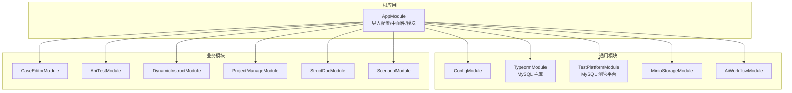
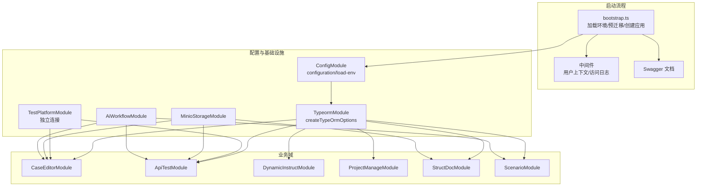
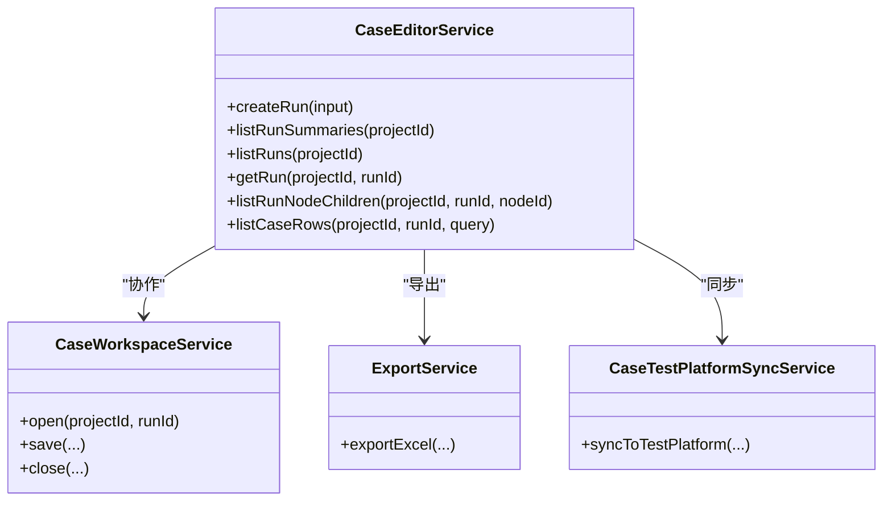
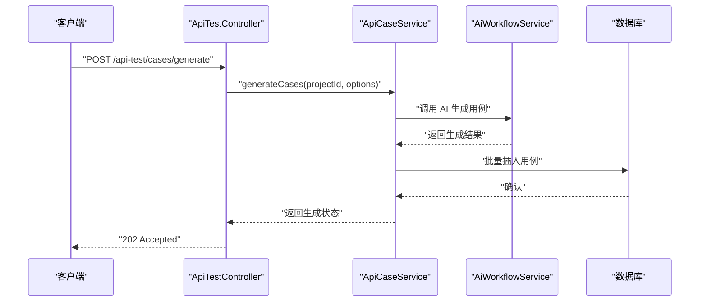
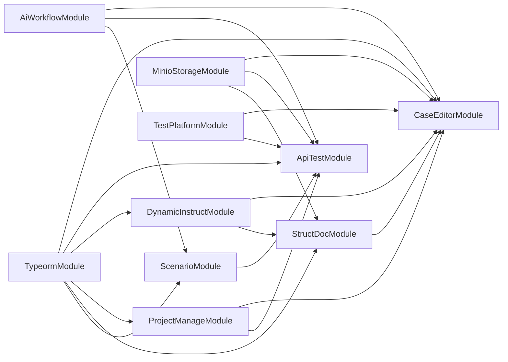
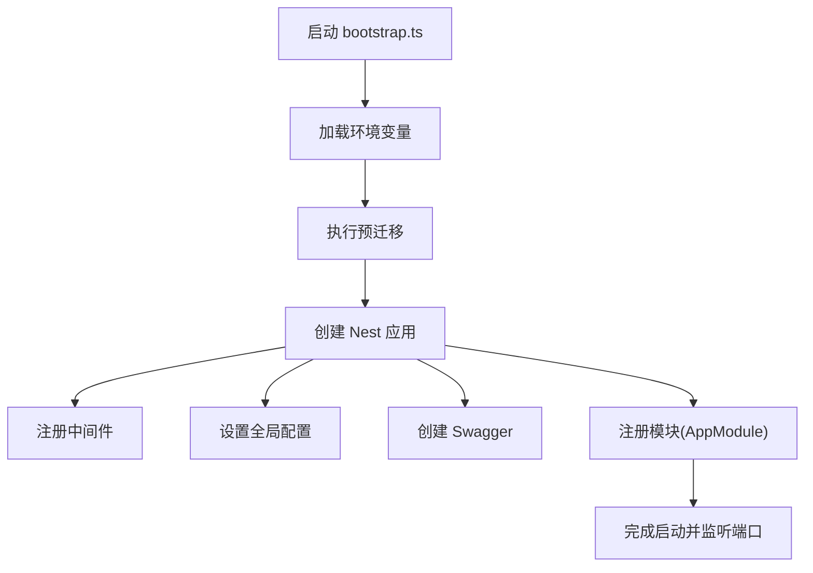

# 模块划分设计

<cite>
**本文引用的文件**
- [apps/api/src/app.module.ts](file://apps/api/src/app.module.ts)
- [apps/api/src/bootstrap.ts](file://apps/api/src/bootstrap.ts)
- [apps/api/src/common/typeorm/typeorm.config.ts](file://apps/api/src/common/typeorm/typeorm.config.ts)
- [apps/api/src/common/test-platform/test-platform.typeorm.config.ts](file://apps/api/src/common/test-platform/test-platform.typeorm.config.ts)
- [apps/api/src/common/ai-workflow/index.ts](file://apps/api/src/common/ai-workflow/index.ts)
- [apps/api/src/common/minio/index.ts](file://apps/api/src/common/minio/index.ts)
- [apps/api/src/modules/case-editor/index.ts](file://apps/api/src/modules/case-editor/index.ts)
- [apps/api/src/modules/api-test/index.ts](file://apps/api/src/modules/api-test/index.ts)
- [apps/api/src/modules/dynamic-instruct/index.ts](file://apps/api/src/modules/dynamic-instruct/index.ts)
- [apps/api/src/modules/project-manage/index.ts](file://apps/api/src/modules/project-manage/index.ts)
- [apps/api/src/modules/struct-doc/index.ts](file://apps/api/src/modules/struct-doc/index.ts)
- [apps/api/src/modules/scenario/index.ts](file://apps/api/src/modules/scenario/index.ts)
- [apps/api/src/modules/case-editor/service/case-editor.service.ts](file://apps/api/src/modules/case-editor/service/case-editor.service.ts)
- [apps/api/src/modules/api-test/service/api-case.service.ts](file://apps/api/src/modules/api-test/service/api-case.service.ts)
</cite>

## 目录
1. [引言](#引言)
2. [项目结构](#项目结构)
3. [核心组件](#核心组件)
4. [架构总览](#架构总览)
5. [详细组件分析](#详细组件分析)
6. [依赖分析](#依赖分析)
7. [性能考虑](#性能考虑)
8. [故障排查指南](#故障排查指南)
9. [结论](#结论)
10. [附录](#附录)

## 引言
本设计文档围绕 CaseForge 的模块化架构展开，系统性阐述六大业务模块（案例编辑器、API 测试、动态指令、项目管理、场景、结构化文档）的功能定位、职责边界、模块间依赖与交互模式，并总结模块化带来的代码复用、团队协作与可维护性优势。同时给出模块生命周期与初始化流程、模块注册、配置与启动顺序的详细说明，帮助开发者快速理解与扩展系统。

## 项目结构
CaseForge 采用 NestJS 单体应用 + 多模块组织方式，根模块集中导入各业务模块与通用基础设施模块，形成清晰的分层与边界：
- 根模块：聚合配置、中间件、数据库、对象存储、AI 工作流、测管平台对接与六大业务模块
- 业务模块：按领域拆分，每个模块自包含实体、DTO、Service、Controller 与工具
- 通用模块：TypeORM、MinIO、AI 工作流、测管平台等跨模块共享能力

图表来源
- [apps/api/src/app.module.ts:21-39](file://apps/api/src/app.module.ts#L21-L39)

章节来源
- [apps/api/src/app.module.ts:1-48](file://apps/api/src/app.module.ts#L1-L48)
- [apps/api/src/bootstrap.ts:18-61](file://apps/api/src/bootstrap.ts#L18-L61)

## 核心组件
- 根模块（AppModule）
  - 负责导入配置模块、TypeORM、测管平台模块、MinIO、AI 工作流以及六大业务模块
  - 注册审计与访问日志中间件，统一处理用户上下文与访问日志
- 通用模块
  - TypeORM：主库连接配置与实体扫描
  - 测管平台：独立 MySQL 连接与实体映射
  - MinIO：对象存储配置与服务
  - AI 工作流：AI 配置与工作流服务
- 业务模块
  - 案例编辑器：案例树持久化、生成运行、工作区、导出与同步
  - API 测试：用例、环境、执行集、报告与事务管理
  - 动态指令：测试点指令与提示词管理
  - 项目管理：项目实体与相关服务
  - 结构化文档：文档解析、测试点抽取与队列处理
  - 场景：场景与提示词维护

章节来源
- [apps/api/src/app.module.ts:10-19](file://apps/api/src/app.module.ts#L10-L19)
- [apps/api/src/common/typeorm/typeorm.config.ts:15-42](file://apps/api/src/common/typeorm/typeorm.config.ts#L15-L42)
- [apps/api/src/common/test-platform/test-platform.typeorm.config.ts:11-30](file://apps/api/src/common/test-platform/test-platform.typeorm.config.ts#L11-L30)
- [apps/api/src/common/minio/index.ts:9-17](file://apps/api/src/common/minio/index.ts#L9-L17)
- [apps/api/src/common/ai-workflow/index.ts:12-20](file://apps/api/src/common/ai-workflow/index.ts#L12-L20)

## 架构总览
模块化架构通过“根模块聚合 + 业务模块自治 + 通用模块复用”的方式实现高内聚低耦合。模块间通过实体依赖与服务导出来建立松耦合的协作关系，避免循环依赖并提升可测试性与可替换性。

图表来源
- [apps/api/src/bootstrap.ts:18-61](file://apps/api/src/bootstrap.ts#L18-L61)
- [apps/api/src/common/typeorm/typeorm.config.ts:38-42](file://apps/api/src/common/typeorm/typeorm.config.ts#L38-L42)
- [apps/api/src/common/test-platform/test-platform.typeorm.config.ts:11-30](file://apps/api/src/common/test-platform/test-platform.typeorm.config.ts#L11-L30)
- [apps/api/src/app.module.ts:21-39](file://apps/api/src/app.module.ts#L21-L39)

## 详细组件分析

### 案例编辑器模块（CaseEditorModule）
- 功能定位
  - 提供案例树的创建、查询、更新与懒加载子节点
  - 支持生成运行记录、工作区管理、导出与测试平台同步
- 职责边界
  - 案例树持久化与 Diff 合并
  - 生成作业与队列调度
  - 与项目管理、结构化文档、动态指令、测管平台的集成
- 关键服务
  - 案例编辑服务：运行记录创建、树加载与分页查询
  - 工作区服务：工作区状态与变更
  - 导出服务：案例数据导出
  - 同步服务：与测管平台的数据同步
- 依赖关系
  - TypeORM 实体：案例、树、节点元数据、生成作业
  - 项目管理、结构化文档、动态指令、测管平台实体
  - MinIO、AI 工作流、测管平台模块

图表来源
- [apps/api/src/modules/case-editor/service/case-editor.service.ts:68-200](file://apps/api/src/modules/case-editor/service/case-editor.service.ts#L68-L200)
- [apps/api/src/modules/case-editor/index.ts:14-57](file://apps/api/src/modules/case-editor/index.ts#L14-L57)

章节来源
- [apps/api/src/modules/case-editor/index.ts:1-60](file://apps/api/src/modules/case-editor/index.ts#L1-L60)
- [apps/api/src/modules/case-editor/service/case-editor.service.ts:1-200](file://apps/api/src/modules/case-editor/service/case-editor.service.ts#L1-L200)

### API 测试模块（ApiTestModule）
- 功能定位
  - 维护 API 文档、端点、用例、环境、执行集、执行记录与事务
  - 支持用例生成队列与 AI 辅助生成
- 职责边界
  - 用例 CRUD、分页与校验
  - 执行集与执行记录管理
  - 报告与事务服务
- 关键服务
  - 用例服务：列表、创建、更新、删除、AI 生成
  - 环境服务：环境与服务实体管理
  - 执行服务：执行集与执行项
  - 报告服务：执行结果汇总
- 依赖关系
  - TypeORM 实体：用例、端点、文档、环境、执行集、执行记录、事务
  - 项目管理、场景模块实体
  - MinIO、AI 工作流

图表来源
- [apps/api/src/modules/api-test/service/api-case.service.ts:196-200](file://apps/api/src/modules/api-test/service/api-case.service.ts#L196-L200)
- [apps/api/src/common/ai-workflow/index.ts:12-20](file://apps/api/src/common/ai-workflow/index.ts#L12-L20)

章节来源
- [apps/api/src/modules/api-test/index.ts:1-70](file://apps/api/src/modules/api-test/index.ts#L1-L70)
- [apps/api/src/modules/api-test/service/api-case.service.ts:1-200](file://apps/api/src/modules/api-test/service/api-case.service.ts#L1-L200)

### 动态指令模块（DynamicInstructModule）
- 功能定位
  - 管理测试点指令与提示词，支撑案例生成与执行
- 职责边界
  - 测试点指令与提示词的增删改查
  - 与结构化文档、场景模块的联动
- 依赖关系
  - TypeORM 实体：测试点指令、提示词、测试点、场景提示词、项目

章节来源
- [apps/api/src/modules/dynamic-instruct/index.ts:1-30](file://apps/api/src/modules/dynamic-instruct/index.ts#L1-L30)

### 项目管理模块（ProjectManageModule）
- 功能定位
  - 项目实体与相关服务，作为多个模块的共同依赖
- 职责边界
  - 项目 CRUD 与范围控制
- 依赖关系
  - TypeORM 实体：项目、案例、结构化文档、测试点、树与节点元数据

章节来源
- [apps/api/src/modules/project-manage/index.ts:1-32](file://apps/api/src/modules/project-manage/index.ts#L1-L32)

### 结构化文档模块（StructDocModule）
- 功能定位
  - 文档上传、解析、测试点抽取与需求结构化处理
- 职责边界
  - 文档实体与测试点实体管理
  - 需求结构化队列与并发控制
- 依赖关系
  - MinIO、AI 工作流、项目管理、动态指令

章节来源
- [apps/api/src/modules/struct-doc/index.ts:1-34](file://apps/api/src/modules/struct-doc/index.ts#L1-L34)

### 场景模块（ScenarioModule）
- 功能定位
  - 场景与提示词维护，支撑 AI 生成与用例模板
- 职责边界
  - 场景实体与提示词实体管理
- 依赖关系
  - TypeORM 实体：场景、提示词

章节来源
- [apps/api/src/modules/scenario/index.ts:1-20](file://apps/api/src/modules/scenario/index.ts#L1-L20)

## 依赖分析
- 模块内聚与解耦
  - 各模块内部以实体、DTO、Service、Controller 为单元，职责单一
  - 通过 exports 显式暴露服务，避免隐式耦合
- 跨模块依赖
  - 案例编辑器依赖项目管理、结构化文档、动态指令、测管平台
  - API 测试依赖场景、项目管理、MinIO、AI 工作流
  - 共享基础设施（TypeORM、MinIO、AI 工作流、测管平台）在根模块集中导入
- 循环依赖规避
  - 使用 forwardRef 与延迟注入处理潜在循环
  - 通过实体依赖而非直接 import 服务降低耦合

图表来源
- [apps/api/src/app.module.ts:32-37](file://apps/api/src/app.module.ts#L32-L37)
- [apps/api/src/modules/case-editor/index.ts:21-27](file://apps/api/src/modules/case-editor/index.ts#L21-L27)
- [apps/api/src/modules/api-test/index.ts:3-44](file://apps/api/src/modules/api-test/index.ts#L3-L44)
- [apps/api/src/modules/dynamic-instruct/index.ts:10-12](file://apps/api/src/modules/dynamic-instruct/index.ts#L10-L12)
- [apps/api/src/modules/struct-doc/index.ts:13-15](file://apps/api/src/modules/struct-doc/index.ts#L13-L15)
- [apps/api/src/modules/scenario/index.ts:5-10](file://apps/api/src/modules/scenario/index.ts#L5-L10)

## 性能考虑
- 数据库连接与实体扫描
  - 主库与测管平台库分离，避免锁竞争与长事务影响
  - TypeORM 自动扫描实体，开发环境允许同步，生产关闭同步
- 并发与队列
  - 案例生成与结构化需求处理采用队列与并发控制，避免阻塞
- 存储与网络
  - 文档与附件通过 MinIO 存储，结合分片与压缩策略优化传输
- 中间件与版本控制
  - 全局验证管道与 URI 版本控制减少无效请求与路由开销

章节来源
- [apps/api/src/common/typeorm/typeorm.config.ts:26-31](file://apps/api/src/common/typeorm/typeorm.config.ts#L26-L31)
- [apps/api/src/common/test-platform/test-platform.typeorm.config.ts:22-29](file://apps/api/src/common/test-platform/test-platform.typeorm.config.ts#L22-L29)
- [apps/api/src/bootstrap.ts:42-48](file://apps/api/src/bootstrap.ts#L42-L48)

## 故障排查指南
- 启动阶段
  - 环境变量缺失或格式错误：检查环境加载与配置提供者
  - Schema 预迁移失败：确认数据库连通性与权限
- 运行阶段
  - 类型转换与白名单：全局验证管道会拒绝非白名单字段
  - 用户作用域：确保请求上下文与作用域过滤条件一致
- 模块依赖
  - 实体找不到：确认 TypeORM 实体路径与扫描规则
  - 服务注入失败：检查 forwardRef 与导出声明

章节来源
- [apps/api/src/bootstrap.ts:9-19](file://apps/api/src/bootstrap.ts#L9-L19)
- [apps/api/src/bootstrap.ts:42-48](file://apps/api/src/bootstrap.ts#L42-L48)
- [apps/api/src/common/typeorm/typeorm.config.ts:28-31](file://apps/api/src/common/typeorm/typeorm.config.ts#L28-L31)

## 结论
通过模块化设计，CaseForge 实现了业务域的清晰边界与通用能力的复用，提升了团队协作效率与系统可维护性。根模块集中治理配置与基础设施，六大业务模块在各自领域内自治演进，配合通用模块（TypeORM、MinIO、AI 工作流、测管平台）形成稳定的技术底座。建议在新增模块时遵循现有模式：明确职责边界、最小化对外依赖、显式导出服务、严格实体与 DTO 规范，并在根模块中有序注册与初始化。

## 附录

### 模块生命周期与初始化流程
- 启动入口
  - 加载环境变量与预迁移
  - 创建 Nest 应用实例，设置 CORS、全局前缀、URI 版本控制
  - 注册用户上下文与访问日志中间件
  - 全局验证管道启用
  - 生成并挂载 Swagger 文档
  - 监听端口并输出服务地址
- 初始化顺序
  - 配置模块 → TypeORM 模块 → 测管平台模块 → MinIO 模块 → AI 工作流模块
  - 业务模块（按依赖顺序）→ 根模块完成装配

图表来源
- [apps/api/src/bootstrap.ts:18-61](file://apps/api/src/bootstrap.ts#L18-L61)
- [apps/api/src/app.module.ts:21-46](file://apps/api/src/app.module.ts#L21-L46)

### 模块注册、配置与启动顺序说明
- 模块注册
  - 根模块集中导入六大业务模块与通用模块
  - 业务模块内部通过 TypeOrmModule.forFeature 注册实体
- 配置
  - TypeORM：根据环境选择同步策略，扫描实体路径
  - 测管平台：独立连接与实体集合
  - MinIO：配置提供者与存储服务导出
  - AI 工作流：配置提供者与服务导出
- 启动顺序
  - 配置与基础设施先行，随后业务模块按依赖装配，最后中间件与文档生效

章节来源
- [apps/api/src/app.module.ts:21-39](file://apps/api/src/app.module.ts#L21-L39)
- [apps/api/src/common/typeorm/typeorm.config.ts:15-42](file://apps/api/src/common/typeorm/typeorm.config.ts#L15-L42)
- [apps/api/src/common/test-platform/test-platform.typeorm.config.ts:11-30](file://apps/api/src/common/test-platform/test-platform.typeorm.config.ts#L11-L30)
- [apps/api/src/common/minio/index.ts:9-17](file://apps/api/src/common/minio/index.ts#L9-L17)
- [apps/api/src/common/ai-workflow/index.ts:12-20](file://apps/api/src/common/ai-workflow/index.ts#L12-L20)