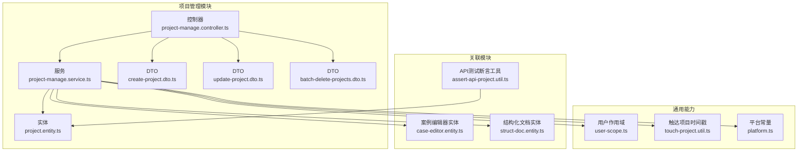
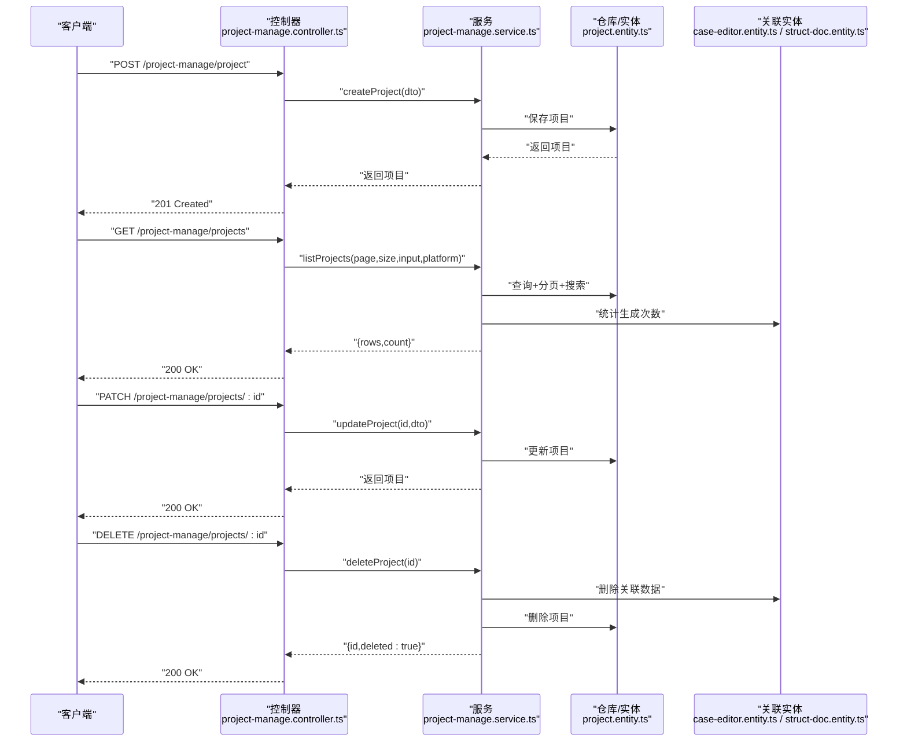
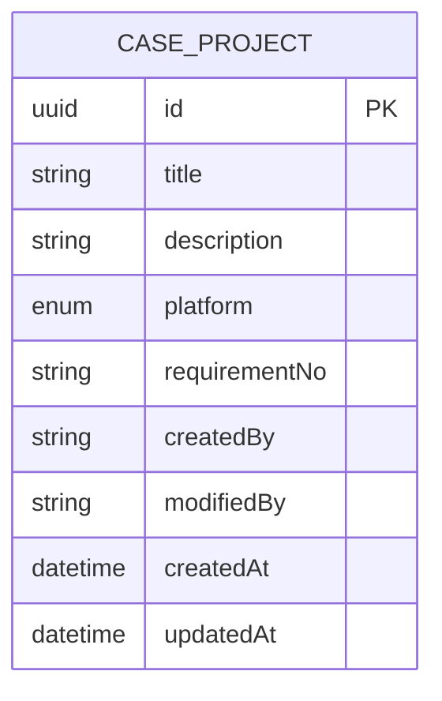
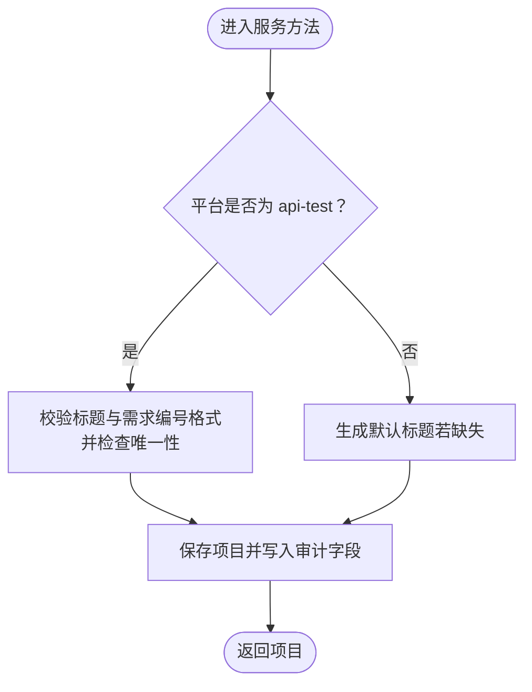
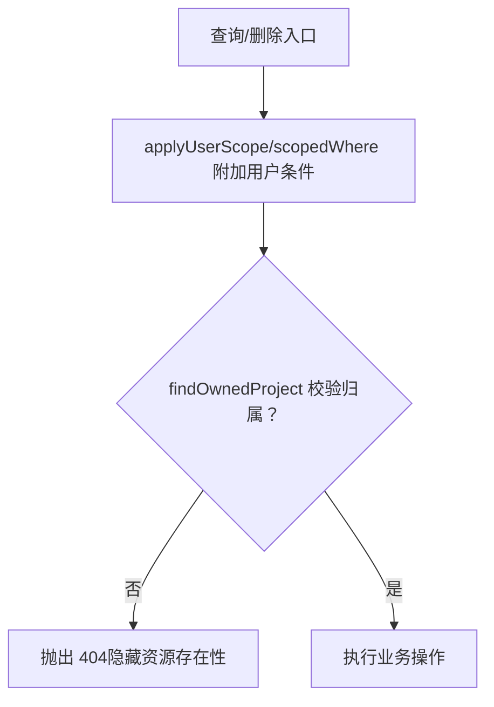
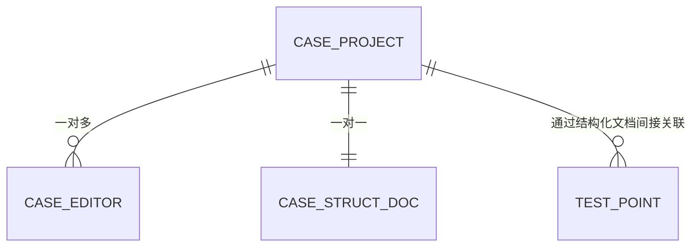
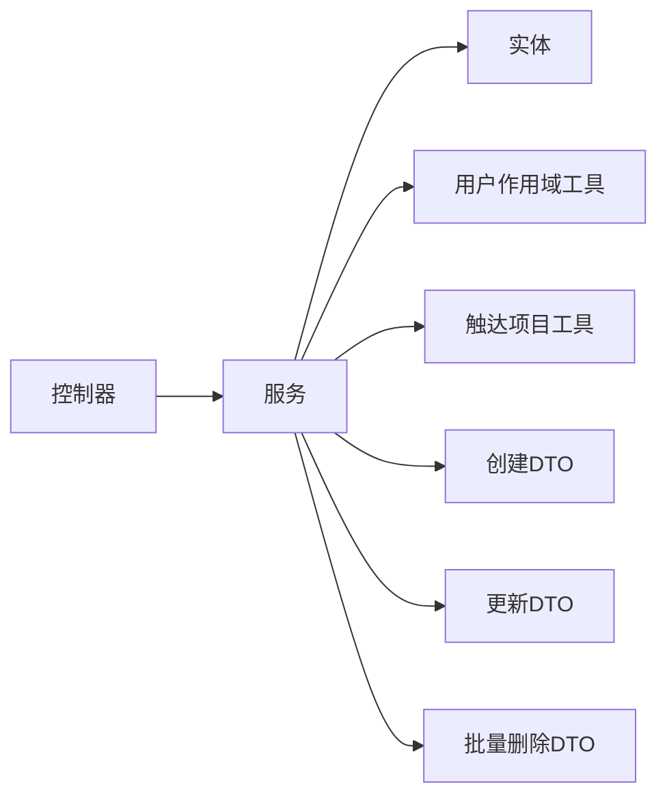
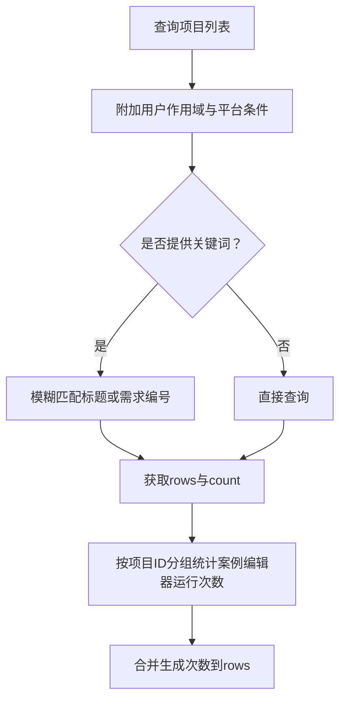

# 项目管理模块

<cite>
**本文引用的文件**
- [apps/api/src/modules/project-manage/entity/project.entity.ts](file://apps/api/src/modules/project-manage/entity/project.entity.ts)
- [apps/api/src/modules/project-manage/service/project-manage.service.ts](file://apps/api/src/modules/project-manage/service/project-manage.service.ts)
- [apps/api/src/modules/project-manage/controller/project-manage.controller.ts](file://apps/api/src/modules/project-manage/controller/project-manage.controller.ts)
- [apps/api/src/modules/project-manage/dto/create-project.dto.ts](file://apps/api/src/modules/project-manage/dto/create-project.dto.ts)
- [apps/api/src/modules/project-manage/dto/update-project.dto.ts](file://apps/api/src/modules/project-manage/dto/update-project.dto.ts)
- [apps/api/src/modules/project-manage/dto/batch-delete-projects.dto.ts](file://apps/api/src/modules/project-manage/dto/batch-delete-projects.dto.ts)
- [apps/api/src/common/audit/user-scope.ts](file://apps/api/src/common/audit/user-scope.ts)
- [apps/api/src/common/project/touch-project.util.ts](file://apps/api/src/common/project/touch-project.util.ts)
- [apps/api/src/modules/case-editor/entity/case-editor.entity.ts](file://apps/api/src/modules/case-editor/entity/case-editor.entity.ts)
- [apps/api/src/modules/struct-doc/entity/struct-doc.entity.ts](file://apps/api/src/modules/struct-doc/entity/struct-doc.entity.ts)
- [packages/shared/src/platform.ts](file://packages/shared/src/platform.ts)
- [apps/api/src/modules/api-test/util/assert-api-project.util.ts](file://apps/api/src/modules/api-test/util/assert-api-project.util.ts)
</cite>

## 目录
1. [简介](#简介)
2. [项目结构](#项目结构)
3. [核心组件](#核心组件)
4. [架构总览](#架构总览)
5. [详细组件分析](#详细组件分析)
6. [依赖分析](#依赖分析)
7. [性能考虑](#性能考虑)
8. [故障排查指南](#故障排查指南)
9. [结论](#结论)
10. [附录](#附录)

## 简介
本文件为“项目管理模块”的完整功能文档，覆盖项目实体设计、CRUD 实现、权限控制、与案例编辑器、结构化文档、动态指令、API 测试等模块的关联关系，以及完整的 API 参考与使用示例。项目管理模块通过“平台”维度区分不同业务域（案例生成与接口测试），并通过审计字段与用户作用域实现数据隔离与一致性。

## 项目结构
项目管理模块采用典型的分层架构：控制器负责 HTTP 接口，服务层封装业务逻辑，实体层映射数据库表。同时通过共享平台常量与通用审计工具实现跨模块的一致性。

图表来源
- [apps/api/src/modules/project-manage/controller/project-manage.controller.ts:1-138](file://apps/api/src/modules/project-manage/controller/project-manage.controller.ts#L1-L138)
- [apps/api/src/modules/project-manage/service/project-manage.service.ts:1-313](file://apps/api/src/modules/project-manage/service/project-manage.service.ts#L1-L313)
- [apps/api/src/modules/project-manage/entity/project.entity.ts:1-59](file://apps/api/src/modules/project-manage/entity/project.entity.ts#L1-L59)
- [apps/api/src/common/audit/user-scope.ts:1-90](file://apps/api/src/common/audit/user-scope.ts#L1-L90)
- [apps/api/src/common/project/touch-project.util.ts:1-18](file://apps/api/src/common/project/touch-project.util.ts#L1-L18)
- [apps/api/src/modules/case-editor/entity/case-editor.entity.ts:1-103](file://apps/api/src/modules/case-editor/entity/case-editor.entity.ts#L1-L103)
- [apps/api/src/modules/struct-doc/entity/struct-doc.entity.ts:1-105](file://apps/api/src/modules/struct-doc/entity/struct-doc.entity.ts#L1-L105)
- [packages/shared/src/platform.ts:1-3](file://packages/shared/src/platform.ts#L1-L3)
- [apps/api/src/modules/api-test/util/assert-api-project.util.ts:1-15](file://apps/api/src/modules/api-test/util/assert-api-project.util.ts#L1-L15)

章节来源
- [apps/api/src/modules/project-manage/controller/project-manage.controller.ts:1-138](file://apps/api/src/modules/project-manage/controller/project-manage.controller.ts#L1-L138)
- [apps/api/src/modules/project-manage/service/project-manage.service.ts:1-313](file://apps/api/src/modules/project-manage/service/project-manage.service.ts#L1-L313)
- [apps/api/src/modules/project-manage/entity/project.entity.ts:1-59](file://apps/api/src/modules/project-manage/entity/project.entity.ts#L1-L59)
- [apps/api/src/common/audit/user-scope.ts:1-90](file://apps/api/src/common/audit/user-scope.ts#L1-L90)
- [packages/shared/src/platform.ts:1-3](file://packages/shared/src/platform.ts#L1-L3)

## 核心组件
- 项目实体：定义项目的基本信息、平台、审计字段与索引，支撑跨模块隔离与检索。
- 项目服务：实现创建、查询、更新、删除、批量删除、关联清理与生成次数统计。
- 项目控制器：暴露 REST API，统一参数校验与返回结构。
- DTO：对请求载荷进行验证与约束。
- 审计与作用域：通过 createdBy 字段与用户作用域实现数据隔离与安全访问。
- 平台常量：统一平台枚举，确保跨模块一致。

章节来源
- [apps/api/src/modules/project-manage/entity/project.entity.ts:1-59](file://apps/api/src/modules/project-manage/entity/project.entity.ts#L1-L59)
- [apps/api/src/modules/project-manage/service/project-manage.service.ts:1-313](file://apps/api/src/modules/project-manage/service/project-manage.service.ts#L1-L313)
- [apps/api/src/modules/project-manage/controller/project-manage.controller.ts:1-138](file://apps/api/src/modules/project-manage/controller/project-manage.controller.ts#L1-L138)
- [apps/api/src/modules/project-manage/dto/create-project.dto.ts:1-33](file://apps/api/src/modules/project-manage/dto/create-project.dto.ts#L1-L33)
- [apps/api/src/modules/project-manage/dto/update-project.dto.ts:1-27](file://apps/api/src/modules/project-manage/dto/update-project.dto.ts#L1-L27)
- [apps/api/src/modules/project-manage/dto/batch-delete-projects.dto.ts:1-15](file://apps/api/src/modules/project-manage/dto/batch-delete-projects.dto.ts#L1-L15)
- [apps/api/src/common/audit/user-scope.ts:1-90](file://apps/api/src/common/audit/user-scope.ts#L1-L90)
- [packages/shared/src/platform.ts:1-3](file://packages/shared/src/platform.ts#L1-L3)

## 架构总览
项目管理模块围绕“项目”这一核心实体，通过服务层协调与多个子模块交互，形成清晰的职责边界与数据流。

图表来源
- [apps/api/src/modules/project-manage/controller/project-manage.controller.ts:31-136](file://apps/api/src/modules/project-manage/controller/project-manage.controller.ts#L31-L136)
- [apps/api/src/modules/project-manage/service/project-manage.service.ts:59-312](file://apps/api/src/modules/project-manage/service/project-manage.service.ts#L59-L312)
- [apps/api/src/modules/case-editor/entity/case-editor.entity.ts:32-103](file://apps/api/src/modules/case-editor/entity/case-editor.entity.ts#L32-L103)
- [apps/api/src/modules/struct-doc/entity/struct-doc.entity.ts:31-105](file://apps/api/src/modules/struct-doc/entity/struct-doc.entity.ts#L31-L105)

## 详细组件分析

### 项目实体与属性定义
- 标识与基础信息：UUID 主键、标题、描述、需求编号（可选）。
- 平台字段：枚举值限定为“case-forge”或“api-test”，用于业务域隔离。
- 审计字段：createdBy、modifiedBy 默认“system”，createdAt、updatedAt 自动维护。
- 索引：针对平台+更新时间、创建人+平台+更新时间、平台+需求编号建立复合索引，优化查询与检索。

图表来源
- [apps/api/src/modules/project-manage/entity/project.entity.ts:27-58](file://apps/api/src/modules/project-manage/entity/project.entity.ts#L27-L58)

章节来源
- [apps/api/src/modules/project-manage/entity/project.entity.ts:1-59](file://apps/api/src/modules/project-manage/entity/project.entity.ts#L1-L59)

### 项目CRUD实现细节
- 创建项目
  - 若平台为“api-test”，要求提供标题与规范格式的需求编号；否则自动生成默认标题。
  - 对需求编号进行标准化与格式校验，并检查唯一性。
  - 写入审计字段（创建人、创建时间）。
- 查询项目
  - 支持分页、关键词模糊匹配（标题或需求编号）、按平台过滤。
  - 应用用户作用域，仅返回当前用户可见的项目。
  - 统计每个项目的案例生成次数（来自案例编辑器运行记录）。
- 更新项目
  - “api-test”平台：标题与需求编号必填且校验；需求编号唯一性校验排除自身。
  - 其他平台：标题与需求编号可选更新。
- 删除项目
  - 事务内删除：先清理关联的案例编辑器与结构化文档记录，再删除项目本身。
  - 支持单个与批量删除，批量删除忽略不存在的 ID。

图表来源
- [apps/api/src/modules/project-manage/service/project-manage.service.ts:59-93](file://apps/api/src/modules/project-manage/service/project-manage.service.ts#L59-L93)
- [apps/api/src/modules/project-manage/service/project-manage.service.ts:173-212](file://apps/api/src/modules/project-manage/service/project-manage.service.ts#L173-L212)

章节来源
- [apps/api/src/modules/project-manage/service/project-manage.service.ts:59-312](file://apps/api/src/modules/project-manage/service/project-manage.service.ts#L59-L312)

### 权限控制系统与数据隔离
- 用户作用域
  - 查询与删除均通过 scopedWhere 或 applyUserScope 限制 createdBy 为当前用户。
  - findOwnedProject 在读取详情时校验资源归属，避免越权与信息泄露。
- 可见性规则
  - assertAccessible 支持“本人或系统预置资源”可见。
- 平台隔离
  - 通过 platform 字段与查询条件限制，确保不同平台数据互不干扰。
- 审计字段
  - createdBy/modifiedBy 默认“system”，便于系统初始化与预置数据识别。

图表来源
- [apps/api/src/common/audit/user-scope.ts:39-89](file://apps/api/src/common/audit/user-scope.ts#L39-L89)
- [apps/api/src/modules/project-manage/service/project-manage.service.ts:120-128](file://apps/api/src/modules/project-manage/service/project-manage.service.ts#L120-L128)

章节来源
- [apps/api/src/common/audit/user-scope.ts:1-90](file://apps/api/src/common/audit/user-scope.ts#L1-L90)
- [apps/api/src/modules/project-manage/service/project-manage.service.ts:96-102](file://apps/api/src/modules/project-manage/service/project-manage.service.ts#L96-L102)

### 项目与其它模块的关联关系
- 案例编辑器
  - 项目与案例编辑器运行记录是一对多关系；删除项目时级联清理。
  - 生成次数统计来源于案例编辑器运行记录的分组计数。
- 结构化文档
  - 项目与结构化文档是一对一关系（唯一索引约束）；删除项目时级联清理。
- 动态指令与测试要点
  - 动态指令模块通过项目实体与测试要点进行关联，项目更新会触达时间戳以提升侧边栏排序体验。
- API测试
  - 断言工具用于校验项目是否属于“api-test”平台，确保操作范围正确。

图表来源
- [apps/api/src/modules/case-editor/entity/case-editor.entity.ts:32-103](file://apps/api/src/modules/case-editor/entity/case-editor.entity.ts#L32-L103)
- [apps/api/src/modules/struct-doc/entity/struct-doc.entity.ts:31-105](file://apps/api/src/modules/struct-doc/entity/struct-doc.entity.ts#L31-L105)

章节来源
- [apps/api/src/modules/case-editor/entity/case-editor.entity.ts:1-103](file://apps/api/src/modules/case-editor/entity/case-editor.entity.ts#L1-L103)
- [apps/api/src/modules/struct-doc/entity/struct-doc.entity.ts:1-105](file://apps/api/src/modules/struct-doc/entity/struct-doc.entity.ts#L1-L105)
- [apps/api/src/common/project/touch-project.util.ts:1-18](file://apps/api/src/common/project/touch-project.util.ts#L1-L18)
- [apps/api/src/modules/api-test/util/assert-api-project.util.ts:1-15](file://apps/api/src/modules/api-test/util/assert-api-project.util.ts#L1-L15)

### API参考（HTTP接口）
- 创建项目
  - 方法与路径：POST /project-manage/project
  - 请求体：CreateProjectDto（标题、描述、需求编号、平台）
  - 返回：项目对象（公开字段）
- 获取侧边栏项目列表
  - 方法与路径：GET /project-manage/projects/sidebar
  - 查询参数：platform、page、size、input
  - 返回：rows（含生成次数）、count
- 获取项目列表
  - 方法与路径：GET /project-manage/projects
  - 查询参数：input、page、size、platform
  - 返回：rows（公开字段）、count
- 获取项目详情
  - 方法与路径：GET /project-manage/projects/{projectId}
  - 返回：项目对象（含生成次数）
- 更新项目
  - 方法与路径：PATCH /project-manage/projects/{projectId}
  - 请求体：UpdateProjectDto（标题、描述、需求编号）
  - 返回：项目对象
- 删除项目
  - 方法与路径：DELETE /project-manage/projects/{projectId}
  - 返回：{id, deleted: true}
- 批量删除项目
  - 方法与路径：POST /project-manage/projects/batch-delete
  - 请求体：BatchDeleteProjectsDto（ids数组）
  - 返回：{ids, deleted: true}

章节来源
- [apps/api/src/modules/project-manage/controller/project-manage.controller.ts:31-136](file://apps/api/src/modules/project-manage/controller/project-manage.controller.ts#L31-L136)
- [apps/api/src/modules/project-manage/dto/create-project.dto.ts:1-33](file://apps/api/src/modules/project-manage/dto/create-project.dto.ts#L1-L33)
- [apps/api/src/modules/project-manage/dto/update-project.dto.ts:1-27](file://apps/api/src/modules/project-manage/dto/update-project.dto.ts#L1-L27)
- [apps/api/src/modules/project-manage/dto/batch-delete-projects.dto.ts:1-15](file://apps/api/src/modules/project-manage/dto/batch-delete-projects.dto.ts#L1-L15)

### 使用示例
- 创建项目（案例生成平台）
  - 调用 POST /project-manage/project，传入标题与可选描述；若未提供标题，服务将生成默认标题。
- 创建项目（接口测试平台）
  - 调用 POST /project-manage/project，设置 platform 为 "api-test"，并提供标题与规范格式的需求编号。
- 查询项目列表
  - GET /project-manage/projects?platform=case-forge&page=1&size=15&input=关键字
- 获取项目详情
  - GET /project-manage/projects/{projectId}
- 更新项目
  - PATCH /project-manage/projects/{projectId}，传入需要更新的字段。
- 删除项目
  - DELETE /project-manage/projects/{projectId}
- 批量删除
  - POST /project-manage/projects/batch-delete，传入项目ID数组。

章节来源
- [apps/api/src/modules/project-manage/controller/project-manage.controller.ts:31-136](file://apps/api/src/modules/project-manage/controller/project-manage.controller.ts#L31-L136)
- [apps/api/src/modules/project-manage/service/project-manage.service.ts:59-93](file://apps/api/src/modules/project-manage/service/project-manage.service.ts#L59-L93)

### 数据组织与存储策略
- 表结构
  - case_project：项目主表，包含平台、标题、描述、需求编号与审计字段。
  - case_editor：案例编辑器运行记录，外键指向项目，用于统计生成次数。
  - case_struct_doc：结构化文档记录，一对一绑定项目，外键级联删除。
- 索引策略
  - 复合索引覆盖平台+更新时间、创建人+平台+更新时间、平台+需求编号，优化查询与检索。
- 事务与一致性
  - 删除项目采用数据库事务，先清理关联数据再删除主记录，保证一致性。
- 项目置顶机制
  - 通过 touchProjectUpdatedAt 更新 updatedAt，使项目在侧边栏按最近活跃排序。

章节来源
- [apps/api/src/modules/project-manage/entity/project.entity.ts:14-27](file://apps/api/src/modules/project-manage/entity/project.entity.ts#L14-L27)
- [apps/api/src/modules/case-editor/entity/case-editor.entity.ts:32-103](file://apps/api/src/modules/case-editor/entity/case-editor.entity.ts#L32-L103)
- [apps/api/src/modules/struct-doc/entity/struct-doc.entity.ts:31-105](file://apps/api/src/modules/struct-doc/entity/struct-doc.entity.ts#L31-L105)
- [apps/api/src/common/project/touch-project.util.ts:1-18](file://apps/api/src/common/project/touch-project.util.ts#L1-L18)
- [apps/api/src/modules/project-manage/service/project-manage.service.ts:241-253](file://apps/api/src/modules/project-manage/service/project-manage.service.ts#L241-L253)

## 依赖分析
- 模块内聚与耦合
  - 控制器仅负责参数解析与调用服务，服务聚合业务逻辑，降低控制器复杂度。
  - 服务依赖实体与通用审计工具，避免重复逻辑。
- 外部依赖
  - NestJS 注解与 Swagger 提供接口文档与参数校验。
  - TypeORM 提供仓储与事务支持。
- 循环依赖
  - 项目管理模块与案例编辑器模块通过实体引用，但无循环导入；动态指令模块通过工具函数触达项目时间戳，保持低耦合。

图表来源
- [apps/api/src/modules/project-manage/controller/project-manage.controller.ts:1-138](file://apps/api/src/modules/project-manage/controller/project-manage.controller.ts#L1-L138)
- [apps/api/src/modules/project-manage/service/project-manage.service.ts:1-313](file://apps/api/src/modules/project-manage/service/project-manage.service.ts#L1-L313)
- [apps/api/src/common/audit/user-scope.ts:1-90](file://apps/api/src/common/audit/user-scope.ts#L1-L90)
- [apps/api/src/common/project/touch-project.util.ts:1-18](file://apps/api/src/common/project/touch-project.util.ts#L1-L18)

章节来源
- [apps/api/src/modules/project-manage/controller/project-manage.controller.ts:1-138](file://apps/api/src/modules/project-manage/controller/project-manage.controller.ts#L1-L138)
- [apps/api/src/modules/project-manage/service/project-manage.service.ts:1-313](file://apps/api/src/modules/project-manage/service/project-manage.service.ts#L1-L313)

## 性能考虑
- 查询优化
  - 利用复合索引加速平台过滤、时间排序与关键词检索。
  - 分页查询避免一次性加载过多数据。
- 统计聚合
  - 生成次数通过一次分组聚合查询获得，减少多次往返。
- 事务批处理
  - 批量删除在单事务内顺序执行，减少锁竞争与上下文切换。
- 缓存建议
  - 侧边栏高频访问可结合应用层缓存（如 Redis）短期缓存列表与摘要字段。

## 故障排查指南
- 参数校验异常
  - 需求编号格式不正确或为空：检查输入格式与必填字段。
  - 需求编号重复：在“api-test”平台下同一编号不可重复。
- 权限问题
  - 404 错误：可能因资源不存在或不属于当前用户；确认项目ID与平台。
- 删除失败
  - 项目不存在：确认ID有效；检查用户作用域是否正确。
  - 关联数据清理失败：检查事务日志与外键约束。

章节来源
- [apps/api/src/modules/project-manage/service/project-manage.service.ts:25-34](file://apps/api/src/modules/project-manage/service/project-manage.service.ts#L25-L34)
- [apps/api/src/common/audit/user-scope.ts:48-75](file://apps/api/src/common/audit/user-scope.ts#L48-L75)
- [apps/api/src/modules/project-manage/service/project-manage.service.ts:214-232](file://apps/api/src/modules/project-manage/service/project-manage.service.ts#L214-L232)

## 结论
项目管理模块通过清晰的实体设计、严格的权限控制与完善的CRUD流程，实现了跨模块的项目隔离与一致性保障。配合平台维度与审计字段，既能满足案例生成与接口测试两类业务场景，又能确保数据安全与性能稳定。建议在生产环境中结合缓存与监控进一步优化用户体验与可观测性。

## 附录
- 平台枚举
  - case-forge：案例生成平台
  - api-test：接口测试平台
- 关键流程图（生成次数统计）

图表来源
- [apps/api/src/modules/project-manage/service/project-manage.service.ts:110-150](file://apps/api/src/modules/project-manage/service/project-manage.service.ts#L110-L150)
- [apps/api/src/modules/project-manage/service/project-manage.service.ts:283-303](file://apps/api/src/modules/project-manage/service/project-manage.service.ts#L283-L303)