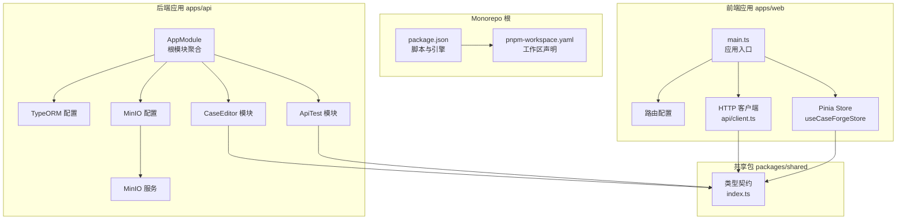
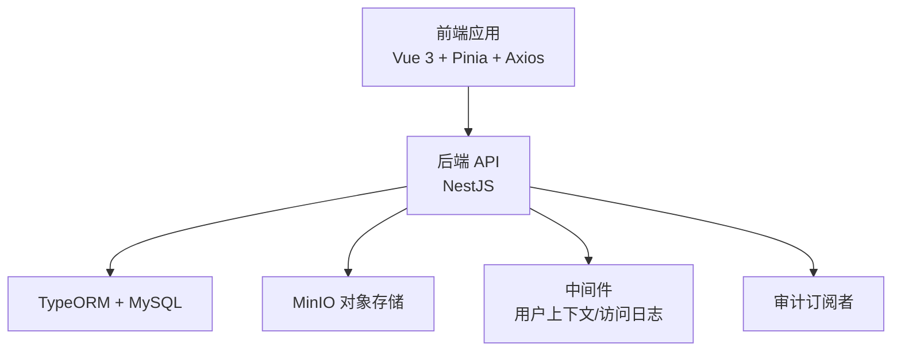
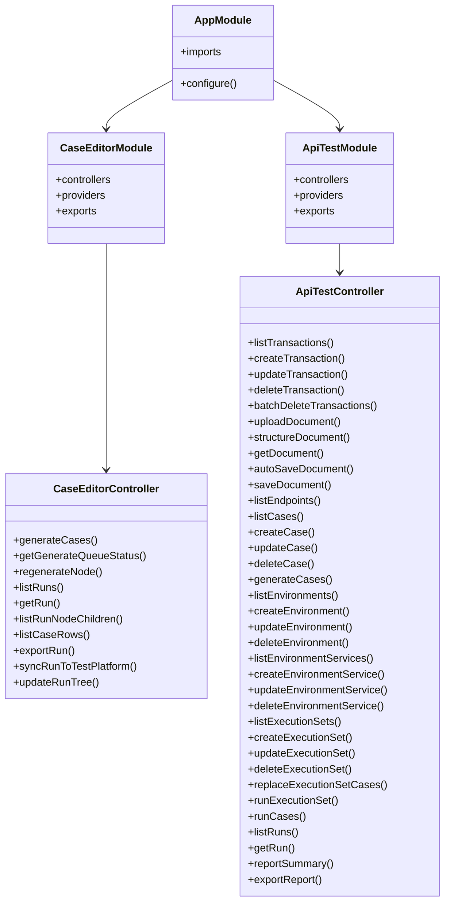
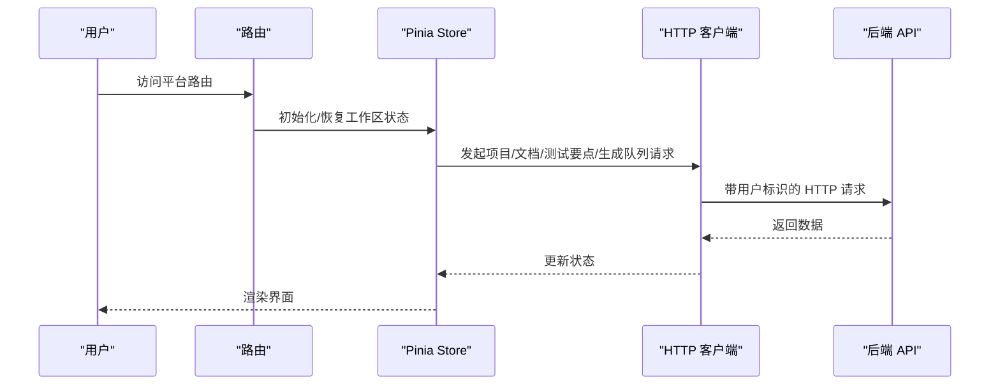
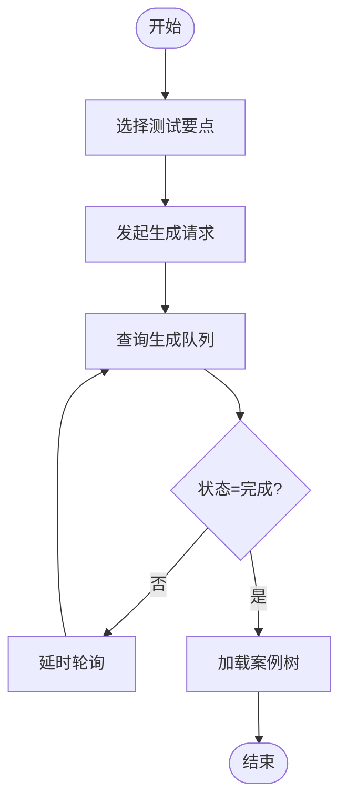
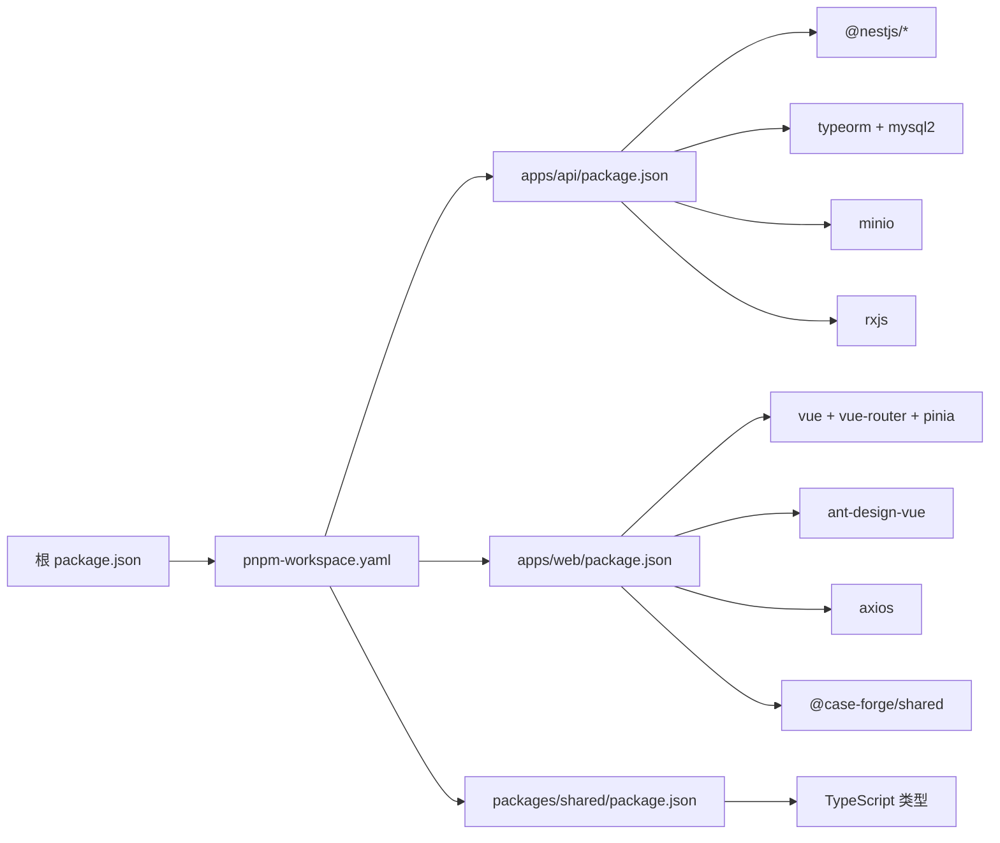

# 系统架构

<cite>
**本文引用的文件**
- [apps/api/src/app.module.ts](file://apps/api/src/app.module.ts)
- [apps/api/src/modules/case-editor/index.ts](file://apps/api/src/modules/case-editor/index.ts)
- [apps/api/src/modules/api-test/index.ts](file://apps/api/src/modules/api-test/index.ts)
- [apps/api/src/common/typeorm/typeorm.config.ts](file://apps/api/src/common/typeorm/typeorm.config.ts)
- [apps/api/src/common/minio/minio.config.ts](file://apps/api/src/common/minio/minio.config.ts)
- [apps/api/src/common/minio/service/minio.service.ts](file://apps/api/src/common/minio/service/minio.service.ts)
- [apps/api/src/modules/case-editor/controller/case-editor.controller.ts](file://apps/api/src/modules/case-editor/controller/case-editor.controller.ts)
- [apps/api/src/modules/api-test/controller/api-test.controller.ts](file://apps/api/src/modules/api-test/controller/api-test.controller.ts)
- [apps/web/src/main.ts](file://apps/web/src/main.ts)
- [apps/web/src/router/index.ts](file://apps/web/src/router/index.ts)
- [apps/web/src/stores/caseForge.ts](file://apps/web/src/stores/caseForge.ts)
- [apps/web/src/api/client.ts](file://apps/web/src/api/client.ts)
- [packages/shared/src/index.ts](file://packages/shared/src/index.ts)
- [package.json](file://package.json)
- [pnpm-workspace.yaml](file://pnpm-workspace.yaml)
- [apps/api/package.json](file://apps/api/package.json)
- [apps/web/package.json](file://apps/web/package.json)
- [packages/shared/package.json](file://packages/shared/package.json)
</cite>

## 目录
1. [简介](#简介)
2. [项目结构](#项目结构)
3. [核心组件](#核心组件)
4. [架构总览](#架构总览)
5. [详细组件分析](#详细组件分析)
6. [依赖关系分析](#依赖关系分析)
7. [性能考虑](#性能考虑)
8. [故障排查指南](#故障排查指南)
9. [结论](#结论)
10. [附录](#附录)

## 简介
本文件为 CaseForge 的系统架构文档，面向技术与非技术读者，系统性阐述项目的分层架构、Monorepo 设计、前后端分离与 RESTful API 设计、模块化组织、数据流与组件交互、系统边界与外部依赖，以及关键架构决策与权衡。

## 项目结构
CaseForge 采用 Monorepo 架构，通过 pnpm workspace 管理多应用与共享包：
- apps/api：基于 NestJS 的后端服务，提供 REST API、中间件、数据库与对象存储集成。
- apps/web：基于 Vue 3 + Vite 的前端应用，使用 Pinia 状态管理与 Axios HTTP 客户端。
- packages/shared：跨应用共享的类型契约与通用工具类型，确保前后端一致的数据模型。

**图表来源**
- [apps/api/src/app.module.ts:21-39](file://apps/api/src/app.module.ts#L21-L39)
- [apps/api/src/common/typeorm/typeorm.config.ts:15-42](file://apps/api/src/common/typeorm/typeorm.config.ts#L15-L42)
- [apps/api/src/common/minio/minio.config.ts:25-37](file://apps/api/src/common/minio/minio.config.ts#L25-L37)
- [apps/api/src/common/minio/service/minio.service.ts:12-33](file://apps/api/src/common/minio/service/minio.service.ts#L12-L33)
- [apps/api/src/modules/case-editor/index.ts:29-58](file://apps/api/src/modules/case-editor/index.ts#L29-L58)
- [apps/api/src/modules/api-test/index.ts:25-62](file://apps/api/src/modules/api-test/index.ts#L25-L62)
- [apps/web/src/main.ts:1-19](file://apps/web/src/main.ts#L1-L19)
- [apps/web/src/router/index.ts:7-42](file://apps/web/src/router/index.ts#L7-L42)
- [apps/web/src/stores/caseForge.ts:129-161](file://apps/web/src/stores/caseForge.ts#L129-L161)
- [apps/web/src/api/client.ts:18-27](file://apps/web/src/api/client.ts#L18-L27)
- [packages/shared/src/index.ts:1-156](file://packages/shared/src/index.ts#L1-L156)

**章节来源**
- [package.json:7-13](file://package.json#L7-L13)
- [pnpm-workspace.yaml:1-4](file://pnpm-workspace.yaml#L1-L4)
- [apps/api/src/app.module.ts:21-39](file://apps/api/src/app.module.ts#L21-L39)
- [apps/web/src/main.ts:1-19](file://apps/web/src/main.ts#L1-L19)

## 核心组件
- 后端根模块：集中导入配置、TypeORM、MinIO、AI 工作流、各业务模块，统一挂载审计与访问日志中间件。
- 业务模块：
  - 案例编辑器模块：案例树生成、运行记录、导出、同步至测管平台等能力。
  - 接口测试模块：接口文档上传/解析、用例生成与执行、环境与执行集管理、报告导出。
- 基础设施：
  - 数据库：MySQL，TypeORM 配置按环境动态启用同步与日志。
  - 对象存储：MinIO，提供上传、预签名 URL、路径生成等能力。
- 前端：
  - 应用入口初始化 Pinia、路由、Ant Design Vue，并设置全局用户上下文与消息提示。
  - 路由：平台布局与两个主视图（案例生成平台、接口测试平台）。
  - 状态管理：Pinia Store 统一管理项目、结构化文档、测试要点、生成队列与轮询策略。
  - HTTP 客户端：Axios 实例，注入用户标识与基础地址，封装所有后端接口调用。

**章节来源**
- [apps/api/src/app.module.ts:21-47](file://apps/api/src/app.module.ts#L21-L47)
- [apps/api/src/modules/case-editor/index.ts:29-58](file://apps/api/src/modules/case-editor/index.ts#L29-L58)
- [apps/api/src/modules/api-test/index.ts:25-62](file://apps/api/src/modules/api-test/index.ts#L25-L62)
- [apps/api/src/common/typeorm/typeorm.config.ts:15-42](file://apps/api/src/common/typeorm/typeorm.config.ts#L15-L42)
- [apps/api/src/common/minio/minio.config.ts:25-37](file://apps/api/src/common/minio/minio.config.ts#L25-L37)
- [apps/api/src/common/minio/service/minio.service.ts:12-33](file://apps/api/src/common/minio/service/minio.service.ts#L12-L33)
- [apps/web/src/main.ts:1-19](file://apps/web/src/main.ts#L1-L19)
- [apps/web/src/router/index.ts:7-42](file://apps/web/src/router/index.ts#L7-L42)
- [apps/web/src/stores/caseForge.ts:129-161](file://apps/web/src/stores/caseForge.ts#L129-L161)
- [apps/web/src/api/client.ts:18-27](file://apps/web/src/api/client.ts#L18-L27)

## 架构总览
系统采用分层架构与前后端分离模式：
- 表现层：Vue 3 前端应用，负责页面渲染、用户交互与状态管理。
- 业务层：NestJS 模块化服务，封装领域逻辑与流程编排。
- 数据访问层：TypeORM + MySQL，配合 MinIO 对象存储。
- 基础设施层：配置中心、中间件、审计与访问日志、实体与订阅者。

**图表来源**
- [apps/api/src/app.module.ts:42-46](file://apps/api/src/app.module.ts#L42-L46)
- [apps/api/src/common/typeorm/typeorm.config.ts:15-32](file://apps/api/src/common/typeorm/typeorm.config.ts#L15-L32)
- [apps/api/src/common/minio/service/minio.service.ts:12-33](file://apps/api/src/common/minio/service/minio.service.ts#L12-L33)

**章节来源**
- [apps/api/src/app.module.ts:21-47](file://apps/api/src/app.module.ts#L21-L47)
- [apps/api/src/common/typeorm/typeorm.config.ts:15-42](file://apps/api/src/common/typeorm/typeorm.config.ts#L15-L42)
- [apps/api/src/common/minio/service/minio.service.ts:12-33](file://apps/api/src/common/minio/service/minio.service.ts#L12-L33)

## 详细组件分析

### 后端模块化与控制器
- 案例编辑器模块：注册实体、服务与控制器，导出工作区与编辑服务供其他模块复用；提供案例生成、队列查询、节点重生成、运行记录查询、分页行导出、同步至测管平台、保存树等接口。
- 接口测试模块：注册文档、端点、用例、环境、执行集、运行、事务等实体；提供文档上传/解析、用例生成、环境与服务管理、执行集运行、报告导出等接口。

**图表来源**
- [apps/api/src/app.module.ts:21-39](file://apps/api/src/app.module.ts#L21-L39)
- [apps/api/src/modules/case-editor/index.ts:29-58](file://apps/api/src/modules/case-editor/index.ts#L29-L58)
- [apps/api/src/modules/api-test/index.ts:25-62](file://apps/api/src/modules/api-test/index.ts#L25-L62)
- [apps/api/src/modules/case-editor/controller/case-editor.controller.ts:30-214](file://apps/api/src/modules/case-editor/controller/case-editor.controller.ts#L30-L214)
- [apps/api/src/modules/api-test/controller/api-test.controller.ts:54-506](file://apps/api/src/modules/api-test/controller/api-test.controller.ts#L54-L506)

**章节来源**
- [apps/api/src/modules/case-editor/index.ts:29-58](file://apps/api/src/modules/case-editor/index.ts#L29-L58)
- [apps/api/src/modules/api-test/index.ts:25-62](file://apps/api/src/modules/api-test/index.ts#L25-L62)
- [apps/api/src/modules/case-editor/controller/case-editor.controller.ts:30-214](file://apps/api/src/modules/case-editor/controller/case-editor.controller.ts#L30-L214)
- [apps/api/src/modules/api-test/controller/api-test.controller.ts:54-506](file://apps/api/src/modules/api-test/controller/api-test.controller.ts#L54-L506)

### 前端路由与状态流
- 路由：平台布局包裹两个主视图，支持用户标识透传与标题同步。
- 状态：Pinia Store 统一管理项目、结构化文档、测试要点、生成队列与轮询；封装长任务轮询策略与错误处理。
- HTTP：Axios 实例注入用户标识与基础地址，封装所有后端接口调用。

**图表来源**
- [apps/web/src/router/index.ts:44-62](file://apps/web/src/router/index.ts#L44-L62)
- [apps/web/src/stores/caseForge.ts:199-211](file://apps/web/src/stores/caseForge.ts#L199-L211)
- [apps/web/src/api/client.ts:18-27](file://apps/web/src/api/client.ts#L18-L27)

**章节来源**
- [apps/web/src/router/index.ts:7-42](file://apps/web/src/router/index.ts#L7-L42)
- [apps/web/src/stores/caseForge.ts:129-161](file://apps/web/src/stores/caseForge.ts#L129-L161)
- [apps/web/src/api/client.ts:18-27](file://apps/web/src/api/client.ts#L18-L27)

### 数据流与组件交互
- 案例生成流程：前端选择测试要点 → 调用生成接口 → 后端入队/执行 → 前端轮询队列状态 → 成功后刷新案例树。
- 文档结构化流程：前端上传需求文档 → 后端解析与结构化 → 前端轮询状态直至完成 → 进入动态指令工作区。
- 测试要点工作区：前端按阶段加载元数据与列表 → 合并定义与指令 → 支持筛选与分页 → 保存定义后即时更新列表。

**图表来源**
- [apps/web/src/stores/caseForge.ts:62-68](file://apps/web/src/stores/caseForge.ts#L62-L68)
- [apps/web/src/stores/caseForge.ts:76-85](file://apps/web/src/stores/caseForge.ts#L76-L85)
- [apps/web/src/api/client.ts:321-331](file://apps/web/src/api/client.ts#L321-L331)
- [apps/web/src/api/client.ts:361-372](file://apps/web/src/api/client.ts#L361-L372)

**章节来源**
- [apps/web/src/stores/caseForge.ts:62-68](file://apps/web/src/stores/caseForge.ts#L62-L68)
- [apps/web/src/stores/caseForge.ts:76-85](file://apps/web/src/stores/caseForge.ts#L76-L85)
- [apps/web/src/api/client.ts:321-331](file://apps/web/src/api/client.ts#L321-L331)
- [apps/web/src/api/client.ts:361-372](file://apps/web/src/api/client.ts#L361-L372)

### 共享契约与类型一致性
- packages/shared 提供跨应用的类型契约，包括案例树节点、生成运行、项目、测试要点、分页等，确保前后端数据结构一致。

**章节来源**
- [packages/shared/src/index.ts:1-156](file://packages/shared/src/index.ts#L1-L156)

## 依赖关系分析
- Monorepo 管理：根 package.json 定义开发脚本，pnpm-workspace.yaml 声明工作区；各应用独立依赖管理。
- 后端依赖：NestJS 核心、TypeORM、Swagger、MinIO SDK、MySQL2、RxJS、Class-* 等。
- 前端依赖：Vue 3、Pinia、Vue Router、Ant Design Vue、Axios、Day.js、markdown-it 等。
- 共享包：TypeScript 编译输出，提供统一类型与常量。

**图表来源**
- [package.json:7-13](file://package.json#L7-L13)
- [pnpm-workspace.yaml:1-4](file://pnpm-workspace.yaml#L1-L4)
- [apps/api/package.json:20-47](file://apps/api/package.json#L20-L47)
- [apps/web/package.json:15-27](file://apps/web/package.json#L15-L27)
- [packages/shared/package.json:16-19](file://packages/shared/package.json#L16-L19)

**章节来源**
- [package.json:7-13](file://package.json#L7-L13)
- [pnpm-workspace.yaml:1-4](file://pnpm-workspace.yaml#L1-L4)
- [apps/api/package.json:20-47](file://apps/api/package.json#L20-L47)
- [apps/web/package.json:15-27](file://apps/web/package.json#L15-L27)
- [packages/shared/package.json:16-19](file://packages/shared/package.json#L16-L19)

## 性能考虑
- 前端轮询策略：针对长任务（如结构化、案例生成）采用指数退避与固定间隔轮询，避免频繁请求与“假失败”误判。
- 数据懒加载：案例树按需加载子节点、分页导出行、仅在必要阶段拉取阶段数据，降低首屏与交互延迟。
- HTTP 超时：对文档结构化等耗时操作放宽超时，保证用户体验与稳定性。
- 对象存储：上传与预签名 URL 采用最小权限与合理过期时间，避免长时间暴露链接。

**章节来源**
- [apps/web/src/stores/caseForge.ts:62-68](file://apps/web/src/stores/caseForge.ts#L62-L68)
- [apps/web/src/stores/caseForge.ts:76-85](file://apps/web/src/stores/caseForge.ts#L76-L85)
- [apps/web/src/api/client.ts:318-331](file://apps/web/src/api/client.ts#L318-L331)

## 故障排查指南
- 中间件与审计：用户上下文中间件与访问日志中间件统一挂载，便于定位请求来源与异常。
- 数据库连接：按环境启用同步与日志，开发/本地环境便于调试，生产关闭日志以减少开销。
- 对象存储：上传失败时记录错误日志并抛出异常，预签名 URL 生成失败时返回未定义并告警。
- 前端错误反馈：Store 内置轮询与错误提示，长任务失败时延长轮询间隔，避免误判。

**章节来源**
- [apps/api/src/app.module.ts:42-46](file://apps/api/src/app.module.ts#L42-L46)
- [apps/api/src/common/typeorm/typeorm.config.ts:26-30](file://apps/api/src/common/typeorm/typeorm.config.ts#L26-L30)
- [apps/api/src/common/minio/service/minio.service.ts:74-80](file://apps/api/src/common/minio/service/minio.service.ts#L74-L80)
- [apps/api/src/common/minio/service/minio.service.ts:103-107](file://apps/api/src/common/minio/service/minio.service.ts#L103-L107)
- [apps/web/src/stores/caseForge.ts:62-68](file://apps/web/src/stores/caseForge.ts#L62-L68)

## 结论
CaseForge 通过 Monorepo 与模块化设计实现了清晰的职责划分与强复用能力；前后端分离结合 RESTful API 与 Pinia 状态管理，提供了良好的开发体验与可维护性；TypeORM 与 MinIO 的组合满足了结构化文档与对象存储需求；通过中间件、审计与轮询策略提升了可观测性与稳定性。未来可在 WebSocket 实时通信、缓存与限流策略等方面进一步优化。

## 附录
- 系统边界与外部依赖
  - 外部数据库：MySQL（TypeORM）
  - 对象存储：MinIO（上传、预签名 URL）
  - 第三方集成点：MinIO SDK、MySQL2、Swagger、Class-*、RxJS
- 架构决策与权衡
  - 采用 Monorepo 以复用共享契约与减少重复代码，但需要更强的版本与依赖管理。
  - 前后端分离与 RESTful API 明确了边界，但需持续维护接口契约与版本兼容。
  - 轮询策略平衡了实时性与性能，但在高并发场景建议引入消息队列或 WebSocket 以降低轮询压力。