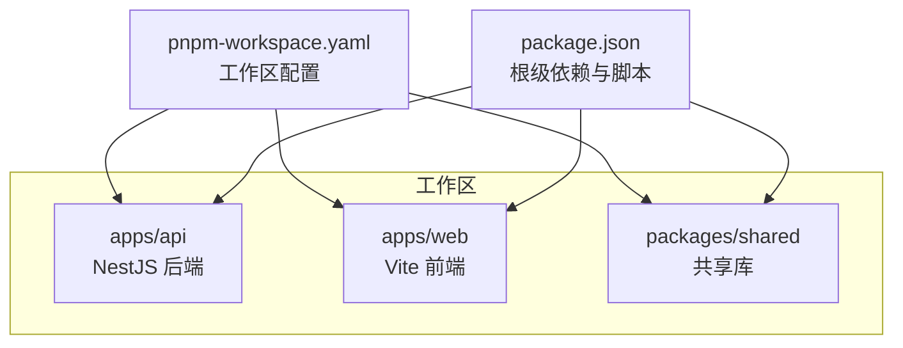
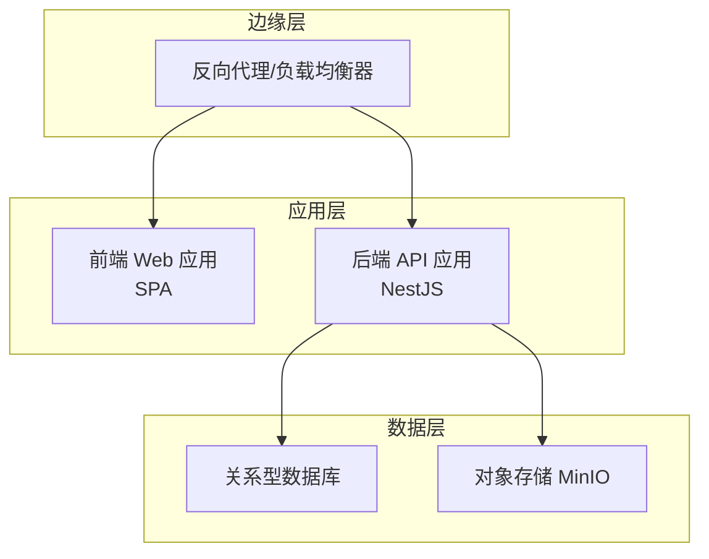
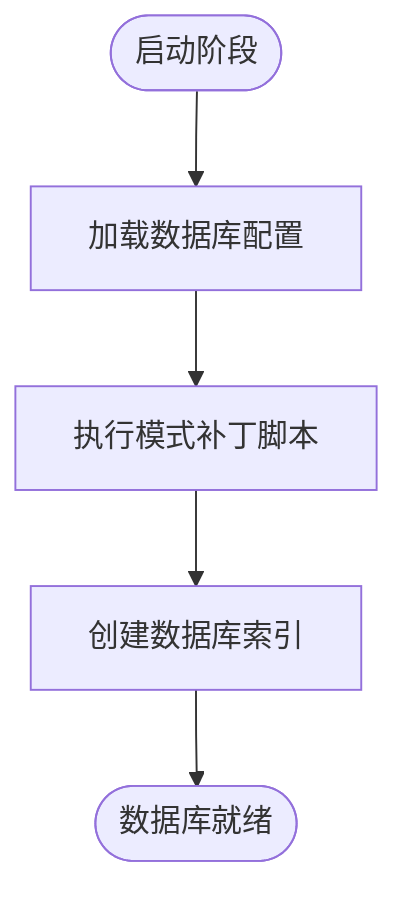
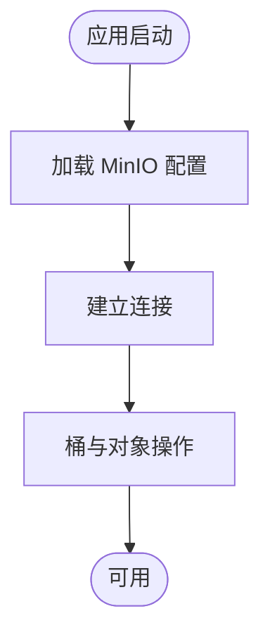
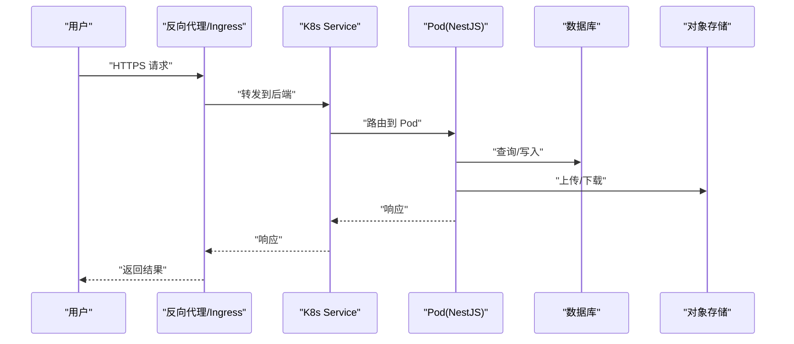
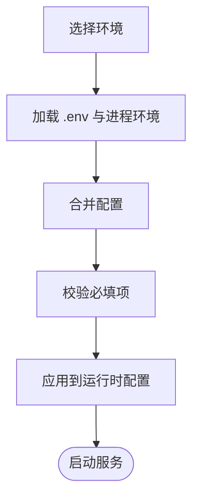
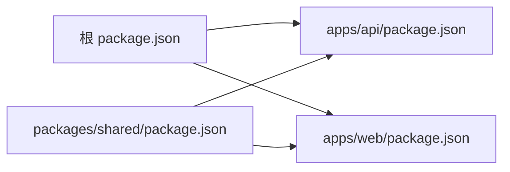

# 部署架构

<cite>
**本文引用的文件**
- [apps/api/package.json](file://apps/api/package.json)
- [apps/web/package.json](file://apps/web/package.json)
- [package.json](file://package.json)
- [pnpm-workspace.yaml](file://pnpm-workspace.yaml)
- [apps/api/src/config/configuration.ts](file://apps/api/src/config/configuration.ts)
- [apps/api/src/config/load-env.ts](file://apps/api/src/config/load-env.ts)
- [apps/api/src/bootstrap.ts](file://apps/api/src/bootstrap.ts)
- [apps/api/src/app.module.ts](file://apps/api/src/app.module.ts)
- [apps/api/src/common/minio/minio.config.ts](file://apps/api/src/common/minio/minio.config.ts)
- [apps/api/src/common/typeorm/typeorm.config.ts](file://apps/api/src/common/typeorm/typeorm.config.ts)
- [apps/api/src/common/project/touch-project.util.ts](file://apps/api/src/common/project/touch-project.util.ts)
- [apps/api/env/.env.example](file://apps/api/env/.env.example)
- [apps/api/scripts/add-database-indexes.sql](file://apps/api/scripts/add-database-indexes.sql)
- [apps/api/scripts/apply-schema-patch.ts](file://apps/api/scripts/apply-schema-patch.ts)
- [apps/api/scripts/load-env.ts](file://apps/api/scripts/load-env.ts)
- [apps/api/nest-cli.json](file://apps/api/nest-cli.json)
- [apps/web/vite.config.ts](file://apps/web/vite.config.ts)
- [apps/web/index.html](file://apps/web/index.html)
</cite>

## 目录
1. [简介](#简介)
2. [项目结构](#项目结构)
3. [核心组件](#核心组件)
4. [架构总览](#架构总览)
5. [详细组件分析](#详细组件分析)
6. [依赖关系分析](#依赖关系分析)
7. [性能考量](#性能考量)
8. [故障排查指南](#故障排查指南)
9. [结论](#结论)
10. [附录](#附录)

## 简介
本部署架构文档面向 CaseForge 的后端 API 与前端 Web 应用，聚焦于系统部署拓扑、基础设施要求（数据库、对象存储）、容器化与编排策略（Docker/Kubernetes）、高可用与容灾、环境配置管理、监控与日志、性能优化以及运维流程与最佳实践。本文所有技术结论均基于仓库中现有源码与配置文件进行归纳总结。

## 项目结构
CaseForge 采用多包工作区（monorepo）组织方式，核心由以下模块构成：
- 后端 NestJS 应用：apps/api
- 前端 Vite 应用：apps/web
- 共享库：packages/shared
- 工作区定义：pnpm-workspace.yaml
- 根级依赖与脚本：package.json

图表来源
- [pnpm-workspace.yaml](file://pnpm-workspace.yaml)
- [package.json](file://package.json)

章节来源
- [pnpm-workspace.yaml](file://pnpm-workspace.yaml)
- [package.json](file://package.json)

## 核心组件
- 应用入口与引导
  - 后端引导：bootstrap.ts 负责应用初始化与启动序列。
  - 模块装配：app.module.ts 定义应用模块边界与依赖注入树。
- 配置体系
  - 运行时配置：configuration.ts 提供运行期配置项与默认值。
  - 环境加载：load-env.ts 将 .env 文件与 process.env 合并，确保类型安全。
  - 示例环境：apps/api/env/.env.example 提供示例键位，便于本地与 CI 环境准备。
- 数据持久化
  - ORM 配置：typeorm.config.ts 定义数据库连接、迁移与索引策略。
  - 初始化脚本：add-database-indexes.sql、apply-schema-patch.ts 支持数据库模式演进。
- 对象存储
  - MinIO 配置：minio.config.ts 定义对象存储访问参数与桶策略。
- 构建与打包
  - 前端构建：vite.config.ts 配置构建产物与静态资源路径。
  - 前端入口：index.html 作为 SPA 入口页面。
- CLI 与编译
  - nest-cli.json 定义 NestJS CLI 行为与输出目录。

章节来源
- [apps/api/src/bootstrap.ts](file://apps/api/src/bootstrap.ts)
- [apps/api/src/app.module.ts](file://apps/api/src/app.module.ts)
- [apps/api/src/config/configuration.ts](file://apps/api/src/config/configuration.ts)
- [apps/api/src/config/load-env.ts](file://apps/api/src/config/load-env.ts)
- [apps/api/env/.env.example](file://apps/api/env/.env.example)
- [apps/api/src/common/typeorm/typeorm.config.ts](file://apps/api/src/common/typeorm/typeorm.config.ts)
- [apps/api/scripts/add-database-indexes.sql](file://apps/api/scripts/add-database-indexes.sql)
- [apps/api/scripts/apply-schema-patch.ts](file://apps/api/scripts/apply-schema-patch.ts)
- [apps/api/src/common/minio/minio.config.ts](file://apps/api/src/common/minio/minio.config.ts)
- [apps/web/vite.config.ts](file://apps/web/vite.config.ts)
- [apps/web/index.html](file://apps/web/index.html)
- [apps/api/nest-cli.json](file://apps/api/nest-cli.json)

## 架构总览
CaseForge 的部署拓扑建议如下：
- 前端 Web 应用通过反向代理或 CDN 提供静态资源；后端 API 以无状态服务形式运行。
- 数据库存储业务数据与审计日志；对象存储用于大文件与附件归档。
- 反向代理统一接入，负责 TLS 终止、健康检查与流量分发。
- 缓存层可选：Redis 用于会话、队列或热点缓存（如需扩展）。
- 监控与日志：集中式日志采集与指标上报，结合告警规则实现高可用保障。

## 详细组件分析

### 数据库部署与配置
- 连接与迁移
  - 使用 TypeORM 进行数据库连接与模式管理，配置位于 typeorm.config.ts。
  - 初始索引与模式补丁通过 add-database-indexes.sql 与 apply-schema-patch.ts 执行。
- 高可用建议
  - 生产环境推荐主从复制或托管数据库高可用实例。
  - 读写分离：查询路由至只读副本，写入路由至主库。
- 备份策略
  - 建议开启数据库自动备份与 PITR（点对时间恢复），定期校验备份可用性。

图表来源
- [apps/api/src/common/typeorm/typeorm.config.ts](file://apps/api/src/common/typeorm/typeorm.config.ts)
- [apps/api/scripts/apply-schema-patch.ts](file://apps/api/scripts/apply-schema-patch.ts)
- [apps/api/scripts/add-database-indexes.sql](file://apps/api/scripts/add-database-indexes.sql)

章节来源
- [apps/api/src/common/typeorm/typeorm.config.ts](file://apps/api/src/common/typeorm/typeorm.config.ts)
- [apps/api/scripts/apply-schema-patch.ts](file://apps/api/scripts/apply-schema-patch.ts)
- [apps/api/scripts/add-database-indexes.sql](file://apps/api/scripts/add-database-indexes.sql)

### 对象存储配置（MinIO）
- 访问参数
  - 通过 minio.config.ts 配置 endpoint、bucket、凭证等参数。
- 存储策略
  - 建议启用版本控制、生命周期策略与跨域访问。
  - 分层存储：热数据走高性能存储，冷数据归档到低频/归档存储。
- 备份与容灾
  - 跨区域复制与快照策略，定期验证恢复流程。

图表来源
- [apps/api/src/common/minio/minio.config.ts](file://apps/api/src/common/minio/minio.config.ts)

章节来源
- [apps/api/src/common/minio/minio.config.ts](file://apps/api/src/common/minio/minio.config.ts)

### 网络与反向代理
- 接入层
  - 反向代理负责 HTTPS 终止、健康检查、限流与 WAF。
  - 前端静态资源可由 CDN 或反向代理直接提供，减少后端压力。
- 路由与域名
  - 建议将 /api 前缀转发至后端服务，SPA 回退至 index.html。
- 安全
  - 强制 HTTPS、CORS 白名单、速率限制与请求大小限制。

章节来源
- [apps/web/vite.config.ts](file://apps/web/vite.config.ts)
- [apps/web/index.html](file://apps/web/index.html)

### 容器化与编排（Docker/Kubernetes）
- 容器镜像
  - 后端：基于 Node.js 基础镜像，安装依赖后构建 NestJS 应用，暴露健康检查端口。
  - 前端：基于 Nginx 或轻量镜像，部署构建产物。
- Kubernetes 部署策略
  - Deployment：副本数≥2，滚动更新，带探针（liveness/readiness）。
  - Service：ClusterIP 暴露内部服务；Ingress/LoadBalancer 对外暴露。
  - ConfigMap/Secret：挂载运行时配置与密钥，避免硬编码。
  - PVC：若需要本地缓存或临时文件，可挂载持久卷。
- 资源配额
  - 为 Pod 设置 requests/limits，避免资源争抢。
- 健康检查
  - HTTP GET /health 或自定义探针，确保快速失败与自动重启。

图表来源
- [apps/api/src/bootstrap.ts](file://apps/api/src/bootstrap.ts)
- [apps/api/src/common/typeorm/typeorm.config.ts](file://apps/api/src/common/typeorm/typeorm.config.ts)
- [apps/api/src/common/minio/minio.config.ts](file://apps/api/src/common/minio/minio.config.ts)

章节来源
- [apps/api/src/bootstrap.ts](file://apps/api/src/bootstrap.ts)

### 高可用与容灾
- 多副本与滚动升级
  - 前端与后端均至少部署 2 个副本，确保单点故障不影响服务。
- 地域冗余
  - 在多个可用区部署，跨区复制数据库与对象存储。
- 故障切换
  - 自动故障检测与切换，配合外部健康检查服务。
- 备份与恢复
  - 数据库与对象存储定期备份，演练恢复流程。

章节来源
- [apps/api/src/common/typeorm/typeorm.config.ts](file://apps/api/src/common/typeorm/typeorm.config.ts)
- [apps/api/src/common/minio/minio.config.ts](file://apps/api/src/common/minio/minio.config.ts)

### 环境配置管理（开发/测试/生产）
- 环境变量
  - 开发：本地 .env，最小化依赖；测试：CI 环境变量；生产：Kubernetes Secret/ConfigMap。
- 配置加载
  - load-env.ts 负责合并与校验，configuration.ts 提供默认值与类型约束。
- 差异化策略
  - 不同环境使用不同数据库、对象存储 endpoint 与日志级别。
- 密钥管理
  - 敏感信息（数据库密码、MinIO 凭证）通过 Secret 管理，不进入代码库。

图表来源
- [apps/api/src/config/load-env.ts](file://apps/api/src/config/load-env.ts)
- [apps/api/src/config/configuration.ts](file://apps/api/src/config/configuration.ts)
- [apps/api/env/.env.example](file://apps/api/env/.env.example)

章节来源
- [apps/api/src/config/load-env.ts](file://apps/api/src/config/load-env.ts)
- [apps/api/src/config/configuration.ts](file://apps/api/src/config/configuration.ts)
- [apps/api/env/.env.example](file://apps/api/env/.env.example)

### 监控、日志与性能优化
- 监控指标
  - 应用指标：请求量、错误率、P95/P99 延迟、并发连接数。
  - 基础设施：CPU/内存/磁盘/网络、数据库连接池与慢查询。
- 日志
  - 结构化日志输出，区分请求日志与业务日志；集中采集与检索。
- 性能优化
  - 连接池参数调优、数据库索引与查询优化、缓存热点数据。
  - 前端资源压缩与缓存策略，CDN 加速静态资源。

章节来源
- [apps/api/src/common/typeorm/typeorm.config.ts](file://apps/api/src/common/typeorm/typeorm.config.ts)
- [apps/web/vite.config.ts](file://apps/web/vite.config.ts)

### 部署流程与运维最佳实践
- 流程
  - 代码提交 → CI 构建镜像 → 推送镜像仓库 → K8s 发布 → 健康检查 → 上线。
- 最佳实践
  - 声明式配置（Helm/Kustomize），变更评审与回滚预案。
  - 渐进式发布（金丝雀/蓝绿），灰度流量控制。
  - 安全基线：最小权限、只读根文件系统、非 root 用户运行。

章节来源
- [apps/api/src/bootstrap.ts](file://apps/api/src/bootstrap.ts)
- [apps/api/nest-cli.json](file://apps/api/nest-cli.json)

## 依赖关系分析
- 包依赖
  - 根 package.json 管理 monorepo 顶层脚本与依赖。
  - apps/api 与 apps/web 作为独立应用，共享 packages/shared。
- 运行时依赖
  - 后端依赖 TypeORM、NestJS、MinIO SDK 等；前端依赖 Vite、Vue 生态。
- 配置耦合
  - 数据库与对象存储配置在各自配置文件中集中管理，通过环境变量解耦。

图表来源
- [package.json](file://package.json)
- [apps/api/package.json](file://apps/api/package.json)
- [apps/web/package.json](file://apps/web/package.json)
- [packages/shared/package.json](file://packages/shared/package.json)

章节来源
- [package.json](file://package.json)
- [apps/api/package.json](file://apps/api/package.json)
- [apps/web/package.json](file://apps/web/package.json)
- [packages/shared/package.json](file://packages/shared/package.json)

## 性能考量
- 数据库
  - 合理设置连接池大小，按 QPS 与事务复杂度调优；定期分析慢查询。
- 对象存储
  - 分片上传、断点续传与并发下载；桶策略与地域就近访问。
- 应用层
  - 启动时序优化（懒加载、预热），减少冷启动延迟。
- 前端
  - 代码分割、资源压缩、HTTP/2 多路复用与 CDN 缓存。

章节来源
- [apps/api/src/common/typeorm/typeorm.config.ts](file://apps/api/src/common/typeorm/typeorm.config.ts)
- [apps/api/src/common/minio/minio.config.ts](file://apps/api/src/common/minio/minio.config.ts)
- [apps/web/vite.config.ts](file://apps/web/vite.config.ts)

## 故障排查指南
- 健康检查
  - 通过 /health 或探针判断服务可用性；关注数据库与对象存储连通性。
- 日志定位
  - 关注请求上下文、SQL 执行时间、MinIO 操作错误码。
- 配置核对
  - 确认环境变量是否正确加载，数据库与 MinIO endpoint 是否可达。
- 快速回滚
  - 保留上一个稳定镜像标签，紧急回滚降低影响面。

章节来源
- [apps/api/src/bootstrap.ts](file://apps/api/src/bootstrap.ts)
- [apps/api/src/config/load-env.ts](file://apps/api/src/config/load-env.ts)
- [apps/api/src/common/typeorm/typeorm.config.ts](file://apps/api/src/common/typeorm/typeorm.config.ts)
- [apps/api/src/common/minio/minio.config.ts](file://apps/api/src/common/minio/minio.config.ts)

## 结论
本部署架构文档基于仓库现有配置与代码，给出了数据库、对象存储、容器化与编排、高可用与容灾、环境配置、监控日志与性能优化的落地建议，并提供了标准化的部署流程与运维最佳实践。实际落地时应结合企业安全与合规要求进一步细化。

## 附录
- 关键文件清单
  - 后端配置与引导：configuration.ts、load-env.ts、bootstrap.ts、app.module.ts
  - 数据库与对象存储：typeorm.config.ts、minio.config.ts
  - 前端构建与入口：vite.config.ts、index.html
  - 工作区与依赖：pnpm-workspace.yaml、package.json、apps/api/package.json、apps/web/package.json、packages/shared/package.json
  - 环境示例：apps/api/env/.env.example
  - 数据库脚本：add-database-indexes.sql、apply-schema-patch.ts
  - CLI 配置：nest-cli.json

章节来源
- [apps/api/src/config/configuration.ts](file://apps/api/src/config/configuration.ts)
- [apps/api/src/config/load-env.ts](file://apps/api/src/config/load-env.ts)
- [apps/api/src/bootstrap.ts](file://apps/api/src/bootstrap.ts)
- [apps/api/src/app.module.ts](file://apps/api/src/app.module.ts)
- [apps/api/src/common/typeorm/typeorm.config.ts](file://apps/api/src/common/typeorm/typeorm.config.ts)
- [apps/api/src/common/minio/minio.config.ts](file://apps/api/src/common/minio/minio.config.ts)
- [apps/web/vite.config.ts](file://apps/web/vite.config.ts)
- [apps/web/index.html](file://apps/web/index.html)
- [pnpm-workspace.yaml](file://pnpm-workspace.yaml)
- [package.json](file://package.json)
- [apps/api/package.json](file://apps/api/package.json)
- [apps/web/package.json](file://apps/web/package.json)
- [packages/shared/package.json](file://packages/shared/package.json)
- [apps/api/env/.env.example](file://apps/api/env/.env.example)
- [apps/api/scripts/add-database-indexes.sql](file://apps/api/scripts/add-database-indexes.sql)
- [apps/api/scripts/apply-schema-patch.ts](file://apps/api/scripts/apply-schema-patch.ts)
- [apps/api/nest-cli.json](file://apps/api/nest-cli.json)