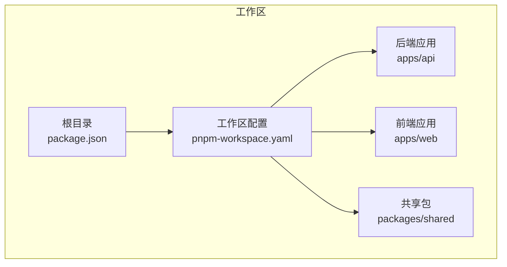
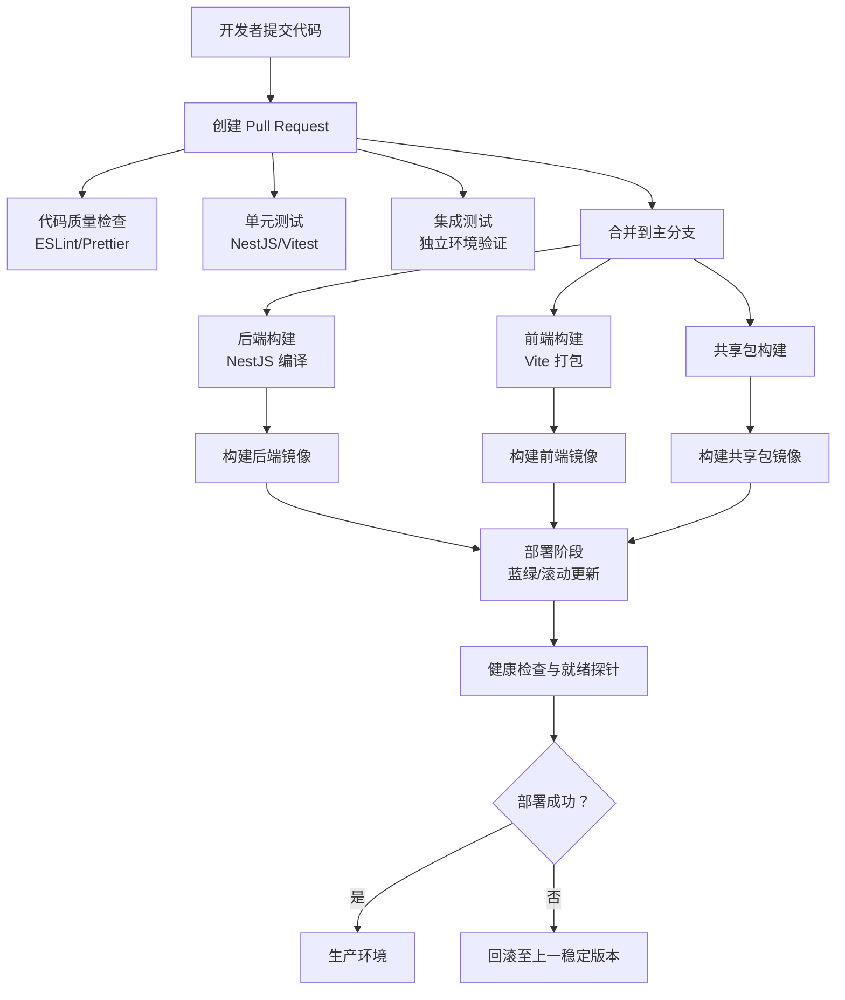
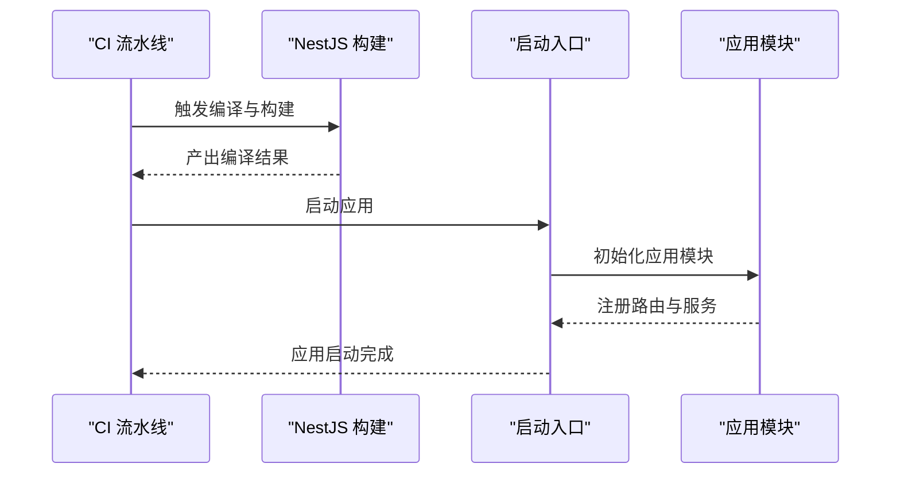
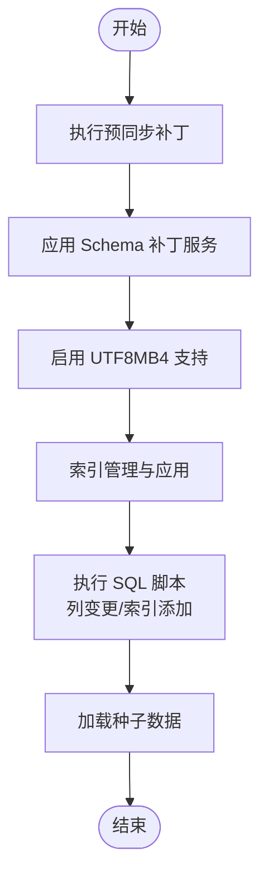
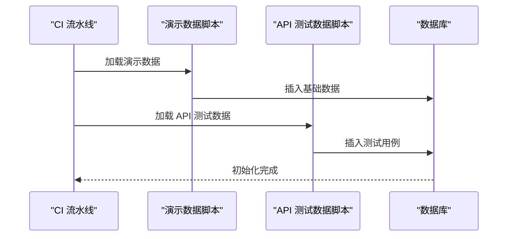
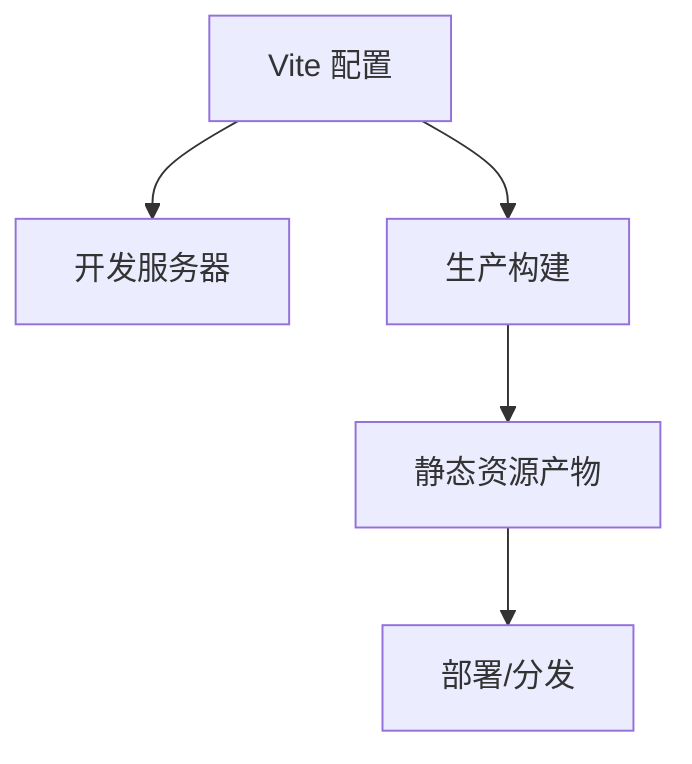
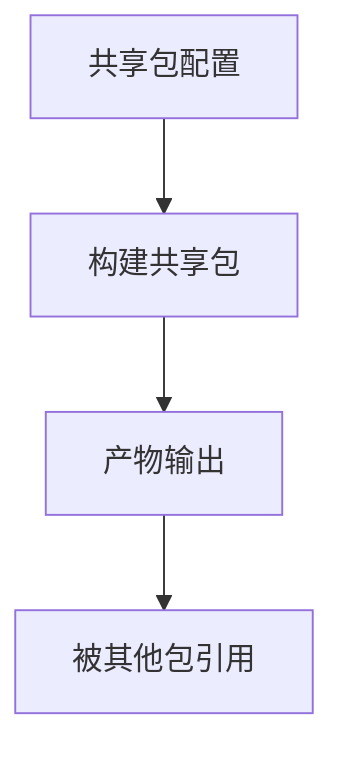
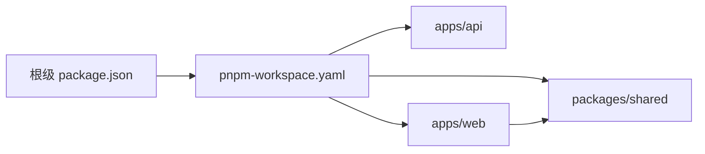

# CI/CD 流水线

<cite>
**本文档引用的文件**
- [package.json](file://package.json)
- [pnpm-workspace.yaml](file://pnpm-workspace.yaml)
- [apps/api/package.json](file://apps/api/package.json)
- [apps/api/nest-cli.json](file://apps/api/nest-cli.json)
- [apps/api/tsconfig.json](file://apps/api/tsconfig.json)
- [apps/api/tsconfig.build.json](file://apps/api/tsconfig.build.json)
- [apps/api/src/bootstrap.ts](file://apps/api/src/bootstrap.ts)
- [apps/api/src/app.module.ts](file://apps/api/src/app.module.ts)
- [apps/api/scripts/load-env.ts](file://apps/api/scripts/load-env.ts)
- [apps/api/scripts/seed-demo-data.ts](file://apps/api/scripts/seed-demo-data.ts)
- [apps/api/scripts/seed-api-test-demo.ts](file://apps/api/scripts/seed-api-test-demo.ts)
- [apps/api/scripts/apply-schema-patch.ts](file://apps/api/scripts/apply-schema-patch.ts)
- [apps/api/scripts/add-database-indexes.sql](file://apps/api/scripts/add-database-indexes.sql)
- [apps/api/scripts/add-project-platform-column.sql](file://apps/api/scripts/add-project-platform-column.sql)
- [apps/api/src/common/typeorm/schema-patch.service.ts](file://apps/api/src/common/typeorm/schema-patch.service.ts)
- [apps/api/src/common/typeorm/pre-sync-schema-patch.ts](file://apps/api/src/common/typeorm/pre-sync-schema-patch.ts)
- [apps/api/src/common/typeorm/api-schema-migrations.util.ts](file://apps/api/src/common/typeorm/api-schema-migrations.util.ts)
- [apps/api/src/common/typeorm/database-indexes.util.ts](file://apps/api/src/common/typeorm/database-indexes.util.ts)
- [apps/api/src/common/typeorm/utf8mb4-schema.util.ts](file://apps/api/src/common/typeorm/utf8mb4-schema.util.ts)
- [apps/web/package.json](file://apps/web/package.json)
- [apps/web/vite.config.ts](file://apps/web/vite.config.ts)
- [apps/web/tsconfig.json](file://apps/web/tsconfig.json)
- [packages/shared/package.json](file://packages/shared/package.json)
- [packages/shared/tsconfig.json](file://packages/shared/tsconfig.json)
</cite>

## 目录
1. [引言](#引言)
2. [项目结构](#项目结构)
3. [核心组件](#核心组件)
4. [架构总览](#架构总览)
5. [详细组件分析](#详细组件分析)
6. [依赖关系分析](#依赖关系分析)
7. [性能考虑](#性能考虑)
8. [故障排除指南](#故障排除指南)
9. [结论](#结论)
10. [附录](#附录)

## 引言
本文件为 CaseForge 项目设计并实现一套完整的 CI/CD 流水线方案，覆盖代码质量检查、单元测试与集成测试自动化、前后端构建流程、数据库迁移与数据种子、部署策略（蓝绿部署、滚动更新、回滚）、以及发布与版本管理最佳实践。该方案基于仓库现有技术栈与脚本进行落地，确保可重复、可追溯、可回滚。

## 项目结构
CaseForge 采用多包工作区结构，包含：
- 后端 NestJS 应用：apps/api
- 前端 Vite+Vue 应用：apps/web
- 共享包：packages/shared
- 工作区配置：pnpm-workspace.yaml
- 根级包管理与脚本：package.json

图表来源
- [package.json](file://package.json)
- [pnpm-workspace.yaml](file://pnpm-workspace.yaml)

章节来源
- [package.json](file://package.json)
- [pnpm-workspace.yaml](file://pnpm-workspace.yaml)

## 核心组件
- 构建与打包
  - 后端：NestJS CLI 配置与 TypeScript 编译配置，支持按需构建与产物输出。
  - 前端：Vite 配置与打包，生成静态资源。
  - 共享包：独立构建与类型导出。
- 质量与测试
  - 单元测试：建议在后端通过 NestJS 测试框架运行；前端通过 Vitest/Jest 运行。
  - 集成测试：建议通过独立测试环境与数据库快照进行端到端验证。
  - 代码质量：建议引入 ESLint/Prettier/TsLint 等工具进行统一规范。
- 数据库迁移与种子
  - 模式补丁：预同步补丁、Schema 补丁服务、UTF8MB4 支持等。
  - 索引与列变更：SQL 脚本与自动应用逻辑。
  - 种子数据：演示数据与 API 测试数据的加载脚本。
- 部署与回滚
  - 建议采用容器化（Docker）与编排（Kubernetes/Docker Compose），结合蓝绿/滚动更新与健康检查。
  - 回滚策略：镜像标签与配置回滚、数据库迁移回滚脚本。
- 发布与版本
  - 版本号管理：语义化版本与变更日志。
  - 自动化发布：基于分支保护与标签触发的流水线。

章节来源
- [apps/api/nest-cli.json](file://apps/api/nest-cli.json)
- [apps/api/tsconfig.json](file://apps/api/tsconfig.json)
- [apps/api/tsconfig.build.json](file://apps/api/tsconfig.build.json)
- [apps/web/vite.config.ts](file://apps/web/vite.config.ts)
- [apps/web/package.json](file://apps/web/package.json)
- [packages/shared/package.json](file://packages/shared/package.json)

## 架构总览
下图展示从代码提交到部署的典型流水线阶段，涵盖质量门禁、构建、测试、打包、镜像构建、部署与回滚。

## 详细组件分析

### 后端构建与启动流程
后端采用 NestJS CLI 与 TypeScript 编译配置，支持按模块构建与产物输出。启动入口负责初始化应用模块与环境变量加载。

图表来源
- [apps/api/nest-cli.json](file://apps/api/nest-cli.json)
- [apps/api/tsconfig.json](file://apps/api/tsconfig.json)
- [apps/api/src/bootstrap.ts](file://apps/api/src/bootstrap.ts)
- [apps/api/src/app.module.ts](file://apps/api/src/app.module.ts)

章节来源
- [apps/api/nest-cli.json](file://apps/api/nest-cli.json)
- [apps/api/tsconfig.json](file://apps/api/tsconfig.json)
- [apps/api/tsconfig.build.json](file://apps/api/tsconfig.build.json)
- [apps/api/src/bootstrap.ts](file://apps/api/src/bootstrap.ts)
- [apps/api/src/app.module.ts](file://apps/api/src/app.module.ts)

### 数据库迁移与索引管理
系统提供多种迁移与索引管理能力：
- 预同步补丁：在同步前执行必要的 Schema 变更。
- Schema 补丁服务：动态应用补丁，支持 UTF8MB4 字符集与排序规则。
- 索引管理：集中定义与应用数据库索引。
- SQL 脚本：用于列变更与索引添加等操作。

图表来源
- [apps/api/src/common/typeorm/pre-sync-schema-patch.ts](file://apps/api/src/common/typeorm/pre-sync-schema-patch.ts)
- [apps/api/src/common/typeorm/schema-patch.service.ts](file://apps/api/src/common/typeorm/schema-patch.service.ts)
- [apps/api/src/common/typeorm/utf8mb4-schema.util.ts](file://apps/api/src/common/typeorm/utf8mb4-schema.util.ts)
- [apps/api/src/common/typeorm/database-indexes.util.ts](file://apps/api/src/common/typeorm/database-indexes.util.ts)
- [apps/api/scripts/add-database-indexes.sql](file://apps/api/scripts/add-database-indexes.sql)
- [apps/api/scripts/add-project-platform-column.sql](file://apps/api/scripts/add-project-platform-column.sql)

章节来源
- [apps/api/src/common/typeorm/pre-sync-schema-patch.ts](file://apps/api/src/common/typeorm/pre-sync-schema-patch.ts)
- [apps/api/src/common/typeorm/schema-patch.service.ts](file://apps/api/src/common/typeorm/schema-patch.service.ts)
- [apps/api/src/common/typeorm/utf8mb4-schema.util.ts](file://apps/api/src/common/typeorm/utf8mb4-schema.util.ts)
- [apps/api/src/common/typeorm/database-indexes.util.ts](file://apps/api/src/common/typeorm/database-indexes.util.ts)
- [apps/api/scripts/add-database-indexes.sql](file://apps/api/scripts/add-database-indexes.sql)
- [apps/api/scripts/add-project-platform-column.sql](file://apps/api/scripts/add-project-platform-column.sql)

### 种子数据与演示数据
系统提供演示数据与 API 测试数据的加载脚本，便于本地与测试环境快速初始化。

图表来源
- [apps/api/scripts/seed-demo-data.ts](file://apps/api/scripts/seed-demo-data.ts)
- [apps/api/scripts/seed-api-test-demo.ts](file://apps/api/scripts/seed-api-test-demo.ts)

章节来源
- [apps/api/scripts/seed-demo-data.ts](file://apps/api/scripts/seed-demo-data.ts)
- [apps/api/scripts/seed-api-test-demo.ts](file://apps/api/scripts/seed-api-test-demo.ts)

### 前端构建与打包
前端采用 Vite 进行开发与生产构建，生成静态资源供后端或独立 CDN 提供。

图表来源
- [apps/web/vite.config.ts](file://apps/web/vite.config.ts)
- [apps/web/package.json](file://apps/web/package.json)

章节来源
- [apps/web/vite.config.ts](file://apps/web/vite.config.ts)
- [apps/web/package.json](file://apps/web/package.json)

### 共享包构建
共享包作为跨应用的通用模块，需要独立构建与类型导出，确保版本一致性。

图表来源
- [packages/shared/package.json](file://packages/shared/package.json)

章节来源
- [packages/shared/package.json](file://packages/shared/package.json)

## 依赖关系分析
- 工作区依赖
  - 根级 package.json 定义工作区与脚本命令。
  - pnpm-workspace.yaml 声明工作区内各包路径。
- 包间依赖
  - apps/web 与 packages/shared 存在潜在的类型与功能复用关系，建议通过共享包提供公共类型与工具。
- 外部依赖
  - 后端依赖 NestJS、TypeORM、MinIO 等；前端依赖 Vue 生态与 Vite；共享包提供公共类型与工具。

图表来源
- [package.json](file://package.json)
- [pnpm-workspace.yaml](file://pnpm-workspace.yaml)
- [apps/web/package.json](file://apps/web/package.json)
- [packages/shared/package.json](file://packages/shared/package.json)

章节来源
- [package.json](file://package.json)
- [pnpm-workspace.yaml](file://pnpm-workspace.yaml)
- [apps/web/package.json](file://apps/web/package.json)
- [packages/shared/package.json](file://packages/shared/package.json)

## 性能考虑
- 并行构建：利用 pnpm 工作区特性并行构建多个包，减少流水线总时长。
- 缓存策略：缓存 Node.js 依赖与构建缓存，提升重复任务速度。
- 分层缓存：区分依赖缓存与产物缓存，避免缓存污染。
- 镜像层优化：容器镜像分层构建，将依赖与源码分离，提升缓存命中率。
- 测试隔离：单元测试与集成测试分离，优先运行快速失败的单元测试。

## 故障排除指南
- 构建失败
  - 检查 TypeScript 编译配置与 NestJS CLI 设置是否正确。
  - 确认包间依赖与版本兼容性。
- 测试失败
  - 单元测试：确认测试环境变量与模拟对象配置。
  - 集成测试：确认数据库连接、迁移状态与种子数据。
- 部署失败
  - 健康检查：确认就绪探针与存活探针配置。
  - 回滚：检查镜像标签与配置回滚策略。
- 数据库问题
  - 迁移失败：检查补丁顺序与冲突；必要时手动执行 SQL 脚本。
  - 索引缺失：确认索引管理脚本执行情况。

## 结论
本方案基于 CaseForge 现有技术栈与脚本，提供了从代码质量、测试、构建到部署与回滚的完整 CI/CD 实践路径。通过容器化与编排工具，结合蓝绿/滚动更新策略，可显著降低发布风险；通过自动化迁移与种子脚本，确保数据库一致性与环境可复现性。建议在实际落地中补充具体工具链（如 GitHub Actions/Jenkins）的 YAML 配置与密钥管理策略。

## 附录
- 最佳实践清单
  - 使用分支保护与标签触发流水线。
  - 将测试与质量门禁设置为必需状态。
  - 对生产环境变更实施双人审批与灰度发布。
  - 统一版本号管理与变更日志维护。
  - 定期备份数据库与配置，确保可回滚性。
- 参考文件
  - [apps/api/scripts/load-env.ts](file://apps/api/scripts/load-env.ts)
  - [apps/api/scripts/apply-schema-patch.ts](file://apps/api/scripts/apply-schema-patch.ts)
  - [apps/api/src/common/typeorm/api-schema-migrations.util.ts](file://apps/api/src/common/typeorm/api-schema-migrations.util.ts)