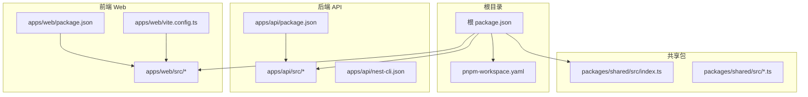
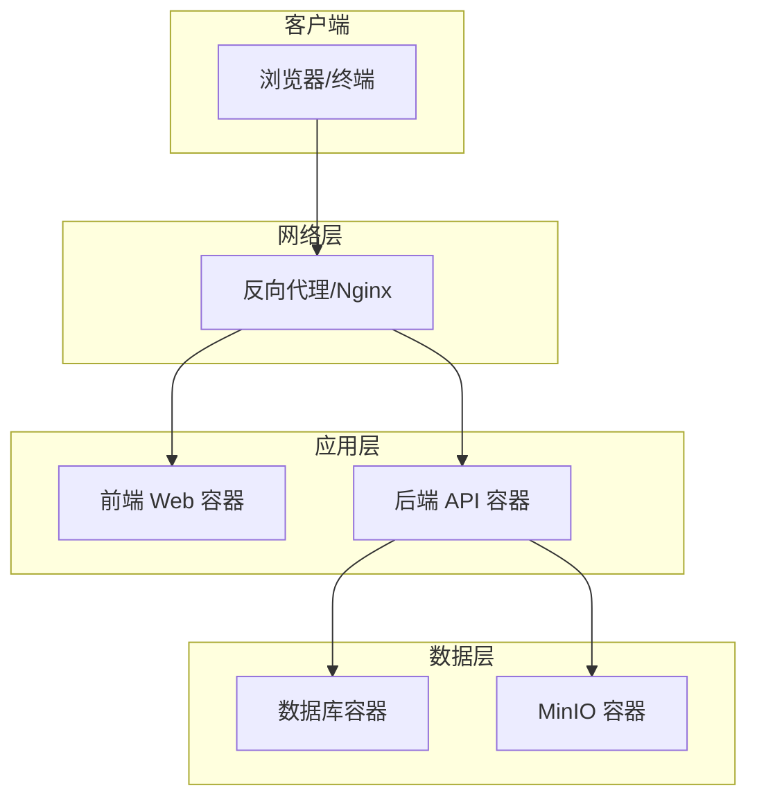
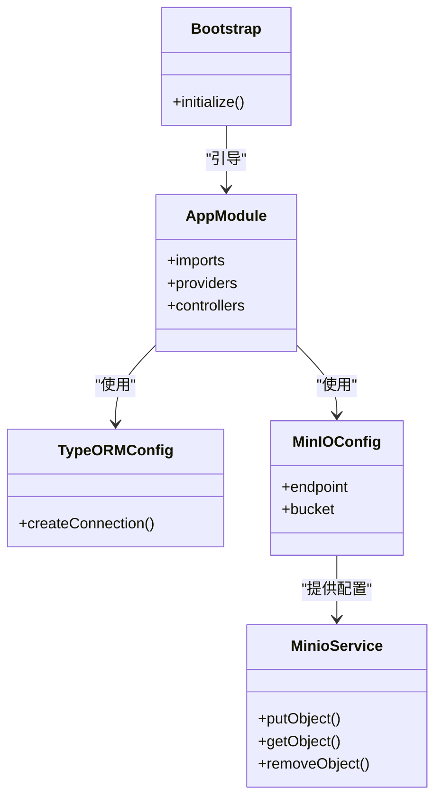
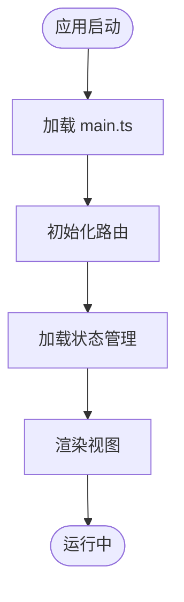
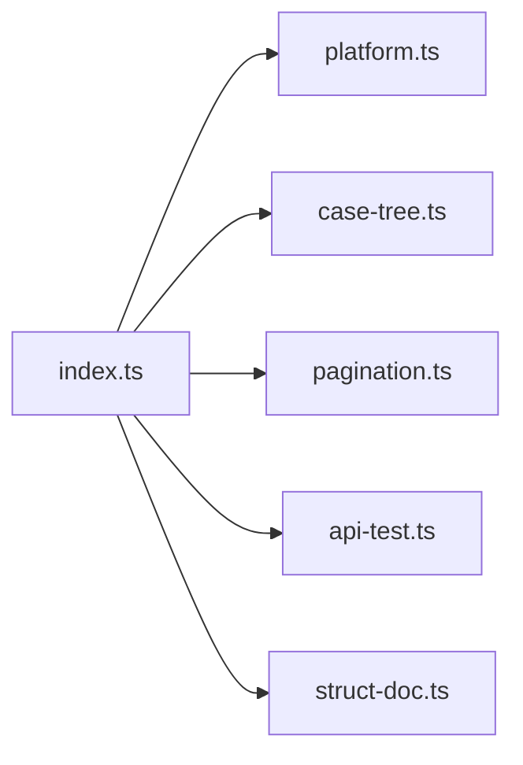
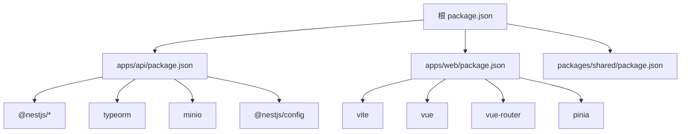

# Docker 容器化部署

<cite>
**本文引用的文件**
- [apps/api/package.json](file://apps/api/package.json)
- [apps/api/nest-cli.json](file://apps/api/nest-cli.json)
- [apps/web/package.json](file://apps/web/package.json)
- [apps/api/src/config/configuration.ts](file://apps/api/src/config/configuration.ts)
- [apps/api/src/config/load-env.ts](file://apps/api/src/config/load-env.ts)
- [apps/api/src/bootstrap.ts](file://apps/api/src/bootstrap.ts)
- [apps/api/src/app.module.ts](file://apps/api/src/app.module.ts)
- [apps/api/src/config/minio/minio.config.ts](file://apps/api/src/config/minio/minio.config.ts)
- [apps/api/src/common/minio/service/minio.service.ts](file://apps/api/src/common/minio/service/minio.service.ts)
- [apps/api/src/common/typeorm/typeorm.config.ts](file://apps/api/src/common/typeorm/typeorm.config.ts)
- [apps/api/src/common/project/touch-project.util.ts](file://apps/api/src/common/project/touch-project.util.ts)
- [apps/api/src/modules/api-test/entity/api-test-case.entity.ts](file://apps/api/src/modules/api-test/entity/api-test-case.entity.ts)
- [apps/api/src/modules/api-test/service/api-case.service.ts](file://apps/api/src/modules/api-test/service/api-case.service.ts)
- [apps/api/src/modules/api-test/controller/api-test.controller.ts](file://apps/api/src/modules/api-test/controller/api-test.controller.ts)
- [apps/web/vite.config.ts](file://apps/web/vite.config.ts)
- [apps/web/index.html](file://apps/web/index.html)
- [apps/web/src/main.ts](file://apps/web/src/main.ts)
- [apps/web/src/router/index.ts](file://apps/web/src/router/index.ts)
- [apps/web/src/stores/caseForge.ts](file://apps/web/src/stores/caseForge.ts)
- [apps/web/src/composables/useImmersiveWorkspace.ts](file://apps/web/src/composables/useImmersiveWorkspace.ts)
- [apps/web/src/views/DashboardView.vue](file://apps/web/src/views/DashboardView.vue)
- [apps/web/src/App.vue](file://apps/web/src/App.vue)
- [packages/shared/src/index.ts](file://packages/shared/src/index.ts)
- [packages/shared/src/platform.ts](file://packages/shared/src/platform.ts)
- [packages/shared/src/case-tree.ts](file://packages/shared/src/case-tree.ts)
- [packages/shared/src/pagination.ts](file://packages/shared/src/pagination.ts)
- [packages/shared/src/api-test.ts](file://packages/shared/src/api-test.ts)
- [packages/shared/src/struct-doc.ts](file://packages/shared/src/struct-doc.ts)
- [package.json](file://package.json)
- [pnpm-workspace.yaml](file://pnpm-workspace.yaml)
</cite>

## 目录
1. [简介](#简介)
2. [项目结构](#项目结构)
3. [核心组件](#核心组件)
4. [架构总览](#架构总览)
5. [详细组件分析](#详细组件分析)
6. [依赖分析](#依赖分析)
7. [性能考虑](#性能考虑)
8. [故障排查指南](#故障排查指南)
9. [结论](#结论)
10. [附录](#附录)

## 简介
本指南面向 CaseForge 的 Docker 容器化部署，覆盖后端 API、前端 Web、数据库与 MinIO 存储的容器编排与优化策略。文档基于仓库现有源码与配置文件进行分析，提供可落地的 Dockerfile 多阶段构建、docker-compose.yml 编排、环境变量、卷挂载、网络与健康检查、启动顺序与资源限制建议，并给出生产环境的安全加固思路。

## 项目结构
CaseForge 采用 Monorepo 结构，使用 pnpm 工作区组织多个包：
- 后端 API：NestJS 应用，负责业务逻辑、数据库与 MinIO 集成
- 前端 Web：Vite/Vue3 应用，提供用户界面
- 共享包：跨应用共享的类型与工具模块
- 根目录：工作区与根级依赖管理

图表来源
- [package.json](file://package.json)
- [pnpm-workspace.yaml](file://pnpm-workspace.yaml)
- [apps/api/package.json](file://apps/api/package.json)
- [apps/web/package.json](file://apps/web/package.json)
- [apps/web/vite.config.ts](file://apps/web/vite.config.ts)
- [packages/shared/src/index.ts](file://packages/shared/src/index.ts)

章节来源
- [package.json](file://package.json)
- [pnpm-workspace.yaml](file://pnpm-workspace.yaml)

## 核心组件
- 后端 API（NestJS）：提供 REST 接口、TypeORM 数据库连接、MinIO 对象存储集成、审计与用户上下文中间件等
- 前端 Web（Vite/Vue3）：单页应用，通过路由与状态管理与后端交互
- 共享包（packages/shared）：跨应用的类型与工具，便于前后端一致性
- 数据库：由 TypeORM 配置驱动，支持 Schema Patch 与索引维护
- MinIO：对象存储，用于文档与附件的持久化

章节来源
- [apps/api/src/config/configuration.ts](file://apps/api/src/config/configuration.ts)
- [apps/api/src/common/typeorm/typeorm.config.ts](file://apps/api/src/common/typeorm/typeorm.config.ts)
- [apps/api/src/config/minio/minio.config.ts](file://apps/api/src/config/minio/minio.config.ts)
- [apps/api/src/common/minio/service/minio.service.ts](file://apps/api/src/common/minio/service/minio.service.ts)
- [apps/web/src/main.ts](file://apps/web/src/main.ts)
- [apps/web/src/router/index.ts](file://apps/web/src/router/index.ts)
- [packages/shared/src/index.ts](file://packages/shared/src/index.ts)

## 架构总览
下图展示容器化部署的系统视图：后端 API 作为中心服务，前端 Web 通过反向代理访问；数据库与 MinIO 分别作为独立服务运行；所有服务通过统一网络互联。

## 详细组件分析

### 后端 API 组件
后端以 NestJS 模块化组织，关键点包括：
- 配置加载与提供：通过配置工厂与自定义 Provider 提供数据库、MinIO 等子配置
- 类型化 ORM：TypeORM 配置与 Schema Patch、索引维护工具
- MinIO 集成：配置与服务封装，支持上传、下载与桶操作
- 审计与用户上下文：请求上下文中间件与用户作用域
- 启动引导：bootstrap.ts 负责应用初始化与模块装配

图表来源
- [apps/api/src/bootstrap.ts](file://apps/api/src/bootstrap.ts)
- [apps/api/src/app.module.ts](file://apps/api/src/app.module.ts)
- [apps/api/src/common/typeorm/typeorm.config.ts](file://apps/api/src/common/typeorm/typeorm.config.ts)
- [apps/api/src/config/minio/minio.config.ts](file://apps/api/src/config/minio/minio.config.ts)
- [apps/api/src/common/minio/service/minio.service.ts](file://apps/api/src/common/minio/service/minio.service.ts)

章节来源
- [apps/api/src/bootstrap.ts](file://apps/api/src/bootstrap.ts)
- [apps/api/src/app.module.ts](file://apps/api/src/app.module.ts)
- [apps/api/src/common/typeorm/typeorm.config.ts](file://apps/api/src/common/typeorm/typeorm.config.ts)
- [apps/api/src/config/minio/minio.config.ts](file://apps/api/src/config/minio/minio.config.ts)
- [apps/api/src/common/minio/service/minio.service.ts](file://apps/api/src/common/minio/service/minio.service.ts)

### 前端 Web 组件
前端为 Vite + Vue3 单页应用，关键点包括：
- 构建配置：vite.config.ts 控制开发服务器与打包行为
- 应用入口：main.ts 初始化应用、路由与状态
- 路由与视图：router/index.ts 定义页面路由，views 下承载页面组件
- 状态管理：stores/caseForge.ts 管理全局状态
- 组合式工具：composables/useImmersiveWorkspace.ts 提供工作区能力

图表来源
- [apps/web/src/main.ts](file://apps/web/src/main.ts)
- [apps/web/src/router/index.ts](file://apps/web/src/router/index.ts)
- [apps/web/src/stores/caseForge.ts](file://apps/web/src/stores/caseForge.ts)
- [apps/web/src/views/DashboardView.vue](file://apps/web/src/views/DashboardView.vue)
- [apps/web/src/App.vue](file://apps/web/src/App.vue)

章节来源
- [apps/web/vite.config.ts](file://apps/web/vite.config.ts)
- [apps/web/src/main.ts](file://apps/web/src/main.ts)
- [apps/web/src/router/index.ts](file://apps/web/src/router/index.ts)
- [apps/web/src/stores/caseForge.ts](file://apps/web/src/stores/caseForge.ts)
- [apps/web/src/views/DashboardView.vue](file://apps/web/src/views/DashboardView.vue)
- [apps/web/src/App.vue](file://apps/web/src/App.vue)

### 共享包组件
packages/shared 提供跨应用的类型与工具，确保前后端一致性和复用性：
- 平台与用例树：platform.ts、case-tree.ts
- 分页与接口：pagination.ts、api-test.ts、struct-doc.ts
- 导出入口：index.ts 汇总导出

图表来源
- [packages/shared/src/index.ts](file://packages/shared/src/index.ts)
- [packages/shared/src/platform.ts](file://packages/shared/src/platform.ts)
- [packages/shared/src/case-tree.ts](file://packages/shared/src/case-tree.ts)
- [packages/shared/src/pagination.ts](file://packages/shared/src/pagination.ts)
- [packages/shared/src/api-test.ts](file://packages/shared/src/api-test.ts)
- [packages/shared/src/struct-doc.ts](file://packages/shared/src/struct-doc.ts)

章节来源
- [packages/shared/src/index.ts](file://packages/shared/src/index.ts)
- [packages/shared/src/platform.ts](file://packages/shared/src/platform.ts)
- [packages/shared/src/case-tree.ts](file://packages/shared/src/case-tree.ts)
- [packages/shared/src/pagination.ts](file://packages/shared/src/pagination.ts)
- [packages/shared/src/api-test.ts](file://packages/shared/src/api-test.ts)
- [packages/shared/src/struct-doc.ts](file://packages/shared/src/struct-doc.ts)

## 依赖分析
- 后端依赖：NestJS 生态、TypeORM、MinIO SDK、配置与环境加载工具
- 前端依赖：Vite、Vue3、路由与状态管理相关库
- 工作区：pnpm-workspace.yaml 管理多包依赖与发布

图表来源
- [package.json](file://package.json)
- [apps/api/package.json](file://apps/api/package.json)
- [apps/web/package.json](file://apps/web/package.json)
- [pnpm-workspace.yaml](file://pnpm-workspace.yaml)

章节来源
- [apps/api/package.json](file://apps/api/package.json)
- [apps/web/package.json](file://apps/web/package.json)
- [package.json](file://package.json)
- [pnpm-workspace.yaml](file://pnpm-workspace.yaml)

## 性能考虑
- 构建缓存：在多阶段构建中利用分层缓存，优先安装依赖再复制源码
- 运行时镜像：使用更小的基础镜像（如 alpine），减少攻击面
- 连接池与并发：合理配置数据库连接池与 MinIO 客户端并发参数
- 前端静态资源：启用压缩与缓存头，减少带宽占用
- 资源限制：为各容器设置 CPU/内存限额，避免资源争抢

## 故障排查指南
- 启动失败：检查环境变量是否正确加载，确认数据库与 MinIO 可达
- 数据库异常：验证 TypeORM 配置与 Schema Patch 是否执行成功
- MinIO 访问：核对桶权限、凭证与网络连通性
- 健康检查：为数据库与 MinIO 添加健康检查端点，确保容器编排时的可用性

章节来源
- [apps/api/src/config/load-env.ts](file://apps/api/src/config/load-env.ts)
- [apps/api/src/common/typeorm/typeorm.config.ts](file://apps/api/src/common/typeorm/typeorm.config.ts)
- [apps/api/src/config/minio/minio.config.ts](file://apps/api/src/config/minio/minio.config.ts)

## 结论
通过多阶段构建与最小化运行时镜像，结合 docker-compose 的服务编排与健康检查，CaseForge 可实现稳定、可扩展且安全的容器化部署。建议在生产环境中进一步完善网络隔离、密钥管理与日志审计。

## 附录

### Dockerfile 编写与优化要点
- 多阶段构建
  - 第一阶段：安装 Node.js 与 pnpm，构建共享包与后端 API
  - 第二阶段：仅复制必要产物到轻量基础镜像，禁用 dev 依赖
- 基础镜像选择
  - 使用官方 Node LTS 或 Alpine 版本，确保安全补丁及时更新
- 依赖管理
  - 使用 pnpm 并启用 store，提升安装速度与磁盘利用率
  - 在 CI 中缓存 pnpm store，加速构建
- 运行用户与权限
  - 以非 root 用户运行应用，降低权限风险
- 健康检查与探针
  - 在容器内暴露健康检查端点，配合 docker-compose healthcheck

### docker-compose.yml 配置要点
- 服务定义
  - 后端 API：映射端口、挂载配置卷、声明数据库与 MinIO 依赖
  - 前端 Web：通过反向代理或单独服务暴露静态资源
  - 数据库：持久化卷、初始化脚本、备份策略
  - MinIO：持久化卷、访问密钥、桶初始化
- 网络与卷
  - 自定义网络隔离服务间通信
  - 将配置文件与日志目录映射到宿主机
- 启动顺序与依赖
  - 使用 depends_on 并结合 healthcheck 实现有序启动
- 健康检查
  - 为数据库与 MinIO 添加健康检查，确保服务可用后再启动 API
- 资源限制
  - 设置 CPU/内存上限，防止资源滥用

### 环境变量与配置最佳实践
- 配置加载
  - 使用 NestJS ConfigService 加载 .env 与环境变量
  - 区分开发、测试、生产环境，避免硬编码敏感信息
- 数据库连接
  - 通过环境变量配置主机、端口、用户名、密码与数据库名
- MinIO 连接
  - 端点、访问密钥、桶名与区域需与实际部署一致
- 审计与日志
  - 开启访问日志与审计日志，集中收集与轮转

### 容器安全加固
- 最小权限原则
  - 运行用户非 root，只授予必要文件权限
- 网络隔离
  - 仅开放必需端口，内部服务通过自定义网络互通
- 凭据管理
  - 使用密钥管理服务或环境变量注入，不将密钥写入镜像
- 镜像扫描
  - 定期扫描基础镜像与应用镜像，修复高危漏洞
- 日志与监控
  - 输出结构化日志，接入集中式日志系统与告警