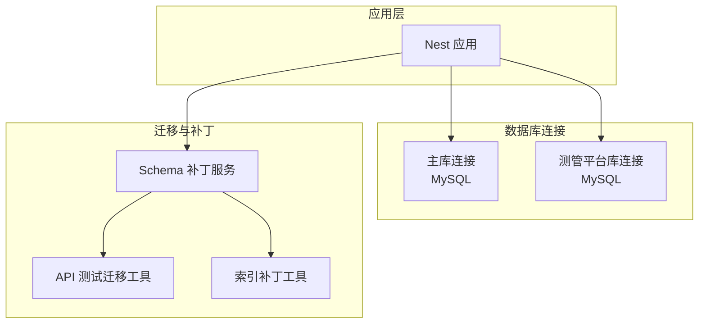
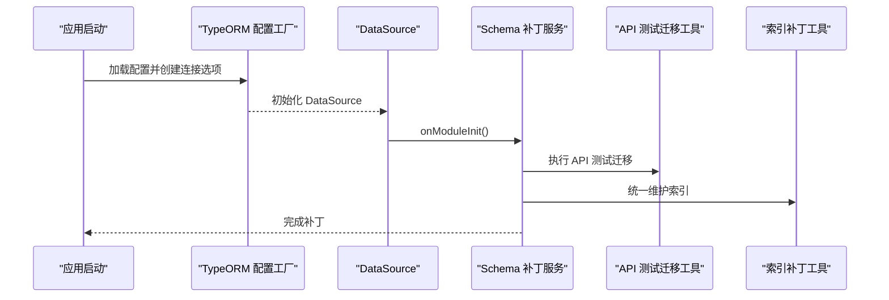
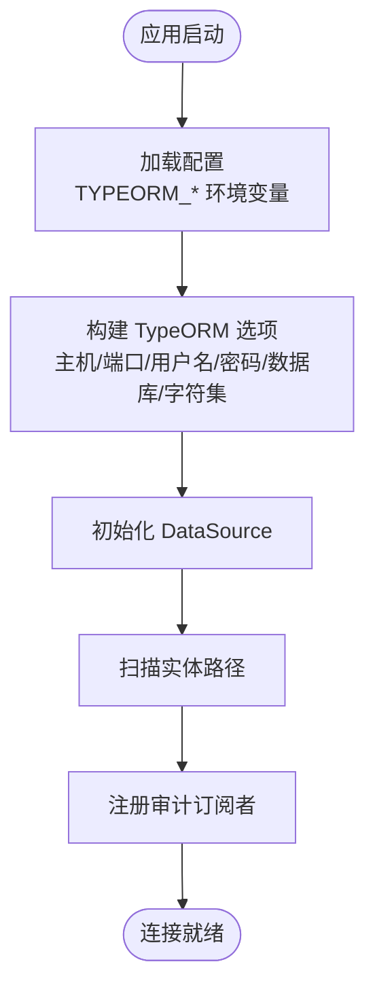
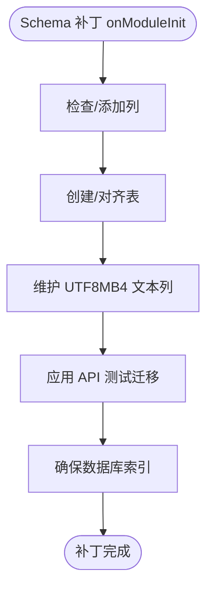
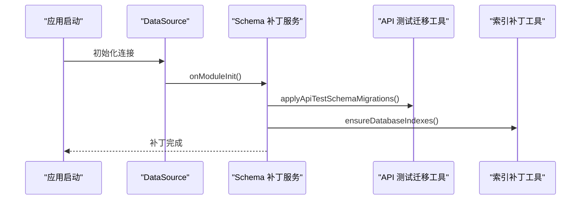
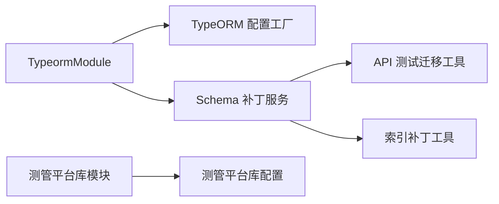

# 数据库备份与恢复

<cite>
**本文引用的文件**   
- [apps/api/src/common/typeorm/typeorm.config.ts](file://apps/api/src/common/typeorm/typeorm.config.ts)
- [apps/api/src/common/typeorm/index.ts](file://apps/api/src/common/typeorm/index.ts)
- [apps/api/src/common/typeorm/schema-patch.service.ts](file://apps/api/src/common/typeorm/schema-patch.service.ts)
- [apps/api/src/common/typeorm/api-schema-migrations.util.ts](file://apps/api/src/common/typeorm/api-schema-migrations.util.ts)
- [apps/api/src/common/typeorm/database-indexes.util.ts](file://apps/api/src/common/typeorm/database-indexes.util.ts)
- [apps/api/src/common/test-platform/test-platform.typeorm.config.ts](file://apps/api/src/common/test-platform/test-platform.typeorm.config.ts)
- [apps/api/src/common/test-platform/test-platform.constants.ts](file://apps/api/src/common/test-platform/test-platform.constants.ts)
- [apps/api/src/config/configuration.ts](file://apps/api/src/config/configuration.ts)
- [apps/api/scripts/apply-schema-patch.ts](file://apps/api/scripts/apply-schema-patch.ts)
- [apps/api/scripts/seed-api-test-demo.ts](file://apps/api/scripts/seed-api-test-demo.ts)
- [apps/api/src/modules/api-test/entity/api-test-environment.entity.ts](file://apps/api/src/modules/api-test/entity/api-test-environment.entity.ts)
- [apps/api/src/modules/api-test/entity/api-test-environment-service.entity.ts](file://apps/api/src/modules/api-test/entity/api-test-environment-service.entity.ts)
- [apps/api/src/modules/struct-doc/service/struct-requirement-queue.service.ts](file://apps/api/src/modules/struct-doc/service/struct-requirement-queue.service.ts)
- [apps/api/src/modules/case-editor/entity/case-generate-job.entity.ts](file://apps/api/src/modules/case-editor/entity/case-generate-job.entity.ts)
</cite>

## 目录
1. [引言](#引言)
2. [项目结构](#项目结构)
3. [核心组件](#核心组件)
4. [架构总览](#架构总览)
5. [详细组件分析](#详细组件分析)
6. [依赖关系分析](#依赖关系分析)
7. [性能考量](#性能考量)
8. [故障排查指南](#故障排查指南)
9. [结论](#结论)
10. [附录](#附录)

## 引言
本文件面向 CaseForge 的数据库备份与恢复，结合现有代码库中的数据库连接、迁移与索引补丁等实现，给出可落地的备份与恢复策略建议，涵盖定期备份计划（全量与增量）、备份存储与异地容灾、灾难恢复流程、数据库迁移自动化、以及备份监控与告警机制。

## 项目结构
- 数据库连接通过 TypeORM 在应用启动阶段完成，主库与测管平台库分别配置。
- 启动时执行 schema 补丁与索引补丁，保证数据库结构一致性。
- 多实体分布在不同模块中，涉及 API 测试、结构化文档、用例生成等业务域。

图表来源
- [apps/api/src/common/typeorm/typeorm.config.ts:15-42](file://apps/api/src/common/typeorm/typeorm.config.ts#L15-L42)
- [apps/api/src/common/typeorm/index.ts:10-21](file://apps/api/src/common/typeorm/index.ts#L10-L21)
- [apps/api/src/common/typeorm/schema-patch.service.ts:10-26](file://apps/api/src/common/typeorm/schema-patch.service.ts#L10-L26)
- [apps/api/src/common/typeorm/api-schema-migrations.util.ts:57-67](file://apps/api/src/common/typeorm/api-schema-migrations.util.ts#L57-L67)
- [apps/api/src/common/typeorm/database-indexes.util.ts:78-95](file://apps/api/src/common/typeorm/database-indexes.util.ts#L78-L95)
- [apps/api/src/common/test-platform/test-platform.typeorm.config.ts:11-30](file://apps/api/src/common/test-platform/test-platform.typeorm.config.ts#L11-L30)

章节来源
- [apps/api/src/common/typeorm/typeorm.config.ts:15-42](file://apps/api/src/common/typeorm/typeorm.config.ts#L15-L42)
- [apps/api/src/common/typeorm/index.ts:10-21](file://apps/api/src/common/typeorm/index.ts#L10-L21)
- [apps/api/src/common/test-platform/test-platform.typeorm.config.ts:11-30](file://apps/api/src/common/test-platform/test-platform.typeorm.config.ts#L11-L30)

## 核心组件
- 主库连接配置：定义 MySQL 连接参数、字符集、实体扫描路径、审计订阅者等。
- 测管平台库连接配置：独立的连接配置，实体集合明确。
- Schema 补丁服务：在应用启动时执行关键表结构补丁与索引补丁，避免因未开启自动同步导致的 500 错误。
- API 测试迁移工具：按需创建/对齐 API 测试相关表与列。
- 索引补丁工具：统一维护关键索引，避免重复或缺失。
- 配置加载：从环境变量读取数据库连接参数，支持开发与测试库分离。

章节来源
- [apps/api/src/common/typeorm/typeorm.config.ts:15-42](file://apps/api/src/common/typeorm/typeorm.config.ts#L15-L42)
- [apps/api/src/common/typeorm/schema-patch.service.ts:10-26](file://apps/api/src/common/typeorm/schema-patch.service.ts#L10-L26)
- [apps/api/src/common/typeorm/api-schema-migrations.util.ts:57-67](file://apps/api/src/common/typeorm/api-schema-migrations.util.ts#L57-L67)
- [apps/api/src/common/typeorm/database-indexes.util.ts:78-95](file://apps/api/src/common/typeorm/database-indexes.util.ts#L78-L95)
- [apps/api/src/common/test-platform/test-platform.typeorm.config.ts:11-30](file://apps/api/src/common/test-platform/test-platform.typeorm.config.ts#L11-L30)
- [apps/api/src/config/configuration.ts:7-31](file://apps/api/src/config/configuration.ts#L7-L31)

## 架构总览
下图展示数据库连接、迁移与补丁在应用生命周期中的交互关系。

图表来源
- [apps/api/src/common/typeorm/typeorm.config.ts:15-42](file://apps/api/src/common/typeorm/typeorm.config.ts#L15-L42)
- [apps/api/src/common/typeorm/index.ts:10-21](file://apps/api/src/common/typeorm/index.ts#L10-L21)
- [apps/api/src/common/typeorm/schema-patch.service.ts:16-26](file://apps/api/src/common/typeorm/schema-patch.service.ts#L16-L26)
- [apps/api/src/common/typeorm/api-schema-migrations.util.ts:57-67](file://apps/api/src/common/typeorm/api-schema-migrations.util.ts#L57-L67)
- [apps/api/src/common/typeorm/database-indexes.util.ts:78-95](file://apps/api/src/common/typeorm/database-indexes.util.ts#L78-L95)

## 详细组件分析

### 数据库连接与配置
- 主库连接采用 MySQL，字符集为 utf8mb4；开发/本地环境允许自动同步；实体扫描路径覆盖模块内 entity。
- 测管平台库使用独立连接与实体集合，便于隔离不同业务域的数据。
- 配置来源于环境变量，支持主库与测试库分离。

图表来源
- [apps/api/src/common/typeorm/typeorm.config.ts:15-42](file://apps/api/src/common/typeorm/typeorm.config.ts#L15-L42)
- [apps/api/src/common/test-platform/test-platform.typeorm.config.ts:11-30](file://apps/api/src/common/test-platform/test-platform.typeorm.config.ts#L11-L30)
- [apps/api/src/config/configuration.ts:7-31](file://apps/api/src/config/configuration.ts#L7-L31)

章节来源
- [apps/api/src/common/typeorm/typeorm.config.ts:15-42](file://apps/api/src/common/typeorm/typeorm.config.ts#L15-L42)
- [apps/api/src/common/test-platform/test-platform.typeorm.config.ts:11-30](file://apps/api/src/common/test-platform/test-platform.typeorm.config.ts#L11-L30)
- [apps/api/src/config/configuration.ts:7-31](file://apps/api/src/config/configuration.ts#L7-L31)

### Schema 补丁与索引补丁
- Schema 补丁服务在模块初始化时执行多项结构补丁，确保关键列/表存在且一致。
- API 测试迁移工具按需创建/对齐表与列，保证跨版本兼容性。
- 索引补丁工具统一维护关键索引，避免重复或缺失。

图表来源
- [apps/api/src/common/typeorm/schema-patch.service.ts:16-26](file://apps/api/src/common/typeorm/schema-patch.service.ts#L16-L26)
- [apps/api/src/common/typeorm/api-schema-migrations.util.ts:57-67](file://apps/api/src/common/typeorm/api-schema-migrations.util.ts#L57-L67)
- [apps/api/src/common/typeorm/database-indexes.util.ts:78-95](file://apps/api/src/common/typeorm/database-indexes.util.ts#L78-L95)

章节来源
- [apps/api/src/common/typeorm/schema-patch.service.ts:16-26](file://apps/api/src/common/typeorm/schema-patch.service.ts#L16-L26)
- [apps/api/src/common/typeorm/api-schema-migrations.util.ts:57-67](file://apps/api/src/common/typeorm/api-schema-migrations.util.ts#L57-L67)
- [apps/api/src/common/typeorm/database-indexes.util.ts:78-95](file://apps/api/src/common/typeorm/database-indexes.util.ts#L78-L95)

### 备份与恢复策略

#### 定期备份计划
- 全量备份
  - 周期：每周日凌晨进行一次全量备份。
  - 触发方式：CI/CD 或运维脚本定时触发，确保在业务低峰期执行。
  - 存储位置：本地磁盘 + 云存储（对象桶）+ 异地容灾（跨机房/跨地域）。
- 增量备份
  - 周期：每日凌晨进行一次增量备份。
  - 触发方式：基于数据库二进制日志（binlog）或逻辑增量（如变更表/时间窗口）。
  - 存储位置：与全量备份一致，便于后续合并恢复。

说明：上述为通用策略建议，具体实现需结合数据库供应商能力与企业合规要求。

#### 备份数据的存储与管理
- 本地备份：用于快速恢复与离线分析，建议保留最近 N 份全量与若干增量。
- 云存储：将备份归档至对象存储（如 S3、OSS），设置生命周期策略与访问权限。
- 异地容灾：至少一个异地副本，满足 RTO/RPO 要求，并定期进行跨地域恢复演练。

说明：本节为概念性指导，不直接对应仓库中的具体实现。

#### 灾难恢复流程
- 数据恢复步骤
  - 选择最近可用的全量备份与对应的增量备份。
  - 恢复顺序：先恢复全量，再按时间顺序应用增量。
  - 校验一致性：核对关键表计数、索引完整性与关键业务数据。
- 验证方法
  - 查询关键业务表的样本数据与索引状态。
  - 执行最小化回归测试，验证核心接口可用性。
- 回滚策略
  - 若恢复后出现异常，立即回退至上一个稳定版本的备份。
  - 记录恢复过程与问题，形成复盘报告。

说明：本节为概念性指导，不直接对应仓库中的具体实现。

#### 数据库迁移的自动化处理
- 模式升级
  - 通过 Schema 补丁服务与 API 测试迁移工具，在应用启动时自动补齐关键结构变更。
  - 对于非同步场景，确保补丁幂等与冲突处理（例如索引重复、列已存在）。
- 数据同步
  - 对于多库场景（主库与测管平台库），分别执行各自的迁移与补丁。
  - 保持迁移脚本与补丁工具的版本化管理，避免跨版本不兼容。

图表来源
- [apps/api/src/common/typeorm/schema-patch.service.ts:16-26](file://apps/api/src/common/typeorm/schema-patch.service.ts#L16-L26)
- [apps/api/src/common/typeorm/api-schema-migrations.util.ts:57-67](file://apps/api/src/common/typeorm/api-schema-migrations.util.ts#L57-L67)
- [apps/api/src/common/typeorm/database-indexes.util.ts:78-95](file://apps/api/src/common/typeorm/database-indexes.util.ts#L78-L95)

章节来源
- [apps/api/src/common/typeorm/schema-patch.service.ts:16-26](file://apps/api/src/common/typeorm/schema-patch.service.ts#L16-L26)
- [apps/api/src/common/typeorm/api-schema-migrations.util.ts:57-67](file://apps/api/src/common/typeorm/api-schema-migrations.util.ts#L57-L67)
- [apps/api/src/common/typeorm/database-indexes.util.ts:78-95](file://apps/api/src/common/typeorm/database-indexes.util.ts#L78-L95)

### 备份监控与告警机制
- 监控指标
  - 备份任务成功率、耗时、大小、延迟（与上次备份对比）。
  - 存储空间使用率、对象桶可用性。
  - 恢复演练成功率与平均恢复时间。
- 告警策略
  - 失败即告警（邮件/IM）。
  - 延迟超过阈值（如 2 小时）告警。
  - 存储空间接近阈值（如 80%）告警。
- 日志与追踪
  - 备份/恢复全流程日志留存，便于审计与排障。
  - 与运维平台集成，统一纳管与可视化。

说明：本节为概念性指导，不直接对应仓库中的具体实现。

## 依赖关系分析
- TypeORM 根模块负责主库连接与 Schema 补丁服务注册。
- 测管平台库通过独立配置模块接入，实体与主库隔离。
- Schema 补丁服务依赖 API 测试迁移工具与索引补丁工具，共同保障结构一致性。

图表来源
- [apps/api/src/common/typeorm/index.ts:10-21](file://apps/api/src/common/typeorm/index.ts#L10-L21)
- [apps/api/src/common/typeorm/typeorm.config.ts:15-42](file://apps/api/src/common/typeorm/typeorm.config.ts#L15-L42)
- [apps/api/src/common/typeorm/schema-patch.service.ts:10-26](file://apps/api/src/common/typeorm/schema-patch.service.ts#L10-L26)
- [apps/api/src/common/typeorm/api-schema-migrations.util.ts:57-67](file://apps/api/src/common/typeorm/api-schema-migrations.util.ts#L57-L67)
- [apps/api/src/common/typeorm/database-indexes.util.ts:78-95](file://apps/api/src/common/typeorm/database-indexes.util.ts#L78-L95)
- [apps/api/src/common/test-platform/test-platform.typeorm.config.ts:11-30](file://apps/api/src/common/test-platform/test-platform.typeorm.config.ts#L11-L30)
- [apps/api/src/common/test-platform/test-platform.constants.ts:1-2](file://apps/api/src/common/test-platform/test-platform.constants.ts#L1-L2)

章节来源
- [apps/api/src/common/typeorm/index.ts:10-21](file://apps/api/src/common/typeorm/index.ts#L10-L21)
- [apps/api/src/common/typeorm/typeorm.config.ts:15-42](file://apps/api/src/common/typeorm/typeorm.config.ts#L15-L42)
- [apps/api/src/common/typeorm/schema-patch.service.ts:10-26](file://apps/api/src/common/typeorm/schema-patch.service.ts#L10-L26)
- [apps/api/src/common/typeorm/api-schema-migrations.util.ts:57-67](file://apps/api/src/common/typeorm/api-schema-migrations.util.ts#L57-L67)
- [apps/api/src/common/typeorm/database-indexes.util.ts:78-95](file://apps/api/src/common/typeorm/database-indexes.util.ts#L78-L95)
- [apps/api/src/common/test-platform/test-platform.typeorm.config.ts:11-30](file://apps/api/src/common/test-platform/test-platform.typeorm.config.ts#L11-L30)
- [apps/api/src/common/test-platform/test-platform.constants.ts:1-2](file://apps/api/src/common/test-platform/test-platform.constants.ts#L1-L2)

## 性能考量
- 备份窗口与业务影响：尽量安排在业务低峰期，避免对在线查询造成压力。
- 增量备份策略：根据数据变更速率选择合适的增量粒度，平衡恢复点目标与资源消耗。
- 恢复演练频率：定期进行跨地域恢复演练，验证备份数据可用性与恢复效率。

说明：本节提供一般性建议，不直接分析具体文件。

## 故障排查指南
- 启动阶段结构异常
  - 现象：应用启动时报缺少列/索引/表。
  - 排查：确认 Schema 补丁服务是否执行成功；检查 API 测试迁移与索引补丁是否幂等。
- 数据库连接问题
  - 现象：无法连接数据库或字符集不匹配。
  - 排查：核对 TYPEORM_* 环境变量；确认字符集与实体映射一致。
- 恢复后数据不一致
  - 现象：恢复后业务数据异常。
  - 排查：比对恢复前后的关键表计数与索引状态；执行最小化回归测试。

章节来源
- [apps/api/src/common/typeorm/schema-patch.service.ts:16-26](file://apps/api/src/common/typeorm/schema-patch.service.ts#L16-L26)
- [apps/api/src/common/typeorm/api-schema-migrations.util.ts:57-67](file://apps/api/src/common/typeorm/api-schema-migrations.util.ts#L57-L67)
- [apps/api/src/common/typeorm/database-indexes.util.ts:78-95](file://apps/api/src/common/typeorm/database-indexes.util.ts#L78-L95)
- [apps/api/src/config/configuration.ts:7-31](file://apps/api/src/config/configuration.ts#L7-L31)

## 结论
本文件基于 CaseForge 代码库中的数据库连接、迁移与补丁实现，提出了可操作的备份与恢复策略建议。通过在应用启动阶段执行结构补丁与索引补丁，可有效降低因数据库结构不一致导致的运行风险。结合定期全量/增量备份、多级存储与异地容灾、自动化迁移与恢复演练，可显著提升系统的数据可靠性与业务连续性。

## 附录
- 关键实体与业务域
  - API 测试环境实体与服务实体：用于管理测试环境与服务配置。
  - 结构化文档与用例生成相关实体：体现业务数据的产生与流转。

章节来源
- [apps/api/src/modules/api-test/entity/api-test-environment.entity.ts:10-51](file://apps/api/src/modules/api-test/entity/api-test-environment.entity.ts#L10-L51)
- [apps/api/src/modules/api-test/entity/api-test-environment-service.entity.ts:10-55](file://apps/api/src/modules/api-test/entity/api-test-environment-service.entity.ts#L10-L55)
- [apps/api/src/modules/struct-doc/service/struct-requirement-queue.service.ts:133-151](file://apps/api/src/modules/struct-doc/service/struct-requirement-queue.service.ts#L133-L151)
- [apps/api/src/modules/case-editor/entity/case-generate-job.entity.ts:52-73](file://apps/api/src/modules/case-editor/entity/case-generate-job.entity.ts#L52-L73)