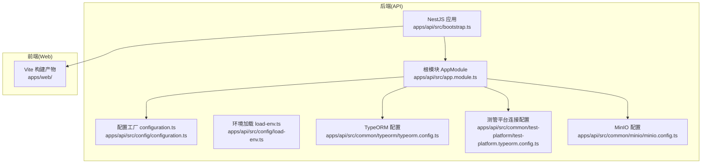
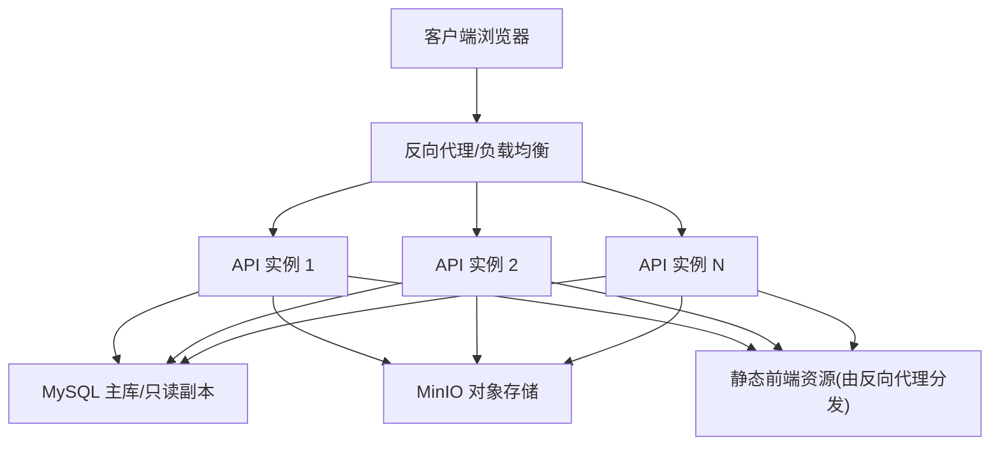
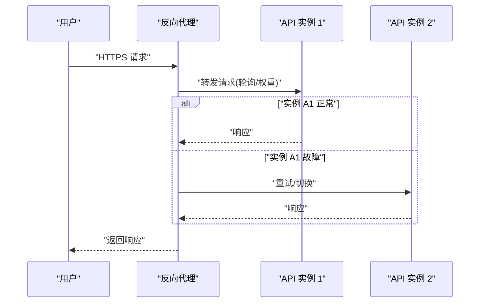
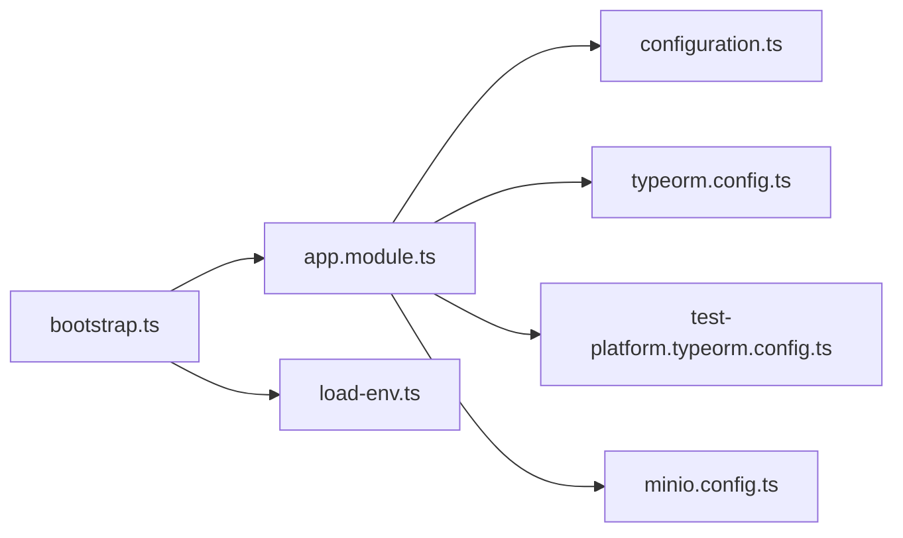

# 生产环境运维

<cite>
**本文引用的文件**
- [apps/api/src/bootstrap.ts](file://apps/api/src/bootstrap.ts)
- [apps/api/src/app.module.ts](file://apps/api/src/app.module.ts)
- [apps/api/src/config/configuration.ts](file://apps/api/src/config/configuration.ts)
- [apps/api/src/config/load-env.ts](file://apps/api/src/config/load-env.ts)
- [apps/api/src/common/typeorm/typeorm.config.ts](file://apps/api/src/common/typeorm/typeorm.config.ts)
- [apps/api/src/common/test-platform/test-platform.typeorm.config.ts](file://apps/api/src/common/test-platform/test-platform.typeorm.config.ts)
- [apps/api/src/common/minio/minio.config.ts](file://apps/api/src/common/minio/minio.config.ts)
- [apps/api/package.json](file://apps/api/package.json)
- [apps/web/package.json](file://apps/web/package.json)
- [apps/api/nest-cli.json](file://apps/api/nest-cli.json)
</cite>

## 目录
1. [简介](#简介)
2. [项目结构](#项目结构)
3. [核心组件](#核心组件)
4. [架构总览](#架构总览)
5. [详细组件分析](#详细组件分析)
6. [依赖关系分析](#依赖关系分析)
7. [性能考虑](#性能考虑)
8. [故障排查指南](#故障排查指南)
9. [结论](#结论)
10. [附录](#附录)

## 简介
本文件面向 CaseForge 生产环境运维，围绕基础设施要求、网络与安全策略、高可用与负载均衡、域名与 SSL 管理、性能优化与安全加固等方面，结合代码库中的配置与实现，提供可落地的运维指导。文档同时给出关键流程的时序图与架构图，帮助不同技术背景的读者快速理解与实施。

## 项目结构
CaseForge 采用多包工作区组织，后端基于 NestJS，前端基于 Vue3 + Vite。生产部署建议将后端 API 与静态前端分别独立部署，通过反向代理统一对外提供服务。

图表来源
- [apps/api/src/bootstrap.ts:1-64](file://apps/api/src/bootstrap.ts#L1-L64)
- [apps/api/src/app.module.ts:1-48](file://apps/api/src/app.module.ts#L1-L48)
- [apps/api/src/config/configuration.ts:1-49](file://apps/api/src/config/configuration.ts#L1-L49)
- [apps/api/src/common/typeorm/typeorm.config.ts:1-43](file://apps/api/src/common/typeorm/typeorm.config.ts#L1-L43)
- [apps/api/src/common/test-platform/test-platform.typeorm.config.ts:1-30](file://apps/api/src/common/test-platform/test-platform.typeorm.config.ts#L1-L30)
- [apps/api/src/common/minio/minio.config.ts:1-38](file://apps/api/src/common/minio/minio.config.ts#L1-L38)

章节来源
- [apps/api/src/bootstrap.ts:1-64](file://apps/api/src/bootstrap.ts#L1-L64)
- [apps/api/src/app.module.ts:1-48](file://apps/api/src/app.module.ts#L1-L48)
- [apps/api/src/config/configuration.ts:1-49](file://apps/api/src/config/configuration.ts#L1-L49)
- [apps/api/src/config/load-env.ts:1-55](file://apps/api/src/config/load-env.ts#L1-L55)
- [apps/api/src/common/typeorm/typeorm.config.ts:1-43](file://apps/api/src/common/typeorm/typeorm.config.ts#L1-L43)
- [apps/api/src/common/test-platform/test-platform.typeorm.config.ts:1-30](file://apps/api/src/common/test-platform/test-platform.typeorm.config.ts#L1-L30)
- [apps/api/src/common/minio/minio.config.ts:1-38](file://apps/api/src/common/minio/minio.config.ts#L1-L38)
- [apps/api/package.json:1-64](file://apps/api/package.json#L1-L64)
- [apps/web/package.json:1-46](file://apps/web/package.json#L1-L46)
- [apps/api/nest-cli.json:1-20](file://apps/api/nest-cli.json#L1-L20)

## 核心组件
- 应用启动与中间件
  - 启动入口负责加载环境、预同步 Schema、设置全局前缀与版本化、注册校验管道与 Swagger 文档。
  - 全局中间件包括用户上下文与访问日志，便于审计与排障。
- 配置体系
  - 通过 ConfigModule 与配置工厂从环境变量解析应用配置；支持多环境 env 文件按优先级加载。
- 数据持久层
  - 主库使用 MySQL，实体扫描路径集中；测管平台库使用独立连接命名，避免冲突。
- 存储层
  - MinIO 对象存储配置项集中于配置工厂，便于生产环境替换为外部对象存储。
- 前端构建
  - Web 包基于 Vite，生产构建输出静态资源，建议由反向代理统一分发。

章节来源
- [apps/api/src/bootstrap.ts:18-61](file://apps/api/src/bootstrap.ts#L18-L61)
- [apps/api/src/app.module.ts:42-46](file://apps/api/src/app.module.ts#L42-L46)
- [apps/api/src/config/configuration.ts:7-48](file://apps/api/src/config/configuration.ts#L7-L48)
- [apps/api/src/config/load-env.ts:32-54](file://apps/api/src/config/load-env.ts#L32-L54)
- [apps/api/src/common/typeorm/typeorm.config.ts:15-42](file://apps/api/src/common/typeorm/typeorm.config.ts#L15-L42)
- [apps/api/src/common/test-platform/test-platform.typeorm.config.ts:11-29](file://apps/api/src/common/test-platform/test-platform.typeorm.config.ts#L11-L29)
- [apps/api/src/common/minio/minio.config.ts:25-37](file://apps/api/src/common/minio/minio.config.ts#L25-L37)
- [apps/web/package.json:6-13](file://apps/web/package.json#L6-L13)

## 架构总览
生产环境推荐“反向代理 + 多实例 API + 对象存储 + 数据库”的解耦架构。反向代理统一接入域名与 TLS 终止，后端以容器或裸机多实例部署，实现高可用与弹性扩容。

说明
- 反向代理负责域名解析、TLS 终止、健康检查与会话保持。
- API 实例之间无状态，共享数据库与对象存储。
- 前端静态资源由反向代理统一托管，减少后端压力。

## 详细组件分析

### 1) 基础设施与服务器规格
- 计算规格
  - 至少 2C4G 起步，根据并发与 AI 工作流负载评估 CPU 与内存；I/O 密集场景建议 SSD。
  - 推荐每实例 2-4 核心，配合水平扩展与反向代理实现弹性。
- 存储
  - 数据库建议独立挂载高性能磁盘；对象存储建议分布式部署并开启冗余。
- 网络
  - 开放端口：反向代理 80/443；API 实例 34550（默认）；数据库 3306；MinIO 9000。
  - 建议内网隔离数据库与对象存储，仅暴露反向代理至公网。
- 操作系统
  - Linux（CentOS/Ubuntu），内核参数按生产环境优化（文件句柄、TIME_WAIT 等）。

### 2) 网络配置与安全策略
- 防火墙
  - 仅开放反向代理 80/443；API 实例仅对内网开放；数据库与 MinIO 仅限内网访问。
- 安全组/ACL
  - 限制源 IP 白名单；对 API 端点启用速率限制与 WAF。
- 传输安全
  - 所有外部通信启用 TLS；内部服务间建议 mTLS 或私有网络。
- 审计与日志
  - 启用访问日志与错误日志；集中化收集（ELK/Splunk）；敏感字段脱敏。

### 3) 负载均衡与高可用部署
- 反向代理
  - 使用 Nginx/HAProxy/Tengine，配置健康检查与会话保持（若需要）。
  - 健康检查路径：/api/v1（或自定义存活探针）。
- 会话管理
  - API 无状态设计，无需粘性会话；会话相关状态建议移至 Redis（需额外配置）。
- 故障转移
  - 多实例部署，实例下线不影响整体服务；结合 DNS 轮询或外部负载均衡实现自动切换。
- 版本化与灰度
  - URI 版本化已启用，便于灰度发布与平滑迁移。

章节来源
- [apps/api/src/bootstrap.ts:37-41](file://apps/api/src/bootstrap.ts#L37-L41)
- [apps/api/src/app.module.ts:42-46](file://apps/api/src/app.module.ts#L42-L46)

### 4) 域名配置与 SSL 证书管理
- 域名解析
  - 将域名指向反向代理；建议配置 AAAA 记录支持 IPv6。
- 证书申请与续期
  - 使用 ACME 协议（Let’s Encrypt）自动化申请与续期；建议使用 Certbot 或 Caddy 自动化。
- 证书监控
  - 监控证书到期时间与链路完整性；异常告警与自动通知。
- 反向代理配置要点
  - TLS 终止，启用强密码套件与协议版本；开启 HSTS（谨慎配置）。

### 5) 性能优化策略
- 缓存
  - 静态资源由反向代理缓存；API 层可引入 Redis 缓存热点数据（需新增配置）。
- 连接池
  - 数据库连接池数量按并发与 QPS 评估；避免过度连接导致资源耗尽。
  - 对象存储客户端连接池参数按吞吐量调整。
- 资源调优
  - Node.js 堆大小与 GC 参数按峰值内存调优；启用压缩（gzip/br）提升传输效率。
  - 前端资源启用长期缓存与 CDN 加速。

### 6) 安全加固
- 防火墙与 IDS/IPS
  - 部署主机防火墙与网络 IDS；对异常流量进行阻断与记录。
- 入侵检测
  - 结合 WAF 与日志分析，识别异常请求模式。
- 数据加密
  - 静态数据加密（磁盘级）；传输层强制 TLS；密钥轮换与最小权限原则。

## 依赖关系分析
后端应用通过配置工厂与模块装配形成清晰的依赖关系，便于在生产中替换外部依赖（数据库、对象存储）。

图表来源
- [apps/api/src/bootstrap.ts:10-16](file://apps/api/src/bootstrap.ts#L10-L16)
- [apps/api/src/app.module.ts:21-38](file://apps/api/src/app.module.ts#L21-L38)
- [apps/api/src/config/configuration.ts:6-48](file://apps/api/src/config/configuration.ts#L6-L48)
- [apps/api/src/common/typeorm/typeorm.config.ts:15-42](file://apps/api/src/common/typeorm/typeorm.config.ts#L15-L42)
- [apps/api/src/common/test-platform/test-platform.typeorm.config.ts:11-29](file://apps/api/src/common/test-platform/test-platform.typeorm.config.ts#L11-L29)
- [apps/api/src/common/minio/minio.config.ts:25-37](file://apps/api/src/common/minio/minio.config.ts#L25-L37)
- [apps/api/src/config/load-env.ts:32-54](file://apps/api/src/config/load-env.ts#L32-L54)

章节来源
- [apps/api/src/bootstrap.ts:10-16](file://apps/api/src/bootstrap.ts#L10-L16)
- [apps/api/src/app.module.ts:21-38](file://apps/api/src/app.module.ts#L21-L38)
- [apps/api/src/config/configuration.ts:6-48](file://apps/api/src/config/configuration.ts#L6-L48)
- [apps/api/src/common/typeorm/typeorm.config.ts:15-42](file://apps/api/src/common/typeorm/typeorm.config.ts#L15-L42)
- [apps/api/src/common/test-platform/test-platform.typeorm.config.ts:11-29](file://apps/api/src/common/test-platform/test-platform.typeorm.config.ts#L11-L29)
- [apps/api/src/common/minio/minio.config.ts:25-37](file://apps/api/src/common/minio/minio.config.ts#L25-L37)
- [apps/api/src/config/load-env.ts:32-54](file://apps/api/src/config/load-env.ts#L32-L54)

## 性能考虑
- 启动与初始化
  - 预同步 Schema 与全局中间件在启动阶段完成，建议在容器编排中设置优雅停机与延迟启动。
- 请求处理
  - JSON/URL 编码大小限制已设置，避免超大请求导致内存压力。
- 数据库
  - 生产环境关闭自动同步，使用迁移工具维护结构；连接池参数需结合并发与 QPS 调整。
- 对象存储
  - MinIO 配置集中化，便于替换为云厂商对象存储或自建集群。

章节来源
- [apps/api/src/bootstrap.ts:19-35](file://apps/api/src/bootstrap.ts#L19-L35)
- [apps/api/src/common/typeorm/typeorm.config.ts:26-27](file://apps/api/src/common/typeorm/typeorm.config.ts#L26-L27)
- [apps/api/src/common/minio/minio.config.ts:25-37](file://apps/api/src/common/minio/minio.config.ts#L25-L37)

## 故障排查指南
- 环境变量未生效
  - 检查 env 文件优先级与注释格式；确认加载函数仅加载首个存在文件且不覆盖已有变量。
- 数据库连接失败
  - 核对 TYPEORM_* 环境变量；确认主库/只读副本可达；检查连接池上限与慢查询。
- 对象存储不可用
  - 校验 MINIO_* 配置；确认桶名与公共访问基地址；检查网络连通性。
- API 无法访问
  - 检查全局前缀与版本化路由；确认反向代理健康检查路径与端口映射。

章节来源
- [apps/api/src/config/load-env.ts:32-54](file://apps/api/src/config/load-env.ts#L32-L54)
- [apps/api/src/config/configuration.ts:10-34](file://apps/api/src/config/configuration.ts#L10-L34)
- [apps/api/src/common/typeorm/typeorm.config.ts:18-31](file://apps/api/src/common/typeorm/typeorm.config.ts#L18-L31)
- [apps/api/src/common/test-platform/test-platform.typeorm.config.ts:14-29](file://apps/api/src/common/test-platform/test-platform.typeorm.config.ts#L14-L29)

## 结论
通过明确的基础设施规划、严格的网络与安全策略、高可用的负载均衡方案、完善的域名与证书管理以及针对性的性能优化与安全加固，CaseForge 可在生产环境中稳定高效地运行。建议结合本文档与实际业务规模，制定详细的部署清单与应急预案。

## 附录
- 关键端口
  - 反向代理：80/443
  - API 实例：34550（默认）
  - 数据库：3306
  - 对象存储：9000
- 建议工具链
  - 反向代理：Nginx/Tengine
  - 证书：ACME(Certbot/Caddy)
  - 日志与监控：Prometheus/Grafana/ELK
  - 容器编排：Docker/Kubernetes