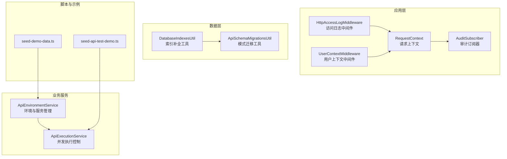
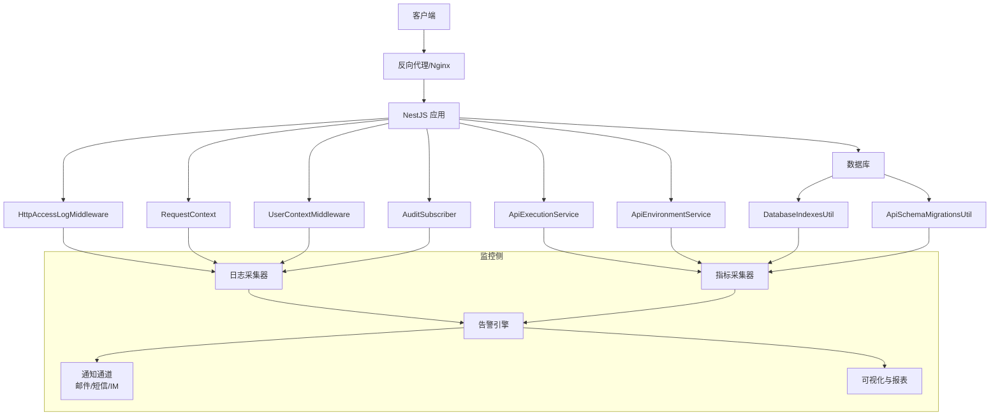
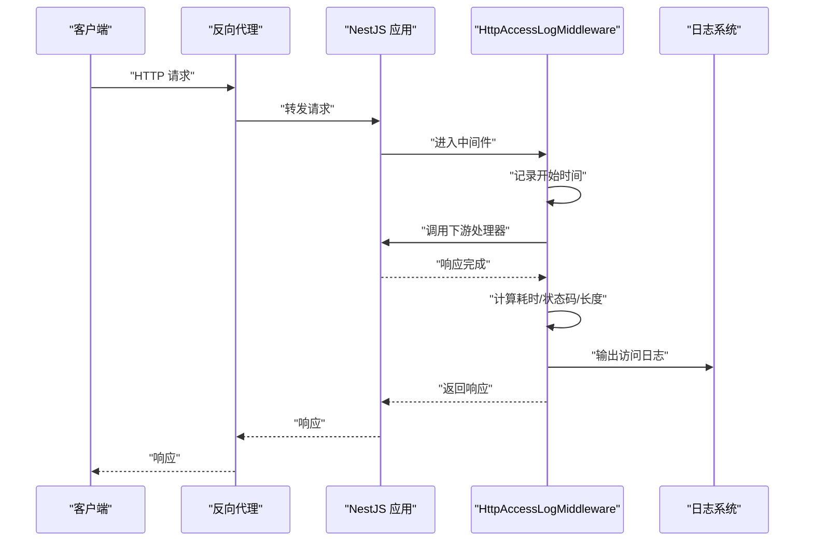
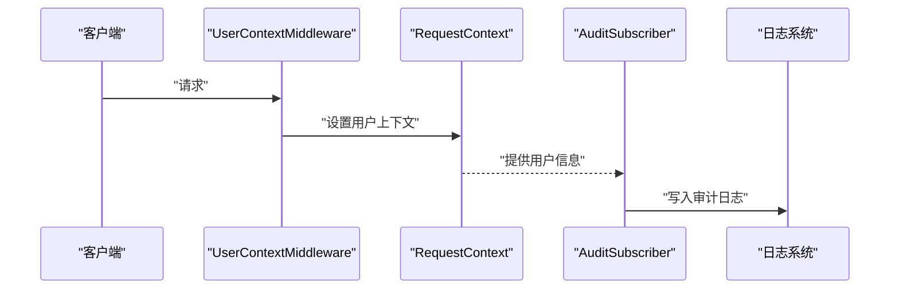
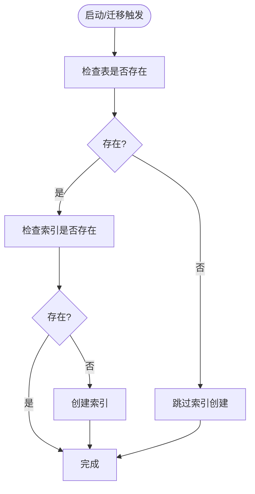
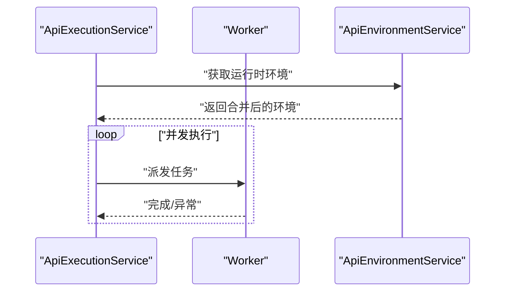
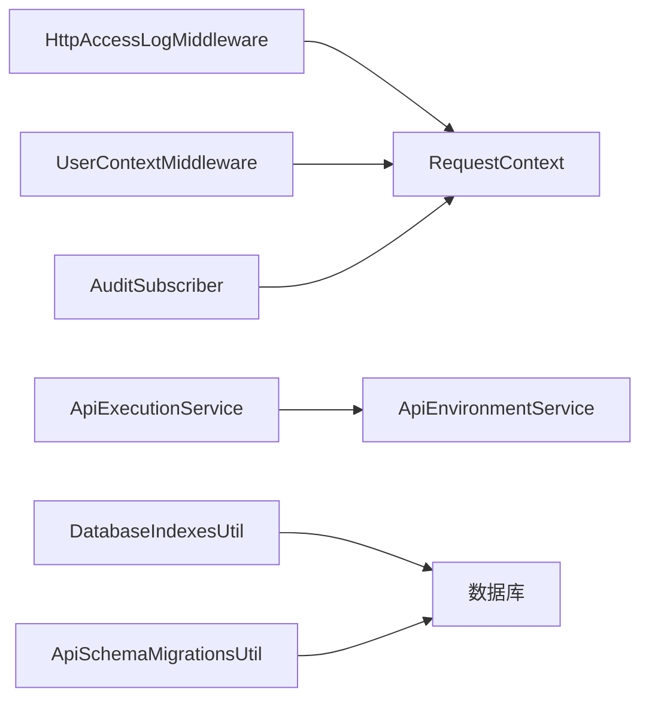

# 监控告警

<cite>
**本文引用的文件**
- [apps/api/src/common/http/http-access-log.middleware.ts](file://apps/api/src/common/http/http-access-log.middleware.ts)
- [apps/api/src/common/audit/request-context.ts](file://apps/api/src/common/audit/request-context.ts)
- [apps/api/src/common/audit/user-context.middleware.ts](file://apps/api/src/common/audit/user-context.middleware.ts)
- [apps/api/src/common/audit/user-scope.ts](file://apps/api/src/common/audit/user-scope.ts)
- [apps/api/src/common/audit/audit.subscriber.ts](file://apps/api/src/common/audit/audit.subscriber.ts)
- [apps/api/src/common/typeorm/database-indexes.util.ts](file://apps/api/src/common/typeorm/database-indexes.util.ts)
- [apps/api/src/common/typeorm/api-schema-migrations.util.ts](file://apps/api/src/common/typeorm/api-schema-migrations.util.ts)
- [apps/api/src/modules/api-test/service/api-execution.service.ts](file://apps/api/src/modules/api-test/service/api-execution.service.ts)
- [apps/api/src/modules/api-test/service/api-environment.service.ts](file://apps/api/src/modules/api-test/service/api-environment.service.ts)
- [apps/api/scripts/seed-api-test-demo.ts](file://apps/api/scripts/seed-api-test-demo.ts)
- [apps/api/scripts/seed-demo-data.ts](file://apps/api/scripts/seed-demo-data.ts)
</cite>

## 目录
1. [简介](#简介)
2. [项目结构](#项目结构)
3. [核心组件](#核心组件)
4. [架构总览](#架构总览)
5. [详细组件分析](#详细组件分析)
6. [依赖分析](#依赖分析)
7. [性能考虑](#性能考虑)
8. [故障排查指南](#故障排查指南)
9. [结论](#结论)
10. [附录](#附录)

## 简介
本文件面向 CaseForge 应用，构建一套完整的监控告警体系，覆盖应用性能监控、日志收集与分析、告警规则与通知机制、基础设施监控以及监控数据可视化与报表生成。文档以现有代码库中的访问日志中间件、审计上下文与订阅器、数据库索引与迁移工具、并发执行与环境变量处理等模块为基础，提出可落地的监控方案，并给出与实际源码映射的架构图与时序图。

## 项目结构
从监控视角，以下模块与监控告警密切相关：
- HTTP 访问日志中间件：统一记录请求方法、路径、状态码、耗时、用户与来源 IP。
- 审计上下文与中间件：在请求生命周期内注入用户信息，便于日志关联与审计。
- 审计订阅器：基于 ORM 事件对实体变更进行审计记录，支撑审计日志。
- 数据库索引与迁移工具：保障查询性能与稳定性，降低慢查询风险。
- 并发执行与环境管理：影响系统吞吐与稳定性，是性能基线与异常检测的关键入口。
- 示例脚本：提供测试数据与场景，便于验证监控与告警效果。

图表来源
- [apps/api/src/common/http/http-access-log.middleware.ts:1-46](file://apps/api/src/common/http/http-access-log.middleware.ts#L1-L46)
- [apps/api/src/common/audit/request-context.ts:1-200](file://apps/api/src/common/audit/request-context.ts)
- [apps/api/src/common/audit/user-context.middleware.ts:1-200](file://apps/api/src/common/audit/user-context.middleware.ts)
- [apps/api/src/common/audit/audit.subscriber.ts:1-200](file://apps/api/src/common/audit/audit.subscriber.ts)
- [apps/api/src/common/typeorm/database-indexes.util.ts:1-48](file://apps/api/src/common/typeorm/database-indexes.util.ts#L1-L48)
- [apps/api/src/common/typeorm/api-schema-migrations.util.ts:123-165](file://apps/api/src/common/typeorm/api-schema-migrations.util.ts#L123-L165)
- [apps/api/src/modules/api-test/service/api-environment.service.ts:1-186](file://apps/api/src/modules/api-test/service/api-environment.service.ts#L1-L186)
- [apps/api/src/modules/api-test/service/api-execution.service.ts:272-315](file://apps/api/src/modules/api-test/service/api-execution.service.ts#L272-L315)
- [apps/api/scripts/seed-api-test-demo.ts:288-330](file://apps/api/scripts/seed-api-test-demo.ts#L288-L330)
- [apps/api/scripts/seed-demo-data.ts:28-68](file://apps/api/scripts/seed-demo-data.ts#L28-L68)

章节来源
- [apps/api/src/common/http/http-access-log.middleware.ts:1-46](file://apps/api/src/common/http/http-access-log.middleware.ts#L1-L46)
- [apps/api/src/common/audit/request-context.ts:1-200](file://apps/api/src/common/audit/request-context.ts)
- [apps/api/src/common/audit/user-context.middleware.ts:1-200](file://apps/api/src/common/audit/user-context.middleware.ts)
- [apps/api/src/common/audit/audit.subscriber.ts:1-200](file://apps/api/src/common/audit/audit.subscriber.ts)
- [apps/api/src/common/typeorm/database-indexes.util.ts:1-48](file://apps/api/src/common/typeorm/database-indexes.util.ts#L1-L48)
- [apps/api/src/common/typeorm/api-schema-migrations.util.ts:123-165](file://apps/api/src/common/typeorm/api-schema-migrations.util.ts#L123-L165)
- [apps/api/src/modules/api-test/service/api-environment.service.ts:1-186](file://apps/api/src/modules/api-test/service/api-environment.service.ts#L1-L186)
- [apps/api/src/modules/api-test/service/api-execution.service.ts:272-315](file://apps/api/src/modules/api-test/service/api-execution.service.ts#L272-L315)
- [apps/api/scripts/seed-api-test-demo.ts:288-330](file://apps/api/scripts/seed-api-test-demo.ts#L288-L330)
- [apps/api/scripts/seed-demo-data.ts:28-68](file://apps/api/scripts/seed-demo-data.ts#L28-L68)

## 核心组件
- 访问日志中间件：在响应完成时记录方法、路径、状态码、耗时、用户与来源 IP，形成统一的访问日志来源。
- 审计上下文与中间件：在请求进入时注入用户信息，在审计订阅器中用于记录操作人。
- 审计订阅器：监听实体变更事件，输出审计日志，便于追踪与回溯。
- 数据库索引与迁移工具：幂等补全热点表索引，确保查询性能；迁移工具保证模式一致性与稳定性。
- 并发执行与环境管理：通过并发控制与环境变量/密钥管理，影响系统吞吐与安全性。
- 示例脚本：提供测试数据与场景，便于验证监控与告警策略。

章节来源
- [apps/api/src/common/http/http-access-log.middleware.ts:1-46](file://apps/api/src/common/http/http-access-log.middleware.ts#L1-L46)
- [apps/api/src/common/audit/request-context.ts:1-200](file://apps/api/src/common/audit/request-context.ts)
- [apps/api/src/common/audit/user-context.middleware.ts:1-200](file://apps/api/src/common/audit/user-context.middleware.ts)
- [apps/api/src/common/audit/audit.subscriber.ts:1-200](file://apps/api/src/common/audit/audit.subscriber.ts)
- [apps/api/src/common/typeorm/database-indexes.util.ts:1-48](file://apps/api/src/common/typeorm/database-indexes.util.ts#L1-L48)
- [apps/api/src/common/typeorm/api-schema-migrations.util.ts:123-165](file://apps/api/src/common/typeorm/api-schema-migrations.util.ts#L123-L165)
- [apps/api/src/modules/api-test/service/api-execution.service.ts:272-315](file://apps/api/src/modules/api-test/service/api-execution.service.ts#L272-L315)
- [apps/api/src/modules/api-test/service/api-environment.service.ts:1-186](file://apps/api/src/modules/api-test/service/api-environment.service.ts#L1-L186)
- [apps/api/scripts/seed-api-test-demo.ts:288-330](file://apps/api/scripts/seed-api-test-demo.ts#L288-L330)
- [apps/api/scripts/seed-demo-data.ts:28-68](file://apps/api/scripts/seed-demo-data.ts#L28-L68)

## 架构总览
下图展示了监控告警体系在 CaseForge 中的落地位置与交互关系：访问日志中间件负责采集 HTTP 层面的访问行为；审计上下文与订阅器负责业务层面的操作审计；数据库工具保障查询性能与模式稳定；并发执行与环境管理影响系统整体性能与安全；示例脚本用于验证监控与告警效果。

图表来源
- [apps/api/src/common/http/http-access-log.middleware.ts:1-46](file://apps/api/src/common/http/http-access-log.middleware.ts#L1-L46)
- [apps/api/src/common/audit/request-context.ts:1-200](file://apps/api/src/common/audit/request-context.ts)
- [apps/api/src/common/audit/user-context.middleware.ts:1-200](file://apps/api/src/common/audit/user-context.middleware.ts)
- [apps/api/src/common/audit/audit.subscriber.ts:1-200](file://apps/api/src/common/audit/audit.subscriber.ts)
- [apps/api/src/common/typeorm/database-indexes.util.ts:1-48](file://apps/api/src/common/typeorm/database-indexes.util.ts#L1-L48)
- [apps/api/src/common/typeorm/api-schema-migrations.util.ts:123-165](file://apps/api/src/common/typeorm/api-schema-migrations.util.ts#L123-L165)
- [apps/api/src/modules/api-test/service/api-execution.service.ts:272-315](file://apps/api/src/modules/api-test/service/api-execution.service.ts#L272-L315)
- [apps/api/src/modules/api-test/service/api-environment.service.ts:1-186](file://apps/api/src/modules/api-test/service/api-environment.service.ts#L1-L186)

## 详细组件分析

### 访问日志中间件
- 作用：在响应完成阶段计算耗时，记录方法、路径、状态码、内容长度、用户与来源 IP，形成统一的访问日志。
- 关键点：使用请求上下文获取用户名；解析 X-Forwarded-For 获取真实来源 IP；在 finish 事件中输出日志。
- 监控价值：可用于 QPS、P95/P99 响应时间、错误率、用户与来源 IP 的聚合分析。

图表来源
- [apps/api/src/common/http/http-access-log.middleware.ts:1-46](file://apps/api/src/common/http/http-access-log.middleware.ts#L1-L46)

章节来源
- [apps/api/src/common/http/http-access-log.middleware.ts:1-46](file://apps/api/src/common/http/http-access-log.middleware.ts#L1-L46)

### 审计上下文与用户中间件
- 请求上下文：在请求进入时注入用户信息，供审计订阅器与日志使用。
- 用户上下文中间件：确保后续流程能读取当前用户身份。
- 审计订阅器：监听实体变更事件，输出审计日志，便于追踪操作人与变更详情。

图表来源
- [apps/api/src/common/audit/user-context.middleware.ts:1-200](file://apps/api/src/common/audit/user-context.middleware.ts)
- [apps/api/src/common/audit/request-context.ts:1-200](file://apps/api/src/common/audit/request-context.ts)
- [apps/api/src/common/audit/audit.subscriber.ts:1-200](file://apps/api/src/common/audit/audit.subscriber.ts)

章节来源
- [apps/api/src/common/audit/user-context.middleware.ts:1-200](file://apps/api/src/common/audit/user-context.middleware.ts)
- [apps/api/src/common/audit/request-context.ts:1-200](file://apps/api/src/common/audit/request-context.ts)
- [apps/api/src/common/audit/audit.subscriber.ts:1-200](file://apps/api/src/common/audit/audit.subscriber.ts)

### 数据库索引与模式迁移
- 索引补全工具：幂等检查并创建热点表索引，避免重复索引与锁表风险。
- 模式迁移工具：确保唯一索引、列存在性与类型一致，兼容历史版本差异。

图表来源
- [apps/api/src/common/typeorm/database-indexes.util.ts:1-48](file://apps/api/src/common/typeorm/database-indexes.util.ts#L1-L48)
- [apps/api/src/common/typeorm/api-schema-migrations.util.ts:123-165](file://apps/api/src/common/typeorm/api-schema-migrations.util.ts#L123-L165)

章节来源
- [apps/api/src/common/typeorm/database-indexes.util.ts:1-48](file://apps/api/src/common/typeorm/database-indexes.util.ts#L1-L48)
- [apps/api/src/common/typeorm/api-schema-migrations.util.ts:123-165](file://apps/api/src/common/typeorm/api-schema-migrations.util.ts#L123-L165)

### 并发执行与环境管理
- 并发执行：通过并发池控制任务执行节奏，避免瞬时压力过大。
- 环境管理：合并基础环境与服务级环境，支持动态配置与密钥加密/解密。

图表来源
- [apps/api/src/modules/api-test/service/api-execution.service.ts:272-315](file://apps/api/src/modules/api-test/service/api-execution.service.ts#L272-L315)
- [apps/api/src/modules/api-test/service/api-environment.service.ts:92-135](file://apps/api/src/modules/api-test/service/api-environment.service.ts#L92-L135)

章节来源
- [apps/api/src/modules/api-test/service/api-execution.service.ts:272-315](file://apps/api/src/modules/api-test/service/api-execution.service.ts#L272-L315)
- [apps/api/src/modules/api-test/service/api-environment.service.ts:92-135](file://apps/api/src/modules/api-test/service/api-environment.service.ts#L92-L135)

### 示例脚本与测试场景
- 种子脚本：构造 API 测试运行与断言场景，便于验证监控与告警策略在不同状态下的表现。
- 演示数据：包含日志采集与批量提交等测试要点，有助于验证异常捕获与恢复机制。

章节来源
- [apps/api/scripts/seed-api-test-demo.ts:288-330](file://apps/api/scripts/seed-api-test-demo.ts#L288-L330)
- [apps/api/scripts/seed-demo-data.ts:28-68](file://apps/api/scripts/seed-demo-data.ts#L28-L68)

## 依赖分析
- 组件耦合：访问日志中间件依赖请求上下文；审计订阅器依赖请求上下文提供用户信息；并发执行依赖环境服务提供的运行时配置。
- 外部依赖：数据库索引与迁移工具依赖底层 SQL 执行能力；日志系统依赖外部采集器与存储。
- 潜在环路：当前模块间无明显循环依赖，但需注意日志与审计写入对数据库的影响。

图表来源
- [apps/api/src/common/http/http-access-log.middleware.ts:1-46](file://apps/api/src/common/http/http-access-log.middleware.ts#L1-L46)
- [apps/api/src/common/audit/request-context.ts:1-200](file://apps/api/src/common/audit/request-context.ts)
- [apps/api/src/common/audit/user-context.middleware.ts:1-200](file://apps/api/src/common/audit/user-context.middleware.ts)
- [apps/api/src/common/audit/audit.subscriber.ts:1-200](file://apps/api/src/common/audit/audit.subscriber.ts)
- [apps/api/src/modules/api-test/service/api-execution.service.ts:272-315](file://apps/api/src/modules/api-test/service/api-execution.service.ts#L272-L315)
- [apps/api/src/modules/api-test/service/api-environment.service.ts:1-186](file://apps/api/src/modules/api-test/service/api-environment.service.ts#L1-L186)
- [apps/api/src/common/typeorm/database-indexes.util.ts:1-48](file://apps/api/src/common/typeorm/database-indexes.util.ts#L1-L48)
- [apps/api/src/common/typeorm/api-schema-migrations.util.ts:123-165](file://apps/api/src/common/typeorm/api-schema-migrations.util.ts#L123-L165)

章节来源
- [apps/api/src/common/http/http-access-log.middleware.ts:1-46](file://apps/api/src/common/http/http-access-log.middleware.ts#L1-L46)
- [apps/api/src/common/audit/request-context.ts:1-200](file://apps/api/src/common/audit/request-context.ts)
- [apps/api/src/common/audit/user-context.middleware.ts:1-200](file://apps/api/src/common/audit/user-context.middleware.ts)
- [apps/api/src/common/audit/audit.subscriber.ts:1-200](file://apps/api/src/common/audit/audit.subscriber.ts)
- [apps/api/src/modules/api-test/service/api-execution.service.ts:272-315](file://apps/api/src/modules/api-test/service/api-execution.service.ts#L272-L315)
- [apps/api/src/modules/api-test/service/api-environment.service.ts:1-186](file://apps/api/src/modules/api-test/service/api-environment.service.ts#L1-L186)
- [apps/api/src/common/typeorm/database-indexes.util.ts:1-48](file://apps/api/src/common/typeorm/database-indexes.util.ts#L1-L48)
- [apps/api/src/common/typeorm/api-schema-migrations.util.ts:123-165](file://apps/api/src/common/typeorm/api-schema-migrations.util.ts#L123-L165)

## 性能考虑
- 查询性能：通过索引补全工具确保热点查询具备合适索引，减少慢查询与锁等待。
- 模式一致性：使用迁移工具保证唯一索引与列存在性，避免因模式差异导致的性能波动。
- 并发控制：合理设置并发度，结合环境变量与密钥管理，避免资源争用与超时。
- 日志开销：访问日志中间件输出细粒度信息，建议在高流量场景开启采样或异步落盘。

## 故障排查指南
- 访问日志缺失：确认中间件是否正确注册，finish 事件是否触发；检查日志级别与输出目标。
- 审计日志异常：核对请求上下文是否正确注入，订阅器是否监听到相应实体事件。
- 数据库性能问题：检查索引是否存在、唯一约束是否冲突；关注迁移过程中的异常提示。
- 并发执行异常：核对环境配置合并逻辑，确认密钥解密与变量替换是否正确；检查并发池调度是否均衡。
- 示例脚本验证：使用种子脚本构造不同状态（通过/失败/错误），验证监控与告警策略是否按预期触发。

章节来源
- [apps/api/src/common/http/http-access-log.middleware.ts:1-46](file://apps/api/src/common/http/http-access-log.middleware.ts#L1-L46)
- [apps/api/src/common/audit/request-context.ts:1-200](file://apps/api/src/common/audit/request-context.ts)
- [apps/api/src/common/audit/audit.subscriber.ts:1-200](file://apps/api/src/common/audit/audit.subscriber.ts)
- [apps/api/src/common/typeorm/database-indexes.util.ts:1-48](file://apps/api/src/common/typeorm/database-indexes.util.ts#L1-L48)
- [apps/api/src/common/typeorm/api-schema-migrations.util.ts:123-165](file://apps/api/src/common/typeorm/api-schema-migrations.util.ts#L123-L165)
- [apps/api/src/modules/api-test/service/api-execution.service.ts:272-315](file://apps/api/src/modules/api-test/service/api-execution.service.ts#L272-L315)
- [apps/api/src/modules/api-test/service/api-environment.service.ts:92-135](file://apps/api/src/modules/api-test/service/api-environment.service.ts#L92-L135)
- [apps/api/scripts/seed-api-test-demo.ts:288-330](file://apps/api/scripts/seed-api-test-demo.ts#L288-L330)
- [apps/api/scripts/seed-demo-data.ts:28-68](file://apps/api/scripts/seed-demo-data.ts#L28-L68)

## 结论
通过在现有代码基础上引入统一的日志采集、指标采集、告警规则与通知机制，并结合数据库索引与模式迁移工具，CaseForge 可实现从应用层到基础设施的全链路监控与告警。配合可视化与报表，可有效提升系统的可观测性与运维效率。

## 附录
- 监控数据可视化与报表：建议接入时序数据库与可视化面板，按天/小时维度展示 QPS、响应时间分布、错误率与资源使用趋势。
- 告警规则与通知：基于访问日志与指标数据设定阈值与滑动窗口，结合邮件、短信与即时通讯进行分级通知。
- 基础设施监控：结合服务器资源、数据库性能与存储空间监控，形成统一告警视图与根因分析。