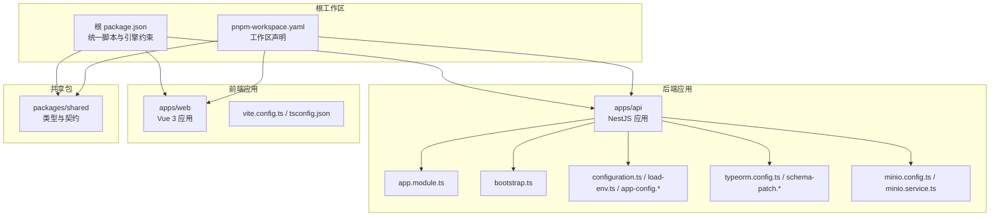
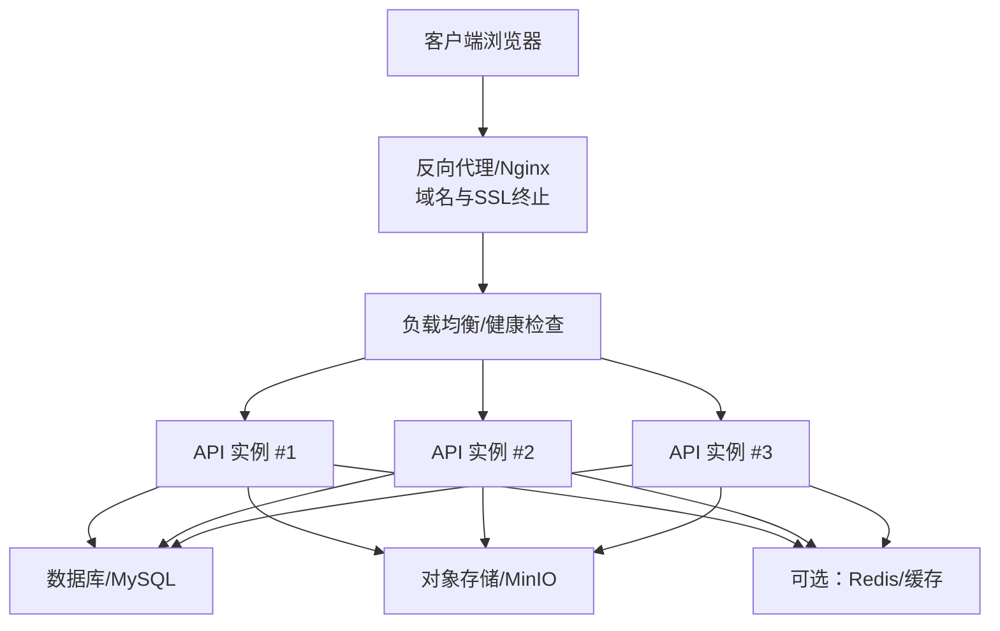
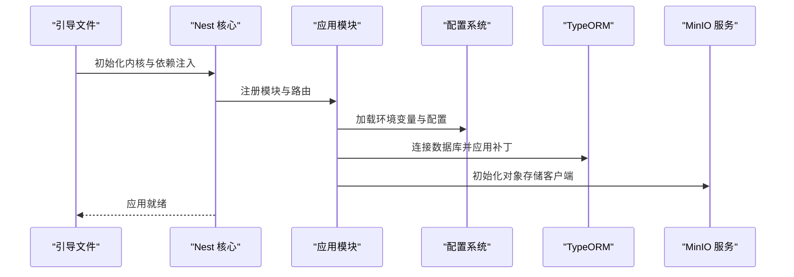
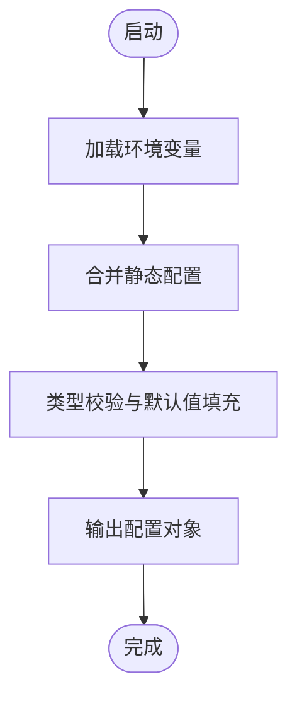
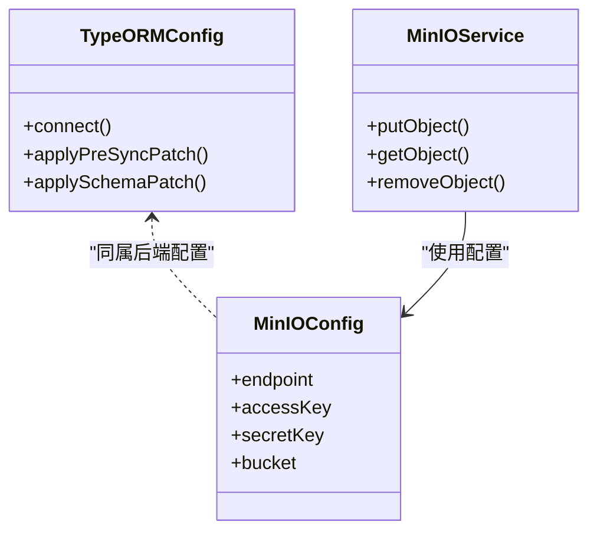
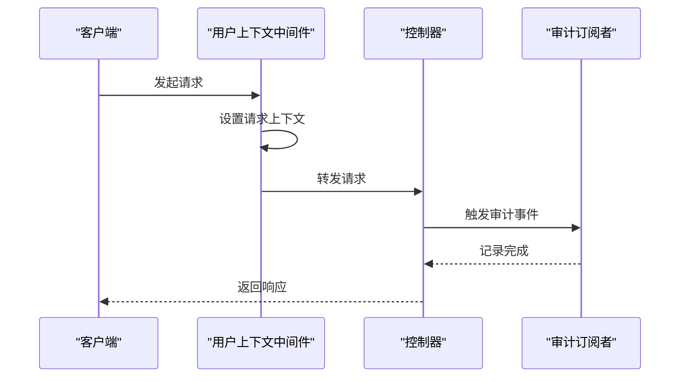
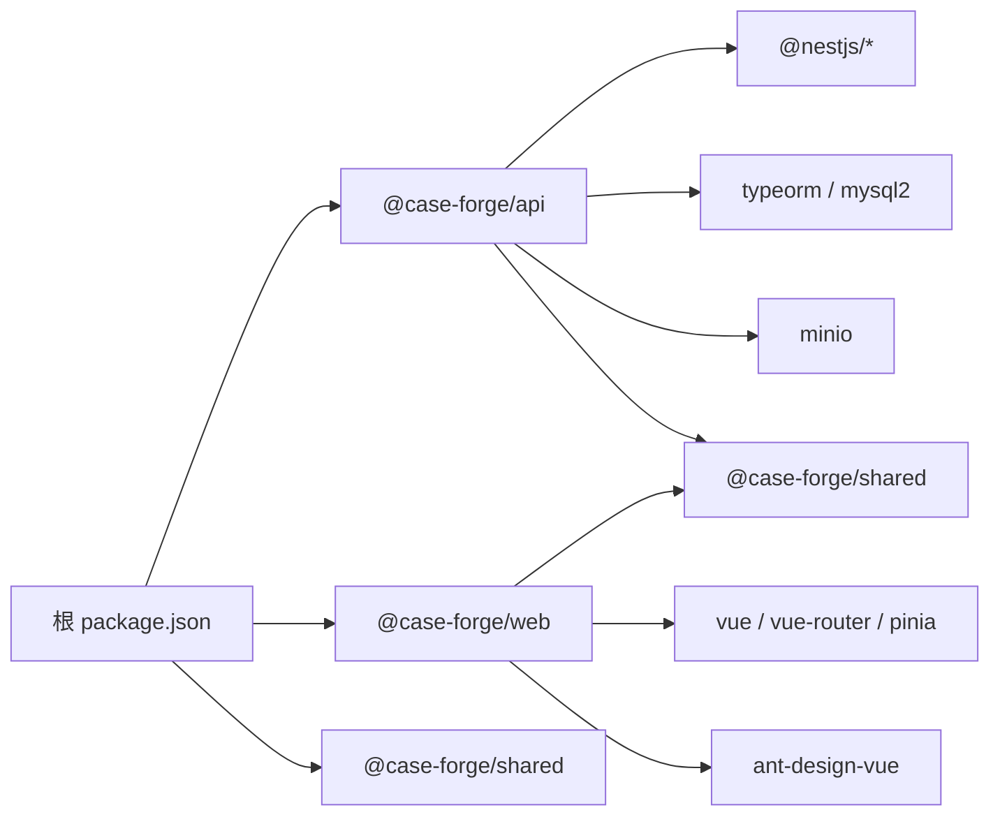

# 部署运维

<cite>
**本文引用的文件**
- [apps/api/package.json](file://apps/api/package.json)
- [apps/web/package.json](file://apps/web/package.json)
- [package.json](file://package.json)
- [packages/shared/package.json](file://packages/shared/package.json)
- [pnpm-workspace.yaml](file://pnpm-workspace.yaml)
- [apps/api/src/bootstrap.ts](file://apps/api/src/bootstrap.ts)
- [apps/api/src/app.module.ts](file://apps/api/src/app.module.ts)
- [apps/api/src/config/configuration.ts](file://apps/api/src/config/configuration.ts)
- [apps/api/src/config/load-env.ts](file://apps/api/src/config/load-env.ts)
- [apps/api/src/config/app-config.util.ts](file://apps/api/src/config/app-config.util.ts)
- [apps/api/src/config/app-config.types.ts](file://apps/api/src/config/app-config.types.ts)
- [apps/api/src/modules/project-manage/project-manage.service.ts](file://apps/api/src/modules/project-manage/project-manage.service.ts)
- [apps/api/src/utils/file.util.ts](file://apps/api/src/utils/file.util.ts)
- [apps/api/nest-cli.json](file://apps/api/nest-cli.json)
- [apps/api/tsconfig.json](file://apps/api/tsconfig.json)
- [apps/api/tsconfig.build.json](file://apps/api/tsconfig.build.json)
- [apps/web/vite.config.ts](file://apps/web/vite.config.ts)
- [apps/web/tsconfig.json](file://apps/web/tsconfig.json)
- [apps/api/scripts/seed-demo-data.ts](file://apps/api/scripts/seed-demo-data.ts)
- [apps/api/scripts/seed-api-test-demo.ts](file://apps/api/scripts/seed-api-test-demo.ts)
- [apps/api/scripts/add-database-indexes.sql](file://apps/api/scripts/add-database-indexes.sql)
- [apps/api/scripts/add-project-platform-column.sql](file://apps/api/scripts/add-project-platform-column.sql)
- [apps/api/scripts/apply-schema-patch.ts](file://apps/api/scripts/apply-schema-patch.ts)
- [apps/api/src/typeorm/typeorm.config.ts](file://apps/api/src/typeorm/typeorm.config.ts)
- [apps/api/src/typeorm/pre-sync-schema-patch.ts](file://apps/api/src/typeorm/pre-sync-schema-patch.ts)
- [apps/api/src/typeorm/schema-patch.service.ts](file://apps/api/src/typeorm/schema-patch.service.ts)
- [apps/api/src/minio/minio.config.ts](file://apps/api/src/minio/minio.config.ts)
- [apps/api/src/minio/service/minio.service.ts](file://apps/api/src/minio/service/minio.service.ts)
- [apps/api/src/http/http-access-log.middleware.ts](file://apps/api/src/http/http-access-log.middleware.ts)
- [apps/api/src/audit/user-context.middleware.ts](file://apps/api/src/audit/user-context.middleware.ts)
- [apps/api/src/audit/request-context.ts](file://apps/api/src/audit/request-context.ts)
- [apps/api/src/audit/audit.subscriber.ts](file://apps/api/src/audit/audit.subscriber.ts)
</cite>

## 目录
1. [简介](#简介)
2. [项目结构](#项目结构)
3. [核心组件](#核心组件)
4. [架构总览](#架构总览)
5. [详细组件分析](#详细组件分析)
6. [依赖分析](#依赖分析)
7. [性能考虑](#性能考虑)
8. [故障排除指南](#故障排除指南)
9. [结论](#结论)
10. [附录](#附录)

## 简介
本指南面向 CaseForge 的部署与运维团队，覆盖容器化部署（Docker）、容器编排、CI/CD 流水线设计、监控告警、数据库迁移与备份恢复、负载均衡与域名及 SSL 证书管理、运维最佳实践与性能优化等。文档以仓库现有代码为依据，结合实际可落地的工程实践，帮助团队建立稳定、可观测、可扩展的生产环境。

## 项目结构
CaseForge 采用 monorepo 结构，由以下子项目组成：
- 应用后端：NestJS 应用，负责业务逻辑、API、数据库与对象存储集成。
- 应用前端：Vue 3 前端，提供可视化工作台与交互界面。
- 共享包：TypeScript 类型与共享契约，供前后端复用。
- 根级脚本与工作区：统一开发与构建命令，约束 Node 版本与包管理器。

图示来源
- [package.json:1-22](file://package.json#L1-L22)
- [pnpm-workspace.yaml:1-4](file://pnpm-workspace.yaml#L1-L4)
- [apps/api/package.json:1-62](file://apps/api/package.json#L1-L62)
- [apps/web/package.json:1-36](file://apps/web/package.json#L1-L36)
- [packages/shared/package.json:1-25](file://packages/shared/package.json#L1-L25)

章节来源
- [package.json:1-22](file://package.json#L1-L22)
- [pnpm-workspace.yaml:1-4](file://pnpm-workspace.yaml#L1-L4)

## 核心组件
- 后端服务（NestJS）
  - 启动入口与模块组织：通过引导文件与应用模块组织依赖注入与路由。
  - 配置体系：支持环境变量加载、配置合并与类型安全的配置工具。
  - 数据层：基于 TypeORM 的实体与迁移补丁机制，支持预同步补丁与运行时补丁。
  - 对象存储：集成 MinIO，用于文档附件与大文件存储。
  - 审计与上下文：请求与用户上下文中间件，审计订阅者记录关键操作。
- 前端应用（Vue 3）
  - 构建与预览：Vite 构建，支持本地开发与产物预览。
- 共享包（TypeScript）
  - 统一类型与契约，减少重复定义，提升前后端一致性。

章节来源
- [apps/api/src/bootstrap.ts:1-50](file://apps/api/src/bootstrap.ts#L1-L50)
- [apps/api/src/app.module.ts:1-50](file://apps/api/src/app.module.ts#L1-L50)
- [apps/api/src/config/configuration.ts:1-50](file://apps/api/src/config/configuration.ts#L1-L50)
- [apps/api/src/config/load-env.ts:1-50](file://apps/api/src/config/load-env.ts#L1-L50)
- [apps/api/src/config/app-config.util.ts:1-50](file://apps/api/src/config/app-config.util.ts#L1-L50)
- [apps/api/src/typeorm/typeorm.config.ts:1-50](file://apps/api/src/typeorm/typeorm.config.ts#L1-L50)
- [apps/api/src/typeorm/schema-patch.service.ts:1-50](file://apps/api/src/typeorm/schema-patch.service.ts#L1-L50)
- [apps/api/src/minio/minio.config.ts:1-50](file://apps/api/src/minio/minio.config.ts#L1-L50)
- [apps/api/src/minio/service/minio.service.ts:1-50](file://apps/api/src/minio/service/minio.service.ts#L1-L50)
- [apps/api/src/audit/user-context.middleware.ts:1-50](file://apps/api/src/audit/user-context.middleware.ts#L1-L50)
- [apps/api/src/audit/audit.subscriber.ts:1-50](file://apps/api/src/audit/audit.subscriber.ts#L1-L50)
- [apps/web/vite.config.ts:1-50](file://apps/web/vite.config.ts#L1-L50)

## 架构总览
下图展示生产环境典型拓扑：反向代理（Nginx）作为入口，承载域名与 SSL 终止；上游为多副本后端容器；对象存储（MinIO）独立部署或容器化；数据库（MySQL）独立部署或容器化；共享缓存/消息队列视需求引入。

## 详细组件分析

### 后端启动与模块装配
- 引导流程：应用通过引导文件启动 Nest 核心，随后按模块注册控制器、服务、拦截器、中间件与订阅者。
- 模块组织：业务模块按功能域拆分，便于维护与测试；公共模块（如审计、HTTP 日志、MinIO）集中管理。

图示来源
- [apps/api/src/bootstrap.ts:1-50](file://apps/api/src/bootstrap.ts#L1-L50)
- [apps/api/src/app.module.ts:1-50](file://apps/api/src/app.module.ts#L1-L50)
- [apps/api/src/config/configuration.ts:1-50](file://apps/api/src/config/configuration.ts#L1-L50)
- [apps/api/src/typeorm/typeorm.config.ts:1-50](file://apps/api/src/typeorm/typeorm.config.ts#L1-L50)
- [apps/api/src/minio/minio.config.ts:1-50](file://apps/api/src/minio/minio.config.ts#L1-L50)

章节来源
- [apps/api/src/bootstrap.ts:1-50](file://apps/api/src/bootstrap.ts#L1-L50)
- [apps/api/src/app.module.ts:1-50](file://apps/api/src/app.module.ts#L1-L50)

### 配置体系与环境变量
- 环境加载：通过专用加载器读取环境变量，确保类型安全与默认值处理。
- 配置合并：将环境变量与静态配置合并，形成最终运行配置。
- 类型约束：使用类型工具保证配置项的正确性与可发现性。

图示来源
- [apps/api/src/config/load-env.ts:1-50](file://apps/api/src/config/load-env.ts#L1-L50)
- [apps/api/src/config/configuration.ts:1-50](file://apps/api/src/config/configuration.ts#L1-L50)
- [apps/api/src/config/app-config.util.ts:1-50](file://apps/api/src/config/app-config.util.ts#L1-L50)
- [apps/api/src/config/app-config.types.ts:1-50](file://apps/api/src/config/app-config.types.ts#L1-L50)

章节来源
- [apps/api/src/config/load-env.ts:1-50](file://apps/api/src/config/load-env.ts#L1-L50)
- [apps/api/src/config/configuration.ts:1-50](file://apps/api/src/config/configuration.ts#L1-L50)
- [apps/api/src/config/app-config.util.ts:1-50](file://apps/api/src/config/app-config.util.ts#L1-L50)
- [apps/api/src/config/app-config.types.ts:1-50](file://apps/api/src/config/app-config.types.ts#L1-L50)

### 数据库与对象存储
- 数据库：使用 TypeORM 进行连接与迁移，支持预同步补丁与运行时补丁，保障 Schema 一致性。
- 对象存储：通过 MinIO 配置与服务封装，统一上传、下载与访问控制。

图示来源
- [apps/api/src/typeorm/typeorm.config.ts:1-50](file://apps/api/src/typeorm/typeorm.config.ts#L1-L50)
- [apps/api/src/typeorm/pre-sync-schema-patch.ts:1-50](file://apps/api/src/typeorm/pre-sync-schema-patch.ts#L1-L50)
- [apps/api/src/typeorm/schema-patch.service.ts:1-50](file://apps/api/src/typeorm/schema-patch.service.ts#L1-L50)
- [apps/api/src/minio/minio.config.ts:1-50](file://apps/api/src/minio/minio.config.ts#L1-L50)
- [apps/api/src/minio/service/minio.service.ts:1-50](file://apps/api/src/minio/service/minio.service.ts#L1-L50)

章节来源
- [apps/api/src/typeorm/typeorm.config.ts:1-50](file://apps/api/src/typeorm/typeorm.config.ts#L1-L50)
- [apps/api/src/typeorm/pre-sync-schema-patch.ts:1-50](file://apps/api/src/typeorm/pre-sync-schema-patch.ts#L1-L50)
- [apps/api/src/typeorm/schema-patch.service.ts:1-50](file://apps/api/src/typeorm/schema-patch.service.ts#L1-L50)
- [apps/api/src/minio/minio.config.ts:1-50](file://apps/api/src/minio/minio.config.ts#L1-L50)
- [apps/api/src/minio/service/minio.service.ts:1-50](file://apps/api/src/minio/service/minio.service.ts#L1-L50)

### 审计与上下文
- 请求上下文：在中间件中注入请求标识，贯穿后续处理链。
- 用户上下文：记录当前用户信息，配合审计订阅者持久化审计事件。

图示来源
- [apps/api/src/audit/user-context.middleware.ts:1-50](file://apps/api/src/audit/user-context.middleware.ts#L1-L50)
- [apps/api/src/audit/audit.subscriber.ts:1-50](file://apps/api/src/audit/audit.subscriber.ts#L1-L50)

章节来源
- [apps/api/src/audit/user-context.middleware.ts:1-50](file://apps/api/src/audit/user-context.middleware.ts#L1-L50)
- [apps/api/src/audit/audit.subscriber.ts:1-50](file://apps/api/src/audit/audit.subscriber.ts#L1-L50)

### 前端构建与部署
- 构建流程：TypeScript 类型检查与 Vite 打包，生成静态资源。
- 开发与预览：本地开发服务器与产物预览，便于快速验证。

章节来源
- [apps/web/vite.config.ts:1-50](file://apps/web/vite.config.ts#L1-L50)
- [apps/web/tsconfig.json:1-50](file://apps/web/tsconfig.json#L1-L50)

## 依赖分析
- 包管理：根级使用 pnpm，并通过工作区声明聚合各子包。
- 后端依赖：NestJS、TypeORM、MinIO SDK、MySQL2 等。
- 前端依赖：Vue 3、Ant Design Vue、Axios、Pinia、Vue Router 等。
- 共享包：提供类型与契约，避免重复定义。

图示来源
- [package.json:1-22](file://package.json#L1-L22)
- [pnpm-workspace.yaml:1-4](file://pnpm-workspace.yaml#L1-L4)
- [apps/api/package.json:1-62](file://apps/api/package.json#L1-L62)
- [apps/web/package.json:1-36](file://apps/web/package.json#L1-L36)
- [packages/shared/package.json:1-25](file://packages/shared/package.json#L1-L25)

章节来源
- [package.json:1-22](file://package.json#L1-L22)
- [pnpm-workspace.yaml:1-4](file://pnpm-workspace.yaml#L1-L4)
- [apps/api/package.json:1-62](file://apps/api/package.json#L1-L62)
- [apps/web/package.json:1-36](file://apps/web/package.json#L1-L36)
- [packages/shared/package.json:1-25](file://packages/shared/package.json#L1-L25)

## 性能考虑
- 数据库
  - 使用索引与查询优化，必要时参考脚本提示进行索引补充。
  - 分库分表与只读副本视业务规模引入。
- 对象存储
  - 合理设置桶策略与访问权限，启用压缩与 CDN 缓存。
- 应用层
  - 启用 HTTP 压缩与静态资源缓存。
  - 控制并发与超时，避免长事务与阻塞操作。
- 前端
  - 代码分割与懒加载，减少首屏体积。
  - 使用 CDN 加速静态资源。

## 故障排除指南
- 启动失败
  - 检查环境变量是否正确加载与类型校验是否通过。
  - 查看配置合并后的最终配置，确认数据库与 MinIO 地址可达。
- 数据库异常
  - 确认 TypeORM 连接参数与补丁执行顺序。
  - 如需手动执行补丁脚本，请按提示在 MySQL 中执行相应 SQL。
- 对象存储问题
  - 校验 MinIO 配置与网络连通性，确认桶存在且具备写入权限。
- 审计与日志
  - 检查审计订阅者是否正常触发，确认请求上下文中间件已生效。
  - 启用访问日志中间件以便定位请求路径与耗时。

章节来源
- [apps/api/src/config/load-env.ts:1-50](file://apps/api/src/config/load-env.ts#L1-L50)
- [apps/api/src/config/configuration.ts:1-50](file://apps/api/src/config/configuration.ts#L1-L50)
- [apps/api/src/typeorm/typeorm.config.ts:1-50](file://apps/api/src/typeorm/typeorm.config.ts#L1-L50)
- [apps/api/src/minio/minio.config.ts:1-50](file://apps/api/src/minio/minio.config.ts#L1-L50)
- [apps/api/src/audit/audit.subscriber.ts:1-50](file://apps/api/src/audit/audit.subscriber.ts#L1-L50)
- [apps/api/src/http/http-access-log.middleware.ts:1-50](file://apps/api/src/http/http-access-log.middleware.ts#L1-L50)

## 结论
本指南基于仓库现有代码，给出了从容器化到 CI/CD、从监控告警到数据库治理、从负载均衡到 SSL 管理的全栈运维方案。建议在生产环境中配套引入容器编排（Kubernetes/Docker Compose）、CI/CD 平台（GitHub Actions/GitLab CI）、APM/日志/告警平台与自动化备份策略，以实现高可用与可追溯的交付闭环。

## 附录

### A. Docker 容器化部署方案
- 镜像构建
  - 后端镜像：基于 Node LTS，安装 pnpm，复制工作区，执行构建与产物复制。
  - 前端镜像：基于 Node LTS，安装 pnpm，复制工作区，执行构建，使用 Nginx 提供静态资源。
- 容器编排
  - 使用 Docker Compose 或 Kubernetes 部署：后端多副本、数据库与 MinIO 独立或容器化、Nginx 反代。
  - 暴露端口：后端 API 端口、前端静态资源端口、数据库端口、MinIO 端口。
- 环境配置
  - 通过环境变量注入数据库地址、用户名、密码、MinIO 地址与密钥、应用运行端口与日志级别。
  - 使用配置文件挂载或密钥管理服务（如 Vault/K8s Secret）保护敏感信息。

章节来源
- [apps/api/package.json:1-62](file://apps/api/package.json#L1-L62)
- [apps/web/package.json:1-36](file://apps/web/package.json#L1-L36)
- [package.json:1-22](file://package.json#L1-L22)

### B. CI/CD 流水线设计与实现
- 自动化构建
  - 触发条件：分支推送、PR 合并、标签发布。
  - 步骤：安装 pnpm、安装依赖、类型检查、单元测试、打包产物。
- 自动化测试
  - 单元测试与集成测试：在受控数据库与 MinIO 环境中执行。
- 自动化部署
  - 多环境：开发/预发布/生产，分别对应不同镜像标签与部署目标。
  - 部署策略：蓝绿/金丝雀，结合健康检查与回滚策略。

章节来源
- [apps/api/package.json:1-62](file://apps/api/package.json#L1-L62)
- [apps/web/package.json:1-36](file://apps/web/package.json#L1-L36)
- [package.json:1-22](file://package.json#L1-L22)

### C. 监控告警系统配置
- 应用性能监控（APM）
  - 接入 APM（如 Prometheus + Grafana），采集 CPU、内存、QPS、P95/P99、错误率。
- 日志收集
  - 统一日志格式与结构化输出，接入 ELK/Fluentd/Loki 收集与检索。
- 错误追踪
  - 接入错误追踪平台（如 Sentry），结合请求 ID 与用户上下文进行关联排查。

### D. 数据库迁移、备份恢复与灾难恢复
- 迁移
  - 使用 TypeORM 补丁服务与预同步补丁，确保 Schema 一致性。
  - 手动补丁：按脚本提示在 MySQL 中执行索引与列变更。
- 备份
  - 定期快照与增量备份，保留至少 3 个最近版本，异地容灾。
- 恢复
  - RPO/RTO 明确，演练恢复流程，验证数据完整性与业务可用性。

章节来源
- [apps/api/src/typeorm/schema-patch.service.ts:1-50](file://apps/api/src/typeorm/schema-patch.service.ts#L1-L50)
- [apps/api/scripts/add-database-indexes.sql:1-50](file://apps/api/scripts/add-database-indexes.sql#L1-L50)
- [apps/api/scripts/add-project-platform-column.sql:1-50](file://apps/api/scripts/add-project-platform-column.sql#L1-L50)

### E. 负载均衡、域名配置与 SSL 证书管理
- 负载均衡
  - Nginx/HAProxy/云厂商 LB，开启健康检查与会话亲和（如需要）。
- 域名与证书
  - 通过 DNS 解析到 LB；使用 ACME（Let’s Encrypt）自动签发与续期证书。
- HTTPS 强制
  - 将 HTTP 重定向至 HTTPS，启用 HSTS（谨慎配置）。

### F. 运维最佳实践
- 安全
  - 最小权限原则、密钥轮换、TLS 传输加密、WAF/防爬策略。
- 可观测性
  - 结构化日志、指标与追踪三件套，统一告警收敛与值班流程。
- 变更管理
  - 版本化配置与基础设施即代码（IaC），灰度发布与自动回滚。
- 成本优化
  - 资源配额与自动伸缩、冷热分离存储、CDN 与边缘缓存。