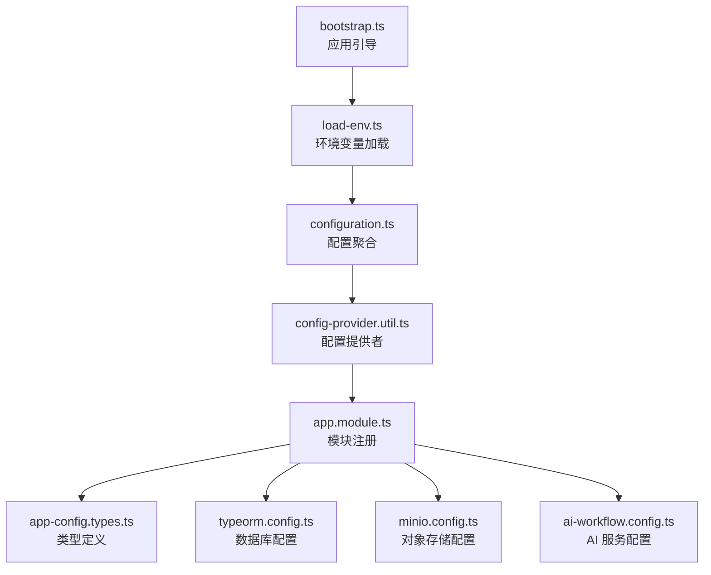
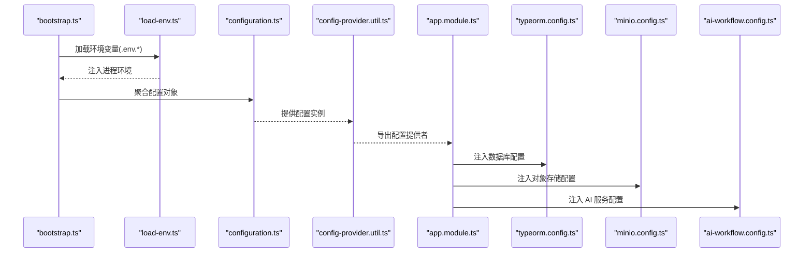
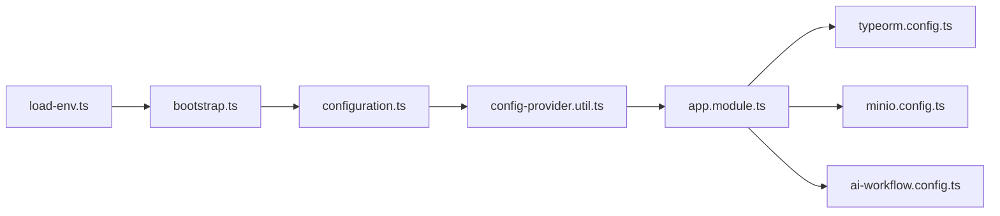

# 配置管理

<cite>
**本文引用的文件**
- [apps/api/src/config/app-config.types.ts](file://apps/api/src/config/app-config.types.ts)
- [apps/api/src/config/app-config.util.ts](file://apps/api/src/config/app-config.util.ts)
- [apps/api/src/config/config-provider.util.ts](file://apps/api/src/config/config-provider.util.ts)
- [apps/api/src/config/configuration.ts](file://apps/api/src/config/configuration.ts)
- [apps/api/src/config/load-env.ts](file://apps/api/src/config/load-env.ts)
- [apps/api/src/bootstrap.ts](file://apps/api/src/bootstrap.ts)
- [apps/api/src/app.module.ts](file://apps/api/src/app.module.ts)
- [apps/api/src/common/typeorm/typeorm.config.ts](file://apps/api/src/common/typeorm/typeorm.config.ts)
- [apps/api/src/common/minio/minio.config.ts](file://apps/api/src/common/minio/minio.config.ts)
- [apps/api/src/common/ai-workflow.config.ts](file://apps/api/src/common/ai-workflow.config.ts)
- [apps/api/env/.env.example](file://apps/api/env/.env.example)
- [apps/api/env/.env.development](file://apps/api/env/.env.development)
- [apps/api/env/.env.production](file://apps/api/env/.env.production)
- [apps/api/env/.env.test](file://apps/api/env/.env.test)
</cite>

## 目录
1. [简介](#简介)
2. [项目结构](#项目结构)
3. [核心组件](#核心组件)
4. [架构总览](#架构总览)
5. [详细组件分析](#详细组件分析)
6. [依赖关系分析](#依赖关系分析)
7. [性能考量](#性能考量)
8. [故障排除指南](#故障排除指南)
9. [结论](#结论)
10. [附录](#附录)

## 简介
本文件面向 CaseForge 的配置管理体系，围绕基于 NestJS 的配置系统进行深入技术说明。内容涵盖环境变量加载、配置验证与类型安全、多环境配置策略（开发、测试、生产）、应用配置、数据库配置、对象存储配置以及 AI 服务配置的实现方式；同时讨论配置热更新、配置加密与敏感信息保护、最佳实践、安全注意事项、故障排除、变更影响评估与回滚策略等主题。

## 项目结构
配置体系主要由以下模块组成：
- 环境变量加载：通过独立的加载器负责从 .env 文件解析键值对，并注入到进程环境中。
- 配置提供者：以 NestJS provider 的形式向应用注入强类型的配置对象。
- 类型定义：集中声明所有配置项的数据结构与默认值，确保类型安全。
- 应用引导：在启动阶段完成环境加载与配置注入，保证后续模块可直接消费配置。
- 各子系统配置：数据库、对象存储、AI 工作流等分别维护各自的配置文件与加载逻辑。

图表来源
- [apps/api/src/bootstrap.ts](file://apps/api/src/bootstrap.ts)
- [apps/api/src/config/load-env.ts](file://apps/api/src/config/load-env.ts)
- [apps/api/src/config/configuration.ts](file://apps/api/src/config/configuration.ts)
- [apps/api/src/config/config-provider.util.ts](file://apps/api/src/config/config-provider.util.ts)
- [apps/api/src/app.module.ts](file://apps/api/src/app.module.ts)
- [apps/api/src/config/app-config.types.ts](file://apps/api/src/config/app-config.types.ts)
- [apps/api/src/common/typeorm/typeorm.config.ts](file://apps/api/src/common/typeorm/typeorm.config.ts)
- [apps/api/src/common/minio/minio.config.ts](file://apps/api/src/common/minio/minio.config.ts)
- [apps/api/src/common/ai-workflow.config.ts](file://apps/api/src/common/ai-workflow.config.ts)

章节来源
- [apps/api/src/bootstrap.ts](file://apps/api/src/bootstrap.ts)
- [apps/api/src/config/load-env.ts](file://apps/api/src/config/load-env.ts)
- [apps/api/src/config/configuration.ts](file://apps/api/src/config/configuration.ts)
- [apps/api/src/config/config-provider.util.ts](file://apps/api/src/config/config-provider.util.ts)
- [apps/api/src/app.module.ts](file://apps/api/src/app.module.ts)
- [apps/api/src/config/app-config.types.ts](file://apps/api/src/config/app-config.types.ts)

## 核心组件
- 环境变量加载器：负责按顺序读取 .env.* 文件，合并键值对并写入进程环境，确保后续配置模块可用。
- 配置聚合器：将分散的配置项统一组织，形成结构化的配置对象。
- 配置提供者：以 NestJS provider 形式导出配置实例，支持模块间注入与依赖。
- 类型定义：集中声明配置字段、默认值与校验规则，保障类型安全与可维护性。
- 子系统配置：
  - 数据库配置：TypeORM 连接参数、迁移与索引策略等。
  - 对象存储配置：MinIO 客户端连接参数与桶策略。
  - AI 服务配置：工作流与推理服务的访问凭据与超时设置。

章节来源
- [apps/api/src/config/app-config.types.ts](file://apps/api/src/config/app-config.types.ts)
- [apps/api/src/config/app-config.util.ts](file://apps/api/src/config/app-config.util.ts)
- [apps/api/src/config/config-provider.util.ts](file://apps/api/src/config/config-provider.util.ts)
- [apps/api/src/config/configuration.ts](file://apps/api/src/config/configuration.ts)
- [apps/api/src/common/typeorm/typeorm.config.ts](file://apps/api/src/common/typeorm/typeorm.config.ts)
- [apps/api/src/common/minio/minio.config.ts](file://apps/api/src/common/minio/minio.config.ts)
- [apps/api/src/common/ai-workflow.config.ts](file://apps/api/src/common/ai-workflow.config.ts)

## 架构总览
下图展示了从启动到各子系统配置生效的整体流程：

图表来源
- [apps/api/src/bootstrap.ts](file://apps/api/src/bootstrap.ts)
- [apps/api/src/config/load-env.ts](file://apps/api/src/config/load-env.ts)
- [apps/api/src/config/configuration.ts](file://apps/api/src/config/configuration.ts)
- [apps/api/src/config/config-provider.util.ts](file://apps/api/src/config/config-provider.util.ts)
- [apps/api/src/app.module.ts](file://apps/api/src/app.module.ts)
- [apps/api/src/common/typeorm/typeorm.config.ts](file://apps/api/src/common/typeorm/typeorm.config.ts)
- [apps/api/src/common/minio/minio.config.ts](file://apps/api/src/common/minio/minio.config.ts)
- [apps/api/src/common/ai-workflow.config.ts](file://apps/api/src/common/ai-workflow.config.ts)

## 详细组件分析

### 环境变量加载与多环境管理
- 加载顺序与覆盖规则：加载器按优先级顺序读取多个 .env 文件，后读取的键会覆盖先前的同名键，从而实现“开发/测试/生产”差异化配置。
- 环境示例：仓库提供了示例与多环境文件，便于本地与 CI/CD 环境快速切换。
- 建议：在容器化部署中，可通过环境变量覆盖 .env 中的默认值，实现零代码变更的配置分发。

章节来源
- [apps/api/env/.env.example](file://apps/api/env/.env.example)
- [apps/api/env/.env.development](file://apps/api/env/.env.development)
- [apps/api/env/.env.test](file://apps/api/env/.env.test)
- [apps/api/env/.env.production](file://apps/api/env/.env.production)
- [apps/api/src/config/load-env.ts](file://apps/api/src/config/load-env.ts)

### 配置聚合与类型安全
- 配置聚合：将分散的配置项统一到一个配置对象中，便于模块化消费与单元测试替换。
- 类型定义：集中声明配置字段、默认值与校验规则，结合工具函数实现运行时校验与转换。
- 类型安全：通过 TypeScript 类型约束，避免误用未定义的配置键，降低运行期错误概率。

章节来源
- [apps/api/src/config/configuration.ts](file://apps/api/src/config/configuration.ts)
- [apps/api/src/config/app-config.types.ts](file://apps/api/src/config/app-config.types.ts)
- [apps/api/src/config/app-config.util.ts](file://apps/api/src/config/app-config.util.ts)

### 配置提供者与模块集成
- 提供者模式：以 NestJS provider 的形式导出配置实例，支持依赖注入与懒加载。
- 模块注册：在应用根模块中注册配置提供者，使其他模块可直接注入配置对象。
- 变更传播：当配置发生变更时，新实例会在下次请求或服务重启时生效。

章节来源
- [apps/api/src/config/config-provider.util.ts](file://apps/api/src/config/config-provider.util.ts)
- [apps/api/src/app.module.ts](file://apps/api/src/app.module.ts)

### 应用配置
- 关键点：应用名称、版本、端口、日志级别、健康检查路径、静态资源目录等。
- 管理策略：通过环境变量与 .env 文件控制，生产环境建议通过密钥管理服务注入敏感值。

章节来源
- [apps/api/src/config/configuration.ts](file://apps/api/src/config/configuration.ts)
- [apps/api/src/config/app-config.types.ts](file://apps/api/src/config/app-config.types.ts)

### 数据库配置（TypeORM）
- 连接参数：主机、端口、数据库名、用户名、密码、字符集与排序规则等。
- 迁移与索引：启动前执行预迁移与索引补丁，确保数据库 Schema 一致性。
- 连接池与事务：根据并发需求调整连接池大小与超时策略。
- 备份与回滚：配合迁移脚本实现 Schema 变更的回滚与恢复。

章节来源
- [apps/api/src/common/typeorm/typeorm.config.ts](file://apps/api/src/common/typeorm/typeorm.config.ts)
- [apps/api/src/common/typeorm/pre-sync-schema-patch.ts](file://apps/api/src/common/typeorm/pre-sync-schema-patch.ts)
- [apps/api/src/common/typeorm/database-indexes.util.ts](file://apps/api/src/common/typeorm/database-indexes.util.ts)

### 对象存储配置（MinIO）
- 连接参数：Endpoint、AccessKey、SecretKey、Region、SSL 开关等。
- 桶策略：根据业务场景设置桶 ACL 与生命周期策略。
- 访问控制：最小权限原则，区分读写权限与过期时间。

章节来源
- [apps/api/src/common/minio/minio.config.ts](file://apps/api/src/common/minio/minio.config.ts)
- [apps/api/src/common/minio/service/minio.service.ts](file://apps/api/src/common/minio/service/minio.service.ts)

### AI 服务配置
- 凭据与端点：模型服务的访问地址、鉴权令牌与超时设置。
- 工作流参数：输入格式、批处理大小与并发度。
- 错误重试：在网络抖动或服务限流时自动重试与退避策略。

章节来源
- [apps/api/src/common/ai-workflow.config.ts](file://apps/api/src/common/ai-workflow.config.ts)
- [apps/api/src/common/ai-workflow/util/workflow-input.util.ts](file://apps/api/src/common/ai-workflow/util/workflow-input.util.ts)

### 配置热更新、加密与敏感信息保护
- 热更新：当前实现采用启动时加载与注入的方式，不支持运行时热更新。若需热更新，可在提供者层引入监听机制并在检测到变更后重建配置实例并触发服务重启。
- 加密：敏感信息建议通过密钥管理服务（如 KMS、Vault）解密后再注入进程环境；或在配置层增加解密中间件，在读取时动态解密。
- 敏感信息保护：避免将密钥写入日志与错误堆栈；使用只读权限的文件系统与最小权限账户运行服务。

章节来源
- [apps/api/src/config/load-env.ts](file://apps/api/src/config/load-env.ts)
- [apps/api/src/common/test-platform/test-platform.typeorm.config.ts](file://apps/api/src/common/test-platform/test-platform.typeorm.config.ts)

## 依赖关系分析
- 启动依赖：bootstrap.ts 依赖 load-env.ts 完成环境加载，再由 configuration.ts 聚合配置并通过 config-provider.util.ts 注入到 app.module.ts。
- 子系统依赖：app.module.ts 在注册配置提供者的同时，也注册了数据库、对象存储与 AI 服务的配置模块。
- 循环依赖：配置模块之间无循环依赖，耦合度低，便于扩展与替换。

图表来源
- [apps/api/src/config/load-env.ts](file://apps/api/src/config/load-env.ts)
- [apps/api/src/bootstrap.ts](file://apps/api/src/bootstrap.ts)
- [apps/api/src/config/configuration.ts](file://apps/api/src/config/configuration.ts)
- [apps/api/src/config/config-provider.util.ts](file://apps/api/src/config/config-provider.util.ts)
- [apps/api/src/app.module.ts](file://apps/api/src/app.module.ts)
- [apps/api/src/common/typeorm/typeorm.config.ts](file://apps/api/src/common/typeorm/typeorm.config.ts)
- [apps/api/src/common/minio/minio.config.ts](file://apps/api/src/common/minio/minio.config.ts)
- [apps/api/src/common/ai-workflow.config.ts](file://apps/api/src/common/ai-workflow.config.ts)

章节来源
- [apps/api/src/bootstrap.ts](file://apps/api/src/bootstrap.ts)
- [apps/api/src/config/load-env.ts](file://apps/api/src/config/load-env.ts)
- [apps/api/src/config/configuration.ts](file://apps/api/src/config/configuration.ts)
- [apps/api/src/config/config-provider.util.ts](file://apps/api/src/config/config-provider.util.ts)
- [apps/api/src/app.module.ts](file://apps/api/src/app.module.ts)

## 性能考量
- 启动性能：将配置加载放在启动早期，避免在运行时重复解析与校验。
- 缓存策略：对只读配置进行缓存，减少重复读取开销。
- 并发与超时：数据库与外部服务的连接池与超时应与负载匹配，防止雪崩效应。
- 日志与监控：记录配置加载耗时与关键参数，便于定位性能瓶颈。

## 故障排除指南
- 环境变量未生效
  - 检查 .env 文件是否存在拼写错误与多余空格。
  - 确认加载顺序是否正确覆盖了预期值。
- 配置类型错误
  - 使用类型定义文件核对字段类型与默认值。
  - 在配置聚合处添加运行时校验与异常抛出。
- 数据库连接失败
  - 核对主机、端口、用户名与密码是否正确。
  - 检查网络连通性与防火墙策略。
- 对象存储不可用
  - 校验 Endpoint 与 SSL 设置，确认桶存在且权限正确。
- AI 服务调用异常
  - 检查凭据与超时设置，确认服务可达与配额充足。

章节来源
- [apps/api/src/config/app-config.types.ts](file://apps/api/src/config/app-config.types.ts)
- [apps/api/src/config/configuration.ts](file://apps/api/src/config/configuration.ts)
- [apps/api/src/common/typeorm/typeorm.config.ts](file://apps/api/src/common/typeorm/typeorm.config.ts)
- [apps/api/src/common/minio/minio.config.ts](file://apps/api/src/common/minio/minio.config.ts)
- [apps/api/src/common/ai-workflow.config.ts](file://apps/api/src/common/ai-workflow.config.ts)

## 结论
CaseForge 的配置体系以 NestJS 提供者为核心，结合环境变量加载与类型安全的配置聚合，实现了清晰、可维护且可扩展的配置管理方案。通过多环境文件与最小权限原则，兼顾了灵活性与安全性。未来可在热更新、加密与审计方面进一步增强，以满足更高要求的生产环境。

## 附录
- 最佳实践
  - 将敏感信息放入密钥管理服务，不在代码库中保存明文。
  - 使用 .env.example 作为模板，确保团队成员遵循统一规范。
  - 为每个环境维护独立的 .env.* 文件，避免跨环境污染。
  - 在 CI/CD 中对配置进行静态扫描与合规检查。
- 变更影响评估与回滚策略
  - 变更影响评估：识别受影响的模块与接口，评估数据库迁移风险与外部服务依赖。
  - 回滚策略：保留上一版本的配置快照与迁移脚本，必要时回滚至前一版本并执行反向迁移。