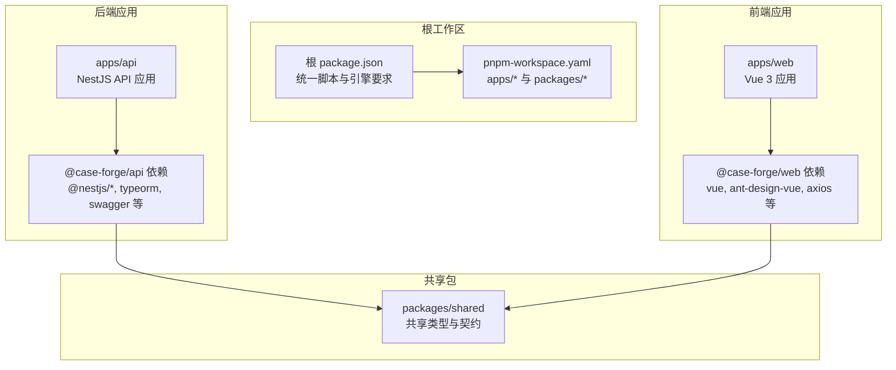
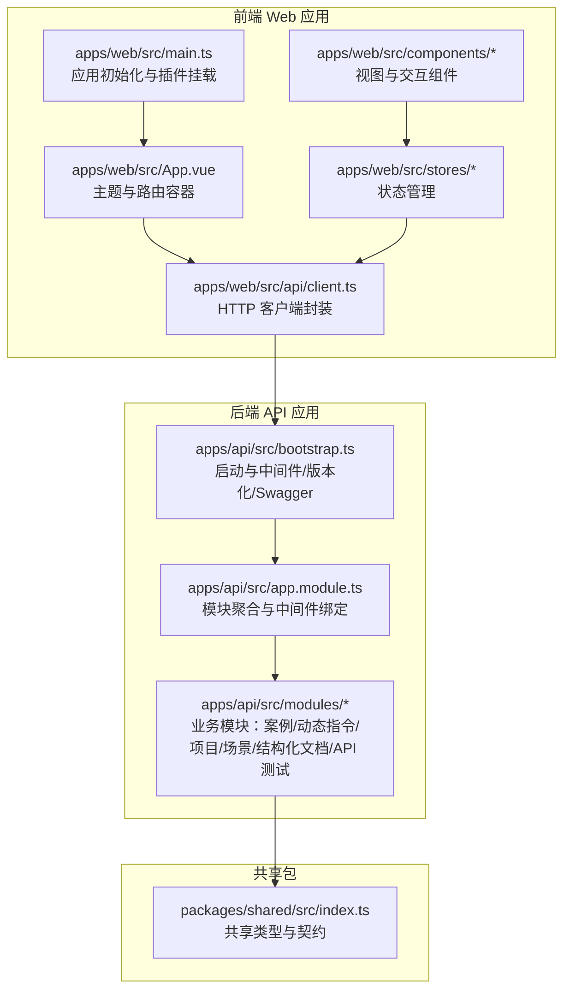
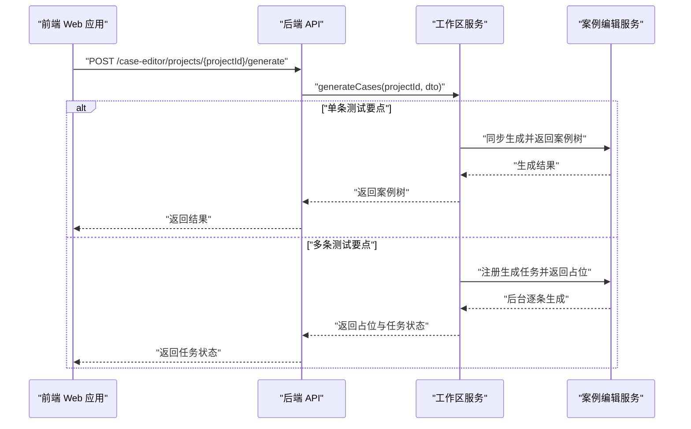
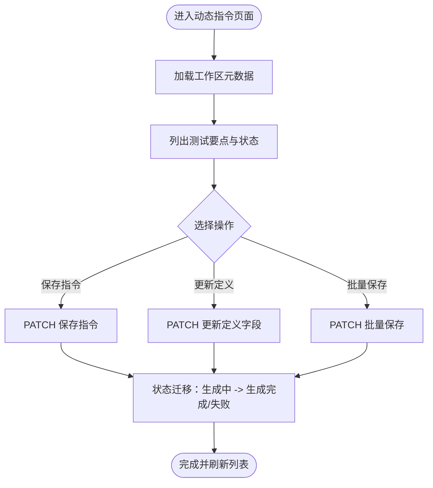
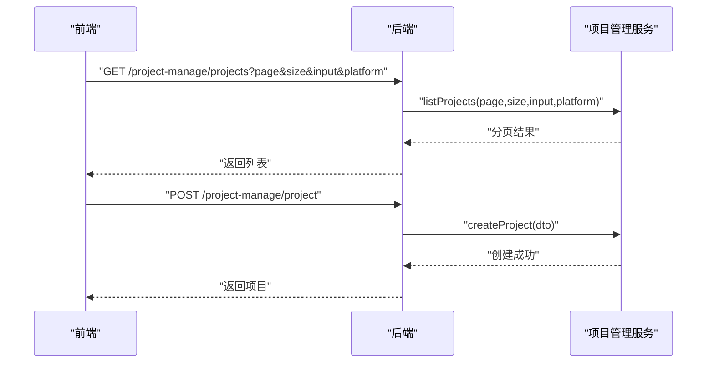
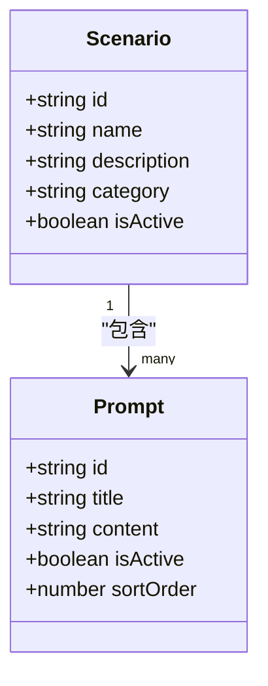
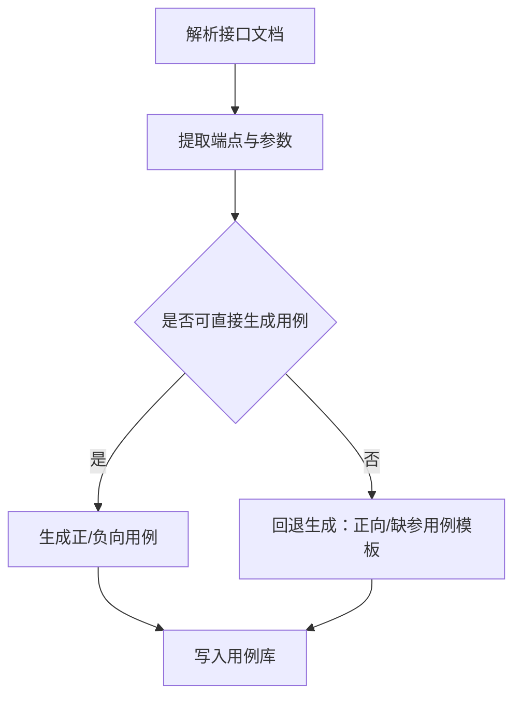
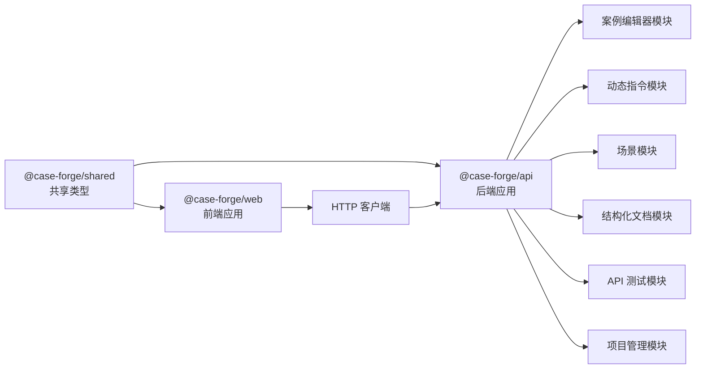

# 项目概述

<cite>
**本文引用的文件**
- [package.json](file://package.json)
- [pnpm-workspace.yaml](file://pnpm-workspace.yaml)
- [apps/api/package.json](file://apps/api/package.json)
- [apps/web/package.json](file://apps/web/package.json)
- [packages/shared/package.json](file://packages/shared/package.json)
- [apps/api/src/bootstrap.ts](file://apps/api/src/bootstrap.ts)
- [apps/api/src/app.module.ts](file://apps/api/src/app.module.ts)
- [apps/web/src/main.ts](file://apps/web/src/main.ts)
- [apps/web/src/App.vue](file://apps/web/src/App.vue)
- [packages/shared/src/index.ts](file://packages/shared/src/index.ts)
- [apps/api/src/modules/case-editor/controller/case-editor.controller.ts](file://apps/api/src/modules/case-editor/controller/case-editor.controller.ts)
- [apps/api/src/modules/case-editor/service/case-editor.service.ts](file://apps/api/src/modules/case-editor/service/case-editor.service.ts)
- [apps/api/src/modules/case-editor/entity/case-editor.entity.ts](file://apps/api/src/modules/case-editor/entity/case-editor.entity.ts)
- [apps/api/src/modules/case-editor/service/case-workspace.service.ts](file://apps/api/src/modules/case-editor/service/case-workspace.service.ts)
- [apps/api/src/modules/case-editor/service/case-pipeline.service.ts](file://apps/api/src/modules/case-editor/service/case-pipeline.service.ts)
- [apps/api/src/modules/dynamic-instruct/controller/dynamic-instruct.controller.ts](file://apps/api/src/modules/dynamic-instruct/controller/dynamic-instruct.controller.ts)
- [apps/api/src/modules/dynamic-instruct/service/dynamic-instruct.service.ts](file://apps/api/src/modules/dynamic-instruct/service/dynamic-instruct.service.ts)
- [apps/api/src/modules/dynamic-instruct/entity/test-point-instruct.entity.ts](file://apps/api/src/modules/dynamic-instruct/entity/test-point-instruct.entity.ts)
- [apps/api/src/modules/project-manage/controller/project-manage.controller.ts](file://apps/api/src/modules/project-manage/controller/project-manage.controller.ts)
- [apps/api/src/modules/project-manage/service/project-manage.service.ts](file://apps/api/src/modules/project-manage/service/project-manage.service.ts)
- [apps/api/src/modules/scenario/service/scenario.service.ts](file://apps/api/src/modules/scenario/service/scenario.service.ts)
- [apps/api/src/modules/api-test/index.ts](file://apps/api/src/modules/api-test/index.ts)
- [apps/api/src/modules/api-test/util/case-fallback.generator.ts](file://apps/api/src/modules/api-test/util/case-fallback.generator.ts)
- [apps/web/src/api/client.ts](file://apps/web/src/api/client.ts)
- [apps/web/src/components/ConstraintBuilder.vue](file://apps/web/src/components/ConstraintBuilder.vue)
- [apps/web/src/stores/caseForge.ts](file://apps/web/src/stores/caseForge.ts)
</cite>

## 目录
1. [引言](#引言)
2. [项目结构](#项目结构)
3. [核心组件](#核心组件)
4. [架构总览](#架构总览)
5. [详细组件分析](#详细组件分析)
6. [依赖关系分析](#依赖关系分析)
7. [性能考量](#性能考量)
8. [故障排查指南](#故障排查指南)
9. [结论](#结论)
10. [附录](#附录)

## 引言
CaseForge 是一个面向智能案例生成与 API 测试管理的协作平台，采用 NestJS + Vue 3 全栈架构，并通过 Monorepo 统一管理前后端与共享包。项目以“结构化文档驱动 + 动态指令 + AI 工作流”为核心，围绕“案例编辑器、API 测试、动态指令、项目管理、场景管理、结构化文档处理”六大模块构建，旨在提升测试用例设计效率与质量，支撑团队在复杂业务下的高效协作。

## 项目结构
项目采用 pnpm workspace 的 Monorepo 结构，将后端 API 应用、前端 Web 应用与共享包进行统一管理与版本控制，实现跨应用的依赖复用与一致的开发体验。

- 根目录脚本与工作区配置
  - 根 package.json 定义了统一的开发与构建脚本，便于一键启动 API 与 Web 应用，并提供共享包构建前置步骤。
  - pnpm-workspace.yaml 将 apps/* 与 packages/* 纳入工作区，确保依赖解析与构建顺序正确。

- 应用与包分布
  - apps/api：基于 NestJS 的后端服务，负责业务模块编排、数据库与中间件集成、API 文档与版本化。
  - apps/web：基于 Vue 3 的前端应用，提供案例编辑、动态指令、API 测试、项目管理等交互界面。
  - packages/shared：共享 TypeScript 类型与契约，保证前后端数据模型一致性与跨应用复用。

**图表来源**
- [package.json:1-22](file://package.json#L1-L22)
- [pnpm-workspace.yaml:1-4](file://pnpm-workspace.yaml#L1-L4)
- [apps/api/package.json:1-62](file://apps/api/package.json#L1-L62)
- [apps/web/package.json:1-36](file://apps/web/package.json#L1-L36)
- [packages/shared/package.json:1-25](file://packages/shared/package.json#L1-L25)

**章节来源**
- [package.json:1-22](file://package.json#L1-L22)
- [pnpm-workspace.yaml:1-4](file://pnpm-workspace.yaml#L1-L4)

## 核心组件
- 案例编辑器（Case Editor）
  - 职责：接收测试要点与约束，驱动 AI 工作流生成案例树，支持批量异步生成、取消生成、思维导图扩展数据持久化。
  - 关键点：通过工作区服务协调生成流程，持久化案例树与运行摘要，支持与测试平台同步导出。

- 动态指令（Dynamic Instruct）
  - 职责：管理测试要点的自然语言约束与提示词状态，支持单点/批量保存、定义更新与工作区元数据查询。
  - 关键点：测试要点与指令一对一，状态机驱动生成进度与质量反馈。

- 项目管理（Project Manage）
  - 职责：提供项目 CRUD、分页检索、平台维度过滤与级联删除。
  - 关键点：需求编号校验与用户范围审计，保障数据一致性与权限隔离。

- 场景管理（Scenario）
  - 职责：场景与提示词的维护与同步保存，支持系统预置与用户自维护。
  - 关键点：场景与提示词的层级关系与排序，支持激活/禁用控制。

- 结构化文档处理（Struct Doc）
  - 职责：文档解析、分块与需求抽取，支撑案例生成的输入基座。
  - 关键点：与案例编辑器联动，形成“文档 -> 需求 -> 案例”的闭环。

- API 测试（API Test）
  - 职责：接口文档、用例、环境、执行集、报告与事务管理。
  - 关键点：AI 推荐与回退用例生成，支持与案例树的双向映射。

**章节来源**
- [apps/api/src/modules/case-editor/controller/case-editor.controller.ts:30-69](file://apps/api/src/modules/case-editor/controller/case-editor.controller.ts#L30-L69)
- [apps/api/src/modules/case-editor/service/case-editor.service.ts:44-483](file://apps/api/src/modules/case-editor/service/case-editor.service.ts#L44-L483)
- [apps/api/src/modules/dynamic-instruct/controller/dynamic-instruct.controller.ts:1-107](file://apps/api/src/modules/dynamic-instruct/controller/dynamic-instruct.controller.ts#L1-L107)
- [apps/api/src/modules/project-manage/controller/project-manage.controller.ts:1-118](file://apps/api/src/modules/project-manage/controller/project-manage.controller.ts#L1-L118)
- [apps/api/src/modules/scenario/service/scenario.service.ts:1-96](file://apps/api/src/modules/scenario/service/scenario.service.ts#L1-L96)
- [apps/api/src/modules/api-test/index.ts:25-63](file://apps/api/src/modules/api-test/index.ts#L25-L63)

## 架构总览
后端以 NestJS 为核心，通过模块化组织业务域，统一启用 Swagger 文档、URI 版本化与全局验证管道。前端基于 Vue 3 + Pinia + Vue Router，使用 Ant Design Vue 提供企业级 UI 组件，通过 Axios 与后端 API 通信。

**图表来源**
- [apps/web/src/main.ts:1-20](file://apps/web/src/main.ts#L1-L20)
- [apps/web/src/App.vue:1-13](file://apps/web/src/App.vue#L1-L13)
- [apps/web/src/api/client.ts:492-572](file://apps/web/src/api/client.ts#L492-L572)
- [apps/api/src/bootstrap.ts:18-64](file://apps/api/src/bootstrap.ts#L18-L64)
- [apps/api/src/app.module.ts:21-47](file://apps/api/src/app.module.ts#L21-L47)
- [packages/shared/src/index.ts:1-156](file://packages/shared/src/index.ts#L1-L156)

**章节来源**
- [apps/web/src/main.ts:1-20](file://apps/web/src/main.ts#L1-L20)
- [apps/web/src/App.vue:1-13](file://apps/web/src/App.vue#L1-L13)
- [apps/api/src/bootstrap.ts:18-64](file://apps/api/src/bootstrap.ts#L18-L64)
- [apps/api/src/app.module.ts:21-47](file://apps/api/src/app.module.ts#L21-L47)
- [packages/shared/src/index.ts:1-156](file://packages/shared/src/index.ts#L1-L156)

## 详细组件分析

### 案例编辑器：从需求到案例树的生成流水线
- 生成触发与取消
  - 前端通过生成接口提交测试要点与模型参数，后端工作区服务根据数量决定同步或异步路径；支持主动取消生成。
- 持久化与运行摘要
  - 生成结果以“运行摘要 + 案例树”的形式持久化，支持后续检索与对比。
- 案例树与思维导图扩展
  - 案例树节点包含元数据与折叠状态，同时支持思维导图摘要等扩展数据，便于可视化与知识沉淀。

**图表来源**
- [apps/api/src/modules/case-editor/controller/case-editor.controller.ts:30-69](file://apps/api/src/modules/case-editor/controller/case-editor.controller.ts#L30-L69)
- [apps/api/src/modules/case-editor/service/case-workspace.service.ts:36-67](file://apps/api/src/modules/case-editor/service/case-workspace.service.ts#L36-L67)
- [apps/api/src/modules/case-editor/service/case-editor.service.ts:64-104](file://apps/api/src/modules/case-editor/service/case-editor.service.ts#L64-L104)

**章节来源**
- [apps/api/src/modules/case-editor/controller/case-editor.controller.ts:30-69](file://apps/api/src/modules/case-editor/controller/case-editor.controller.ts#L30-L69)
- [apps/api/src/modules/case-editor/service/case-editor.service.ts:64-104](file://apps/api/src/modules/case-editor/service/case-editor.service.ts#L64-L104)
- [apps/api/src/modules/case-editor/entity/case-editor.entity.ts:43-102](file://apps/api/src/modules/case-editor/entity/case-editor.entity.ts#L43-L102)

### 动态指令：测试要点的自然语言约束与状态机
- 工作区元数据与状态排序
  - 提供测试要点的系统/模块/状态等筛选与排序能力，状态机驱动“待编辑 -> 已编辑 -> 再编辑 -> 生成中 -> 生成完成/失败”。
- 单点/批量保存与定义更新
  - 支持对单个测试要点的指令保存与定义字段更新，批量保存用于快速推进生成任务。

**图表来源**
- [apps/api/src/modules/dynamic-instruct/controller/dynamic-instruct.controller.ts:32-107](file://apps/api/src/modules/dynamic-instruct/controller/dynamic-instruct.controller.ts#L32-L107)
- [apps/api/src/modules/dynamic-instruct/service/dynamic-instruct.service.ts:29-67](file://apps/api/src/modules/dynamic-instruct/service/dynamic-instruct.service.ts#L29-L67)
- [apps/api/src/modules/dynamic-instruct/entity/test-point-instruct.entity.ts:16-53](file://apps/api/src/modules/dynamic-instruct/entity/test-point-instruct.entity.ts#L16-L53)

**章节来源**
- [apps/api/src/modules/dynamic-instruct/controller/dynamic-instruct.controller.ts:32-107](file://apps/api/src/modules/dynamic-instruct/controller/dynamic-instruct.controller.ts#L32-L107)
- [apps/api/src/modules/dynamic-instruct/service/dynamic-instruct.service.ts:29-67](file://apps/api/src/modules/dynamic-instruct/service/dynamic-instruct.service.ts#L29-L67)
- [apps/api/src/modules/dynamic-instruct/entity/test-point-instruct.entity.ts:16-53](file://apps/api/src/modules/dynamic-instruct/entity/test-point-instruct.entity.ts#L16-L53)

### 项目管理：统一入口与平台维度
- 项目 CRUD 与分页检索
  - 支持按名称/需求编号模糊搜索、分页与平台维度过滤；创建时对需求编号进行格式校验。
- 级联删除与审计
  - 删除项目时级联清理相关数据，结合用户范围审计保障数据安全。

**图表来源**
- [apps/api/src/modules/project-manage/controller/project-manage.controller.ts:62-86](file://apps/api/src/modules/project-manage/controller/project-manage.controller.ts#L62-L86)
- [apps/api/src/modules/project-manage/controller/project-manage.controller.ts:31-36](file://apps/api/src/modules/project-manage/controller/project-manage.controller.ts#L31-L36)
- [apps/api/src/modules/project-manage/service/project-manage.service.ts:1-30](file://apps/api/src/modules/project-manage/service/project-manage.service.ts#L1-L30)

**章节来源**
- [apps/api/src/modules/project-manage/controller/project-manage.controller.ts:62-86](file://apps/api/src/modules/project-manage/controller/project-manage.controller.ts#L62-L86)
- [apps/api/src/modules/project-manage/controller/project-manage.controller.ts:31-36](file://apps/api/src/modules/project-manage/controller/project-manage.controller.ts#L31-L36)
- [apps/api/src/modules/project-manage/service/project-manage.service.ts:1-30](file://apps/api/src/modules/project-manage/service/project-manage.service.ts#L1-L30)

### 场景管理：提示词库与场景维护
- 场景与提示词的层级关系
  - 场景包含多个提示词，支持创建、更新、激活/禁用与同步保存。
- 系统预置与用户自维护
  - 结合用户范围与系统维度，区分可见性与可编辑范围。

**图表来源**
- [apps/api/src/modules/scenario/service/scenario.service.ts:37-96](file://apps/api/src/modules/scenario/service/scenario.service.ts#L37-L96)

**章节来源**
- [apps/api/src/modules/scenario/service/scenario.service.ts:37-96](file://apps/api/src/modules/scenario/service/scenario.service.ts#L37-L96)

### 结构化文档处理：从文档到案例的桥梁
- 文档解析与分块
  - 对结构化文档进行解析与分块，抽取需求与风险，形成可被案例编辑器消费的输入。
- 与案例生成的协同
  - 生成约束中的“模块/场景标签/分组策略”直接影响案例树的组织方式。

**章节来源**
- [apps/api/src/modules/case-editor/service/case-pipeline.service.ts:717-763](file://apps/api/src/modules/case-editor/service/case-pipeline.service.ts#L717-L763)

### API 测试：用例与执行的闭环
- 用例回退生成
  - 当无法直接由结构化文档生成时，提供正向/反向回退用例模板，降低生成门槛。
- 模块化导出
  - API 测试模块统一导出服务，便于在其他模块中复用。

**图表来源**
- [apps/api/src/modules/api-test/util/case-fallback.generator.ts:1-60](file://apps/api/src/modules/api-test/util/case-fallback.generator.ts#L1-L60)
- [apps/api/src/modules/api-test/index.ts:25-63](file://apps/api/src/modules/api-test/index.ts#L25-L63)

**章节来源**
- [apps/api/src/modules/api-test/util/case-fallback.generator.ts:1-60](file://apps/api/src/modules/api-test/util/case-fallback.generator.ts#L1-L60)
- [apps/api/src/modules/api-test/index.ts:25-63](file://apps/api/src/modules/api-test/index.ts#L25-L63)

## 依赖关系分析
- 前后端依赖与共享契约
  - 前端与后端均依赖共享包，确保类型一致与跨应用复用。
- 后端模块耦合
  - 案例编辑器依赖动态指令、场景、结构化文档与测试平台模块，体现“文档 -> 指令 -> 生成 -> 导出”的链路。
- 数据与持久化
  - 案例编辑器实体记录生成运行摘要与思维导图扩展数据，测试要点指令实体承载状态机与自然语言约束。

**图表来源**
- [apps/api/package.json:20-47](file://apps/api/package.json#L20-L47)
- [apps/web/package.json:15-27](file://apps/web/package.json#L15-L27)
- [packages/shared/package.json:1-25](file://packages/shared/package.json#L1-L25)
- [apps/api/src/app.module.ts:10-19](file://apps/api/src/app.module.ts#L10-L19)

**章节来源**
- [apps/api/package.json:20-47](file://apps/api/package.json#L20-L47)
- [apps/web/package.json:15-27](file://apps/web/package.json#L15-L27)
- [packages/shared/package.json:1-25](file://packages/shared/package.json#L1-L25)
- [apps/api/src/app.module.ts:10-19](file://apps/api/src/app.module.ts#L10-L19)

## 性能考量
- 生成并发与队列调度
  - 案例生成采用公平调度与并发控制，避免资源争用；支持取消与中断标记，减少无效计算。
- 批量持久化
  - 案例树批量插入与分块处理，降低数据库压力，提升大体量树的落库效率。
- 请求体大小与版本化
  - 后端设置合理的请求体上限与 URI 版本化，兼顾易用性与稳定性。

**章节来源**
- [apps/api/src/modules/case-editor/service/case-editor.service.ts:44-483](file://apps/api/src/modules/case-editor/service/case-editor.service.ts#L44-L483)

## 故障排查指南
- 生成卡顿或中断
  - 检查生成任务状态与取消标记，确认是否存在大量并发任务导致资源紧张。
- 案例树缺失或不完整
  - 核对持久化批次与树收集逻辑，确认事务边界与分层遍历是否完整。
- 动态指令状态异常
  - 校验状态机迁移顺序与工作区元数据查询，确保状态排序与筛选条件正确。
- 项目删除后残留数据
  - 确认级联删除流程与用户范围审计是否生效，检查删除接口调用链。

**章节来源**
- [apps/api/src/modules/case-editor/service/case-editor.service.ts:431-458](file://apps/api/src/modules/case-editor/service/case-editor.service.ts#L431-L458)
- [apps/api/src/modules/dynamic-instruct/service/dynamic-instruct.service.ts:29-67](file://apps/api/src/modules/dynamic-instruct/service/dynamic-instruct.service.ts#L29-L67)
- [apps/api/src/modules/project-manage/service/project-manage.service.ts:1-30](file://apps/api/src/modules/project-manage/service/project-manage.service.ts#L1-L30)

## 结论
CaseForge 通过 Monorepo 与共享包实现了前后端的一致性与可复用性，围绕“结构化文档 -> 动态指令 -> 案例生成 -> API 测试 -> 项目管理”的闭环，提供从需求到用例再到执行的全链路能力。其模块化设计与状态机驱动的生成流程，既保证了工程化效率，也为未来的扩展与演进提供了清晰的路径。

## 附录
- 技术选型说明
  - NestJS：模块化、装饰器与依赖注入，适合大型后端工程；Swagger 与 URI 版本化提升 API 可维护性。
  - Vue 3 + Pinia + Vue Router：组合式 API 与状态管理，适配复杂交互与多视图协作。
  - pnpm workspace：Monorepo 管理与依赖复用，统一脚本与类型检查。
  - TypeORM：实体与关系建模，配合分块与事务保障数据一致性。
  - Ant Design Vue：企业级 UI 组件，提升开发与用户体验。